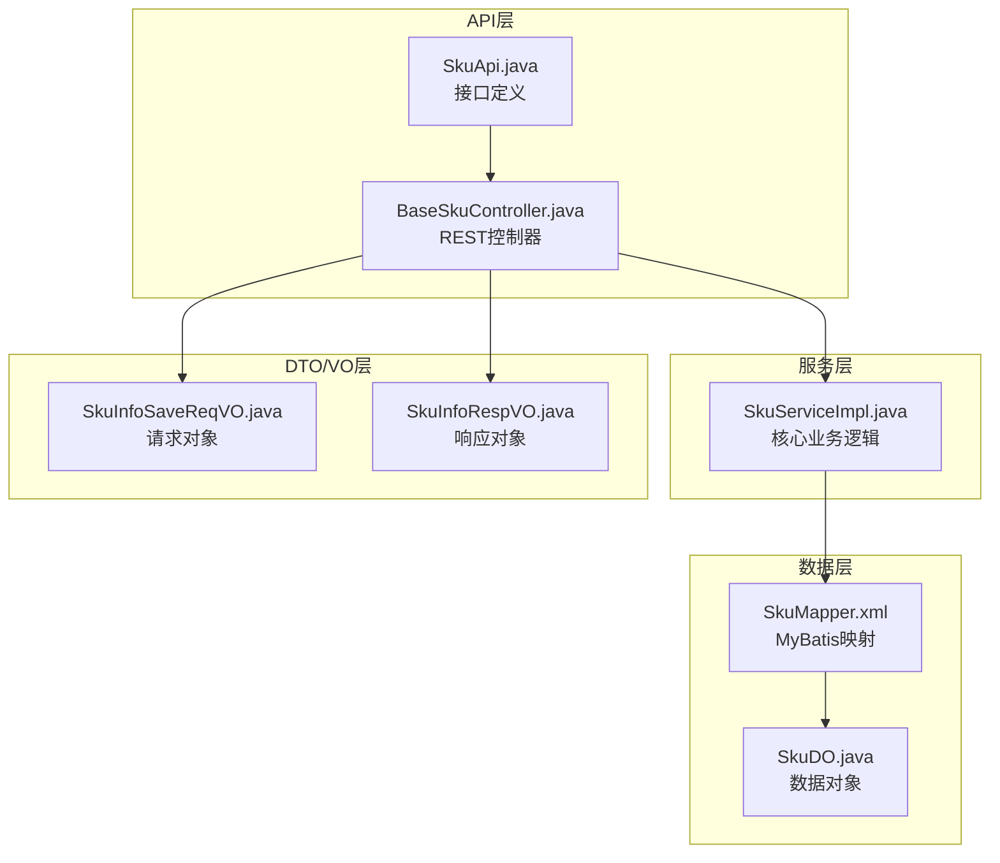
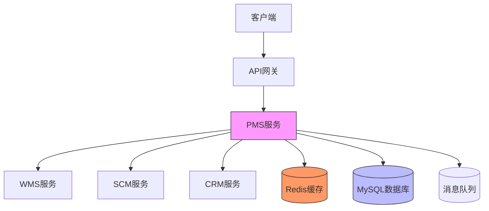
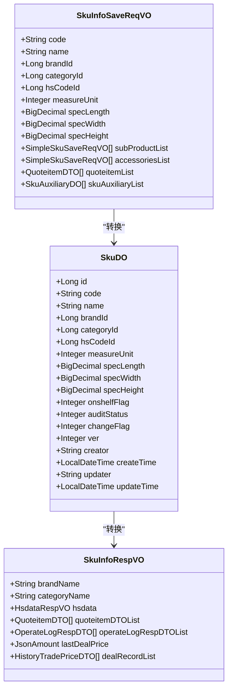
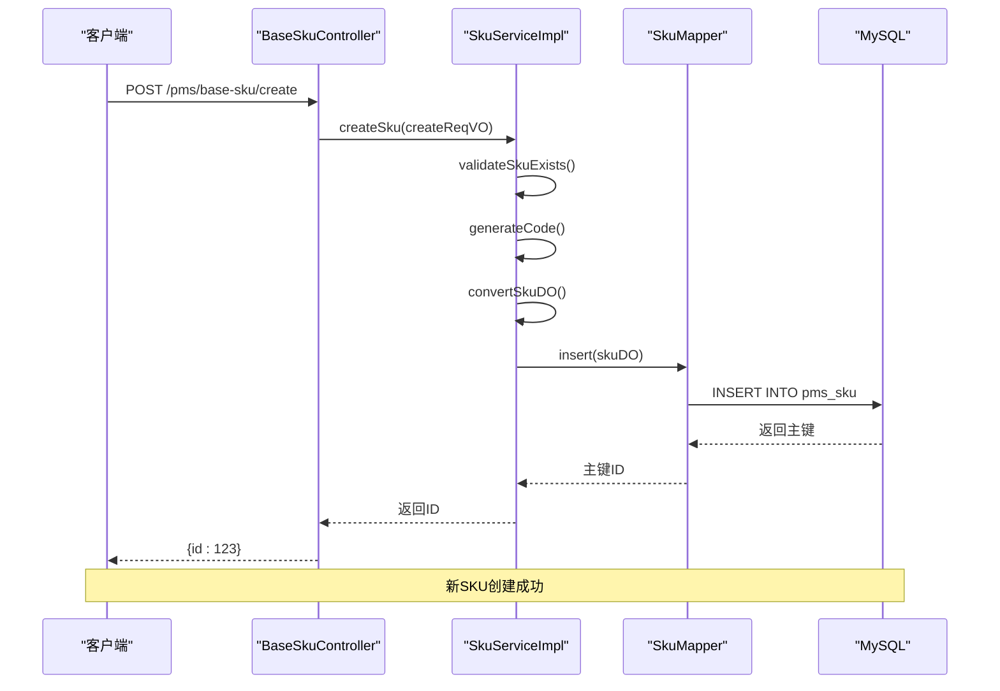
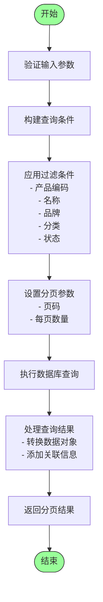
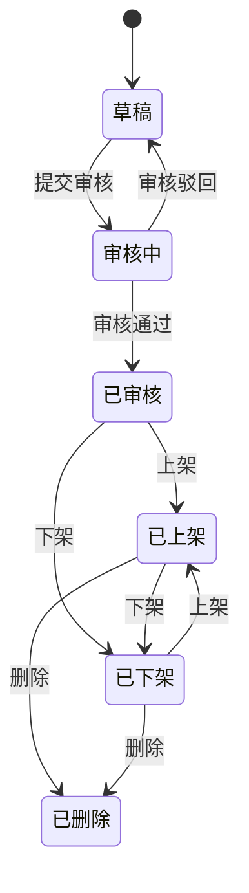

# SKU管理API

<cite>
**本文档引用文件**  
- [SkuApi.java](file://eplus-module-pms/eplus-module-pms-api/src/main/java/com/syj/eplus/module/pms/api/sku/SkuApi.java)
- [BaseSkuController.java](file://eplus-module-pms/eplus-module-pms-biz/src/main/java/com/syj/eplus/module/pms/controller/admin/sku/BaseSkuController.java)
- [SkuServiceImpl.java](file://eplus-module-pms/eplus-module-pms-biz/src/main/java/com/syj/eplus/module/pms/service/sku/SkuServiceImpl.java)
- [SkuInfoSaveReqVO.java](file://eplus-module-pms/eplus-module-pms-biz/src/main/java/com/syj/eplus/module/pms/controller/admin/sku/vo/SkuInfoSaveReqVO.java)
- [SkuPageReqVO.java](file://eplus-module-pms/eplus-module-pms-biz/src/main/java/com/syj/eplus/module/pms/controller/admin/sku/vo/SkuPageReqVO.java)
- [SkuInfoRespVO.java](file://eplus-module-pms/eplus-module-pms-biz/src/main/java/com/syj/eplus/module/pms/controller/admin/sku/vo/SkuInfoRespVO.java)
- [SkuMapper.xml](file://eplus-module-pms/eplus-module-pms-biz/src/main/resources/mapper/SkuMapper.xml)
</cite>

## 目录
1. [简介](#简介)
2. [项目结构](#项目结构)
3. [核心组件](#核心组件)
4. [架构概述](#架构概述)
5. [详细组件分析](#详细组件分析)
6. [依赖分析](#依赖分析)
7. [性能考虑](#性能考虑)
8. [故障排除指南](#故障排除指南)
9. [结论](#结论)

## 简介
SKU管理API是企业产品管理系统（PMS）的核心模块，提供全面的SKU生命周期管理功能。该API支持SKU的增删改查、状态管理、批量操作等RESTful接口，满足新产品上架、信息更新、库存同步等典型业务场景需求。系统采用微服务架构，通过标准化接口与其他模块（如WMS、SCM）集成，确保数据一致性与业务协同。

## 项目结构
SKU管理功能主要分布在eplus-module-pms模块中，遵循典型的分层架构设计。API接口定义位于api子模块，业务逻辑实现位于biz子模块，数据访问层使用MyBatis进行数据库操作。系统通过BPM流程引擎实现SKU变更的审批流程，确保关键操作的合规性。



**图表来源**  
- [SkuApi.java](file://eplus-module-pms/eplus-module-pms-api/src/main/java/com/syj/eplus/module/pms/api/sku/SkuApi.java)
- [BaseSkuController.java](file://eplus-module-pms/eplus-module-pms-biz/src/main/java/com/syj/eplus/module/pms/controller/admin/sku/BaseSkuController.java)
- [SkuServiceImpl.java](file://eplus-module-pms/eplus-module-pms-biz/src/main/java/com/syj/eplus/module/pms/service/sku/SkuServiceImpl.java)
- [SkuMapper.xml](file://eplus-module-pms/eplus-module-pms-biz/src/main/resources/mapper/SkuMapper.xml)

**章节来源**  
- [SkuApi.java](file://eplus-module-pms/eplus-module-pms-api/src/main/java/com/syj/eplus/module/pms/api/sku/SkuApi.java)
- [BaseSkuController.java](file://eplus-module-pms/eplus-module-pms-biz/src/main/java/com/syj/eplus/module/pms/controller/admin/sku/BaseSkuController.java)

## 核心组件

SKU管理API的核心组件包括REST控制器、服务实现类和数据访问对象。系统通过SkuServiceImpl类实现主要业务逻辑，包括SKU创建、更新、删除、状态变更等操作。BaseSkuController提供标准化的RESTful接口，支持增删改查、分页查询、批量操作等功能。数据模型设计支持基础产品、客户产品、组合产品等多种产品类型，满足复杂的业务需求。

**章节来源**  
- [SkuServiceImpl.java](file://eplus-module-pms/eplus-module-pms-biz/src/main/java/com/syj/eplus/module/pms/service/sku/SkuServiceImpl.java)
- [BaseSkuController.java](file://eplus-module-pms/eplus-module-pms-biz/src/main/java/com/syj/eplus/module/pms/controller/admin/sku/BaseSkuController.java)

## 架构概述

SKU管理系统的架构设计遵循微服务原则，各组件职责清晰，耦合度低。系统通过API网关对外提供服务，内部通过服务调用实现模块间通信。数据持久化采用MySQL数据库，通过MyBatis实现对象关系映射。缓存机制用于提升查询性能，消息队列支持异步处理和系统解耦。



**图表来源**  
- [SkuApi.java](file://eplus-module-pms/eplus-module-pms-api/src/main/java/com/syj/eplus/module/pms/api/sku/SkuApi.java)
- [SkuServiceImpl.java](file://eplus-module-pms/eplus-module-pms-biz/src/main/java/com/syj/eplus/module/pms/service/sku/SkuServiceImpl.java)

## 详细组件分析

### SKU创建与更新分析
SKU创建和更新功能是产品管理的核心操作，系统通过统一的接口处理产品信息的持久化。创建操作需要验证产品编码的唯一性，更新操作支持字段级变更追踪，记录操作日志。

#### 类图


**图表来源**  
- [SkuInfoSaveReqVO.java](file://eplus-module-pms/eplus-module-pms-biz/src/main/java/com/syj/eplus/module/pms/controller/admin/sku/vo/SkuInfoSaveReqVO.java)
- [SkuDO.java](file://eplus-module-pms/eplus-module-pms-biz/src/main/java/com/syj/eplus/module/pms/dal/dataobject/sku/SkuDO.java)
- [SkuInfoRespVO.java](file://eplus-module-pms/eplus-module-pms-biz/src/main/java/com/syj/eplus/module/pms/controller/admin/sku/vo/SkuInfoRespVO.java)

#### 创建流程序列图


**图表来源**  
- [BaseSkuController.java](file://eplus-module-pms/eplus-module-pms-biz/src/main/java/com/syj/eplus/module/pms/controller/admin/sku/BaseSkuController.java#L48-L53)
- [SkuServiceImpl.java](file://eplus-module-pms/eplus-module-pms-biz/src/main/java/com/syj/eplus/module/pms/service/sku/SkuServiceImpl.java#L121-L150)

**章节来源**  
- [SkuInfoSaveReqVO.java](file://eplus-module-pms/eplus-module-pms-biz/src/main/java/com/syj/eplus/module/pms/controller/admin/sku/vo/SkuInfoSaveReqVO.java)
- [SkuInfoRespVO.java](file://eplus-module-pms/eplus-module-pms-biz/src/main/java/com/syj/eplus/module/pms/controller/admin/sku/vo/SkuInfoRespVO.java)

### 查询与分页分析
SKU查询功能支持多维度过滤、分页和排序，满足复杂的查询需求。系统通过SkuPageReqVO封装查询条件，支持按产品编码、名称、品牌、分类、状态等多种条件组合查询。

#### 查询流程图


**图表来源**  
- [SkuPageReqVO.java](file://eplus-module-pms/eplus-module-pms-biz/src/main/java/com/syj/eplus/module/pms/controller/admin/sku/vo/SkuPageReqVO.java)
- [BaseSkuController.java](file://eplus-module-pms/eplus-module-pms-biz/src/main/java/com/syj/eplus/module/pms/controller/admin/sku/BaseSkuController.java#L90-L97)

### 状态管理分析
SKU状态管理是产品生命周期控制的关键，系统通过状态机模式管理SKU的不同状态，包括草稿、审核中、已审核、已上架、已下架等状态。

#### 状态转换图


**图表来源**  
- [BaseSkuController.java](file://eplus-module-pms/eplus-module-pms-biz/src/main/java/com/syj/eplus/module/pms/controller/admin/sku/BaseSkuController.java#L227-L232)
- [SkuServiceImpl.java](file://eplus-module-pms/eplus-module-pms-biz/src/main/java/com/syj/eplus/module/pms/service/sku/SkuServiceImpl.java#L1067-L1080)

## 依赖分析

SKU管理模块与其他多个业务模块存在紧密的依赖关系，通过API接口实现服务调用和数据共享。系统依赖关系体现了微服务架构的特点，各模块职责清晰，通过标准化接口进行通信。

```mermaid
graph TD
PMS[PMS模块] --> WMS[WMS模块]
PMS --> SCM[SCM模块]
PMS --> CRM[CRM模块]
PMS --> SMS[SMS模块]
PMS --> INFRA[INFRA模块]
PMS --> BPM[BPM模块]
WMS --> "库存管理"
SCM --> "采购管理"
CRM --> "客户管理"
SMS --> "销售管理"
INFRA --> "基础数据"
BPM --> "流程审批"
style PMS fill:#f9f,stroke:#333
```

**图表来源**  
- [SkuApi.java](file://eplus-module-pms/eplus-module-pms-api/src/main/java/com/syj/eplus/module/pms/api/sku/SkuApi.java)
- [SkuServiceImpl.java](file://eplus-module-pms/eplus-module-pms-biz/src/main/java/com/syj/eplus/module/pms/service/sku/SkuServiceImpl.java)

**章节来源**  
- [SkuApi.java](file://eplus-module-pms/eplus-module-pms-api/src/main/java/com/syj/eplus/module/pms/api/sku/SkuApi.java)
- [SkuServiceImpl.java](file://eplus-module-pms/eplus-module-pms-biz/src/main/java/com/syj/eplus/module/pms/service/sku/SkuServiceImpl.java)

## 性能考虑

SKU管理系统的性能优化主要体现在以下几个方面：数据库查询优化、缓存机制、批量处理和异步操作。系统通过分页查询避免大数据量加载，使用Redis缓存热点数据，支持批量操作减少网络开销，关键业务采用异步处理提升响应速度。

- **数据库优化**：合理设计索引，避免全表扫描
- **缓存策略**：常用数据（如品牌、分类）缓存到Redis
- **批量处理**：支持批量创建、更新、删除操作
- **异步操作**：耗时操作（如文件处理）采用消息队列异步执行
- **连接池**：使用数据库连接池提高资源利用率

## 故障排除指南

### 常见错误及解决方案
| 错误代码 | 错误信息 | 原因分析 | 解决方案 |
|--------|--------|--------|--------|
| 1_120_000_017 | 自营产品货号已经存在 | 产品编码重复 | 检查产品编码是否已存在，使用唯一编码 |
| 1_120_001_002 | 已有高版本客户信息，无法变更 | 产品正在变更流程中 | 等待当前变更流程完成后再操作 |
| 1_120_001_003 | 客户信息正在变更中，无法变更 | 并发变更冲突 | 检查是否有其他用户正在修改同一产品 |
| 1_120_000_002 | 旧产品不存在 | 产品ID无效 | 验证产品ID是否正确，检查产品是否已被删除 |

### 调试建议
1. **日志分析**：查看系统日志，定位错误发生的具体位置
2. **参数验证**：检查请求参数是否符合API文档要求
3. **权限检查**：确认当前用户是否有执行操作的权限
4. **数据一致性**：验证相关数据（如品牌、分类）是否存在且有效
5. **网络状况**：检查服务间通信是否正常，特别是分布式环境

**章节来源**  
- [ErrorCodeConstants.java](file://eplus-module-pms/eplus-module-pms-api/src/main/java/com/syj/eplus/module/pms/enums/ErrorCodeConstants.java)
- [SkuServiceImpl.java](file://eplus-module-pms/eplus-module-pms-biz/src/main/java/com/syj/eplus/module/pms/service/sku/SkuServiceImpl.java)

## 结论

SKU管理API提供了完整的产品生命周期管理功能，支持从创建到归档的全流程操作。系统设计合理，架构清晰，通过标准化的RESTful接口满足各种业务场景需求。API设计考虑了性能、安全和可扩展性，能够支持大规模产品数据的高效管理。与其他模块的集成设计确保了业务流程的连贯性和数据的一致性，为企业的产品管理提供了可靠的技术支撑。