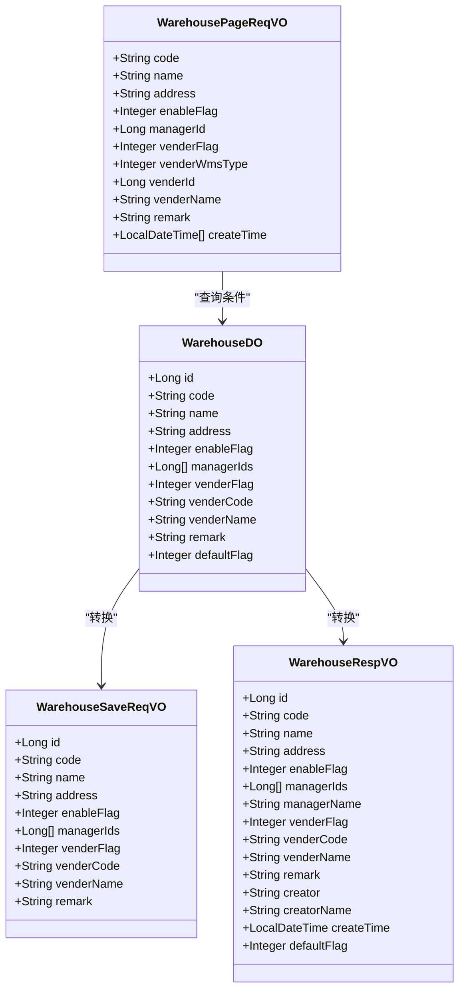
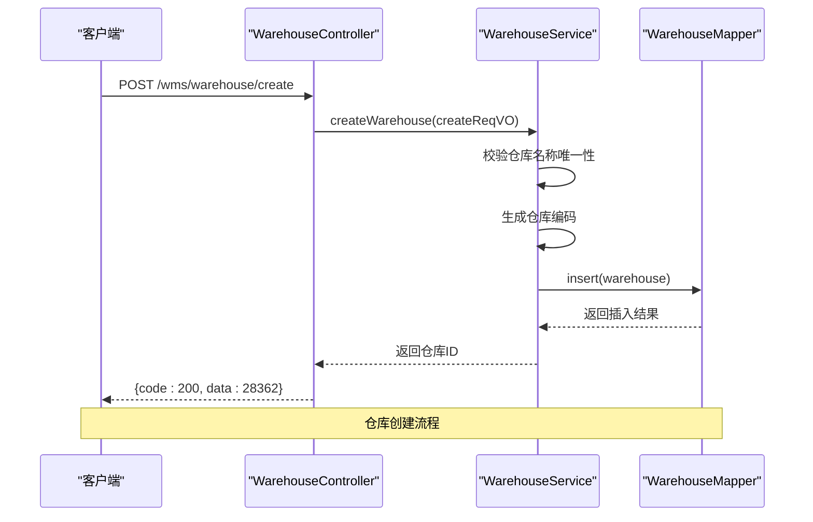
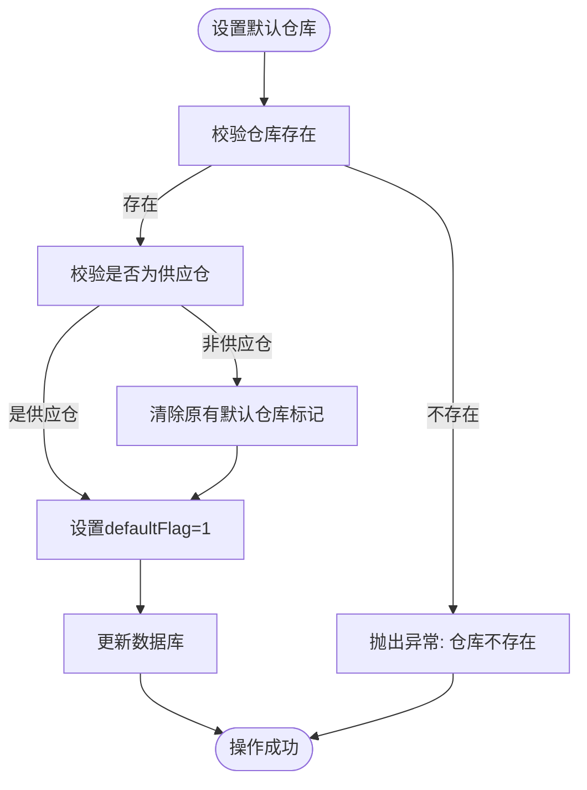

# 仓库配置API

<cite>
**本文档引用文件**  
- [WarehouseController.java](file://eplus-module-wms/eplus-module-wms-biz/src/main/java/com/syj/eplus/module/wms/controller/admin/warehouse/WarehouseController.java)
- [WarehouseService.java](file://eplus-module-wms/eplus-module-wms-biz/src/main/java/com/syj/eplus/module/wms/service/warehouse/WarehouseService.java)
- [WarehouseServiceImpl.java](file://eplus-module-wms/eplus-module-wms-biz/src/main/java/com/syj/eplus/module/wms/service/warehouse/WarehouseServiceImpl.java)
- [WarehouseDO.java](file://eplus-module-wms/eplus-module-wms-biz/src/main/java/com/syj/eplus/module/wms/dal/dataobject/warehouse/WarehouseDO.java)
- [WarehouseSaveReqVO.java](file://eplus-module-wms/eplus-module-wms-biz/src/main/java/com/syj/eplus/module/wms/controller/admin/warehouse/vo/WarehouseSaveReqVO.java)
- [WarehouseRespVO.java](file://eplus-module-wms/eplus-module-wms-biz/src/main/java/com/syj/eplus/module/wms/controller/admin/warehouse/vo/WarehouseRespVO.java)
- [WarehousePageReqVO.java](file://eplus-module-wms/eplus-module-wms-biz/src/main/java/com/syj/eplus/module/wms/controller/admin/warehouse/vo/WarehousePageReqVO.java)
- [WarehouseMapper.java](file://eplus-module-wms/eplus-module-wms-biz/src/main/java/com/syj/eplus/module/wms/dal/mysql/warehouse/WarehouseMapper.java)
- [IWarehouseApi.java](file://eplus-module-wms/eplus-module-wms-api/src/main/java/com/syj/eplus/module/wms/api/warehouse/IWarehouseApi.java)
- [WarehouseDTO.java](file://eplus-module-wms/eplus-module-wms-api/src/main/java/com/syj/eplus/module/wms/api/warehouse/dto/WarehouseDTO.java)
</cite>

## 目录
1. [简介](#简介)
2. [仓库层级结构设计](#仓库层级结构设计)
3. [核心API端点规范](#核心api端点规范)
4. [仓库属性业务含义](#仓库属性业务含义)
5. [真实业务场景示例](#真实业务场景示例)
6. [API安全与多租户数据隔离](#api安全与多租户数据隔离)
7. [错误码字典与处理建议](#错误码字典与处理建议)
8. [开发者集成指南](#开发者集成指南)

## 简介

仓库配置API是仓储管理系统的核心基础模块，提供对仓库、库区、库位等基础数据的全面管理功能。本API集成了创建、更新、查询、启用/停用、设置默认仓库等完整生命周期管理功能，支持分页查询和Excel导出。API设计遵循RESTful规范，通过清晰的端点定义和标准化的响应结构，为库存管理、出入库操作等上下游模块提供稳定可靠的数据支撑。

**本文档引用文件**  
- [WarehouseController.java](file://eplus-module-wms/eplus-module-wms-biz/src/main/java/com/syj/eplus/module/wms/controller/admin/warehouse/WarehouseController.java)
- [WarehouseService.java](file://eplus-module-wms/eplus-module-wms-biz/src/main/java/com/syj/eplus/module/wms/service/warehouse/WarehouseService.java)

## 仓库层级结构设计

仓库配置API采用扁平化的仓库管理模型，每个仓库作为独立的管理单元，包含仓库编码、名称、地址、启用状态等核心属性。系统通过`WarehouseDO`数据对象定义仓库的持久化结构，支持多仓管员管理（通过`managerIds`字段存储多个仓管员ID）。

仓库之间不存在物理层级关系，但通过业务属性进行逻辑分类：
- **普通仓库**：`venderFlag=0`，由企业自主创建和管理
- **供应仓**：`venderFlag=1`，与供应商关联的仓库，通常在供应商审核通过后自动创建

这种设计简化了仓库管理的复杂性，同时通过灵活的查询接口支持按不同类型进行数据筛选和展示。



**图示来源**  
- [WarehouseDO.java](file://eplus-module-wms/eplus-module-wms-biz/src/main/java/com/syj/eplus/module/wms/dal/dataobject/warehouse/WarehouseDO.java)
- [WarehouseSaveReqVO.java](file://eplus-module-wms/eplus-module-wms-biz/src/main/java/com/syj/eplus/module/wms/controller/admin/warehouse/vo/WarehouseSaveReqVO.java)
- [WarehouseRespVO.java](file://eplus-module-wms/eplus-module-wms-biz/src/main/java/com/syj/eplus/module/wms/controller/admin/warehouse/vo/WarehouseRespVO.java)
- [WarehousePageReqVO.java](file://eplus-module-wms/eplus-module-wms-biz/src/main/java/com/syj/eplus/module/wms/controller/admin/warehouse/vo/WarehousePageReqVO.java)

**本节来源**  
- [WarehouseDO.java](file://eplus-module-wms/eplus-module-wms-biz/src/main/java/com/syj/eplus/module/wms/dal/dataobject/warehouse/WarehouseDO.java)
- [WarehouseController.java](file://eplus-module-wms/eplus-module-wms-biz/src/main/java/com/syj/eplus/module/wms/controller/admin/warehouse/WarehouseController.java)

## 核心API端点规范

### 仓库管理API

| 端点 | HTTP动词 | 描述 | 权限要求 |
|------|---------|------|---------|
| `/wms/warehouse/create` | POST | 创建仓库 | `wms:warehouse:create` |
| `/wms/warehouse/update` | PUT | 更新仓库 | `wms:warehouse:update` |
| `/wms/warehouse/enable/{id}` | PUT | 启用仓库 | `wms:warehouse:update` |
| `/wms/warehouse/disable/{id}` | PUT | 停用仓库 | `wms:warehouse:update` |
| `/wms/warehouse/set-default/{id}` | PUT | 设置默认仓库 | `wms:warehouse:update` |
| `/wms/warehouse/delete` | DELETE | 删除仓库 | `wms:warehouse:delete` |
| `/wms/warehouse/detail` | GET | 获取仓库详情 | `wms:warehouse:query` |
| `/wms/warehouse/page` | GET | 分页查询仓库 | `wms:warehouse:query` |
| `/wms/warehouse/get-simple-list` | GET | 获取仓库精简列表 | 无 |
| `/wms/warehouse/export-excel` | GET | 导出仓库Excel | `wms:warehouse:export` |

### 请求体Schema (WarehouseSaveReqVO)

```json
{
  "id": 28362,
  "code": "WH001",
  "name": "中心仓库",
  "address": "北京市朝阳区xxx路xxx号",
  "enableFlag": 1,
  "managerIds": [17026, 17027],
  "venderFlag": 0,
  "venderCode": "V001",
  "venderName": "供应商A",
  "remark": "主要存储成品"
}
```

### 响应结构 (WarehouseRespVO)

```json
{
  "id": 28362,
  "code": "WH001",
  "name": "中心仓库",
  "address": "北京市朝阳区xxx路xxx号",
  "enableFlag": 1,
  "managerIds": [17026, 17027],
  "managerName": "张三,李四",
  "venderFlag": 0,
  "venderCode": "V001",
  "venderName": "供应商A",
  "remark": "主要存储成品",
  "creator": "admin",
  "creatorName": "系统管理员",
  "createTime": "2024-06-04T10:30:00",
  "defaultFlag": 1
}
```

### 分页查询参数 (WarehousePageReqVO)

| 参数 | 类型 | 描述 | 示例 |
|------|------|------|------|
| code | String | 仓库编码 | WH001 |
| name | String | 仓库名称 | 中心仓库 |
| address | String | 仓库地址 | 北京市朝阳区 |
| enableFlag | Integer | 启用标识 (0-否, 1-是) | 1 |
| managerId | Long | 仓管主键 | 17026 |
| venderFlag | Integer | 供应仓标识 (0-否, 1-是) | 0 |
| venderWmsType | Integer | 供应仓类型 (1-在制仓, 2-虚拟仓) | 1 |
| venderId | Long | 供应商主键 | 6393 |
| venderName | String | 供应商名称 | 供应商A |
| remark | String | 备注 | 重要仓库 |
| createTime | LocalDateTime[] | 创建时间范围 | ["2024-06-01","2024-06-30"] |

### 状态码说明

| 状态码 | 描述 | 说明 |
|--------|------|------|
| 200 | OK | 请求成功，返回正常响应 |
| 400 | Bad Request | 请求参数错误 |
| 401 | Unauthorized | 未授权访问 |
| 403 | Forbidden | 权限不足 |
| 404 | Not Found | 资源不存在 |
| 500 | Internal Server Error | 服务器内部错误 |



**图示来源**  
- [WarehouseController.java](file://eplus-module-wms/eplus-module-wms-biz/src/main/java/com/syj/eplus/module/wms/controller/admin/warehouse/WarehouseController.java)
- [WarehouseService.java](file://eplus-module-wms/eplus-module-wms-biz/src/main/java/com/syj/eplus/module/wms/service/warehouse/WarehouseService.java)
- [WarehouseMapper.java](file://eplus-module-wms/eplus-module-wms-biz/src/main/java/com/syj/eplus/module/wms/dal/mysql/warehouse/WarehouseMapper.java)

**本节来源**  
- [WarehouseController.java](file://eplus-module-wms/eplus-module-wms-biz/src/main/java/com/syj/eplus/module/wms/controller/admin/warehouse/WarehouseController.java)
- [WarehouseService.java](file://eplus-module-wms/eplus-module-wms-biz/src/main/java/com/syj/eplus/module/wms/service/warehouse/WarehouseService.java)
- [WarehouseMapper.java](file://eplus-module-wms/eplus-module-wms-biz/src/main/java/com/syj/eplus/module/wms/dal/mysql/warehouse/WarehouseMapper.java)

## 仓库属性业务含义

### 核心属性说明

| 属性 | 业务含义 | 约束条件 |
|------|---------|---------|
| `code` | 仓库编码 | 系统自动生成，前缀为"WH"，保证全局唯一 |
| `name` | 仓库名称 | 用户自定义，必须保证在同一租户内唯一 |
| `enableFlag` | 启用标识 | 0-停用, 1-启用；停用的仓库不可用于业务操作 |
| `venderFlag` | 供应仓标识 | 0-普通仓库, 1-供应仓；供应仓由系统自动创建，不允许删除 |
| `defaultFlag` | 默认仓库标记 | 0-非默认, 1-默认；系统必须且只能有一个启用状态的默认仓库 |
| `managerIds` | 仓管主键列表 | 支持多个仓管员共同管理一个仓库 |

### 业务规则

1. **仓库编码生成规则**：系统使用`CodeGeneratorApi`服务生成唯一编码，编码类型为`SN_WAREHOUSE`，前缀为`WH`，确保编码的全局唯一性。

2. **默认仓库约束**：系统强制要求存在且仅存在一个启用状态的默认仓库。当设置新的默认仓库时，系统会自动将原有的默认仓库标记清除。

3. **供应仓保护机制**：供应仓（`venderFlag=1`）是系统自动创建的特殊仓库，不允许通过API删除，确保供应商相关业务数据的完整性。

4. **名称唯一性校验**：在创建和更新仓库时，系统会校验仓库名称的唯一性，防止重复命名导致的管理混乱。



**图示来源**  
- [WarehouseServiceImpl.java](file://eplus-module-wms/eplus-module-wms-biz/src/main/java/com/syj/eplus/module/wms/service/warehouse/WarehouseServiceImpl.java)

**本节来源**  
- [WarehouseDO.java](file://eplus-module-wms/eplus-module-wms-biz/src/main/java/com/syj/eplus/module/wms/dal/dataobject/warehouse/WarehouseDO.java)
- [WarehouseServiceImpl.java](file://eplus-module-wms/eplus-module-wms-biz/src/main/java/com/syj/eplus/module/wms/service/warehouse/WarehouseServiceImpl.java)

## 真实业务场景示例

### 仓库初始化场景

**场景描述**：系统初始化时，需要创建企业的主仓库作为默认仓库。

**请求示例**：
```http
POST /wms/warehouse/create
Content-Type: application/json

{
  "name": "中心仓库",
  "address": "北京市朝阳区xxx路xxx号",
  "enableFlag": 1,
  "managerIds": [17026],
  "venderFlag": 0,
  "remark": "公司主仓库"
}
```

**响应示例**：
```json
{
  "code": 0,
  "data": 28362,
  "msg": "成功"
}
```

**后续操作**：使用返回的仓库ID调用`/wms/warehouse/set-default/{id}`接口将其设置为默认仓库。

### 库区规划场景

**场景描述**：企业扩展业务，需要新增区域仓库。

**请求示例**：
```http
POST /wms/warehouse/create
Content-Type: application/json

{
  "name": "华东分仓",
  "address": "上海市浦东新区xxx路xxx号",
  "enableFlag": 1,
  "managerIds": [17027, 17028],
  "venderFlag": 0,
  "remark": "负责华东地区配送"
}
```

**分页查询示例**：
```http
GET /wms/warehouse/page?pageNo=1&pageSize=10&name=华东
```

**响应示例**：
```json
{
  "code": 0,
  "data": {
    "list": [
      {
        "id": 28363,
        "code": "WH002",
        "name": "华东分仓",
        "address": "上海市浦东新区xxx路xxx号",
        "enableFlag": 1,
        "managerIds": [17027, 17028],
        "managerName": "王五,赵六",
        "venderFlag": 0,
        "venderCode": null,
        "venderName": null,
        "remark": "负责华东地区配送",
        "creator": "admin",
        "creatorName": "系统管理员",
        "createTime": "2024-06-05T14:20:00",
        "defaultFlag": 0
      }
    ],
    "total": 1
  },
  "msg": "成功"
}
```

**本节来源**  
- [WarehouseController.java](file://eplus-module-wms/eplus-module-wms-biz/src/main/java/com/syj/eplus/module/wms/controller/admin/warehouse/WarehouseController.java)
- [WarehouseService.java](file://eplus-module-wms/eplus-module-wms-biz/src/main/java/com/syj/eplus/module/wms/service/warehouse/WarehouseService.java)

## API安全与多租户数据隔离

### 安全机制

1. **权限控制**：所有API端点都通过`@PreAuthorize`注解进行权限校验，确保只有具备相应权限的用户才能执行操作。

2. **数据隔离**：系统基于多租户架构，通过数据库层面的数据隔离机制，确保不同租户之间的仓库数据完全隔离。

3. **操作日志**：关键操作（如创建、删除、导出）会记录操作日志，便于审计和追踪。

### 权限矩阵

| 操作 | 所需权限 | 说明 |
|------|---------|------|
| 创建仓库 | `wms:warehouse:create` | 允许创建新的仓库 |
| 更新仓库 | `wms:warehouse:update` | 允许修改仓库信息、启用/停用、设置默认 |
| 删除仓库 | `wms:warehouse:delete` | 允许删除普通仓库 |
| 查询仓库 | `wms:warehouse:query` | 允许查看仓库信息 |
| 导出数据 | `wms:warehouse:export` | 允许导出仓库数据到Excel |

### 多租户数据隔离实现

系统通过以下方式实现多租户数据隔离：
- 在`BaseDO`基类中包含租户标识字段
- MyBatis拦截器自动为所有查询添加租户过滤条件
- 服务层方法在处理数据时自动考虑当前租户上下文

**本节来源**  
- [WarehouseController.java](file://eplus-module-wms/eplus-module-wms-biz/src/main/java/com/syj/eplus/module/wms/controller/admin/warehouse/WarehouseController.java)
- [WarehouseServiceImpl.java](file://eplus-module-wms/eplus-module-wms-biz/src/main/java/com/syj/eplus/module/wms/service/warehouse/WarehouseServiceImpl.java)

## 错误码字典与处理建议

### 仓库管理错误码

| 错误码 | 错误信息 | 原因 | 处理建议 |
|--------|---------|------|---------|
| WAREHOUSE_NAME_ALREADY_EXISTS | 仓库名称已存在 | 创建或更新时仓库名称重复 | 修改仓库名称，确保唯一性 |
| WAREHOUSE_NOT_EXISTS | 仓库不存在 | 操作的仓库ID不存在 | 检查仓库ID是否正确 |
| WAREHOUSE_NOT_DELETE | 供应仓不允许删除 | 尝试删除供应仓 | 供应仓由系统管理，不允许删除 |
| WAREHOUSE_NOT_DEFAULT | 未找到默认仓库 | 系统中没有设置默认仓库 | 创建一个仓库并设置为默认 |
| WAREHOUSE_MORE_DEFAULT | 存在多个默认仓库 | 数据异常，有多个仓库被标记为默认 | 联系管理员修复数据一致性 |

### 通用错误处理

1. **客户端处理**：前端应捕获API返回的错误码，根据错误码类型显示相应的用户友好提示。

2. **重试机制**：对于网络超时等临时性错误，建议实现指数退避重试机制。

3. **日志记录**：重要业务操作的失败应记录详细日志，便于问题排查。

4. **数据验证**：在调用API前，客户端应进行基本的数据验证，减少不必要的请求。

**本节来源**  
- [WarehouseServiceImpl.java](file://eplus-module-wms/eplus-module-wms-biz/src/main/java/com/syj/eplus/module/wms/service/warehouse/WarehouseServiceImpl.java)
- [ErrorCodeConstants.java](file://eplus-module-wms/eplus-module-wms-api/src/main/java/com/syj/eplus/module/wms/enums/ErrorCodeConstants.java)

## 开发者集成指南

### 调用示例

```java
// 创建仓库
WarehouseSaveReqVO reqVO = new WarehouseSaveReqVO();
reqVO.setName("新仓库");
reqVO.setAddress("新地址");
reqVO.setEnableFlag(1);
reqVO.setManagerIds(Arrays.asList(17026L));

CommonResult<Long> result = warehouseApi.createWarehouse(reqVO);
if (result.isSuccess()) {
    Long warehouseId = result.getData();
    // 设置为默认仓库
    warehouseApi.setDefault(warehouseId);
}
```

### 集成注意事项

1. **事务处理**：创建仓库和设置默认仓库是两个独立的操作，如果需要保证原子性，应在业务层实现事务控制。

2. **缓存使用**：系统提供了`getWarehoseCache()`接口获取仓库名称缓存，建议在需要频繁查询仓库名称的场景下使用缓存。

3. **批量操作**：对于需要批量获取仓库信息的场景，使用`selectBatchIds`接口比逐个查询更高效。

4. **与库存模块协同**：仓库创建后，库存模块会自动初始化相应的库存数据结构，无需额外操作。

5. **与出入库模块协同**：出入库操作必须指定有效的仓库ID，建议在前端选择器中只展示启用状态的仓库。

**本节来源**  
- [IWarehouseApi.java](file://eplus-module-wms/eplus-module-wms-api/src/main/java/com/syj/eplus/module/wms/api/warehouse/IWarehouseApi.java)
- [WarehouseController.java](file://eplus-module-wms/eplus-module-wms-biz/src/main/java/com/syj/eplus/module/wms/controller/admin/warehouse/WarehouseController.java)
- [WarehouseServiceImpl.java](file://eplus-module-wms/eplus-module-wms-biz/src/main/java/com/syj/eplus/module/wms/service/warehouse/WarehouseServiceImpl.java)