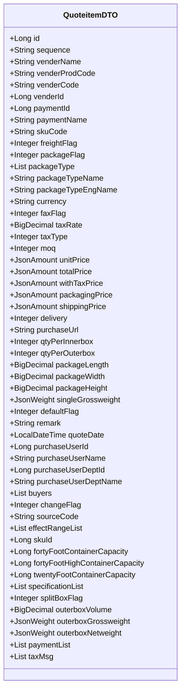
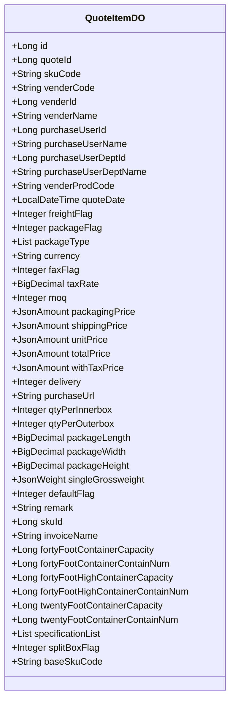
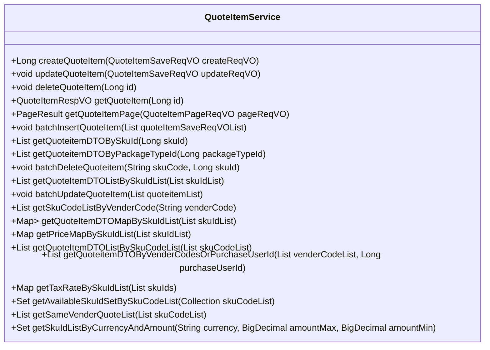
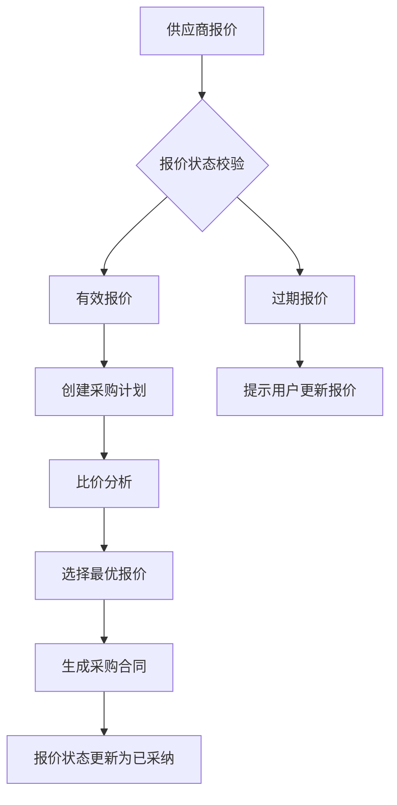

# 报价管理API

<cite>
**本文档引用的文件**
- [QuoteitemApi.java](file://eplus-module-scm/eplus-module-scm-api/src/main/java/com/syj/eplus/module/scm/api/quoteitem/QuoteitemApi.java)
- [QuoteitemDTO.java](file://eplus-module-scm/eplus-module-scm-api/src/main/java/com/syj/eplus/module/scm/api/quoteitem/dto/QuoteitemDTO.java)
- [QuoteItemController.java](file://eplus-module-scm/eplus-module-scm-biz/src/main/java/com/syj/eplus/module/scm/controller/admin/quoteitem/QuoteItemController.java)
- [QuoteItemService.java](file://eplus-module-scm/eplus-module-scm-biz/src/main/java/com/syj/eplus/module/scm/service/quoteitem/QuoteItemService.java)
- [QuoteItemServiceImpl.java](file://eplus-module-scm/eplus-module-scm-biz/src/main/java/com/syj/eplus/module/scm/service/quoteitem/QuoteItemServiceImpl.java)
- [QuoteItemDO.java](file://eplus-module-scm/eplus-module-scm-biz/src/main/java/com/syj/eplus/module/scm/dal/dataobject/quoteitem/QuoteItemDO.java)
- [QuoteItemMapper.java](file://eplus-module-scm/eplus-module-scm-biz/src/main/java/com/syj/eplus/module/scm/dal/mysql/quoteitem/QuoteItemMapper.java)
- [QuoteItemSaveReqVO.java](file://eplus-module-scm/eplus-module-scm-biz/src/main/java/com/syj/eplus/module/scm/controller/admin/quoteitem/vo/QuoteItemSaveReqVO.java)
- [QuoteItemRespVO.java](file://eplus-module-scm/eplus-module-scm-biz/src/main/java/com/syj/eplus/module/scm/controller/admin/quoteitem/vo/QuoteItemRespVO.java)
- [QuoteItemPageReqVO.java](file://eplus-module-scm/eplus-module-scm-biz/src/main/java/com/syj/eplus/module/scm/controller/admin/quoteitem/vo/QuoteItemPageReqVO.java)
- [ErrorCodeConstants.java](file://eplus-module-scm/eplus-module-scm-api/src/main/java/com/syj/eplus/module/scm/enums/ErrorCodeConstants.java)
</cite>

## 目录
1. [简介](#简介)
2. [RESTful API端点](#restful-api端点)
3. [核心数据结构](#核心数据结构)
4. [报价状态与业务规则](#报价状态与业务规则)
5. [报价与采购计划、合同的关联](#报价与采购计划、合同的关联)
6. [报价有效期管理](#报价有效期管理)
7. [错误码列表](#错误码列表)
8. [业务场景示例](#业务场景示例)
9. [开发者集成指南](#开发者集成指南)

## 简介

报价管理API是供应链管理（SCM）模块的核心组件，负责处理供应商报价的全生命周期管理。该API支持报价的创建、维护、比价、审批等操作，为采购决策提供关键数据支持。报价信息与采购计划、采购合同紧密关联，是采购流程的起点和重要依据。

报价管理API的主要功能包括：
- 创建和维护供应商报价明细
- 根据SKU或供应商查询报价信息
- 批量操作报价数据
- 获取默认报价和税率信息
- 支持多供应商比价分析
- 与采购计划和合同系统集成

**本节来源**
- [QuoteitemApi.java](file://eplus-module-scm/eplus-module-scm-api/src/main/java/com/syj/eplus/module/scm/api/quoteitem/QuoteitemApi.java#L1-L71)
- [QuoteItemController.java](file://eplus-module-scm/eplus-module-scm-biz/src/main/java/com/syj/eplus/module/scm/controller/admin/quoteitem/QuoteItemController.java#L1-L36)

## RESTful API端点

### 创建供应商报价明细
- **HTTP方法**: POST
- **URL路径**: `/scm/quote-item/create`
- **请求参数**: 无
- **请求体**: `QuoteItemSaveReqVO` 对象
- **响应格式**: `CommonResult<Long>`，返回创建的报价明细ID
- **状态码**:
  - 200: 创建成功
  - 400: 请求参数无效
  - 500: 服务器内部错误

### 更新供应商报价明细
- **HTTP方法**: PUT
- **URL路径**: `/scm/quote-item/update`
- **请求参数**: 无
- **请求体**: `QuoteItemSaveReqVO` 对象（包含ID）
- **响应格式**: `CommonResult<Boolean>`，更新成功返回true
- **状态码**:
  - 200: 更新成功
  - 400: 请求参数无效
  - 404: 报价明细不存在
  - 500: 服务器内部错误

### 删除供应商报价明细
- **HTTP方法**: DELETE
- **URL路径**: `/scm/quote-item/delete`
- **请求参数**: `id` (报价明细ID)
- **请求体**: 无
- **响应格式**: `CommonResult<Boolean>`，删除成功返回true
- **状态码**:
  - 200: 删除成功
  - 404: 报价明细不存在
  - 500: 服务器内部错误

### 获取供应商报价明细
- **HTTP方法**: GET
- **URL路径**: `/scm/quote-item/detail`
- **请求参数**: `id` (报价明细ID)
- **请求体**: 无
- **响应格式**: `CommonResult<QuoteItemRespVO>`，返回报价明细详情
- **状态码**:
  - 200: 获取成功
  - 404: 报价明细不存在
  - 500: 服务器内部错误

### 根据SKU查询报价详情
- **HTTP方法**: GET
- **URL路径**: `/scm/quote-item/list-by-skuid`
- **请求参数**: `skuIdList` (SKU ID列表)
- **请求体**: 无
- **响应格式**: `CommonResult<List<QuoteItemRespVO>>`，返回指定SKU的报价列表
- **状态码**:
  - 200: 查询成功
  - 500: 服务器内部错误

### 根据产品编号查询报价详情
- **HTTP方法**: GET
- **URL路径**: `/scm/quote-item/list-by-skucode`
- **请求参数**: `skuCodeList` (SKU编号列表)
- **请求体**: 无
- **响应格式**: `CommonResult<List<QuoteItemRespVO>>`，返回指定SKU编号的报价列表
- **状态码**:
  - 200: 查询成功
  - 500: 服务器内部错误

### 获取供应商报价明细分页
- **HTTP方法**: GET
- **URL路径**: `/scm/quote-item/page`
- **请求参数**: `QuoteItemPageReqVO` 对象，包含分页和查询条件
- **请求体**: 无
- **响应格式**: `CommonResult<PageResult<QuoteItemRespVO>>`，返回分页的报价明细列表
- **状态码**:
  - 200: 查询成功
  - 500: 服务器内部错误

### 导出供应商报价明细Excel
- **HTTP方法**: GET
- **URL路径**: `/scm/quote-item/export-excel`
- **请求参数**: `QuoteItemPageReqVO` 对象，包含查询条件
- **请求体**: 无
- **响应格式**: Excel文件流
- **状态码**:
  - 200: 导出成功
  - 500: 服务器内部错误

### 获取相同供应商报价列表
- **HTTP方法**: GET
- **URL路径**: `/scm/quote-item/get-same-vender-quote-list`
- **请求参数**: `skuCodeList` (产品编号列表)
- **请求体**: 无
- **响应格式**: `CommonResult<List<QuoteitemDTO>>`，返回相同供应商的报价列表
- **状态码**:
  - 200: 查询成功
  - 500: 服务器内部错误

**本节来源**
- [QuoteItemController.java](file://eplus-module-scm/eplus-module-scm-biz/src/main/java/com/syj/eplus/module/scm/controller/admin/quoteitem/QuoteItemController.java#L41-L136)

## 核心数据结构

### 报价明细数据传输对象 (QuoteitemDTO)
`QuoteitemDTO` 是报价管理API的核心数据结构，定义了报价明细的所有属性。



**图示来源**
- [QuoteitemDTO.java](file://eplus-module-scm/eplus-module-scm-api/src/main/java/com/syj/eplus/module/scm/api/quoteitem/dto/QuoteitemDTO.java#L1-L305)

### 报价明细数据对象 (QuoteItemDO)
`QuoteItemDO` 是数据库持久层对象，与数据库表 `scm_quote_item` 映射。



**图示来源**
- [QuoteItemDO.java](file://eplus-module-scm/eplus-module-scm-biz/src/main/java/com/syj/eplus/module/scm/dal/dataobject/quoteitem/QuoteItemDO.java#L1-L249)

### 报价明细服务接口 (QuoteItemService)
`QuoteItemService` 定义了报价管理的所有业务操作。



**图示来源**
- [QuoteItemService.java](file://eplus-module-scm/eplus-module-scm-biz/src/main/java/com/syj/eplus/module/scm/service/quoteitem/QuoteItemService.java#L1-L179)

## 报价状态与业务规则

报价管理API通过 `defaultFlag` 字段管理报价状态，主要状态包括：

### 报价状态
- **有效 (defaultFlag = 1)**: 报价处于有效状态，可以用于采购决策
- **已过期 (quoteDate 过期)**: 报价日期已过，自动变为过期状态
- **已采纳 (关联采购合同)**: 报价已被采纳并生成采购合同

### 业务规则
1. **默认报价规则**: 每个SKU必须有且仅有一个默认报价
   - 创建或更新报价时，系统会校验默认报价的唯一性
   - 如果没有默认报价，系统会抛出 `QUOTE_ITEM_NOT_EXISTS_DEFAULT` 错误
   - 如果存在多个默认报价，系统会抛出 `QUOTE_ITEM_EXISTS_MORE_DEFAULT` 错误

2. **价格计算规则**:
   - 系统会自动计算40尺柜、40高柜和20尺柜的装量
   - 根据含税总价和税率自动计算采购单价
   - 体积为零时，系统会抛出 `QUOTE_ITEM_VOLUME_ZERO` 错误

3. **数据完整性规则**:
   - 报价必须关联有效的SKU和供应商
   - 必填字段不能为空
   - 供应商必须是可用状态

**本节来源**
- [QuoteItemServiceImpl.java](file://eplus-module-scm/eplus-module-scm-biz/src/main/java/com/syj/eplus/module/scm/service/quoteitem/QuoteItemServiceImpl.java#L269-L281)
- [QuoteItemServiceImpl.java](file://eplus-module-scm/eplus-module-scm-biz/src/main/java/com/syj/eplus/module/scm/service/quoteitem/QuoteItemServiceImpl.java#L311-L324)

## 报价与采购计划、合同的关联

报价管理API与采购计划和采购合同系统紧密集成，形成完整的采购流程。

### 与采购计划的关联
- 采购计划创建时，系统会根据SKU自动获取默认报价
- 报价中的价格、交期等信息会作为采购计划的参考依据
- 采购计划可以基于多个供应商的报价进行比价分析

### 与采购合同的关联
- 采购合同创建时，会引用报价中的价格条款
- 报价的币种、税率等信息会同步到采购合同
- 一旦报价被采纳生成采购合同，该报价的状态会更新为"已采纳"

### 数据流图


**图示来源**
- [QuoteItemServiceImpl.java](file://eplus-module-scm/eplus-module-scm-biz/src/main/java/com/syj/eplus/module/scm/service/quoteitem/QuoteItemServiceImpl.java#L373-L379)
- [QuoteItemServiceImpl.java](file://eplus-module-scm/eplus-module-scm-biz/src/main/java/com/syj/eplus/module/scm/service/quoteitem/QuoteItemServiceImpl.java#L439-L448)

## 报价有效期管理

报价有效期管理是报价系统的重要功能，确保采购决策基于最新的价格信息。

### 有效期规则
- 报价有效期由 `quoteDate` 字段决定
- 系统会定期检查过期报价，并标记为过期状态
- 过期报价不能用于创建新的采购计划或合同

### 有效期检查
- 系统在获取报价时会检查有效期
- 如果报价已过期，系统会提示用户更新报价
- 用户可以手动更新报价的有效期

### 有效期提醒
- 系统可以配置报价过期提醒
- 在报价即将过期时，系统会通知相关采购人员
- 提醒方式包括系统消息、邮件等

**本节来源**
- [QuoteitemDTO.java](file://eplus-module-scm/eplus-module-scm-api/src/main/java/com/syj/eplus/module/scm/api/quoteitem/dto/QuoteitemDTO.java#L233-L235)
- [QuoteItemServiceImpl.java](file://eplus-module-scm/eplus-module-scm-biz/src/main/java/com/syj/eplus/module/scm/service/quoteitem/QuoteItemServiceImpl.java#L315-L317)

## 错误码列表

报价管理API定义了详细的错误码，帮助开发者快速定位和解决问题。

| 错误码 | 错误信息 | 业务含义 |
|--------|--------|--------|
| 1003001013 | 供应商报价明细不存在 | 请求的报价明细ID不存在 |
| 1003001013 | 供应商报价明细不存在默认报价 | 指定SKU没有设置默认报价 |
| 1003001013 | 供应商报价明细存在多个默认报价 | 指定SKU存在多个默认报价，违反唯一性规则 |
| 1004002027 | 报价体积为0 | 报价的规格体积计算为0，无法计算装柜量 |
| 1004002026 | 供应商不可用 | 引用的供应商已被禁用或不存在 |
| 1003001012 | 供应商报价不存在 | 请求的供应商报价单不存在 |

**本节来源**
- [ErrorCodeConstants.java](file://eplus-module-scm/eplus-module-scm-api/src/main/java/com/syj/eplus/module/scm/enums/ErrorCodeConstants.java#L1-L215)

## 业务场景示例

### 场景一：为同一物料获取多个供应商报价并进行比价

**请求示例**:
```http
GET /scm/quote-item/list-by-skucode?skuCodeList=SKU001,SKU002 HTTP/1.1
Content-Type: application/json
```

**响应示例**:
```json
{
  "code": 0,
  "msg": "成功",
  "data": [
    {
      "id": 1001,
      "skuCode": "SKU001",
      "venderName": "供应商A",
      "unitPrice": {
        "currency": "USD",
        "amount": 10.50
      },
      "delivery": 30,
      "defaultFlag": 1
    },
    {
      "id": 1002,
      "skuCode": "SKU001",
      "venderName": "供应商B",
      "unitPrice": {
        "currency": "USD",
        "amount": 9.80
      },
      "delivery": 45,
      "defaultFlag": 0
    },
    {
      "id": 1003,
      "skuCode": "SKU002",
      "venderName": "供应商A",
      "unitPrice": {
        "currency": "USD",
        "amount": 15.20
      },
      "delivery": 30,
      "defaultFlag": 1
    }
  ]
}
```

### 场景二：创建新的供应商报价

**请求示例**:
```http
POST /scm/quote-item/create HTTP/1.1
Content-Type: application/json

{
  "skuCode": "SKU001",
  "venderId": "V001",
  "venderCode": "V001",
  "venderName": "供应商A",
  "currency": "USD",
  "unitPrice": {
    "currency": "USD",
    "amount": 10.50
  },
  "delivery": 30,
  "defaultFlag": 1,
  "quoteDate": "2024-05-08T10:00:00"
}
```

**响应示例**:
```json
{
  "code": 0,
  "msg": "成功",
  "data": 1001
}
```

**本节来源**
- [QuoteItemController.java](file://eplus-module-scm/eplus-module-scm-biz/src/main/java/com/syj/eplus/module/scm/controller/admin/quoteitem/QuoteItemController.java#L41-L46)
- [QuoteItemController.java](file://eplus-module-scm/eplus-module-scm-biz/src/main/java/com/syj/eplus/module/scm/controller/admin/quoteitem/QuoteItemController.java#L74-L89)

## 开发者集成指南

### 调用示例

#### Java调用示例
```java
// 创建报价
QuoteItemSaveReqVO createReqVO = new QuoteItemSaveReqVO();
createReqVO.setSkuCode("SKU001");
createReqVO.setVenderCode("V001");
createReqVO.setCurrency("USD");
createReqVO.setUnitPrice(new JsonAmount().setCurrency("USD").setAmount(new BigDecimal("10.50")));
createReqVO.setDelivery(30);
createReqVO.setDefaultFlag(1);

CommonResult<Long> result = quoteItemController.createQuoteItem(createReqVO);
if (result.getCode() == 0) {
    System.out.println("报价创建成功，ID: " + result.getData());
} else {
    System.out.println("报价创建失败: " + result.getMsg());
}
```

#### 获取默认报价
```java
// 获取多个SKU的默认报价
List<Long> skuIdList = Arrays.asList(1L, 2L, 3L);
Map<String, JsonAmount> priceMap = quoteitemApi.getPriceMapBySkuIdList(skuIdList);
priceMap.forEach((skuCode, price) -> {
    System.out.println("SKU: " + skuCode + ", 价格: " + price.getAmount() + " " + price.getCurrency());
});
```

### 处理报价变更和历史记录追溯

报价变更通过创建新的报价记录来实现，保留历史报价记录。

```java
// 更新报价
QuoteItemSaveReqVO updateReqVO = new QuoteItemSaveReqVO();
updateReqVO.setId(1001L); // 指定要更新的报价ID
updateReqVO.setUnitPrice(new JsonAmount().setCurrency("USD").setAmount(new BigDecimal("11.00")));
updateReqVO.setDelivery(25);

CommonResult<Boolean> result = quoteItemController.updateQuoteItem(updateReqVO);
```

系统通过保留所有报价记录，支持历史记录追溯。可以通过分页查询或按时间范围查询获取历史报价数据。

**本节来源**
- [QuoteItemController.java](file://eplus-module-scm/eplus-module-scm-biz/src/main/java/com/syj/eplus/module/scm/controller/admin/quoteitem/QuoteItemController.java#L48-L54)
- [QuoteItemServiceImpl.java](file://eplus-module-scm/eplus-module-scm-biz/src/main/java/com/syj/eplus/module/scm/service/quoteitem/QuoteItemServiceImpl.java#L88-L97)