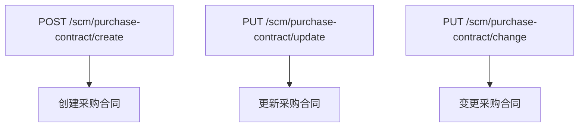
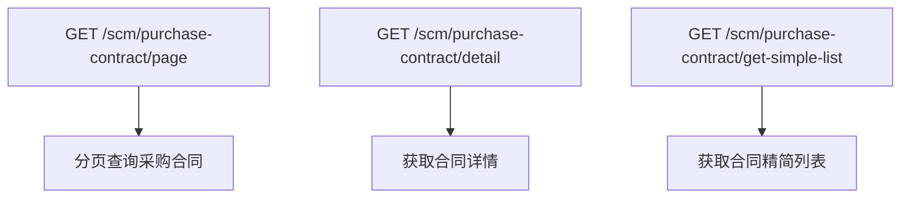
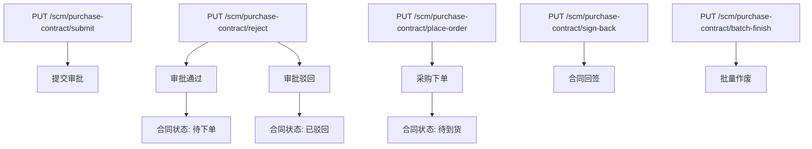
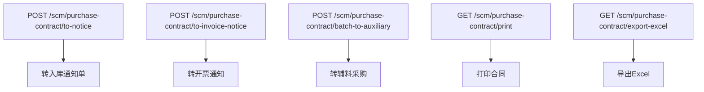
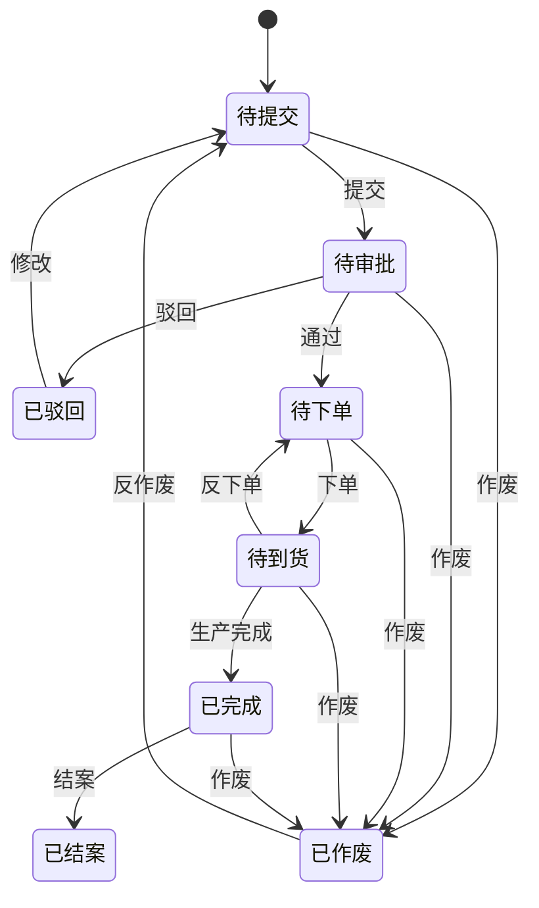
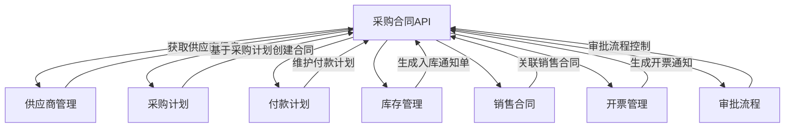
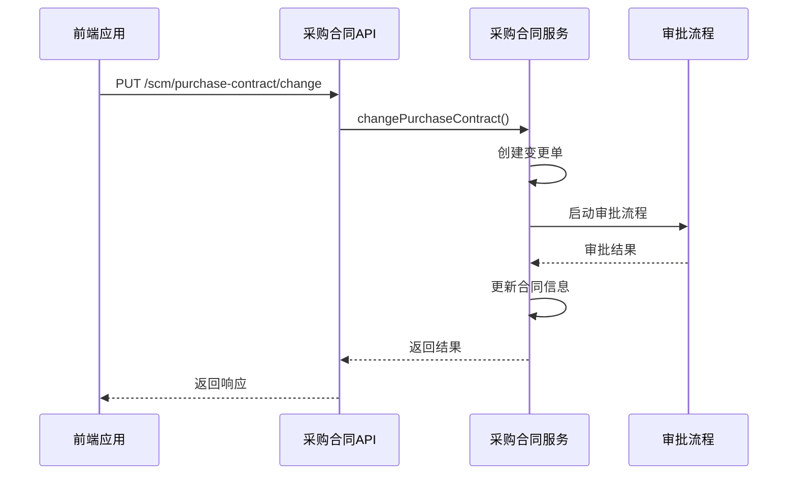

# 采购合同API

<cite>
**本文档引用的文件**
- [PurchaseContractApi.java](file://eplus-module-scm/eplus-module-scm-api/src/main/java/com/syj/eplus/module/scm/api/purchasecontract/PurchaseContractApi.java)
- [PurchaseContractController.java](file://eplus-module-scm/eplus-module-scm-biz/src/main/java/com/syj/eplus/module/scm/controller/admin/purchasecontract/PurchaseContractController.java)
- [PurchaseContractService.java](file://eplus-module-scm/eplus-module-scm-biz/src/main/java/com/syj/eplus/module/scm/service/purchasecontract/PurchaseContractService.java)
- [SavePurchaseContractReqVO.java](file://eplus-module-scm/eplus-module-scm-api/src/main/java/com/syj/eplus/module/scm/api/purchasecontract/dto/SavePurchaseContractReqVO.java)
- [SavePurchaseContractItemReqVO.java](file://eplus-module-scm/eplus-module-scm-api/src/main/java/com/syj/eplus/module/scm/api/purchasecontract/dto/SavePurchaseContractItemReqVO.java)
- [PurchaseContractStatusEnum.java](file://eplus-framework/eplus-common/src/main/java/com/syj/eplus/framework/common/enums/PurchaseContractStatusEnum.java)
- [PurchaseCheckEnum.java](file://eplus-framework/eplus-common/src/main/java/com/syj/eplus/framework/common/enums/PurchaseCheckEnum.java)
- [ErrorCodeConstants.java](file://eplus-module-scm/eplus-module-scm-api/src/main/java/com/syj/eplus/module/scm/enums/ErrorCodeConstants.java)
</cite>

## 目录
1. [简介](#简介)
2. [核心API端点](#核心api端点)
3. [请求体结构](#请求体结构)
4. [响应格式](#响应格式)
5. [合同状态机](#合同状态机)
6. [集成关系](#集成关系)
7. [错误码列表](#错误码列表)
8. [调用示例与集成指南](#调用示例与集成指南)

## 简介
采购合同API是供应链管理（SCM）模块的核心组件，负责管理采购合同的全生命周期操作。该API提供了创建、修改、查询、审批、下单、回签、作废等完整功能，支持与供应商管理、采购计划、付款计划等模块的深度集成。系统通过RESTful接口提供服务，确保了高可用性和可扩展性。

**Section sources**
- [PurchaseContractApi.java](file://eplus-module-scm/eplus-module-scm-api/src/main/java/com/syj/eplus/module/scm/api/purchasecontract/PurchaseContractApi.java)

## 核心API端点
采购合同API提供了一系列RESTful端点，覆盖了合同的全生命周期管理。

### 合同创建与修改


**Diagram sources**
- [PurchaseContractController.java](file://eplus-module-scm/eplus-module-scm-biz/src/main/java/com/syj/eplus/module/scm/controller/admin/purchasecontract/PurchaseContractController.java)

### 合同查询


**Diagram sources**
- [PurchaseContractController.java](file://eplus-module-scm/eplus-module-scm-biz/src/main/java/com/syj/eplus/module/scm/controller/admin/purchasecontract/PurchaseContractController.java)

### 合同审批与状态变更


**Diagram sources**
- [PurchaseContractController.java](file://eplus-module-scm/eplus-module-scm-biz/src/main/java/com/syj/eplus/module/scm/controller/admin/purchasecontract/PurchaseContractController.java)

### 合同关联操作


**Diagram sources**
- [PurchaseContractController.java](file://eplus-module-scm/eplus-module-scm-biz/src/main/java/com/syj/eplus/module/scm/controller/admin/purchasecontract/PurchaseContractController.java)

## 请求体结构
采购合同API的请求体结构设计完整，包含了合同基本信息、明细项、附件等所有必要信息。

### 合同基本信息
**SavePurchaseContractReqVO** 结构包含以下关键字段：

| 字段名 | 类型 | 必填 | 描述 |
|--------|------|------|------|
| `id` | Long | 否 | 主键，更新时需要 |
| `code` | String | 否 | 采购合同编号 |
| `auditStatus` | Integer | 是 | 审核状态 |
| `contractStatus` | Integer | 是 | 采购合同状态 |
| `totalAmount` | JsonAmount | 否 | 采购总金额 |
| `totalQuantity` | Integer | 否 | 采购总数量 |
| `printFlag` | Integer | 是 | 打印状态 |
| `prepayStatus` | Integer | 是 | 预付款状态 |
| `payStatus` | Integer | 是 | 付款状态 |
| `invoiceStatus` | Integer | 是 | 开票状态 |
| `trackUserId` | Long | 否 | 跟单员id |
| `trackUserName` | String | 否 | 跟单员名称 |
| `purchaseUserId` | Long | 否 | 采购员编码 |
| `purchaseUserName` | String | 否 | 采购员名称 |
| `venderId` | Long | 是 | 供应商主键 |
| `venderCode` | String | 否 | 供应商编码 |
| `stockId` | Long | 是 | 仓库主键 |
| `stockCode` | String | 否 | 仓库编码 |
| `purchasePlanId` | Long | 否 | 采购计划id |
| `purchasePlanCode` | String | 否 | 采购计划编号 |
| `saleContractId` | Long | 否 | 销售合同id |
| `saleContractCode` | String | 否 | 销售合同编号 |
| `remark` | String | 否 | 备注 |
| `annex` | List<SimpleFile> | 否 | 附件 |
| `companyId` | Long | 是 | 采购主体 |
| `paymentId` | Long | 否 | 付款方式id |
| `paymentName` | String | 否 | 付款方式名称 |
| `portId` | Long | 否 | 目的口岸 |
| `freight` | JsonAmount | 否 | 运费 |
| `otherCost` | JsonAmount | 否 | 其他费用 |
| `deliveryDate` | LocalDateTime | 否 | 交货日期 |
| `signBackFlag` | Integer | 否 | 回签标识 |
| `taxType` | Integer | 否 | 发票类型 |
| `auxiliaryFlag` | Integer | 否 | 是否辅料采购 |
| `paymentVenderId` | Long | 否 | 应付供应商主键 |
| `paymentVenderCode` | String | 否 | 应付供应商编号 |
| `paymentVenderName` | String | 否 | 应付供应商名称 |
| `currency` | String | 否 | 币种 |
| `purchasePaymentPlanList` | List<PurchasePaymentPlan> | 否 | 付款计划 |

**Section sources**
- [SavePurchaseContractReqVO.java](file://eplus-module-scm/eplus-module-scm-api/src/main/java/com/syj/eplus/module/scm/api/purchasecontract/dto/SavePurchaseContractReqVO.java)

### 合同明细项
**SavePurchaseContractItemReqVO** 结构包含以下关键字段：

| 字段名 | 类型 | 必填 | 描述 |
|--------|------|------|------|
| `id` | Long | 否 | 主键 |
| `skuId` | Long | 否 | skuid |
| `skuCode` | String | 否 | 产品编号 |
| `custId` | Long | 否 | 客户id |
| `custCode` | String | 否 | 客户编号 |
| `cskuCode` | String | 否 | 客户货号 |
| `quantity` | Integer | 否 | 采购数量 |
| `withTaxTotal` | JsonAmount | 否 | 采购含税金额 |
| `venderId` | Long | 否 | 供应商id |
| `venderCode` | String | 否 | 供应商编号 |
| `planArriveDate` | LocalDateTime | 否 | 预计到料日期 |
| `checkStatus` | Integer | 是 | 验货状态 |
| `receiveStatus` | Integer | 是 | 收货状态 |
| `purchaseContractId` | Long | 否 | 采购合同单号 |
| `purchaseContractCode` | String | 否 | 采购合同编号 |
| `qtyPerInnerbox` | Integer | 否 | 内箱装量 |
| `freeFlag` | Integer | 否 | 是否赠品 |
| `qtyPerOuterbox` | Integer | 否 | 外箱装量 |
| `packageLength` | BigDecimal | 否 | 包装规格长度 |
| `packageWidth` | BigDecimal | 否 | 包装规格宽度 |
| `packageHeight` | BigDecimal | 否 | 包装规格高度 |
| `packageUnit` | Integer | 否 | 包装规格单位 |
| `syncQuoteFlag` | Integer | 否 | 是否同步供应商报价 |
| `singleGrossweight` | JsonWeight | 否 | 单品毛重 |
| `packagingPrice` | JsonAmount | 否 | 包装价 |
| `shippingPrice` | JsonAmount | 否 | 运费 |
| `unitPrice` | JsonAmount | 否 | 采购单价 |
| `totalPrice` | JsonAmount | 否 | 总价 |
| `withTaxPrice` | JsonAmount | 否 | 含税总价 |
| `taxRate` | BigDecimal | 否 | 税率 |
| `purchaseType` | Integer | 是 | 采购类型 |
| `purchaseUserId` | Long | 否 | 采购员id |
| `purchaseUserName` | String | 否 | 采购员姓名 |
| `purchaseUserDeptId` | Long | 否 | 采购员部门id |
| `purchaseUserDeptName` | String | 否 | 采购员部门不名称 |
| `venderProdCode` | String | 否 | 工厂货号 |
| `quoteDate` | LocalDateTime | 否 | 报价日期 |
| `freightFlag` | Integer | 否 | 是否含运费 |
| `packageFlag` | Integer | 否 | 是否含包装 |
| `packageType` | List<Long> | 否 | 包装方式 |
| `currency` | String | 否 | 币种 |
| `faxFlag` | Integer | 否 | 是否含包装 |
| `moq` | Integer | 否 | 最小起购量 |
| `boxCount` | Integer | 否 | 箱数 |
| `warehousingType` | Integer | 否 | 入库状态 |
| `wmsIds` | String | 否 | 仓库id列表 |
| `wmsNames` | String | 否 | 仓库名称列表 |
| `delivery` | Integer | 否 | 交期 |
| `purchaseUrl` | String | 否 | 采购链接 |
| `remark` | String | 否 | 备注 |
| `submitFlag` | Integer | 否 | 提交审核标识 |
| `auxiliarySkuFlag` | Integer | 否 | 是否通用辅料 |
| `auxiliarySkuType` | Integer | 否 | 辅料采购类型 |
| `specRemark` | String | 否 | 规格描述 |
| `annex` | List<SimpleFile> | 否 | 附件 |
| `auxiliarySaleContractCode` | String | 否 | 辅料属于的销售合同 |
| `auxiliaryPurchaseContractCode` | String | 否 | 辅料属于的采购合同编号 |
| `auxiliarySkuId` | Long | 否 | 辅料属于的采购合同产品id |
| `auxiliarySkuCode` | String | 否 | 辅料属于的采购合同产品编号 |
| `auxiliaryCskuCode` | String | 否 | 辅料属于的采购合同产品客户货号 |
| `skuUnit` | String | 否 | 计量单位 |
| `measureUnit` | Integer | 否 | 计量单位 |
| `ownBrandFlag` | Integer | 否 | 自营产品标记 |
| `custProFlag` | Integer | 否 | 客户产品标记 |
| `packageCost` | JsonAmount | 否 | 包装费用 |
| `saleContractItemId` | Long | 否 | 销售明细主键 |
| `saleContractId` | Long | 否 | 销售合同主键 |
| `saleContractCode` | String | 否 | 销售合同编码 |
| `saleItemUniqueCode` | String | 否 | 销售合同明细编号 |
| `uniqueCode` | String | 否 | 唯一标识 |
| `sourceUniqueCode` | String | 否 |  |
| `specificationList` | List<JsonSpecificationEntity> | 否 | 规格 |
| `splitBoxFlag` | Integer | 否 | 是否分箱 |

**Section sources**
- [SavePurchaseContractItemReqVO.java](file://eplus-module-scm/eplus-module-scm-api/src/main/java/com/syj/eplus/module/scm/api/purchasecontract/dto/SavePurchaseContractItemReqVO.java)

## 响应格式
API响应遵循统一的格式，使用`CommonResult`包装返回结果。

### 响应结构
```json
{
  "code": 0,
  "msg": "成功",
  "data": {}
}
```

| 字段名 | 类型 | 描述 |
|--------|------|------|
| `code` | Integer | 响应码，0表示成功 |
| `msg` | String | 响应消息 |
| `data` | Object | 返回数据 |

### 分页查询响应
```json
{
  "code": 0,
  "msg": "成功",
  "data": {
    "list": [],
    "total": 0
  }
}
```

**Section sources**
- [PurchaseContractController.java](file://eplus-module-scm/eplus-module-scm-biz/src/main/java/com/syj/eplus/module/scm/controller/admin/purchasecontract/PurchaseContractController.java)

## 合同状态机
采购合同具有完整且严谨的状态机，确保了业务流程的正确性。

### 状态定义


**Diagram sources**
- [PurchaseContractStatusEnum.java](file://eplus-framework/eplus-common/src/main/java/com/syj/eplus/framework/common/enums/PurchaseContractStatusEnum.java)

### 状态转换规则
| 当前状态 | 可执行操作 | 目标状态 | 条件 |
|----------|------------|----------|------|
| 待提交 | 提交 | 待审批 | 合同信息完整 |
| 待提交 | 作废 | 已作废 | 无限制 |
| 待审批 | 通过 | 待下单 | 审批通过 |
| 待审批 | 驳回 | 已驳回 | 审批不通过 |
| 待审批 | 作废 | 已作废 | 无限制 |
| 已驳回 | 修改 | 待提交 | 修改合同信息 |
| 待下单 | 下单 | 待到货 | 供应商确认 |
| 待下单 | 作废 | 已作废 | 无限制 |
| 待到货 | 生产完成 | 已完成 | 生产完成 |
| 待到货 | 反下单 | 待下单 | 未到货 |
| 待到货 | 作废 | 已作废 | 无限制 |
| 已完成 | 结案 | 已结案 | 所有流程完成 |
| 已完成 | 作废 | 已作废 | 无限制 |
| 已作废 | 反作废 | 待提交 | 无限制 |

**Section sources**
- [PurchaseContractStatusEnum.java](file://eplus-framework/eplus-common/src/main/java/com/syj/eplus/framework/common/enums/PurchaseContractStatusEnum.java)

## 集成关系
采购合同API与多个业务模块紧密集成，形成了完整的供应链管理闭环。

### 模块集成关系


**Diagram sources**
- [PurchaseContractApi.java](file://eplus-module-scm/eplus-module-scm-api/src/main/java/com/syj/eplus/module/scm/api/purchasecontract/PurchaseContractApi.java)

### 与采购计划的集成
采购合同通常由采购计划生成，两者之间存在紧密的关联关系。当采购计划状态变更时，会触发相关采购合同的状态更新。

### 与付款计划的集成
采购合同包含详细的付款计划信息，系统会根据合同金额和付款条件自动生成付款计划，并与财务系统对接。

### 与库存管理的集成
采购合同完成后，可以生成入库通知单，触发库存管理流程，实现采购到入库的无缝衔接。

**Section sources**
- [PurchaseContractService.java](file://eplus-module-scm/eplus-module-scm-biz/src/main/java/com/syj/eplus/module/scm/service/purchasecontract/PurchaseContractService.java)

## 错误码列表
系统定义了详细的错误码，便于开发者快速定位和解决问题。

| 错误码 | 错误消息 | 业务含义 |
|--------|----------|----------|
| 1003002001 | 采购合同不存在 | 请求的采购合同在系统中不存在 |
| 1003002002 | 采购计划明细不存在 | 关联的采购计划明细不存在 |
| 1003002004 | 采购合同明细不存在 | 请求的采购合同明细不存在 |
| 1003003001 | 审核中,禁止修改 | 合同正在审批流程中，不允许修改 |
| 1003003002 | 采购合同非待到货状态 | 只有待到货状态的合同才能执行生产完成操作 |
| 1003004001 | 采购合同id为空 | 请求参数中采购合同id为空 |
| 1004002013 | 采购合同的未开票数量不足,剩余开票数量为{} | 开票数量超过合同允许的未开票数量 |
| 1004002014 | 采购合同明细均已转开票通知 | 采购合同明细已经全部转为开票通知，无法重复操作 |
| 1004002026 | 供应商不可用 | 关联的供应商状态为不可用 |
| 1004002029 | 该合同已经转过付款申请，不可作废！！！ | 合同已经关联付款申请，不允许作废 |
| 1004002030 | 该合同已经转过付款申请，不可变更供应商名称！！！ | 合同已经关联付款申请，不允许变更供应商名称 |
| 1004002031 | 该合同已经转过付款申请，不可变更采购数量！！！ | 合同已经关联付款申请，不允许变更采购数量 |

**Section sources**
- [ErrorCodeConstants.java](file://eplus-module-scm/eplus-module-scm-api/src/main/java/com/syj/eplus/module/scm/enums/ErrorCodeConstants.java)

## 调用示例与集成指南
本节提供实际的调用示例和集成指南，帮助开发者快速上手。

### 创建包含多个明细项的采购合同
```json
POST /scm/purchase-contract/create
{
  "code": "PC20231201001",
  "auditStatus": 1,
  "contractStatus": 1,
  "totalAmount": {
    "amount": 10000,
    "currency": "CNY"
  },
  "totalQuantity": 100,
  "printFlag": 1,
  "prepayStatus": 1,
  "payStatus": 1,
  "invoiceStatus": 1,
  "venderId": 1768,
  "venderCode": "VEN001",
  "stockId": 15661,
  "stockCode": "WH001",
  "purchasePlanId": 11749,
  "purchasePlanCode": "PP20231201001",
  "saleContractId": 26936,
  "saleContractCode": "SC20231201001",
  "remark": "测试合同",
  "companyId": 10492,
  "paymentId": 18194,
  "paymentName": "月结30天",
  "portId": 22430,
  "freight": {
    "amount": 500,
    "currency": "CNY"
  },
  "otherCost": {
    "amount": 200,
    "currency": "CNY"
  },
  "deliveryDate": "2023-12-31T00:00:00",
  "taxType": 1,
  "children": [
    {
      "skuId": 31593,
      "skuCode": "SKU001",
      "quantity": 50,
      "withTaxTotal": {
        "amount": 5000,
        "currency": "CNY"
      },
      "venderId": 27269,
      "planArriveDate": "2023-12-15T00:00:00",
      "checkStatus": 1,
      "receiveStatus": 1,
      "purchaseType": 1,
      "unitPrice": {
        "amount": 100,
        "currency": "CNY"
      },
      "totalPrice": {
        "amount": 5000,
        "currency": "CNY"
      },
      "withTaxPrice": {
        "amount": 5000,
        "currency": "CNY"
      },
      "taxRate": 0.13
    },
    {
      "skuId": 31594,
      "skuCode": "SKU002",
      "quantity": 50,
      "withTaxTotal": {
        "amount": 5000,
        "currency": "CNY"
      },
      "venderId": 27269,
      "planArriveDate": "2023-12-20T00:00:00",
      "checkStatus": 1,
      "receiveStatus": 1,
      "purchaseType": 1,
      "unitPrice": {
        "amount": 100,
        "currency": "CNY"
      },
      "totalPrice": {
        "amount": 5000,
        "currency": "CNY"
      },
      "withTaxPrice": {
        "amount": 5000,
        "currency": "CNY"
      },
      "taxRate": 0.13
    }
  ],
  "purchasePaymentPlanList": [
    {
      "planAmount": {
        "amount": 3000,
        "currency": "CNY"
      },
      "planDate": "2023-12-10T00:00:00",
      "planType": 1
    },
    {
      "planAmount": {
        "amount": 7000,
        "currency": "CNY"
      },
      "planDate": "2024-01-10T00:00:00",
      "planType": 2
    }
  ]
}
```

### 处理合同变更和版本管理
系统支持合同变更功能，当合同需要修改时，会创建变更单并启动审批流程。变更通过后，原合同会被更新，同时保留变更历史。



**Diagram sources**
- [PurchaseContractController.java](file://eplus-module-scm/eplus-module-scm-biz/src/main/java/com/syj/eplus/module/scm/controller/admin/purchasecontract/PurchaseContractController.java)

**Section sources**
- [PurchaseContractService.java](file://eplus-module-scm/eplus-module-scm-biz/src/main/java/com/syj/eplus/module/scm/service/purchasecontract/PurchaseContractService.java)