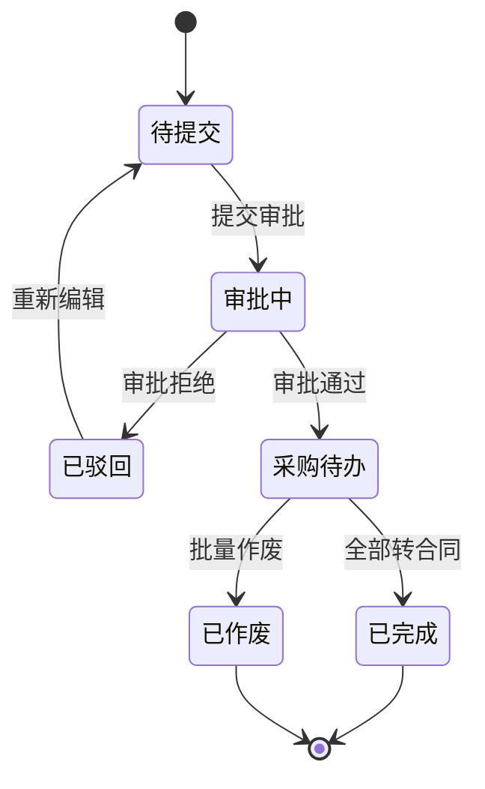
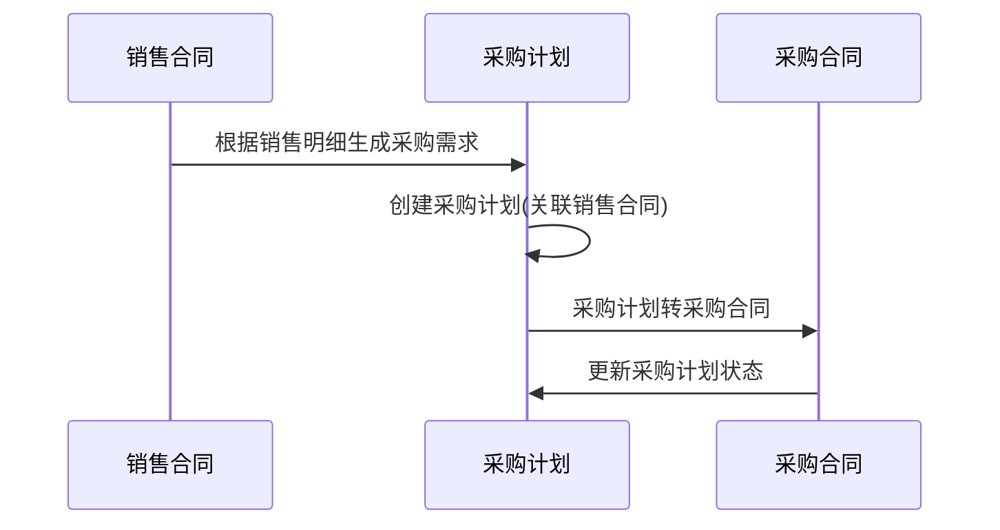
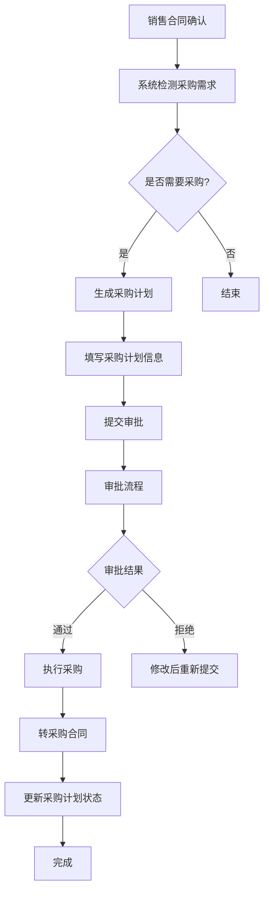

# 采购计划API

<cite>
**本文档引用的文件**  
- [PurchasePlanApi.java](file://eplus-module-scm/eplus-module-scm-api/src/main/java/com/syj/eplus/module/scm/api/purchaseplan/PurchasePlanApi.java)
- [AuxiliaryPurchasePlanController.java](file://eplus-module-scm/eplus-module-scm-biz/src/main/java/com/syj/eplus/module/scm/controller/admin/purchaseplan/AuxiliaryPurchasePlanController.java)
- [PurchasePlanApiImpl.java](file://eplus-module-scm/eplus-module-scm-biz/src/main/java/com/syj/eplus/module/scm/api/PurchasePlanApiImpl.java)
- [PurchasePlanServiceImpl.java](file://eplus-module-scm/eplus-module-scm-biz/src/main/java/com/syj/eplus/module/scm/service/purchaseplan/PurchasePlanServiceImpl.java)
- [PurchasePlanInfoSaveReqVO.java](file://eplus-module-scm/eplus-module-scm-biz/src/main/java/com/syj/eplus/module/scm/controller/admin/purchaseplan/vo/PurchasePlanInfoSaveReqVO.java)
- [PurchasePlanInfoRespVO.java](file://eplus-module-scm/eplus-module-scm-biz/src/main/java/com/syj/eplus/module/scm/controller/admin/purchaseplan/vo/PurchasePlanInfoRespVO.java)
- [PurchasePlanPageReqVO.java](file://eplus-module-scm/eplus-module-scm-biz/src/main/java/com/syj/eplus/module/scm/controller/admin/purchaseplan/vo/PurchasePlanPageReqVO.java)
- [PurchasePlanStatusEnum.java](file://eplus-module-scm/eplus-module-scm-biz/src/main/java/com/syj/eplus/module/scm/enums/PurchasePlanStatusEnum.java)
- [PurchaseModelEnum.java](file://eplus-module-scm/eplus-module-scm-biz/src/main/java/com/syj/eplus/module/scm/enums/PurchaseModelEnum.java)
- [ErrorCodeConstants.java](file://eplus-module-scm/eplus-module-scm-biz/src/main/java/com/syj/eplus/module/scm/enums/ErrorCodeConstants.java)
</cite>

## 目录
1. [简介](#简介)
2. [核心功能](#核心功能)
3. [RESTful API端点](#restful-api端点)
4. [采购计划状态管理](#采购计划状态管理)
5. [业务关联逻辑](#业务关联逻辑)
6. [错误码列表](#错误码列表)
7. [调用示例与集成指南](#调用示例与集成指南)
8. [附录](#附录)

## 简介

采购计划API是供应链管理系统中的核心模块，负责管理从采购需求生成、计划编制、审批、执行到与采购合同关联的完整生命周期。该API支持根据销售合同自动生成采购计划，实现采购需求与销售订单的紧密联动。系统通过工作流引擎实现采购计划的审批流程，确保采购活动的合规性和可追溯性。采购计划与库存预警、MRP运算等系统模块深度集成，支持智能采购决策。

**Section sources**
- [PurchasePlanApi.java](file://eplus-module-scm/eplus-module-scm-api/src/main/java/com/syj/eplus/module/scm/api/purchaseplan/PurchasePlanApi.java)
- [AuxiliaryPurchasePlanController.java](file://eplus-module-scm/eplus-module-scm-biz/src/main/java/com/syj/eplus/module/scm/controller/admin/purchaseplan/AuxiliaryPurchasePlanController.java)

## 核心功能

采购计划API提供以下核心功能：
- 采购计划的创建、更新、删除和查询
- 采购计划分页查询和看板展示
- 采购计划审批流程管理（提交、通过、拒绝）
- 采购计划批量作废处理
- 采购计划转采购合同功能
- 与销售合同、库存系统的数据联动
- 采购计划导出功能

系统支持两种类型的采购计划：普通采购计划和辅料采购计划，通过`auxiliaryFlag`字段进行区分。采购计划与销售合同通过`saleContractCode`字段关联，实现销售驱动采购的业务模式。

**Section sources**
- [AuxiliaryPurchasePlanController.java](file://eplus-module-scm/eplus-module-scm-biz/src/main/java/com/syj/eplus/module/scm/controller/admin/purchaseplan/AuxiliaryPurchasePlanController.java)
- [PurchasePlanServiceImpl.java](file://eplus-module-scm/eplus-module-scm-biz/src/main/java/com/syj/eplus/module/scm/service/purchaseplan/PurchasePlanServiceImpl.java)

## RESTful API端点

### 采购计划管理

#### 创建采购计划
- **HTTP方法**: POST
- **URL路径**: `/scm/auxiliary-purchase-plan/create`
- **权限要求**: `scm:auxiliary-purchase-plan:create`
- **请求体结构**: `PurchasePlanInfoSaveReqVO`
- **响应格式**: `CommonResult<List<CreatedResponse>>`
- **状态码**:
  - 200: 创建成功
  - 400: 请求参数错误
  - 403: 权限不足
  - 500: 服务器内部错误

#### 更新采购计划
- **HTTP方法**: PUT
- **URL路径**: `/scm/auxiliary-purchase-plan/update`
- **权限要求**: `scm:auxiliary-purchase-plan:update`
- **请求体结构**: `PurchasePlanInfoSaveReqVO`
- **响应格式**: `CommonResult<Boolean>`
- **状态码**:
  - 200: 更新成功
  - 400: 请求参数错误
  - 403: 权限不足
  - 404: 采购计划不存在
  - 500: 服务器内部错误

#### 删除采购计划
- **HTTP方法**: DELETE
- **URL路径**: `/scm/auxiliary-purchase-plan/delete`
- **权限要求**: `scm:auxiliary-purchase-plan:delete`
- **请求参数**: `id` (采购计划ID)
- **响应格式**: `CommonResult<Boolean>`
- **状态码**:
  - 200: 删除成功
  - 403: 权限不足
  - 404: 采购计划不存在
  - 500: 服务器内部错误

#### 获取采购计划详情
- **HTTP方法**: GET
- **URL路径**: `/scm/auxiliary-purchase-plan/detail`
- **权限要求**: `scm:auxiliary-purchase-plan:query`
- **请求参数**: `id` (采购计划ID)
- **响应格式**: `CommonResult<PurchasePlanInfoRespVO>`
- **状态码**:
  - 200: 获取成功
  - 400: 请求参数错误
  - 403: 权限不足
  - 404: 采购计划不存在
  - 500: 服务器内部错误

#### 采购计划分页查询
- **HTTP方法**: GET
- **URL路径**: `/scm/auxiliary-purchase-plan/page`
- **权限要求**: `scm:auxiliary-purchase-plan:query`
- **请求参数**: `PurchasePlanPageReqVO`
- **响应格式**: `CommonResult<PageResult<PurchasePlanInfoRespVO>>`
- **状态码**:
  - 200: 查询成功
  - 400: 请求参数错误
  - 403: 权限不足
  - 500: 服务器内部错误

#### 采购计划看板分页查询
- **HTTP方法**: GET
- **URL路径**: `/scm/auxiliary-purchase-plan/page-board`
- **权限要求**: `scm:auxiliary-purchase-plan:board`
- **请求参数**: `PurchasePlanPageReqVO`
- **响应格式**: `CommonResult<PageResult<PurchasePlanItemInfoRespVO>>`
- **状态码**:
  - 200: 查询成功
  - 400: 请求参数错误
  - 403: 权限不足
  - 500: 服务器内部错误

#### 导出采购计划Excel
- **HTTP方法**: GET
- **URL路径**: `/scm/auxiliary-purchase-plan/export-excel`
- **权限要求**: `scm:auxiliary-purchase-plan:export`
- **请求参数**: `PurchasePlanPageReqVO`
- **响应格式**: Excel文件
- **状态码**:
  - 200: 导出成功
  - 400: 请求参数错误
  - 403: 权限不足
  - 500: 服务器内部错误

### 采购计划审批

#### 提交审批任务
- **HTTP方法**: PUT
- **URL路径**: `/scm/auxiliary-purchase-plan/submit`
- **权限要求**: `scm:auxiliary-purchase-plan:submit`
- **请求参数**: `paymentId` (付款ID)
- **响应格式**: `CommonResult<Boolean>`
- **状态码**:
  - 200: 提交成功
  - 400: 请求参数错误
  - 403: 权限不足
  - 500: 服务器内部错误

#### 审批通过任务
- **HTTP方法**: PUT
- **URL路径**: `/scm/auxiliary-purchase-plan/approve`
- **权限要求**: `scm:auxiliary-purchase-plan:audit`
- **请求体结构**: `BpmTaskApproveReqDTO`
- **响应格式**: `CommonResult<Boolean>`
- **状态码**:
  - 200: 审批成功
  - 400: 请求参数错误
  - 403: 权限不足
  - 500: 服务器内部错误

#### 审批拒绝任务
- **HTTP方法**: PUT
- **URL路径**: `/scm/auxiliary-purchase-plan/reject`
- **权限要求**: `scm:auxiliary-purchase-plan:audit`
- **请求体结构**: `BpmTaskRejectReqDTO`
- **响应格式**: `CommonResult<Boolean>`
- **状态码**:
  - 200: 拒绝成功
  - 400: 请求参数错误
  - 403: 权限不足
  - 500: 服务器内部错误

### 采购计划执行

#### 批量作废采购计划
- **HTTP方法**: PUT
- **URL路径**: `/scm/auxiliary-purchase-plan/batch-finish`
- **权限要求**: `scm:auxiliary-purchase-plan:finish`
- **请求参数**: `planIdList` (采购计划ID列表)
- **响应格式**: `CommonResult<Boolean>`
- **状态码**:
  - 200: 作废成功
  - 400: 请求参数错误
  - 403: 权限不足
  - 500: 服务器内部错误

#### 采购计划转采购合同
- **HTTP方法**: POST
- **URL路径**: `/scm/auxiliary-purchase-plan/to-contract`
- **权限要求**: `scm:auxiliary-purchase-plan:contract`
- **请求参数**: `planItemIdList` (采购计划明细ID列表)
- **响应格式**: `CommonResult<Boolean>`
- **状态码**:
  - 200: 转合同成功
  - 400: 请求参数错误
  - 403: 权限不足
  - 404: 采购计划明细不存在
  - 500: 服务器内部错误

#### 获取转采购合同列表
- **HTTP方法**: GET
- **URL路径**: `/scm/auxiliary-purchase-plan/to-contract-list`
- **权限要求**: `scm:auxiliary-purchase-plan:contract`
- **请求参数**: `planItemIdList` (采购计划明细ID列表)
- **响应格式**: `CommonResult<List<PurchasePlanItemToContractRespVO>>`
- **状态码**:
  - 200: 获取成功
  - 400: 请求参数错误
  - 403: 权限不足
  - 500: 服务器内部错误

#### 采购计划通过列表转采购合同
- **HTTP方法**: POST
- **URL路径**: `/scm/auxiliary-purchase-plan/to-contract-save`
- **权限要求**: `scm:auxiliary-purchase-plan:contract`
- **请求体结构**: `PurchasePlanItemToContractSaveInfoReqVO`
- **响应格式**: `CommonResult<List<CreatedResponse>>`
- **状态码**:
  - 200: 转合同成功
  - 400: 请求参数错误
  - 403: 权限不足
  - 500: 服务器内部错误

**Section sources**
- [AuxiliaryPurchasePlanController.java](file://eplus-module-scm/eplus-module-scm-biz/src/main/java/com/syj/eplus/module/scm/controller/admin/purchaseplan/AuxiliaryPurchasePlanController.java)
- [PurchasePlanInfoSaveReqVO.java](file://eplus-module-scm/eplus-module-scm-biz/src/main/java/com/syj/eplus/module/scm/controller/admin/purchaseplan/vo/PurchasePlanInfoSaveReqVO.java)
- [PurchasePlanInfoRespVO.java](file://eplus-module-scm/eplus-module-scm-biz/src/main/java/com/syj/eplus/module/scm/controller/admin/purchaseplan/vo/PurchasePlanInfoRespVO.java)
- [PurchasePlanPageReqVO.java](file://eplus-module-scm/eplus-module-scm-biz/src/main/java/com/syj/eplus/module/scm/controller/admin/purchaseplan/vo/PurchasePlanPageReqVO.java)

## 采购计划状态管理

### 计划状态定义

采购计划包含以下状态：

| 状态码 | 状态名称 | 说明 |
|--------|--------|------|
| 10 | 待提交 | 采购计划创建后，尚未提交审批 |
| 20 | 审批中 | 采购计划已提交，正在审批流程中 |
| 30 | 已驳回 | 采购计划审批被拒绝 |
| 40 | 采购待办 | 采购计划审批通过，等待执行采购 |
| 50 | 已完成 | 采购计划已全部执行完毕 |
| 99 | 已作废 | 采购计划被作废，不再执行 |

### 状态转换规则



**Diagram sources**
- [PurchasePlanStatusEnum.java](file://eplus-module-scm/eplus-module-scm-biz/src/main/java/com/syj/eplus/module/scm/enums/PurchasePlanStatusEnum.java)
- [PurchasePlanServiceImpl.java](file://eplus-module-scm/eplus-module-scm-biz/src/main/java/com/syj/eplus/module/scm/service/purchaseplan/PurchasePlanServiceImpl.java)

### 状态转换流程

1. **创建采购计划**：系统创建采购计划，默认状态为"待提交"(10)
2. **提交审批**：用户提交采购计划，状态变更为"审批中"(20)
3. **审批结果**：
   - 审批通过：状态变更为"采购待办"(40)
   - 审批拒绝：状态变更为"已驳回"(30)
4. **执行采购**：将采购计划明细转为采购合同，当所有明细都转为合同后，状态变更为"已完成"(50)
5. **作废处理**：对采购计划进行批量作废操作，状态变更为"已作废"(99)

**Section sources**
- [PurchasePlanStatusEnum.java](file://eplus-module-scm/eplus-module-scm-biz/src/main/java/com/syj/eplus/module/scm/enums/PurchasePlanStatusEnum.java)
- [PurchasePlanServiceImpl.java](file://eplus-module-scm/eplus-module-scm-biz/src/main/java/com/syj/eplus/module/scm/service/purchaseplan/PurchasePlanServiceImpl.java)

## 业务关联逻辑

### 与销售合同的关联

采购计划与销售合同通过`saleContractCode`字段建立关联关系。系统支持根据销售合同自动生成采购计划，实现销售驱动采购的业务模式。



**Diagram sources**
- [PurchasePlanServiceImpl.java](file://eplus-module-scm/eplus-module-scm-biz/src/main/java/com/syj/eplus/module/scm/service/purchaseplan/PurchasePlanServiceImpl.java)
- [PurchasePlanApiImpl.java](file://eplus-module-scm/eplus-module-scm-biz/src/main/java/com/syj/eplus/module/scm/api/PurchasePlanApiImpl.java)

### 与库存预警的关联

采购计划系统与库存管理模块集成，当库存低于安全库存时，系统会生成采购预警，提示需要创建采购计划。采购计划执行过程中，会锁定相应的库存，确保采购数量的准确性。

### 与MRP运算的关联

系统支持MRP(物料需求计划)运算，根据销售预测、现有库存、在途采购等数据，自动计算物料需求，生成采购建议。采购计划可以基于MRP运算结果创建，实现智能化采购决策。

### 采购计划数据结构

#### 采购计划主表(PurchasePlanInfoSaveReqVO)
- `id`: 采购计划ID
- `code`: 采购计划编号
- `saleContractCode`: 销售合同编号
- `saleContractId`: 销售合同ID
- `custId`: 客户ID
- `custCode`: 客户编号
- `custName`: 客户名称
- `companyId`: 采购主体ID
- `planDate`: 计划日期
- `remark`: 备注
- `auxiliaryFlag`: 辅料标志(0:否,1:是)
- `children`: 采购计划明细列表

#### 采购计划明细(PurchasePlanItemSaveReqVO)
- `id`: 采购计划明细ID
- `purchasePlanId`: 采购计划ID
- `skuId`: 产品ID
- `skuCode`: 产品编码
- `skuName`: 产品名称
- `needPurQuantity`: 需采购数量
- `purchaseUserId`: 采购员ID
- `venderId`: 供应商ID
- `withTaxPrice`: 含税单价
- `taxRate`: 税率
- `currency`: 币种
- `purchaseType`: 采购类型
- `freeFlag`: 免费标志
- `sortNum`: 排序号

**Section sources**
- [PurchasePlanInfoSaveReqVO.java](file://eplus-module-scm/eplus-module-scm-biz/src/main/java/com/syj/eplus/module/scm/controller/admin/purchaseplan/vo/PurchasePlanInfoSaveReqVO.java)
- [PurchasePlanItemSaveReqVO.java](file://eplus-module-scm/eplus-module-scm-biz/src/main/java/com/syj/eplus/module/scm/controller/admin/purchaseplanitem/vo/PurchasePlanItemSaveReqVO.java)
- [PurchasePlanServiceImpl.java](file://eplus-module-scm/eplus-module-scm-biz/src/main/java/com/syj/eplus/module/scm/service/purchaseplan/PurchasePlanServiceImpl.java)

## 错误码列表

| 错误码 | 业务含义 | 说明 |
|--------|--------|------|
| PURCHASE_PLAN_NOT_EXISTS | 采购计划不存在 | 请求的采购计划ID不存在 |
| PURCHASE_PLAN_ITEM_NOT_EXISTS | 采购计划明细不存在 | 请求的采购计划明细ID不存在 |
| PURCHASE_PLAN_PRODUCT_NULL | 采购计划产品为空 | 创建采购计划时，产品明细不能为空 |
| PURCHASE_PLAN_CURRENCY_WRONG | 采购计划币种错误 | 采购计划币种不在采购主体可用币种列表中 |
| PURCHASE_PLAN_LOCK_MORE | 采购锁定数量大于销售数量 | 采购计划锁定数量不能超过销售数量 |
| PURCHASE_PLAN_LOCK_LESS | 采购锁定数量小于销售锁定数量 | 采购计划锁定数量不能小于销售锁定数量 |
| PURCHASE_PLAN_ITEM_LOCK_QUANTITY_ERROR | 采购计划明细锁定数量错误 | 采购计划明细锁定数量不能大于销售数量 |
| PURCHASE_PLAN_CLOSED | 采购计划已作废 | 不能对已作废的采购计划进行操作 |
| PURCHASE_PLAN_NOT_ALLOW_CANCEL | 采购计划不允许作废 | 存在未作废的拆分采购计划，不能作废源采购计划 |
| PURCHASE_PLAN_ITEM_NEEDQUANTITY_ERROR | 采购计划明细需求数量错误 | 采购计划明细需求数量必须大于0 |
| PURCHASE_PLAN_ITEM_SUB_EMPTY | 采购计划明细子产品为空 | 组套产品没有子产品信息 |
| VENDER_NOT_EXISTS | 供应商不存在 | 请求的供应商ID不存在 |
| PAYMENT_NULL | 付款条件为空 | 供应商没有设置默认付款条件 |
| COMPANY_NOT_EXISTS | 公司不存在 | 请求的公司ID不存在 |
| COMPANY_NOT_CURRENCY_EXISTS | 公司币种不存在 | 公司没有设置可用币种 |

**Section sources**
- [ErrorCodeConstants.java](file://eplus-module-scm/eplus-module-scm-biz/src/main/java/com/syj/eplus/module/scm/enums/ErrorCodeConstants.java)
- [PurchasePlanServiceImpl.java](file://eplus-module-scm/eplus-module-scm-biz/src/main/java/com/syj/eplus/module/scm/service/purchaseplan/PurchasePlanServiceImpl.java)

## 调用示例与集成指南

### 根据销售合同自动生成采购计划



**Diagram sources**
- [PurchasePlanServiceImpl.java](file://eplus-module-scm/eplus-module-scm-biz/src/main/java/com/syj/eplus/module/scm/service/purchaseplan/PurchasePlanServiceImpl.java)
- [AuxiliaryPurchasePlanController.java](file://eplus-module-scm/eplus-module-scm-biz/src/main/java/com/syj/eplus/module/scm/controller/admin/purchaseplan/AuxiliaryPurchasePlanController.java)

### 处理计划变更

当采购计划发生变更时，系统会记录变更日志，并根据变更内容更新相关数据：

1. **变更采购数量**：更新采购计划明细的需采购数量
2. **变更供应商**：更新采购计划明细的供应商信息
3. **变更采购员**：更新采购计划明细的采购员信息
4. **变更价格**：更新采购计划明细的含税单价和税率

系统会自动计算变更前后的差异，并在操作日志中记录变更详情。

### 与采购合同的关联

采购计划与采购合同的关联通过"转合同"操作实现：

1. 选择需要转合同的采购计划明细
2. 系统根据采购计划明细生成采购合同
3. 采购合同继承采购计划的相关信息，包括：
   - 供应商信息
   - 产品信息
   - 数量信息
   - 价格信息
   - 付款条件
4. 更新采购计划状态为"已完成"

**Section sources**
- [PurchasePlanServiceImpl.java](file://eplus-module-scm/eplus-module-scm-biz/src/main/java/com/syj/eplus/module/scm/service/purchaseplan/PurchasePlanServiceImpl.java)
- [PurchasePlanApiImpl.java](file://eplus-module-scm/eplus-module-scm-biz/src/main/java/com/syj/eplus/module/scm/api/PurchasePlanApiImpl.java)

## 附录

### 采购计划类型

| 类型 | 说明 |
|------|------|
| STANDARD | 标准采购 |
| COMBINE | 组合采购 |

### 采购模式

| 模式 | 说明 |
|------|------|
| 0 | 普通采购 |
| 1 | 辅料采购 |

### 请求体示例

```json
{
  "code": "PP23120001",
  "saleContractCode": "SC23120001",
  "saleContractId": 1001,
  "custId": 2001,
  "custCode": "C001",
  "custName": "客户A",
  "companyId": 3001,
  "planDate": "2023-12-01T10:00:00",
  "remark": "首批采购",
  "auxiliaryFlag": 0,
  "children": [
    {
      "skuId": 4001,
      "skuCode": "P001",
      "skuName": "产品A",
      "needPurQuantity": 1000,
      "purchaseUserId": 5001,
      "venderId": 6001,
      "withTaxPrice": {
        "currency": "CNY",
        "amount": 100.00
      },
      "taxRate": 13.00,
      "currency": "CNY",
      "purchaseType": "STANDARD",
      "freeFlag": 0,
      "sortNum": 1
    }
  ]
}
```

### 响应体示例

```json
{
  "code": 0,
  "msg": "成功",
  "data": {
    "id": 7001,
    "code": "PP23120001",
    "saleContractCode": "SC23120001",
    "saleContractId": 1001,
    "custId": 2001,
    "custCode": "C001",
    "custName": "客户A",
    "companyId": 3001,
    "companyName": "采购公司A",
    "planDate": "2023-12-01T10:00:00",
    "remark": "首批采购",
    "auxiliaryFlag": 0,
    "planStatus": 10,
    "auditStatus": 0,
    "children": [
      {
        "id": 8001,
        "purchasePlanId": 7001,
        "skuId": 4001,
        "skuCode": "P001",
        "skuName": "产品A",
        "needPurQuantity": 1000,
        "purchaseUserId": 5001,
        "purchaseUserName": "采购员A",
        "venderId": 6001,
        "venderName": "供应商A",
        "withTaxPrice": {
          "currency": "CNY",
          "amount": 100.00
        },
        "taxRate": 13.00,
        "currency": "CNY",
        "purchaseType": "STANDARD",
        "freeFlag": 0,
        "sortNum": 1
      }
    ]
  }
}
```

**Section sources**
- [PurchasePlanInfoSaveReqVO.java](file://eplus-module-scm/eplus-module-scm-biz/src/main/java/com/syj/eplus/module/scm/controller/admin/purchaseplan/vo/PurchasePlanInfoSaveReqVO.java)
- [PurchasePlanInfoRespVO.java](file://eplus-module-scm/eplus-module-scm-biz/src/main/java/com/syj/eplus/module/scm/controller/admin/purchaseplan/vo/PurchasePlanInfoRespVO.java)