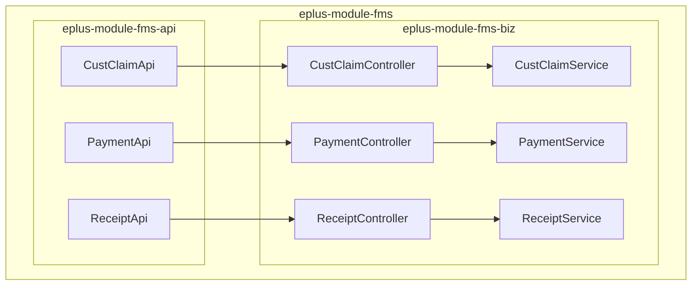
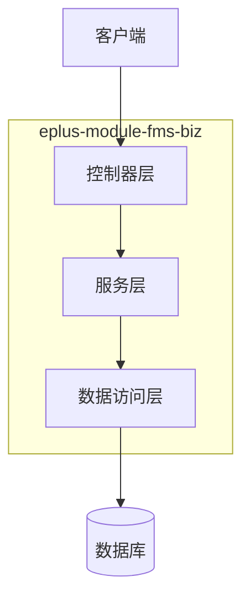
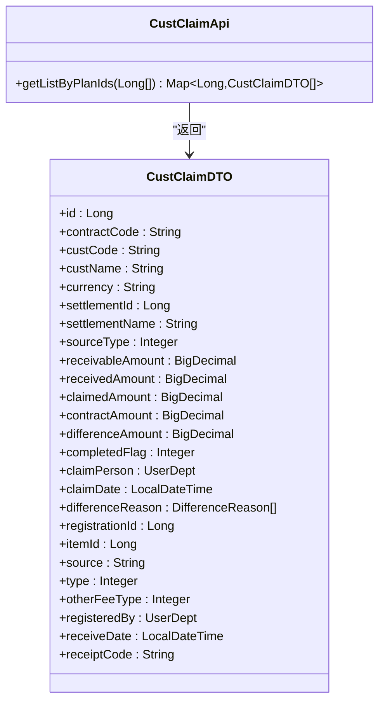
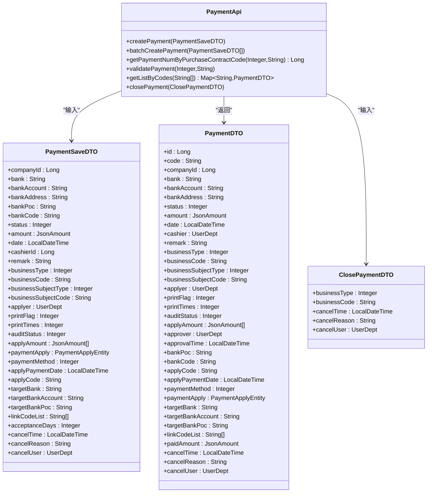
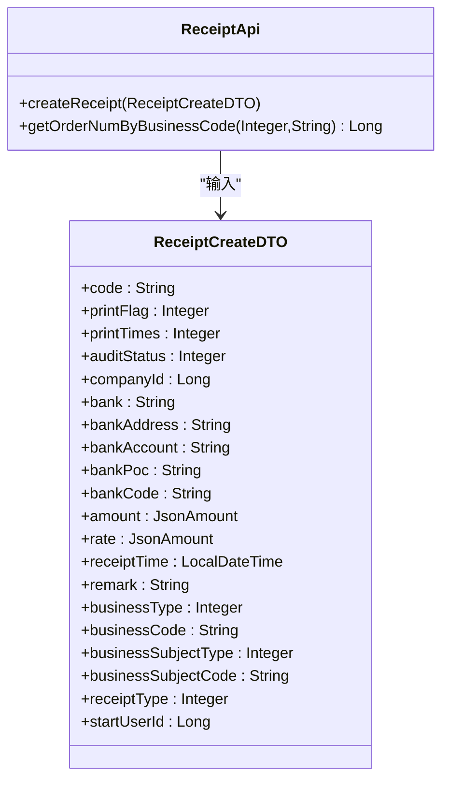

# 财务管理API

<cite>
**本文档引用的文件**  
- [CustClaimApi.java](file://eplus-module-fms/eplus-module-fms-api/src/main/java/com/syj/eplus/module/fms/api/payment/api/custclaim/CustClaimApi.java)
- [PaymentApi.java](file://eplus-module-fms/eplus-module-fms-api/src/main/java/com/syj/eplus/module/fms/api/payment/api/payment/PaymentApi.java)
- [ReceiptApi.java](file://eplus-module-fms/eplus-module-fms-api/src/main/java/com/syj/eplus/module/fms/api/payment/api/receipt/ReceiptApi.java)
- [CustClaimDTO.java](file://eplus-module-fms/eplus-module-fms-api/src/main/java/com/syj/eplus/module/fms/api/payment/api/custclaim/dto/CustClaimDTO.java)
- [PaymentSaveDTO.java](file://eplus-module-fms/eplus-module-fms-api/src/main/java/com/syj/eplus/module/fms/api/payment/api/payment/dto/PaymentSaveDTO.java)
- [PaymentDTO.java](file://eplus-module-fms/eplus-module-fms-api/src/main/java/com/syj/eplus/module/fms/api/payment/api/payment/dto/PaymentDTO.java)
- [ClosePaymentDTO.java](file://eplus-module-fms/eplus-module-fms-api/src/main/java/com/syj/eplus/module/fms/api/payment/api/payment/dto/ClosePaymentDTO.java)
- [ReceiptCreateDTO.java](file://eplus-module-fms/eplus-module-fms-api/src/main/java/com/syj/eplus/module/fms/api/payment/api/receipt/dto/ReceiptCreateDTO.java)
- [CustClaimController.java](file://eplus-module-fms/eplus-module-fms-biz/src/main/java/com/syj/eplus/module/fms/controller/admin/custclaim/CustClaimController.java)
- [PaymentController.java](file://eplus-module-fms/eplus-module-fms-biz/src/main/java/com/syj/eplus/module/fms/controller/admin/payment/PaymentController.java)
- [ReceiptController.java](file://eplus-module-fms/eplus-module-fms-biz/src/main/java/com/syj/eplus/module/fms/controller/admin/receipt/ReceiptController.java)
- [ErrorCodeConstants.java](file://eplus-module-fms/eplus-module-fms-api/src/main/java/com/syj/eplus/module/fms/api/payment/enums/ErrorCodeConstants.java)
</cite>

## 目录
1. [引言](#引言)
2. [项目结构](#项目结构)
3. [核心组件](#核心组件)
4. [架构概述](#架构概述)
5. [详细组件分析](#详细组件分析)
6. [依赖分析](#依赖分析)
7. [性能考虑](#性能考虑)
8. [故障排除指南](#故障排除指南)
9. [结论](#结论)

## 引言
本文档全面涵盖财务管理模块的API，重点描述付款、收款和客户认领等核心财务接口。文档遵循OpenAPI/Swagger标准，详细说明每个API端点的技术规范，包括HTTP方法、资源路径、请求参数、请求体结构、响应格式和状态码。同时提供字段的精确业务定义和数据类型说明，包含典型财务流程的请求/响应示例，明确API的安全机制（身份验证、授权和审计要求），并列出所有可能的财务相关错误码及其业务影响。

## 项目结构
财务管理模块（fms）分为API接口层和业务实现层，分别位于`eplus-module-fms-api`和`eplus-module-fms-biz`模块中。API层定义了外部服务调用的接口，而Biz层实现了具体的业务逻辑和控制器。



**图示来源**
- [CustClaimApi.java](file://eplus-module-fms/eplus-module-fms-api/src/main/java/com/syj/eplus/module/fms/api/payment/api/custclaim/CustClaimApi.java)
- [PaymentApi.java](file://eplus-module-fms/eplus-module-fms-api/src/main/java/com/syj/eplus/module/fms/api/payment/api/payment/PaymentApi.java)
- [ReceiptApi.java](file://eplus-module-fms/eplus-module-fms-api/src/main/java/com/syj/eplus/module/fms/api/payment/api/receipt/ReceiptApi.java)
- [CustClaimController.java](file://eplus-module-fms/eplus-module-fms-biz/src/main/java/com/syj/eplus/module/fms/controller/admin/custclaim/CustClaimController.java)
- [PaymentController.java](file://eplus-module-fms/eplus-module-fms-biz/src/main/java/com/syj/eplus/module/fms/controller/admin/payment/PaymentController.java)
- [ReceiptController.java](file://eplus-module-fms/eplus-module-fms-biz/src/main/java/com/syj/eplus/module/fms/controller/admin/receipt/ReceiptController.java)

**章节来源**
- [CustClaimApi.java](file://eplus-module-fms/eplus-module-fms-api/src/main/java/com/syj/eplus/module/fms/api/payment/api/custclaim/CustClaimApi.java)
- [PaymentApi.java](file://eplus-module-fms/eplus-module-fms-api/src/main/java/com/syj/eplus/module/fms/api/payment/api/payment/PaymentApi.java)
- [ReceiptApi.java](file://eplus-module-fms/eplus-module-fms-api/src/main/java/com/syj/eplus/module/fms/api/payment/api/receipt/ReceiptApi.java)

## 核心组件
财务管理模块的核心组件包括客户认领、付款和收款三大功能模块。每个模块都提供了API接口供其他系统调用，并通过控制器暴露RESTful端点。服务层实现了具体的业务逻辑，包括数据验证、状态转换和审计跟踪。

**章节来源**
- [CustClaimApi.java](file://eplus-module-fms/eplus-module-fms-api/src/main/java/com/syj/eplus/module/fms/api/payment/api/custclaim/CustClaimApi.java)
- [PaymentApi.java](file://eplus-module-fms/eplus-module-fms-api/src/main/java/com/syj/eplus/module/fms/api/payment/api/payment/PaymentApi.java)
- [ReceiptApi.java](file://eplus-module-fms/eplus-module-fms-api/src/main/java/com/syj/eplus/module/fms/api/payment/api/receipt/ReceiptApi.java)

## 架构概述
财务管理模块采用典型的分层架构，包括API层、控制器层、服务层和数据访问层。API层定义了外部调用的契约，控制器层处理HTTP请求和响应，服务层实现核心业务逻辑，数据访问层负责与数据库交互。



**图示来源**
- [CustClaimController.java](file://eplus-module-fms/eplus-module-fms-biz/src/main/java/com/syj/eplus/module/fms/controller/admin/custclaim/CustClaimController.java)
- [PaymentController.java](file://eplus-module-fms/eplus-module-fms-biz/src/main/java/com/syj/eplus/module/fms/controller/admin/payment/PaymentController.java)
- [ReceiptController.java](file://eplus-module-fms/eplus-module-fms-biz/src/main/java/com/syj/eplus/module/fms/controller/admin/receipt/ReceiptController.java)

## 详细组件分析

### 客户认领分析
客户认领模块提供了查询、创建和取消客户认领的功能。该模块主要用于处理客户付款的认领和分配。

#### 客户认领API接口


**图示来源**
- [CustClaimApi.java](file://eplus-module-fms/eplus-module-fms-api/src/main/java/com/syj/eplus/module/fms/api/payment/api/custclaim/CustClaimApi.java)
- [CustClaimDTO.java](file://eplus-module-fms/eplus-module-fms-api/src/main/java/com/syj/eplus/module/fms/api/payment/api/custclaim/dto/CustClaimDTO.java)

**章节来源**
- [CustClaimApi.java](file://eplus-module-fms/eplus-module-fms-api/src/main/java/com/syj/eplus/module/fms/api/payment/api/custclaim/CustClaimApi.java)
- [CustClaimDTO.java](file://eplus-module-fms/eplus-module-fms-api/src/main/java/com/syj/eplus/module/fms/api/payment/api/custclaim/dto/CustClaimDTO.java)

### 付款分析
付款模块提供了创建、更新、删除、查询付款单以及执行付款确认、审批和作废等操作的功能。

#### 付款API接口


**图示来源**
- [PaymentApi.java](file://eplus-module-fms/eplus-module-fms-api/src/main/java/com/syj/eplus/module/fms/api/payment/api/payment/PaymentApi.java)
- [PaymentSaveDTO.java](file://eplus-module-fms/eplus-module-fms-api/src/main/java/com/syj/eplus/module/fms/api/payment/api/payment/dto/PaymentSaveDTO.java)
- [PaymentDTO.java](file://eplus-module-fms/eplus-module-fms-api/src/main/java/com/syj/eplus/module/fms/api/payment/api/payment/dto/PaymentDTO.java)
- [ClosePaymentDTO.java](file://eplus-module-fms/eplus-module-fms-api/src/main/java/com/syj/eplus/module/fms/api/payment/api/payment/dto/ClosePaymentDTO.java)

**章节来源**
- [PaymentApi.java](file://eplus-module-fms/eplus-module-fms-api/src/main/java/com/syj/eplus/module/fms/api/payment/api/payment/PaymentApi.java)
- [PaymentSaveDTO.java](file://eplus-module-fms/eplus-module-fms-api/src/main/java/com/syj/eplus/module/fms/api/payment/api/payment/dto/PaymentSaveDTO.java)
- [PaymentDTO.java](file://eplus-module-fms/eplus-module-fms-api/src/main/java/com/syj/eplus/module/fms/api/payment/api/payment/dto/PaymentDTO.java)
- [ClosePaymentDTO.java](file://eplus-module-fms/eplus-module-fms-api/src/main/java/com/syj/eplus/module/fms/api/payment/api/payment/dto/ClosePaymentDTO.java)

### 收款分析
收款模块提供了创建、更新、删除、查询收款单以及执行收款确认和审批等操作的功能。

#### 收款API接口


**图示来源**
- [ReceiptApi.java](file://eplus-module-fms/eplus-module-fms-api/src/main/java/com/syj/eplus/module/fms/api/payment/api/receipt/ReceiptApi.java)
- [ReceiptCreateDTO.java](file://eplus-module-fms/eplus-module-fms-api/src/main/java/com/syj/eplus/module/fms/api/payment/api/receipt/dto/ReceiptCreateDTO.java)

**章节来源**
- [ReceiptApi.java](file://eplus-module-fms/eplus-module-fms-api/src/main/java/com/syj/eplus/module/fms/api/payment/api/receipt/ReceiptApi.java)
- [ReceiptCreateDTO.java](file://eplus-module-fms/eplus-module-fms-api/src/main/java/com/syj/eplus/module/fms/api/payment/api/receipt/dto/ReceiptCreateDTO.java)

## 依赖分析
财务管理模块与其他业务模块存在明确的依赖关系。销售模块（sms）和采购模块（scm）会调用财务模块的API来创建收款单和付款单。财务模块通过API接口暴露服务，其他模块通过依赖注入使用这些服务。

```mermaid
graph TD
subgraph "其他模块"
SMS[sms模块]
SCM[scm模块]
OA[oa模块]
end
subgraph "财务模块"
FMS[fms模块]
end
SMS --> FMS : "调用"
SCM --> FMS : "调用"
OA --> FMS : "调用"
FMS --> Database[(数据库)]
```

**图示来源**
- [CustClaimApi.java](file://eplus-module-fms/eplus-module-fms-api/src/main/java/com/syj/eplus/module/fms/api/payment/api/custclaim/CustClaimApi.java)
- [PaymentApi.java](file://eplus-module-fms/eplus-module-fms-api/src/main/java/com/syj/eplus/module/fms/api/payment/api/payment/PaymentApi.java)
- [ReceiptApi.java](file://eplus-module-fms/eplus-module-fms-api/src/main/java/com/syj/eplus/module/fms/api/payment/api/receipt/ReceiptApi.java)

**章节来源**
- [CustClaimApi.java](file://eplus-module-fms/eplus-module-fms-api/src/main/java/com/syj/eplus/module/fms/api/payment/api/custclaim/CustClaimApi.java)
- [PaymentApi.java](file://eplus-module-fms/eplus-module-fms-api/src/main/java/com/syj/eplus/module/fms/api/payment/api/payment/PaymentApi.java)
- [ReceiptApi.java](file://eplus-module-fms/eplus-module-fms-api/src/main/java/com/syj/eplus/module/fms/api/payment/api/receipt/ReceiptApi.java)

## 性能考虑
财务管理模块在设计时考虑了性能优化。对于批量操作（如批量创建付款单、批量计划付款），系统提供了专门的API以减少网络往返次数。分页查询接口支持大数据量的高效检索，导出功能在服务端处理大数据集时会自动调整分页大小以避免内存溢出。

## 故障排除指南
当遇到API调用失败时，首先检查返回的错误码。财务模块定义了特定的错误码，如`RECEIPT_NOT_EXISTS`（收款单不存在）、`PAYMENT_NOT_EXIST`（付款单不存在）等。确保请求参数符合业务规则，特别是金额、日期和业务编号等关键字段。对于权限相关的错误，确认调用方具有相应的操作权限（如`fms:payment:create`）。

**章节来源**
- [ErrorCodeConstants.java](file://eplus-module-fms/eplus-module-fms-api/src/main/java/com/syj/eplus/module/fms/api/payment/enums/ErrorCodeConstants.java)

## 结论
财务管理API提供了完整的付款、收款和客户认领功能，通过清晰的分层架构和标准化的接口设计，支持企业核心财务流程的自动化。API设计遵循RESTful原则，提供了丰富的操作和查询功能，同时通过权限控制和审计机制确保财务数据的安全性和可追溯性。开发者在集成时应遵循文档中的规范，正确处理各种业务场景和错误情况。