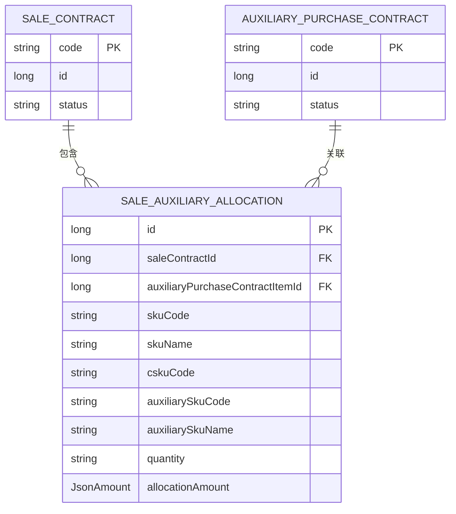
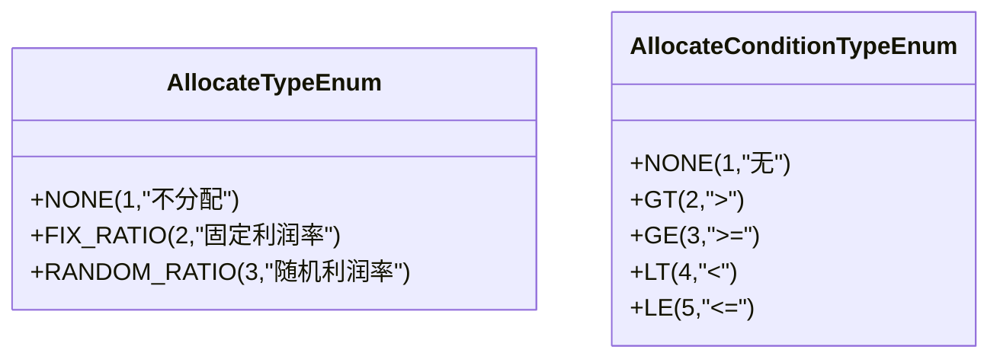
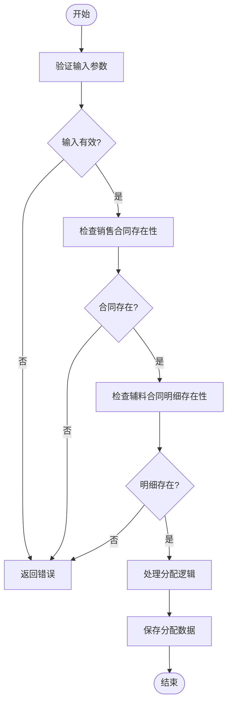
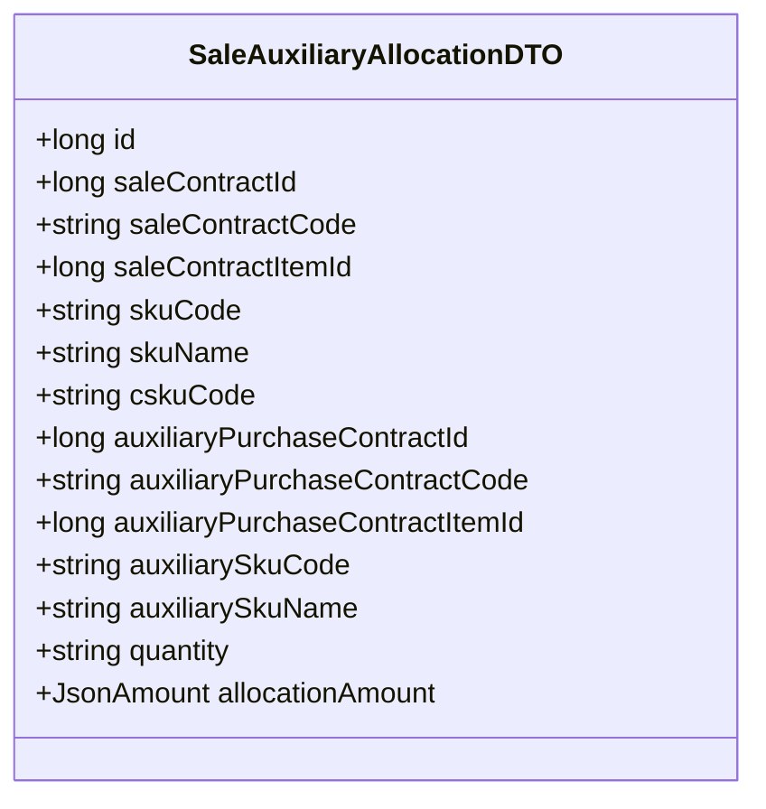

# 辅助项分配API

<cite>
**本文档引用文件**  
- [SaleAuxiliaryAllocationApi.java](file://eplus-module-sms/eplus-module-sms-api/src/main/java/com/syj/eplus/module/sms/api/SaleAuxiliaryAllocationApi.java)
- [SaleAuxiliaryAllocationApiImpl.java](file://eplus-module-sms/eplus-module-sms-biz/src/main/java/com/syj/eplus/module/sms/api/SaleAuxiliaryAllocationApiImpl.java)
- [SaleAuxiliaryAllocationService.java](file://eplus-module-sms/eplus-module-sms-biz/src/main/java/com/syj/eplus/module/sms/service/saleauxiliaryallocation/SaleAuxiliaryAllocationService.java)
- [SaleAuxiliaryAllocationServiceImpl.java](file://eplus-module-sms/eplus-module-sms-biz/src/main/java/com/syj/eplus/module/sms/service/saleauxiliaryallocation/SaleAuxiliaryAllocationServiceImpl.java)
- [SaleAuxiliaryAllocationDTO.java](file://eplus-module-sms/eplus-module-sms-api/src/main/java/com/syj/eplus/module/sms/api/dto/SaleAuxiliaryAllocationDTO.java)
- [ErrorCodeConstants.java](file://eplus-module-sms/eplus-module-sms-api/src/main/java/com/syj/eplus/module/sms/enums/ErrorCodeConstants.java)
- [AllocateTypeEnum.java](file://eplus-module-sms/eplus-module-sms-api/src/main/java/com/syj/eplus/module/sms/enums/AllocateTypeEnum.java)
- [AllocateConditionTypeEnum.java](file://eplus-module-sms/eplus-module-sms-api/src/main/java/com/syj/eplus/module/sms/enums/AllocateConditionTypeEnum.java)
</cite>

## 目录
1. [简介](#简介)
2. [核心组件](#核心组件)
3. [数据模型说明](#数据模型说明)
4. [分配规则配置](#分配规则配置)
5. [API输入参数详解](#api输入参数详解)
6. [API响应数据结构](#api响应数据结构)
7. [事务性保证](#事务性保证)
8. [错误码说明](#错误码说明)
9. [性能优化建议](#性能优化建议)

## 简介
辅助项分配API用于将附加服务或产品（如包装、运输、保险等）分配给销售合同或订单。该API提供了将辅料采购合同明细与销售合同明细进行关联和分摊的功能，确保成本能够准确地分配到相应的销售合同中。

## 核心组件

**辅助项分配API**的核心组件包括`SaleAuxiliaryAllocationApi`接口、`SaleAuxiliaryAllocationServiceImpl`实现类以及相关的DTO和实体类。这些组件共同协作，实现了辅助项的分配功能。

**辅助项分配服务**通过调用`SaleAuxiliaryAllocationService`接口来执行具体的分配逻辑。该服务负责处理分配请求，验证数据完整性，并将分配结果持久化到数据库中。

**数据传输对象**（DTO）用于在不同层之间传递数据。`SaleAuxiliaryAllocationDTO`包含了分配所需的所有信息，如销售合同ID、辅料采购合同ID、分摊金额等。

**Section sources**
- [SaleAuxiliaryAllocationApi.java](file://eplus-module-sms/eplus-module-sms-api/src/main/java/com/syj/eplus/module/sms/api/SaleAuxiliaryAllocationApi.java#L8-L17)
- [SaleAuxiliaryAllocationServiceImpl.java](file://eplus-module-sms/eplus-module-sms-biz/src/main/java/com/syj/eplus/module/sms/service/saleauxiliaryallocation/SaleAuxiliaryAllocationServiceImpl.java#L48-L227)
- [SaleAuxiliaryAllocationDTO.java](file://eplus-module-sms/eplus-module-sms-api/src/main/java/com/syj/eplus/module/sms/api/dto/SaleAuxiliaryAllocationDTO.java#L9-L70)

## 数据模型说明

### 辅助项分类
辅助项分为多种类型，包括但不限于包装、运输、保险等。每种类型的辅助项都有其特定的成本计算方式。

### 成本计算方式
成本计算基于预设的分配规则，可以是固定比例、随机比例或其他条件。分配金额以`JsonAmount`类型存储，支持多币种处理。

### 与主合同的关联关系
每个辅助项都与一个主销售合同相关联。这种关联通过`saleContractId`字段建立，确保了辅助项的成本能够正确地归集到对应的销售合同上。

**Diagram sources**
- [SaleAuxiliaryAllocationDTO.java](file://eplus-module-sms/eplus-module-sms-api/src/main/java/com/syj/eplus/module/sms/api/dto/SaleAuxiliaryAllocationDTO.java#L10-L70)

## 分配规则配置

分配规则可以通过`AllocateTypeEnum`枚举进行配置，支持以下几种类型：
- **不分配**（NONE）：不进行任何分配。
- **固定利润率**（FIX_RATIO）：按照固定的利润率进行分配。
- **随机利润率**（RANDOM_RATIO）：按照随机的利润率进行分配。

此外，还可以通过`AllocateConditionTypeEnum`枚举设置分配条件，例如大于、小于、等于等。

**Diagram sources**
- [AllocateTypeEnum.java](file://eplus-module-sms/eplus-module-sms-api/src/main/java/com/syj/eplus/module/sms/enums/AllocateTypeEnum.java#L11-L18)
- [AllocateConditionTypeEnum.java](file://eplus-module-sms/eplus-module-sms-api/src/main/java/com/syj/eplus/module/sms/enums/AllocateConditionTypeEnum.java#L11-L18)

## API输入参数详解

### 分配类型
分配类型由`AllocateTypeEnum`枚举定义，决定了如何计算分摊金额。

### 主合同/订单ID
主合同或订单的ID是分配操作的关键参数，用于确定哪些销售合同需要进行辅助项分配。

### 辅助项明细列表
辅助项明细列表包含了一系列需要分配的辅助项信息，包括辅料采购合同ID、分摊金额等。

**Diagram sources**
- [SaleAuxiliaryAllocationServiceImpl.java](file://eplus-module-sms/eplus-module-sms-biz/src/main/java/com/syj/eplus/module/sms/service/saleauxiliaryallocation/SaleAuxiliaryAllocationServiceImpl.java#L127-L186)

## API响应数据结构

API响应包含分配结果和可能产生的费用明细。主要字段包括：
- **id**：分配记录的主键。
- **saleContractId**：销售合同ID。
- **saleContractCode**：销售合同编号。
- **saleContractItemId**：销售合同明细ID。
- **skuCode**：产品编号。
- **skuName**：产品名称。
- **cskuCode**：客户货号。
- **auxiliaryPurchaseContractId**：辅料采购合同ID。
- **auxiliaryPurchaseContractCode**：辅料采购合同编号。
- **auxiliaryPurchaseContractItemId**：辅料采购合同明细ID。
- **auxiliarySkuCode**：辅料产品编号。
- **auxiliarySkuName**：辅料产品名称。
- **quantity**：采购数量。
- **allocationAmount**：分摊金额。

**Diagram sources**
- [SaleAuxiliaryAllocationDTO.java](file://eplus-module-sms/eplus-module-sms-api/src/main/java/com/syj/eplus/module/sms/api/dto/SaleAuxiliaryAllocationDTO.java#L10-L70)

## 事务性保证

辅助项分配操作具有事务性保证，确保分配操作的原子性。如果在分配过程中发生任何错误，整个操作将被回滚，保持数据的一致性。

## 错误码说明

以下是可能遇到的错误码及其解决方案：

| 错误码 | 描述 | 解决方案 |
| --- | --- | --- |
| 1_010_001_001 | 销售合同辅料分摊不存在 | 检查提供的ID是否正确，确认记录是否存在 |
| 1_009_001_001 | 合同不存在 | 确认销售合同ID是否正确，检查合同状态 |
| 1_009_002_001 | 合同明细不存在 | 确认销售合同明细ID是否正确，检查明细状态 |
| 1_009_002_036 | 采购合同明细不存在 | 确认辅料采购合同明细ID是否正确，检查明细状态 |

**Section sources**
- [ErrorCodeConstants.java](file://eplus-module-sms/eplus-module-sms-api/src/main/java/com/syj/eplus/module/sms/enums/ErrorCodeConstants.java#L69-L113)

## 性能优化建议

### 批量处理大量分配请求
对于大量分配请求，建议使用批量处理方式，减少数据库交互次数，提高处理效率。

### 使用缓存
合理利用缓存机制，避免重复查询相同的数据，提升系统响应速度。

### 并发控制
在高并发场景下，注意并发控制，防止数据竞争和不一致问题。