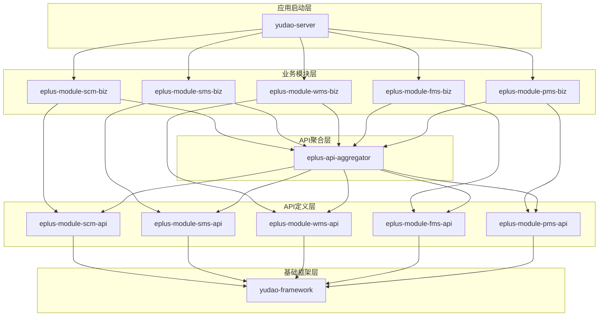
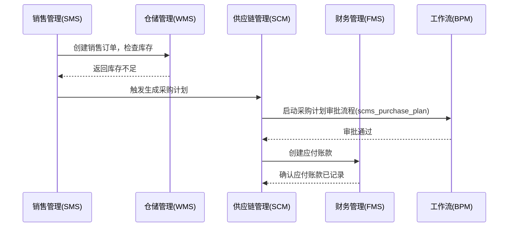
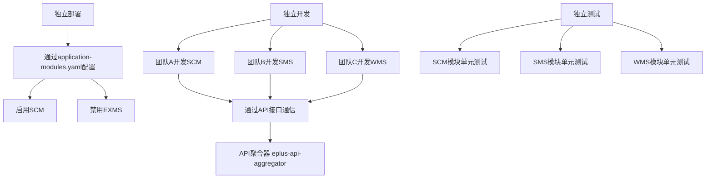
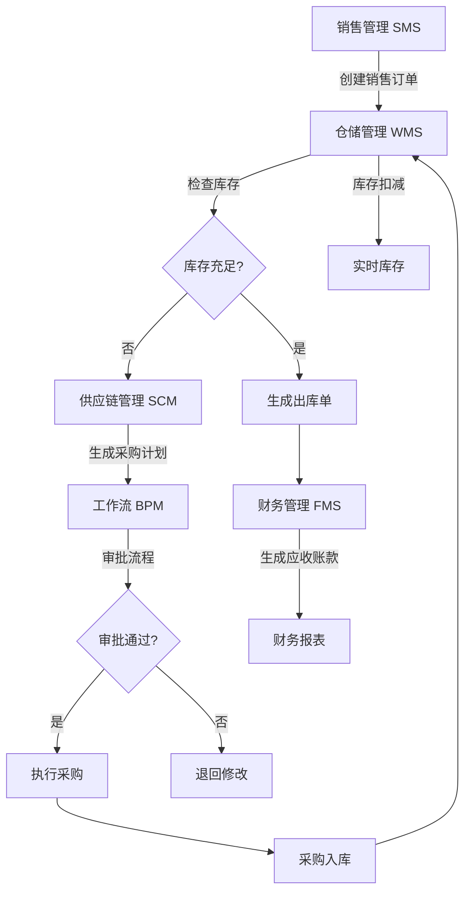

# 业务模块说明

<cite>
**本文档引用的文件**   
- [README.md](file://README.md)
- [application-modules.yaml](file://yudao-server/src/main/resources/application-modules.yaml)
- [eplus-module-scm/pom.xml](file://eplus-module-scm/pom.xml)
- [eplus-module-sms/pom.xml](file://eplus-module-sms/pom.xml)
- [eplus-module-wms/pom.xml](file://eplus-module-wms/pom.xml)
- [eplus-module-fms/pom.xml](file://eplus-module-fms/pom.xml)
- [eplus-module-pms/pom.xml](file://eplus-module-pms/pom.xml)
- [eplus-api-aggregator/pom.xml](file://eplus-api-aggregator/pom.xml)
- [eplus-module-crm-biz/pom.xml](file://eplus-module-crm/eplus-module-crm-biz/pom.xml)
- [清库脚本.sql](file://sql/mysql/清库脚本.sql)
- [BpmDefinitionKeyEnum.java](file://yudao-module-bpm/yudao-module-bpm-api/src/main/java/cn/iocoder/yudao/module/bpm/enums/definition/BpmDefinitionKeyEnum.java)
</cite>

## 目录
1. [引言](#引言)
2. [项目结构与模块化设计](#项目结构与模块化设计)
3. [核心业务模块概览](#核心业务模块概览)
4. [模块间数据流与业务协同](#模块间数据流与业务协同)
5. [模块化架构优势](#模块化架构优势)
6. [关键业务流程图](#关键业务流程图)
7. [各模块功能清单与使用场景](#各模块功能清单与使用场景)
8. [结论](#结论)

## 引言

本说明文档旨在系统性地介绍ERP系统中的各个核心业务领域。文档将为供应链、销售、仓储、财务、产品等主要业务模块提供概览性介绍，阐明其业务目标和在整体系统中的位置。文档将详细描述各模块之间的数据流和业务协同关系，例如销售订单如何触发采购计划和库存调整。同时，文档将解释模块化设计如何支持独立开发、测试和部署，并通过业务流程图展示关键业务场景的跨模块协作。最后，为每个模块提供简要的功能清单和典型使用场景，帮助读者理解各模块的价值和适用范围。

**Section sources**
- [README.md](file://README.md#L11-L13)

## 项目结构与模块化设计

本ERP系统采用高度模块化的微服务架构设计，将复杂的业务系统拆分为多个独立的业务模块，每个模块负责一个特定的业务领域。这种设计极大地提升了系统的可维护性、可扩展性和开发效率。

系统的整体架构分为四个主要层次：
1.  **核心基础层**：提供统一的技术栈和基础框架，包括`yudao-framework`（包含26个Spring Boot Starter）和`yudao-dependencies`（Maven BOM依赖管理）。
2.  **系统基础模块**：提供系统级的通用服务，如`yudao-module-system`（用户、权限、菜单管理）、`yudao-module-infra`（代码生成、文件管理）和`yudao-module-bpm`（工作流引擎）。
3.  **核心业务模块**：实现具体的业务功能，如供应链、销售、仓储、财务等。每个业务模块都遵循`*-module-{name}`的命名规范。
4.  **应用启动层**：`yudao-server`作为Spring Boot应用的启动入口，聚合所有业务模块。

每个业务模块（如`eplus-module-scm`）自身又分为两个子模块：
*   **`*-api`模块**：定义该模块对外提供的API接口、数据传输对象（DTO）和枚举。这是模块对外暴露契约的唯一方式。
*   **`*-biz`模块**：包含该模块的业务实现，如Controller、Service、Mapper等。

这种清晰的分层确保了模块间的松耦合。业务模块之间不直接依赖对方的`-biz`实现，而是通过`-api`模块进行通信。

**Diagram sources**
- [README.md](file://README.md#L62-L179)
- [eplus-api-aggregator/pom.xml](file://eplus-api-aggregator/pom.xml)

**Section sources**
- [README.md](file://README.md#L62-L240)
- [eplus-module-scm/pom.xml](file://eplus-module-scm/pom.xml)
- [eplus-module-sms/pom.xml](file://eplus-module-sms/pom.xml)
- [eplus-module-wms/pom.xml](file://eplus-module-wms/pom.xml)
- [eplus-module-fms/pom.xml](file://eplus-module-fms/pom.xml)
- [eplus-module-pms/pom.xml](file://eplus-module-pms/pom.xml)

## 核心业务模块概览

本系统包含18个核心业务模块，覆盖了企业运营的各个方面。以下是几个关键模块的业务目标和系统定位：

*   **供应链管理 (SCM)**：负责企业采购活动的全生命周期管理，包括供应商管理、采购计划、采购合同、付款和开票。它是连接外部供应商与内部仓储、财务的核心枢纽。
*   **销售管理 (SMS)**：管理企业销售活动的全过程，包括客户报价、销售合同、订单管理和客户服务。它是企业收入的源头，驱动着仓储和财务模块的运作。
*   **仓储管理 (WMS)**：负责企业所有物料和成品的库存管理，包括入库、出库、库存盘点和库存调整。它作为物流的中心节点，与供应链、销售和生产模块紧密交互。
*   **财务管理 (FMS)**：处理企业的所有财务活动，包括应收（客户账款）、应付（供应商账款）、资金管理和财务报表。它作为企业资金流的记录者和管理者，与所有业务模块都有数据交互。
*   **产品管理 (PMS)**：建立和维护企业所有产品的主数据，包括产品档案（SPU/SKU）、分类、BOM（物料清单）和海关数据。它是所有业务模块共享的基础数据源。

这些模块共同构成了ERP系统的核心，通过标准化的流程和数据流，实现了企业资源的优化配置和高效协同。

**Section sources**
- [README.md](file://README.md#L364-L394)

## 模块间数据流与业务协同

各业务模块并非孤立运行，而是通过明确的数据流和业务规则紧密协同，形成一个完整的业务闭环。

一个典型的跨模块业务场景是**销售订单到采购计划的触发流程**：
1.  **销售管理 (SMS)**：销售部门创建并确认一份销售订单。
2.  **仓储管理 (WMS)**：系统自动检查库存，发现库存不足以满足订单需求。
3.  **供应链管理 (SCM)**：系统根据缺货信息，自动生成一份采购计划单，以补充所需物料。
4.  **财务管理 (FMS)**：采购计划审批通过后，后续的采购合同、付款申请等流程会触发应付账款的创建。

另一个重要的协同是**工作流审批**。系统通过`yudao-module-bpm`模块实现统一的流程审批。例如，一个`eplus-module-scm`中的采购合同需要审批时，会调用工作流模块的API，启动一个预定义的审批流程。审批流程的标识（如`scm_purchase_contract`）在`清库脚本.sql`中被明确列出，确保了流程与业务数据的一一对应。

**Diagram sources**
- [README.md](file://README.md#L371-L383)
- [清库脚本.sql](file://sql/mysql/清库脚本.sql#L356-L357)
- [BpmDefinitionKeyEnum.java](file://yudao-module-bpm/yudao-module-bpm-api/src/main/java/cn/iocoder/yudao/module/bpm/enums/definition/BpmDefinitionKeyEnum.java)

**Section sources**
- [README.md](file://README.md#L364-L394)
- [清库脚本.sql](file://sql/mysql/清库脚本.sql)
- [BpmDefinitionKeyEnum.java](file://yudao-module-bpm/yudao-module-bpm-api/src/main/java/cn/iocoder/yudao/module/bpm/enums/definition/BpmDefinitionKeyEnum.java)

## 模块化架构优势

本系统的模块化设计带来了显著的优势，支持了独立开发、测试和部署：

1.  **独立开发**：每个业务团队可以专注于自己的模块。例如，财务团队可以独立开发`eplus-module-fms`，而无需了解销售模块的内部实现。团队只需依赖`eplus-module-fms-api`中定义的接口。
2.  **独立测试**：每个`*-biz`模块都可以进行独立的单元测试和集成测试。`eplus-module-crm-biz`的POM文件中虽然存在对其他`-biz`模块的违规依赖（已被标记为`TODO`），但理想情况下，测试应通过`eplus-api-aggregator`引入的API进行，确保测试的隔离性。
3.  **独立部署**：通过`application-modules.yaml`配置文件，可以灵活地启用或禁用特定的业务模块。例如，如果企业暂时不需要展会管理功能，可以将`exms`模块的`enabled`设置为`false`，从而减少应用的启动时间和内存占用。
4.  **降低耦合**：`eplus-api-aggregator`模块作为API聚合器，使得业务模块只需依赖这一个聚合模块，即可获得所有其他模块的API，极大地简化了依赖管理，避免了复杂的依赖网。

这种架构设计使得系统能够快速响应业务变化，新功能的开发和旧功能的迭代互不影响，保障了系统的稳定性和敏捷性。

**Diagram sources**
- [application-modules.yaml](file://yudao-server/src/main/resources/application-modules.yaml)
- [eplus-api-aggregator/pom.xml](file://eplus-api-aggregator/pom.xml)
- [eplus-module-crm-biz/pom.xml](file://eplus-module-crm/eplus-module-crm-biz/pom.xml#L61-L69)

**Section sources**
- [application-modules.yaml](file://yudao-server/src/main/resources/application-modules.yaml)
- [eplus-api-aggregator/pom.xml](file://eplus-api-aggregator/pom.xml)
- [eplus-module-crm-biz/pom.xml](file://eplus-module-crm/eplus-module-crm-biz/pom.xml)

## 关键业务流程图

以下流程图展示了“销售订单”这一核心业务场景如何驱动跨模块的协作。

**Diagram sources**
- [README.md](file://README.md#L371-L383)
- [清库脚本.sql](file://sql/mysql/清库脚本.sql#L359-L360)

## 各模块功能清单与使用场景

| 模块 | 功能清单 | 典型使用场景 |
| :--- | :--- | :--- |
| **供应链管理 (SCM)** | 采购管理、供应商管理、询价报价、付款管理、开票管理 | 采购员根据生产计划创建采购订单，并向多家供应商询价，最终选择最优供应商签订合同并安排付款。 |
| **销售管理 (SMS)** | 销售合同、报价管理、订单管理、客户服务 | 销售代表为客户创建报价单，客户确认后转为正式销售合同，并生成发货指令。 |
| **仓储管理 (WMS)** | 库存管理、入库管理、出库管理、仓库管理、库存调整 | 仓库管理员根据采购订单执行收货入库，根据销售订单执行拣货出库，并定期进行库存盘点。 |
| **财务管理 (FMS)** | 应收管理、应付管理、资金管理、财务报表 | 财务人员根据销售合同登记应收账款，根据采购合同登记应付账款，并生成月度资金流水报表。 |
| **产品管理 (PMS)** | 产品档案、分类管理、BOM管理、海关数据 | 产品经理创建新产品档案，定义其SKU和BOM结构，并录入海关HS编码以便出口报关。 |

**Section sources**
- [README.md](file://README.md#L364-L394)

## 结论

本ERP系统通过清晰的模块化设计，成功地将复杂的业务体系分解为一系列高内聚、低耦合的业务模块。供应链、销售、仓储、财务和产品等核心模块各司其职，通过标准化的数据流和工作流进行高效协同。模块化架构不仅明确了各模块的业务边界和价值，还为系统的独立开发、测试和部署提供了坚实的基础，极大地提升了开发效率和系统稳定性。未来，系统可以基于此架构轻松地扩展新的业务模块，以满足企业不断发展的需求。