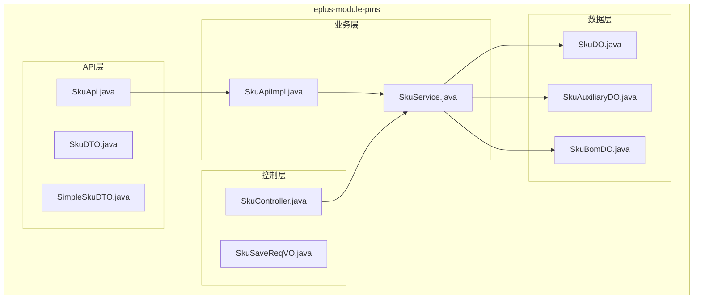
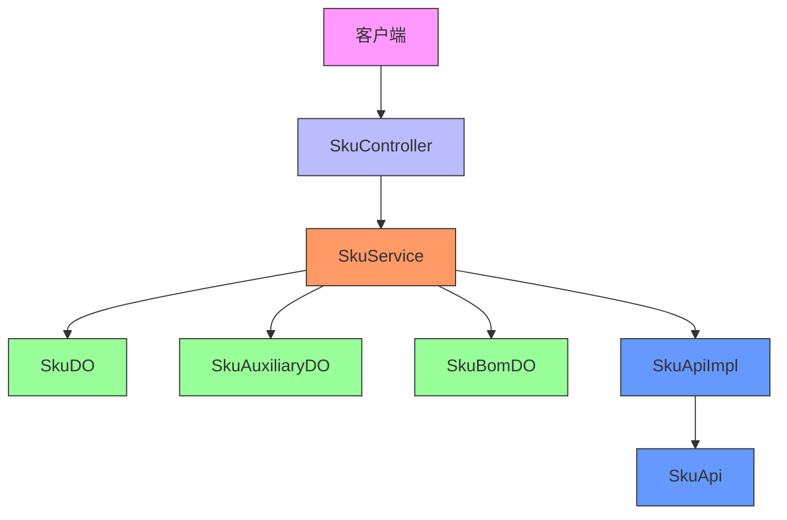
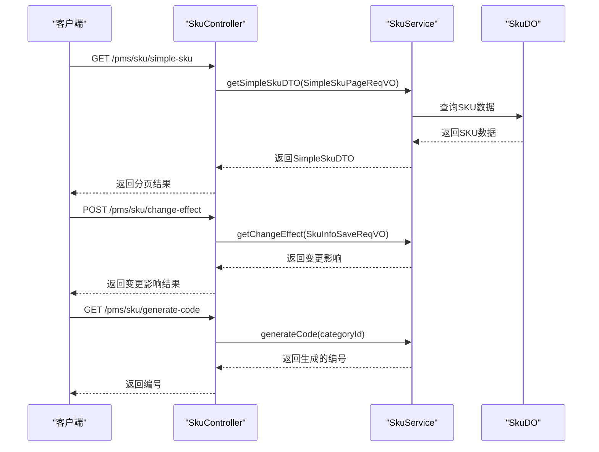
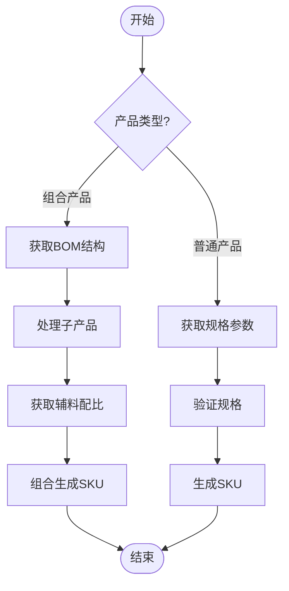
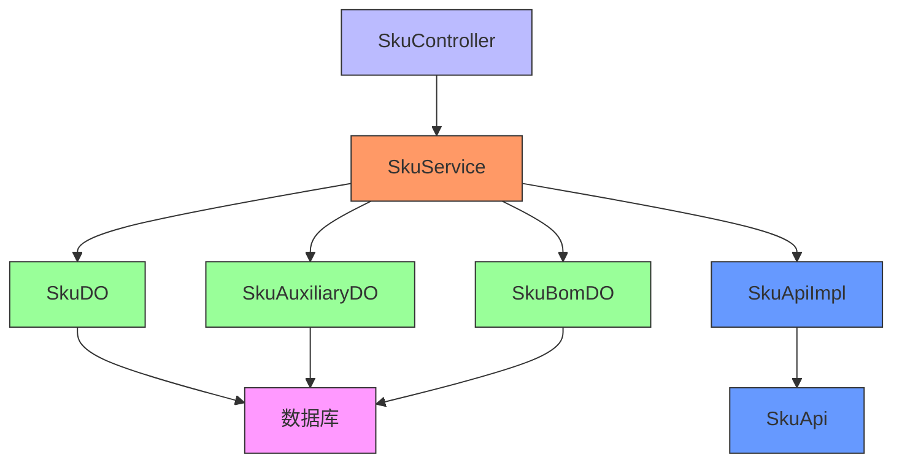

# SKU规格管理

<cite>
**本文档引用文件**  
- [SkuApi.java](file://eplus-module-pms/eplus-module-pms-api/src/main/java/com/syj/eplus/module/pms/api/sku/SkuApi.java)
- [SkuApiImpl.java](file://eplus-module-pms/eplus-module-pms-biz/src/main/java/com/syj/eplus/module/pms/api/SkuApiImpl.java)
- [SkuDTO.java](file://eplus-module-pms/eplus-module-pms-api/src/main/java/com/syj/eplus/module/pms/api/sku/dto/SkuDTO.java)
- [SimpleSkuDTO.java](file://eplus-module-pms/eplus-module-pms-api/src/main/java/com/syj/eplus/module/pms/api/sku/dto/SimpleSkuDTO.java)
- [SkuService.java](file://eplus-module-pms/eplus-module-pms-biz/src/main/java/com/syj/eplus/module/pms/service/sku/SkuService.java)
- [SkuDO.java](file://eplus-module-pms/eplus-module-pms-biz/src/main/java/com/syj/eplus/module/pms/dal/dataobject/sku/SkuDO.java)
- [SkuAuxiliaryDO.java](file://eplus-module-pms/eplus-module-pms-biz/src/main/java/com/syj/eplus/module/pms/dal/dataobject/skuauxiliary/SkuAuxiliaryDO.java)
- [SkuBomDO.java](file://eplus-module-pms/eplus-module-pms-biz/src/main/java/com/syj/eplus/module/pms/dal/dataobject/skubom/SkuBomDO.java)
- [SkuController.java](file://eplus-module-pms/eplus-module-pms-biz/src/main/java/com/syj/eplus/module/pms/controller/admin/sku/SkuController.java)
- [SkuSaveReqVO.java](file://eplus-module-pms/eplus-module-pms-biz/src/main/java/com/syj/eplus/module/pms/controller/admin/sku/vo/SkuSaveReqVO.java)
</cite>

## 目录
1. [引言](#引言)
2. [项目结构](#项目结构)
3. [核心组件](#核心组件)
4. [架构概述](#架构概述)
5. [详细组件分析](#详细组件分析)
6. [依赖分析](#依赖分析)
7. [性能考虑](#性能考虑)
8. [故障排除指南](#故障排除指南)
9. [结论](#结论)

## 引言
本文档详细介绍了SKU规格管理系统的实现，重点涵盖产品规格的定义、维护和使用。文档详细说明了规格数据模型，包括规格类型、规格参数、规格值等字段定义，解释了规格如何与SKU关联，以及如何通过规格组合生成不同的SKU。此外，文档还提供了规格管理API接口文档，包括创建规格、更新规格、查询规格列表等接口的请求参数、响应格式和使用示例，并描述了规格数据在产品展示、搜索筛选、报价单生成等场景中的应用方式。

## 项目结构
SKU规格管理功能主要位于`eplus-module-pms`模块中，该模块负责产品管理系统的各项功能。核心的SKU管理功能分布在API接口、业务逻辑、数据访问和控制器等层次中。

**图表来源**  
- [SkuApi.java](file://eplus-module-pms/eplus-module-pms-api/src/main/java/com/syj/eplus/module/pms/api/sku/SkuApi.java)
- [SkuApiImpl.java](file://eplus-module-pms/eplus-module-pms-biz/src/main/java/com/syj/eplus/module/pms/api/SkuApiImpl.java)
- [SkuService.java](file://eplus-module-pms/eplus-module-pms-biz/src/main/java/com/syj/eplus/module/pms/service/sku/SkuService.java)
- [SkuDO.java](file://eplus-module-pms/eplus-module-pms-biz/src/main/java/com/syj/eplus/module/pms/dal/dataobject/sku/SkuDO.java)
- [SkuAuxiliaryDO.java](file://eplus-module-pms/eplus-module-pms-biz/src/main/java/com/syj/eplus/module/pms/dal/dataobject/skuauxiliary/SkuAuxiliaryDO.java)
- [SkuBomDO.java](file://eplus-module-pms/eplus-module-pms-biz/src/main/java/com/syj/eplus/module/pms/dal/dataobject/skubom/SkuBomDO.java)
- [SkuController.java](file://eplus-module-pms/eplus-module-pms-biz/src/main/java/com/syj/eplus/module/pms/controller/admin/sku/SkuController.java)

**章节来源**  
- [SkuApi.java](file://eplus-module-pms/eplus-module-pms-api/src/main/java/com/syj/eplus/module/pms/api/sku/SkuApi.java)
- [SkuApiImpl.java](file://eplus-module-pms/eplus-module-pms-biz/src/main/java/com/syj/eplus/module/pms/api/SkuApiImpl.java)
- [SkuService.java](file://eplus-module-pms/eplus-module-pms-biz/src/main/java/com/syj/eplus/module/pms/service/sku/SkuService.java)
- [SkuDO.java](file://eplus-module-pms/eplus-module-pms-biz/src/main/java/com/syj/eplus/module/pms/dal/dataobject/sku/SkuDO.java)
- [SkuAuxiliaryDO.java](file://eplus-module-pms/eplus-module-pms-biz/src/main/java/com/syj/eplus/module/pms/dal/dataobject/skuauxiliary/SkuAuxiliaryDO.java)
- [SkuBomDO.java](file://eplus-module-pms/eplus-module-pms-biz/src/main/java/com/syj/eplus/module/pms/dal/dataobject/skubom/SkuBomDO.java)
- [SkuController.java](file://eplus-module-pms/eplus-module-pms-biz/src/main/java/com/syj/eplus/module/pms/controller/admin/sku/SkuController.java)

## 核心组件
SKU规格管理的核心组件包括规格数据模型、规格与SKU的关联机制、规格组合生成SKU的逻辑，以及规格管理的API接口。这些组件共同实现了产品规格的定义、维护和使用功能。

**章节来源**  
- [SkuDTO.java](file://eplus-module-pms/eplus-module-pms-api/src/main/java/com/syj/eplus/module/pms/api/sku/dto/SkuDTO.java)
- [SkuDO.java](file://eplus-module-pms/eplus-module-pms-biz/src/main/java/com/syj/eplus/module/pms/dal/dataobject/sku/SkuDO.java)
- [SkuAuxiliaryDO.java](file://eplus-module-pms/eplus-module-pms-biz/src/main/java/com/syj/eplus/module/pms/dal/dataobject/skuauxiliary/SkuAuxiliaryDO.java)
- [SkuBomDO.java](file://eplus-module-pms/eplus-module-pms-biz/src/main/java/com/syj/eplus/module/pms/dal/dataobject/skubom/SkuBomDO.java)

## 架构概述
SKU规格管理系统的架构分为四层：API层、业务层、数据层和控制层。API层定义了外部调用的接口，业务层实现了核心的业务逻辑，数据层负责数据的持久化，控制层处理HTTP请求并调用业务层。

**图表来源**  
- [SkuController.java](file://eplus-module-pms/eplus-module-pms-biz/src/main/java/com/syj/eplus/module/pms/controller/admin/sku/SkuController.java)
- [SkuService.java](file://eplus-module-pms/eplus-module-pms-biz/src/main/java/com/syj/eplus/module/pms/service/sku/SkuService.java)
- [SkuDO.java](file://eplus-module-pms/eplus-module-pms-biz/src/main/java/com/syj/eplus/module/pms/dal/dataobject/sku/SkuDO.java)
- [SkuAuxiliaryDO.java](file://eplus-module-pms/eplus-module-pms-biz/src/main/java/com/syj/eplus/module/pms/dal/dataobject/skuauxiliary/SkuAuxiliaryDO.java)
- [SkuBomDO.java](file://eplus-module-pms/eplus-module-pms-biz/src/main/java/com/syj/eplus/module/pms/dal/dataobject/skubom/SkuBomDO.java)
- [SkuApiImpl.java](file://eplus-module-pms/eplus-module-pms-biz/src/main/java/com/syj/eplus/module/pms/api/SkuApiImpl.java)
- [SkuApi.java](file://eplus-module-pms/eplus-module-pms-api/src/main/java/com/syj/eplus/module/pms/api/sku/SkuApi.java)

## 详细组件分析

### 规格数据模型分析
规格数据模型是SKU规格管理系统的核心，它定义了产品规格的各个字段和属性。通过分析`SkuDO`和`SkuDTO`类，我们可以了解规格数据的完整结构。

```mermaid
classDiagram
class SkuDO {
+Long id
+Integer ver
+Integer auditStatus
+Long spuId
+String name
+String nameEng
+String code
+String barcode
+String custCode
+String cskuCode
+String oskuCode
+Integer onshelfFlag
+String description
+String descriptionEng
+Integer ownBrandFlag
+Long brandId
+Long categoryId
+Long hsCodeId
+Integer sourceFlag
+Integer skuType
+String material
+Integer measureUnit
+BigDecimal specLength
+BigDecimal specWidth
+BigDecimal specHeight
+JsonWeight singleNetweight
+BigDecimal singleProcessFee
+String processRemark
+JsonAmount price
+JsonAmount companyPrice
+SimpleFile[] annex
+SimpleFile[] picture
+String thumbnail
+Integer advantageFlag
+String remark
+Integer custProFlag
+Long sourceId
+String sourceCode
+Integer autoCreateFlag
+Integer auxiliarySkuFlag
+Integer commodityInspectionFlag
+String processInstanceId
+SkuInfoRespVO oldData
+String basicSkuCode
+String declarationName
+String customsDeclarationNameEng
+Integer agentFlag
+Long belongingDeptId
+String belongingDeptName
}
class SkuDTO {
+Long id
+Integer ver
+Integer auditStatus
+Long spuId
+String name
+String nameEng
+String code
+String barcode
+String custCode
+String cskuCode
+String oskuCode
+Integer onshelfFlag
+String description
+String descriptionEng
+Integer ownBrandFlag
+Long brandId
+Long categoryId
+Long hsCodeId
+Integer sourceFlag
+Integer skuType
+String material
+Integer measureUnit
+BigDecimal specLength
+BigDecimal specWidth
+BigDecimal specHeight
+JsonWeight singleNetweight
+BigDecimal singleProcessFee
+String processRemark
+JsonAmount price
+JsonAmount companyPrice
+SimpleFile[] annex
+SimpleFile[] picture
+String thumbnail
+Integer advantageFlag
+String remark
+Integer custProFlag
+Long sourceId
+String sourceCode
+Integer auxiliarySkuType
+Integer agentFlag
}
SkuDO --> SkuDTO : "映射"
```

**图表来源**  
- [SkuDO.java](file://eplus-module-pms/eplus-module-pms-biz/src/main/java/com/syj/eplus/module/pms/dal/dataobject/sku/SkuDO.java)
- [SkuDTO.java](file://eplus-module-pms/eplus-module-pms-api/src/main/java/com/syj/eplus/module/pms/api/sku/dto/SkuDTO.java)

**章节来源**  
- [SkuDO.java](file://eplus-module-pms/eplus-module-pms-biz/src/main/java/com/syj/eplus/module/pms/dal/dataobject/sku/SkuDO.java)
- [SkuDTO.java](file://eplus-module-pms/eplus-module-pms-api/src/main/java/com/syj/eplus/module/pms/api/sku/dto/SkuDTO.java)

### 规格管理API分析
规格管理API提供了创建、更新、查询规格等操作的接口。通过分析`SkuApi`和`SkuController`类，我们可以了解API的定义和实现。

**图表来源**  
- [SkuController.java](file://eplus-module-pms/eplus-module-pms-biz/src/main/java/com/syj/eplus/module/pms/controller/admin/sku/SkuController.java)
- [SkuService.java](file://eplus-module-pms/eplus-module-pms-biz/src/main/java/com/syj/eplus/module/pms/service/sku/SkuService.java)
- [SkuDO.java](file://eplus-module-pms/eplus-module-pms-biz/src/main/java/com/syj/eplus/module/pms/dal/dataobject/sku/SkuDO.java)

**章节来源**  
- [SkuController.java](file://eplus-module-pms/eplus-module-pms-biz/src/main/java/com/syj/eplus/module/pms/controller/admin/sku/SkuController.java)
- [SkuService.java](file://eplus-module-pms/eplus-module-pms-biz/src/main/java/com/syj/eplus/module/pms/service/sku/SkuService.java)

### 规格组合逻辑分析
规格组合逻辑通过`SkuBomDO`和`SkuAuxiliaryDO`类实现，它们定义了组合产品和辅料配比的关系。通过分析这些类，我们可以了解规格如何组合生成不同的SKU。

**图表来源**  
- [SkuBomDO.java](file://eplus-module-pms/eplus-module-pms-biz/src/main/java/com/syj/eplus/module/pms/dal/dataobject/skubom/SkuBomDO.java)
- [SkuAuxiliaryDO.java](file://eplus-module-pms/eplus-module-pms-biz/src/main/java/com/syj/eplus/module/pms/dal/dataobject/skuauxiliary/SkuAuxiliaryDO.java)

**章节来源**  
- [SkuBomDO.java](file://eplus-module-pms/eplus-module-pms-biz/src/main/java/com/syj/eplus/module/pms/dal/dataobject/skubom/SkuBomDO.java)
- [SkuAuxiliaryDO.java](file://eplus-module-pms/eplus-module-pms-biz/src/main/java/com/syj/eplus/module/pms/dal/dataobject/skuauxiliary/SkuAuxiliaryDO.java)

## 依赖分析
SKU规格管理系统依赖于多个模块和组件，包括产品管理模块、数据访问层、API接口层等。这些依赖关系确保了系统的完整性和功能性。

**图表来源**  
- [SkuController.java](file://eplus-module-pms/eplus-module-pms-biz/src/main/java/com/syj/eplus/module/pms/controller/admin/sku/SkuController.java)
- [SkuService.java](file://eplus-module-pms/eplus-module-pms-biz/src/main/java/com/syj/eplus/module/pms/service/sku/SkuService.java)
- [SkuDO.java](file://eplus-module-pms/eplus-module-pms-biz/src/main/java/com/syj/eplus/module/pms/dal/dataobject/sku/SkuDO.java)
- [SkuAuxiliaryDO.java](file://eplus-module-pms/eplus-module-pms-biz/src/main/java/com/syj/eplus/module/pms/dal/dataobject/skuauxiliary/SkuAuxiliaryDO.java)
- [SkuBomDO.java](file://eplus-module-pms/eplus-module-pms-biz/src/main/java/com/syj/eplus/module/pms/dal/dataobject/skubom/SkuBomDO.java)
- [SkuApiImpl.java](file://eplus-module-pms/eplus-module-pms-biz/src/main/java/com/syj/eplus/module/pms/api/SkuApiImpl.java)
- [SkuApi.java](file://eplus-module-pms/eplus-module-pms-api/src/main/java/com/syj/eplus/module/pms/api/sku/SkuApi.java)

**章节来源**  
- [SkuController.java](file://eplus-module-pms/eplus-module-pms-biz/src/main/java/com/syj/eplus/module/pms/controller/admin/sku/SkuController.java)
- [SkuService.java](file://eplus-module-pms/eplus-module-pms-biz/src/main/java/com/syj/eplus/module/pms/service/sku/SkuService.java)
- [SkuDO.java](file://eplus-module-pms/eplus-module-pms-biz/src/main/java/com/syj/eplus/module/pms/dal/dataobject/sku/SkuDO.java)
- [SkuAuxiliaryDO.java](file://eplus-module-pms/eplus-module-pms-biz/src/main/java/com/syj/eplus/module/pms/dal/dataobject/skuauxiliary/SkuAuxiliaryDO.java)
- [SkuBomDO.java](file://eplus-module-pms/eplus-module-pms-biz/src/main/java/com/syj/eplus/module/pms/dal/dataobject/skubom/SkuBomDO.java)
- [SkuApiImpl.java](file://eplus-module-pms/eplus-module-pms-biz/src/main/java/com/syj/eplus/module/pms/api/SkuApiImpl.java)
- [SkuApi.java](file://eplus-module-pms/eplus-module-pms-api/src/main/java/com/syj/eplus/module/pms/api/sku/SkuApi.java)

## 性能考虑
在SKU规格管理系统的实现中，性能是一个重要的考虑因素。系统通过缓存、批量操作和数据库优化等手段来提高性能。

**章节来源**  
- [SkuService.java](file://eplus-module-pms/eplus-module-pms-biz/src/main/java/com/syj/eplus/module/pms/service/sku/SkuService.java)
- [SkuDO.java](file://eplus-module-pms/eplus-module-pms-biz/src/main/java/com/syj/eplus/module/pms/dal/dataobject/sku/SkuDO.java)

## 故障排除指南
在使用SKU规格管理系统时，可能会遇到一些常见问题。本节提供了一些故障排除的建议和解决方案。

**章节来源**  
- [SkuController.java](file://eplus-module-pms/eplus-module-pms-biz/src/main/java/com/syj/eplus/module/pms/controller/admin/sku/SkuController.java)
- [SkuService.java](file://eplus-module-pms/eplus-module-pms-biz/src/main/java/com/syj/eplus/module/pms/service/sku/SkuService.java)

## 结论
本文档详细介绍了SKU规格管理系统的实现，涵盖了产品规格的定义、维护和使用。通过分析规格数据模型、规格与SKU的关联机制、规格组合生成SKU的逻辑，以及规格管理的API接口，我们全面了解了系统的架构和功能。这些组件共同实现了产品规格的完整管理，为产品展示、搜索筛选、报价单生成等场景提供了支持。