# 包装方式管理

<cite>
**本文档引用的文件**
- [PackageTypeApi.java](file://eplus-module-pms/eplus-module-pms-api/src/main/java/com/syj/eplus/module/pms/api/packageType/PackageTypeApi.java)
- [PackageTypeApiImpl.java](file://eplus-module-pms/eplus-module-pms-biz/src/main/java/com/syj/eplus/module/pms/api/PackageTypeApiImpl.java)
- [PackageTypeDTO.java](file://eplus-module-pms/eplus-module-pms-api/src/main/java/com/syj/eplus/module/pms/api/packageType/dto/PackageTypeDTO.java)
- [PackageTypeService.java](file://eplus-module-pms/eplus-module-pms-biz/src/main/java/com/syj/eplus/module/pms/service/packagetype/PackageTypeService.java)
- [PackageTypeDO.java](file://eplus-module-pms/eplus-module-pms-biz/src/main/java/com/syj/eplus/module/pms/dal/dataobject/packagetype/PackageTypeDO.java)
- [PackageTypeSaveReqVO.java](file://eplus-module-pms/eplus-module-pms-biz/src/main/java/com/syj/eplus/module/pms/controller/admin/packagetype/vo/PackageTypeSaveReqVO.java)
- [PackageTypePageReqVO.java](file://eplus-module-pms/eplus-module-pms-biz/src/main/java/com/syj/eplus/module/pms/controller/admin/packagetype/vo/PackageTypePageReqVO.java)
- [PackageTypeRespVO.java](file://eplus-module-pms/eplus-module-pms-biz/src/main/java/com/syj/eplus/module/pms/controller/admin/packagetype/vo/PackageTypeRespVO.java)
- [PackageTypeSimplePageReqVO.java](file://eplus-module-pms/eplus-module-pms-biz/src/main/java/com/syj/eplus/module/pms/controller/admin/packagetype/vo/PackageTypeSimplePageReqVO.java)
- [PackageTypeDetailReq.java](file://eplus-module-pms/eplus-module-pms-biz/src/main/java/com/syj/eplus/module/pms/controller/admin/packagetype/vo/PackageTypeDetailReq.java)
</cite>

## 目录
1. [引言](#引言)
2. [包装方式数据结构](#包装方式数据结构)
3. [核心组件](#核心组件)
4. [API接口文档](#api接口文档)
5. [应用场景](#应用场景)
6. [与SKU的关联关系](#与sku的关联关系)
7. [数据导入导出功能](#数据导入导出功能)
8. [数据校验规则](#数据校验规则)
9. [结论](#结论)

## 引言
包装方式管理是企业供应链管理中的重要组成部分，涉及采购、物流、仓储等多个业务环节。本系统通过统一的包装方式管理模块，实现了包装方式的标准化定义、维护和使用。包装方式不仅作为SKU的基础属性存在，还在出运计划、报关单据等场景中发挥重要作用。本文档详细介绍了包装方式管理的各个方面，包括数据结构、API接口、应用场景以及数据管理功能。

## 包装方式数据结构
包装方式的数据结构设计遵循标准化原则，包含基本信息和扩展属性。核心数据结构包括包装方式编号、名称、英文名称等关键属性。

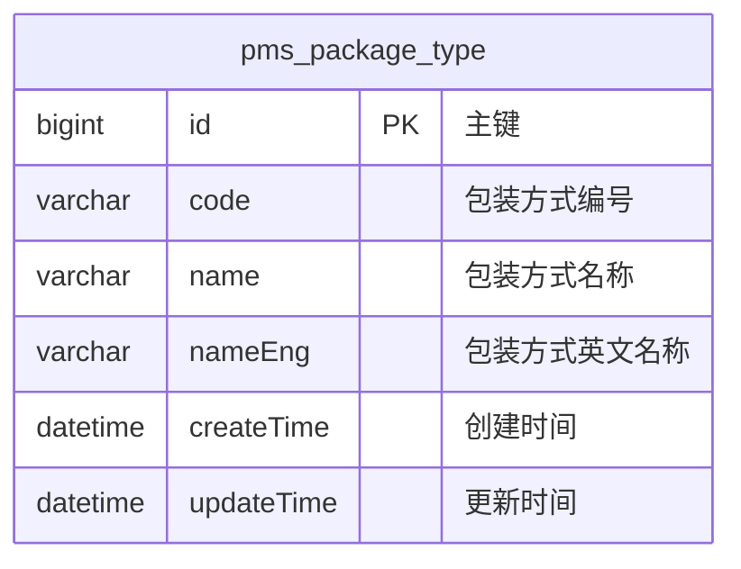

**图源**
- [PackageTypeDO.java](file://eplus-module-pms/eplus-module-pms-biz/src/main/java/com/syj/eplus/module/pms/dal/dataobject/packagetype/PackageTypeDO.java#L23-L43)

**包装方式属性说明：**
- **主键(id)**: 包装方式的唯一标识符，自动生成
- **编号(code)**: 包装方式的业务编号，用于系统内识别
- **名称(name)**: 包装方式的中文名称，必填项
- **英文名称(nameEng)**: 包装方式的英文名称，必填项
- **创建时间(createTime)**: 记录包装方式创建的时间戳
- **更新时间(updateTime)**: 记录包装方式最后修改的时间戳

**包装方式数据结构特点：**
1. 继承自BaseDO基类，包含通用的审计字段
2. 使用MyBatis Plus注解实现数据库映射
3. 支持Oracle、PostgreSQL等数据库的主键自增序列
4. 采用Lombok注解减少样板代码

**本节来源**
- [PackageTypeDO.java](file://eplus-module-pms/eplus-module-pms-biz/src/main/java/com/syj/eplus/module/pms/dal/dataobject/packagetype/PackageTypeDO.java#L1-L43)

## 核心组件
包装方式管理模块由多个核心组件构成，包括API接口、服务实现、数据对象和控制器等层次，形成了完整的MVC架构。

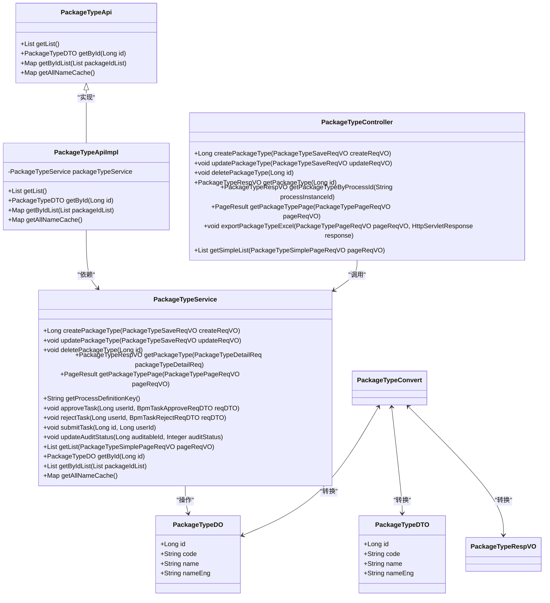

**图源**
- [PackageTypeApi.java](file://eplus-module-pms/eplus-module-pms-api/src/main/java/com/syj/eplus/module/pms/api/packageType/PackageTypeApi.java#L9-L22)
- [PackageTypeApiImpl.java](file://eplus-module-pms/eplus-module-pms-biz/src/main/java/com/syj/eplus/module/pms/api/PackageTypeApiImpl.java#L18-L51)
- [PackageTypeService.java](file://eplus-module-pms/eplus-module-pms-biz/src/main/java/com/syj/eplus/module/pms/service/packagetype/PackageTypeService.java#L18-L106)
- [PackageTypeDO.java](file://eplus-module-pms/eplus-module-pms-biz/src/main/java/com/syj/eplus/module/pms/dal/dataobject/packagetype/PackageTypeDO.java#L23-L43)
- [PackageTypeDTO.java](file://eplus-module-pms/eplus-module-pms-api/src/main/java/com/syj/eplus/module/pms/api/packageType/dto/PackageTypeDTO.java#L7-L21)

**本节来源**
- [PackageTypeApi.java](file://eplus-module-pms/eplus-module-pms-api/src/main/java/com/syj/eplus/module/pms/api/packageType/PackageTypeApi.java#L1-L23)
- [PackageTypeApiImpl.java](file://eplus-module-pms/eplus-module-pms-biz/src/main/java/com/syj/eplus/module/pms/api/PackageTypeApiImpl.java#L1-L51)
- [PackageTypeService.java](file://eplus-module-pms/eplus-module-pms-biz/src/main/java/com/syj/eplus/module/pms/service/packagetype/PackageTypeService.java#L1-L106)
- [PackageTypeDO.java](file://eplus-module-pms/eplus-module-pms-biz/src/main/java/com/syj/eplus/module/pms/dal/dataobject/packagetype/PackageTypeDO.java#L1-L43)
- [PackageTypeDTO.java](file://eplus-module-pms/eplus-module-pms-api/src/main/java/com/syj/eplus/module/pms/api/packageType/dto/PackageTypeDTO.java#L1-L21)

## API接口文档
包装方式管理提供了完整的RESTful API接口，支持增删改查等基本操作，以及分页查询、数据导出等高级功能。

### 查询接口
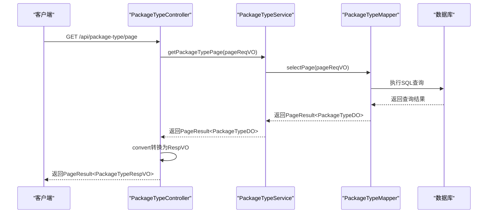

**图源**
- [PackageTypeController.java](file://eplus-module-pms/eplus-module-pms-biz/src/main/java/com/syj/eplus/module/pms/controller/admin/packagetype/PackageTypeController.java)
- [PackageTypeService.java](file://eplus-module-pms/eplus-module-pms-biz/src/main/java/com/syj/eplus/module/pms/service/packagetype/PackageTypeService.java#L56-L57)
- [PackageTypeMapper.java](file://eplus-module-pms/eplus-module-pms-biz/src/main/java/com/syj/eplus/module/pms/dal/mysql/packagetype/PackageTypeMapper.java)

### 创建接口
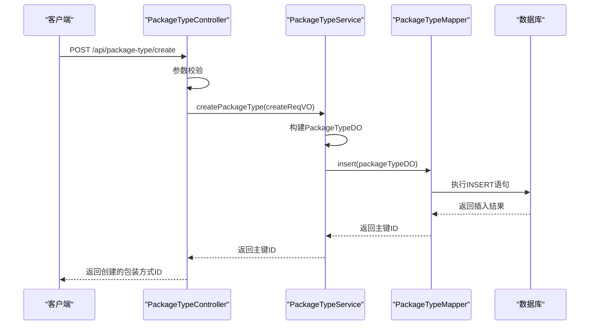

**图源**
- [PackageTypeController.java](file://eplus-module-pms/eplus-module-pms-biz/src/main/java/com/syj/eplus/module/pms/controller/admin/packagetype/PackageTypeController.java)
- [PackageTypeService.java](file://eplus-module-pms/eplus-module-pms-biz/src/main/java/com/syj/eplus/module/pms/service/packagetype/PackageTypeService.java#L26-L27)
- [PackageTypeMapper.java](file://eplus-module-pms/eplus-module-pms-biz/src/main/java/com/syj/eplus/module/pms/dal/mysql/packagetype/PackageTypeMapper.java)

### 更新接口
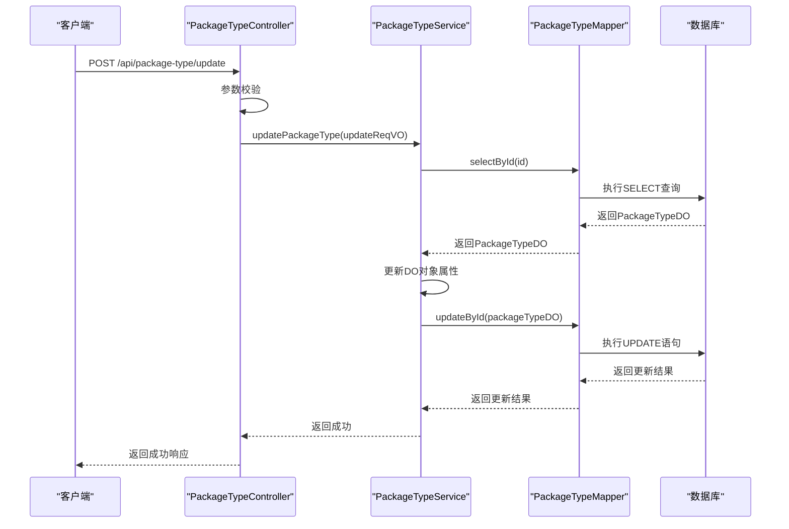

**图源**
- [PackageTypeController.java](file://eplus-module-pms/eplus-module-pms-biz/src/main/java/com/syj/eplus/module/pms/controller/admin/packagetype/PackageTypeController.java)
- [PackageTypeService.java](file://eplus-module-pms/eplus-module-pms-biz/src/main/java/com/syj/eplus/module/pms/service/packagetype/PackageTypeService.java#L33-L34)
- [PackageTypeMapper.java](file://eplus-module-pms/eplus-module-pms-biz/src/main/java/com/syj/eplus/module/pms/dal/mysql/packagetype/PackageTypeMapper.java)

### 删除接口
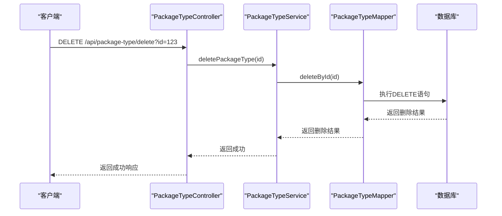

**图源**
- [PackageTypeController.java](file://eplus-module-pms/eplus-module-pms-biz/src/main/java/com/syj/eplus/module/pms/controller/admin/packagetype/PackageTypeController.java)
- [PackageTypeService.java](file://eplus-module-pms/eplus-module-pms-biz/src/main/java/com/syj/eplus/module/pms/service/packagetype/PackageTypeService.java#L40-L41)
- [PackageTypeMapper.java](file://eplus-module-pms/eplus-module-pms-biz/src/main/java/com/syj/eplus/module/pms/dal/mysql/packagetype/PackageTypeMapper.java)

### 详细接口说明
#### 基础查询接口
| 接口名称 | 方法 | 路径 | 参数 | 返回值 |
|--------|------|------|------|--------|
| 获取包装方式列表 | GET | /api/package-type/list | 无 | List<PackageTypeDTO> |
| 根据ID获取包装方式 | GET | /api/package-type/get | id: Long | PackageTypeDTO |
| 批量获取包装方式 | POST | /api/package-type/list-by-ids | List<Long> | Map<Long, PackageTypeDTO> |
| 获取所有包装名称缓存 | GET | /api/package-type/all-name-cache | 无 | Map<Long, String> |

#### 管理接口
| 接口名称 | 方法 | 路径 | 参数 | 返回值 |
|--------|------|------|------|--------|
| 创建包装方式 | POST | /api/package-type/create | PackageTypeSaveReqVO | Long (ID) |
| 更新包装方式 | POST | /api/package-type/update | PackageTypeSaveReqVO | void |
| 删除包装方式 | DELETE | /api/package-type/delete | id: Long | void |
| 分页查询包装方式 | GET | /api/package-type/page | PackageTypePageReqVO | PageResult<PackageTypeRespVO> |

#### 附加功能接口
| 接口名称 | 方法 | 路径 | 参数 | 返回值 |
|--------|------|------|------|--------|
| 导出包装方式Excel | GET | /api/package-type/export-excel | PackageTypePageReqVO | void |
| 获取简单列表 | GET | /api/package-type/simple-list | PackageTypeSimplePageReqVO | List<PackageTypeRespVO> |
| 根据流程实例ID获取包装方式 | GET | /api/package-type/get-by-process | processInstanceId: String | PackageTypeRespVO |

**本节来源**
- [PackageTypeApi.java](file://eplus-module-pms/eplus-module-pms-api/src/main/java/com/syj/eplus/module/pms/api/packageType/PackageTypeApi.java#L9-L22)
- [PackageTypeService.java](file://eplus-module-pms/eplus-module-pms-biz/src/main/java/com/syj/eplus/module/pms/service/packagetype/PackageTypeService.java#L18-L106)
- [PackageTypeController.java](file://eplus-module-pms/eplus-module-pms-biz/src/main/java/com/syj/eplus/module/pms/controller/admin/packagetype/PackageTypeController.java)

## 应用场景
包装方式在企业的多个业务场景中都有广泛应用，主要包括采购、物流、仓储等环节。

### 采购环节应用
在采购过程中，包装方式作为采购合同和采购计划的重要属性，影响着采购成本和物流安排。供应商报价、采购合同等单据中都需要明确包装方式信息。

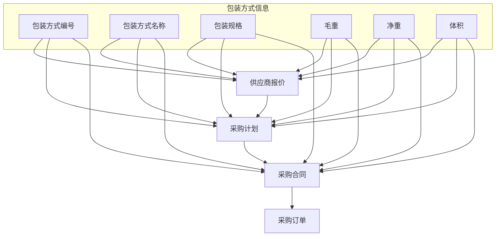

**图源**
- [V1_0_0_145__供应商报价修改package_type类型.java](file://eplus-flyway/src/main/java/db/migration/common/V1_0_0_145__供应商报价修改package_type类型.java#L19-L27)
- [V1_0_0_186__供应商报价修改package_type类型.java](file://eplus-flyway/src/main/java/db/migration/common/V1_0_0_186__供应商报价修改package_type类型.java#L19-L27)

### 物流环节应用
在物流管理中，包装方式直接影响出运计划的制定和执行。不同的包装方式对应不同的运输要求和成本计算。

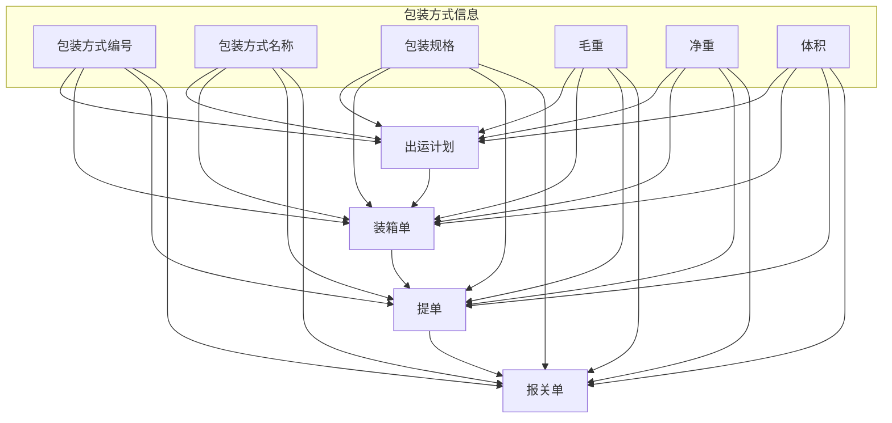

**图源**
- [V1_0_0_145__供应商报价修改package_type类型.java](file://eplus-flyway/src/main/java/db/migration/common/V1_0_0_145__供应商报价修改package_type类型.java#L23-L27)
- [V1_0_0_186__供应商报价修改package_type类型.java](file://eplus-flyway/src/main/java/db/migration/common/V1_0_0_186__供应商报价修改package_type类型.java#L23-L27)

### 仓储环节应用
在仓储管理中，包装方式影响着库存管理和仓库布局。不同的包装方式需要不同的存储条件和空间规划。

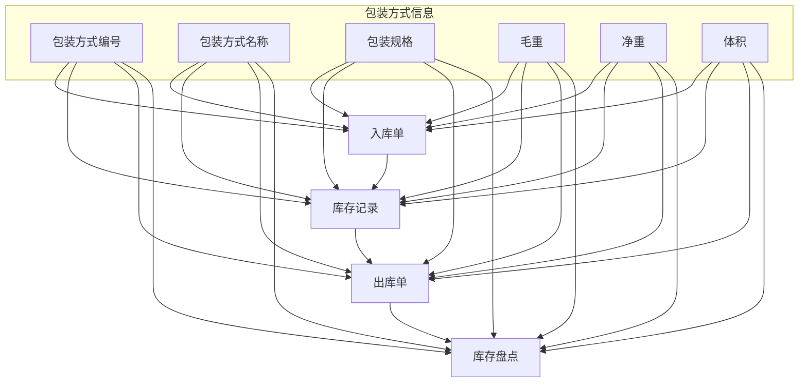

**图源**
- [V1_0_0_145__供应商报价修改package_type类型.java](file://eplus-flyway/src/main/java/db/migration/common/V1_0_0_145__供应商报价修改package_type类型.java#L24-L27)
- [V1_0_0_186__供应商报价修改package_type类型.java](file://eplus-flyway/src/main/java/db/migration/common/V1_0_0_186__供应商报价修改package_type类型.java#L24-L27)

**本节来源**
- [V1_0_0_145__供应商报价修改package_type类型.java](file://eplus-flyway/src/main/java/db/migration/common/V1_0_0_145__供应商报价修改package_type类型.java#L15-L27)
- [V1_0_0_186__供应商报价修改package_type类型.java](file://eplus-flyway/src/main/java/db/migration/common/V1_0_0_186__供应商报价修改package_type类型.java#L15-L27)
- [V1_0_0_323__包装方式字段类型修改外销合同增加送货地址佣金收否扣减总金额.java](file://eplus-flyway/src/main/java/db/migration/common/V1_0_0_323__包装方式字段类型修改外销合同增加送货地址佣金收否扣减总金额.java#L8-L15)

## 与SKU的关联关系
包装方式与SKU之间存在紧密的关联关系，这种关系在系统中通过多种方式体现。

### 数据模型关联
包装方式与SKU的关联主要体现在多个业务单据中，包括采购合同、销售合同、出运计划等。

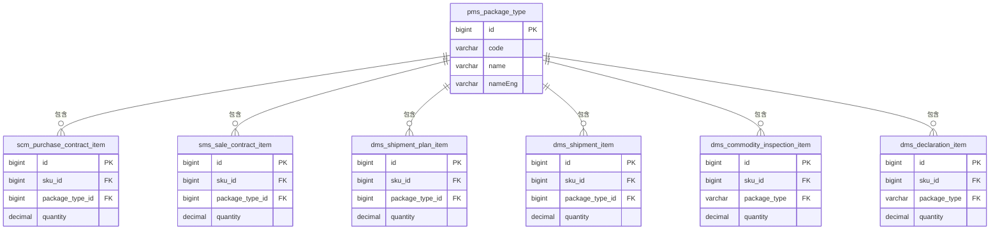

**图源**
- [V1_0_0_145__供应商报价修改package_type类型.java](file://eplus-flyway/src/main/java/db/migration/common/V1_0_0_145__供应商报价修改package_type类型.java#L21-L27)
- [V1_0_0_186__供应商报价修改package_type类型.java](file://eplus-flyway/src/main/java/db/migration/common/V1_0_0_186__供应商报价修改package_type类型.java#L21-L27)
- [V1_0_0_323__包装方式字段类型修改外销合同增加送货地址佣金收否扣减总金额.java](file://eplus-flyway/src/main/java/db/migration/common/V1_0_0_323__包装方式字段类型修改外销合同增加送货地址佣金收否扣减总金额.java#L12-L15)

### 业务逻辑关联
包装方式与SKU的关联不仅体现在数据模型上，还体现在业务处理流程中。

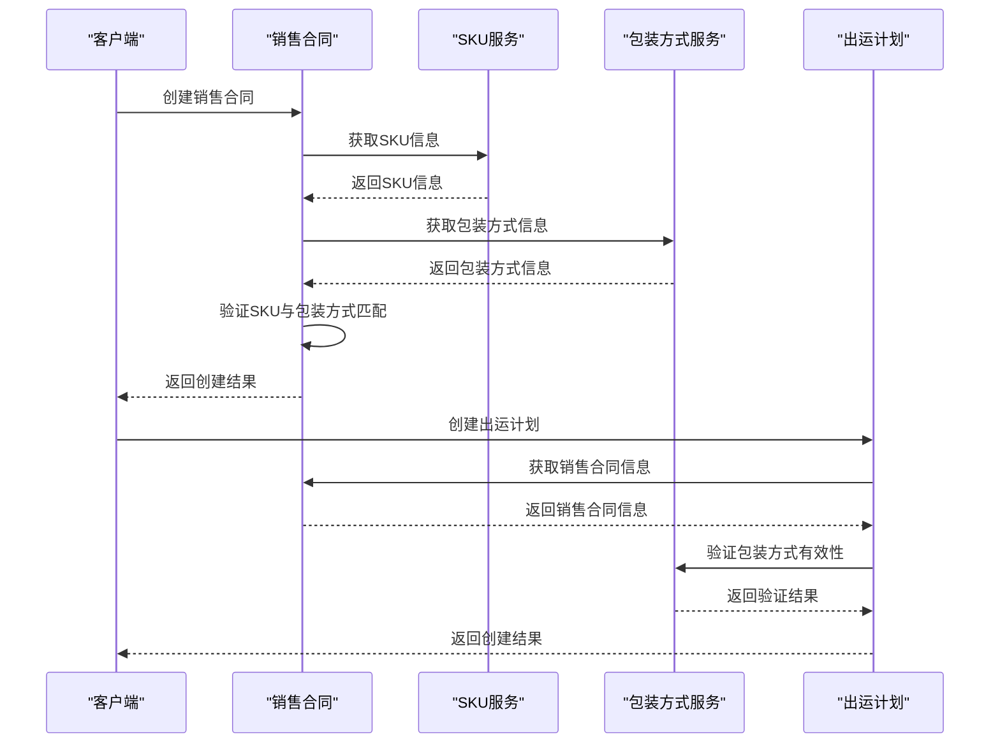

**图源**
- [PackageTypeApi.java](file://eplus-module-pms/eplus-module-pms-api/src/main/java/com/syj/eplus/module/pms/api/packageType/PackageTypeApi.java)
- [PackageTypeApiImpl.java](file://eplus-module-pms/eplus-module-pms-biz/src/main/java/com/syj/eplus/module/pms/api/PackageTypeApiImpl.java)
- [SaleContractServiceImpl.java](file://eplus-module-sms/eplus-module-sms-biz/src/main/java/com/syj/eplus/module/sms/service/salecontract/SaleContractServiceImpl.java)

**本节来源**
- [V1_0_0_145__供应商报价修改package_type类型.java](file://eplus-flyway/src/main/java/db/migration/common/V1_0_0_145__供应商报价修改package_type类型.java#L19-L27)
- [V1_0_0_186__供应商报价修改package_type类型.java](file://eplus-flyway/src/main/java/db/migration/common/V1_0_0_186__供应商报价修改package_type类型.java#L19-L27)
- [V1_0_0_323__包装方式字段类型修改外销合同增加送货地址佣金收否扣减总金额.java](file://eplus-flyway/src/main/java/db/migration/common/V1_0_0_323__包装方式字段类型修改外销合同增加送货地址佣金收否扣减总金额.java#L12-L15)
- [PackageTypeApi.java](file://eplus-module-pms/eplus-module-pms-api/src/main/java/com/syj/eplus/module/pms/api/packageType/PackageTypeApi.java#L1-L23)

## 数据导入导出功能
系统提供了包装方式数据的导入导出功能，方便批量管理和数据迁移。

### 数据导出功能
系统支持将包装方式数据导出为Excel文件，便于数据分析和存档。

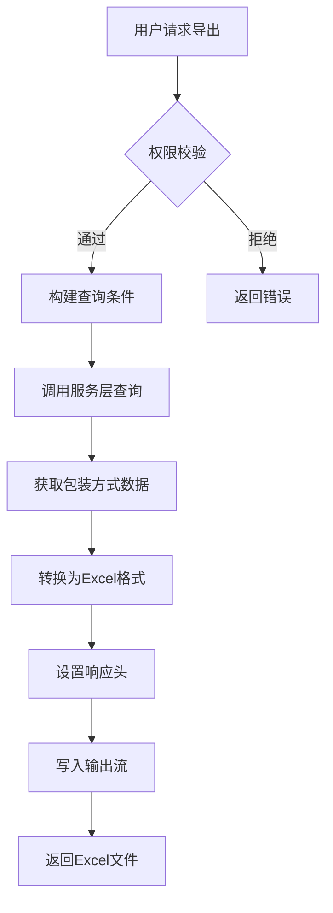

**图源**
- [PackageTypeController.java](file://eplus-module-pms/eplus-module-pms-biz/src/main/java/com/syj/eplus/module/pms/controller/admin/packagetype/PackageTypeController.java)
- [PackageTypeRespVO.java](file://eplus-module-pms/eplus-module-pms-biz/src/main/java/com/syj/eplus/module/pms/controller/admin/packagetype/vo/PackageTypeRespVO.java)

### 数据导入功能
虽然代码中未直接体现导入功能，但根据系统设计模式，可以推断存在类似的数据导入机制。

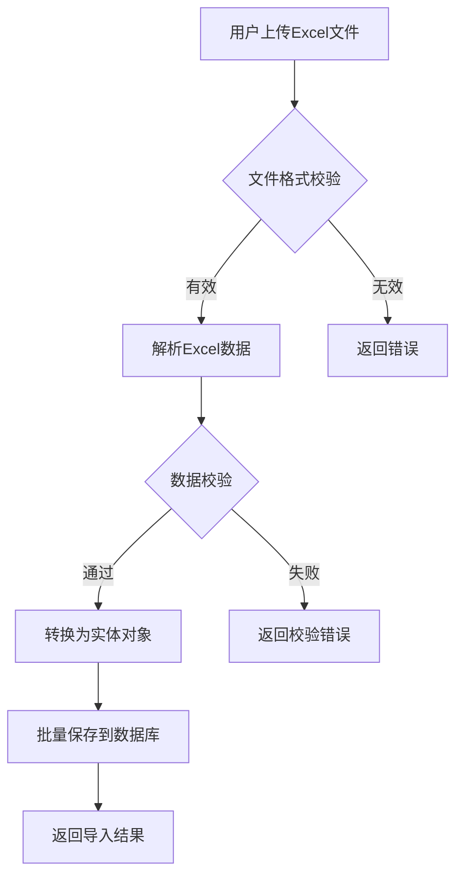

**本节来源**
- [PackageTypeController.java](file://eplus-module-pms/eplus-module-pms-biz/src/main/java/com/syj/eplus/module/pms/controller/admin/packagetype/PackageTypeController.java)
- [PackageTypeRespVO.java](file://eplus-module-pms/eplus-module-pms-biz/src/main/java/com/syj/eplus/module/pms/controller/admin/packagetype/vo/PackageTypeRespVO.java#L1-L34)

## 数据校验规则
包装方式管理实施了严格的数据校验规则，确保数据的完整性和一致性。

### 字段级校验规则
| 字段 | 校验规则 | 错误信息 |
|------|---------|---------|
| 名称(name) | 必填 | 包装方式名称不能为空 |
| 英文名称(nameEng) | 必填 | 包装方式英文名称不能为空 |
| 编号(code) | 唯一性校验 | 包装方式编号已存在 |

### 业务级校验规则
1. **唯一性校验**: 包装方式编号在系统中必须唯一
2. **状态校验**: 已删除的包装方式不能被引用
3. **引用校验**: 正在被使用的包装方式不能被删除
4. **权限校验**: 只有授权用户才能创建、修改或删除包装方式

### 校验实现方式
系统采用多层次的校验机制：

```mermaid
flowchart TD
A[前端校验] --> B[API参数校验]
B --> C[服务层业务校验]
C --> D[数据库约束校验]
subgraph 前端校验
E[必填字段检查]
F[格式检查]
G[实时验证]
end
subgraph API参数校验
H[@NotEmpty注解]
I[@NotNull注解]
J[JSR-303校验]
end
subgraph 服务层业务校验
K[唯一性检查]
L[状态检查]
M[引用检查]
end
subgraph 数据库约束校验
N[主键约束]
O[唯一索引]
P[外键约束]
end
E --> A
F --> A
G --> A
H --> B
I --> B
J --> B
K --> C
L --> C
M --> C
N --> D
O --> D
P --> D
```

**图源**
- [PackageTypeSaveReqVO.java](file://eplus-module-pms/eplus-module-pms-biz/src/main/java/com/syj/eplus/module/pms/controller/admin/packagetype/vo/PackageTypeSaveReqVO.java#L19-L24)
- [PackageTypeService.java](file://eplus-module-pms/eplus-module-pms-biz/src/main/java/com/syj/eplus/module/pms/service/packagetype/PackageTypeService.java)

**本节来源**
- [PackageTypeSaveReqVO.java](file://eplus-module-pms/eplus-module-pms-biz/src/main/java/com/syj/eplus/module/pms/controller/admin/packagetype/vo/PackageTypeSaveReqVO.java#L1-L28)
- [PackageTypeService.java](file://eplus-module-pms/eplus-module-pms-biz/src/main/java/com/syj/eplus/module/pms/service/packagetype/PackageTypeService.java#L1-L106)

## 结论
包装方式管理是企业供应链管理系统中的关键组成部分，通过统一的包装方式定义、维护和使用，实现了采购、物流、仓储等环节的标准化管理。系统采用分层架构设计，提供了完整的API接口，支持增删改查等基本操作以及数据导入导出功能。包装方式与SKU的关联关系贯穿于多个业务场景，在出运计划、报关单据等应用中发挥重要作用。严格的校验规则确保了数据的完整性和一致性。未来可以考虑扩展包装方式的属性，如增加毛重、净重、体积等物理特性，以满足更复杂的业务需求。