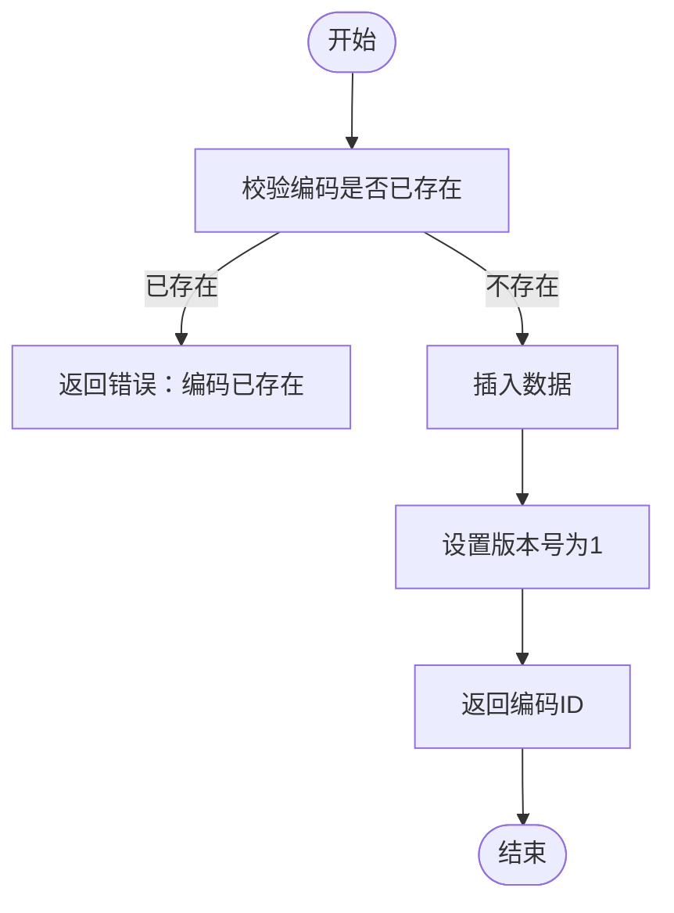

# 海关编码管理

<cite>
**本文档引用文件**   
- [HsdataController.java](file://eplus-module-pms/eplus-module-pms-biz/src/main/java/com/syj/eplus/module/pms/controller/admin/hsdata/HsdataController.java)
- [HsdataServiceImpl.java](file://eplus-module-pms/eplus-module-pms-biz/src/main/java/com/syj/eplus/module/pms/service/hsdata/HsdataServiceImpl.java)
- [HsdataMapper.java](file://eplus-module-pms/eplus-module-pms-biz/src/main/java/com/syj/eplus/module/pms/dal/mysql/hsdata/HsdataMapper.java)
- [HsdataDO.java](file://eplus-module-pms/eplus-module-pms-biz/src/main/java/com/syj/eplus/module/pms/dal/dataobject/hsdata/HsdataDO.java)
- [HsdataSaveReqVO.java](file://eplus-module-pms/eplus-module-pms-biz/src/main/java/com/syj/eplus/module/pms/controller/admin/hsdata/vo/HsdataSaveReqVO.java)
- [HsdataRespVO.java](file://eplus-module-pms/eplus-module-pms-biz/src/main/java/com/syj/eplus/module/pms/controller/admin/hsdata/vo/HsdataRespVO.java)
- [HsdataPageReqVO.java](file://eplus-module-pms/eplus-module-pms-biz/src/main/java/com/syj/eplus/module/pms/controller/admin/hsdata/vo/HsdataPageReqVO.java)
- [SpuSaveReqVO.java](file://eplus-module-pms/eplus-module-pms-biz/src/main/java/com/syj/eplus/module/pms/controller/admin/spu/vo/SpuSaveReqVO.java)
- [V1_0_0_002__Eplus初始化.sql](file://eplus-flyway/src/main/resources/db/migration/common/V1_0_0_002__Eplus初始化.sql)
- [V1_0_0_286__hscode全局替换.java](file://eplus-flyway/src/main/java/db/migration/common/V1_0_0_286__hscode全局替换.java)
</cite>

## 目录
1. [引言](#引言)
2. [海关编码数据结构](#海关编码数据结构)
3. [海关编码维护](#海关编码维护)
4. [海关编码查询](#海关编码查询)
5. [海关编码与SKU关联](#海关编码与sku关联)
6. [海关编码API接口](#海关编码api接口)
7. [海关编码在业务流程中的应用](#海关编码在业务流程中的应用)
8. [海关编码数据更新机制](#海关编码数据更新机制)
9. [常见问题与解决方案](#常见问题与解决方案)
10. [附录](#附录)

## 引言
海关编码（HS Code）是国际贸易中用于商品分类和统计的重要标准，对于企业的进出口报关、退税等业务具有关键作用。本文档详细介绍了海关编码的管理机制，包括编码的维护、查询、使用以及与SKU的关联关系。系统通过统一的海关编码管理模块，确保编码数据的准确性和一致性，支持企业在报关、退税等业务流程中的合规操作。

## 海关编码数据结构
海关编码数据结构定义了编码的各个属性，包括编码本身、名称、税率、监管条件等信息。这些信息存储在数据库的`pms_hsdata`表中，具体字段如下：

```mermaid
erDiagram
pms_hsdata {
bigint id PK
varchar(100) code UK
int ver
varchar(100) name
varchar(100) unit
decimal(19,6) taxRefundRate
decimal(19,6) rate
text remark
varchar(100) chname
decimal(19,6) addrate
varchar(100) code2
datetime create_time
datetime update_time
tinyint deleted
}
```

**图源**
- [V1_0_0_002__Eplus初始化.sql](file://eplus-flyway/src/main/resources/db/migration/common/V1_0_0_002__Eplus初始化.sql#L1250-L1264)
- [HsdataDO.java](file://eplus-module-pms/eplus-module-pms-biz/src/main/java/com/syj/eplus/module/pms/dal/dataobject/hsdata/HsdataDO.java#L1-L73)

**海关编码主要字段说明：**
| 字段 | 描述 |
|------|------|
| `id` | 编号，主键 |
| `code` | 海关编码，唯一索引 |
| `ver` | 版本号 |
| `name` | 商品名称 |
| `unit` | 报关单位 |
| `taxRefundRate` | 退税率 |
| `rate` | 征税率 |
| `remark` | 备注 |
| `chname` | 商品全称 |
| `addrate` | 征收率 |
| `code2` | 第二单位 |

**章节来源**
- [HsdataDO.java](file://eplus-module-pms/eplus-module-pms-biz/src/main/java/com/syj/eplus/module/pms/dal/dataobject/hsdata/HsdataDO.java#L1-L73)
- [V1_0_0_002__Eplus初始化.sql](file://eplus-flyway/src/main/resources/db/migration/common/V1_0_0_002__Eplus初始化.sql#L1250-L1264)

## 海关编码维护
海关编码的维护包括创建、更新和删除操作，通过管理后台的接口实现。系统提供了完整的CRUD功能，确保编码数据的准确性和完整性。

### 创建海关编码
创建海关编码时，系统会校验编码是否已存在，避免重复。编码创建后，版本号默认为1。



**图源**
- [HsdataServiceImpl.java](file://eplus-module-pms/eplus-module-pms-biz/src/main/java/com/syj/eplus/module/pms/service/hsdata/HsdataServiceImpl.java#L41-L49)

### 更新海关编码
更新海关编码时，系统会自动递增版本号，确保每次修改都有版本记录。这有助于追踪编码的历史变更。


**图源**
- [HsdataServiceImpl.java](file://eplus-module-pms/eplus-module-pms-biz/src/main/java/com/syj/eplus/module/pms/service/hsdata/HsdataServiceImpl.java#L54-L63)

### 删除海关编码
删除海关编码前，系统会校验编码是否存在，确保操作的安全性。


**图源**
- [HsdataServiceImpl.java](file://eplus-module-pms/eplus-module-pms-biz/src/main/java/com/syj/eplus/module/pms/service/hsdata/HsdataServiceImpl.java#L65-L71)

**章节来源**
- [HsdataServiceImpl.java](file://eplus-module-pms/eplus-module-pms-biz/src/main/java/com/syj/eplus/module/pms/service/hsdata/HsdataServiceImpl.java#L41-L71)
- [HsdataController.java](file://eplus-module-pms/eplus-module-pms-biz/src/main/java/com/syj/eplus/module/pms/controller/admin/hsdata/HsdataController.java#L41-L63)

## 海关编码查询
系统提供了多种查询方式，支持按编码、名称、单位等条件进行分页查询，以及导出Excel功能。

### 分页查询
通过`HsdataPageReqVO`对象传递查询条件，支持模糊匹配和精确匹配。


**图源**
- [HsdataController.java](file://eplus-module-pms/eplus-module-pms-biz/src/main/java/com/syj/eplus/module/pms/controller/admin/hsdata/HsdataController.java#L90-L96)
- [HsdataServiceImpl.java](file://eplus-module-pms/eplus-module-pms-biz/src/main/java/com/syj/eplus/module/pms/service/hsdata/HsdataServiceImpl.java#L95-L97)
- [HsdataMapper.java](file://eplus-module-pms/eplus-module-pms-biz/src/main/java/com/syj/eplus/module/pms/dal/mysql/hsdata/HsdataMapper.java#L21-L33)

### 导出Excel
支持将查询结果导出为Excel文件，便于线下查看和分析。


**图源**
- [HsdataController.java](file://eplus-module-pms/eplus-module-pms-biz/src/main/java/com/syj/eplus/module/pms/controller/admin/hsdata/HsdataController.java#L98-L109)

**章节来源**
- [HsdataController.java](file://eplus-module-pms/eplus-module-pms-biz/src/main/java/com/syj/eplus/module/pms/controller/admin/hsdata/HsdataController.java#L90-L109)
- [HsdataPageReqVO.java](file://eplus-module-pms/eplus-module-pms-biz/src/main/java/com/syj/eplus/module/pms/controller/admin/hsdata/vo/HsdataPageReqVO.java#L1-L52)

## 海关编码与SKU关联
海关编码与SKU（库存单位）存在直接关联，每个SKU可以关联一个海关编码，用于报关和退税等业务。

### 关联关系
在SPU（标准产品单位）中，通过`hsCodeId`字段关联海关编码，同时记录海关编码版本`hsCode_var`。

```mermaid
erDiagram
pms_spu {
bigint id PK
varchar(100) name
bigint hs_code_id FK
int hs_code_var
}
pms_hsdata {
bigint id PK
varchar(100) code
varchar(100) name
decimal(19,6) taxRefundRate
}
pms_spu ||--o{ pms_hsdata : "关联"
```

**图源**
- [SpuSaveReqVO.java](file://eplus-module-pms/eplus-module-pms-biz/src/main/java/com/syj/eplus/module/pms/controller/admin/spu/vo/SpuSaveReqVO.java#L52-L65)
- [V1_0_0_286__hscode全局替换.java](file://eplus-flyway/src/main/java/db/migration/common/V1_0_0_286__hscode全局替换.java#L1-L21)

### 变更影响
当海关编码变更时，相关SKU的报关信息和退税计算会受到影响。系统通过版本号机制，确保变更可追溯。

**章节来源**
- [SpuSaveReqVO.java](file://eplus-module-pms/eplus-module-pms-biz/src/main/java/com/syj/eplus/module/pms/controller/admin/spu/vo/SpuSaveReqVO.java#L52-L65)
- [V1_0_0_286__hscode全局替换.java](file://eplus-flyway/src/main/java/db/migration/common/V1_0_0_286__hscode全局替换.java#L1-L21)

## 海关编码API接口
系统提供了完整的RESTful API接口，支持海关编码的增删改查操作。

### 接口列表
| HTTP方法 | 路径 | 描述 | 权限要求 |
|---------|------|------|---------|
| POST | /pms/hsdata/create | 创建海关编码 | pms:hsdata:create |
| PUT | /pms/hsdata/update | 更新海关编码 | pms:hsdata:update |
| DELETE | /pms/hsdata/delete | 删除海关编码 | pms:hsdata:delete |
| GET | /pms/hsdata/get | 获取海关编码 | pms:hsdata:query |
| GET | /pms/hsdata/page | 分页查询海关编码 | pms:hsdata:query |
| GET | /pms/hsdata/export-excel | 导出Excel | pms:hsdata:export |
| GET | /pms/hsdata/get-hsdata-by-code | 通过编码获取信息 | pms:hsdata:query,pms:sku:query |

**章节来源**
- [HsdataController.java](file://eplus-module-pms/eplus-module-pms-biz/src/main/java/com/syj/eplus/module/pms/controller/admin/hsdata/HsdataController.java#L41-L119)

## 海关编码在业务流程中的应用
海关编码在报关、退税等业务流程中起着关键作用。

### 报关流程
在报关时，系统根据SKU关联的海关编码，自动填充报关信息，包括商品名称、单位、税率等。

### 退税流程
退税计算基于海关编码的退税率，系统自动计算应退税额，并生成退税申请。

**章节来源**
- [HsdataDO.java](file://eplus-module-pms/eplus-module-pms-biz/src/main/java/com/syj/eplus/module/pms/dal/dataobject/hsdata/HsdataDO.java#L1-L73)
- [SpuSaveReqVO.java](file://eplus-module-pms/eplus-module-pms-biz/src/main/java/com/syj/eplus/module/pms/controller/admin/spu/vo/SpuSaveReqVO.java#L52-L65)

## 海关编码数据更新机制
海关编码数据来源于外部数据源，通过数据迁移脚本定期更新。系统通过Flyway进行数据库版本管理，确保数据一致性。

**章节来源**
- [V1_0_0_002__Eplus初始化.sql](file://eplus-flyway/src/main/resources/db/migration/common/V1_0_0_002__Eplus初始化.sql#L1250-L1264)
- [V1_0_0_286__hscode全局替换.java](file://eplus-flyway/src/main/java/db/migration/common/V1_0_0_286__hscode全局替换.java#L1-L21)

## 常见问题与解决方案
### 问题1：海关编码重复
**现象**：创建编码时提示已存在。
**解决方案**：先查询确认编码是否已存在，避免重复创建。

### 问题2：关联SKU后无法删除编码
**现象**：删除编码时提示被引用。
**解决方案**：先解除与SKU的关联，再删除编码。

### 问题3：退税计算错误
**现象**：退税金额与预期不符。
**解决方案**：检查海关编码的退税率是否正确，确认SKU关联的编码版本。

**章节来源**
- [HsdataServiceImpl.java](file://eplus-module-pms/eplus-module-pms-biz/src/main/java/com/syj/eplus/module/pms/service/hsdata/HsdataServiceImpl.java#L73-L87)
- [HsdataDO.java](file://eplus-module-pms/eplus-module-pms-biz/src/main/java/com/syj/eplus/module/pms/dal/dataobject/hsdata/HsdataDO.java#L1-L73)

## 附录
### 错误码说明
| 错误码 | 描述 |
|-------|------|
| HSDATA_EXISTS | 海关编码已存在 |
| HSDATA_NOT_EXISTS | 海关编码不存在 |

**章节来源**
- [HsdataServiceImpl.java](file://eplus-module-pms/eplus-module-pms-biz/src/main/java/com/syj/eplus/module/pms/service/hsdata/HsdataServiceImpl.java#L26-L27)