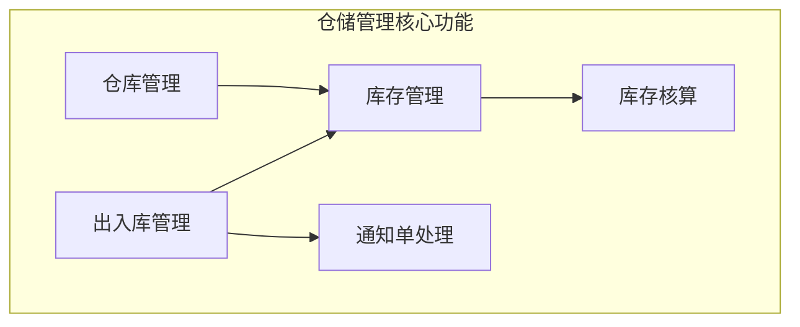
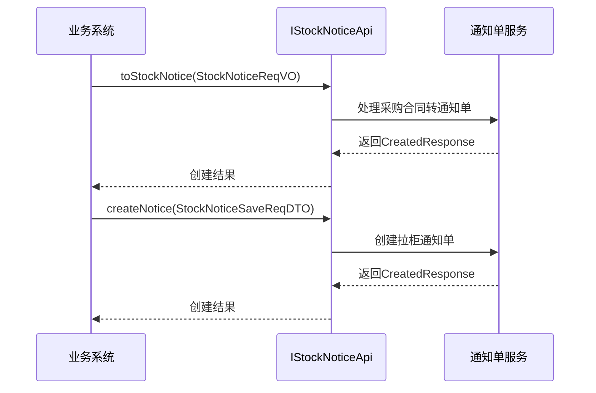
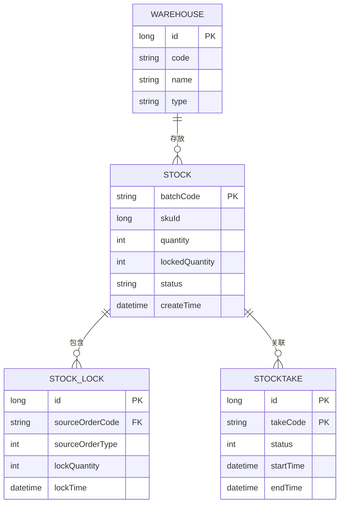
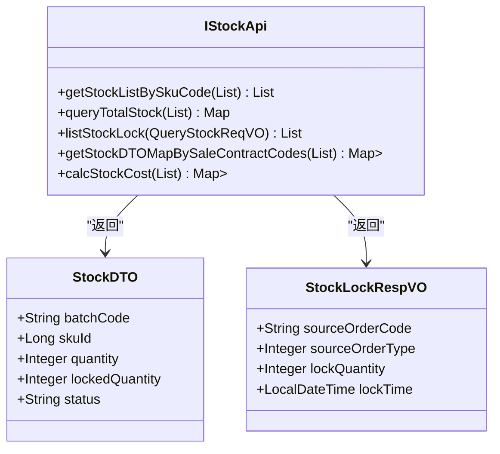
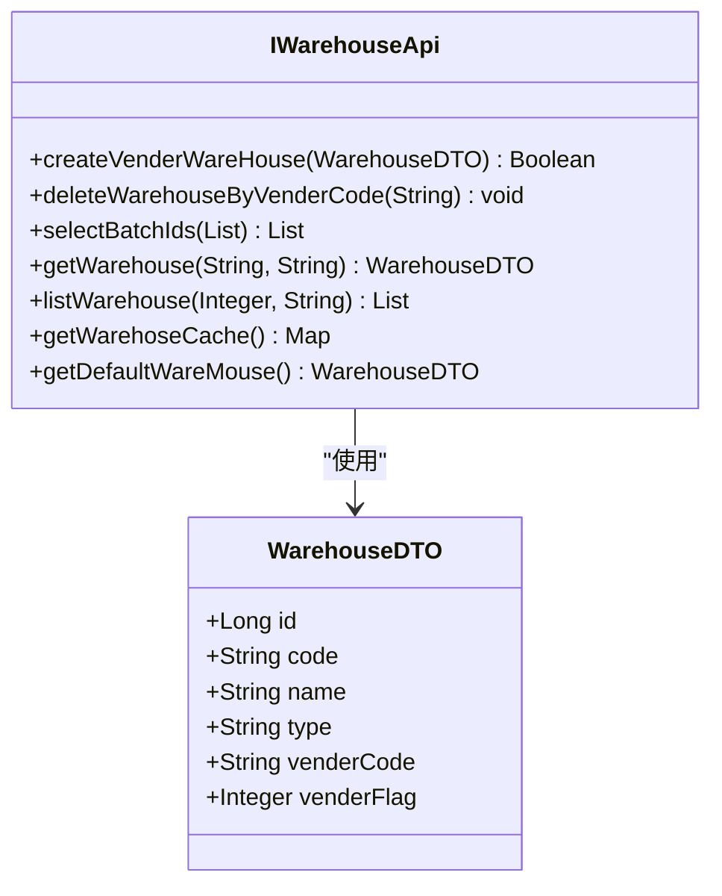
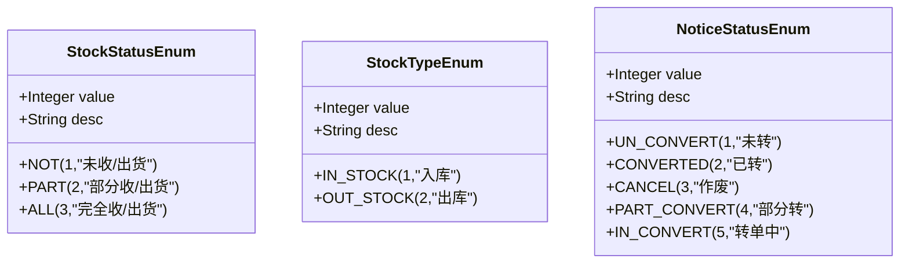
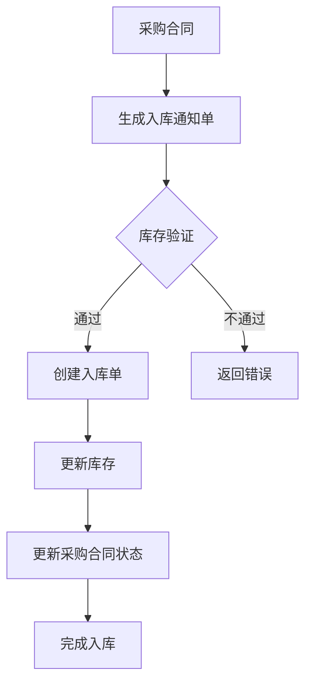
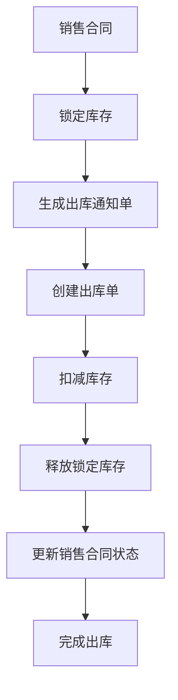
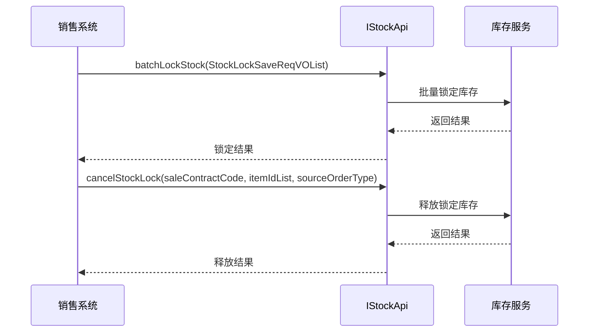
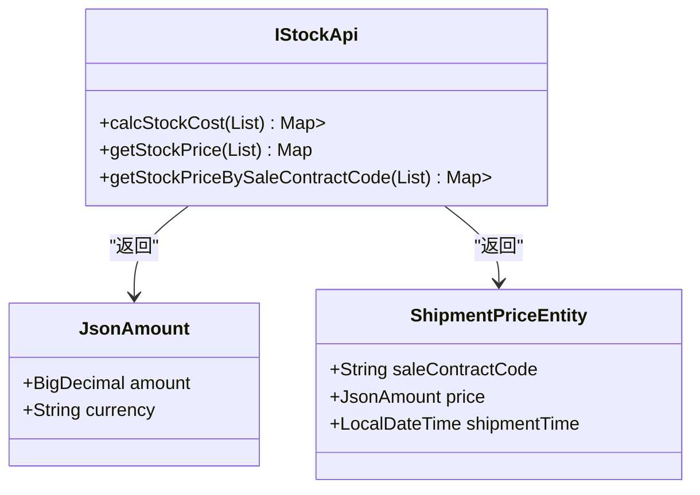

# 仓储管理

<cite>
**本文档引用文件**  
- [StockTypeEnum.java](file://eplus-module-wms/eplus-module-wms-api/src/main/java/com/syj/eplus/module/wms/enums/StockTypeEnum.java)
- [StockStatusEnum.java](file://eplus-module-wms/eplus-module-wms-api/src/main/java/com/syj/eplus/module/wms/enums/StockStatusEnum.java)
- [NoticeStatusEnum.java](file://eplus-module-wms/eplus-module-wms-api/src/main/java/com/syj/eplus/module/wms/enums/NoticeStatusEnum.java)
- [StockLockSourceTypeEnum.java](file://eplus-module-wms/eplus-module-wms-api/src/main/java/com/syj/eplus/module/wms/enums/StockLockSourceTypeEnum.java)
- [StockSourceTypeEnum.java](file://eplus-module-wms/eplus-module-wms-api/src/main/java/com/syj/eplus/module/wms/enums/StockSourceTypeEnum.java)
- [StocktakeStatusEnum.java](file://eplus-module-wms/eplus-module-wms-api/src/main/java/com/syj/eplus/module/wms/enums/StocktakeStatusEnum.java)
- [IStockApi.java](file://eplus-module-wms/eplus-module-wms-api/src/main/java/com/syj/eplus/module/wms/api/stock/IStockApi.java)
- [IStockNoticeApi.java](file://eplus-module-wms/eplus-module-wms-api/src/main/java/com/syj/eplus/module/wms/api/stockNotice/IStockNoticeApi.java)
- [IWarehouseApi.java](file://eplus-module-wms/eplus-module-wms-api/src/main/java/com/syj/eplus/module/wms/api/warehouse/IWarehouseApi.java)
</cite>

## 目录
1. [简介](#简介)
2. [核心功能概述](#核心功能概述)
3. [出入库通知单管理](#出入库通知单管理)
4. [库存管理核心概念](#库存管理核心概念)
5. [仓库层级结构](#仓库层级结构)
6. [库存状态管理](#库存状态管理)
7. [库存业务流程](#库存业务流程)
8. [库存核算与预警](#库存核算与预警)

## 简介
本系统为仓储管理模块，提供完整的入库、出库、库存管理功能。系统支持采购入库、销售出库、调拨等多种业务场景，实现了从通知单创建到库存变动的全流程管理。通过精细化的库存状态控制和锁定机制，确保库存数据的准确性和业务流程的完整性。

## 核心功能概述
仓储管理模块主要包含三大核心功能：出入库管理、库存明细管理、仓库结构管理。系统通过API接口为其他模块提供服务，支持采购、销售、加工、调拨等多场景的库存操作。

**图示来源**  
- [IStockApi.java](file://eplus-module-wms/eplus-module-wms-api/src/main/java/com/syj/eplus/module/wms/api/stock/IStockApi.java)
- [IStockNoticeApi.java](file://eplus-module-wms/eplus-module-wms-api/src/main/java/com/syj/eplus/module/wms/api/stockNotice/IStockNoticeApi.java)
- [IWarehouseApi.java](file://eplus-module-wms/eplus-module-wms-api/src/main/java/com/syj/eplus/module/wms/api/warehouse/IWarehouseApi.java)

## 出入库通知单管理

### 通知单创建流程
出入库通知单是库存操作的起点，系统支持从采购合同、销售合同等原单据生成通知单。通知单创建后进入处理流程，最终完成库存变动。

**图示来源**  
- [IStockNoticeApi.java](file://eplus-module-wms/eplus-module-wms-api/src/main/java/com/syj/eplus/module/wms/api/stockNotice/IStockNoticeApi.java#L17-L34)

### 业务场景支持
系统支持多种业务场景的出入库操作：

1. **采购入库**：通过采购合同生成入库通知单
2. **销售出库**：通过销售合同生成出库通知单
3. **调拨操作**：支持不同仓库间的库存调拨
4. **加工单**：支持子产品出库、主产品入库的加工场景
5. **盘点操作**：支持盘盈、盘亏的库存调整

**节来源**  
- [StockSourceTypeEnum.java](file://eplus-module-wms/eplus-module-wms-api/src/main/java/com/syj/eplus/module/wms/enums/StockSourceTypeEnum.java#L13-L19)

## 库存管理核心概念

### 库存数据模型
系统定义了完整的库存数据模型，包括库存明细、库存锁定、库存盘点等核心概念。

**图示来源**  
- [IStockApi.java](file://eplus-module-wms/eplus-module-wms-api/src/main/java/com/syj/eplus/module/wms/api/stock/IStockApi.java)
- [StockLockSourceTypeEnum.java](file://eplus-module-wms/eplus-module-wms-api/src/main/java/com/syj/eplus/module/wms/enums/StockLockSourceTypeEnum.java)

### 库存查询接口
系统提供多种库存查询接口，满足不同业务需求：

**图示来源**  
- [IStockApi.java](file://eplus-module-wms/eplus-module-wms-api/src/main/java/com/syj/eplus/module/wms/api/stock/IStockApi.java)
- [StockDTO.java](file://eplus-module-wms/eplus-module-wms-api/src/main/java/com/syj/eplus/module/wms/api/stock/dto/StockDTO.java)

## 仓库层级结构
系统采用三级仓库管理结构：仓库 → 库区 → 库位，实现精细化的库存位置管理。

### 仓库管理API

**图示来源**  
- [IWarehouseApi.java](file://eplus-module-wms/eplus-module-wms-api/src/main/java/com/syj/eplus/module/wms/api/warehouse/IWarehouseApi.java)
- [WarehouseDTO.java](file://eplus-module-wms/eplus-module-wms-api/src/main/java/com/syj/eplus/module/wms/api/warehouse/dto/WarehouseDTO.java)

### 仓库类型
系统支持多种仓库类型，包括：
- **供应商仓库**：供应商的虚拟仓库
- **默认仓库**：系统默认仓库
- **特殊用途仓库**：用于特定业务场景的仓库

**节来源**  
- [IWarehouseApi.java](file://eplus-module-wms/eplus-module-wms-api/src/main/java/com/syj/eplus/module/wms/api/warehouse/IWarehouseApi.java#L19-L58)

## 库存状态管理

### 库存状态类型
系统定义了多种库存状态，用于精确控制库存的可用性。

**图示来源**  
- [StockStatusEnum.java](file://eplus-module-wms/eplus-module-wms-api/src/main/java/com/syj/eplus/module/wms/enums/StockStatusEnum.java)
- [StockTypeEnum.java](file://eplus-module-wms/eplus-module-wms-api/src/main/java/com/syj/eplus/module/wms/enums/StockTypeEnum.java)
- [NoticeStatusEnum.java](file://eplus-module-wms/eplus-module-wms-api/src/main/java/com/syj/eplus/module/wms/enums/NoticeStatusEnum.java)

### 状态转换规则
库存状态遵循严格的转换规则：
- **未收/出货** → **部分收/出货** → **完全收/出货**
- **未转** → **转单中** → **已转**/**部分转**
- 作废状态为终态，不可逆

**节来源**  
- [StockStatusEnum.java](file://eplus-module-wms/eplus-module-wms-api/src/main/java/com/syj/eplus/module/wms/enums/StockStatusEnum.java#L14-L18)
- [NoticeStatusEnum.java](file://eplus-module-wms/eplus-module-wms-api/src/main/java/com/syj/eplus/module/wms/enums/NoticeStatusEnum.java#L13-L21)

## 库存业务流程

### 采购入库流程

**图示来源**  
- [IStockApi.java](file://eplus-module-wms/eplus-module-wms-api/src/main/java/com/syj/eplus/module/wms/api/stock/IStockApi.java#L23-L30)
- [IStockNoticeApi.java](file://eplus-module-wms/eplus-module-wms-api/src/main/java/com/syj/eplus/module/wms/api/stockNotice/IStockNoticeApi.java#L21-L27)

### 销售出库流程

**图示来源**  
- [IStockApi.java](file://eplus-module-wms/eplus-module-wms-api/src/main/java/com/syj/eplus/module/wms/api/stock/IStockApi.java#L38-L47)
- [IStockNoticeApi.java](file://eplus-module-wms/eplus-module-wms-api/src/main/java/com/syj/eplus/module/wms/api/stockNotice/IStockNoticeApi.java#L55-L57)

### 库存锁定机制

**图示来源**  
- [IStockApi.java](file://eplus-module-wms/eplus-module-wms-api/src/main/java/com/syj/eplus/module/wms/api/stock/IStockApi.java#L38-L47)
- [StockLockSourceTypeEnum.java](file://eplus-module-wms/eplus-module-wms-api/src/main/java/com/syj/eplus/module/wms/enums/StockLockSourceTypeEnum.java#L14-L18)

## 库存核算与预警

### 库存核算方法
系统提供库存成本核算功能，支持按销售合同计算库存成本。

**图示来源**  
- [IStockApi.java](file://eplus-module-wms/eplus-module-wms-api/src/main/java/com/syj/eplus/module/wms/api/stock/IStockApi.java#L200-L222)
- [JsonAmount.java](file://eplus-framework/eplus-common/src/main/java/com/syj/eplus/framework/common/entity/JsonAmount.java)

### 库存预警机制
系统通过以下方式实现库存预警：
1. **库存不足预警**：当可用库存低于安全库存时触发
2. **库存积压预警**：当库存超过最大库存时触发
3. **批次过期预警**：临近批次有效期时触发
4. **锁定库存预警**：长期未使用的锁定库存预警

**节来源**  
- [IStockApi.java](file://eplus-module-wms/eplus-module-wms-api/src/main/java/com/syj/eplus/module/wms/api/stock/IStockApi.java)
- [StockDTO.java](file://eplus-module-wms/eplus-module-wms-api/src/main/java/com/syj/eplus/module/wms/api/stock/dto/StockDTO.java)