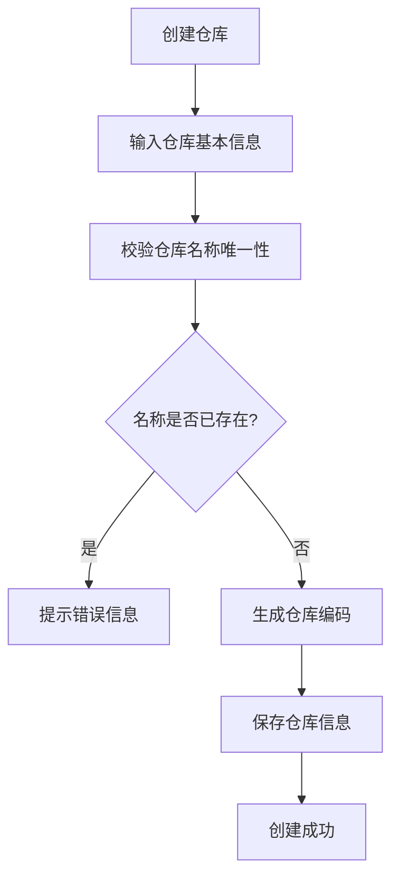
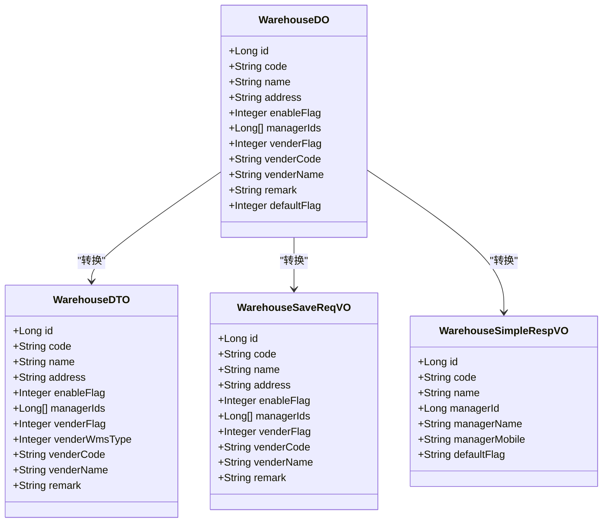
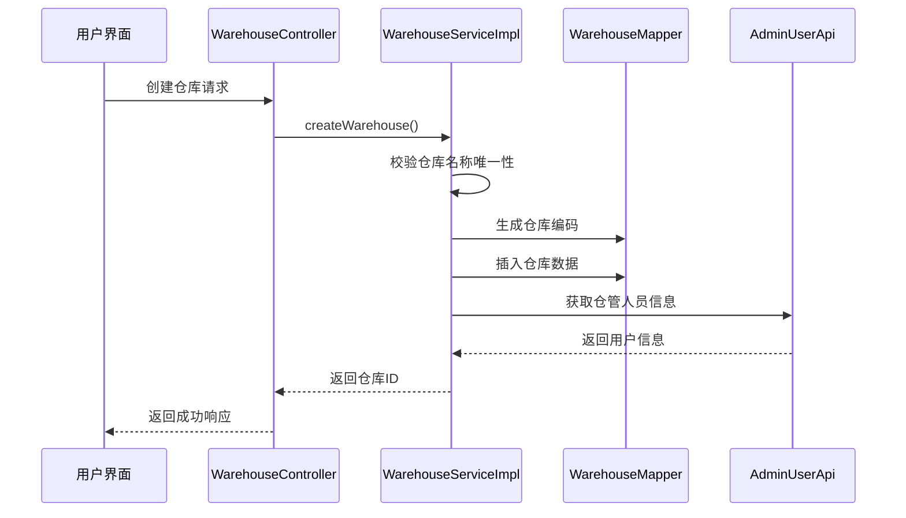

# 仓库结构管理

<cite>
**本文档引用文件**  
- [WarehouseDO.java](file://eplus-module-wms/eplus-module-wms-biz/src/main/java/com/syj/eplus/module/wms/dal/dataobject/warehouse/WarehouseDO.java)
- [WarehouseDTO.java](file://eplus-module-wms/eplus-module-wms-api/src/main/java/com/syj/eplus/module/wms/api/warehouse/dto/WarehouseDTO.java)
- [WarehouseSaveReqVO.java](file://eplus-module-wms/eplus-module-wms-biz/src/main/java/com/syj/eplus/module/wms/controller/admin/warehouse/vo/WarehouseSaveReqVO.java)
- [WarehouseSimpleRespVO.java](file://eplus-module-wms/eplus-module-wms-biz/src/main/java/com/syj/eplus/module/wms/controller/admin/warehouse/vo/WarehouseSimpleRespVO.java)
- [WarehouseServiceImpl.java](file://eplus-module-wms/eplus-module-wms-biz/src/main/java/com/syj/eplus/module/wms/service/warehouse/WarehouseServiceImpl.java)
- [WarehouseController.java](file://eplus-module-wms/eplus-module-wms-biz/src/main/java/com/syj/eplus/module/wms/controller/admin/warehouse/WarehouseController.java)
</cite>

## 目录
1. [引言](#引言)
2. [仓库主数据管理](#仓库主数据管理)
3. [仓库属性设置](#仓库属性设置)
4. [仓库与组织架构关联](#仓库与组织架构关联)
5. [仓库结构配置最佳实践](#仓库结构配置最佳实践)
6. [仓库管理功能流程](#仓库管理功能流程)

## 引言
本文档详细介绍了仓库结构管理功能，重点阐述了仓库、库区、库位的层级结构和管理方式。文档涵盖了仓库主数据的创建和维护流程，包括仓库编码、名称、地址等基本信息，以及仓库属性设置如启用状态、仓库类型、所属公司等。同时提供了仓库结构配置的最佳实践建议，帮助提高仓储效率。

## 仓库主数据管理

仓库主数据管理是仓储管理系统的核心功能，负责维护仓库的基本信息和配置。系统通过统一的数据模型管理所有仓库信息，确保数据的一致性和完整性。

**仓库基本信息**
- **仓库编码**：系统自动生成的唯一标识符，以"WH"为前缀，确保每个仓库都有唯一的编码
- **仓库名称**：仓库的名称，必须保证唯一性，避免重复创建
- **仓库地址**：仓库的具体地理位置信息
- **备注**：用于记录仓库的额外信息或特殊说明

**仓库创建流程**
1. 用户提交仓库创建请求，包含仓库名称、地址等基本信息
2. 系统校验仓库名称的唯一性，防止重复创建
3. 系统调用编码生成服务，自动生成仓库编码
4. 将仓库信息持久化到数据库

**仓库维护流程**
- 支持对现有仓库信息的修改和更新
- 提供启用/停用功能，控制仓库的可用状态
- 支持设置默认仓库，便于系统操作

**仓库主数据管理**

**仓库主数据管理**是仓储管理系统的核心功能，负责维护仓库的基本信息和配置。系统通过统一的数据模型管理所有仓库信息，确保数据的一致性和完整性。

**仓库基本信息**
- **仓库编码**：系统自动生成的唯一标识符，以"WH"为前缀，确保每个仓库都有唯一的编码
- **仓库名称**：仓库的名称，必须保证唯一性，避免重复创建
- **仓库地址**：仓库的具体地理位置信息
- **备注**：用于记录仓库的额外信息或特殊说明

**仓库创建流程**
1. 用户提交仓库创建请求，包含仓库名称、地址等基本信息
2. 系统校验仓库名称的唯一性，防止重复创建
3. 系统调用编码生成服务，自动生成仓库编码
4. 将仓库信息持久化到数据库

**仓库维护流程**
- 支持对现有仓库信息的修改和更新
- 提供启用/停用功能，控制仓库的可用状态
- 支持设置默认仓库，便于系统操作

**节来源**
- [WarehouseServiceImpl.java](file://eplus-module-wms/eplus-module-wms-biz/src/main/java/com/syj/eplus/module/wms/service/warehouse/WarehouseServiceImpl.java#L58-L73)
- [WarehouseController.java](file://eplus-module-wms/eplus-module-wms-biz/src/main/java/com/syj/eplus/module/wms/controller/admin/warehouse/WarehouseController.java#L41-L46)

## 仓库属性设置

仓库属性设置功能允许管理员配置仓库的各种属性，以满足不同的业务需求。

**启用状态管理**
- **启用标识**：控制仓库是否可用，0表示停用，1表示启用
- 提供独立的启用/停用接口，便于快速切换仓库状态
- 停用的仓库在系统中不可见，无法进行相关操作

**供应仓标识**
- **供应仓标识**：标记是否为供应仓，0表示否，1表示是
- 供应仓通常与供应商关联，用于管理供应商的库存
- 供应仓不允许删除，只能停用

**默认仓库设置**
- **默认标记**：标识是否为默认仓库，用于系统自动选择
- 系统确保只有一个默认仓库处于激活状态
- 设置新的默认仓库时，会自动取消原有默认仓库的标记

**仓管人员配置**
- 支持为仓库配置一个或多个仓管人员
- 仓管人员信息从用户管理系统获取
- 在仓库列表中显示仓管人员的姓名和联系方式

**图来源**
- [WarehouseDO.java](file://eplus-module-wms/eplus-module-wms-biz/src/main/java/com/syj/eplus/module/wms/dal/dataobject/warehouse/WarehouseDO.java#L28-L80)
- [WarehouseDTO.java](file://eplus-module-wms/eplus-module-wms-api/src/main/java/com/syj/eplus/module/wms/api/warehouse/dto/WarehouseDTO.java#L13-L63)
- [WarehouseSaveReqVO.java](file://eplus-module-wms/eplus-module-wms-biz/src/main/java/com/syj/eplus/module/wms/controller/admin/warehouse/vo/WarehouseSaveReqVO.java#L10-L42)
- [WarehouseSimpleRespVO.java](file://eplus-module-wms/eplus-module-wms-biz/src/main/java/com/syj/eplus/module/wms/controller/admin/warehouse/vo/WarehouseSimpleRespVO.java#L11-L35)

**节来源**
- [WarehouseDO.java](file://eplus-module-wms/eplus-module-wms-biz/src/main/java/com/syj/eplus/module/wms/dal/dataobject/warehouse/WarehouseDO.java#L28-L80)
- [WarehouseServiceImpl.java](file://eplus-module-wms/eplus-module-wms-biz/src/main/java/com/syj/eplus/module/wms/service/warehouse/WarehouseServiceImpl.java#L86-L101)

## 仓库与组织架构关联

仓库与组织架构的关联关系是实现精细化管理的重要基础，确保仓库操作与组织结构保持一致。

**仓管人员关联**
- 仓库与仓管人员建立多对多关联关系
- 系统从用户管理系统获取仓管人员信息
- 在仓库详情中显示所有关联的仓管人员

**创建人信息**
- 记录仓库的创建人信息，包括用户ID和姓名
- 创建人信息用于审计和追溯
- 系统自动获取当前登录用户作为创建人

**权限控制**
- 基于组织架构的权限控制，确保用户只能访问授权的仓库
- 不同角色拥有不同的操作权限（创建、修改、删除、查询）
- 通过权限注解实现细粒度的访问控制

**数据隔离**
- 通过组织架构实现数据隔离，确保不同部门的数据安全
- 查询结果根据用户权限进行过滤
- 支持按组织架构维度进行数据统计和分析

**图来源**
- [WarehouseServiceImpl.java](file://eplus-module-wms/eplus-module-wms-biz/src/main/java/com/syj/eplus/module/wms/service/warehouse/WarehouseServiceImpl.java#L58-L73)
- [WarehouseController.java](file://eplus-module-wms/eplus-module-wms-biz/src/main/java/com/syj/eplus/module/wms/controller/admin/warehouse/WarehouseController.java#L41-L46)

**节来源**
- [WarehouseServiceImpl.java](file://eplus-module-wms/eplus-module-wms-biz/src/main/java/com/syj/eplus/module/wms/service/warehouse/WarehouseServiceImpl.java#L133-L138)
- [WarehouseController.java](file://eplus-module-wms/eplus-module-wms-biz/src/main/java/com/syj/eplus/module/wms/controller/admin/warehouse/WarehouseController.java#L39-L40)

## 仓库结构配置最佳实践

合理的仓库结构配置能够显著提高仓储效率和管理水平。

**仓库规划原则**
- 根据业务规模和增长预期合理规划仓库数量
- 考虑地理位置因素，优化物流配送效率
- 预留扩展空间，支持未来业务发展

**编码规范**
- 采用统一的编码规则，确保编码的可读性和可管理性
- 编码应包含有意义的信息，如地区代码、仓库类型等
- 避免使用容易混淆的字符（如0和O，1和I）

**默认仓库策略**
- 设置一个主仓库作为默认仓库，简化日常操作
- 定期评估默认仓库的合理性，根据业务变化进行调整
- 在系统初始化时必须设置默认仓库

**仓管人员配置建议**
- 为每个仓库配置至少两名仓管人员，确保工作连续性
- 根据仓库规模合理配置仓管人员数量
- 定期培训仓管人员，提高管理水平

**启用/停用策略**
- 对于暂时不用的仓库，建议停用而非删除
- 建立仓库启用/停用的审批流程
- 记录仓库状态变更的原因和时间

## 仓库管理功能流程

仓库管理功能提供了完整的CRUD操作和状态管理。

**创建流程**
1. 用户填写仓库基本信息
2. 系统验证数据完整性和唯一性
3. 自动生成仓库编码
4. 保存数据并返回结果

**查询流程**
- 支持分页查询所有仓库
- 提供精简列表查询，仅返回关键信息
- 支持按条件筛选查询结果

**更新流程**
- 支持修改仓库基本信息
- 提供独立的启用/停用接口
- 支持设置默认仓库

**删除流程**
- 仅允许删除非供应仓
- 删除前进行数据完整性检查
- 记录删除操作日志

**图来源**
- [WarehouseController.java](file://eplus-module-wms/eplus-module-wms-biz/src/main/java/com/syj/eplus/module/wms/controller/admin/warehouse/WarehouseController.java#L41-L85)
- [WarehouseServiceImpl.java](file://eplus-module-wms/eplus-module-wms-biz/src/main/java/com/syj/eplus/module/wms/service/warehouse/WarehouseServiceImpl.java#L58-L119)

**节来源**
- [WarehouseController.java](file://eplus-module-wms/eplus-module-wms-biz/src/main/java/com/syj/eplus/module/wms/controller/admin/warehouse/WarehouseController.java#L41-L85)
- [WarehouseServiceImpl.java](file://eplus-module-wms/eplus-module-wms-biz/src/main/java/com/syj/eplus/module/wms/service/warehouse/WarehouseServiceImpl.java#L58-L119)