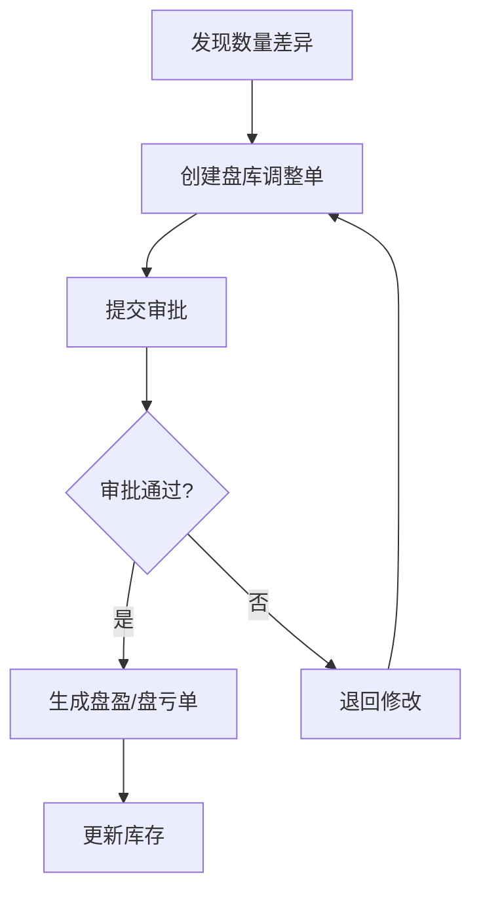
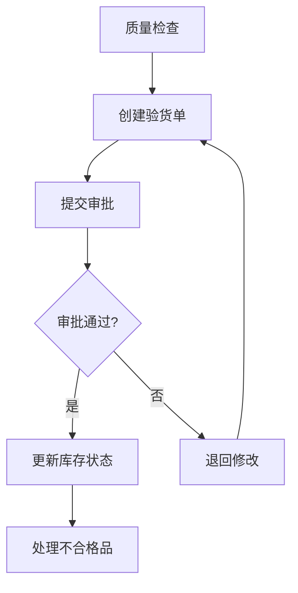
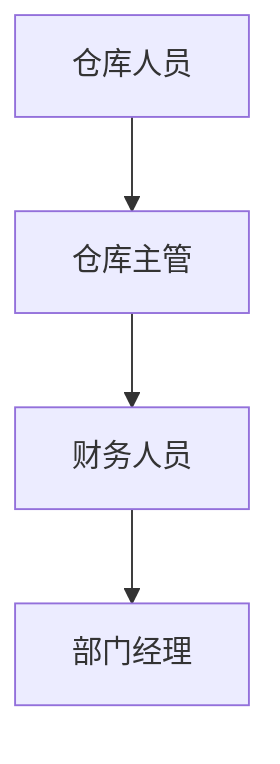
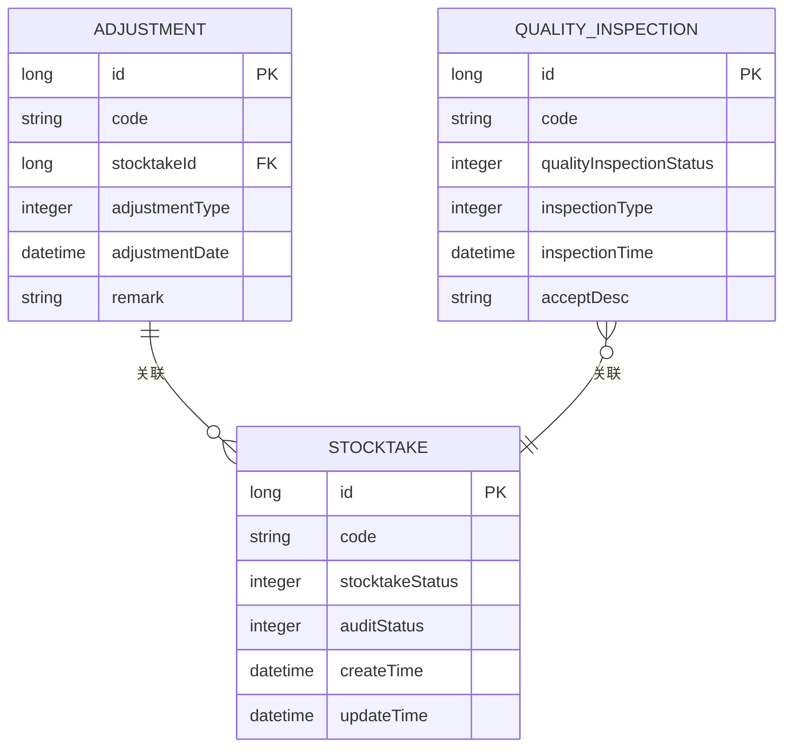
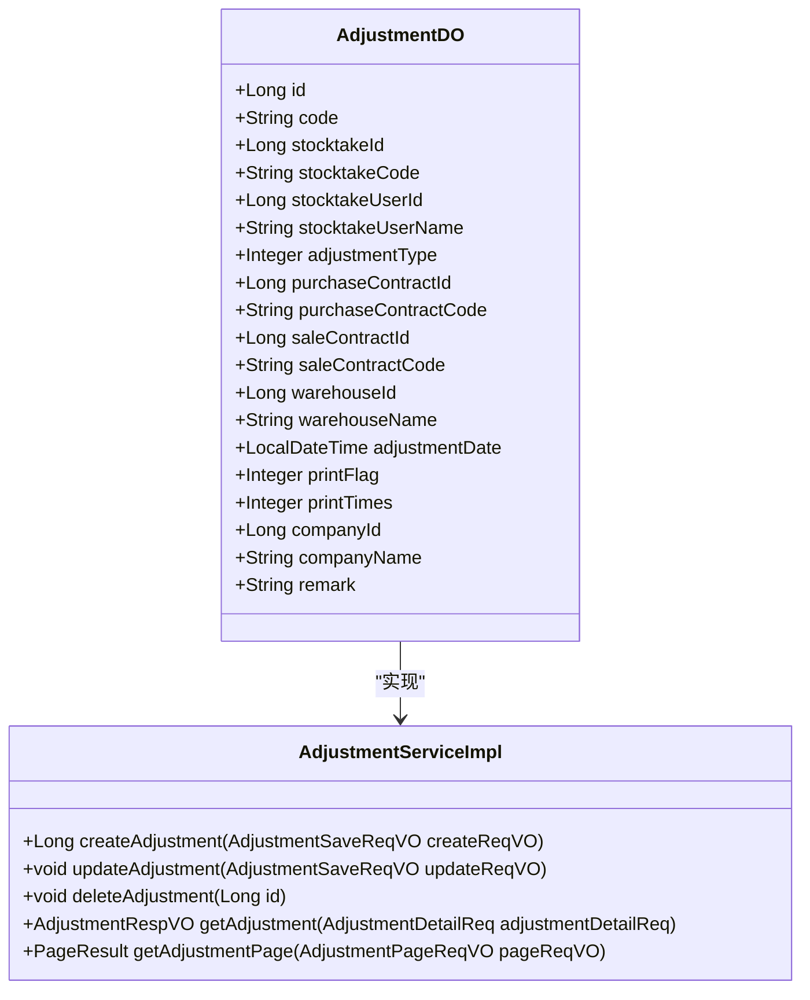
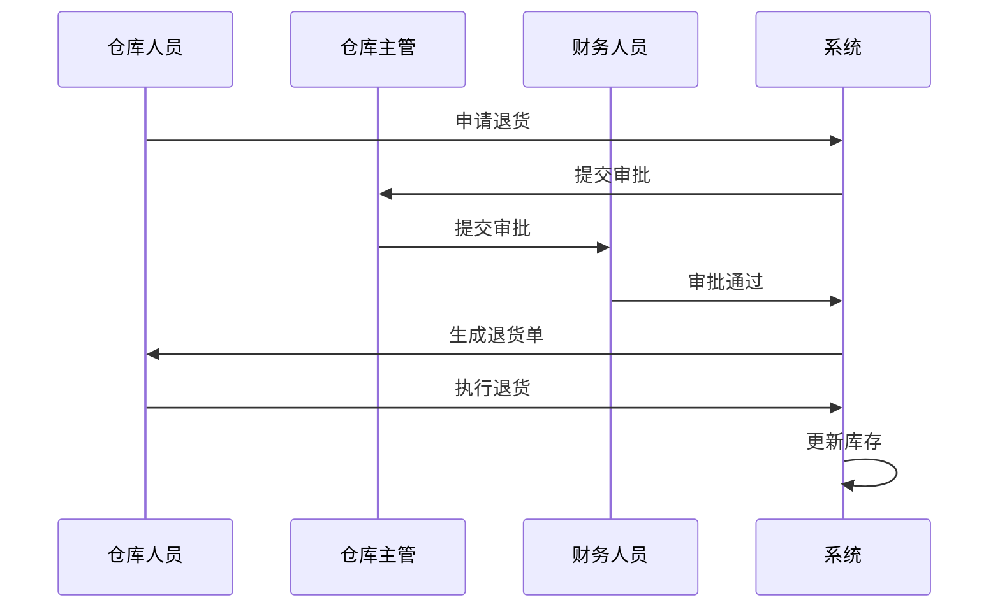

# 入库异常处理

<cite>
**本文档引用文件**   
- [AdjustmentDO.java](file://eplus-module-wms/eplus-module-wms-biz/src/main/java/com/syj/eplus/module/wms/dal/dataobject/adjustment/AdjustmentDO.java)
- [AdjustmentServiceImpl.java](file://eplus-module-wms/eplus-module-wms-biz/src/main/java/com/syj/eplus/module/wms/service/adjustment/AdjustmentServiceImpl.java)
- [StocktakeServiceImpl.java](file://eplus-module-wms/eplus-module-wms-biz/src/main/java/com/syj/eplus/module/wms/service/stocktake/StocktakeServiceImpl.java)
- [QualityInspectionServiceImpl.java](file://eplus-module-qms/eplus-module-qms-biz/src/main/java/com/syj/eplus/module/qms/service/qualityinspection/QualityInspectionServiceImpl.java)
- [ErrorCodeConstants.java](file://eplus-module-wms/eplus-module-wms-api/src/main/java/com/syj/eplus/module/wms/enums/ErrorCodeConstants.java)
- [StockBillStatusEnum.java](file://eplus-module-wms/eplus-module-wms-api/src/main/java/com/syj/eplus/module/wms/enums/StockBillStatusEnum.java)
- [NoticeStatusEnum.java](file://eplus-module-wms/eplus-module-wms-api/src/main/java/com/syj/eplus/module/wms/enums/NoticeStatusEnum.java)
- [StockSourceTypeEnum.java](file://eplus-module-wms/eplus-module-wms-api/src/main/java/com/syj/eplus/module/wms/enums/StockSourceTypeEnum.java)
- [StocktakeResultEnum.java](file://eplus-module-wms/eplus-module-wms-api/src/main/java/com/syj/eplus/module/wms/enums/StocktakeResultEnum.java)
- [StocktakeStatusEnum.java](file://eplus-module-wms/eplus-module-wms-api/src/main/java/com/syj/eplus/module/wms/enums/StocktakeStatusEnum.java)
- [QualityInspectionApi.java](file://eplus-module-qms/eplus-module-qms-api/src/main/java/com/syj/eplus/module/qms/api/QualityInspectionApi.java)
- [QualityInspectionRespDTO.java](file://eplus-module-qms/eplus-module-qms-api/src/main/java/com/syj/eplus/module/qms/api/dto/QualityInspectionRespDTO.java)
- [StockNoticeApi.java](file://eplus-module-wms/eplus-module-wms-api/src/main/java/com/syj/eplus/module/wms/api/stockNotice/IStockNoticeApi.java)
</cite>

## 目录
1. [引言](#引言)
2. [入库异常类型](#入库异常类型)
3. [异常处理流程](#异常处理流程)
4. [责任划分与审批路径](#责任划分与审批路径)
5. [系统记录与追溯](#系统记录与追溯)
6. [差异调整功能](#差异调整功能)
7. [退货处理机制](#退货处理机制)
8. [问题反馈渠道](#问题反馈渠道)
9. [最佳实践与常见问题解决方案](#最佳实践与常见问题解决方案)
10. [结论](#结论)

## 引言

入库异常处理是仓储管理系统中的关键环节，直接影响库存准确性、财务结算和客户满意度。本系统通过完善的异常处理机制，确保在实收数量与应收数量不符、质量不合格、包装破损、单据信息错误等场景下，能够及时、准确地进行处理。系统提供了差异调整、退货处理和问题反馈等多种功能，支持多级审批流程，确保所有操作可追溯、可审计。

**本文档引用文件**   
- [AdjustmentDO.java](file://eplus-module-wms/eplus-module-wms-biz/src/main/java/com/syj/eplus/module/wms/dal/dataobject/adjustment/AdjustmentDO.java)
- [AdjustmentServiceImpl.java](file://eplus-module-wms/eplus-module-wms-biz/src/main/java/com/syj/eplus/module/wms/service/adjustment/AdjustmentServiceImpl.java)
- [StocktakeServiceImpl.java](file://eplus-module-wms/eplus-module-wms-biz/src/main/java/com/syj/eplus/module/wms/service/stocktake/StocktakeServiceImpl.java)

## 入库异常类型

### 数量差异
数量差异是指实际收到的货物数量与采购合同或入库通知单上规定的应收数量不一致。系统通过入库单（YSBILL）和库存管理模块来处理此类异常。当实收数量大于应收数量时，系统记录为盘盈；当实收数量小于应收数量时，系统记录为盘亏。这些差异会触发相应的调整流程。

### 质量不合格
质量不合格是指收到的货物在质量上不符合采购合同或质量标准的要求。系统通过验货单（QualityInspection）模块来处理此类异常。验货单可以记录每个SKU的质量检查结果，包括合格、不合格、让步放行等状态。质量不合格的货物会被标记为次品库存，并触发退货或返工流程。

### 包装破损
包装破损是指货物在运输过程中包装受损，可能影响货物的质量或安全。系统在入库时会检查包装状况，并在系统中记录包装破损情况。包装破损的货物会被隔离存放，并通知相关责任人进行处理。

### 单据信息错误
单据信息错误是指入库通知单、采购合同等单据上的信息与实际货物不符。系统通过单据状态管理（NoticeStatusEnum）来处理此类异常。当发现单据信息错误时，系统会将单据状态设置为“作废”或“部分转”，并生成新的正确单据。

**本文档引用文件**   
- [ErrorCodeConstants.java](file://eplus-module-wms/eplus-module-wms-api/src/main/java/com/syj/eplus/module/wms/enums/ErrorCodeConstants.java)
- [StockBillStatusEnum.java](file://eplus-module-wms/eplus-module-wms-api/src/main/java/com/syj/eplus/module/wms/enums/StockBillStatusEnum.java)
- [NoticeStatusEnum.java](file://eplus-module-wms/eplus-module-wms-api/src/main/java/com/syj/eplus/module/wms/enums/NoticeStatusEnum.java)
- [StockSourceTypeEnum.java](file://eplus-module-wms/eplus-module-wms-api/src/main/java/com/syj/eplus/module/wms/enums/StockSourceTypeEnum.java)

## 异常处理流程

### 数量差异处理流程
1. **发现差异**：仓库人员在入库时发现实收数量与应收数量不符。
2. **记录差异**：在系统中创建盘库调整单（AdjustmentDO），记录差异数量和原因。
3. **审批流程**：提交盘库调整单进行审批，审批通过后更新库存。
4. **生成调整单**：系统根据审批结果生成盘盈或盘亏单，并更新库存记录。

**图源** 
- [AdjustmentDO.java](file://eplus-module-wms/eplus-module-wms-biz/src/main/java/com/syj/eplus/module/wms/dal/dataobject/adjustment/AdjustmentDO.java)
- [AdjustmentServiceImpl.java](file://eplus-module-wms/eplus-module-wms-biz/src/main/java/com/syj/eplus/module/wms/service/adjustment/AdjustmentServiceImpl.java)

### 质量不合格处理流程
1. **质量检查**：仓库人员对入库货物进行质量检查。
2. **记录结果**：在系统中创建验货单（QualityInspection），记录每个SKU的质量检查结果。
3. **审批流程**：提交验货单进行审批，审批通过后更新库存状态。
4. **处理不合格品**：根据审批结果，对不合格品进行退货或返工处理。

**图源** 
- [QualityInspectionApi.java](file://eplus-module-qms/eplus-module-qms-api/src/main/java/com/syj/eplus/module/qms/api/QualityInspectionApi.java)
- [QualityInspectionRespDTO.java](file://eplus-module-qms/eplus-module-qms-api/src/main/java/com/syj/eplus/module/qms/api/dto/QualityInspectionRespDTO.java)

**本文档引用文件**   
- [StocktakeServiceImpl.java](file://eplus-module-wms/eplus-module-wms-biz/src/main/java/com/syj/eplus/module/wms/service/stocktake/StocktakeServiceImpl.java)
- [QualityInspectionServiceImpl.java](file://eplus-module-qms/eplus-module-qms-biz/src/main/java/com/syj/eplus/module/qms/service/qualityinspection/QualityInspectionServiceImpl.java)

## 责任划分与审批路径

### 责任划分
- **仓库人员**：负责入库货物的接收、数量核对和质量检查。
- **质量检验员**：负责对入库货物进行质量检验，并记录检验结果。
- **仓库主管**：负责审核盘库调整单和验货单，确保数据的准确性。
- **财务人员**：负责审核与财务相关的调整单，确保财务数据的准确性。

### 审批路径
1. **一级审批**：仓库主管审核盘库调整单和验货单。
2. **二级审批**：财务人员审核与财务相关的调整单。
3. **三级审批**：部门经理审核重大调整事项。

**图源** 
- [StocktakeServiceImpl.java](file://eplus-module-wms/eplus-module-wms-biz/src/main/java/com/syj/eplus/module/wms/service/stocktake/StocktakeServiceImpl.java)
- [QualityInspectionServiceImpl.java](file://eplus-module-qms/eplus-module-qms-biz/src/main/java/com/syj/eplus/module/qms/service/qualityinspection/QualityInspectionServiceImpl.java)

**本文档引用文件**   
- [StocktakeStatusEnum.java](file://eplus-module-wms/eplus-module-wms-api/src/main/java/com/syj/eplus/module/wms/enums/StocktakeStatusEnum.java)
- [StocktakeResultEnum.java](file://eplus-module-wms/eplus-module-wms-api/src/main/java/com/syj/eplus/module/wms/enums/StocktakeResultEnum.java)

## 系统记录与追溯

### 系统记录
系统会记录所有入库异常处理的详细信息，包括：
- **操作时间**：记录每次操作的时间戳。
- **操作人员**：记录执行操作的人员信息。
- **操作内容**：记录具体的操作内容，如数量调整、质量检查结果等。
- **审批记录**：记录审批流程中的每个环节和审批意见。

### 追溯机制
系统提供完整的追溯机制，支持通过以下方式追溯入库异常处理记录：
- **单据编号**：通过单据编号查询相关记录。
- **时间范围**：通过时间范围查询相关记录。
- **操作人员**：通过操作人员查询相关记录。

**图源** 
- [AdjustmentDO.java](file://eplus-module-wms/eplus-module-wms-biz/src/main/java/com/syj/eplus/module/wms/dal/dataobject/adjustment/AdjustmentDO.java)
- [StocktakeDO.java](file://eplus-module-wms/eplus-module-wms-biz/src/main/java/com/syj/eplus/module/wms/dal/dataobject/stocktake/StocktakeDO.java)
- [QualityInspectionDO.java](file://eplus-module-qms/eplus-module-qms-biz/src/main/java/com/syj/eplus/module/qms/dal/dataobject/qualityinspection/QualityInspectionDO.java)

**本文档引用文件**   
- [AdjustmentDO.java](file://eplus-module-wms/eplus-module-wms-biz/src/main/java/com/syj/eplus/module/wms/dal/dataobject/adjustment/AdjustmentDO.java)
- [StocktakeDO.java](file://eplus-module-wms/eplus-module-wms-biz/src/main/java/com/syj/eplus/module/wms/dal/dataobject/stocktake/StocktakeDO.java)
- [QualityInspectionDO.java](file://eplus-module-qms/eplus-module-qms-biz/src/main/java/com/syj/eplus/module/qms/dal/dataobject/qualityinspection/QualityInspectionDO.java)

## 差异调整功能

### 盘盈处理
当实收数量大于应收数量时，系统会生成盘盈单。盘盈单会增加库存数量，并记录差异原因。盘盈单需要经过审批流程，审批通过后才能更新库存。

### 盘亏处理
当实收数量小于应收数量时，系统会生成盘亏单。盘亏单会减少库存数量，并记录差异原因。盘亏单需要经过审批流程，审批通过后才能更新库存。

### 调整单管理
系统提供调整单管理功能，支持创建、修改、删除和查询调整单。调整单可以关联到具体的入库单或采购合同，确保数据的完整性和可追溯性。

**图源** 
- [AdjustmentDO.java](file://eplus-module-wms/eplus-module-wms-biz/src/main/java/com/syj/eplus/module/wms/dal/dataobject/adjustment/AdjustmentDO.java)
- [AdjustmentServiceImpl.java](file://eplus-module-wms/eplus-module-wms-biz/src/main/java/com/syj/eplus/module/wms/service/adjustment/AdjustmentServiceImpl.java)

**本文档引用文件**   
- [AdjustmentDO.java](file://eplus-module-wms/eplus-module-wms-biz/src/main/java/com/syj/eplus/module/wms/dal/dataobject/adjustment/AdjustmentDO.java)
- [AdjustmentServiceImpl.java](file://eplus-module-wms/eplus-module-wms-biz/src/main/java/com/syj/eplus/module/wms/service/adjustment/AdjustmentServiceImpl.java)

## 退货处理机制

### 退货流程
1. **申请退货**：仓库人员在系统中申请退货，填写退货原因和数量。
2. **审批流程**：提交退货申请进行审批，审批通过后生成退货单。
3. **执行退货**：仓库人员执行退货操作，将货物退回供应商。
4. **更新库存**：系统根据退货单更新库存记录。

**图源** 
- [QualityInspectionServiceImpl.java](file://eplus-module-qms/eplus-module-qms-biz/src/main/java/com/syj/eplus/module/qms/service/qualityinspection/QualityInspectionServiceImpl.java)

**本文档引用文件**   
- [QualityInspectionServiceImpl.java](file://eplus-module-qms/eplus-module-qms-biz/src/main/java/com/syj/eplus/module/qms/service/qualityinspection/QualityInspectionServiceImpl.java)

## 问题反馈渠道

### 内部反馈
- **系统内反馈**：用户可以通过系统内的反馈功能提交问题，系统会自动记录反馈内容和时间。
- **邮件反馈**：用户可以通过邮件向技术支持团队反馈问题，邮件内容会被归档并跟踪处理进度。

### 外部反馈
- **供应商反馈**：供应商可以通过系统提供的接口或邮件反馈问题，系统会自动记录并通知相关责任人。
- **客户反馈**：客户可以通过客服渠道反馈问题，客服人员会将问题记录在系统中并跟踪处理。

**本文档引用文件**   
- [QualityInspectionApi.java](file://eplus-module-qms/eplus-module-qms-api/src/main/java/com/syj/eplus/module/qms/api/QualityInspectionApi.java)
- [StockNoticeApi.java](file://eplus-module-wms/eplus-module-wms-api/src/main/java/com/syj/eplus/module/wms/api/stockNotice/IStockNoticeApi.java)

## 最佳实践与常见问题解决方案

### 最佳实践
- **及时记录**：发现异常后应立即在系统中记录，避免遗漏。
- **详细描述**：在记录异常时，应详细描述异常情况，包括数量、质量、包装等信息。
- **多级审批**：对于重大异常，应采用多级审批流程，确保决策的准确性。

### 常见问题解决方案
- **数量差异**：核对采购合同和入库通知单，确认应收数量；与供应商沟通，确认实收数量。
- **质量不合格**：重新进行质量检查，确认不合格品的数量和原因；与供应商沟通，协商退货或返工方案。
- **包装破损**：隔离破损货物，避免影响其他货物；与物流公司沟通，索赔损失。

**本文档引用文件**   
- [AdjustmentServiceImpl.java](file://eplus-module-wms/eplus-module-wms-biz/src/main/java/com/syj/eplus/module/wms/service/adjustment/AdjustmentServiceImpl.java)
- [StocktakeServiceImpl.java](file://eplus-module-wms/eplus-module-wms-biz/src/main/java/com/syj/eplus/module/wms/service/stocktake/StocktakeServiceImpl.java)
- [QualityInspectionServiceImpl.java](file://eplus-module-qms/eplus-module-qms-biz/src/main/java/com/syj/eplus/module/qms/service/qualityinspection/QualityInspectionServiceImpl.java)

## 结论

入库异常处理是仓储管理系统中的重要环节，通过完善的异常处理机制，可以确保库存的准确性和财务数据的完整性。本系统提供了全面的异常处理功能，包括数量差异、质量不合格、包装破损和单据信息错误的处理，支持多级审批流程和完整的追溯机制。通过遵循最佳实践和及时解决问题，可以有效提升仓储管理的效率和准确性。