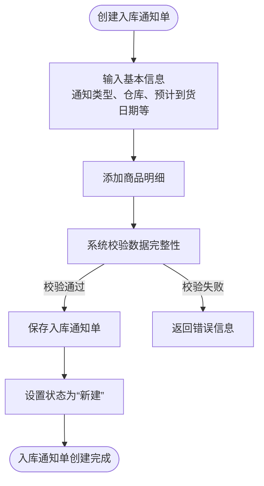
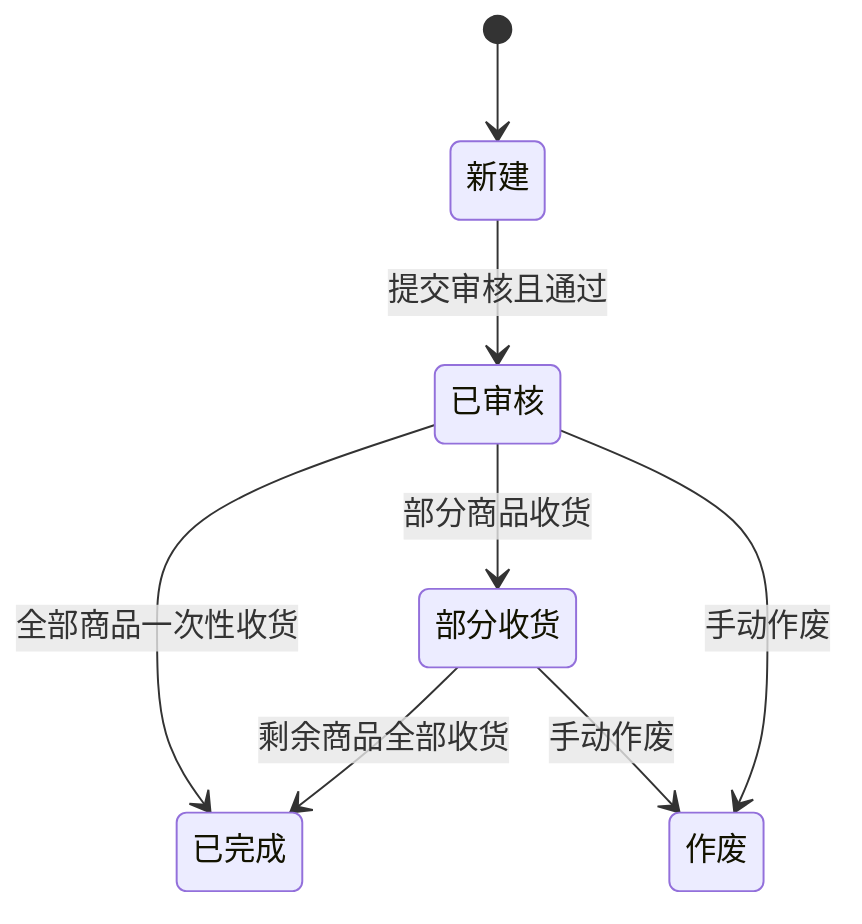
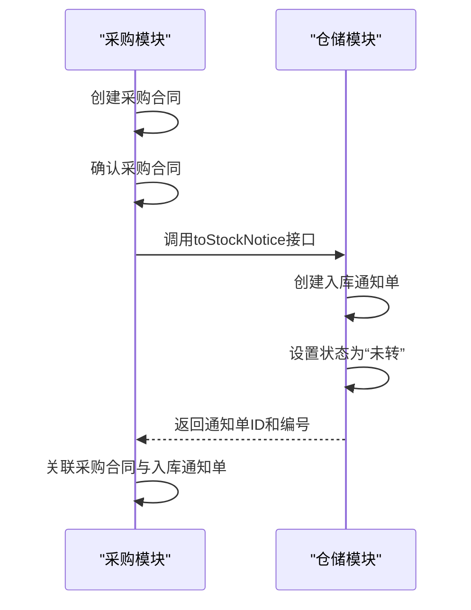
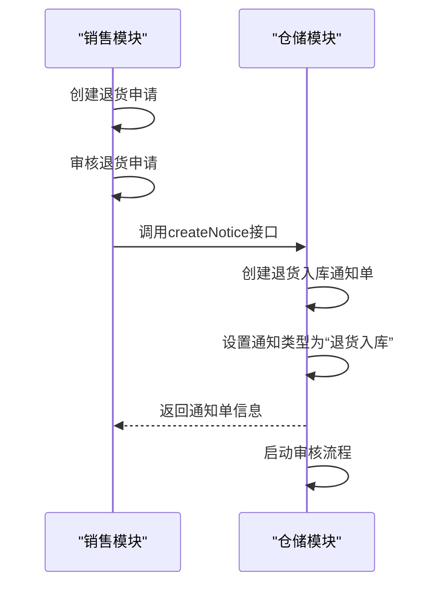
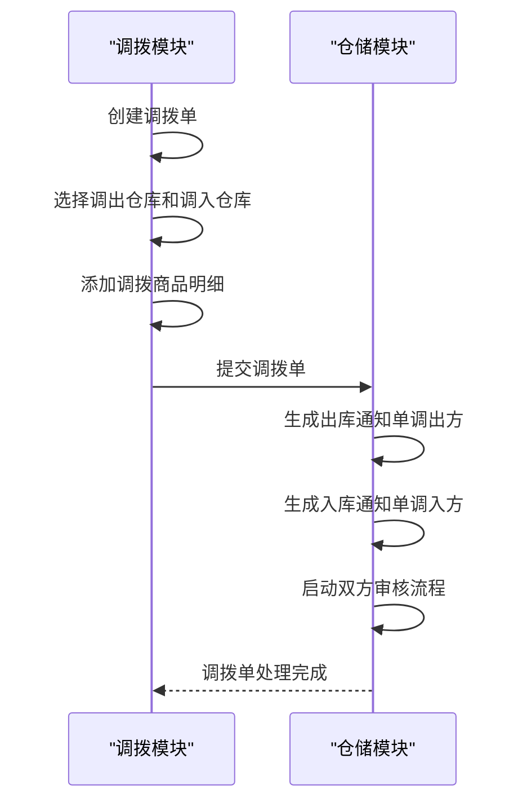
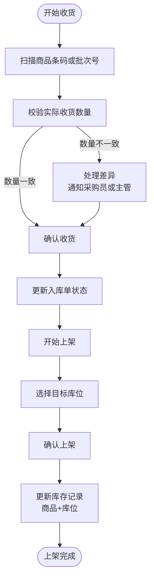
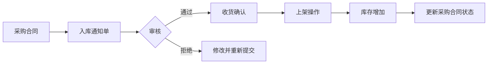

# 入库流程

<cite>
**本文档引用的文件**  
- [IStockNoticeApi.java](file://eplus-module-wms/eplus-module-wms-api/src/main/java/com/syj/eplus/module/wms/api/stockNotice/IStockNoticeApi.java)
- [StockNoticeSaveReqDTO.java](file://eplus-module-wms/eplus-module-wms-api/src/main/java/com/syj/eplus/module/wms/api/stockNotice/dto/StockNoticeSaveReqDTO.java)
- [NoticeStatusEnum.java](file://eplus-module-wms/eplus-module-wms-api/src/main/java/com/syj/eplus/module/wms/enums/NoticeStatusEnum.java)
- [StockBillStatusEnum.java](file://eplus-module-wms/eplus-module-wms-api/src/main/java/com/syj/eplus/module/wms/enums/StockBillStatusEnum.java)
- [StockNoticeServiceImpl.java](file://eplus-module-wms/eplus-module-wms-biz/src/main/java/com/syj/eplus/module/wms/service/stockNotice/StockNoticeServiceImpl.java)
- [IStockApi.java](file://eplus-module-wms/eplus-module-wms-api/src/main/java/com/syj/eplus/module/wms/api/stock/IStockApi.java)
- [PurchaseContractApi.java](file://eplus-module-scm/eplus-module-scm-api/src/main/java/com/syj/eplus/module/scm/api/purchasecontract/PurchaseContractApi.java)
- [SaleContractApi.java](file://eplus-module-sms/eplus-module-sms-api/src/main/java/com/syj/eplus/module/sms/api/SaleContractApi.java)
</cite>

## 目录
1. [入库流程概述](#入库流程概述)
2. [入库通知单创建与审核](#入库通知单创建与审核)
3. [入库单状态机](#入库单状态机)
4. [采购入库流程](#采购入库流程)
5. [退货入库流程](#退货入库流程)
6. [调拨入库流程](#调拨入库流程)
7. [收货确认与上架操作](#收货确认与上架操作)
8. [权限控制与审批机制](#权限控制与审批机制)
9. [数据流图](#数据流图)

## 入库流程概述

入库管理是仓储管理系统（WMS）的核心功能之一，涵盖了采购入库、退货入库、调拨入库等多种业务场景。系统通过入库通知单作为业务流转的起点，经过创建、审核、收货确认和上架操作等关键步骤，最终实现库存的准确更新。整个流程严格遵循状态机转换规则，并通过权限控制和审批机制确保业务操作的合规性和安全性。

**Section sources**
- [IStockNoticeApi.java](file://eplus-module-wms/eplus-module-wms-api/src/main/java/com/syj/eplus/module/wms/api/stockNotice/IStockNoticeApi.java#L1-L58)
- [StockNoticeSaveReqDTO.java](file://eplus-module-wms/eplus-module-wms-api/src/main/java/com/syj/eplus/module/wms/api/stockNotice/dto/StockNoticeSaveReqDTO.java#L1-L130)

## 入库通知单创建与审核

入库通知单的创建是入库流程的起点。系统支持通过采购合同、销售合同等多种来源创建入库通知单。创建时需要填写通知类型、仓库、预计到货日期等基本信息，并关联具体的商品明细。



**Diagram sources**
- [StockNoticeSaveReqDTO.java](file://eplus-module-wms/eplus-module-wms-api/src/main/java/com/syj/eplus/module/wms/api/stockNotice/dto/StockNoticeSaveReqDTO.java#L1-L130)
- [StockNoticeServiceImpl.java](file://eplus-module-wms/eplus-module-wms-biz/src/main/java/com/syj/eplus/module/wms/service/stockNotice/StockNoticeServiceImpl.java#L181-L256)

创建完成后，入库通知单进入审核流程。系统通过工作流引擎（BPM）管理审批过程，支持多级审批。用户提交审核后，通知单状态变更为“审核中”，待所有审批节点通过后，状态变更为“已审核”。

```mermaid
sequenceDiagram
participant User as "用户"
participant System as "系统"
participant BPM as "工作流引擎"
User->>System : 提交审核
System->>System : 校验通知单状态
System->>BPM : 启动审批流程
BPM-->>System : 返回流程实例ID
System->>System : 更新通知单状态为“审核中”
System-->>User : 提交成功
loop 审批循环
BPM->>Approver : 发送审批任务
Approver->>BPM : 审批通过/拒绝
alt 审批通过
BPM->>System : 通知审批结果
else 审批拒绝
BPM->>System : 通知审批结果
System->>User : 通知审批被拒绝
break
end
end
BPM->>System : 所有节点审批通过
System->>System : 更新通知单状态为“已审核”
```

**Diagram sources**
- [StockNoticeServiceImpl.java](file://eplus-module-wms/eplus-module-wms-biz/src/main/java/com/syj/eplus/module/wms/service/stockNotice/StockNoticeServiceImpl.java#L1081-L1108)

## 入库单状态机

入库单的状态机定义了单据在生命周期内的状态转换规则。主要状态包括“新建”、“已审核”、“部分收货”和“已完成”。状态转换由特定的业务操作触发，如审核、收货等。



**Diagram sources**
- [NoticeStatusEnum.java](file://eplus-module-wms/eplus-module-wms-api/src/main/java/com/syj/eplus/module/wms/enums/NoticeStatusEnum.java#L1-L27)
- [StockBillStatusEnum.java](file://eplus-module-wms/eplus-module-wms-api/src/main/java/com/syj/eplus/module/wms/enums/StockBillStatusEnum.java#L1-L22)

## 采购入库流程

采购入库流程始于采购合同的创建。当采购合同确认后，系统会自动生成对应的入库通知单。采购员在系统中创建采购合同，填写供应商、商品明细、数量、价格等信息。合同确认后，系统调用WMS模块的接口，将采购合同信息转换为入库通知单。



**Diagram sources**
- [PurchaseContractApi.java](file://eplus-module-scm/eplus-module-scm-api/src/main/java/com/syj/eplus/module/scm/api/purchasecontract/PurchaseContractApi.java#L1-L352)
- [IStockNoticeApi.java](file://eplus-module-wms/eplus-module-wms-api/src/main/java/com/syj/eplus/module/wms/api/stockNotice/IStockNoticeApi.java#L21-L28)

## 退货入库流程

退货入库流程通常由销售合同的退货申请触发。当客户需要退货时，销售人员在系统中发起退货申请，填写退货商品、数量等信息。系统根据退货申请生成退货入库通知单，后续流程与标准入库流程一致。



**Diagram sources**
- [SaleContractApi.java](file://eplus-module-sms/eplus-module-sms-api/src/main/java/com/syj/eplus/module/sms/api/SaleContractApi.java#L1-L475)
- [StockNoticeServiceImpl.java](file://eplus-module-wms/eplus-module-wms-biz/src/main/java/com/syj/eplus/module/wms/service/stockNotice/StockNoticeServiceImpl.java#L181-L256)

## 调拨入库流程

调拨入库流程是仓库间库存转移的重要环节。当需要将商品从一个仓库调拨到另一个仓库时，系统会创建调拨单。调拨单审核通过后，会生成出库通知单和入库通知单。出库方仓库执行出库操作，入库方仓库收到商品后，执行收货确认和上架操作。



**Diagram sources**
- [StockNoticeServiceImpl.java](file://eplus-module-wms/eplus-module-wms-biz/src/main/java/com/syj/eplus/module/wms/service/stockNotice/StockNoticeServiceImpl.java#L181-L256)

## 收货确认与上架操作

收货确认是入库流程的关键环节。当商品到达仓库后，仓库管理员根据入库通知单进行收货。系统支持扫描商品条码或批次号进行收货确认，确保收货的准确性和效率。收货时，系统会校验实际收货数量与通知单数量是否一致。

上架操作是将已收货的商品放置到指定库位的过程。仓库管理员在系统中选择目标库位，系统会更新库存记录，将商品与库位信息进行绑定。上架完成后，系统会更新入库单状态。



**Diagram sources**
- [StockNoticeServiceImpl.java](file://eplus-module-wms/eplus-module-wms-biz/src/main/java/com/syj/eplus/module/wms/service/stockNotice/StockNoticeServiceImpl.java#L531-L635)
- [IStockApi.java](file://eplus-module-wms/eplus-module-wms-api/src/main/java/com/syj/eplus/module/wms/api/stock/IStockApi.java#L1-L246)

## 权限控制与审批机制

系统通过严格的权限控制和审批机制确保入库流程的安全性和合规性。不同角色的用户拥有不同的操作权限，例如采购员可以创建采购合同，但不能审核入库通知单；仓库管理员可以执行收货和上架操作，但不能修改采购合同。

审批机制通过工作流引擎实现，支持灵活的审批流程配置。每个审批节点可以指定审批人，支持会签、或签等多种审批模式。审批过程中，系统会记录详细的审批日志，包括审批人、审批时间、审批意见等，确保流程的可追溯性。

**Section sources**
- [StockNoticeServiceImpl.java](file://eplus-module-wms/eplus-module-wms-biz/src/main/java/com/syj/eplus/module/wms/service/stockNotice/StockNoticeServiceImpl.java#L1071-L1108)

## 数据流图

从采购订单到库存增加的完整数据流如下图所示。采购合同创建后，触发生成入库通知单；入库通知单经过审核后，进入收货阶段；收货确认后，系统更新库存记录，完成整个入库流程。



**Diagram sources**
- [PurchaseContractApi.java](file://eplus-module-scm/eplus-module-scm-api/src/main/java/com/syj/eplus/module/scm/api/purchasecontract/PurchaseContractApi.java#L1-L352)
- [StockNoticeServiceImpl.java](file://eplus-module-wms/eplus-module-wms-biz/src/main/java/com/syj/eplus/module/wms/service/stockNotice/StockNoticeServiceImpl.java#L181-L256)
- [IStockApi.java](file://eplus-module-wms/eplus-module-wms-api/src/main/java/com/syj/eplus/module/wms/api/stock/IStockApi.java#L1-L246)