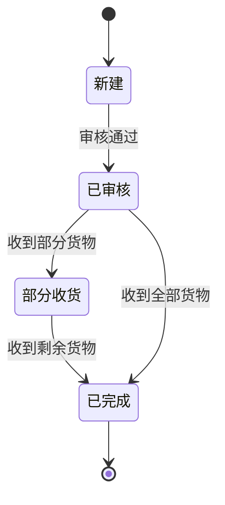
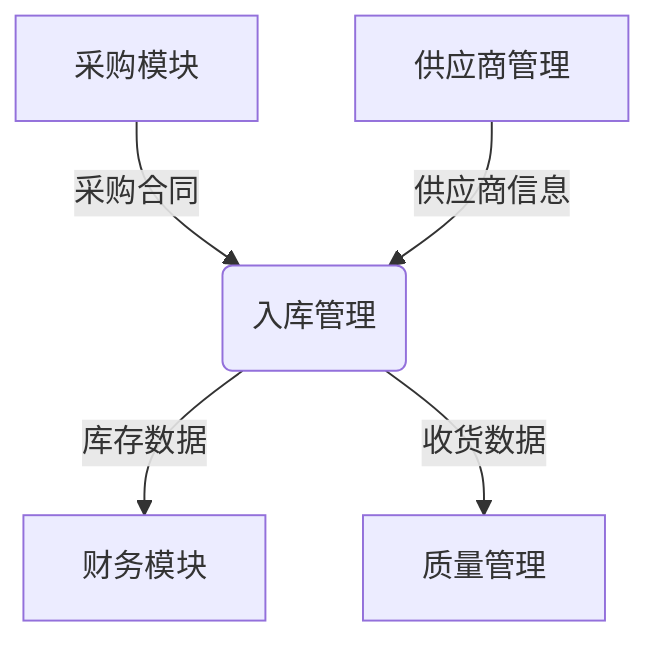
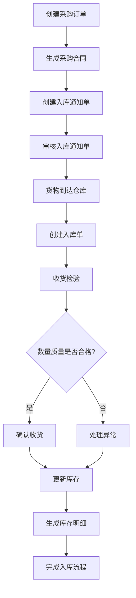

# 入库管理

<cite>
**本文档引用文件**   
- [StockBillStatusEnum.java](file://eplus-module-wms/eplus-module-wms-api/src/main/java/com/syj/eplus/module/wms/enums/StockBillStatusEnum.java)
- [StockSourceTypeEnum.java](file://eplus-module-wms/eplus-module-wms-api/src/main/java/com/syj/eplus/module/wms/enums/StockSourceTypeEnum.java)
- [NoticeStatusEnum.java](file://eplus-module-wms/eplus-module-wms-api/src/main/java/com/syj/eplus/module/wms/enums/NoticeStatusEnum.java)
- [StockServiceImpl.java](file://eplus-module-wms/eplus-module-wms-biz/src/main/java/com/syj/eplus/module/wms/service/stock/StockServiceImpl.java)
- [StockNoticeServiceImpl.java](file://eplus-module-wms/eplus-module-wms-biz/src/main/java/com/syj/eplus/module/wms/service/stocknotice/StockNoticeServiceImpl.java)
- [BillServiceImpl.java](file://eplus-module-wms/eplus-module-wms-biz/src/main/java/com/syj/eplus/module/wms/service/bill/BillServiceImpl.java)
- [PurchaseContractServiceImpl.java](file://eplus-module-scm/eplus-module-scm-biz/src/main/java/com/syj/eplus/module/scm/service/purchasecontract/PurchaseContractServiceImpl.java)
- [R__字典相关.sql](file://eplus-flyway/src/main/resources/db/migration/common/R__字典相关.sql)
- [V1_0_0_532__新增库存导入数据存储表.sql](file://eplus-flyway/src/main/resources/db/migration/common/V1_0_0_532__新增库存导入数据存储表.sql)
</cite>

## 目录
1. [入库管理概述](#入库管理概述)
2. [入库业务场景](#入库业务场景)
3. [入库通知单流程](#入库通知单流程)
4. [入库单状态机](#入库单状态机)
5. [系统集成关系](#系统集成关系)
6. [入库业务流程图](#入库业务流程图)
7. [入库异常处理](#入库异常处理)

## 入库管理概述

入库管理是仓储管理系统的核心功能，负责处理采购入库、退货入库、调拨入库等多种业务场景。系统通过入库通知单、入库单等单据实现对库存的精确管理，确保库存数据的准确性和可追溯性。

入库管理模块主要包含三个核心单据：入库通知单、入库单和库存明细。入库通知单用于通知仓库准备收货，入库单用于记录实际收货情况，库存明细则记录了每个批次的具体库存信息。

系统通过状态机机制管理单据的生命周期，确保业务流程的规范性和数据的一致性。同时，入库管理模块与采购模块、供应商管理等系统紧密集成，实现了从业务源头到库存落地的完整闭环。

**Section sources**
- [StockServiceImpl.java](file://eplus-module-wms/eplus-module-wms-biz/src/main/java/com/syj/eplus/module/wms/service/stock/StockServiceImpl.java#L1-L849)
- [StockNoticeServiceImpl.java](file://eplus-module-wms/eplus-module-wms-biz/src/main/java/com/syj/eplus/module/wms/service/stocknotice/StockNoticeServiceImpl.java#L1-L1166)

## 入库业务场景

入库管理支持多种业务场景，每种场景都有其特定的处理流程和规则。

### 采购入库

采购入库是最常见的入库场景，当采购合同中的货物到达仓库时，需要进行采购入库操作。采购入库的流程如下：

1. 采购员创建采购合同
2. 系统根据采购合同生成入库通知单
3. 仓库收到货物后，创建入库单并收货
4. 系统更新库存信息

采购入库的特点是与采购合同紧密关联，入库数量会影响采购合同的执行状态。

### 退货入库

退货入库处理供应商退货的情况。当采购的货物存在质量问题或数量差异时，需要退回给供应商，后续可能需要重新入库。

退货入库的流程与采购入库类似，但需要额外记录退货原因和质量检验信息。

### 调拨入库

调拨入库处理仓库之间的货物调拨。当货物从一个仓库调拨到另一个仓库时，调出仓库执行出库操作，调入仓库执行入库操作。

调拨入库的特点是不涉及外部供应商，只在内部仓库之间进行库存转移。

**Section sources**
- [StockSourceTypeEnum.java](file://eplus-module-wms/eplus-module-wms-api/src/main/java/com/syj/eplus/module/wms/enums/StockSourceTypeEnum.java#L1-L24)
- [PurchaseContractServiceImpl.java](file://eplus-module-scm/eplus-module-scm-biz/src/main/java/com/syj/eplus/module/scm/service/purchasecontract/PurchaseContractServiceImpl.java#L3372-L3395)

## 入库通知单流程

入库通知单是入库管理的起点，记录了即将入库的货物信息。入库通知单的完整流程包括创建、审核、收货和上架等环节。

### 创建入库通知单

入库通知单可以通过以下方式创建：
- 手动创建：仓库管理员根据实际情况手动创建
- 系统生成：根据采购合同自动生成

创建入库通知单时需要填写以下关键信息：
- 货物明细：包括产品编号、名称、数量等
- 供应商信息：供应商名称、联系人等
- 预计到货时间
- 仓库信息

### 审核入库通知单

入库通知单创建后需要经过审核流程。审核的主要内容包括：
- 核对货物信息是否准确
- 确认供应商信息是否正确
- 检查预计到货时间是否合理

审核通过后，入库通知单状态变更为"已审核"，仓库可以开始准备收货。

### 收货与上架

收货环节是入库流程的关键步骤，具体包括：
1. 核对实际到货数量与通知单数量
2. 进行质量检验
3. 创建入库单并确认收货
4. 将货物上架到指定位置

收货完成后，系统会自动更新库存信息。

**Section sources**
- [StockNoticeServiceImpl.java](file://eplus-module-wms/eplus-module-wms-biz/src/main/java/com/syj/eplus/module/wms/service/stocknotice/StockNoticeServiceImpl.java#L180-L352)
- [BillServiceImpl.java](file://eplus-module-wms/eplus-module-wms-biz/src/main/java/com/syj/eplus/module/wms/service/bill/BillServiceImpl.java#L136-L274)

## 入库单状态机

入库单的状态机管理了入库单的整个生命周期，确保业务流程的规范性和数据的一致性。

### 状态定义

入库单有以下几种状态：
- **新建**：入库单刚创建，尚未审核
- **已审核**：入库单已通过审核，可以进行收货
- **部分收货**：只收到了部分货物
- **已完成**：所有货物都已收货并上架

### 状态转换规则

状态转换遵循严格的规则，确保业务流程的正确性：

**Diagram sources **
- [StockBillStatusEnum.java](file://eplus-module-wms/eplus-module-wms-api/src/main/java/com/syj/eplus/module/wms/enums/StockBillStatusEnum.java#L1-L22)
- [R__字典相关.sql](file://eplus-flyway/src/main/resources/db/migration/common/R__字典相关.sql#L490-L498)

## 系统集成关系

入库管理模块与多个系统模块紧密集成，形成了完整的业务闭环。

### 与采购模块的集成

入库管理与采购模块的集成主要体现在：
- 采购合同作为采购入库的源头
- 入库数量影响采购合同的执行状态
- 采购合同的变更会同步到入库单

这种集成确保了采购业务的完整性和一致性。

### 与供应商管理的集成

入库管理与供应商管理的集成主要体现在：
- 入库单记录供应商信息
- 供应商的绩效评估基于入库数据
- 供应商的资质信息用于入库审核

这种集成有助于提高供应商管理的效率和准确性。

**Diagram sources **
- [PurchaseContractServiceImpl.java](file://eplus-module-scm/eplus-module-scm-biz/src/main/java/com/syj/eplus/module/scm/service/purchasecontract/PurchaseContractServiceImpl.java#L3372-L3395)
- [StockServiceImpl.java](file://eplus-module-wms/eplus-module-wms-biz/src/main/java/com/syj/eplus/module/wms/service/stock/StockServiceImpl.java#L813-L838)

## 入库业务流程图

以下流程图展示了从采购订单到库存增加的完整数据流：

**Diagram sources **
- [StockNoticeServiceImpl.java](file://eplus-module-wms/eplus-module-wms-biz/src/main/java/com/syj/eplus/module/wms/service/stocknotice/StockNoticeServiceImpl.java#L180-L352)
- [BillServiceImpl.java](file://eplus-module-wms/eplus-module-wms-biz/src/main/java/com/syj/eplus/module/wms/service/bill/BillServiceImpl.java#L136-L274)

## 入库异常处理

入库过程中可能会遇到各种异常情况，系统提供了相应的处理机制。

### 数量差异处理

当实际到货数量与通知单数量不一致时，处理流程如下：
1. 记录实际到货数量
2. 通知采购员和供应商
3. 协商解决方案（补货或退款）
4. 更新入库单和采购合同

### 质量不合格处理

当货物质量检验不合格时，处理流程如下：
1. 记录不合格情况和原因
2. 隔离不合格货物
3. 通知质量管理部门
4. 决定处理方案（退货、返工或降级使用）
5. 更新相关单据

### 其他异常处理

其他常见异常包括：
- 货物损坏：记录损坏情况，通知保险公司
- 包装不符：记录包装问题，通知供应商改进
- 文件不全：暂停收货，等待补充文件

系统会记录所有异常处理过程，确保可追溯性。

**Section sources**
- [StockServiceImpl.java](file://eplus-module-wms/eplus-module-wms-biz/src/main/java/com/syj/eplus/module/wms/service/stock/StockServiceImpl.java#L813-L838)
- [V1_0_0_532__新增库存导入数据存储表.sql](file://eplus-flyway/src/main/resources/db/migration/common/V1_0_0_532__新增库存导入数据存储表.sql#L1-L21)