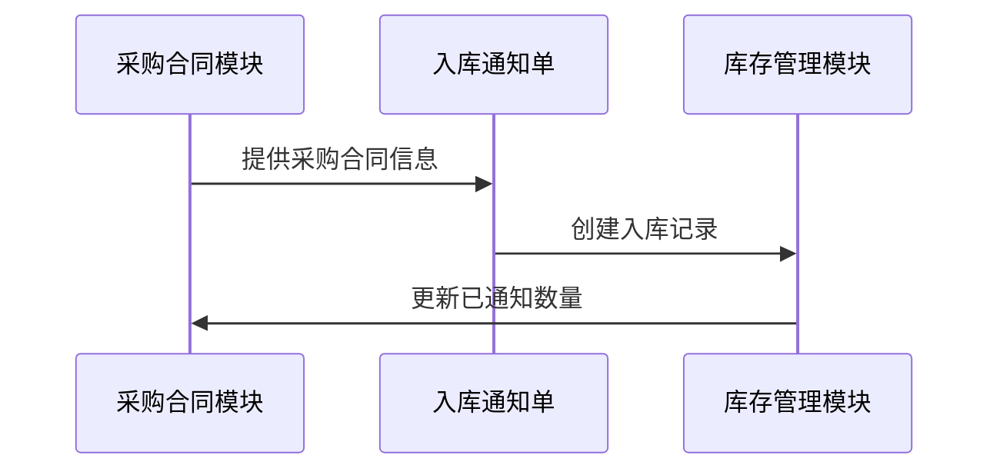
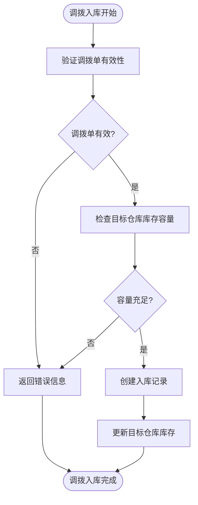
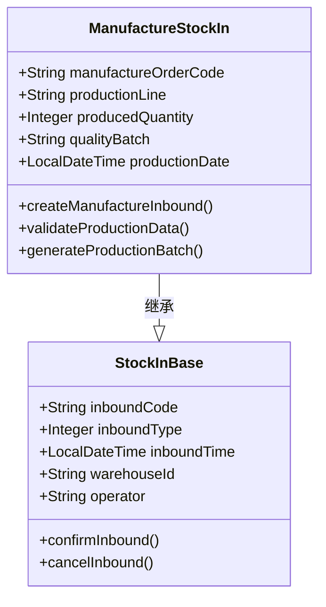
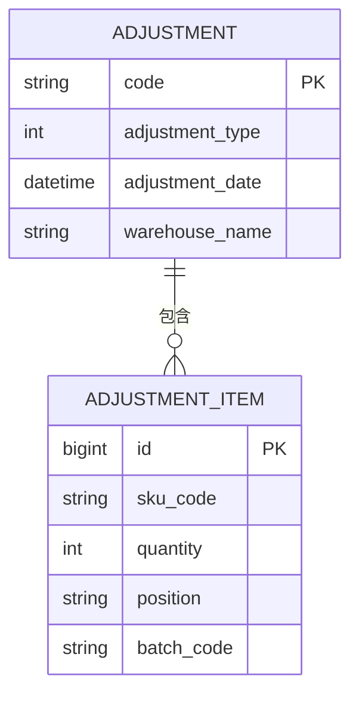
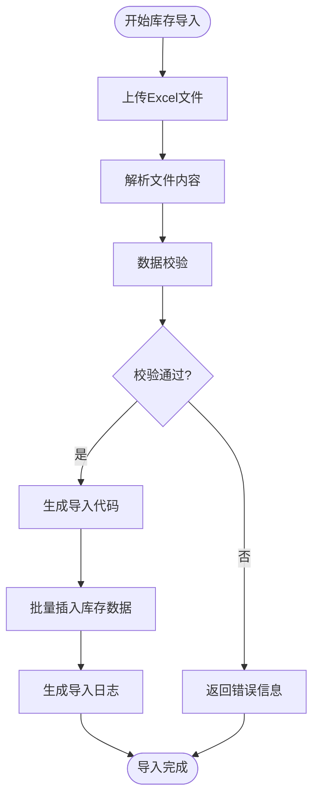

# 入库类型

<cite>
**本文档引用的文件**   
- [StockSourceTypeEnum.java](file://eplus-module-wms/eplus-module-wms-api/src/main/java/com/syj/eplus/module/wms/enums/StockSourceTypeEnum.java)
- [StockTypeEnum.java](file://eplus-module-wms/eplus-module-wms-api/src/main/java/com/syj/eplus/module/wms/enums/StockTypeEnum.java)
- [StockBillStatusEnum.java](file://eplus-module-wms/eplus-module-wms-api/src/main/java/com/syj/eplus/module/wms/enums/StockBillStatusEnum.java)
- [StockImportServiceImpl.java](file://eplus-module-wms/eplus-module-wms-biz/src/main/java/com/syj/eplus/module/wms/service/stockimport/StockImportServiceImpl.java)
- [AdjustmentDO.java](file://eplus-module-wms/eplus-module-wms-biz/src/main/java/com/syj/eplus/module/wms/dal/dataobject/adjustment/AdjustmentDO.java)
- [TransferOrderServiceImpl.java](file://eplus-module-wms/eplus-module-wms-biz/src/main/java/com/syj/eplus/module/wms/service/transferorder/TransferOrderServiceImpl.java)
- [StockNoticeSaveReqVO.java](file://eplus-module-wms/eplus-module-wms-biz/src/main/java/com/syj/eplus/module/wms/controller/admin/stockNotice/vo/StockNoticeSaveReqVO.java)
- [R__字典相关.sql](file://eplus-flyway/src/main/resources/db/migration/common/R__字典相关.sql)
- [V1_0_0_002__Eplus初始化.sql](file://eplus-flyway/src/main/resources/db/migration/common/V1_0_0_002__Eplus初始化.sql)
- [V1_0_0_532__新增库存导入数据存储表.sql](file://eplus-flyway/src/main/resources/db/migration/common/V1_0_0_532__新增库存导入数据存储表.sql)
</cite>

## 目录
1. [入库类型概述](#入库类型概述)
2. [采购入库](#采购入库)
3. [退货入库](#退货入库)
4. [调拨入库](#调拨入库)
5. [生产入库](#生产入库)
6. [盘盈入库](#盘盈入库)
7. [库存导入](#库存导入)
8. [各入库类型对比分析](#各入库类型对比分析)
9. [字段配置说明](#字段配置说明)
10. [业务规则约束](#业务规则约束)

## 入库类型概述

系统支持多种入库类型，每种类型对应不同的业务场景和数据来源。入库类型通过`StockSourceTypeEnum`枚举进行定义，包含采购、盘盈、盘亏、调拨、组套件、加工单和库存导入等类型。所有入库操作都遵循统一的入库流程，但根据不同的来源单据类型有不同的特殊处理规则。

入库操作的状态由`StockBillStatusEnum`枚举管理，包含未确认、已确认和作废三种状态。入库类型与出库类型通过`StockTypeEnum`枚举区分，其中入库类型值为1，出库类型值为2。

**Section sources**
- [StockSourceTypeEnum.java](file://eplus-module-wms/eplus-module-wms-api/src/main/java/com/syj/eplus/module/wms/enums/StockSourceTypeEnum.java#L1-L23)
- [StockTypeEnum.java](file://eplus-module-wms/eplus-module-wms-api/src/main/java/com/syj/eplus/module/wms/enums/StockTypeEnum.java#L1-L22)
- [StockBillStatusEnum.java](file://eplus-module-wms/eplus-module-wms-api/src/main/java/com/syj/eplus/module/wms/enums/StockBillStatusEnum.java#L1-L22)

## 采购入库

采购入库是指通过采购合同完成的货物入库操作，是企业最常见的入库类型之一。该类型入库与采购合同模块紧密集成，确保采购订单与实际收货的一致性。

### 业务场景
采购入库适用于供应商按照采购合同约定交付货物的场景。当货物到达仓库后，仓库管理员根据采购合同创建入库通知单，完成货物验收和入库登记。

### 数据来源
采购入库的数据主要来源于采购合同模块，包括：
- 采购合同编号
- 采购明细项
- 供应商信息
- 采购数量和价格

### 关联单据
- 采购合同
- 采购订单
- 入库通知单
- 供应商送货单

### 特殊处理规则
采购入库需要验证采购合同的完成状态，在入库前确保采购合同已经生产完成。系统会自动更新采购合同明细中的已通知数量，确保采购执行进度的准确性。

**Diagram sources **
- [PurchaseContractServiceImpl.java](file://eplus-module-scm/eplus-module-scm-biz/src/main/java/com/syj/eplus/module/scm/service/purchasecontract/PurchaseContractServiceImpl.java#L2101-L2122)
- [StockNoticeSaveReqVO.java](file://eplus-module-wms/eplus-module-wms-biz/src/main/java/com/syj/eplus/module/wms/controller/admin/stockNotice/vo/StockNoticeSaveReqVO.java#L1-L110)

**Section sources**
- [StockSourceTypeEnum.java](file://eplus-module-wms/eplus-module-wms-api/src/main/java/com/syj/eplus/module/wms/enums/StockSourceTypeEnum.java#L13)
- [R__字典相关.sql](file://eplus-flyway/src/main/resources/db/migration/common/R__字典相关.sql#L492)

## 退货入库

退货入库是指客户退回货物或供应商接受退货后的入库操作。该类型入库需要与销售合同和客户管理模块进行数据交互。

### 业务场景
退货入库适用于以下场景：
- 客户因质量问题退回已购买的商品
- 销售合同取消后的货物退回
- 跨境电商中的跨境退货

### 数据来源
退货入库的数据来源包括：
- 销售合同信息
- 客户退货申请
- 质量检验结果
- 物流运输信息

### 关联单据
- 销售合同
- 退货申请单
- 质量检验报告
- 物流运单

### 特殊处理规则
退货入库需要进行质量检验，根据检验结果决定货物的处理方式。对于合格品，可以直接入库；对于不合格品，需要标记为待处理状态，等待进一步处置。

**Section sources**
- [StockSourceTypeEnum.java](file://eplus-module-wms/eplus-module-wms-api/src/main/java/com/syj/eplus/module/wms/enums/StockSourceTypeEnum.java#L13)
- [StockNoticeSaveReqVO.java](file://eplus-module-wms/eplus-module-wms-biz/src/main/java/com/syj/eplus/module/wms/controller/admin/stockNotice/vo/StockNoticeSaveReqVO.java#L29-L31)

## 调拨入库

调拨入库是指从一个仓库向另一个仓库转移货物时，在目标仓库完成的入库操作。该类型入库与调拨单模块紧密关联。

### 业务场景
调拨入库适用于以下场景：
- 不同仓库之间的库存调整
- 区域仓库向门店仓库的货物配送
- 生产基地之间的原材料调拨

### 数据来源
调拨入库的数据来源于调拨单，包括：
- 调拨单编号
- 调出仓库信息
- 调入仓库信息
- 调拨明细

### 关联单据
- 调拨单
- 出库单（调出仓库）
- 入库单（调入仓库）
- 内部运输单

### 特殊处理规则
调拨入库需要与调拨出库操作配对完成，确保库存转移的完整性。系统会自动处理调拨过程中的批次号继承，保持货物追溯信息的连续性。

**Diagram sources **
- [TransferOrderServiceImpl.java](file://eplus-module-wms/eplus-module-wms-biz/src/main/java/com/syj/eplus/module/wms/service/transferorder/TransferOrderServiceImpl.java#L118-L136)
- [StockSourceTypeEnum.java](file://eplus-module-wms/eplus-module-wms-api/src/main/java/com/syj/eplus/module/wms/enums/StockSourceTypeEnum.java#L16)

**Section sources**
- [StockSourceTypeEnum.java](file://eplus-module-wms/eplus-module-wms-api/src/main/java/com/syj/eplus/module/wms/enums/StockSourceTypeEnum.java#L16)
- [V1_0_0_002__Eplus初始化.sql](file://eplus-flyway/src/main/resources/db/migration/common/V1_0_0_002__Eplus初始化.sql#L2111-L2122)

## 生产入库

生产入库是指生产加工完成后，将成品或半成品入库的操作。该类型入库与生产管理模块（MMS）紧密集成。

### 业务场景
生产入库适用于以下场景：
- 加工单完成后的成品入库
- 生产线的半成品入库
- 委外加工产品的回收入库

### 数据来源
生产入库的数据来源于加工单，包括：
- 加工单编号
- 生产任务信息
- 生产数量
- 生产批次

### 关联单据
- 加工单
- 生产任务单
- 工艺路线单
- 质量检验单

### 特殊处理规则
生产入库需要关联加工单信息，确保生产成果的可追溯性。系统会自动为入库产品生成新的批次号，并记录生产相关信息。

**Diagram sources **
- [StockSourceTypeEnum.java](file://eplus-module-wms/eplus-module-wms-api/src/main/java/com/syj/eplus/module/wms/enums/StockSourceTypeEnum.java#L18)
- [ShipmentServiceImpl.java](file://eplus-module-dms/eplus-module-dms-biz/src/main/java/com/syj/eplus/module/dms/service/shipment/ShipmentServiceImpl.java#L4824)

**Section sources**
- [StockSourceTypeEnum.java](file://eplus-module-wms/eplus-module-wms-api/src/main/java/com/syj/eplus/module/wms/enums/StockSourceTypeEnum.java#L18)
- [StockNoticeSaveReqVO.java](file://eplus-module-wms/eplus-module-wms-biz/src/main/java/com/syj/eplus/module/wms/controller/admin/stockNotice/vo/StockNoticeSaveReqVO.java#L30)

## 盘盈入库

盘盈入库是指在库存盘点过程中发现实际库存数量大于账面库存数量时，将差额部分入库的操作。

### 业务场景
盘盈入库适用于以下场景：
- 月度或年度库存盘点
- 循环盘点发现的库存差异
- 仓库整理时发现的遗漏货物

### 数据来源
盘盈入库的数据来源于盘点单，包括：
- 盘点单编号
- 盘点时间
- 盘点人员
- 实际盘点数量
- 账面库存数量

### 关联单据
- 盘点单
- 盘库调整单
- 盘点差异报告
- 审批单

### 特殊处理规则
盘盈入库需要经过严格的审批流程，确保差异原因的合理性。系统会记录盘盈货物的存放位置和发现过程，便于后续审计。

**Diagram sources **
- [AdjustmentDO.java](file://eplus-module-wms/eplus-module-wms-biz/src/main/java/com/syj/eplus/module/wms/dal/dataobject/adjustment/AdjustmentDO.java#L1-L25)
- [V1_0_0_002__Eplus初始化.sql](file://eplus-flyway/src/main/resources/db/migration/common/V1_0_0_002__Eplus初始化.sql#L2109-L2154)

**Section sources**
- [StockSourceTypeEnum.java](file://eplus-module-wms/eplus-module-wms-api/src/main/java/com/syj/eplus/module/wms/enums/StockSourceTypeEnum.java#L14)
- [AdjustmentController.java](file://eplus-module-wms/eplus-module-wms-biz/src/main/java/com/syj/eplus/module/wms/controller/admin/adjustment/AdjustmentController.java#L32-L63)

## 库存导入

库存导入是指通过批量导入方式将外部系统的库存数据导入到本系统中的操作。该类型入库主要用于系统初始化或数据迁移。

### 业务场景
库存导入适用于以下场景：
- 系统上线初期的初始库存导入
- 从旧系统迁移库存数据
- 批量更新库存信息

### 数据来源
库存导入的数据来源于Excel文件或其他数据文件，包括：
- SKU编号
- 仓库信息
- 存放位置
- 库存数量
- 批次信息

### 关联单据
- 库存导入文件
- 导入日志
- 数据校验报告
- 审批记录

### 特殊处理规则
库存导入需要进行严格的数据校验，包括SKU存在性验证、仓库有效性验证、数量合理性验证等。系统会生成导入代码用于追踪和审计。

**Diagram sources **
- [StockImportServiceImpl.java](file://eplus-module-wms/eplus-module-wms-biz/src/main/java/com/syj/eplus/module/wms/service/stockimport/StockImportServiceImpl.java#L112-L149)
- [V1_0_0_532__新增库存导入数据存储表.sql](file://eplus-flyway/src/main/resources/db/migration/common/V1_0_0_532__新增库存导入数据存储表.sql#L1-L21)

**Section sources**
- [StockSourceTypeEnum.java](file://eplus-module-wms/eplus-module-wms-api/src/main/java/com/syj/eplus/module/wms/enums/StockSourceTypeEnum.java#L19)
- [StockImportServiceImpl.java](file://eplus-module-wms/eplus-module-wms-biz/src/main/java/com/syj/eplus/module/wms/service/stockimport/StockImportServiceImpl.java#L1-L200)

## 各入库类型对比分析

不同入库类型在流程、权限和审批要求上存在显著差异，以适应不同的业务需求。

### 流程差异
| 入库类型 | 创建流程 | 确认流程 | 取消流程 |
|---------|---------|---------|---------|
| 采购入库 | 关联采购合同 | 自动确认 | 需要供应商同意 |
| 退货入库 | 关联销售合同 | 质量检验后确认 | 需要客户确认 |
| 调拨入库 | 关联调拨单 | 自动确认 | 需要调出仓库确认 |
| 生产入库 | 关联加工单 | 自动确认 | 需要生产部门确认 |
| 盘盈入库 | 关联盘点单 | 审批后确认 | 需要财务部门确认 |
| 库存导入 | 批量导入 | 审批后确认 | 需要管理员确认 |

### 权限要求
不同入库类型需要不同的操作权限：
- 采购入库：需要"采购入库创建"权限
- 退货入库：需要"退货入库创建"权限
- 调拨入库：需要"调拨入库创建"权限
- 生产入库：需要"生产入库创建"权限
- 盘盈入库：需要"盘库调整单创建"权限
- 库存导入：需要"库存导入创建"权限

### 审批要求
| 入库类型 | 是否需要审批 | 审批层级 | 审批时限 |
|---------|-------------|---------|---------|
| 采购入库 | 否 | 无 | 即时 |
| 退货入库 | 是 | 一级审批 | 24小时 |
| 调拨入库 | 否 | 无 | 即时 |
| 生产入库 | 否 | 无 | 即时 |
| 盘盈入库 | 是 | 二级审批 | 48小时 |
| 库存导入 | 是 | 三级审批 | 72小时 |

**Section sources**
- [StockSourceTypeEnum.java](file://eplus-module-wms/eplus-module-wms-api/src/main/java/com/syj/eplus/module/wms/enums/StockSourceTypeEnum.java#L1-L23)
- [StockBillStatusEnum.java](file://eplus-module-wms/eplus-module-wms-api/src/main/java/com/syj/eplus/module/wms/enums/StockBillStatusEnum.java#L1-L22)

## 字段配置说明

不同入库类型共享部分通用字段，同时也有各自的特有字段。

### 通用字段
- **单号**: 入库单的唯一标识，由系统自动生成
- **仓库信息**: 包括仓库ID和仓库名称
- **存放位置**: 货物在仓库中的具体位置
- **批次号**: 用于货物追溯的批次标识
- **入库时间**: 货物实际入库的时间
- **操作人员**: 执行入库操作的人员信息

### 特有字段
#### 采购入库特有字段
- 采购合同编号
- 供应商信息
- 采购价格
- 币种

#### 退货入库特有字段
- 销售合同编号
- 客户信息
- 退货原因
- 质量检验结果

#### 调拨入库特有字段
- 调拨单编号
- 调出仓库
- 运输方式
- 预计到达时间

#### 生产入库特有字段
- 加工单编号
- 生产线
- 生产批次
- 工艺路线

#### 盘盈入库特有字段
- 盘点单编号
- 盘点人员
- 差异原因
- 审批意见

#### 库存导入特有字段
- 导入代码
- 文件名称
- 导入时间
- 数据来源

**Section sources**
- [StockNoticeSaveReqVO.java](file://eplus-module-wms/eplus-module-wms-biz/src/main/java/com/syj/eplus/module/wms/controller/admin/stockNotice/vo/StockNoticeSaveReqVO.java#L1-L110)
- [StockImportServiceImpl.java](file://eplus-module-wms/eplus-module-wms-biz/src/main/java/com/syj/eplus/module/wms/service/stockimport/StockImportServiceImpl.java#L1-L200)

## 业务规则约束

系统对各种入库类型实施严格的业务规则约束，确保数据的准确性和业务的合规性。

### 数量约束
- 入库数量必须大于0
- 采购入库数量不能超过采购合同剩余未入库数量
- 退货入库数量不能超过原销售数量
- 调拨入库数量必须与调拨出库数量一致

### 时间约束
- 入库时间不能早于采购合同签订时间
- 退货入库时间不能晚于销售合同约定的退货期限
- 生产入库时间不能早于加工单开始时间
- 盘盈入库时间必须在盘点单有效期内

### 数据完整性约束
- 所有入库操作必须关联有效的来源单据
- 采购入库必须关联有效的采购合同
- 退货入库必须关联有效的销售合同
- 调拨入库必须关联有效的调拨单
- 生产入库必须关联有效的加工单
- 盘盈入库必须关联有效的盘点单

### 审批流程约束
- 盘盈入库必须经过财务部门审批
- 库存导入必须经过系统管理员审批
- 大额退货入库必须经过管理层审批
- 跨公司调拨入库必须经过双方公司确认

**Section sources**
- [StockSourceTypeEnum.java](file://eplus-module-wms/eplus-module-wms-api/src/main/java/com/syj/eplus/module/wms/enums/StockSourceTypeEnum.java#L1-L23)
- [StockBillStatusEnum.java](file://eplus-module-wms/eplus-module-wms-api/src/main/java/com/syj/eplus/module/wms/enums/StockBillStatusEnum.java#L1-L22)
- [StockImportServiceImpl.java](file://eplus-module-wms/eplus-module-wms-biz/src/main/java/com/syj/eplus/module/wms/service/stockimport/StockImportServiceImpl.java#L112-L149)