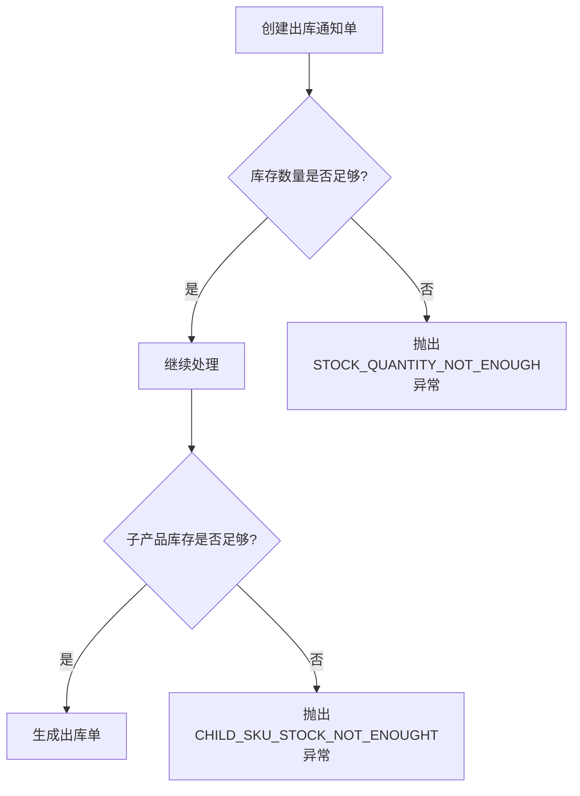
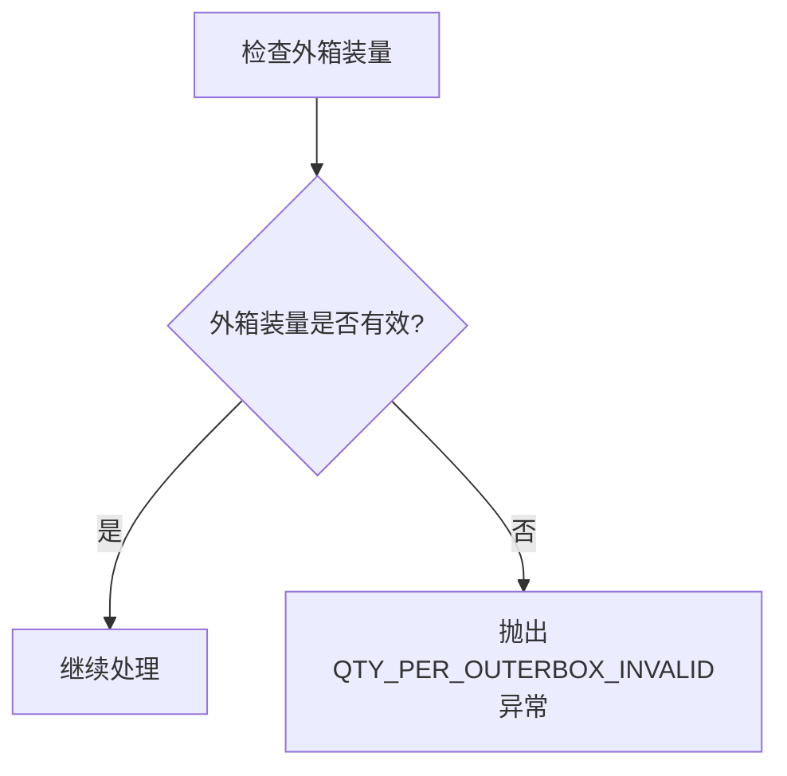
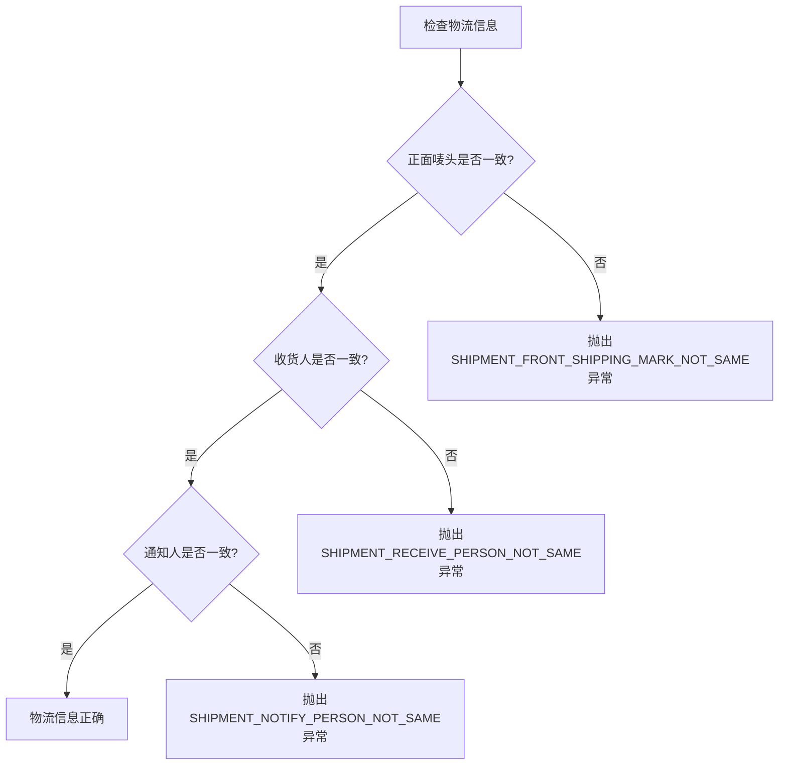
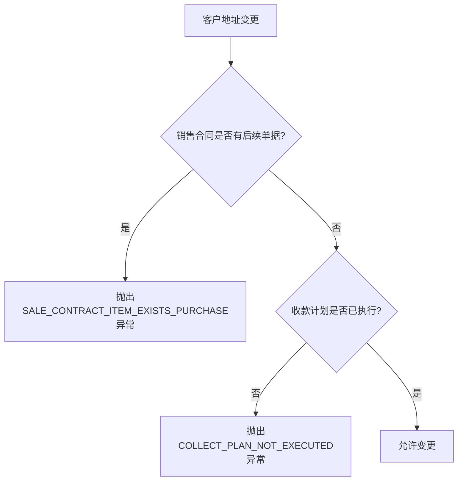
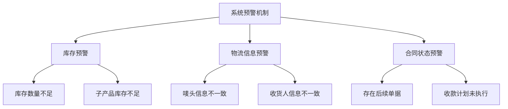
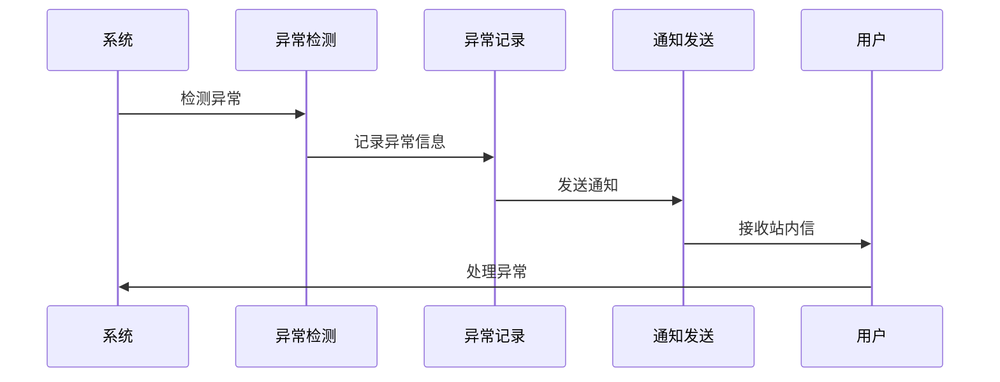

# 出库异常处理

<cite>
**本文档引用的文件**   
- [ErrorCodeConstants.java](file://eplus-module-dms/eplus-module-dms-api/src/main/java/com/syj/eplus/module/dms/enums/ErrorCodeConstants.java)
- [ErrorCodeConstants.java](file://eplus-module-wms/eplus-module-wms-api/src/main/java/com/syj/eplus/module/wms/enums/ErrorCodeConstants.java)
- [ErrorCodeConstants.java](file://eplus-module-sms/eplus-module-sms-api/src/main/java/com/syj/eplus/module/sms/enums/ErrorCodeConstants.java)
- [StockNoticeServiceImpl.java](file://eplus-module-wms/eplus-module-wms-biz/src/main/java/com/syj/eplus/module/wms/service/stocknotice/StockNoticeServiceImpl.java)
- [ShipmentServiceImpl.java](file://eplus-module-dms/eplus-module-dms-biz/src/main/java/com/syj/eplus/module/dms/service/shipment/ShipmentServiceImpl.java)
- [SaleContractServiceImpl.java](file://eplus-module-sms/eplus-module-sms-biz/src/main/java/com/syj/eplus/module/sms/service/salecontract/SaleContractServiceImpl.java)
</cite>

## 目录
1. [引言](#引言)
2. [核心异常场景分析](#核心异常场景分析)
3. [系统预警机制](#系统预警机制)
4. [异常上报与处理流程](#异常上报与处理流程)
5. [最佳实践与解决方案](#最佳实践与解决方案)
6. [结论](#结论)

## 引言
本文档系统化地介绍出库过程中可能遇到的各种异常情况及其处理方案。通过分析系统代码，详细说明了库存不足、包装损坏、物流信息错误、客户地址变更等场景的处理机制。文档涵盖了系统的预警机制、异常上报流程和问题解决路径，并提供了异常处理的最佳实践和常见问题解决方案，帮助用户快速应对出库过程中的突发状况。

## 核心异常场景分析

### 库存不足异常
库存不足是出库过程中最常见的异常之一。系统通过多个模块协同工作来处理此类异常。

当创建出库通知单时，系统会检查库存数量是否足够。如果库存数量不足，系统会抛出 `STOCK_QUANTITY_NOT_ENOUGH` 异常（错误码：1_010_001_031）。此外，系统还会检查子产品库存是否足够，如果子产品库存不足，则会抛出 `CHILD_SKU_STOCK_NOT_ENOUGHT` 异常（错误码：1_010_001_039）。

在出库单生成过程中，如果产品出库数量大于出运数量，系统会抛出 `SKU_OUT_QUANTITY_OUT_OF_SHIPPING_QUANTITY` 异常（错误码：1_010_001_033），提示用户联系对应工作人员。

**Diagram sources**
- [ErrorCodeConstants.java](file://eplus-module-dms/eplus-module-dms-api/src/main/java/com/syj/eplus/module/dms/enums/ErrorCodeConstants.java#L71-L96)

**Section sources**
- [ErrorCodeConstants.java](file://eplus-module-dms/eplus-module-dms-api/src/main/java/com/syj/eplus/module/dms/enums/ErrorCodeConstants.java#L71-L96)
- [StockNoticeServiceImpl.java](file://eplus-module-wms/eplus-module-wms-biz/src/main/java/com/syj/eplus/module/wms/service/stocknotice/StockNoticeServiceImpl.java)

### 包装损坏异常
包装损坏异常主要通过外箱装量验证来预防。系统要求外箱装量不能为空或0，否则会抛出 `QTY_PER_OUTERBOX_INVALID` 异常（错误码：1_006_005_003）。

此外，系统还定义了 `CURRENCY_ITEM_OUTERBOX_NUM` 异常（错误码：1_010_001_008），用于处理产品外箱装量为0的情况。这些验证机制确保了包装信息的完整性，防止因包装信息错误导致的物流问题。

**Diagram sources**
- [ErrorCodeConstants.java](file://eplus-module-wms/eplus-module-wms-api/src/main/java/com/syj/eplus/module/wms/enums/ErrorCodeConstants.java#L37)
- [ErrorCodeConstants.java](file://eplus-module-dms/eplus-module-dms-api/src/main/java/com/syj/eplus/module/dms/enums/ErrorCodeConstants.java#L21)

**Section sources**
- [ErrorCodeConstants.java](file://eplus-module-wms/eplus-module-wms-api/src/main/java/com/syj/eplus/module/wms/enums/ErrorCodeConstants.java#L37)
- [ErrorCodeConstants.java](file://eplus-module-dms/eplus-module-dms-api/src/main/java/com/syj/eplus/module/dms/enums/ErrorCodeConstants.java#L21)

### 物流信息错误
物流信息错误包括进仓日期、提单号、唛头等信息的错误。系统通过多个字段验证来确保物流信息的准确性。

当出运明细的正面唛头不一致时，系统会抛出 `SHIPMENT_FRONT_SHIPPING_MARK_NOT_SAME` 异常（错误码：1_010_001_040）。同样，如果收货人或通知人信息不一致，系统会分别抛出 `SHIPMENT_RECEIVE_PERSON_NOT_SAME`（错误码：1_010_001_041）和 `SHIPMENT_NOTIFY_PERSON_NOT_SAME`（错误码：1_010_001_042）异常。

**Diagram sources**
- [ErrorCodeConstants.java](file://eplus-module-dms/eplus-module-dms-api/src/main/java/com/syj/eplus/module/dms/enums/ErrorCodeConstants.java#L97-L99)

**Section sources**
- [ErrorCodeConstants.java](file://eplus-module-dms/eplus-module-dms-api/src/main/java/com/syj/eplus/module/dms/enums/ErrorCodeConstants.java#L97-L99)

### 客户地址变更
客户地址变更主要通过销售合同和出运单的关联来处理。当销售合同的客户信息发生变化时，系统会检查相关出运单的状态。

如果销售合同已经存在后续单据，系统会抛出 `SALE_CONTRACT_ITEM_EXISTS_PURCHASE` 异常（错误码：1_010_001_034），提示用户不可删除。此外，系统还会检查销售合同的收款计划是否已执行，如果未执行则不允许下推采购计划，抛出 `COLLECT_PLAN_NOT_EXECUTED` 异常（错误码：1_011_001_020）。

**Diagram sources**
- [ErrorCodeConstants.java](file://eplus-module-dms/eplus-module-dms-api/src/main/java/com/syj/eplus/module/dms/enums/ErrorCodeConstants.java#L91)
- [ErrorCodeConstants.java](file://eplus-module-sms/eplus-module-sms-api/src/main/java/com/syj/eplus/module/sms/enums/ErrorCodeConstants.java#L93)

**Section sources**
- [ErrorCodeConstants.java](file://eplus-module-dms/eplus-module-dms-api/src/main/java/com/syj/eplus/module/dms/enums/ErrorCodeConstants.java#L91)
- [ErrorCodeConstants.java](file://eplus-module-sms/eplus-module-sms-api/src/main/java/com/syj/eplus/module/sms/enums/ErrorCodeConstants.java#L93)

## 系统预警机制
系统通过多层次的预警机制来预防出库异常的发生。预警机制主要包括库存预警、物流信息预警和合同状态预警。

库存预警通过实时监控库存数量，当库存低于安全库存时触发预警。物流信息预警通过验证物流信息的完整性和一致性，确保物流信息的准确性。合同状态预警通过检查销售合同的状态和关联单据，防止因合同状态异常导致的出库问题。

**Diagram sources**
- [ErrorCodeConstants.java](file://eplus-module-dms/eplus-module-dms-api/src/main/java/com/syj/eplus/module/dms/enums/ErrorCodeConstants.java)
- [ErrorCodeConstants.java](file://eplus-module-wms/eplus-module-wms-api/src/main/java/com/syj/eplus/module/wms/enums/ErrorCodeConstants.java)

## 异常上报与处理流程
当系统检测到异常时，会通过站内信通知相关人员。系统在 `system_notify_message` 表中添加了业务关联字段，支持点击通知跳转到对应业务页面。

异常上报流程包括异常检测、异常记录、通知发送和问题处理四个步骤。系统会记录异常的详细信息，包括异常时间、异常名、异常发生的类全名、方法名和行号等。

**Diagram sources**
- [V1_0_0_595__站内信增加业务字段.sql](file://eplus-flyway/src/main/resources/db/migration/common/V1_0_0_595__站内信增加业务字段.sql)
- [BpmMessageServiceImpl.java](file://yudao-module-bpm/yudao-module-bpm-biz/src/main/java/cn/iocoder/yudao/module/bpm/service/message/BpmMessageServiceImpl.java)

## 最佳实践与解决方案
### 库存管理最佳实践
1. 定期盘点库存，确保库存数据的准确性
2. 设置安全库存预警，及时补充库存
3. 建立库存锁定机制，防止超卖
4. 实施先进先出（FIFO）原则，减少库存积压

### 物流信息管理最佳实践
1. 建立标准化的物流信息模板
2. 实施物流信息双重验证机制
3. 定期更新物流合作伙伴信息
4. 建立物流异常应急预案

### 合同管理最佳实践
1. 建立合同全生命周期管理机制
2. 实施合同变更审批流程
3. 定期审查合同执行情况
4. 建立合同风险预警机制

## 结论
本文档详细介绍了出库过程中可能遇到的各种异常情况及其处理方案。通过分析系统代码，我们了解了库存不足、包装损坏、物流信息错误、客户地址变更等场景的处理机制。系统通过多层次的预警机制和完善的异常上报流程，确保了出库过程的顺利进行。建议用户遵循文档中提供的最佳实践，建立完善的异常处理机制，提高出库效率和准确性。