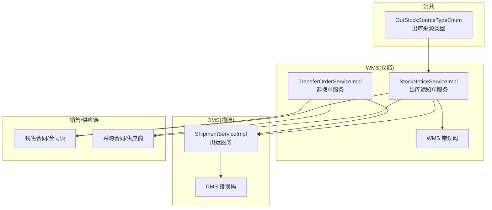
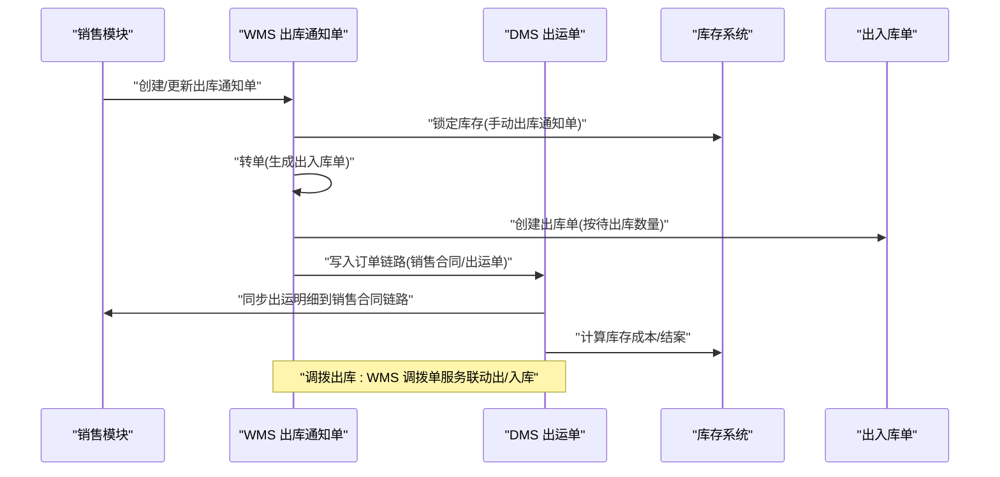
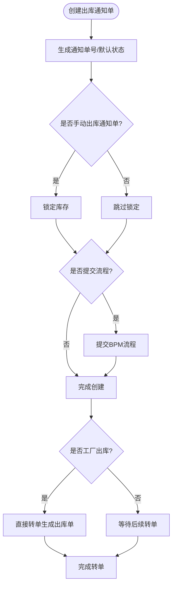
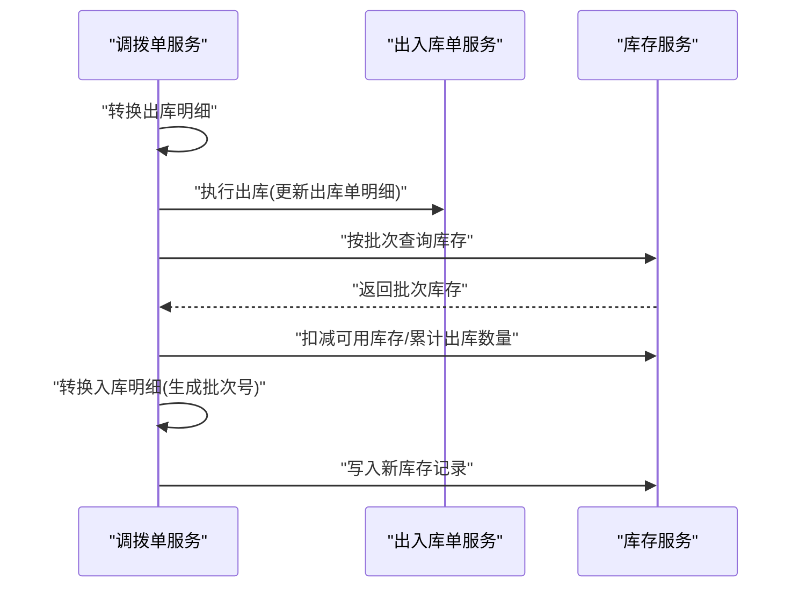
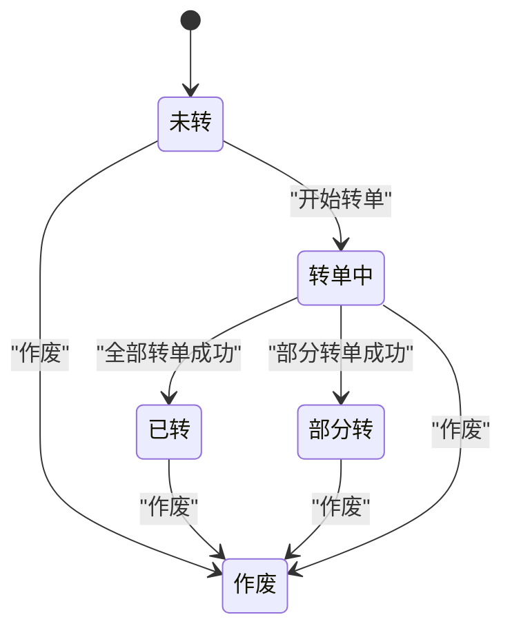
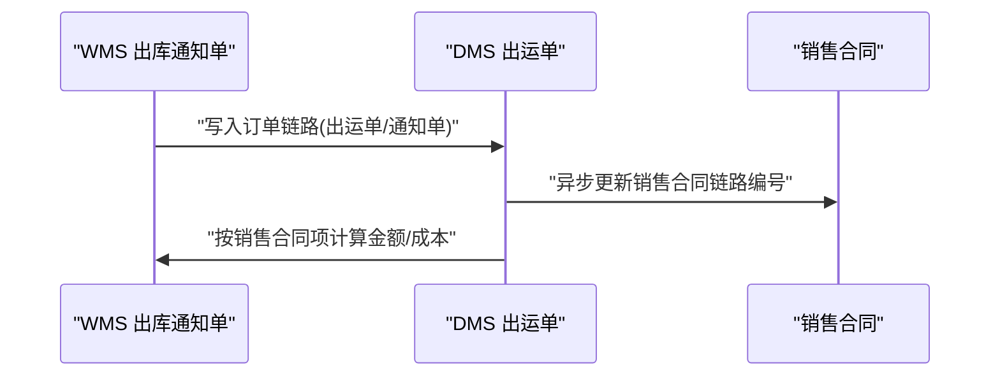
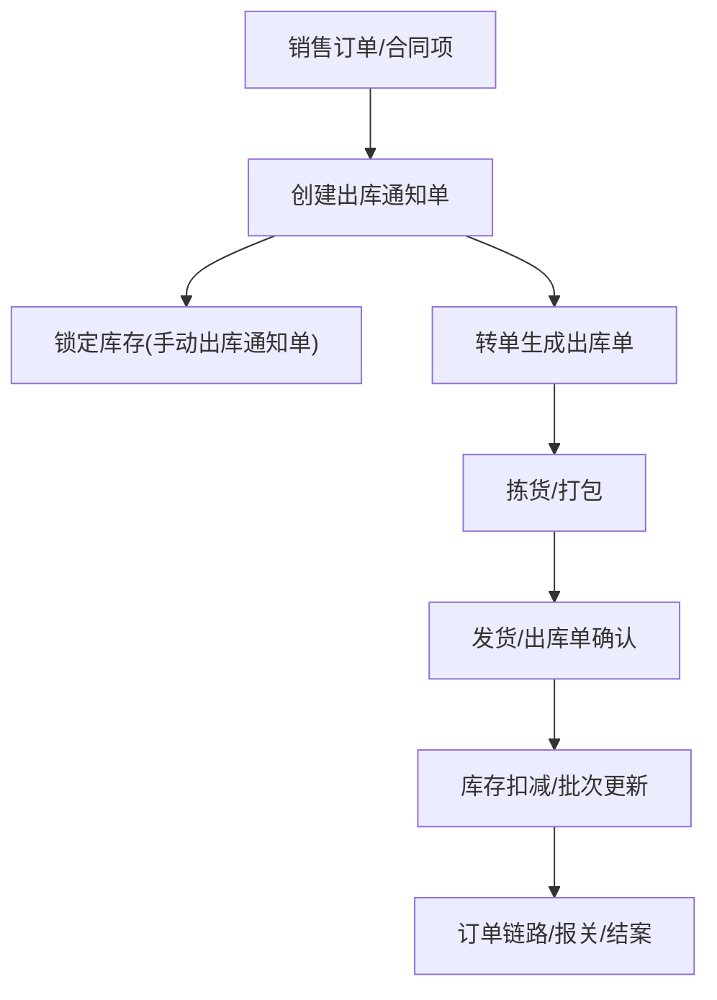
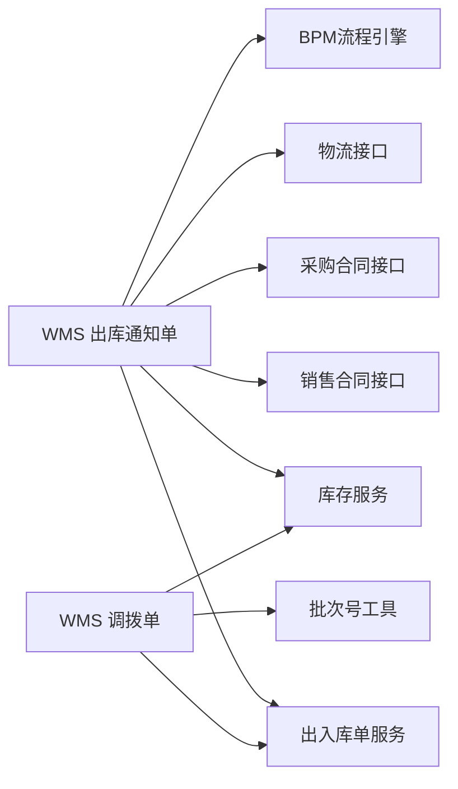

# 出库管理

<cite>
**本文引用的文件**
- [StockNoticeServiceImpl.java](file://eplus-module-wms/eplus-module-wms-biz/src/main/java/com/syj/eplus/module/wms/service/stockNotice/StockNoticeServiceImpl.java)
- [TransferOrderServiceImpl.java](file://eplus-module-wms/eplus-module-wms-biz/src/main/java/com/syj/eplus/module/wms/service/transferorder/TransferOrderServiceImpl.java)
- [StockNoticeSaveReqDTO.java](file://eplus-module-wms/eplus-module-wms-api/src/main/java/com/syj/eplus/module/wms/api/stockNotice/dto/StockNoticeSaveReqDTO.java)
- [StockNoticeItemDTO.java](file://eplus-module-wms/eplus-module-wms-api/src/main/java/com/syj/eplus/module/wms/api/stockNotice/dto/StockNoticeItemDTO.java)
- [NoticeStatusEnum.java](file://eplus-module-wms/eplus-module-wms-api/src/main/java/com/syj/eplus/module/wms/enums/NoticeStatusEnum.java)
- [StockStatusEnum.java](file://eplus-module-wms/eplus-module-wms-api/src/main/java/com/syj/eplus/module/wms/enums/StockStatusEnum.java)
- [OutStockSourceTypeEnum.java](file://eplus-framework/eplus-common/src/main/java/com/syj/eplus/framework/common/enums/OutStockSourceTypeEnum.java)
- [ShipmentServiceImpl.java](file://eplus-module-dms/eplus-module-dms-biz/src/main/java/com/syj/eplus/module/dms/service/shipment/ShipmentServiceImpl.java)
- [ContainerMidVO.java](file://eplus-framework/eplus-common/src/main/java/com/syj/eplus/framework/common/entity/ContainerMidVO.java)
- [ErrorCodeConstants.java(WMS)](file://eplus-module-wms/eplus-module-wms-api/src/main/java/com/syj/eplus/module/wms/enums/ErrorCodeConstants.java)
- [ErrorCodeConstants.java(DMS)](file://eplus-module-dms/eplus-module-dms-api/src/main/java/com/syj/eplus/module/dms/enums/ErrorCodeConstants.java)
- [StockNoticeDO.java](file://eplus-module-wms/eplus-module-wms-biz/src/main/java/com/syj/eplus/module/wms/dal/dataobject/stockNotice/StockNoticeDO.java)
- [R__菜单相关.sql](file://eplus-flyway/src/main/resources/db/migration/common/R__菜单相关.sql)
- [V1_0_0_063__出库通知单增加拉柜相关字段.java](file://eplus-flyway/src/main/java/db/migration/common/V1_0_0_063__出库通知单增加拉柜相关字段.java)
</cite>

## 目录
1. [简介](#简介)
2. [项目结构](#项目结构)
3. [核心组件](#核心组件)
4. [架构总览](#架构总览)
5. [详细组件分析](#详细组件分析)
6. [依赖关系分析](#依赖关系分析)
7. [性能考量](#性能考量)
8. [故障排查指南](#故障排查指南)
9. [结论](#结论)
10. [附录](#附录)

## 简介
本文件面向“出库管理”业务，围绕销售出库、调拨出库、样品出库等场景，系统化梳理出库通知单的创建、拣货、打包、发货全流程，明确出库单状态机（未转、已转、作废、部分转、转单中）的转换规则，阐述与销售模块、物流管理的集成关系，并给出异常处理机制与流程图，帮助读者快速理解并落地实施。

## 项目结构
出库管理主要由以下模块协同：
- WMS（仓储管理）：负责出库通知单、出入库单、库存锁定与扣减、调拨单等核心能力
- DMS（物流管理）：负责出运单、出运明细、与销售合同链路对接
- SCM/SMS（供应链/销售）：提供销售合同、采购合同、供应商等基础数据
- 公共模块：提供通用错误码、枚举、工具类等

图表来源
- [StockNoticeServiceImpl.java](file://eplus-module-wms/eplus-module-wms-biz/src/main/java/com/syj/eplus/module/wms/service/stockNotice/StockNoticeServiceImpl.java#L180-L256)
- [TransferOrderServiceImpl.java](file://eplus-module-wms/eplus-module-wms-biz/src/main/java/com/syj/eplus/module/wms/service/transferorder/TransferOrderServiceImpl.java#L101-L178)
- [ShipmentServiceImpl.java](file://eplus-module-dms/eplus-module-dms-biz/src/main/java/com/syj/eplus/module/dms/service/shipment/ShipmentServiceImpl.java#L422-L454)
- [OutStockSourceTypeEnum.java](file://eplus-framework/eplus-common/src/main/java/com/syj/eplus/framework/common/enums/OutStockSourceTypeEnum.java#L1-L17)
- [ErrorCodeConstants.java(WMS)](file://eplus-module-wms/eplus-module-wms-api/src/main/java/com/syj/eplus/module/wms/enums/ErrorCodeConstants.java#L58-L98)
- [ErrorCodeConstants.java(DMS)](file://eplus-module-dms/eplus-module-dms-api/src/main/java/com/syj/eplus/module/dms/enums/ErrorCodeConstants.java#L69-L111)

章节来源
- [StockNoticeServiceImpl.java](file://eplus-module-wms/eplus-module-wms-biz/src/main/java/com/syj/eplus/module/wms/service/stockNotice/StockNoticeServiceImpl.java#L180-L256)
- [TransferOrderServiceImpl.java](file://eplus-module-wms/eplus-module-wms-biz/src/main/java/com/syj/eplus/module/wms/service/transferorder/TransferOrderServiceImpl.java#L101-L178)
- [ShipmentServiceImpl.java](file://eplus-module-dms/eplus-module-dms-biz/src/main/java/com/syj/eplus/module/dms/service/shipment/ShipmentServiceImpl.java#L422-L454)

## 核心组件
- 出库通知单服务：负责创建、更新、转单、锁定库存、生成出入库单、写入订单链路、导出报关等
- 调拨单服务：负责调拨出库与入库的联动处理，校验库存、扣减可用库存、更新批次库存
- 物流出运服务：负责出运明细与销售合同链路同步、成本计算、结案等
- 错误码与枚举：统一错误码、状态枚举、出库来源类型

章节来源
- [StockNoticeServiceImpl.java](file://eplus-module-wms/eplus-module-wms-biz/src/main/java/com/syj/eplus/module/wms/service/stockNotice/StockNoticeServiceImpl.java#L180-L256)
- [TransferOrderServiceImpl.java](file://eplus-module-wms/eplus-module-wms-biz/src/main/java/com/syj/eplus/module/wms/service/transferorder/TransferOrderServiceImpl.java#L101-L178)
- [ShipmentServiceImpl.java](file://eplus-module-dms/eplus-module-dms-biz/src/main/java/com/syj/eplus/module/dms/service/shipment/ShipmentServiceImpl.java#L422-L454)
- [ErrorCodeConstants.java(WMS)](file://eplus-module-wms/eplus-module-wms-api/src/main/java/com/syj/eplus/module/wms/enums/ErrorCodeConstants.java#L58-L98)
- [ErrorCodeConstants.java(DMS)](file://eplus-module-dms/eplus-module-dms-api/src/main/java/com/syj/eplus/module/dms/enums/ErrorCodeConstants.java#L69-L111)

## 架构总览
下图展示了从销售订单到库存减少的完整数据流，涵盖销售出库、调拨出库、样品出库的关键路径与集成点。

图表来源
- [StockNoticeServiceImpl.java](file://eplus-module-wms/eplus-module-wms-biz/src/main/java/com/syj/eplus/module/wms/service/stockNotice/StockNoticeServiceImpl.java#L180-L256)
- [StockNoticeServiceImpl.java](file://eplus-module-wms/eplus-module-wms-biz/src/main/java/com/syj/eplus/module/wms/service/stockNotice/StockNoticeServiceImpl.java#L530-L635)
- [TransferOrderServiceImpl.java](file://eplus-module-wms/eplus-module-wms-biz/src/main/java/com/syj/eplus/module/wms/service/transferorder/TransferOrderServiceImpl.java#L101-L178)
- [ShipmentServiceImpl.java](file://eplus-module-dms/eplus-module-dms-biz/src/main/java/com/syj/eplus/module/dms/service/shipment/ShipmentServiceImpl.java#L422-L454)

## 详细组件分析

### 出库通知单服务（销售出库、拉柜出库）
- 创建流程
  - 自动生成通知单号、设置默认状态（非工厂出库默认未转）、打印标志、通知时间
  - 写入链路编号、销售/采购合同编号列表、出运单号/发票号/出运方式等
  - 手动出库通知单会锁定库存，避免并发超发
  - 若为工厂出库标志，则直接转单生成出库单
  - 支持提交流程（BPM），并发送站内信给采购员/跟单员
- 转单流程
  - 将“待出库数量”转换为“出库单明细”，按外箱装量向上取整计算箱数
  - 设置来源类型（拉柜通知单或出库通知单），并更新通知单状态为“转单中”
  - 若全部明细都可出库则置为“已转”，否则为“部分转”
- 订单链路
  - 写入订单链路，便于销售合同/出运单/通知单之间的追溯
- 报关导出
  - 按报表模板导出拉柜通知单数据，包含体积/重量/外箱尺寸等

图表来源
- [StockNoticeServiceImpl.java](file://eplus-module-wms/eplus-module-wms-biz/src/main/java/com/syj/eplus/module/wms/service/stockNotice/StockNoticeServiceImpl.java#L180-L256)
- [StockNoticeServiceImpl.java](file://eplus-module-wms/eplus-module-wms-biz/src/main/java/com/syj/eplus/module/wms/service/stockNotice/StockNoticeServiceImpl.java#L530-L635)

章节来源
- [StockNoticeServiceImpl.java](file://eplus-module-wms/eplus-module-wms-biz/src/main/java/com/syj/eplus/module/wms/service/stockNotice/StockNoticeServiceImpl.java#L180-L256)
- [StockNoticeServiceImpl.java](file://eplus-module-wms/eplus-module-wms-biz/src/main/java/com/syj/eplus/module/wms/service/stockNotice/StockNoticeServiceImpl.java#L258-L282)
- [StockNoticeServiceImpl.java](file://eplus-module-wms/eplus-module-wms-biz/src/main/java/com/syj/eplus/module/wms/service/stockNotice/StockNoticeServiceImpl.java#L530-L635)
- [StockNoticeDO.java](file://eplus-module-wms/eplus-module-wms-biz/src/main/java/com/syj/eplus/module/wms/dal/dataobject/stockNotice/StockNoticeDO.java#L97-L165)

### 调拨出库服务（调拨出库）
- 出库处理
  - 将调拨明细转换为出库单明细，调用出入库单服务执行出库
  - 根据批次号查询库存，校验可用库存是否充足
  - 扣减可用库存、累计出库数量，批量更新库存
  - 插入出入库单明细
- 入库处理
  - 将调拨明细转换为入库单明细，生成批次号并写入库存表
  - 初始化入库数量、可用数量、销售合同号等

图表来源
- [TransferOrderServiceImpl.java](file://eplus-module-wms/eplus-module-wms-biz/src/main/java/com/syj/eplus/module/wms/service/transferorder/TransferOrderServiceImpl.java#L101-L178)

章节来源
- [TransferOrderServiceImpl.java](file://eplus-module-wms/eplus-module-wms-biz/src/main/java/com/syj/eplus/module/wms/service/transferorder/TransferOrderServiceImpl.java#L101-L178)

### 样品出库（样品出库）
- 样品出库通常通过“手动出库通知单”实现，流程与销售出库一致
- 在创建时选择“手动出库通知单”，系统将锁定对应批次库存，防止超发
- 转单后生成出库单，完成拣货、打包、发货流程

章节来源
- [StockNoticeServiceImpl.java](file://eplus-module-wms/eplus-module-wms-biz/src/main/java/com/syj/eplus/module/wms/service/stockNotice/StockNoticeServiceImpl.java#L258-L282)
- [StockNoticeSaveReqDTO.java](file://eplus-module-wms/eplus-module-wms-api/src/main/java/com/syj/eplus/module/wms/api/stockNotice/dto/StockNoticeSaveReqDTO.java#L73-L129)

### 出库单状态机
- 状态定义
  - 未转：初始状态，尚未生成出入库单
  - 已转：全部待出库数量已转为出库单
  - 作废：通知单作废
  - 部分转：部分待出库数量已转为出库单
  - 转单中：正在生成出入库单
- 状态转换规则
  - 未转 → 转单中：开始转单
  - 转单中 → 已转：全部待出库数量成功转单
  - 转单中 → 部分转：部分待出库数量成功转单
  - 未转 → 作废：取消通知单
  - 已转/部分转/转单中 → 作废：作废通知单

图表来源
- [NoticeStatusEnum.java](file://eplus-module-wms/eplus-module-wms-api/src/main/java/com/syj/eplus/module/wms/enums/NoticeStatusEnum.java#L1-L27)

章节来源
- [NoticeStatusEnum.java](file://eplus-module-wms/eplus-module-wms-api/src/main/java/com/syj/eplus/module/wms/enums/NoticeStatusEnum.java#L1-L27)
- [StockNoticeServiceImpl.java](file://eplus-module-wms/eplus-module-wms-biz/src/main/java/com/syj/eplus/module/wms/service/stockNotice/StockNoticeServiceImpl.java#L530-L635)

### 与销售模块、物流管理的集成
- 销售模块
  - 出库通知单写入销售合同编号列表，用于后续链路追踪
  - 拉柜通知单场景下，按销售合同项单价与已出运数量计算金额，确保出运金额合规
- 物流管理
  - 出运明细与销售合同链路同步，支持异步更新销售合同链路编号
  - 出运单明细支持成本计算（按销售合同维度）

图表来源
- [StockNoticeServiceImpl.java](file://eplus-module-wms/eplus-module-wms-biz/src/main/java/com/syj/eplus/module/wms/service/stockNotice/StockNoticeServiceImpl.java#L284-L331)
- [ShipmentServiceImpl.java](file://eplus-module-dms/eplus-module-dms-biz/src/main/java/com/syj/eplus/module/dms/service/shipment/ShipmentServiceImpl.java#L422-L454)

章节来源
- [StockNoticeServiceImpl.java](file://eplus-module-wms/eplus-module-wms-biz/src/main/java/com/syj/eplus/module/wms/service/stockNotice/StockNoticeServiceImpl.java#L284-L331)
- [ShipmentServiceImpl.java](file://eplus-module-dms/eplus-module-dms-biz/src/main/java/com/syj/eplus/module/dms/service/shipment/ShipmentServiceImpl.java#L422-L454)

### 出库业务流程图（销售订单到库存减少）

图表来源
- [StockNoticeServiceImpl.java](file://eplus-module-wms/eplus-module-wms-biz/src/main/java/com/syj/eplus/module/wms/service/stockNotice/StockNoticeServiceImpl.java#L180-L256)
- [StockNoticeServiceImpl.java](file://eplus-module-wms/eplus-module-wms-biz/src/main/java/com/syj/eplus/module/wms/service/stockNotice/StockNoticeServiceImpl.java#L530-L635)
- [TransferOrderServiceImpl.java](file://eplus-module-wms/eplus-module-wms-biz/src/main/java/com/syj/eplus/module/wms/service/transferorder/TransferOrderServiceImpl.java#L101-L178)

## 依赖关系分析
- 组件耦合
  - 出库通知单服务依赖出入库单服务、库存服务、销售/采购接口、物流接口、BPM流程引擎
  - 调拨单服务依赖出入库单服务、库存服务、批次号工具
- 外部依赖
  - 销售合同/合同项、采购合同/供应商、出运单/出运明细
- 可能的循环依赖
  - 当前以服务层为主，接口清晰，未见明显循环依赖

图表来源
- [StockNoticeServiceImpl.java](file://eplus-module-wms/eplus-module-wms-biz/src/main/java/com/syj/eplus/module/wms/service/stockNotice/StockNoticeServiceImpl.java#L180-L256)
- [TransferOrderServiceImpl.java](file://eplus-module-wms/eplus-module-wms-biz/src/main/java/com/syj/eplus/module/wms/service/transferorder/TransferOrderServiceImpl.java#L101-L178)

章节来源
- [StockNoticeServiceImpl.java](file://eplus-module-wms/eplus-module-wms-biz/src/main/java/com/syj/eplus/module/wms/service/stockNotice/StockNoticeServiceImpl.java#L180-L256)
- [TransferOrderServiceImpl.java](file://eplus-module-wms/eplus-module-wms-biz/src/main/java/com/syj/eplus/module/wms/service/transferorder/TransferOrderServiceImpl.java#L101-L178)

## 性能考量
- 批量操作
  - 锁定库存、插入出入库单明细、更新库存均采用批量处理，降低数据库往返
- 状态与链路
  - 通过状态机与订单链路减少重复计算与冗余存储
- 并发控制
  - 通过库存锁定与BPM流程审批，避免并发超发

[本节为通用建议，无需列出具体文件来源]

## 故障排查指南
- 常见异常与定位
  - 库存不足：调拨出库时按批次查询库存，若可用库存不足抛出异常
  - 通知单状态冲突：转单中状态不可再次触发转单
  - 锁库不足：锁定数量超过可用数量
  - 销售合同项缺失：拉柜通知单场景下，销售合同项不存在或单价为空
- 关键错误码
  - WMS：库存不存在/不足、锁库不存在/不足、调拨单相关错误
  - DMS：出运数量为0、外箱装量为0、采购拆分标记等
- 处理建议
  - 库存不足：检查批次库存与锁定情况，必要时释放部分锁定或调整出库数量
  - 包装损坏：在拣货/打包环节进行质量拦截，生成异常单据并退回重做
  - 出运金额异常：核对销售合同项单价与已出运数量，确保金额计算正确

章节来源
- [ErrorCodeConstants.java(WMS)](file://eplus-module-wms/eplus-module-wms-api/src/main/java/com/syj/eplus/module/wms/enums/ErrorCodeConstants.java#L58-L98)
- [ErrorCodeConstants.java(DMS)](file://eplus-module-dms/eplus-module-dms-api/src/main/java/com/syj/eplus/module/dms/enums/ErrorCodeConstants.java#L69-L111)
- [TransferOrderServiceImpl.java](file://eplus-module-wms/eplus-module-wms-biz/src/main/java/com/syj/eplus/module/wms/service/transferorder/TransferOrderServiceImpl.java#L144-L178)
- [StockNoticeServiceImpl.java](file://eplus-module-wms/eplus-module-wms-biz/src/main/java/com/syj/eplus/module/wms/service/stockNotice/StockNoticeServiceImpl.java#L530-L635)

## 结论
本文基于现有代码梳理了出库管理的完整流程与关键实现，明确了销售出库、调拨出库、样品出库的差异与共性，给出了状态机与数据流图，并总结了与销售、物流模块的集成点与异常处理策略。建议在实际部署中结合业务场景细化拣货/打包/发货环节的作业规范与质量控制。

[本节为总结，无需列出具体文件来源]

## 附录

### 出库来源类型
- 盘点单、拉柜通知单、出库通知单

章节来源
- [OutStockSourceTypeEnum.java](file://eplus-framework/eplus-common/src/main/java/com/syj/eplus/framework/common/enums/OutStockSourceTypeEnum.java#L1-L17)

### 菜单与权限
- 出库通知单导出、出库单查询/创建/更新/删除、导出等菜单与权限配置

章节来源
- [R__菜单相关.sql](file://eplus-flyway/src/main/resources/db/migration/common/R__菜单相关.sql#L490-L503)

### 拉柜通知单字段扩展
- 增加进仓日期、提单号、是否拉柜通知单字段

章节来源
- [V1_0_0_063__出库通知单增加拉柜相关字段.java](file://eplus-flyway/src/main/java/db/migration/common/V1_0_0_063__出库通知单增加拉柜相关字段.java#L1-L17)