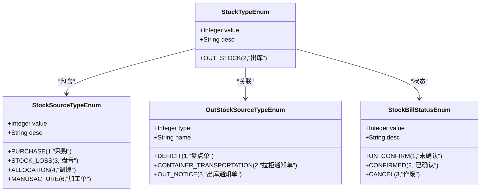
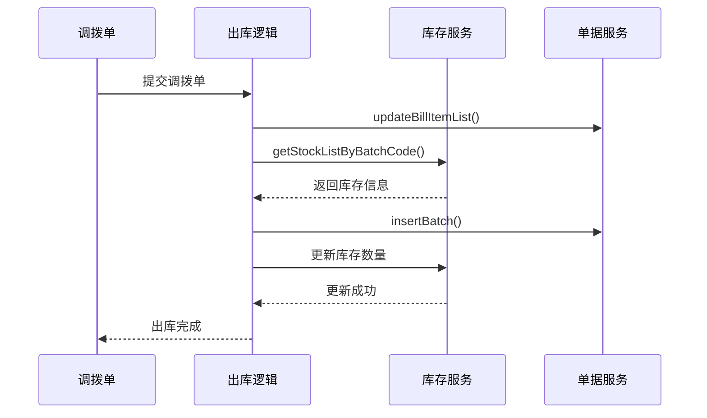
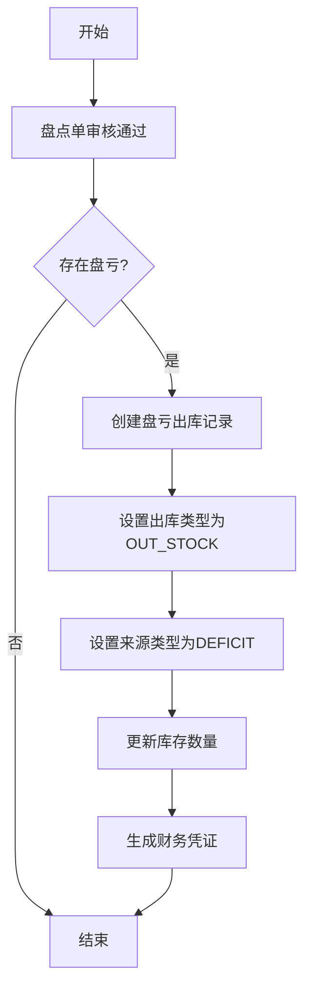

# 出库类型

<cite>
**本文档引用的文件**  
- [OutStockSourceTypeEnum.java](file://eplus-framework/eplus-common/src/main/java/com/syj/eplus/framework/common/enums/OutStockSourceTypeEnum.java)
- [StockTypeEnum.java](file://eplus-module-wms/eplus-module-wms-api/src/main/java/com/syj/eplus/module/wms/enums/StockTypeEnum.java)
- [StockSourceTypeEnum.java](file://eplus-module-wms/eplus-module-wms-api/src/main/java/com/syj/eplus/module/wms/enums/StockSourceTypeEnum.java)
- [StockBillStatusEnum.java](file://eplus-module-wms/eplus-module-wms-api/src/main/java/com/syj/eplus/module/wms/enums/StockBillStatusEnum.java)
- [TransferOrderServiceImpl.java](file://eplus-module-wms/eplus-module-wms-biz/src/main/java/com/syj/eplus/module/wms/service/transferorder/TransferOrderServiceImpl.java)
- [StocktakeAuditResultListener.java](file://eplus-module-wms/eplus-module-wms-biz/src/main/java/com/syj/eplus/module/wms/listener/stocktake/StocktakeAuditResultListener.java)
- [V1_0_0_002__Eplus初始化.sql](file://eplus-flyway/src/main/resources/db/migration/common/V1_0_0_002__Eplus初始化.sql)
</cite>

## 目录
1. [引言](#引言)
2. [出库类型概述](#出库类型概述)
3. [销售出库](#销售出库)
4. [调拨出库](#调拨出库)
5. [样品出库](#样品出库)
6. [报废出库](#报废出库)
7. [盘点出库](#盘点出库)
8. [出库通知单出库](#出库通知单出库)
9. [各出库类型对比分析](#各出库类型对比分析)
10. [库存核算与财务结算差异](#库存核算与财务结算差异)
11. [结论](#结论)

## 引言

本文档详细介绍了系统支持的各种出库类型，包括销售出库、调拨出库、样品出库、报废出库等。针对每种出库类型，说明其业务场景、创建方式、审批流程和特殊处理规则。同时，解释不同类型出库在库存核算、财务结算方面的差异，并提供各出库类型的业务流程对比表，帮助用户理解不同场景下的操作差异。

**本文档引用的文件**  
- [OutStockSourceTypeEnum.java](file://eplus-framework/eplus-common/src/main/java/com/syj/eplus/framework/common/enums/OutStockSourceTypeEnum.java)
- [StockTypeEnum.java](file://eplus-module-wms/eplus-module-wms-api/src/main/java/com/syj/eplus/module/wms/enums/StockTypeEnum.java)
- [StockSourceTypeEnum.java](file://eplus-module-wms/eplus-module-wms-api/src/main/java/com/syj/eplus/module/wms/enums/StockSourceTypeEnum.java)

## 出库类型概述

系统中的出库操作主要通过`StockTypeEnum`枚举定义，其中`OUT_STOCK(2,"出库")`表示出库类型。出库的来源单据类型由`StockSourceTypeEnum`枚举定义，包括采购、盘亏、调拨、组套件、加工单等多种类型。此外，`OutStockSourceTypeEnum`枚举定义了出库的特定来源，如盘点单、拉柜通知单和出库通知单。

出库操作在系统中涉及多个模块，主要包括仓储管理模块（WMS）、销售管理模块（SMS）和供应链管理模块（SCM）。不同类型的出库在业务场景、审批流程和财务处理上存在差异。

**图来源**  
- [StockTypeEnum.java](file://eplus-module-wms/eplus-module-wms-api/src/main/java/com/syj/eplus/module/wms/enums/StockTypeEnum.java)
- [StockSourceTypeEnum.java](file://eplus-module-wms/eplus-module-wms-api/src/main/java/com/syj/eplus/module/wms/enums/StockSourceTypeEnum.java)
- [OutStockSourceTypeEnum.java](file://eplus-framework/eplus-common/src/main/java/com/syj/eplus/framework/common/enums/OutStockSourceTypeEnum.java)
- [StockBillStatusEnum.java](file://eplus-module-wms/eplus-module-wms-api/src/main/java/com/syj/eplus/module/wms/enums/StockBillStatusEnum.java)

**本节来源**  
- [StockTypeEnum.java](file://eplus-module-wms/eplus-module-wms-api/src/main/java/com/syj/eplus/module/wms/enums/StockTypeEnum.java)
- [StockSourceTypeEnum.java](file://eplus-module-wms/eplus-module-wms-api/src/main/java/com/syj/eplus/module/wms/enums/StockSourceTypeEnum.java)
- [OutStockSourceTypeEnum.java](file://eplus-framework/eplus-common/src/main/java/com/syj/eplus/framework/common/enums/OutStockSourceTypeEnum.java)

## 销售出库

销售出库是指根据销售合同或订单，将商品从仓库发出给客户的出库操作。这种出库类型通常与销售管理模块紧密关联，是企业收入实现的重要环节。

在系统中，销售出库的创建通常由销售合同或出运计划触发。当销售合同进入出库阶段时，系统会生成相应的出库单据。销售出库需要经过销售部门、仓储部门的审核确认，确保出库商品与合同要求一致。

销售出库在库存核算上会减少相应商品的可用库存数量，并在财务结算中确认销售收入。系统会根据销售合同中的价格条款计算收入金额，并生成相应的财务凭证。

**本节来源**  
- [V1_0_0_002__Eplus初始化.sql](file://eplus-flyway/src/main/resources/db/migration/common/V1_0_0_002__Eplus初始化.sql)
- [StockNoticeItemDTO.java](file://eplus-module-wms/eplus-module-wms-api/src/main/java/com/syj/eplus/module/wms/api/stockNotice/dto/StockNoticeItemDTO.java)

## 调拨出库

调拨出库是指在不同仓库或部门之间转移商品的出库操作。这种出库类型用于优化库存分布、满足不同地点的业务需求。

在系统中，调拨出库由`TransferOrderServiceImpl`类处理。当创建调拨单时，系统会同时处理出库和入库逻辑。调拨出库的来源类型为`StockSourceTypeEnum.ALLOCATION`。

**图来源**  
- [TransferOrderServiceImpl.java](file://eplus-module-wms/eplus-module-wms-biz/src/main/java/com/syj/eplus/module/wms/service/transferorder/TransferOrderServiceImpl.java)

**本节来源**  
- [TransferOrderServiceImpl.java](file://eplus-module-wms/eplus-module-wms-biz/src/main/java/com/syj/eplus/module/wms/service/transferorder/TransferOrderServiceImpl.java)
- [StockSourceTypeEnum.java](file://eplus-module-wms/eplus-module-wms-api/src/main/java/com/syj/eplus/module/wms/enums/StockSourceTypeEnum.java)

## 样品出库

样品出库是指为展示、测试或评估目的而发出商品的出库操作。这种出库类型通常用于市场营销、客户体验或质量检测等场景。

虽然系统中没有明确的"样品出库"枚举值，但可以通过采购合同中的"样品套数"字段来识别此类出库。样品出库可能需要特殊的审批流程，如市场部门或质量部门的批准。

在财务处理上，样品出库通常不产生收入，而是作为营销费用或管理费用处理。系统需要能够区分样品出库和其他类型的出库，以便正确进行成本核算。

**本节来源**  
- [PurchaseContractPageReqVO.java](file://eplus-module-scm/eplus-module-scm-biz/src/main/java/com/syj/eplus/module/scm/controller/admin/purchasecontract/vo/PurchaseContractPageReqVO.java)

## 报废出库

报废出库是指将损坏、过期或无法使用的商品从库存中移除的出库操作。这种出库类型用于管理库存质量，减少无效库存。

系统中通过`StockSourceTypeEnum.STOCK_LOSS`来表示盘亏（可包含报废）的出库类型。报废出库需要经过质量部门的鉴定和相关部门的审批。

在财务处理上，报废出库会导致资产减值，需要进行损失确认。系统应记录报废原因、数量和价值，以便进行成本分析和改进库存管理。

**本节来源**  
- [StockSourceTypeEnum.java](file://eplus-module-wms/eplus-module-wms-api/src/main/java/com/syj/eplus/module/wms/enums/StockSourceTypeEnum.java)
- [ShipmentItem.java](file://eplus-module-dms/eplus-module-dms-biz/src/main/java/com/syj/eplus/module/dms/dal/dataobject/shipmentitem/ShipmentItem.java)

## 盘点出库

盘点出库是指在库存盘点过程中发现实际库存少于账面库存时，进行的盘亏出库操作。这种出库类型用于调整库存账面记录，确保账实相符。

在系统中，盘点出库由`StocktakeAuditResultListener`监听器处理。当盘点单审核通过且存在盘亏情况时，系统会自动生成盘亏出库记录。

**图来源**  
- [StocktakeAuditResultListener.java](file://eplus-module-wms/eplus-module-wms-biz/src/main/java/com/syj/eplus/module/wms/listener/stocktake/StocktakeAuditResultListener.java)

**本节来源**  
- [StocktakeAuditResultListener.java](file://eplus-module-wms/eplus-module-wms-biz/src/main/java/com/syj/eplus/module/wms/listener/stocktake/StocktakeAuditResultListener.java)
- [OutStockSourceTypeEnum.java](file://eplus-framework/eplus-common/src/main/java/com/syj/eplus/framework/common/enums/OutStockSourceTypeEnum.java)

## 出库通知单出库

出库通知单出库是指根据出库通知单进行的出库操作，通常用于提前通知仓库准备出库商品。这种出库类型在物流和供应链管理中较为常见。

在系统中，出库通知单出库的来源类型为`OutStockSourceTypeEnum.OUT_NOTICE`。这种出库方式可以提高出库效率，减少客户等待时间。

出库通知单出库可能与其他出库类型结合使用，如销售出库或调拨出库。系统需要能够将出库通知单与具体的出库操作关联起来，确保出库的准确性和可追溯性。

**本节来源**  
- [OutStockSourceTypeEnum.java](file://eplus-framework/eplus-common/src/main/java/com/syj/eplus/framework/common/enums/OutStockSourceTypeEnum.java)
- [StockNoticeItemDTO.java](file://eplus-module-wms/eplus-module-wms-api/src/main/java/com/syj/eplus/module/wms/api/stockNotice/dto/StockNoticeItemDTO.java)

## 各出库类型对比分析

下表对比了系统中主要出库类型的业务特征：

| 出库类型 | 业务场景 | 创建方式 | 审批流程 | 特殊处理规则 |
|---------|--------|--------|--------|-----------|
| 销售出库 | 客户订单履约 | 销售合同触发 | 销售、仓储部门审核 | 关联客户信息，生成应收账款 |
| 调拨出库 | 仓库间库存转移 | 调拨单创建 | 仓储、物流部门审核 | 同时处理出库和入库 |
| 样品出库 | 市场推广、质量检测 | 采购合同标记 | 市场、质量部门审批 | 不产生收入，计入费用 |
| 报废出库 | 损坏商品处理 | 质量鉴定后创建 | 质量、财务部门审批 | 确认资产损失 |
| 盘点出库 | 账实不符调整 | 盘点结果触发 | 仓储、财务部门审核 | 自动调整库存记录 |
| 出库通知单出库 | 物流准备 | 出库通知单创建 | 仓储部门确认 | 提前准备出库商品 |

**本节来源**  
- [OutStockSourceTypeEnum.java](file://eplus-framework/eplus-common/src/main/java/com/syj/eplus/framework/common/enums/OutStockSourceTypeEnum.java)
- [StockSourceTypeEnum.java](file://eplus-module-wms/eplus-module-wms-api/src/main/java/com/syj/eplus/module/wms/enums/StockSourceTypeEnum.java)
- [TransferOrderServiceImpl.java](file://eplus-module-wms/eplus-module-wms-biz/src/main/java/com/syj/eplus/module/wms/service/transferorder/TransferOrderServiceImpl.java)
- [StocktakeAuditResultListener.java](file://eplus-module-wms/eplus-module-wms-biz/src/main/java/com/syj/eplus/module/wms/listener/stocktake/StocktakeAuditResultListener.java)

## 库存核算与财务结算差异

不同类型出库在库存核算和财务结算方面存在显著差异：

1. **库存核算差异**：
   - 销售出库：减少可用库存，锁定已售商品
   - 调拨出库：源仓库减少库存，目标仓库增加库存
   - 盘点出库：直接调整账面库存数量
   - 报废出库：永久移除库存记录

2. **财务结算差异**：
   - 销售出库：确认销售收入，生成应收账款
   - 调拨出库：通常不涉及财务结算，内部转移
   - 样品出库：计入销售费用或管理费用
   - 报废出库：确认资产减值损失
   - 盘点出库：调整库存价值，可能产生损益

系统通过不同的来源类型和业务规则来处理这些差异，确保库存和财务数据的准确性和一致性。

**本节来源**  
- [StockSourceTypeEnum.java](file://eplus-module-wms/eplus-module-wms-api/src/main/java/com/syj/eplus/module/wms/enums/StockSourceTypeEnum.java)
- [StocktakeAuditResultListener.java](file://eplus-module-wms/eplus-module-wms-biz/src/main/java/com/syj/eplus/module/wms/listener/stocktake/StocktakeAuditResultListener.java)
- [ShipmentServiceImpl.java](file://eplus-module-dms/eplus-module-dms-biz/src/main/java/com/syj/eplus/module/dms/service/shipment/ShipmentServiceImpl.java)

## 结论

本文档详细介绍了系统支持的各种出库类型及其业务特征。通过分析销售出库、调拨出库、样品出库、报废出库、盘点出库和出库通知单出库，我们了解了每种出库类型的业务场景、创建方式、审批流程和特殊处理规则。

关键发现包括：
1. 系统通过`StockSourceTypeEnum`和`OutStockSourceTypeEnum`枚举来区分不同类型的出库
2. 不同出库类型在库存核算和财务结算上有明显差异
3. 出库操作与多个业务模块（WMS、SMS、SCM等）紧密集成
4. 系统支持自动化出库处理，如盘点出库的自动调整

这些信息有助于用户更好地理解和使用系统的出库功能，确保业务操作的准确性和效率。