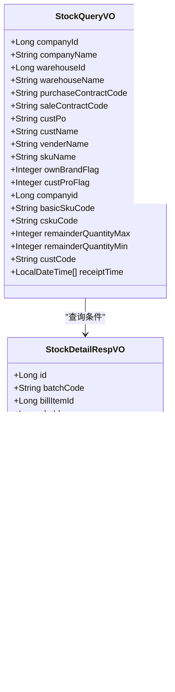

# 库存查询

<cite>
**本文档引用文件**   
- [StockServiceImpl.java](file://eplus-module-wms/eplus-module-wms-biz/src/main/java/com/syj/eplus/module/wms/service/stock/StockServiceImpl.java)
- [IStockApi.java](file://eplus-module-wms/eplus-module-wms-api/src/main/java/com/syj/eplus/module/wms/api/stock/IStockApi.java)
- [StockMapper.java](file://eplus-module-wms/eplus-module-wms-biz/src/main/java/com/syj/eplus/module/wms/dal/mysql/stock/StockMapper.java)
- [StockPageReqVO.java](file://eplus-module-wms/eplus-module-wms-biz/src/main/java/com/syj/eplus/module/wms/controller/admin/stock/vo/StockPageReqVO.java)
- [StockQueryVO.java](file://eplus-module-wms/eplus-module-wms-biz/src/main/java/com/syj/eplus/module/wms/controller/admin/stock/vo/StockQueryVO.java)
- [QueryStockReqVO.java](file://eplus-module-wms/eplus-module-wms-api/src/main/java/com/syj/eplus/module/wms/api/stock/dto/QueryStockReqVO.java)
- [StockDetailRespVO.java](file://eplus-module-wms/eplus-module-wms-api/src/main/java/com/syj/eplus/module/wms/api/stock/dto/StockDetailRespVO.java)
- [StockDTO.java](file://eplus-module-wms/eplus-module-wms-api/src/main/java/com/syj/eplus/module/wms/api/stock/dto/StockDTO.java)
- [StockRespVO.java](file://eplus-module-wms/eplus-module-wms-biz/src/main/java/com/syj/eplus/module/wms/controller/admin/stock/vo/StockRespVO.java)
</cite>

## 目录
1. [简介](#简介)
2. [核心查询接口](#核心查询接口)
3. [查询参数详解](#查询参数详解)
4. [返回结果结构](#返回结果结构)
5. [分页处理机制](#分页处理机制)
6. [查询使用示例](#查询使用示例)
7. [库存汇总视图](#库存汇总视图)
8. [前端调用方式](#前端调用方式)
9. [后端处理逻辑](#后端处理逻辑)
10. [总结](#总结)

## 简介
库存查询功能是仓储管理系统的核心功能之一，提供通过产品、仓库、批次等多维度进行库存明细查询的能力。本系统支持精确查询和模糊查询，能够满足不同场景下的库存查询需求。系统通过WMS模块实现库存管理，提供了丰富的API接口供前端调用。

库存查询功能主要包含以下几个方面：
- 按产品编码、产品名称、仓库位置等条件进行精确和模糊查询
- 支持分页查询，处理大量数据
- 提供库存汇总视图，包括可用库存、锁定库存、待检库存的统计
- 支持通过API接口进行批量查询和条件查询

**Section sources**
- [StockServiceImpl.java](file://eplus-module-wms/eplus-module-wms-biz/src/main/java/com/syj/eplus/module/wms/service/stock/StockServiceImpl.java#L74-106)
- [IStockApi.java](file://eplus-module-wms/eplus-module-wms-api/src/main/java/com/syj/eplus/module/wms/api/stock/IStockApi.java#L15-246)

## 核心查询接口
库存查询功能提供了多个核心接口，支持不同场景下的查询需求。这些接口主要分为分页查询、条件查询和批量查询三类。

### 分页查询接口
分页查询接口用于获取库存明细的分页数据，支持多种查询条件。


**Diagram sources **
- [StockPageReqVO.java](file://eplus-module-wms/eplus-module-wms-biz/src/main/java/com/syj/eplus/module/wms/controller/admin/stock/vo/StockPageReqVO.java#L1-75)
- [StockRespVO.java](file://eplus-module-wms/eplus-module-wms-biz/src/main/java/com/syj/eplus/module/wms/controller/admin/stock/vo/StockRespVO.java#L1-105)

### 条件查询接口
条件查询接口用于根据特定条件查询批次库存信息，主要用于盘点等场景。



**Diagram sources **
- [StockQueryVO.java](file://eplus-module-wms/eplus-module-wms-biz/src/main/java/com/syj/eplus/module/wms/controller/admin/stock/vo/StockQueryVO.java#L1-70)
- [StockDetailRespVO.java](file://eplus-module-wms/eplus-module-wms-api/src/main/java/com/syj/eplus/module/wms/api/stock/dto/StockDetailRespVO.java#L1-46)

### 批量查询接口
批量查询接口用于根据产品编码查询库存信息，支持批量查询可用库存。


**Diagram sources **
- [QueryStockReqVO.java](file://eplus-module-wms/eplus-module-wms-api/src/main/java/com/syj/eplus/module/wms/api/stock/dto/QueryStockReqVO.java#L1-42)
- [StockDetailRespVO.java](file://eplus-module-wms/eplus-module-wms-api/src/main/java/com/syj/eplus/module/wms/api/stock/dto/StockDetailRespVO.java#L1-46)
- [StockLockRespVO.java](file://eplus-module-wms/eplus-module-wms-api/src/main/java/com/syj/eplus/module/wms/api/stock/dto/StockLockRespVO.java#L1-38)

**Section sources**
- [StockServiceImpl.java](file://eplus-module-wms/eplus-module-wms-biz/src/main/java/com/syj/eplus/module/wms/service/stock/StockServiceImpl.java#L53-106)
- [IStockApi.java](file://eplus-module-wms/eplus-module-wms-api/src/main/java/com/syj/eplus/module/wms/api/stock/IStockApi.java#L56-98)

## 查询参数详解
库存查询接口提供了丰富的查询参数，支持多种查询条件的组合。这些参数主要分为基础查询参数、高级查询参数和特殊查询参数三类。

### 基础查询参数
基础查询参数用于按产品、仓库、客户等基本信息进行查询。

| 参数名称 | 参数类型 | 描述 | 是否必填 |
|---------|--------|------|---------|
| skuCode | String | 产品编码 | 是 |
| skuName | String | 产品中文名称 | 否 |
| cskuCode | String | 客户货号 | 否 |
| basicSkuCode | String | 基础产品编号 | 否 |
| custPo | String | 客户PO号 | 否 |
| ownBrandFlag | Integer | 自主品牌标识 | 否 |
| custProFlag | Integer | 客户产品标识 | 否 |
| companyName | String | 公司名称 | 否 |
| venderName | String | 供应商名称 | 否 |
| purchaseContractCode | String | 采购合同号 | 否 |
| saleContractCode | String | 销售合同号 | 否 |
| receiptTime | LocalDateTime[] | 入库时间范围 | 否 |
| batchCode | String | 批次编号 | 否 |
| warehouseIdSet | Set<Long> | 仓库ID集合 | 否 |

**Section sources**
- [StockPageReqVO.java](file://eplus-module-wms/eplus-module-wms-biz/src/main/java/com/syj/eplus/module/wms/controller/admin/stock/vo/StockPageReqVO.java#L1-75)

### 高级查询参数
高级查询参数用于更复杂的查询场景，如按公司、用户等条件查询。

| 参数名称 | 参数类型 | 描述 | 是否必填 |
|---------|--------|------|---------|
| companyId | Long | 归属公司主键 | 否 |
| companyName | String | 归属公司名称 | 否 |
| warehouseId | Long | 仓库主键 | 否 |
| warehouseName | String | 仓库名称 | 否 |
| custName | String | 客户名称 | 否 |
| venderName | String | 供应商名称 | 否 |
| remainderQuantityMax | Integer | 剩余库存最大值 | 否 |
| remainderQuantityMin | Integer | 剩余库存最小值 | 否 |
| custCode | String | 客户编码 | 否 |
| purchaseUserId | Long | 采购用户ID | 否 |
| purchaseUserDeptId | Long | 采购用户部门ID | 否 |

**Section sources**
- [StockQueryVO.java](file://eplus-module-wms/eplus-module-wms-biz/src/main/java/com/syj/eplus/module/wms/controller/admin/stock/vo/StockQueryVO.java#L1-70)

### 特殊查询参数
特殊查询参数用于特定场景的查询，如按销售合同、加工单等条件查询。

| 参数名称 | 参数类型 | 描述 | 是否必填 |
|---------|--------|------|---------|
| sourceOrderItemId | Long | 原单据明细主键 | 否 |
| sourceOrderType | Integer | 原单据类型 | 否 |
| saleContractCode | String | 外销合同编码 | 否 |
| saleContractItemId | Long | 外销合同明细Id | 否 |
| onlyLockFlag | Integer | 是否只查询锁定库存 | 否 |
| producedFlag | Integer | 是否包含加工主体 | 否 |
| onlyAvailableQuantityFlag | Integer | 是否只查可用数量 | 否 |

**Section sources**
- [QueryStockReqVO.java](file://eplus-module-wms/eplus-module-wms-api/src/main/java/com/syj/eplus/module/wms/api/stock/dto/QueryStockReqVO.java#L1-42)

## 返回结果结构
库存查询接口返回的结果结构包含分页信息和具体的库存明细数据。返回结果主要分为分页结果、库存明细和库存汇总三部分。

### 分页结果结构
分页结果结构包含查询结果列表和总记录数。


**Diagram sources **
- [PageResult.java](file://yudao-framework/yudao-common/src/main/java/cn/iocoder/yudao/framework/common/pojo/PageResult.java#L1-30)
- [CommonResult.java](file://yudao-framework/yudao-common/src/main/java/cn/iocoder/yudao/framework/common/pojo/CommonResult.java#L1-40)

### 库存明细结构
库存明细结构包含单个库存记录的详细信息。


**Diagram sources **
- [StockDetailRespVO.java](file://eplus-module-wms/eplus-module-wms-api/src/main/java/com/syj/eplus/module/wms/api/stock/dto/StockDetailRespVO.java#L1-46)
- [SimpleFile.java](file://eplus-framework/eplus-common/src/main/java/com/syj/eplus/framework/common/entity/SimpleFile.java#L1-15)

### 库存汇总结构
库存汇总结构包含产品的汇总库存信息。

```mermaid
classDiagram
class StockRespVO {
+Long id
+String batchCode
+Long billItemId
+Long skuId
+String skuCode
+String skuName
+String cskuCode
+Integer ownBrandFlag
+Integer custProFlag
+LocalDateTime receiptTime
+Integer initQuantity
+Integer usedQuantity
+Integer availableQuantity
+Integer lockQuantity
+Integer producingQuantity
+Integer totalInitQuantity
+Integer totalUsedQuantity
+Integer totalLockQuantity
+Integer totalAvailableQuantity
+Integer totalRemainderQuantity
}
class StockRespVO : "包含多个"
StockRespVO "1" *-- "0..*" StockDetailRespVO : "包含"
```

**Diagram sources **
- [StockRespVO.java](file://eplus-module-wms/eplus-module-wms-biz/src/main/java/com/syj/eplus/module/wms/controller/admin/stock/vo/StockRespVO.java#L1-105)
- [StockDetailRespVO.java](file://eplus-module-wms/eplus-module-wms-api/src/main/java/com/syj/eplus/module/wms/api/stock/dto/StockDetailRespVO.java#L1-46)

**Section sources**
- [StockDetailRespVO.java](file://eplus-module-wms/eplus-module-wms-api/src/main/java/com/syj/eplus/module/wms/api/stock/dto/StockDetailRespVO.java#L1-46)
- [StockRespVO.java](file://eplus-module-wms/eplus-module-wms-biz/src/main/java/com/syj/eplus/module/wms/controller/admin/stock/vo/StockRespVO.java#L1-105)

## 分页处理机制
库存查询功能采用标准的分页处理机制，支持按页码和页大小进行分页查询。分页参数包含在查询请求中，后端根据参数返回相应的分页结果。

### 分页参数
分页参数继承自PageParam类，包含页码和页大小两个属性。


**Diagram sources **
- [PageParam.java](file://yudao-framework/yudao-common/src/main/java/cn/iocoder/yudao/framework/common/pojo/PageParam.java#L1-15)
- [StockPageReqVO.java](file://eplus-module-wms/eplus-module-wms-biz/src/main/java/com/syj/eplus/module/wms/controller/admin/stock/vo/StockPageReqVO.java#L1-75)

### 分页实现
分页实现采用MyBatis Plus的分页功能，通过IPage接口实现分页查询。


**Diagram sources **
- [StockController.java](file://eplus-module-wms/eplus-module-wms-biz/src/main/java/com/syj/eplus/module/wms/controller/admin/stock/StockController.java#L69-134)
- [StockServiceImpl.java](file://eplus-module-wms/eplus-module-wms-biz/src/main/java/com/syj/eplus/module/wms/service/stock/StockServiceImpl.java#L251-330)
- [StockMapper.java](file://eplus-module-wms/eplus-module-wms-biz/src/main/java/com/syj/eplus/module/wms/dal/mysql/stock/StockMapper.java#L24-49)

**Section sources**
- [StockPageReqVO.java](file://eplus-module-wms/eplus-module-wms-biz/src/main/java/com/syj/eplus/module/wms/controller/admin/stock/vo/StockPageReqVO.java#L1-75)
- [StockMapper.java](file://eplus-module-wms/eplus-module-wms-biz/src/main/java/com/syj/eplus/module/wms/dal/mysql/stock/StockMapper.java#L24-88)

## 查询使用示例
库存查询功能提供了多种使用示例，包括按产品编码查询、按产品名称模糊查询、按仓库位置查询等。

### 按产品编码精确查询
按产品编码精确查询是最常见的查询方式，用于获取特定产品的库存信息。


**Diagram sources **
- [QueryStockReqVO.java](file://eplus-module-wms/eplus-module-wms-api/src/main/java/com/syj/eplus/module/wms/api/stock/dto/QueryStockReqVO.java#L1-42)
- [StockServiceImpl.java](file://eplus-module-wms/eplus-module-wms-biz/src/main/java/com/syj/eplus/module/wms/service/stock/StockServiceImpl.java#L375-495)

### 按产品名称模糊查询
按产品名称模糊查询用于获取包含特定关键词的产品库存信息。


**Diagram sources **
- [StockPageReqVO.java](file://eplus-module-wms/eplus-module-wms-biz/src/main/java/com/syj/eplus/module/wms/controller/admin/stock/vo/StockPageReqVO.java#L1-75)
- [StockServiceImpl.java](file://eplus-module-wms/eplus-module-wms-biz/src/main/java/com/syj/eplus/module/wms/service/stock/StockServiceImpl.java#L224-249)

### 按仓库位置查询
按仓库位置查询用于获取特定仓库的库存信息。


**Diagram sources **
- [StockPageReqVO.java](file://eplus-module-wms/eplus-module-wms-biz/src/main/java/com/syj/eplus/module/wms/controller/admin/stock/vo/StockPageReqVO.java#L1-75)
- [StockServiceImpl.java](file://eplus-module-wms/eplus-module-wms-biz/src/main/java/com/syj/eplus/module/wms/service/stock/StockServiceImpl.java#L224-249)

**Section sources**
- [StockPageReqVO.java](file://eplus-module-wms/eplus-module-wms-biz/src/main/java/com/syj/eplus/module/wms/controller/admin/stock/vo/StockPageReqVO.java#L1-75)
- [QueryStockReqVO.java](file://eplus-module-wms/eplus-module-wms-api/src/main/java/com/syj/eplus/module/wms/api/stock/dto/QueryStockReqVO.java#L1-42)

## 库存汇总视图
库存汇总视图提供了产品的汇总库存信息，包括可用库存、锁定库存、待检库存的统计方法。

### 可用库存统计
可用库存是指可以立即出库的库存数量，计算方法为：可用库存 = 入库数量 - 出库数量 - 锁定数量。


**Diagram sources **
- [StockRespVO.java](file://eplus-module-wms/eplus-module-wms-biz/src/main/java/com/syj/eplus/module/wms/controller/admin/stock/vo/StockRespVO.java#L76-105)
- [StockServiceImpl.java](file://eplus-module-wms/eplus-module-wms-biz/src/main/java/com/syj/eplus/module/wms/service/stock/StockServiceImpl.java#L251-330)

### 锁定库存统计
锁定库存是指已被订单锁定的库存数量，不能用于其他订单。


**Diagram sources **
- [StockLockDO.java](file://eplus-module-wms/eplus-module-wms-biz/src/main/java/com/syj/eplus/module/wms/dal/dataobject/stocklock/StockLockDO.java#L1-50)
- [StockLockRespVO.java](file://eplus-module-wms/eplus-module-wms-api/src/main/java/com/syj/eplus/module/wms/api/stock/dto/StockLockRespVO.java#L1-38)

### 待检库存统计
待检库存是指入库后尚未完成检验的库存数量。


**Diagram sources **
- [StockDO.java](file://eplus-module-wms/eplus-module-wms-biz/src/main/java/com/syj/eplus/module/wms/dal/dataobject/stock/StockDO.java#L1-100)
- [StockStatusEnum.java](file://eplus-module-wms/eplus-module-wms-api/src/main/java/com/syj/eplus/module/wms/enums/StockStatusEnum.java#L1-20)

**Section sources**
- [StockRespVO.java](file://eplus-module-wms/eplus-module-wms-biz/src/main/java/com/syj/eplus/module/wms/controller/admin/stock/vo/StockRespVO.java#L76-105)
- [StockLockRespVO.java](file://eplus-module-wms/eplus-module-wms-api/src/main/java/com/syj/eplus/module/wms/api/stock/dto/StockLockRespVO.java#L1-38)

## 前端调用方式
前端通过HTTP API接口调用库存查询功能，使用标准的RESTful风格。

### HTTP接口定义
库存查询功能提供了多个HTTP接口，支持GET和POST请求。

| HTTP方法 | 接口路径 | 描述 |
|---------|--------|------|
| GET | /api/wms/stock/pageBySku | 按产品分页查询库存 |
| POST | /api/wms/stock/queryBatch | 条件查询批次库存 |
| POST | /api/wms/stock/queryTotalStock | 批量查询可用库存 |
| POST | /api/wms/stock/listBatch | 按产品编码查询批次库存 |

**Section sources**
- [StockController.java](file://eplus-module-wms/eplus-module-wms-biz/src/main/java/com/syj/eplus/module/wms/controller/admin/stock/StockController.java#L69-134)

### 前端调用示例
前端调用库存查询接口的示例代码。


**Diagram sources **
- [StockController.java](file://eplus-module-wms/eplus-module-wms-biz/src/main/java/com/syj/eplus/module/wms/controller/admin/stock/StockController.java#L115-119)
- [StockServiceImpl.java](file://eplus-module-wms/eplus-module-wms-biz/src/main/java/com/syj/eplus/module/wms/service/stock/StockServiceImpl.java#L375-495)

## 后端处理逻辑
库存查询功能的后端处理逻辑主要包含参数验证、查询条件构建、数据库查询和结果处理四个步骤。

### 处理流程
库存查询的完整处理流程。


**Diagram sources **
- [StockServiceImpl.java](file://eplus-module-wms/eplus-module-wms-biz/src/main/java/com/syj/eplus/module/wms/service/stock/StockServiceImpl.java#L375-495)
- [StockMapper.java](file://eplus-module-wms/eplus-module-wms-biz/src/main/java/com/syj/eplus/module/wms/dal/mysql/stock/StockMapper.java#L24-88)

### 参数验证
对查询参数进行验证，确保参数的完整性和正确性。


**Diagram sources **
- [QueryStockReqVO.java](file://eplus-module-wms/eplus-module-wms-api/src/main/java/com/syj/eplus/module/wms/api/stock/dto/QueryStockReqVO.java#L1-42)
- [StockServiceImpl.java](file://eplus-module-wms/eplus-module-wms-biz/src/main/java/com/syj/eplus/module/wms/service/stock/StockServiceImpl.java#L375-495)

### 查询条件构建
根据查询参数构建数据库查询条件。


**Diagram sources **
- [StockServiceImpl.java](file://eplus-module-wms/eplus-module-wms-biz/src/main/java/com/syj/eplus/module/wms/service/stock/StockServiceImpl.java#L379-403)
- [LambdaQueryWrapper.java](file://mybatis-plus-core/src/main/java/com/baomidou/mybatisplus/core/conditions/query/LambdaQueryWrapper.java#L1-100)

### 数据库查询
执行数据库查询，获取库存数据。


**Diagram sources **
- [StockServiceImpl.java](file://eplus-module-wms/eplus-module-wms-biz/src/main/java/com/syj/eplus/module/wms/service/stock/StockServiceImpl.java#L406-450)
- [StockMapper.java](file://eplus-module-wms/eplus-module-wms-biz/src/main/java/com/syj/eplus/module/wms/dal/mysql/stock/StockMapper.java#L24-88)

### 结果处理
对查询结果进行处理，补全相关信息。


**Diagram sources **
- [StockServiceImpl.java](file://eplus-module-wms/eplus-module-wms-biz/src/main/java/com/syj/eplus/module/wms/service/stock/StockServiceImpl.java#L446-488)
- [SkuApi.java](file://eplus-module-pms/eplus-module-pms-api/src/main/java/com/syj/eplus/module/pms/api/sku/SkuApi.java#L1-50)

**Section sources**
- [StockServiceImpl.java](file://eplus-module-wms/eplus-module-wms-biz/src/main/java/com/syj/eplus/module/wms/service/stock/StockServiceImpl.java#L375-495)
- [StockMapper.java](file://eplus-module-wms/eplus-module-wms-biz/src/main/java/com/syj/eplus/module/wms/dal/mysql/stock/StockMapper.java#L24-88)

## 总结
库存查询功能提供了全面的库存查询能力，支持通过产品、仓库、批次等多维度进行库存明细查询。系统通过WMS模块实现库存管理，提供了丰富的API接口供前端调用。

主要功能特点包括：
- 支持按产品编码、产品名称、仓库位置等条件进行精确和模糊查询
- 提供分页查询机制，支持处理大量数据
- 提供库存汇总视图，包括可用库存、锁定库存、待检库存的统计
- 支持通过API接口进行批量查询和条件查询
- 提供完整的前端调用示例和后端处理逻辑说明

通过本文档，用户可以全面了解库存查询功能的使用方法和实现原理，为系统的使用和维护提供指导。

**Section sources**
- [StockServiceImpl.java](file://eplus-module-wms/eplus-module-wms-biz/src/main/java/com/syj/eplus/module/wms/service/stock/StockServiceImpl.java#L74-106)
- [IStockApi.java](file://eplus-module-wms/eplus-module-wms-api/src/main/java/com/syj/eplus/module/wms/api/stock/IStockApi.java#L15-246)