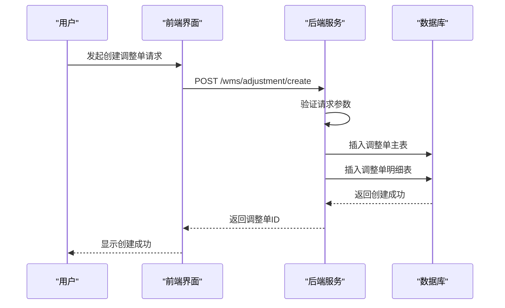
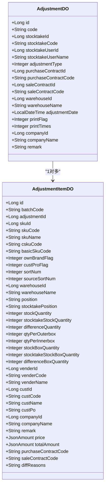
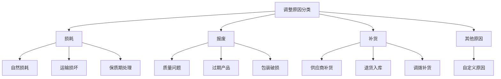
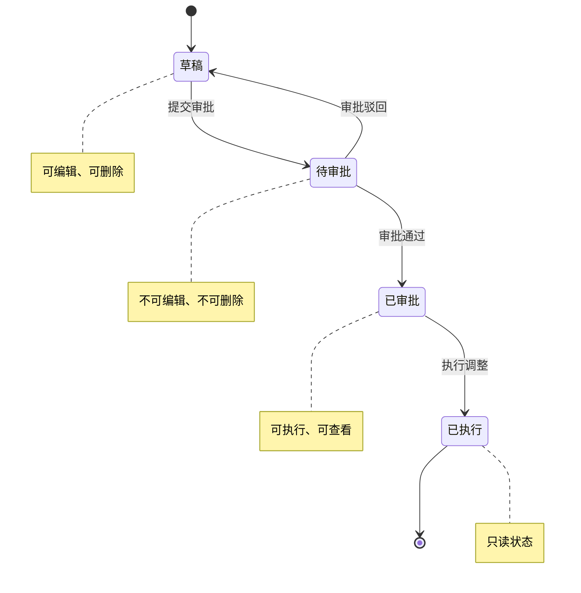
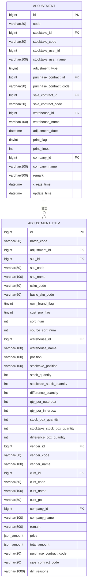
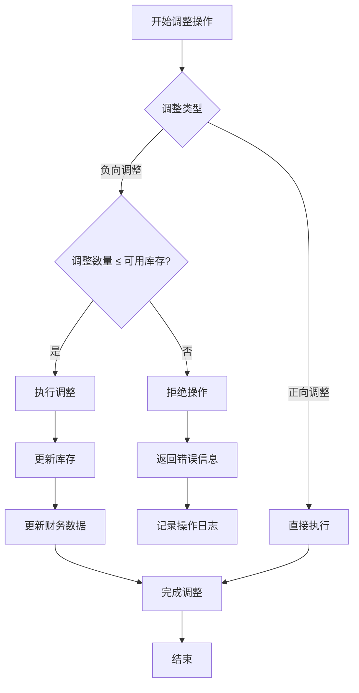

# 库存调整

<cite>
**本文档引用的文件**
- [AdjustmentController.java](file://eplus-module-wms/eplus-module-wms-biz/src/main/java/com/syj/eplus/module/wms/controller/admin/adjustment/AdjustmentController.java)
- [AdjustmentServiceImpl.java](file://eplus-module-wms/eplus-module-wms-biz/src/main/java/com/syj/eplus/module/wms/service/adjustment/AdjustmentServiceImpl.java)
- [AdjustmentDO.java](file://eplus-module-wms/eplus-module-wms-biz/src/main/java/com/syj/eplus/module/wms/dal/dataobject/adjustment/AdjustmentDO.java)
- [AdjustmentItemDO.java](file://eplus-module-wms/eplus-module-wms-biz/src/main/java/com/syj/eplus/module/wms/dal/dataobject/adjustment/AdjustmentItemDO.java)
- [StocktakeResultEnum.java](file://eplus-module-wms/eplus-module-wms-api/src/main/java/com/syj/eplus/module/wms/enums/StocktakeResultEnum.java)
- [V1_0_0_002__Eplus初始化.sql](file://eplus-flyway/src/main/resources/db/migration/common/V1_0_0_002__Eplus初始化.sql)
- [StocktakeAuditResultListener.java](file://eplus-module-wms/eplus-module-wms-biz/src/main/java/com/syj/eplus/module/wms/listener/stocktake/StocktakeAuditResultListener.java)
- [V1_0_0_421__盘盈盘亏单增加差异原因.java](file://eplus-flyway/src/main/java/db/migration/common/V1_0_0_421__盘盈盘亏单增加差异原因.java)
</cite>

## 目录
1. [简介](#简介)
2. [库存调整单创建流程](#库存调整单创建流程)
3. [正向与负向调整](#正向与负向调整)
4. [调整原因分类](#调整原因分类)
5. [调整单状态机](#调整单状态机)
6. [库存与财务影响](#库存与财务影响)
7. [异常处理机制](#异常处理机制)

## 简介
库存调整功能是仓储管理系统中的核心模块，用于处理库存盘点过程中发现的盘盈（正向调整）和盘亏（负向调整）情况。该功能通过创建调整单来修正系统库存与实际库存的差异，确保库存数据的准确性。调整单与盘点单紧密关联，当盘点结果与系统库存不一致时，系统会自动生成相应的调整单。

**本文档引用的文件**
- [AdjustmentController.java](file://eplus-module-wms/eplus-module-wms-biz/src/main/java/com/syj/eplus/module/wms/controller/admin/adjustment/AdjustmentController.java)
- [AdjustmentServiceImpl.java](file://eplus-module-wms/eplus-module-wms-biz/src/main/java/com/syj/eplus/module/wms/service/adjustment/AdjustmentServiceImpl.java)

## 库存调整单创建流程
库存调整单的创建可以通过两种方式实现：手动创建和系统自动生成。

手动创建流程：
1. 用户在管理后台选择"仓储管理-盘库调整单"功能
2. 点击"创建"按钮，填写调整单基本信息，包括仓库、调整日期、备注等
3. 添加调整明细，指定产品、数量、差异原因等信息
4. 选择调整类型（盘盈或盘亏）
5. 提交创建请求

系统自动生成流程（与盘点流程集成）：
1. 完成盘点操作后，系统比对盘点数量与系统库存数量
2. 当发现差异时，根据差异方向自动生成调整单
3. 系统自动填充调整单信息，包括盘点单号、盘点人、仓库等
4. 调整单状态初始化为"草稿"

**图示来源**
- [AdjustmentController.java](file://eplus-module-wms/eplus-module-wms-biz/src/main/java/com/syj/eplus/module/wms/controller/admin/adjustment/AdjustmentController.java#L41-L46)
- [AdjustmentServiceImpl.java](file://eplus-module-wms/eplus-module-wms-biz/src/main/java/com/syj/eplus/module/wms/service/adjustment/AdjustmentServiceImpl.java#L50-L59)

## 正向与负向调整
库存调整分为两种类型：正向调整（盘盈）和负向调整（盘亏），分别对应库存的增加和减少。

### 正向调整（盘盈）
正向调整用于处理实际库存多于系统记录库存的情况。常见业务场景包括：
- 盘点时发现遗漏的库存
- 供应商多发货未记录
- 退货入库未及时登记
- 库存转移未完全记录

在数据模型中，正向调整通过设置`adjustmentType`为1来标识。调整执行后，系统库存将相应增加。

### 负向调整（盘亏）
负向调整用于处理实际库存少于系统记录库存的情况。常见业务场景包括：
- 产品损坏或报废
- 内部领用未登记
- 盗窃或丢失
- 记录错误或重复出库

在数据模型中，负向调整通过设置`adjustmentType`为2来标识。调整执行后，系统库存将相应减少。

**图示来源**
- [AdjustmentDO.java](file://eplus-module-wms/eplus-module-wms-biz/src/main/java/com/syj/eplus/module/wms/dal/dataobject/adjustment/AdjustmentDO.java)
- [AdjustmentItemDO.java](file://eplus-module-wms/eplus-module-wms-biz/src/main/java/com/syj/eplus/module/wms/dal/dataobject/adjustment/AdjustmentItemDO.java)

**本节来源**
- [AdjustmentDO.java](file://eplus-module-wms/eplus-module-wms-biz/src/main/java/com/syj/eplus/module/wms/dal/dataobject/adjustment/AdjustmentDO.java#L53-L55)
- [StocktakeResultEnum.java](file://eplus-module-wms/eplus-module-wms-api/src/main/java/com/syj/eplus/module/wms/enums/StocktakeResultEnum.java)

## 调整原因分类
系统支持对库存调整的原因进行分类记录，以便于后续的分析和审计。调整原因主要分为以下几类：

### 损耗
记录因正常损耗导致的库存减少，如：
- 产品自然损耗
- 运输过程中的轻微损坏
- 保质期临近的折价处理

### 报废
记录因严重损坏或过期无法使用而报废的库存，如：
- 产品质量问题
- 超过保质期
- 包装严重破损

### 补货
记录因补充库存而产生的盘盈，如：
- 供应商补货
- 退货重新入库
- 调拨补货

### 其他原因
系统还支持自定义其他调整原因，用户可以在"差异原因"字段中详细描述具体情况。

在数据库层面，调整原因存储在`wms_adjustment_item`表的`diff_reasons`字段中，该字段为varchar类型，长度为1000，允许存储详细的文本描述。

**图示来源**
- [V1_0_0_421__盘盈盘亏单增加差异原因.java](file://eplus-flyway/src/main/java/db/migration/common/V1_0_0_421__盘盈盘亏单增加差异原因.java)
- [AdjustmentItemDO.java](file://eplus-module-wms/eplus-module-wms-biz/src/main/java/com/syj/eplus/module/wms/dal/dataobject/adjustment/AdjustmentItemDO.java#L189-L191)

## 调整单状态机
库存调整单具有明确的状态流转机制，确保调整过程的可控性和可追溯性。调整单的状态机包含以下四个主要状态：

### 状态定义
- **草稿 (Draft)**: 调整单刚创建时的初始状态，允许编辑和修改
- **待审批 (Pending Approval)**: 调整单提交审批后的状态，等待审批人处理
- **已审批 (Approved)**: 调整单通过审批后的状态，可以执行调整
- **已执行 (Executed)**: 调整操作已完成，库存已更新

### 状态转换规则

**图示来源**
- [StocktakeAuditResultListener.java](file://eplus-module-wms/eplus-module-wms-biz/src/main/java/com/syj/eplus/module/wms/listener/stocktake/StocktakeAuditResultListener.java)
- [AdjustmentDO.java](file://eplus-module-wms/eplus-module-wms-biz/src/main/java/com/syj/eplus/module/wms/dal/dataobject/adjustment/AdjustmentDO.java)

## 库存与财务影响
库存调整操作对系统的库存明细和财务核算产生直接影响。

### 对库存明细的影响
当调整单执行后，系统会根据调整类型更新相应产品的库存数量：
- 正向调整：增加库存数量
- 负向调整：减少库存数量

系统会记录调整前后的库存变化，包括：
- 调整前库存数量
- 调整后库存数量
- 调整数量
- 调整时间
- 操作人信息

### 对财务核算的影响
库存调整不仅影响库存数量，还会影响财务核算：
- **价值调整**: 根据产品单价和调整数量，计算调整的总价值
- **成本核算**: 调整会影响产品的平均成本计算
- **损益记录**: 盘亏会导致资产减少，可能计入营业外支出

在数据模型中，`AdjustmentItemDO`类包含`price`和`totalAmount`字段，用于记录调整的单价和总金额，支持财务核算需求。

**图示来源**
- [V1_0_0_002__Eplus初始化.sql](file://eplus-flyway/src/main/resources/db/migration/common/V1_0_0_002__Eplus初始化.sql)
- [AdjustmentItemDO.java](file://eplus-module-wms/eplus-module-wms-biz/src/main/java/com/syj/eplus/module/wms/dal/dataobject/adjustment/AdjustmentItemDO.java)

## 异常处理机制
系统具备完善的异常处理机制，确保在异常情况下能够正确响应并保护数据完整性。

### 调整数量超出可用库存
当负向调整的数量超过当前可用库存时，系统会进行如下处理：
1. 在创建或更新调整单时进行校验
2. 如果调整数量超过可用库存，系统拒绝操作
3. 返回错误信息"调整数量不能超过可用库存"
4. 记录操作日志供审计

### 审批流程异常
当审批流程出现问题时，系统提供以下处理机制：
- 审批超时：系统可配置审批超时时间，超时后自动提醒审批人
- 审批人离职：系统支持审批人代理机制，确保审批流程不中断
- 审批驳回：调整单被打回后，状态返回"草稿"，允许修改后重新提交

### 系统故障处理
为应对系统故障，系统设计了以下保护措施：
- 事务管理：调整操作使用数据库事务，确保数据一致性
- 操作日志：记录所有关键操作，便于问题追踪
- 数据备份：定期备份库存数据，防止数据丢失

**本节来源**
- [AdjustmentServiceImpl.java](file://eplus-module-wms/eplus-module-wms-biz/src/main/java/com/syj/eplus/module/wms/service/adjustment/AdjustmentServiceImpl.java)
- [AdjustmentController.java](file://eplus-module-wms/eplus-module-wms-biz/src/main/java/com/syj/eplus/module/wms/controller/admin/adjustment/AdjustmentController.java)