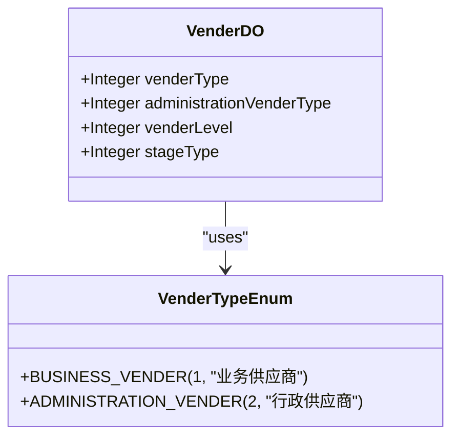
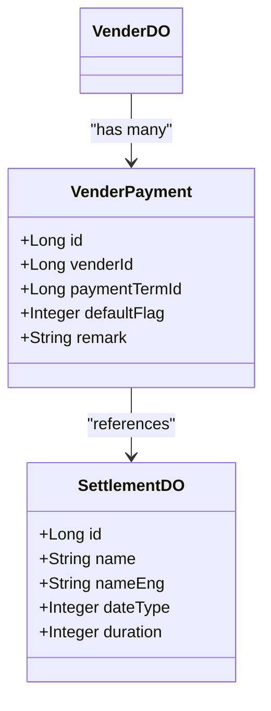
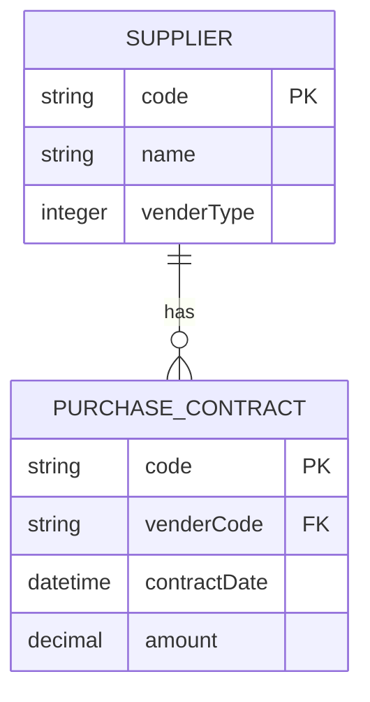
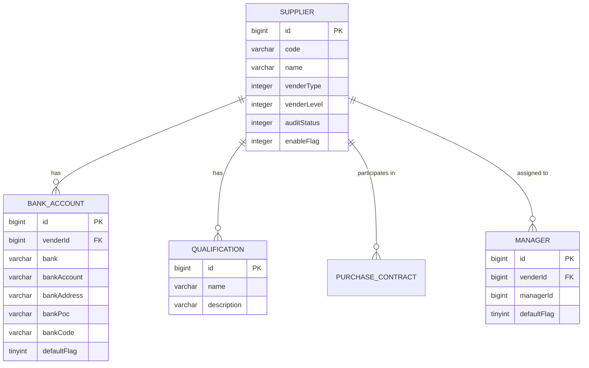

# 供应商管理

<cite>
**本文档引用文件**   
- [VenderDO.java](file://eplus-module-scm/eplus-module-scm-biz/src/main/java/com/syj/eplus/module/scm/dal/dataobject/vender/VenderDO.java)
- [VenderBankaccountDO.java](file://eplus-module-scm/eplus-module-scm-biz/src/main/java/com/syj/eplus/module/scm/dal/dataobject/venderbankaccount/VenderBankaccountDO.java)
- [QualificationDO.java](file://eplus-module-scm/eplus-module-scm-biz/src/main/java/com/syj/eplus/module/scm/dal/dataobject/qualification/QualificationDO.java)
- [VenderService.java](file://eplus-module-scm/eplus-module-scm-biz/src/main/java/com/syj/eplus/module/scm/service/vender/VenderService.java)
- [VenderApi.java](file://eplus-module-scm/eplus-module-scm-api/src/main/java/com/syj/eplus/module/scm/api/vender/VenderApi.java)
- [scm_vender.sql](file://eplus-flyway/src/main/resources/db/migration/common/V1_0_0_002__Eplus初始化.sql)
- [scm_vender_bankaccount.sql](file://eplus-flyway/src/main/resources/db/migration/common/V1_0_0_002__Eplus初始化.sql)
- [scm_vender_manager.sql](file://eplus-flyway/src/main/resources/db/migration/common/V1_0_0_002__Eplus初始化.sql)
- [VenderTypeEnum.java](file://eplus-framework/eplus-common/src/main/java/com/syj/eplus/framework/common/enums/VenderTypeEnum.java)
</cite>

## 目录
1. [供应商信息维护](#供应商信息维护)
2. [供应商分类与评级](#供应商分类与评级)
3. [供应商结算周期](#供应商结算周期)
4. [供应商关联关系](#供应商关联关系)
5. [数据模型说明](#数据模型说明)
6. [典型使用场景](#典型使用场景)
7. [最佳实践](#最佳实践)

## 供应商信息维护

供应商信息维护是供应商管理的核心功能，包括基本信息、财务信息和资质文件等字段的管理。

### 基本信息
供应商基本信息包括：
- **供应商编码**：系统自动生成的唯一标识符
- **供应商名称**：供应商的正式名称
- **供应商简称**：供应商的简称
- **供应商英文名称**：供应商的英文名称
- **注册资本**：供应商的注册资本金额
- **法定代表人**：供应商的法定代表人姓名
- **主营业务**：供应商的主要业务范围
- **公司地址**：供应商的注册地址
- **工厂地址**：供应商的生产工厂地址
- **企业电话**：供应商的企业联系电话
- **传真**：供应商的传真号码
- **国家编号**：供应商所在国家的编号
- **是否境外供应商**：标识供应商是否为境外供应商

### 财务信息
供应商财务信息主要包括银行账户信息：
- **银行**：开户银行名称
- **银行账号**：银行账户号码
- **开户行地址**：开户银行的详细地址
- **开户行联系人**：开户银行的联系人
- **银行行号**：银行的SWIFT代码或行号
- **是否默认账号**：标识该银行账户是否为默认付款账户

### 资质文件
供应商资质管理功能允许维护供应商的各种资质文件：
- **资质名称**：资质的正式名称
- **资质描述**：对资质的详细描述
- **附件**：上传的资质证明文件

**Section sources**
- [VenderDO.java](file://eplus-module-scm/eplus-module-scm-biz/src/main/java/com/syj/eplus/module/scm/dal/dataobject/vender/VenderDO.java#L64-L197)
- [VenderBankaccountDO.java](file://eplus-module-scm/eplus-module-scm-biz/src/main/java/com/syj/eplus/module/scm/dal/dataobject/venderbankaccount/VenderBankaccountDO.java#L44-L67)
- [QualificationDO.java](file://eplus-module-scm/eplus-module-scm-biz/src/main/java/com/syj/eplus/module/scm/dal/dataobject/qualification/QualificationDO.java#L33-L37)

## 供应商分类与评级

供应商分类和评级是供应商管理的重要组成部分，用于对供应商进行有效管理和评估。

### 供应商分类
系统支持多种供应商分类方式：

**Diagram sources**
- [VenderTypeEnum.java](file://eplus-framework/eplus-common/src/main/java/com/syj/eplus/framework/common/enums/VenderTypeEnum.java#L6-L14)
- [VenderDO.java](file://eplus-module-scm/eplus-module-scm-biz/src/main/java/com/syj/eplus/module/scm/dal/dataobject/vender/VenderDO.java#L110-L212)

供应商主要分为两类：
1. **业务供应商**：参与核心业务活动的供应商
2. **行政供应商**：提供行政支持服务的供应商

此外，系统还支持按供应商阶段进行分类：
- **试用阶段**：新引入的供应商
- **正式阶段**：通过评估的供应商
- **战略合作伙伴**：长期合作的重要供应商

### 供应商评级
供应商评级体系包括：
- **供应商级别**：根据供应商的重要性和合作深度划分的等级
- **审核状态**：供应商的审核流程状态
  - 未提交
  - 审核中
  - 已通过
  - 已拒绝
- **启用状态**：标识供应商是否处于可用状态

评级过程通常与审批流程集成，确保只有通过审核的供应商才能被正式使用。

**Section sources**
- [VenderDO.java](file://eplus-module-scm/eplus-module-scm-biz/src/main/java/com/syj/eplus/module/scm/dal/dataobject/vender/VenderDO.java#L114-L141)
- [VenderTypeEnum.java](file://eplus-framework/eplus-common/src/main/java/com/syj/eplus/framework/common/enums/VenderTypeEnum.java#L6-L14)

## 供应商结算周期

供应商结算周期管理涉及付款方式和结算条件的配置。

### 付款方式
供应商可以配置多种付款方式，系统通过`VenderPayment`实体管理：

**Diagram sources**
- [VenderPayment.java](file://eplus-module-scm/eplus-module-scm-biz/src/main/java/com/syj/eplus/module/scm/dal/dataobject/venderpayment/VenderPayment.java)
- [SettlementDO.java](file://eplus-module-infra/eplus-module-infra-biz/src/main/java/com/syj/eplus/module/infra/dal/dataobject/settlement/SettlementDO.java)

### 结算条件
结算条件包括：
- **起始日类型**：结算周期的起始计算基准
  - 发票日期
  - 收货日期
  - 合同日期
- **天数**：从起始日到付款日的天数
- **收款计划**：分期付款的具体安排

系统支持为不同供应商配置不同的结算周期，以适应各种业务需求。

**Section sources**
- [VenderPayment.java](file://eplus-module-scm/eplus-module-scm-biz/src/main/java/com/syj/eplus/module/scm/dal/dataobject/venderpayment/VenderPayment.java)
- [SettlementDO.java](file://eplus-module-infra/eplus-module-infra-biz/src/main/java/com/syj/eplus/module/infra/dal/dataobject/settlement/SettlementDO.java#L34-L48)

## 供应商关联关系

供应商与其他业务实体存在多种关联关系，这些关系构成了完整的供应链管理体系。

### 与采购合同的关联
每个采购合同都关联一个供应商，这种关联关系是采购业务的基础：

**Diagram sources**
- [PurchaseContractDTO.java](file://eplus-module-scm/eplus-module-scm-api/src/main/java/com/syj/eplus/module/scm/api/purchasecontract/dto/PurchaseContractDTO.java#L23-L32)
- [VenderDO.java](file://eplus-module-scm/eplus-module-scm-biz/src/main/java/com/syj/eplus/module/scm/dal/dataobject/vender/VenderDO.java)

### 与采购计划的关联
供应商与采购计划的关系体现在：
- 采购计划中指定的供应商
- 供应商的供货能力评估
- 采购需求与供应商产能的匹配

### 其他关联
供应商还与以下业务实体关联：
- **入库单**：供应商是货物的来源方
- **付款单**：供应商是付款的接收方
- **验货单**：供应商提供的货物需要进行质量检验
- **退货单**：与供应商处理退货事宜

这些关联关系确保了供应链各环节的完整性和可追溯性。

**Section sources**
- [PurchaseContractDTO.java](file://eplus-module-scm/eplus-module-scm-api/src/main/java/com/syj/eplus/module/scm/api/purchasecontract/dto/PurchaseContractDTO.java)
- [RelatedPurchaseContractRespVO.java](file://eplus-module-scm/eplus-module-scm-biz/src/main/java/com/syj/eplus/module/scm/controller/admin/purchasecontract/vo/RelatedPurchaseContractRespVO.java#L17-L38)

## 数据模型说明

供应商管理系统的数据模型设计合理，支持复杂的业务需求。

### 实体关系
主要实体及其关系如下：

**Diagram sources**
- [scm_vender.sql](file://eplus-flyway/src/main/resources/db/migration/common/V1_0_0_002__Eplus初始化.sql#L944-L987)
- [VenderDO.java](file://eplus-module-scm/eplus-module-scm-biz/src/main/java/com/syj/eplus/module/scm/dal/dataobject/vender/VenderDO.java)
- [VenderBankaccountDO.java](file://eplus-module-scm/eplus-module-scm-biz/src/main/java/com/syj/eplus/module/scm/dal/dataobject/venderbankaccount/VenderBankaccountDO.java)

### 主要实体

#### 供应商主表 (scm_vender)
供应商主表存储供应商的核心信息，关键字段包括：
- `id`: 主键
- `code`: 供应商编码
- `name`: 供应商名称
- `venderType`: 供应商类型
- `venderLevel`: 供应商级别
- `auditStatus`: 审核状态
- `enableFlag`: 启用状态
- `ver`: 版本号（用于并发控制）

#### 供应商银行账户表 (scm_vender_bankaccount)
存储供应商的银行账户信息，关键字段包括：
- `id`: 主键
- `vender_id`: 关联的供应商ID
- `bank`: 银行名称
- `bank_account`: 银行账号
- `bank_address`: 开户行地址
- `bank_poc`: 开户行联系人
- `bank_code`: 银行行号
- `default_flag`: 是否默认账号

#### 供应商资质表 (scm_qualification)
管理供应商的资质信息，关键字段包括：
- `id`: 主键
- `name`: 资质名称
- `description`: 资质描述

#### 供应商采购经理表 (scm_vender_manager)
记录供应商与采购经理的对应关系，关键字段包括：
- `id`: 主键
- `vender_id`: 供应商ID
- `manager_id`: 采购经理ID
- `default_flag`: 是否默认采购经理

**Section sources**
- [scm_vender.sql](file://eplus-flyway/src/main/resources/db/migration/common/V1_0_0_002__Eplus初始化.sql#L944-L987)
- [VenderDO.java](file://eplus-module-scm/eplus-module-scm-biz/src/main/java/com/syj/eplus/module/scm/dal/dataobject/vender/VenderDO.java)
- [VenderBankaccountDO.java](file://eplus-module-scm/eplus-module-scm-biz/src/main/java/com/syj/eplus/module/scm/dal/dataobject/venderbankaccount/VenderBankaccountDO.java)
- [QualificationDO.java](file://eplus-module-scm/eplus-module-scm-biz/src/main/java/com/syj/eplus/module/scm/dal/dataobject/qualification/QualificationDO.java)
- [scm_vender_manager.sql](file://eplus-flyway/src/main/resources/db/migration/common/V1_0_0_002__Eplus初始化.sql#L971-L987)

## 典型使用场景

### 供应商引入流程
1. **信息录入**：采购人员录入新供应商的基本信息
2. **资质上传**：上传供应商的营业执照、税务登记证等资质文件
3. **银行信息配置**：设置供应商的收款银行账户
4. **审批流程**：提交供应商信息进行多级审批
5. **启用供应商**：审批通过后，供应商状态变为"已启用"，可参与采购活动

### 供应商变更管理
当供应商信息发生变化时：
1. **创建变更单**：基于现有供应商信息创建变更版本
2. **修改信息**：在变更版本中修改需要更新的字段
3. **审批变更**：提交变更单进行审批
4. **生效变更**：审批通过后，新信息生效，旧信息归档

### 采购合同创建
创建采购合同时：
1. **选择供应商**：从已启用的供应商列表中选择合适的供应商
2. **自动填充**：系统自动填充供应商的基本信息和默认结算周期
3. **确认条款**：确认合同条款，包括价格、交货期等
4. **生成合同**：生成正式的采购合同

**Section sources**
- [VenderService.java](file://eplus-module-scm/eplus-module-scm-biz/src/main/java/com/syj/eplus/module/scm/service/vender/VenderService.java#L238-L245)
- [VenderApi.java](file://eplus-module-scm/eplus-module-scm-api/src/main/java/com/syj/eplus/module/scm/api/vender/VenderApi.java)

## 最佳实践

### 数据完整性
- **必填字段验证**：确保供应商名称、编码等关键字段不为空
- **唯一性约束**：供应商编码必须全局唯一
- **格式验证**：银行账号、电话号码等字段应符合相应的格式规范

### 安全控制
- **权限管理**：不同角色对供应商信息有不同的操作权限
- **变更审计**：记录所有供应商信息的变更历史
- **敏感信息保护**：对银行账号等敏感信息进行加密存储

### 性能优化
- **索引优化**：在常用查询字段（如供应商编码、名称）上建立索引
- **缓存机制**：对频繁访问的供应商基本信息进行缓存
- **分页查询**：大数据量查询时使用分页，避免性能问题

### 业务规则
- **状态机管理**：供应商状态转换应遵循预定义的流程
- **级联操作**：删除供应商时，应检查是否存在关联的采购合同等业务数据
- **数据一致性**：确保供应商信息在各个业务模块中保持一致

**Section sources**
- [VenderService.java](file://eplus-module-scm/eplus-module-scm-biz/src/main/java/com/syj/eplus/module/scm/service/vender/VenderService.java)
- [VenderApi.java](file://eplus-module-scm/eplus-module-scm-api/src/main/java/com/syj/eplus/module/scm/api/vender/VenderApi.java)
- [VenderController.java](file://eplus-module-scm/eplus-module-scm-biz/src/main/java/com/syj/eplus/module/scm/controller/admin/vender/VenderController.java)