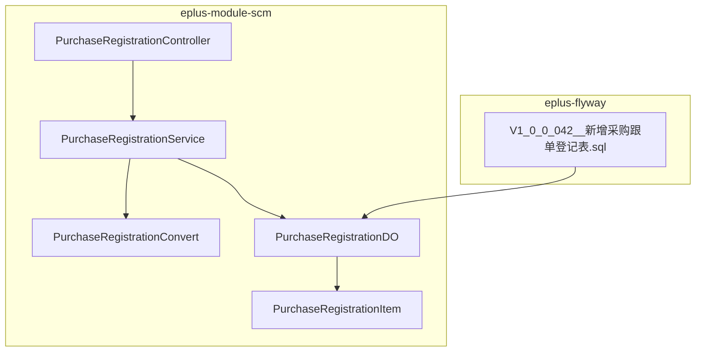
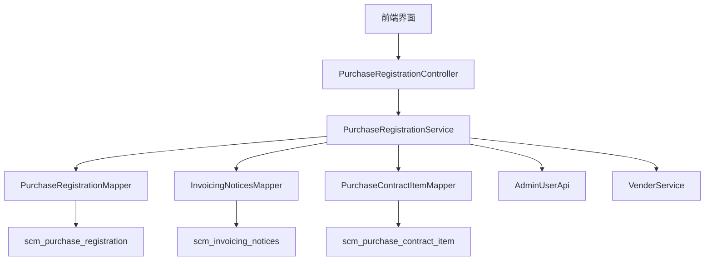
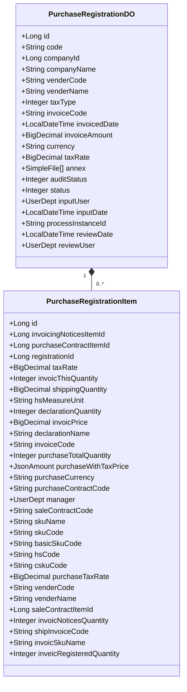
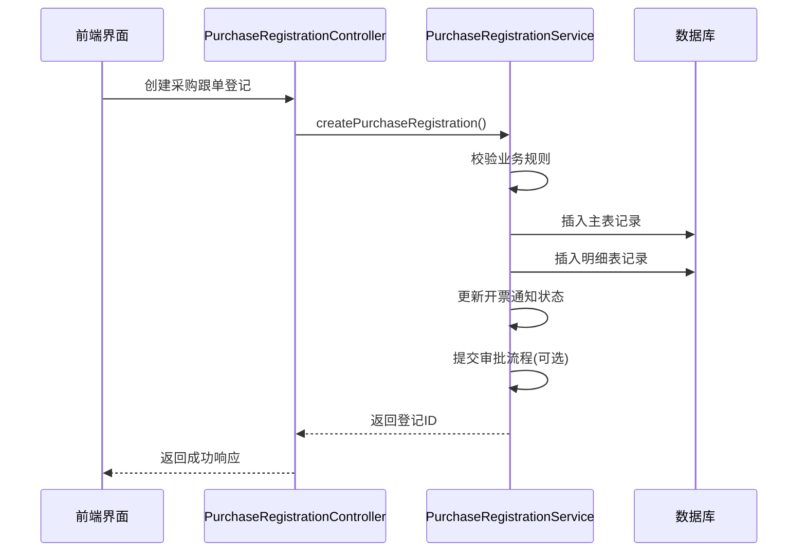
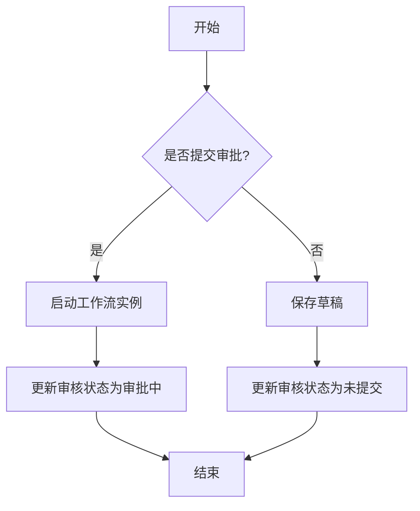
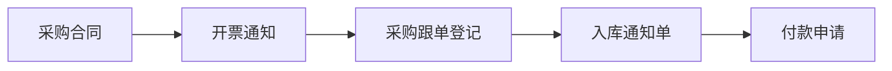
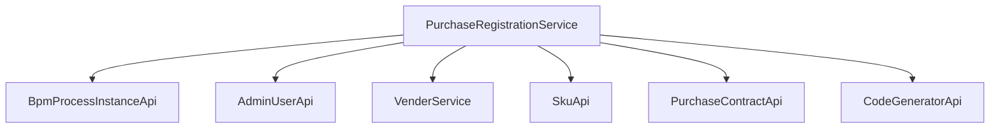

# 采购跟单登记

<cite>
**本文档引用文件**  
- [V1_0_0_042__新增采购跟单登记表.sql](file://eplus-flyway/src/main/resources/db/migration/common/V1_0_0_042__新增采购跟单登记表.sql)
- [PurchaseRegistrationController.java](file://eplus-module-scm/eplus-module-scm-biz/src/main/java/com/syj/eplus/module/scm/controller/admin/purchaseregistration/PurchaseRegistrationController.java)
- [PurchaseRegistrationServiceImpl.java](file://eplus-module-scm/eplus-module-scm-biz/src/main/java/com/syj/eplus/module/scm/service/purchaseregistration/PurchaseRegistrationServiceImpl.java)
- [PurchaseRegistrationDO.java](file://eplus-module-scm/eplus-module-scm-biz/src/main/java/com/syj/eplus/module/scm/dal/dataobject/purchaseregistration/PurchaseRegistrationDO.java)
- [PurchaseRegistrationItem.java](file://eplus-module-scm/eplus-module-scm-biz/src/main/java/com/syj/eplus/module/scm/dal/dataobject/purchaseregistrationitem/PurchaseRegistrationItem.java)
- [PurchaseRegistrationConvert.java](file://eplus-module-scm/eplus-module-scm-biz/src/main/java/com/syj/eplus/module/scm/convert/purchaseregistration/PurchaseRegistrationConvert.java)
</cite>

## 目录
1. [引言](#引言)
2. [项目结构](#项目结构)
3. [核心组件](#核心组件)
4. [架构概述](#架构概述)
5. [详细组件分析](#详细组件分析)
6. [依赖分析](#依赖分析)
7. [性能考虑](#性能考虑)
8. [故障排除指南](#故障排除指南)
9. [结论](#结论)
10. [附录](#附录)（如有必要）

## 引言
采购跟单登记功能是采购合同执行过程中的关键管理环节，用于跟踪采购进度、确认交货日期、反馈质量问题等。该功能通过创建和更新跟单记录，实现与采购合同、入库通知单的关联管理。系统支持跟单状态（正常、延迟、异常）的管理，并可通过跟单信息进行供应商绩效评估。本文档详细说明该功能的数据模型、关键字段、业务流程及典型应用场景。

## 项目结构
采购跟单登记功能主要位于 `eplus-module-scm` 模块中，包含API定义、业务逻辑实现、数据对象定义和控制器。数据库表结构定义在 `eplus-flyway` 模块的迁移脚本中。

**图表来源**  
- [PurchaseRegistrationController.java](file://eplus-module-scm/eplus-module-scm-biz/src/main/java/com/syj/eplus/module/scm/controller/admin/purchaseregistration/PurchaseRegistrationController.java)
- [PurchaseRegistrationServiceImpl.java](file://eplus-module-scm/eplus-module-scm-biz/src/main/java/com/syj/eplus/module/scm/service/purchaseregistration/PurchaseRegistrationServiceImpl.java)
- [PurchaseRegistrationDO.java](file://eplus-module-scm/eplus-module-scm-biz/src/main/java/com/syj/eplus/module/scm/dal/dataobject/purchaseregistration/PurchaseRegistrationDO.java)
- [PurchaseRegistrationItem.java](file://eplus-module-scm/eplus-module-scm-biz/src/main/java/com/syj/eplus/module/scm/dal/dataobject/purchaseregistrationitem/PurchaseRegistrationItem.java)
- [V1_0_0_042__新增采购跟单登记表.sql](file://eplus-flyway/src/main/resources/db/migration/common/V1_0_0_042__新增采购跟单登记表.sql)

**章节来源**  
- [eplus-module-scm](file://eplus-module-scm)
- [eplus-flyway](file://eplus-flyway)

## 核心组件
采购跟单登记功能的核心组件包括采购跟单登记主表（scm_purchase_registration）和明细表（scm_purchase_registration_item）。主表记录整体登记信息，包括供应商、发票信息、审核状态等；明细表记录每项产品的具体跟单信息，如数量、单价、交货日期等。系统通过流程实例ID与工作流引擎集成，实现审批流程管理。

**章节来源**  
- [V1_0_0_042__新增采购跟单登记表.sql](file://eplus-flyway/src/main/resources/db/migration/common/V1_0_0_042__新增采购跟单登记表.sql)
- [PurchaseRegistrationDO.java](file://eplus-module-scm/eplus-module-scm-biz/src/main/java/com/syj/eplus/module/scm/dal/dataobject/purchaseregistration/PurchaseRegistrationDO.java)
- [PurchaseRegistrationItem.java](file://eplus-module-scm/eplus-module-scm-biz/src/main/java/com/syj/eplus/module/scm/dal/dataobject/purchaseregistrationitem/PurchaseRegistrationItem.java)

## 架构概述
采购跟单登记功能采用典型的分层架构，包括控制器层、服务层、数据访问层。控制器处理HTTP请求，服务层实现业务逻辑，数据访问层负责数据库操作。系统通过MapStruct实现DO与VO之间的转换，通过MyBatis Plus进行数据库操作。

**图表来源**  
- [PurchaseRegistrationController.java](file://eplus-module-scm/eplus-module-scm-biz/src/main/java/com/syj/eplus/module/scm/controller/admin/purchaseregistration/PurchaseRegistrationController.java)
- [PurchaseRegistrationServiceImpl.java](file://eplus-module-scm/eplus-module-scm-biz/src/main/java/com/syj/eplus/module/scm/service/purchaseregistration/PurchaseRegistrationServiceImpl.java)
- [PurchaseRegistrationMapper.java](file://eplus-module-scm/eplus-module-scm-biz/src/main/java/com/syj/eplus/module/scm/dal/mysql/purchaseregistration/PurchaseRegistrationMapper.java)

## 详细组件分析

### 采购跟单登记分析
采购跟单登记功能支持创建、更新、删除、查询、审批、提交、批量复核和作废等操作。系统在创建和更新时会进行业务校验，如登票数量不能大于开票通知数量。提交操作会启动工作流审批流程。

#### 对象导向组件：

**图表来源**  
- [PurchaseRegistrationDO.java](file://eplus-module-scm/eplus-module-scm-biz/src/main/java/com/syj/eplus/module/scm/dal/dataobject/purchaseregistration/PurchaseRegistrationDO.java)
- [PurchaseRegistrationItem.java](file://eplus-module-scm/eplus-module-scm-biz/src/main/java/com/syj/eplus/module/scm/dal/dataobject/purchaseregistrationitem/PurchaseRegistrationItem.java)

#### API/服务组件：

**图表来源**  
- [PurchaseRegistrationController.java](file://eplus-module-scm/eplus-module-scm-biz/src/main/java/com/syj/eplus/module/scm/controller/admin/purchaseregistration/PurchaseRegistrationController.java)
- [PurchaseRegistrationServiceImpl.java](file://eplus-module-scm/eplus-module-scm-biz/src/main/java/com/syj/eplus/module/scm/service/purchaseregistration/PurchaseRegistrationServiceImpl.java)

#### 复杂逻辑组件：

**图表来源**  
- [PurchaseRegistrationServiceImpl.java](file://eplus-module-scm/eplus-module-scm-biz/src/main/java/com/syj/eplus/module/scm/service/purchaseregistration/PurchaseRegistrationServiceImpl.java)

**章节来源**  
- [PurchaseRegistrationController.java](file://eplus-module-scm/eplus-module-scm-biz/src/main/java/com/syj/eplus/module/scm/controller/admin/purchaseregistration/PurchaseRegistrationController.java)
- [PurchaseRegistrationServiceImpl.java](file://eplus-module-scm/eplus-module-scm-biz/src/main/java/com/syj/eplus/module/scm/service/purchaseregistration/PurchaseRegistrationServiceImpl.java)
- [PurchaseRegistrationConvert.java](file://eplus-module-scm/eplus-module-scm-biz/src/main/java/com/syj/eplus/module/scm/convert/purchaseregistration/PurchaseRegistrationConvert.java)

### 概念概述
采购跟单登记是采购管理的重要环节，通过系统化记录和跟踪采购合同的执行情况，确保采购活动按计划进行。系统支持与采购合同、开票通知、入库单等业务单据的关联，实现全流程闭环管理。

## 依赖分析
采购跟单登记功能依赖于多个外部服务和模块，包括工作流引擎（BpmProcessInstanceApi）、用户服务（AdminUserApi）、供应商服务（VenderService）、SKU服务（SkuApi）和采购合同服务（PurchaseContractApi）。这些依赖关系通过Spring的@Resource注解注入。

**图表来源**  
- [PurchaseRegistrationServiceImpl.java](file://eplus-module-scm/eplus-module-scm-biz/src/main/java/com/syj/eplus/module/scm/service/purchaseregistration/PurchaseRegistrationServiceImpl.java)

**章节来源**  
- [PurchaseRegistrationServiceImpl.java](file://eplus-module-scm/eplus-module-scm-biz/src/main/java/com/syj/eplus/module/scm/service/purchaseregistration/PurchaseRegistrationServiceImpl.java)

## 性能考虑
采购跟单登记功能在处理大量数据时需注意性能优化。系统采用批量插入和更新操作，减少数据库交互次数。查询操作支持分页，避免一次性加载过多数据。建议对常用查询字段建立索引，如供应商编号、采购合同号、审核状态等。

## 故障排除指南
常见问题包括：登票数量超过开票通知数量、采购数量不足、币种不一致等。系统在业务逻辑层进行校验并抛出相应异常。审批流程相关问题可检查工作流定义和用户权限配置。

**章节来源**  
- [PurchaseRegistrationServiceImpl.java](file://eplus-module-scm/eplus-module-scm-biz/src/main/java/com/syj/eplus/module/scm/service/purchaseregistration/PurchaseRegistrationServiceImpl.java)

## 结论
采购跟单登记功能实现了采购合同执行过程的全面跟踪和管理，通过与多个业务模块的集成，构建了完整的采购业务闭环。系统支持灵活的审批流程和详细的业务校验，确保数据的准确性和业务的合规性。未来可进一步优化用户界面和报表功能，提升用户体验。