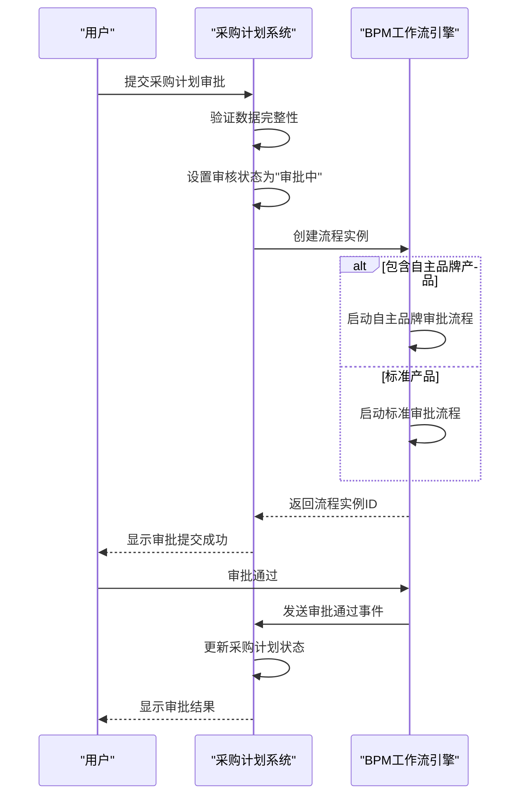
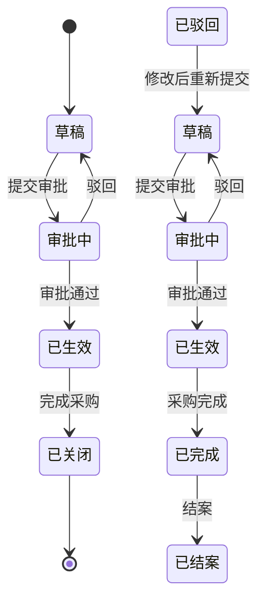
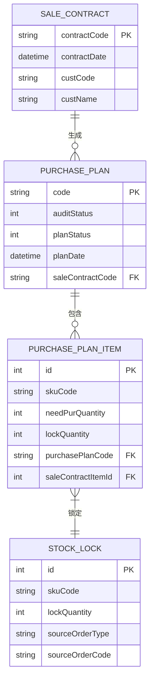
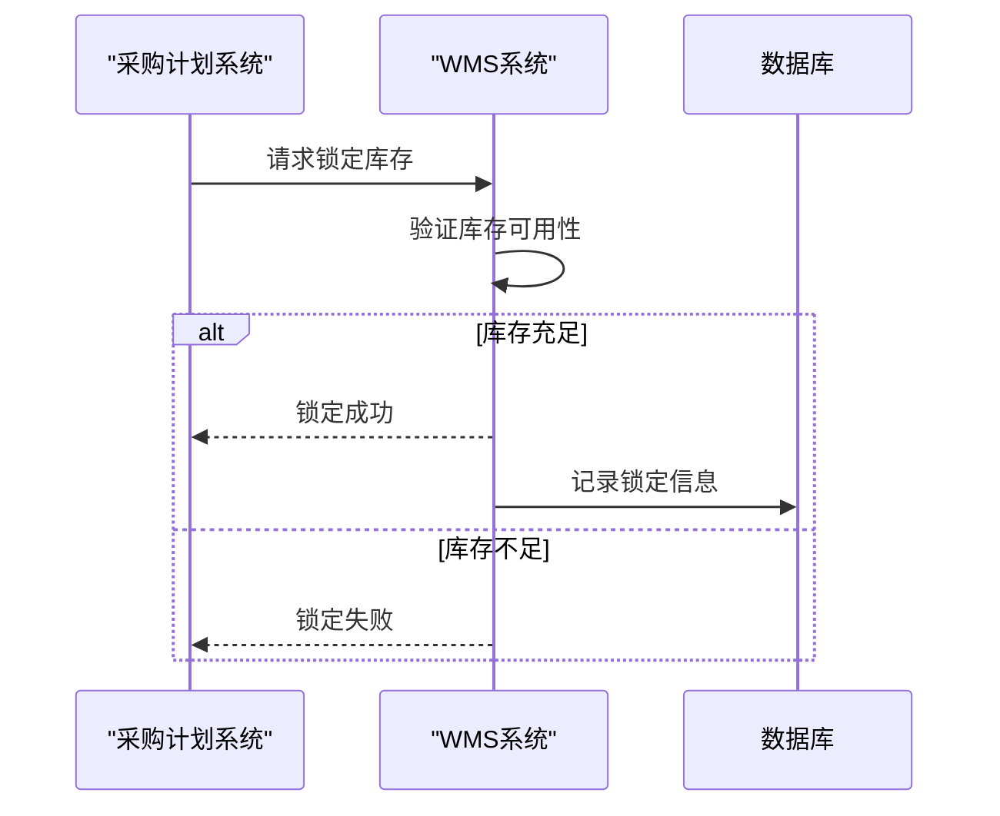

# 采购计划

<cite>
**本文档引用文件**  
- [PurchasePlanApi.java](file://eplus-module-scm/eplus-module-scm-api/src/main/java/com/syj/eplus/module/scm/api/purchaseplan/PurchasePlanApi.java)
- [PurchasePlanApiImpl.java](file://eplus-module-scm/eplus-module-scm-biz/src/main/java/com/syj/eplus/module/scm/api/PurchasePlanApiImpl.java)
- [PurchasePlanService.java](file://eplus-module-scm/eplus-module-scm-biz/src/main/java/com/syj/eplus/module/scm/service/purchaseplan/PurchasePlanService.java)
- [PurchasePlanServiceImpl.java](file://eplus-module-scm/eplus-module-scm-biz/src/main/java/com/syj/eplus/module/scm/service/purchaseplan/PurchasePlanServiceImpl.java)
- [PurchasePlanDO.java](file://eplus-module-scm/eplus-module-scm-biz/src/main/java/com/syj/eplus/module/scm/dal/dataobject/purchaseplan/PurchasePlanDO.java)
- [PurchasePlanItemDO.java](file://eplus-module-scm/eplus-module-scm-biz/src/main/java/com/syj/eplus/module/scm/dal/dataobject/purchaseplanitem/PurchasePlanItemDO.java)
- [PurchasePlanController.java](file://eplus-module-scm/eplus-module-scm-biz/src/main/java/com/syj/eplus/module/scm/controller/admin/purchaseplan/PurchasePlanController.java)
- [PurchasePlanStatusEnum.java](file://eplus-framework/eplus-common/src/main/java/com/syj/eplus/framework/common/enums/PurchasePlanStatusEnum.java)
- [StockLockSaveReqVO.java](file://eplus-module-wms/eplus-module-wms-biz/src/main/java/com/syj/eplus/module/wms/controller/admin/stocklock/vo/StockLockSaveReqVO.java)
- [StockLockSourceTypeEnum.java](file://eplus-module-wms/eplus-module-wms-api/src/main/java/com/syj/eplus/module/wms/enums/StockLockSourceTypeEnum.java)
</cite>

## 目录
1. [采购计划创建流程](#采购计划创建流程)
2. [采购计划审批流程](#采购计划审批流程)
3. [采购计划执行与转合同](#采购计划执行与转合同)
4. [采购计划数据模型](#采购计划数据模型)
5. [采购计划状态机](#采购计划状态机)
6. [与销售合同和库存需求的关联关系](#与销售合同和库存需求的关联关系)
7. [与WMS模块的集成点](#与wms模块的集成点)
8. [典型使用场景示例](#典型使用场景示例)

## 采购计划创建流程

采购计划的创建是供应链管理中的关键环节，主要通过 `PurchasePlanController` 的 `createPurchasePlan` 接口实现。创建流程包括以下步骤：

1. **初始化采购计划信息**：系统自动生成采购计划编号（以"PP"为前缀），设置版本号为1，记录创建时间为当前时间。
2. **设置链路编号**：如果未提供链路编号，则生成UUID作为链路标识，用于追踪采购计划在整个业务流程中的流转。
3. **设置初始状态**：采购计划的初始审核状态为"未提交"（UNSUBMITTED），计划状态为"待提交"（PENDING_SUBMIT）。
4. **关联采购员信息**：根据采购明细中的采购员ID，从用户服务中获取对应的用户和部门信息，并关联到采购计划主表。
5. **处理辅料采购信息**：如果涉及辅料采购，系统会从关联的采购合同中获取采购员、销售员和跟单员信息。
6. **库存采购特殊处理**：对于库存采购（即无需实际采购的产品），系统会自动将计划状态设置为"已完成"（COMPLETED）。
7. **插入数据库**：将采购计划主表信息插入 `scm_purchase_plan` 表。
8. **处理采购明细**：遍历采购计划明细，设置每个明细的关联信息（如采购计划ID、版本号、转换标识等），并批量插入 `scm_purchase_plan_item` 表。
9. **更新销售合同状态**：回写销售合同明细的采购标识，表明该销售明细已生成采购计划。
10. **创建订单链路**：为采购计划创建订单链路记录，用于业务流程追踪。

在创建过程中，系统还会进行多项校验，包括币种可用性校验、客户有效性校验等，确保数据的完整性和准确性。

**Section sources**
- [PurchasePlanServiceImpl.java](file://eplus-module-scm/eplus-module-scm-biz/src/main/java/com/syj/eplus/module/scm/service/purchaseplan/PurchasePlanServiceImpl.java#L192-L332)
- [PurchasePlanController.java](file://eplus-module-scm/eplus-module-scm-biz/src/main/java/com/syj/eplus/module/scm/controller/admin/purchaseplan/PurchasePlanController.java#L46-L52)

## 采购计划审批流程

采购计划的审批流程基于BPM（业务流程管理）系统实现，通过工作流引擎控制审批过程。审批流程的主要特点和步骤如下：

1. **提交审批**：当用户提交采购计划进行审批时，系统调用 `submitTask` 方法，创建一个BPM流程实例。此操作会将采购计划的审核状态更新为"审批中"（PROCESS）。
2. **条件分支**：审批流程支持条件分支，系统会根据采购计划中是否包含自主品牌产品（ownBrandFlag）来决定走不同的审批路径。如果包含自主品牌产品，则走特殊审批流程；否则走标准审批流程。
3. **辅料采购特殊流程**：对于辅料采购计划，系统会启动独立的审批流程（`scm_purchase_plan_auxiliary`），并根据辅料关联的采购合同和销售合同中的相关人员，动态确定审批人列表。
4. **审批操作**：审批人可以通过 `approveTask` 方法通过审批，或通过 `rejectTask` 方法驳回审批。这些操作会更新BPM流程实例的状态。
5. **反审核功能**：系统提供反审核功能，允许在特定条件下将已审批的采购计划恢复到审批前状态，为业务操作提供灵活性。

审批流程的设计确保了采购计划在执行前经过必要的审核，同时通过条件分支和动态审批人机制，适应了不同业务场景的需求。

**Diagram sources**
- [PurchasePlanServiceImpl.java](file://eplus-module-scm/eplus-module-scm-biz/src/main/java/com/syj/eplus/module/scm/service/purchaseplan/PurchasePlanServiceImpl.java#L762-L800)
- [PurchasePlanController.java](file://eplus-module-scm/eplus-module-scm-biz/src/main/java/com/syj/eplus/module/scm/controller/admin/purchaseplan/PurchasePlanController.java#L173-L186)

## 采购计划执行与转合同

采购计划的执行主要体现在将采购计划明细转换为正式的采购合同。这一过程通过 `purchasePlanToContract` 方法实现，具体流程如下：

1. **选择转换明细**：用户选择一个或多个采购计划明细进行合同转换。
2. **数据转换**：系统将采购计划明细的数据转换为采购合同所需的数据结构，包括产品信息、数量、价格、供应商等。
3. **生成采购合同**：调用采购合同服务创建正式的采购合同，生成合同编号，并将合同信息保存到数据库。
4. **更新转换状态**：更新采购计划明细的转换状态，记录已转换的数量和转换时间。
5. **状态更新**：根据转换情况更新采购计划的整体状态，如部分转换、完全转换等。

系统支持多种转换场景，包括普通产品转换、组套产品拆分转换、尾部节点向供应商采购转换等，满足复杂的业务需求。

**Section sources**
- [PurchasePlanService.java](file://eplus-module-scm/eplus-module-scm-biz/src/main/java/com/syj/eplus/module/scm/service/purchaseplan/PurchasePlanService.java#L145-L153)
- [PurchasePlanServiceImpl.java](file://eplus-module-scm/eplus-module-scm-biz/src/main/java/com/syj/eplus/module/scm/service/purchaseplan/PurchasePlanServiceImpl.java#L217-L235)

## 采购计划数据模型

采购计划功能涉及两个核心数据表：采购计划主表（`scm_purchase_plan`）和采购计划明细表（`scm_purchase_plan_item`）。

### 采购计划主表 (scm_purchase_plan)

| 字段名 | 类型 | 说明 |
|--------|------|------|
| id | BIGINT | 主键 |
| ver | INT | 版本号 |
| code | VARCHAR | 采购计划编号 |
| auditStatus | INT | 审核状态 |
| planStatus | INT | 计划状态 |
| custId | BIGINT | 客户ID |
| custCode | VARCHAR | 客户编号 |
| custName | VARCHAR | 客户名称 |
| companyId | BIGINT | 采购主体 |
| planDate | DATETIME | 计划日期 |
| saleContractId | BIGINT | 关联销售合同ID |
| saleContractCode | VARCHAR | 关联销售合同编号 |
| linkCodeList | JSON | 链路编号列表 |
| sales | JSON | 销售员信息 |
| purchaseUserList | JSON | 采购员列表 |
| auxiliaryFlag | INT | 是否辅料采购 |

### 采购计划明细表 (scm_purchase_plan_item)

| 字段名 | 类型 | 说明 |
|--------|------|------|
| id | BIGINT | 主键 |
| ver | INT | 版本号 |
| skuId | BIGINT | 产品ID |
| skuCode | VARCHAR | 产品编号 |
| skuName | VARCHAR | 产品名称 |
| saleQuantity | INT | 销售数量 |
| needPurQuantity | INT | 需采购数量 |
| purchaseCompanyId | BIGINT | 采购主体ID |
| purchaseCompanyName | VARCHAR | 采购主体名称 |
| venderId | BIGINT | 供应商ID |
| venderCode | VARCHAR | 供应商编号 |
| venderName | VARCHAR | 供应商名称 |
| purchasePlanId | BIGINT | 关联采购计划ID |
| purchasePlanCode | VARCHAR | 采购计划编号 |
| unitPrice | JSON | 采购单价 |
| totalPrice | JSON | 总价 |
| withTaxPrice | JSON | 含税总价 |
| taxRate | DECIMAL | 税率 |
| purchaseType | INT | 采购类型 |
| convertedFlag | INT | 转换状态 |
| purchaseUserId | BIGINT | 采购员ID |
| purchaseUserName | VARCHAR | 采购员姓名 |
| saleContractItemId | BIGINT | 关联销售合同明细ID |
| linkCodeList | JSON | 链路编号列表 |
| uniqueCode | VARCHAR | 唯一编号 |
| saleContractItemId | BIGINT | 销售合同明细ID |
| lockQuantity | INT | 锁定数量 |

**Section sources**
- [PurchasePlanDO.java](file://eplus-module-scm/eplus-module-scm-biz/src/main/java/com/syj/eplus/module/scm/dal/dataobject/purchaseplan/PurchasePlanDO.java)
- [PurchasePlanItemDO.java](file://eplus-module-scm/eplus-module-scm-biz/src/main/java/com/syj/eplus/module/scm/dal/dataobject/purchaseplanitem/PurchasePlanItemDO.java)

## 采购计划状态机

采购计划的状态机定义了采购计划在其生命周期中的各种状态及其转换规则。状态机主要由 `PurchasePlanStatusEnum` 枚举类定义，包含以下状态：

**状态转换规则：**

1. **草稿 → 审批中**：当用户提交采购计划进行审批时，状态从"草稿"变为"审批中"。
2. **审批中 → 已生效**：当审批流程通过后，状态变为"已生效"，表示采购计划可以执行。
3. **审批中 → 草稿**：当审批被驳回时，状态返回"草稿"，用户可以修改后重新提交。
4. **已生效 → 已完成**：当采购计划中的所有明细都已完成采购时，状态变为"已完成"。
5. **已完成 → 已结案**：当采购计划的所有相关业务都处理完毕后，可以进行结案操作。
6. **已驳回 → 草稿**：被驳回的采购计划可以修改后重新提交审批。

系统还提供了反审核功能，允许在特定条件下将已审批的采购计划恢复到审批前状态，为业务操作提供灵活性。

**Diagram sources**
- [PurchasePlanStatusEnum.java](file://eplus-framework/eplus-common/src/main/java/com/syj/eplus/framework/common/enums/PurchasePlanStatusEnum.java)
- [PurchasePlanServiceImpl.java](file://eplus-module-scm/eplus-module-scm-biz/src/main/java/com/syj/eplus/module/scm/service/purchaseplan/PurchasePlanServiceImpl.java#L193-L207)

## 与销售合同和库存需求的关联关系

采购计划与销售合同和库存需求有着紧密的关联关系，这种关联是实现供应链协同的基础。

### 与销售合同的关联

采购计划通常由销售合同生成，两者通过以下字段关联：
- `saleContractId`：采购计划主表中的销售合同ID字段，直接关联到具体的销售合同。
- `saleContractCode`：采购计划主表中的销售合同编号字段，用于业务查询和展示。
- `saleContractItemId`：采购计划明细表中的销售合同明细ID字段，将采购计划明细与销售合同的具体产品明细关联。

系统提供了根据销售合同ID查询采购计划数量的功能，以及根据外销合同号和产品编码查询采购计划明细的功能，实现了销售与采购之间的双向追溯。

### 与库存需求的关联

采购计划与库存需求的关联主要体现在库存锁定机制上：
1. **库存锁定**：当采购计划创建或更新时，系统会根据采购计划明细中的锁定数量，调用WMS模块的库存锁定接口，锁定相应数量的库存。
2. **锁定释放**：当采购计划状态发生变化或被删除时，系统会释放之前锁定的库存，确保库存数据的准确性。
3. **锁定来源标识**：库存锁定记录中会标记来源为"采购计划"，便于追踪库存锁定的原因。

这种关联机制确保了采购计划与实际库存状况的同步，避免了超卖或库存积压的问题。

**Diagram sources**
- [PurchasePlanDO.java](file://eplus-module-scm/eplus-module-scm-biz/src/main/java/com/syj/eplus/module/scm/dal/dataobject/purchaseplan/PurchasePlanDO.java#L124-L130)
- [PurchasePlanItemDO.java](file://eplus-module-scm/eplus-module-scm-biz/src/main/java/com/syj/eplus/module/scm/dal/dataobject/purchaseplanitem/PurchasePlanItemDO.java#L348-L355)
- [StockLockSaveReqVO.java](file://eplus-module-wms/eplus-module-wms-biz/src/main/java/com/syj/eplus/module/wms/controller/admin/stocklock/vo/StockLockSaveReqVO.java)

## 与WMS模块的集成点

采购计划模块与WMS（仓库管理系统）模块通过库存锁定功能紧密集成，主要集成点如下：

1. **库存锁定接口**：采购计划服务通过 `IStockApi` 接口与WMS模块交互，实现库存的锁定和释放。
2. **锁定时机**：在采购计划创建或更新时，如果采购明细中包含锁定数量，则调用WMS的库存锁定接口。
3. **锁定参数**：锁定请求包含产品编号、锁定数量、公司ID、销售合同编号、销售合同明细ID等信息，确保锁定的准确性。
4. **锁定来源**：在锁定请求中指定来源类型为"采购计划"（PURCHASE_PLAN），便于WMS系统追踪库存锁定的原因。
5. **锁定释放**：当采购计划被修改或删除时，系统会先调用WMS接口释放之前锁定的库存，然后再进行后续操作。

这种集成确保了采购计划与仓库库存数据的一致性，为供应链管理提供了可靠的数据基础。

**Diagram sources**
- [PurchasePlanServiceImpl.java](file://eplus-module-scm/eplus-module-scm-biz/src/main/java/com/syj/eplus/module/scm/service/purchaseplan/PurchasePlanServiceImpl.java#L649-L687)
- [IStockApi.java](file://eplus-module-wms/eplus-module-wms-api/src/main/java/com/syj/eplus/module/wms/api/stock/IStockApi.java)
- [StockLockSourceTypeEnum.java](file://eplus-module-wms/eplus-module-wms-api/src/main/java/com/syj/eplus/module/wms/enums/StockLockSourceTypeEnum.java)

## 典型使用场景示例

### 场景一：标准采购计划创建与执行

1. 销售部门签订销售合同后，系统自动生成采购计划。
2. 采购员登录系统，查看采购计划，补充供应商报价等信息。
3. 采购员提交采购计划进行审批。
4. 审批人审批通过后，采购计划状态变为"已生效"。
5. 采购员将采购计划明细转换为正式的采购合同。
6. 供应商根据采购合同发货，仓库收货并更新库存。

### 场景二：库存采购处理

1. 对于已有库存的产品，系统创建库存采购计划。
2. 由于无需实际采购，系统自动将计划状态设置为"已完成"。
3. 系统直接锁定相应数量的库存，准备发货。
4. 订单完成后，释放锁定的库存。

### 场景三：辅料采购特殊流程

1. 创建辅料采购计划，关联到主采购合同。
2. 系统根据辅料采购的特殊性，启动独立的审批流程。
3. 审批人根据辅料的性质和价值进行审批。
4. 审批通过后，生成辅料采购合同。
5. 供应商提供辅料，与主产品一同发货。

这些场景展示了采购计划功能在不同业务情况下的应用，体现了系统的灵活性和适应性。

**Section sources**
- [PurchasePlanServiceImpl.java](file://eplus-module-scm/eplus-module-scm-biz/src/main/java/com/syj/eplus/module/scm/service/purchaseplan/PurchasePlanServiceImpl.java)
- [PurchasePlanController.java](file://eplus-module-scm/eplus-module-scm-biz/src/main/java/com/syj/eplus/module/scm/controller/admin/purchaseplan/PurchasePlanController.java)