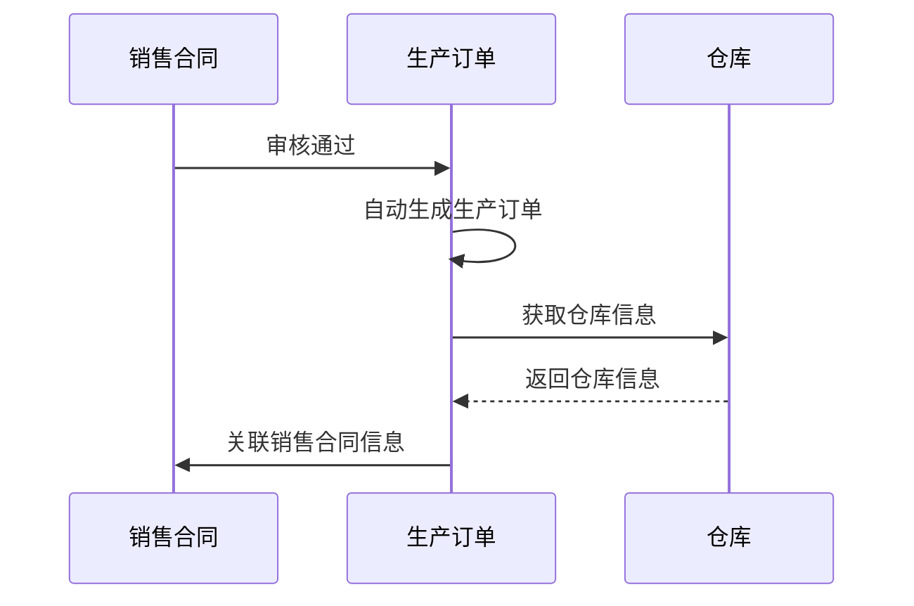
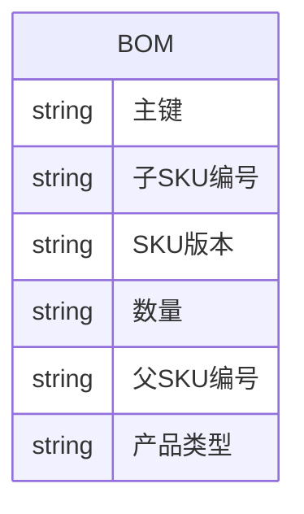
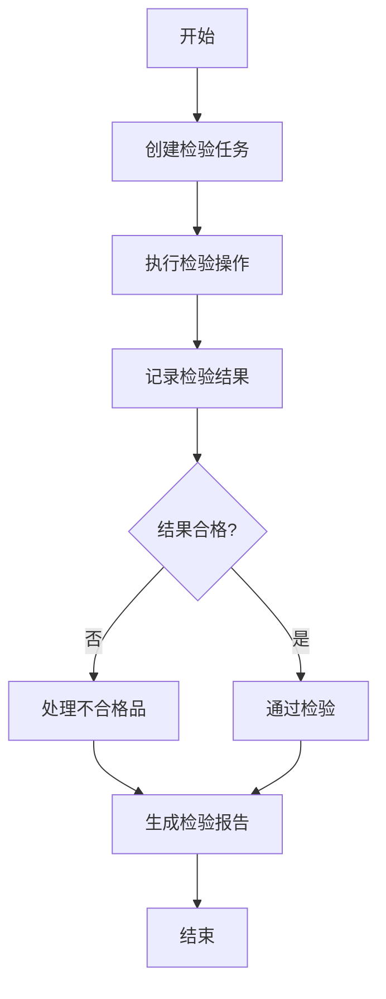
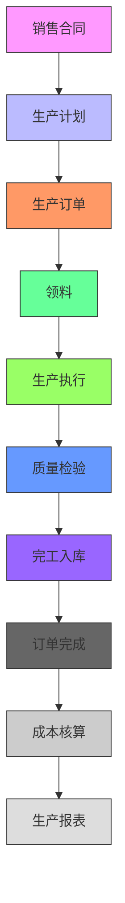

# 制造管理

<cite>
**本文档引用的文件**   
- [ManufactureServiceImpl.java](file://eplus-module-mms/eplus-module-mms-biz/src/main/java/com/syj/eplus/module/mms/service/manufacture/ManufactureServiceImpl.java)
- [ManufactureController.java](file://eplus-module-mms/eplus-module-mms-biz/src/main/java/com/syj/eplus/module/mms/controller/admin/manufacture/ManufactureController.java)
- [ManufactureDO.java](file://eplus-module-mms/eplus-module-mms-biz/src/main/java/com/syj/eplus/module/mms/dal/dataobject/manufacture/ManufactureDO.java)
- [SkuBomServiceImpl.java](file://eplus-module-pms/eplus-module-pms-biz/src/main/java/com/syj/eplus/module/pms/service/skubom/SkuBomServiceImpl.java)
- [SkuBomMapper.java](file://eplus-module-pms/eplus-module-pms-biz/src/main/java/com/syj/eplus/module/pms/dal/mysql/skubom/SkuBomMapper.java)
- [SkuBomDO.java](file://eplus-module-pms/eplus-module-pms-biz/src/main/java/com/syj/eplus/module/pms/dal/dataobject/skubom/SkuBomDO.java)
- [QualityInspectionServiceImpl.java](file://eplus-module-qms/eplus-module-qms-biz/src/main/java/com/syj/eplus/module/qms/service/qualityinspection/QualityInspectionServiceImpl.java)
</cite>

## 目录
1. [简介](#简介)
2. [生产计划与排程](#生产计划与排程)
3. [生产订单生命周期管理](#生产订单生命周期管理)
4. [生产BOM与工艺路线管理](#生产bom与工艺路线管理)
5. [生产执行过程](#生产执行过程)
6. [生产成本核算与报表](#生产成本核算与报表)
7. [制造管理业务流程图](#制造管理业务流程图)

## 简介
制造管理模块是企业生产运营的核心系统，负责管理从生产计划、生产订单到生产执行的完整生产流程。本模块通过集成物料清单（BOM）、工艺路线、质量检验等关键功能，实现对生产过程的全面管控。系统支持产能评估、物料需求计算、生产进度跟踪和工时记录，确保生产活动高效、有序地进行。

## 生产计划与排程

生产计划的创建和排程流程是制造管理的基础，系统通过自动化的方式实现生产计划的智能生成和优化排程。生产计划的创建基于销售合同和客户需求，系统会自动评估产能和计算物料需求。

在生产计划创建过程中，系统会根据销售合同的交货日期、产品规格和数量等信息，结合当前的产能状况和物料库存情况，自动生成生产计划。系统支持对生产计划进行调整和优化，确保生产任务能够按时完成。

生产排程功能会根据生产计划的优先级、设备利用率和人员配置等因素，智能分配生产资源，生成详细的生产排程表。排程表会明确每个生产任务的开始时间、结束时间和负责人，为生产执行提供清晰的指导。

**生产计划与排程流程：**
1. 接收销售合同和客户需求
2. 评估产能和物料库存
3. 生成生产计划
4. 优化生产排程
5. 分配生产资源

**生产计划状态包括：**
- 待处理：生产计划已创建，等待审核
- 已审核：生产计划已通过审核，准备执行
- 执行中：生产计划正在执行
- 已完成：生产计划已全部完成
- 已作废：生产计划被取消

**Section sources**
- [ManufactureServiceImpl.java](file://eplus-module-mms/eplus-module-mms-biz/src/main/java/com/syj/eplus/module/mms/service/manufacture/ManufactureServiceImpl.java#L77-L108)
- [ManufactureController.java](file://eplus-module-mms/eplus-module-mms-biz/src/main/java/com/syj/eplus/module/mms/controller/admin/manufacture/ManufactureController.java#L38-L43)

## 生产订单生命周期管理

生产订单的生命周期管理涵盖了从订单下达、领料、生产到完工的完整过程。系统通过标准化的流程控制，确保每个生产订单都能高效、准确地完成。

### 订单下达
生产订单的创建是生产流程的起点。系统支持手动创建和自动生成两种方式。当销售合同通过审核后，系统会自动创建相应的生产订单。生产订单包含产品信息、数量、交货日期、仓库信息等关键数据。

**Diagram sources**
- [ManufactureServiceImpl.java](file://eplus-module-mms/eplus-module-mms-biz/src/main/java/com/syj/eplus/module/mms/service/manufacture/ManufactureServiceImpl.java#L77-L108)
- [ManufactureController.java](file://eplus-module-mms/eplus-module-mms-biz/src/main/java/com/syj/eplus/module/mms/controller/admin/manufacture/ManufactureController.java#L38-L43)

### 领料管理
领料是生产执行的重要环节。系统会根据生产订单的BOM（物料清单）自动计算所需物料的数量，并生成领料单。领料单会明确列出需要领取的物料名称、规格、数量和仓库位置。

领料流程包括：
1. 根据BOM计算物料需求
2. 生成领料单
3. 仓库备料
4. 生产部门领料
5. 系统更新库存

### 生产执行
生产执行阶段是将原材料转化为成品的过程。系统会实时跟踪生产进度，记录生产过程中的关键数据，如工时、产量、质量等。

生产执行的主要功能包括：
- 生产进度跟踪
- 工时记录
- 质量检验
- 异常处理

### 订单完工
当生产任务完成后，需要进行完工确认。系统会检查生产数量是否与计划数量一致，质量检验是否通过，所有工序是否完成。确认无误后，可以将生产订单标记为"已完成"。

完工流程包括：
1. 生产数量核对
2. 质量检验确认
3. 工序完成检查
4. 完工确认
5. 系统更新订单状态

**生产订单状态包括：**
- 待处理：生产订单已创建，等待执行
- 处理中：生产订单正在执行
- 已完成：生产订单已全部完成
- 已作废：生产订单被取消

**Section sources**
- [ManufactureServiceImpl.java](file://eplus-module-mms/eplus-module-mms-biz/src/main/java/com/syj/eplus/module/mms/service/manufacture/ManufactureServiceImpl.java#L222-L262)
- [ManufactureController.java](file://eplus-module-mms/eplus-module-mms-biz/src/main/java/com/syj/eplus/module/mms/controller/admin/manufacture/ManufactureController.java#L62-L68)

## 生产BOM与工艺路线管理

生产BOM（物料清单）和工艺路线是制造管理的核心基础数据，它们定义了产品的组成结构和生产流程。

### BOM管理
BOM（Bill of Materials）是产品结构的技术文件，详细列出了制造一个产品所需的所有原材料、零部件和组件，以及它们的数量和关系。

系统中的BOM管理功能包括：
- BOM创建：定义产品的组成结构
- BOM维护：更新和修改BOM信息
- BOM版本控制：管理BOM的历史版本
- BOM查询：查看产品的物料组成

BOM数据结构包含以下关键字段：
- 主键：BOM记录的唯一标识
- 子SKU编号：子产品的唯一标识
- SKU版本：产品版本号
- 数量：所需数量
- 父SKU编号：父产品的唯一标识
- 产品类型：产品的分类

**Diagram sources**
- [SkuBomDO.java](file://eplus-module-pms/eplus-module-pms-biz/src/main/java/com/syj/eplus/module/pms/dal/dataobject/skubom/SkuBomDO.java#L1-L55)
- [SkuBomServiceImpl.java](file://eplus-module-pms/eplus-module-pms-biz/src/main/java/com/syj/eplus/module/pms/service/skubom/SkuBomServiceImpl.java#L38-L44)

### 工艺路线管理
工艺路线定义了产品生产的具体流程和工序。它包含了每个工序的加工时间、所需设备、操作人员等信息。

工艺路线管理功能包括：
- 工艺路线创建：定义生产工序和流程
- 工艺路线维护：更新和修改工艺路线
- 工艺路线版本控制：管理工艺路线的历史版本
- 工艺路线查询：查看产品的生产流程

工艺路线与BOM的关系：
- BOM定义了"用什么"：产品的物料组成
- 工艺路线定义了"怎么用"：物料的加工流程

两者共同构成了产品生产的完整技术文件，为生产计划、成本核算和质量控制提供了基础数据支持。

**Section sources**
- [SkuBomServiceImpl.java](file://eplus-module-pms/eplus-module-pms-biz/src/main/java/com/syj/eplus/module/pms/service/skubom/SkuBomServiceImpl.java#L38-L97)
- [SkuBomMapper.java](file://eplus-module-pms/eplus-module-pms-biz/src/main/java/com/syj/eplus/module/pms/dal/mysql/skubom/SkuBomMapper.java#L1-L66)

## 生产执行过程

生产执行过程是将生产计划转化为实际产品的关键阶段，系统通过进度跟踪、质量检验和工时记录等功能，实现对生产过程的全面监控。

### 进度跟踪
生产进度跟踪功能实时监控每个生产订单的执行情况。系统会记录每个工序的开始时间、结束时间和完成数量，生成生产进度报表。

进度跟踪的主要功能包括：
- 实时进度监控
- 工序完成情况记录
- 生产异常预警
- 进度报表生成

### 质量检验
质量检验是确保产品质量的重要环节。系统支持在生产过程中的不同阶段进行质量检验，包括来料检验、过程检验和成品检验。

质量检验流程包括：
1. 创建检验任务
2. 执行检验操作
3. 记录检验结果
4. 处理不合格品
5. 生成检验报告

**Diagram sources**
- [QualityInspectionServiceImpl.java](file://eplus-module-qms/eplus-module-qms-biz/src/main/java/com/syj/eplus/module/qms/service/qualityinspection/QualityInspectionServiceImpl.java#L115-L128)
- [ManufactureServiceImpl.java](file://eplus-module-mms/eplus-module-mms-biz/src/main/java/com/syj/eplus/module/mms/service/manufacture/ManufactureServiceImpl.java#L222-L262)

### 工时记录
工时记录功能用于统计生产过程中的人工成本。系统会记录每个工序的操作人员、开始时间、结束时间和工作时长。

工时记录的主要功能包括：
- 操作人员登记
- 工时自动计算
- 工时异常检测
- 工时报表生成

工时数据是生产成本核算的重要依据，也是评估生产效率的关键指标。

**Section sources**
- [ManufactureServiceImpl.java](file://eplus-module-mms/eplus-module-mms-biz/src/main/java/com/syj/eplus/module/mms/service/manufacture/ManufactureServiceImpl.java#L222-L262)
- [QualityInspectionServiceImpl.java](file://eplus-module-qms/eplus-module-qms-biz/src/main/java/com/syj/eplus/module/qms/service/qualityinspection/QualityInspectionServiceImpl.java#L115-L128)

## 生产成本核算与报表

生产成本核算是制造管理的重要组成部分，系统通过收集和分析生产过程中的各项成本数据，为企业提供准确的成本信息。

### 成本核算方法
生产成本核算采用标准成本法，将生产成本分为直接材料成本、直接人工成本和制造费用三大部分。

**直接材料成本**：根据BOM和实际领料数量计算
**直接人工成本**：根据工时记录和人工费率计算
**制造费用**：包括设备折旧、能源消耗、车间管理等间接成本

成本核算流程：
1. 收集成本数据
2. 分配成本要素
3. 计算单位成本
4. 生成成本报告

### 生产报表概览
系统提供多种生产报表，帮助管理者全面了解生产状况。

主要生产报表包括：
- 生产计划完成率报表
- 生产进度报表
- 质量检验报表
- 工时统计报表
- 成本分析报表

这些报表支持按时间、产品、部门等维度进行筛选和分析，为生产决策提供数据支持。

**Section sources**
- [ManufactureServiceImpl.java](file://eplus-module-mms/eplus-module-mms-biz/src/main/java/com/syj/eplus/module/mms/service/manufacture/ManufactureServiceImpl.java#L182-L219)
- [SkuBomServiceImpl.java](file://eplus-module-pms/eplus-module-pms-biz/src/main/java/com/syj/eplus/module/pms/service/skubom/SkuBomServiceImpl.java#L74-L77)

## 制造管理业务流程图

以下是典型生产场景的完整业务流程图：

**Diagram sources**
- [ManufactureServiceImpl.java](file://eplus-module-mms/eplus-module-mms-biz/src/main/java/com/syj/eplus/module/mms/service/manufacture/ManufactureServiceImpl.java)
- [SkuBomServiceImpl.java](file://eplus-module-pms/eplus-module-pms-biz/src/main/java/com/syj/eplus/module/pms/service/skubom/SkuBomServiceImpl.java)
- [QualityInspectionServiceImpl.java](file://eplus-module-qms/eplus-module-qms-biz/src/main/java/com/syj/eplus/module/qms/service/qualityinspection/QualityInspectionServiceImpl.java)

该流程图展示了从销售合同到生产报表的完整制造管理流程，涵盖了生产计划、生产订单、生产执行等核心环节，体现了各功能模块之间的协同关系。