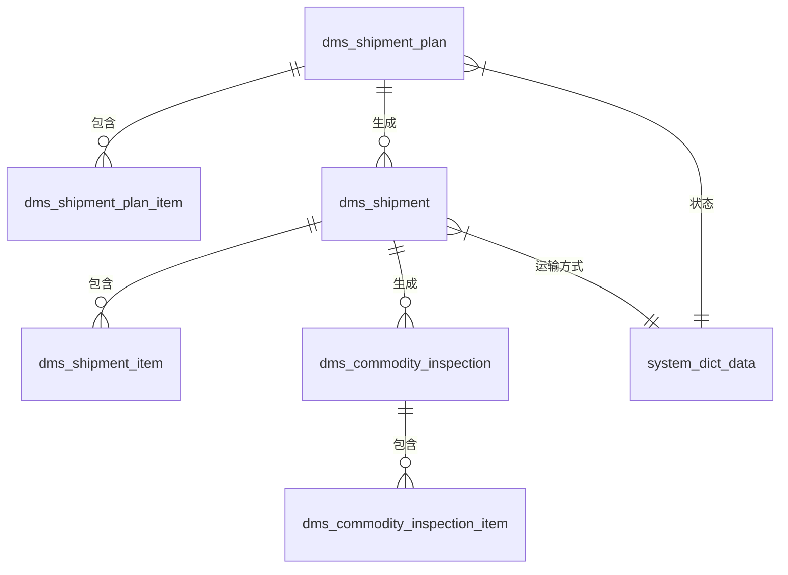
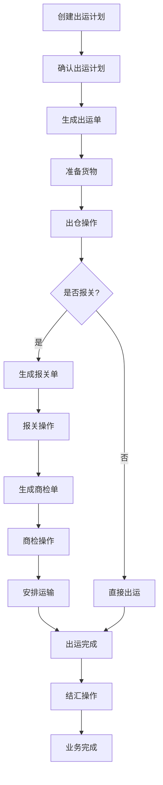

# 单证管理

<cite>
**本文档引用文件**  
- [ShipmentPlanController.java](file://eplus-module-dms/eplus-module-dms-biz/src/main/java/com/syj/eplus/module/dms/controller/admin/shipmentplan/ShipmentPlanController.java)
- [ShipmentPlanService.java](file://eplus-module-dms/eplus-module-dms-biz/src/main/java/com/syj/eplus/module/dms/service/shipmentplan/ShipmentPlanService.java)
- [ShipmentPlanApi.java](file://eplus-module-dms/eplus-module-dms-api/src/main/java/com/syj/eplus/module/dms/enums/api/ShipmentPlanApi.java)
- [ShipmentApi.java](file://eplus-module-dms/eplus-module-dms-api/src/main/java/com/syj/eplus/module/dms/enums/api/ShipmentApi.java)
- [V1_0_0_002__Eplus初始化.sql](file://eplus-flyway/src/main/resources/db/migration/common/V1_0_0_002__Eplus初始化.sql)
- [R__字典相关.sql](file://eplus-flyway/src/main/resources/db/migration/common/R__字典相关.sql)
- [PushOutShipmentPlanResp.java](file://eplus-module-sms/eplus-module-sms-biz/src/main/java/com/syj/eplus/module/sms/controller/admin/salecontract/vo/PushOutShipmentPlanResp.java)
</cite>

## 目录
1. [引言](#引言)
2. [出运计划管理](#出运计划管理)
3. [出运明细管理](#出运明细管理)
4. [报关单与商检单管理](#报关单与商检单管理)
5. [单证状态机与审批流程](#单证状态机与审批流程)
6. [出运业务流程](#出运业务流程)
7. [单证模板与打印管理](#单证模板与打印管理)
8. [结论](#结论)

## 引言
单证管理模块是外贸业务系统中的核心组成部分，负责管理出运计划、出运明细、报关单、商检单等关键出口单证。该模块实现了从出运计划创建到出运完成的全流程管理，支持与销售合同、采购合同的关联，以及价格条款、运输方式等关键信息的配置。通过完善的审批流程和状态机机制，确保了单证处理的规范性和可追溯性。

## 出运计划管理

出运计划管理是出口业务的起点，负责规划和组织货物的出运安排。系统通过出运计划单（`dms_shipment_plan`）记录计划的核心信息。

### 出运计划创建流程
出运计划的创建通过 `ShipmentPlanApi` 接口的 `createShipmentPlan` 方法实现。创建时需要提供包含以下关键信息的请求参数：
- **价格条款**：通过 `settlement_term_type` 字段配置，如FOB、CIF等
- **运输方式**：通过 `transport_type` 字段配置，如海运、空运等
- **客户信息**：包括客户编号、名称、收货人、通知人等
- **货物信息**：包括产品编号、数量、箱数、毛重、净重、体积等
- **合同关联**：关联销售合同和采购合同信息

创建成功后，系统返回创建的出运计划编号列表。

### 出运计划确认流程
出运计划创建后需要经过确认流程才能生效。确认流程包括：
1. **信息审核**：核对计划中的各项信息是否准确完整
2. **状态变更**：将计划状态从"待确认"变更为"待出运"
3. **审批流程**：根据企业规则进行多级审批

在数据库中，出运计划状态通过字典表 `shipping_plan_status` 进行管理，其中状态值"4"表示"待确认"，"5"表示"待出运"。

**Section sources**
- [ShipmentPlanApi.java](file://eplus-module-dms/eplus-module-dms-api/src/main/java/com/syj/eplus/module/dms/enums/api/ShipmentPlanApi.java#L14-L21)
- [V1_0_0_002__Eplus初始化.sql](file://eplus-flyway/src/main/resources/db/migration/common/V1_0_0_002__Eplus初始化.sql#L3019-L3121)
- [R__字典相关.sql](file://eplus-flyway/src/main/resources/db/migration/common/R__字典相关.sql#L556-L557)

## 出运明细管理

出运明细管理负责记录具体的出运货物信息，并与销售合同、采购合同建立关联关系。

### 出运明细与合同关联
出运明细通过以下字段与相关合同建立关联：
- **销售合同关联**：通过 `sale_contract_code` 字段关联外销合同
- **采购合同关联**：通过 `purchase_contract_code` 字段关联采购合同
- **客户信息关联**：通过 `cust_id`、`cust_code`、`cust_name` 字段关联客户信息

系统提供了 `ShipmentApi` 接口，支持根据销售合同号、客户编号、供应商编号等条件查询未完成的出运明细列表，便于业务人员跟踪合同执行情况。

### 出运明细关键信息
出运明细记录了详细的货物信息，主要包括：
- **数量信息**：采购数量、销售数量、报关数量等
- **价格信息**：销售单价、采购单价、报关单价等
- **包装信息**：外箱装量、内盒装量、箱数、外箱尺寸等
- **重量体积**：外箱毛重、总毛重、外箱净重、总净重、总体积等
- **报关信息**：HS编码、报关中文品名、报关英文品名、计量单位等

**Section sources**
- [ShipmentApi.java](file://eplus-module-dms/eplus-module-dms-api/src/main/java/com/syj/eplus/module/dms/enums/api/ShipmentApi.java#L22-L232)
- [V1_0_0_002__Eplus初始化.sql](file://eplus-flyway/src/main/resources/db/migration/common/V1_0_0_002__Eplus初始化.sql#L3202-L3272)

## 报关单与商检单管理

报关单和商检单是出口业务中的重要单证，系统提供了专门的管理功能。

### 报关单管理
报关单管理功能主要通过 `dms_shipment` 表和相关接口实现。报关单的关键信息包括：
- **报关单位**：通过 `declaration_unit` 字段记录
- **已报关数**：通过 `declared_quantity` 字段记录
- **报关状态**：通过 `declaration_flag` 字段标识是否已报关

系统通过字典表 `customs_declaration_print_type` 管理报关单相关类型，其中"4"表示"报关单"，"5"表示"报关合同"。

### 商检单管理
商检单管理功能通过 `dms_commodity_inspection` 和 `dms_commodity_inspection_item` 表实现。商检单的关键信息包括：
- **商检类型**：通过 `commodity_inspection_type` 字段配置
- **正面唛头**：通过 `shipping_mark` 字段记录
- **收货人和通知人**：通过 `receive_person` 和 `notify_person` 字段记录

系统通过字典表 `commodity_inspection_print_type` 管理商检单相关类型，其中"1"表示"商检合同"，"2"表示"商检单"，"3"表示"商检装箱单"，"4"表示"商检发票"。

**Diagram sources**
- [V1_0_0_002__Eplus初始化.sql](file://eplus-flyway/src/main/resources/db/migration/common/V1_0_0_002__Eplus初始化.sql#L3019-L3426)
- [R__字典相关.sql](file://eplus-flyway/src/main/resources/db/migration/common/R__字典相关.sql#L550-L557)

**Section sources**
- [V1_0_0_002__Eplus初始化.sql](file://eplus-flyway/src/main/resources/db/migration/common/V1_0_0_002__Eplus初始化.sql#L3274-L3426)
- [R__字典相关.sql](file://eplus-flyway/src/main/resources/db/migration/common/R__字典相关.sql#L550-L553)

## 单证状态机与审批流程

系统通过状态机和审批流程确保单证处理的规范性和可控性。

### 单证状态机
各类单证都有明确的状态流转机制：
- **出运计划状态**：包括"待确认"、"待出运"等状态
- **出运单状态**：通过 `status` 字段管理，具体状态值需参考系统字典
- **报关状态**：通过 `declaration_flag` 字段标识是否已报关
- **结汇状态**：通过 `settle_order_flag` 字段标识是否已转结汇单

### 审批流程
系统支持对关键单证进行审批管理：
- **审核操作**：通过 `ShipmentPlanController` 的 `closeShipmentPlan` 方法实现作废操作
- **反审核操作**：通过 `antiAudit` 方法实现反审核功能
- **权限控制**：通过 `@PreAuthorize` 注解实现基于权限的访问控制

审批流程与工作流系统集成，支持自定义审批规则和多级审批。

**Section sources**
- [ShipmentPlanController.java](file://eplus-module-dms/eplus-module-dms-biz/src/main/java/com/syj/eplus/module/dms/controller/admin/shipmentplan/ShipmentPlanController.java#L114-L133)
- [ShipmentPlanService.java](file://eplus-module-dms/eplus-module-dms-biz/src/main/java/com/syj/eplus/module/dms/service/shipmentplan/ShipmentPlanService.java#L78-L82)
- [R__字典相关.sql](file://eplus-flyway/src/main/resources/db/migration/common/R__字典相关.sql#L556-L557)

## 出运业务流程

出运业务流程涵盖了从计划到出运完成的完整过程。

**Diagram sources**
- [ShipmentPlanController.java](file://eplus-module-dms/eplus-module-dms-biz/src/main/java/com/syj/eplus/module/dms/controller/admin/shipmentplan/ShipmentPlanController.java)
- [ShipmentPlanService.java](file://eplus-module-dms/eplus-module-dms-biz/src/main/java/com/syj/eplus/module/dms/service/shipmentplan/ShipmentPlanService.java)

## 单证模板与打印管理

系统提供了灵活的单证模板和打印管理功能。

### 单证模板管理
系统支持多种单证模板的管理：
- **报关单模板**：用于打印报关单
- **商检单模板**：用于打印商检单
- **装箱单模板**：用于打印装箱单
- **发票模板**：用于打印商业发票

模板管理通过报表模块实现，支持模板的设计、预览和发布。

### 单证打印功能
单证打印功能通过 `ShipmentPlanService` 的 `exportExcel` 方法实现：
- **导出功能**：支持将出运计划导出为Excel文件
- **模板选择**：通过 `reportCode` 参数指定使用的模板
- **批量导出**：支持批量导出多个单证

打印时可以关联订单流编号，便于后续跟踪和管理。

**Section sources**
- [ShipmentPlanService.java](file://eplus-module-dms/eplus-module-dms-biz/src/main/java/com/syj/eplus/module/dms/service/shipmentplan/ShipmentPlanService.java#L76-L77)
- [PushOutShipmentPlanResp.java](file://eplus-module-sms/eplus-module-sms-biz/src/main/java/com/syj/eplus/module/sms/controller/admin/salecontract/vo/PushOutShipmentPlanResp.java#L168-L169)

## 结论
单证管理模块通过完善的出运计划、出运明细、报关单、商检单等核心单证的管理功能，实现了出口业务的全流程数字化管理。系统支持灵活的价格条款和运输方式配置，建立了与销售合同、采购合同的紧密关联，通过状态机和审批流程确保了业务处理的规范性。同时，丰富的单证模板和打印功能满足了实际业务中的各种文档需求，为外贸业务的高效运作提供了有力支持。