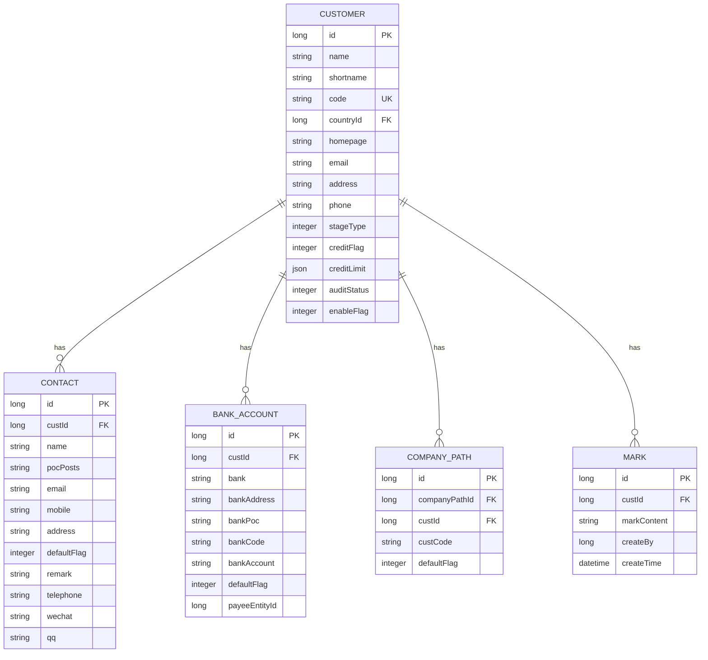

# 客户关系管理

<cite>
**本文档引用文件**  
- [CustApi.java](file://eplus-module-crm/eplus-module-crm-api/src/main/java/com/syj/eplus/module/crm/api/cust/CustApi.java)
- [CustDO.java](file://eplus-module-crm/eplus-module-crm-biz/src/main/java/com/syj/eplus/module/crm/dal/dataobject/cust/CustDO.java)
- [CustAllDTO.java](file://eplus-module-crm/eplus-module-crm-api/src/main/java/com/syj/eplus/module/crm/api/cust/dto/CustAllDTO.java)
- [CrmCategoryApi.java](file://eplus-module-crm/eplus-module-crm-api/src/main/java/com/syj/eplus/module/crm/api/category/CrmCategoryApi.java)
- [CustCompanyPath.java](file://eplus-module-crm/eplus-module-crm-biz/src/main/java/com/syj/eplus/module/crm/dal/dataobject/custcompanypath/CustCompanyPath.java)
- [CustBankaccountDO.java](file://eplus-module-crm/eplus-module-crm-biz/src/main/java/com/syj/eplus/module/crm/dal/dataobject/custbankaccount/CustBankaccountDO.java)
- [CustPocDO.java](file://eplus-module-crm/eplus-module-crm-biz/src/main/java/com/syj/eplus/module/crm/dal/dataobject/custpoc/CustPocDO.java)
- [CustomerStageEnum.java](file://eplus-module-crm/eplus-module-crm-api/src/main/java/com/syj/eplus/module/crm/enums/cust/CustomerStageEnum.java)
- [CustServiceImpl.java](file://eplus-module-crm/eplus-module-crm-biz/src/main/java/com/syj/eplus/module/crm/service/cust/CustServiceImpl.java)
- [CustController.java](file://eplus-module-crm/eplus-module-crm-biz/src/main/java/com/syj/eplus/module/crm/controller/admin/cust/CustController.java)
</cite>

## 目录
1. [客户主数据结构](#客户主数据结构)
2. [客户分类体系](#客户分类体系)
3. [客户路径管理](#客户路径管理)
4. [客户信用管理](#客户信用管理)
5. [客户生命周期管理](#客户生命周期管理)
6. [客户业务流程](#客户业务流程)
7. [客户数据模型](#客户数据模型)

## 客户主数据结构

客户主数据是客户关系管理系统的核心，包含了客户的基本信息、联系人信息、银行账户信息等关键数据。客户主数据通过`CustDO`类进行定义，该类继承自`BaseDO`，并实现了`ModelKeyHolder`和`ChangeExInterface`接口。

客户基本信息包括企业名称、简称、客户编号、国家编码、官网、电子邮件等。客户类型支持多选，包括电商、进口商、零售商、贸易商、批发商、售后公司和邮购商等。客户阶段分为潜在客户、正式客户和退休客户。系统还支持记录客户的营业地址、联系电话、运输方式、价格条款、开票抬头、税率等详细信息。

客户主数据还包含业务员信息、信用额度设置、中信保标识、附件和图片等扩展信息。系统支持多个业务员共同跟进客户，通过`managerIds`字段存储业务员ID列表。信用管理方面，系统支持启用或禁用信用额度，并可设置具体的信用额度值。

**客户变更管理**是客户主数据的重要特性，通过`changeFlag`、`changeStatus`和`ver`字段实现版本控制。当客户信息发生变更时，系统会创建新的版本，保留历史记录，确保数据的可追溯性。系统还支持关联客户，通过`custLinkCode`字段建立客户之间的关联关系。

**Section sources**
- [CustDO.java](file://eplus-module-crm/eplus-module-crm-biz/src/main/java/com/syj/eplus/module/crm/dal/dataobject/cust/CustDO.java#L37-L261)
- [CustAllDTO.java](file://eplus-module-crm/eplus-module-crm-api/src/main/java/com/syj/eplus/module/crm/api/cust/dto/CustAllDTO.java#L16-L206)

## 客户分类体系

客户分类体系通过`CrmCategoryApi`接口提供服务，支持根据分类ID列表获取分类名称映射。该体系为客户提供了一种灵活的分类管理方式，便于企业根据不同的业务需求对客户进行分组和管理。

分类体系的设计遵循了模块化和可扩展的原则，通过`getCategoryNameMap`方法提供基础的分类查询功能。该方法接收分类ID列表作为参数，返回分类ID到名称的映射关系，支持批量查询，提高了系统的查询效率。

客户分类不仅用于数据展示，还与权限控制、报表统计等功能紧密结合。通过分类体系，企业可以实现对不同类别客户的差异化管理，如设置不同的信用政策、服务标准等。分类信息还可以用于客户分析，帮助企业识别高价值客户群体，优化营销策略。

**Section sources**
- [CrmCategoryApi.java](file://eplus-module-crm/eplus-module-crm-api/src/main/java/com/syj/eplus/module/crm/api/category/CrmCategoryApi.java#L11-L22)

## 客户路径管理

客户路径管理通过`CustCompanyPath`实体类实现，用于管理客户与公司路径之间的关系。该实体建立了客户与公司运营路径的关联，支持多公司路径的客户管理。

`CustCompanyPath`类包含主键`id`、公司路径主键`companyPathId`、客户ID`custId`、客户编号`custCode`和默认标识`defaultFlag`等字段。其中，`defaultFlag`字段用于标识该路径是否为客户的默认路径，便于系统在业务处理时选择合适的路径。

客户路径管理支持一个客户关联多个公司路径，满足了企业多业务线、多区域运营的需求。通过路径管理，企业可以为同一客户在不同业务场景下配置不同的处理流程和权限设置。例如，一个客户可能在进口业务中使用一条路径，在出口业务中使用另一条路径。

路径管理还与审批流程集成，当客户路径发生变更时，系统会触发相应的审批流程，确保变更的合规性。这种设计既保证了业务灵活性，又维护了数据的完整性和安全性。

**Section sources**
- [CustCompanyPath.java](file://eplus-module-crm/eplus-module-crm-biz/src/main/java/com/syj/eplus/module/crm/dal/dataobject/custcompanypath/CustCompanyPath.java#L28-L60)

## 客户信用管理

客户信用管理是客户关系管理的重要组成部分，通过`creditFlag`和`creditLimit`字段实现。系统支持启用或禁用信用额度，当`creditFlag`为1时启用信用额度，为0时禁用。

信用额度通过`JsonAmount`类型存储，支持多币种信用额度设置。`JsonAmount`是一个复合数据类型，包含金额值和币种信息，满足了跨国业务中多币种结算的需求。信用管理与财务系统紧密集成，当客户发生交易时，系统会实时检查信用额度使用情况，防止超信用交易。

系统还支持将客户标记为中信保客户，通过`zxbquotaFlag`字段标识。这一特性对于风险管理尤为重要，帮助企业识别受中信保保障的客户，优化信用政策。信用管理信息还与客户评级、风险评估等功能联动，为企业的财务决策提供支持。

信用管理遵循严格的变更控制流程，任何信用额度的调整都需要经过审批，确保变更的合规性和可追溯性。系统记录每次信用额度变更的历史，包括变更前后的值、变更时间、操作人等信息，满足了审计要求。

**Section sources**
- [CustDO.java](file://eplus-module-crm/eplus-module-crm-biz/src/main/java/com/syj/eplus/module/crm/dal/dataobject/cust/CustDO.java#L130-L135)
- [CustRespVO.java](file://eplus-module-crm/eplus-module-crm-biz/src/main/java/com/syj/eplus/module/crm/controller/admin/cust/vo/CustRespVO.java#L120-L127)

## 客户生命周期管理

客户生命周期管理通过`CustomerStageEnum`枚举实现，定义了客户在企业业务中的不同阶段。当前系统支持四个客户阶段：线索客户（LEAD_CUSTOMERS）、普通客户（ORDINARY_CUSTOMERS）、重要客户（KEY_CUSTOMERS）和失效客户（LAPSED_CUSTOMERS）。

生命周期管理与客户转化流程紧密结合。新客户通常从"线索客户"阶段开始，经过业务跟进和评估后，可以转化为"普通客户"。对于业务量大、战略价值高的客户，可以升级为"重要客户"，享受更优质的服务和更灵活的信用政策。当客户长期无业务往来或主动终止合作时，可以标记为"失效客户"，便于企业进行客户资源优化。

生命周期状态直接影响客户的权限和待遇。例如，重要客户可能享有优先处理、专属客户经理等特权。系统还支持基于生命周期阶段的自动化营销，如向线索客户发送产品介绍，向失效客户发送召回优惠等。

生命周期变更需要经过审批流程，确保变更的合理性和合规性。系统记录客户在各阶段的停留时间，为销售效率分析、客户转化率计算等提供数据支持。这种精细化的生命周期管理有助于企业优化客户结构，提高客户价值。

**Section sources**
- [CustomerStageEnum.java](file://eplus-module-crm/eplus-module-crm-api/src/main/java/com/syj/eplus/module/crm/enums/cust/CustomerStageEnum.java#L13-L32)

## 客户业务流程

客户业务流程包括客户认领、客户变更等核心操作，通过`CustServiceImpl`和`CustController`类实现。这些流程遵循严格的审批机制，确保数据变更的合规性和可追溯性。

**客户变更流程**是核心业务流程之一，当客户信息需要更新时，用户提交变更申请，系统创建变更版本。变更流程通过`getChangeEffect`方法评估变更影响，识别可能受影响的业务单据和关联数据。变更提交后，系统启动审批工作流，审批通过后才正式更新客户信息。

**客户认领流程**允许业务员认领潜在客户或公共客户。认领操作会更新客户的业务员信息，并可能触发客户阶段的变更。系统记录认领历史，包括认领时间、原业务员、新业务员等信息，便于团队管理和绩效考核。

所有客户业务流程都与操作日志系统集成，记录操作人、操作时间、操作内容等详细信息。关键操作如客户删除、信用额度调整等还需要多级审批，确保数据安全。流程状态通过`auditStatus`字段跟踪，支持查询当前处理环节和审批进度。

**Section sources**
- [CustServiceImpl.java](file://eplus-module-crm/eplus-module-crm-biz/src/main/java/com/syj/eplus/module/crm/service/cust/CustServiceImpl.java#L103-L200)
- [CustController.java](file://eplus-module-crm/eplus-module-crm-biz/src/main/java/com/syj/eplus/module/crm/controller/admin/cust/CustController.java#L241-L293)

## 客户数据模型

**Diagram sources**
- [CustDO.java](file://eplus-module-crm/eplus-module-crm-biz/src/main/java/com/syj/eplus/module/crm/dal/dataobject/cust/CustDO.java)
- [CustPocDO.java](file://eplus-module-crm/eplus-module-crm-biz/src/main/java/com/syj/eplus/module/crm/dal/dataobject/custpoc/CustPocDO.java)
- [CustBankaccountDO.java](file://eplus-module-crm/eplus-module-crm-biz/src/main/java/com/syj/eplus/module/crm/dal/dataobject/custbankaccount/CustBankaccountDO.java)
- [CustCompanyPath.java](file://eplus-module-crm/eplus-module-crm-biz/src/main/java/com/syj/eplus/module/crm/dal/dataobject/custcompanypath/CustCompanyPath.java)
- [MarkDO.java](file://eplus-module-crm/eplus-module-crm-biz/src/main/java/com/syj/eplus/module/crm/dal/dataobject/mark/MarkDO.java)