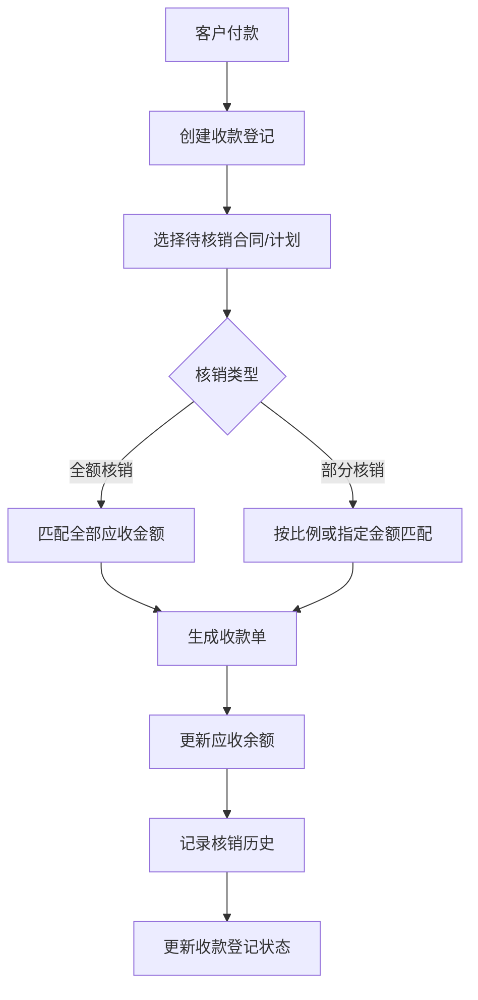
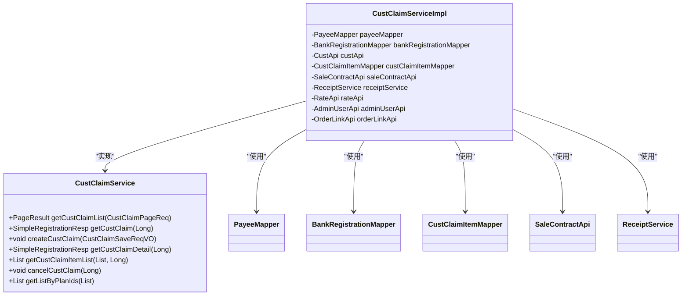
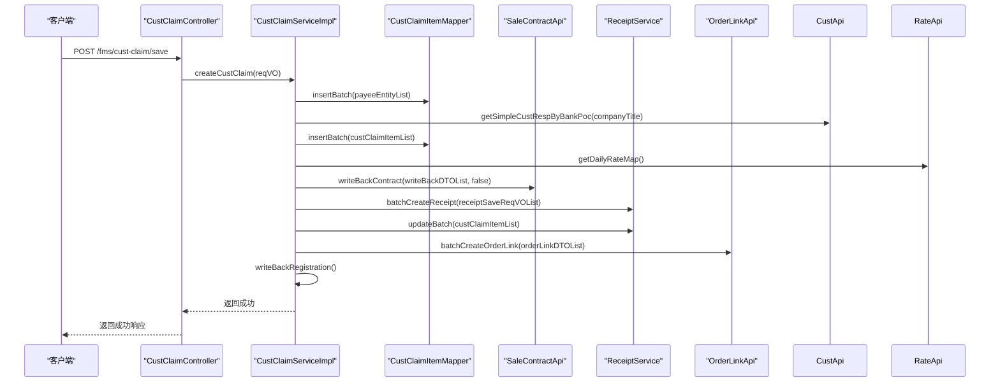
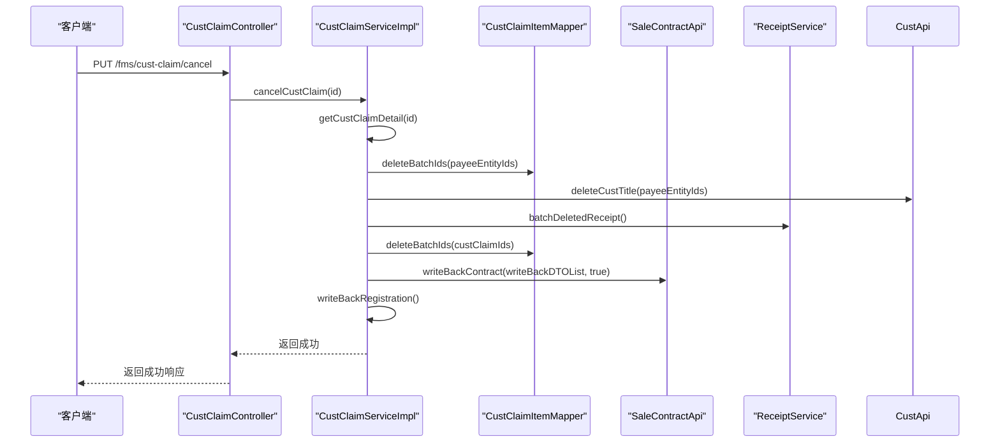
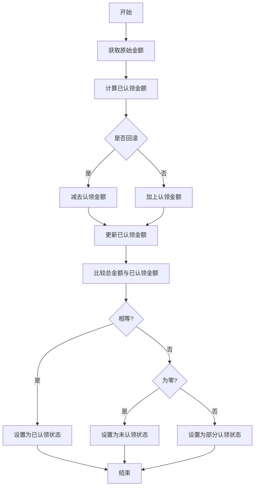
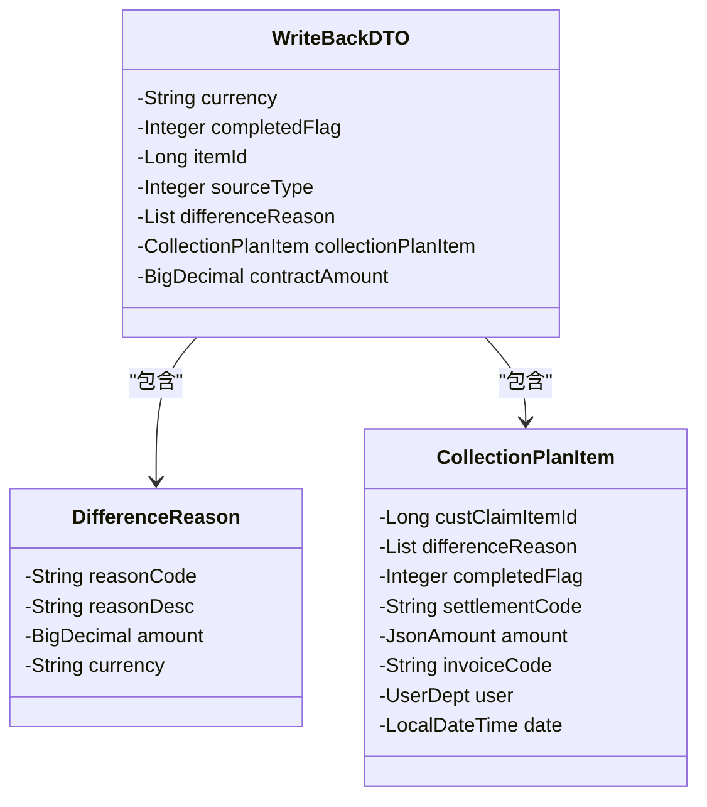
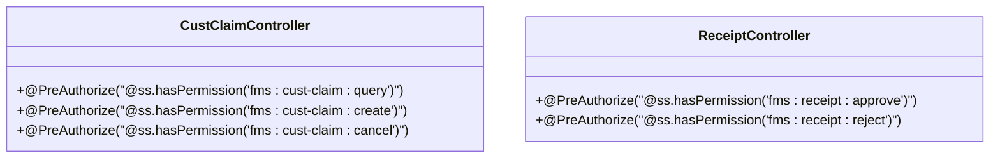
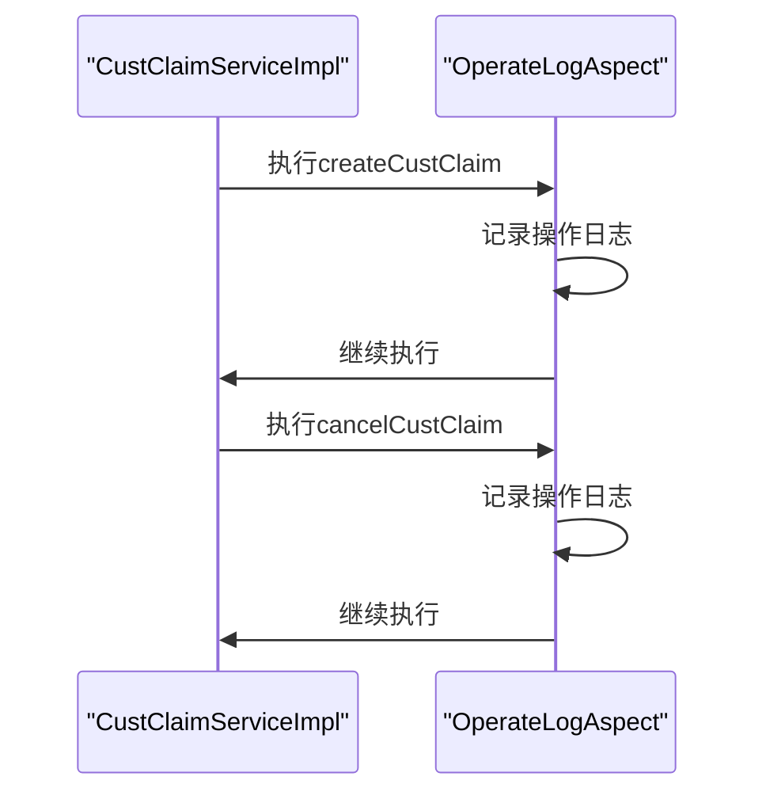
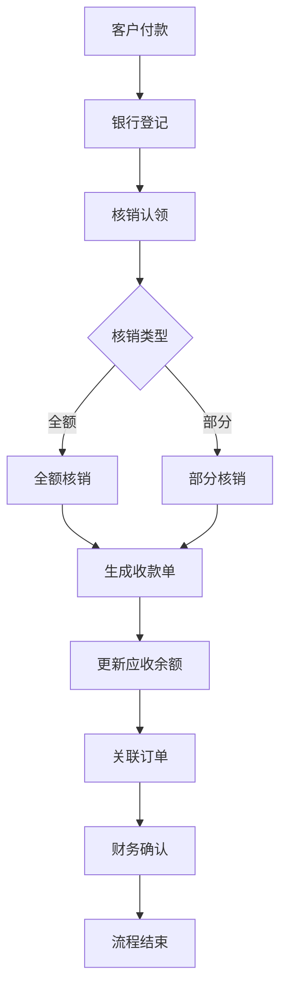

# 应收核销

<cite>
**本文档引用文件**  
- [CustClaimServiceImpl.java](file://eplus-module-fms/eplus-module-fms-biz/src/main/java/com/syj/eplus/module/fms/service/custclaim/CustClaimServiceImpl.java)
- [CustClaimItem.java](file://eplus-module-fms/eplus-module-fms-biz/src/main/java/com/syj/eplus/module/fms/dal/dataobject/custclaim/CustClaimItem.java)
- [CustClaimController.java](file://eplus-module-fms/eplus-module-fms-biz/src/main/java/com/syj/eplus/module/fms/controller/admin/custclaim/CustClaimController.java)
- [CustClaimItemMapper.java](file://eplus-module-fms/eplus-module-fms-biz/src/main/java/com/syj/eplus/module/fms/dal/mysql/custclaim/CustClaimItemMapper.java)
- [BankRegistrationDO.java](file://eplus-module-fms/eplus-module-fms-biz/src/main/java/com/syj/eplus/module/fms/dal/dataobject/bankregistration/BankRegistrationDO.java)
- [ReceiptDO.java](file://eplus-module-fms/eplus-module-fms-biz/src/main/java/com/syj/eplus/module/fms/dal/dataobject/receipt/ReceiptDO.java)
- [ReceiptService.java](file://eplus-module-fms/eplus-module-fms-biz/src/main/java/com/syj/eplus/module/fms/service/receipt/ReceiptService.java)
- [SaleContractApi.java](file://eplus-module-sms/eplus-module-sms-biz/src/main/java/com/syj/eplus/module/sms/api/SaleContractApi.java)
- [OrderLinkApi.java](file://eplus-module-infra/eplus-module-infra-biz/src/main/java/com/syj/eplus/module/infra/api/orderlink/OrderLinkApi.java)
</cite>

## 目录
1. [引言](#引言)
2. [应收核销流程概述](#应收核销流程概述)
3. [核心组件分析](#核心组件分析)
4. [核销处理逻辑](#核销处理逻辑)
5. [余额计算与差异处理](#余额计算与差异处理)
6. [API接口文档](#api接口文档)
7. [权限控制与审计日志](#权限控制与审计日志)
8. [业务流程图](#业务流程图)
9. [结论](#结论)

## 引言
应收核销是企业财务管理中的关键环节，用于将客户付款与应收账款进行匹配和抵消。本文档全面介绍应收核销的流程和规则，包括部分核销和全额核销的处理逻辑、金额匹配、币种转换等细节。同时，文档还详细说明了核销记录的生成机制、状态管理以及与收款登记的关联关系。

## 应收核销流程概述
应收核销流程从客户付款登记开始，经过认领、核销到最终生成收款单的完整过程。系统通过收款登记单记录客户的付款信息，然后通过认领操作将付款金额分配到具体的销售合同或收款计划上，最终完成核销并更新相关财务数据。

**应收核销流程图**


**流程图来源**
- [CustClaimServiceImpl.java](file://eplus-module-fms/eplus-module-fms-biz/src/main/java/com/syj/eplus/module/fms/service/custclaim/CustClaimServiceImpl.java#L218-L384)

## 核心组件分析

### 核销服务组件
应收核销的核心服务由`CustClaimService`接口及其实现类`CustClaimServiceImpl`提供。该服务负责处理核销的创建、查询和取消操作。



**类图来源**
- [CustClaimService.java](file://eplus-module-fms/eplus-module-fms-biz/src/main/java/com/syj/eplus/module/fms/service/custclaim/CustClaimService.java#L17-L31)
- [CustClaimServiceImpl.java](file://eplus-module-fms/eplus-module-fms-biz/src/main/java/com/syj/eplus/module/fms/service/custclaim/CustClaimServiceImpl.java#L57-L83)

### 核销数据对象
核销相关的数据对象主要包括客户认领明细、收款登记和收款单等。

```mermaid
classDiagram
class CustClaimItem {
-String contractCode
-String custCode
-String currency
-BigDecimal receivableAmount
-BigDecimal receivedAmount
-BigDecimal claimedAmount
-BigDecimal contractAmount
-BigDecimal differenceAmount
-Integer completedFlag
-UserDept claimPerson
-LocalDateTime claimDate
-List<DifferenceReason> differenceReason
-Long registrationId
-Long itemId
-String source
-Integer type
-Integer otherFeeType
-String receiptCode
-JsonAmount financeAmount
-List<DifferenceReason> hisDifferenceReason
-String invoiceCode
-BigDecimal collectionRatio
-Integer saleType
-String remark
}
class BankRegistrationDO {
-String code
-UserDept registeredBy
-LocalDateTime registrationDate
-Long companyId
-String companyName
-String companyTitle
-LocalDateTime bankPostingDate
-String bank
-String bankAccount
-String bankAddress
-String bankPoc
-String bankCode
-String currency
-BigDecimal amount
-String remark
-String custCode
-String custName
-UserDept manager
-UserDept claimManager
-Integer claimStatus
-LocalDateTime claimDate
-String linkSaleContractCode
-BigDecimal claimedAmount
-Integer status
-List<UserDept> managerList
-List<SimpleData> custList
}
class ReceiptDO {
-String code
-Integer printFlag
-Integer printTimes
-Integer auditStatus
-Long companyId
-String bank
-String bankAddress
-String bankAccount
-String bankPoc
-String bankCode
-JsonAmount amount
-JsonAmount rate
-LocalDateTime receiptTime
-String remark
-UserDept receiptUser
-UserDept approver
-LocalDateTime approvalTime
-Integer businessType
-String businessCode
-Integer businessSubjectType
-String businessSubjectCode
-Integer status
-Integer receiptType
-Integer custClaimId
}
CustClaimItem --> BankRegistrationDO : "关联"
ReceiptDO --> CustClaimItem : "关联"
```



**类图来源**
- [CustClaimItem.java](file://eplus-module-fms/eplus-module-fms-biz/src/main/java/com/syj/eplus/module/fms/dal/dataobject/custclaim/CustClaimItem.java#L33-L182)
- [BankRegistrationDO.java](file://eplus-module-fms/eplus-module-fms-biz/src/main/java/com/syj/eplus/module/fms/dal/dataobject/bankregistration/BankRegistrationDO.java#L34-L157)
- [ReceiptDO.java](file://eplus-module-fms/eplus-module-fms-biz/src/main/java/com/syj/eplus/module/fms/dal/dataobject/receipt/ReceiptDO.java#L31-L148)

## 核销处理逻辑

### 核销创建流程
核销创建流程包括收款对象信息的插入、客户编号的获取、认领明细的处理、收款计划的回写、收款单的创建以及订单关联的建立。



**序列图来源**
- [CustClaimServiceImpl.java](file://eplus-module-fms/eplus-module-fms-biz/src/main/java/com/syj/eplus/module/fms/service/custclaim/CustClaimServiceImpl.java#L218-L306)

### 核销取消流程
核销取消流程包括删除收款对象、删除回写抬头、删除收款单、删除认领明细、回写收款计划以及回写登记单已认领金额。



**序列图来源**
- [CustClaimServiceImpl.java](file://eplus-module-fms/eplus-module-fms-biz/src/main/java/com/syj/eplus/module/fms/service/custclaim/CustClaimServiceImpl.java#L352-L384)

## 余额计算与差异处理

### 余额计算规则
系统在核销过程中会实时计算和更新各种余额，包括已认领金额、剩余未收金额等。



**流程图来源**
- [CustClaimServiceImpl.java](file://eplus-module-fms/eplus-module-fms-biz/src/main/java/com/syj/eplus/module/fms/service/custclaim/CustClaimServiceImpl.java#L405-L449)

### 差异处理策略
在核销过程中，系统会处理各种差异情况，包括币种转换差异、金额匹配差异等。



**类图来源**
- [CustClaimItem.java](file://eplus-module-fms/eplus-module-fms-biz/src/main/java/com/syj/eplus/module/fms/dal/dataobject/custclaim/CustClaimItem.java#L119-L120)
- [CustClaimServiceImpl.java](file://eplus-module-fms/eplus-module-fms-biz/src/main/java/com/syj/eplus/module/fms/service/custclaim/CustClaimServiceImpl.java#L261-L262)

## API接口文档

### 请求参数说明
| 参数名称 | 类型 | 必填 | 描述 |
|--------|------|------|------|
| id | Long | 是 | 登记单ID |
| companyId | Long | 是 | 内部法人单位 |
| registeredBy | UserDept | 是 | 登记人 |
| companyTitle | String | 是 | 公司抬头 |
| payeeEntityList | List<PayeeEntity> | 是 | 收款对象信息列表 |
| custClaimItemList | List<CustClaimItem> | 是 | 认领明细列表 |

**参数来源**
- [CustClaimSaveReqVO.java](file://eplus-module-fms/eplus-module-fms-biz/src/main/java/com/syj/eplus/module/fms/controller/admin/custclaim/vo/CustClaimSaveReqVO.java#L16-L45)

### 响应格式说明
```json
{
  "code": 0,
  "msg": "成功",
  "data": true
}
```

### 错误码说明
| 错误码 | 描述 | 解决方案 |
|-------|------|--------|
| BANK_REGISTRATION_NOT_EXISTS | 收款登记不存在 | 检查登记单ID是否正确 |
| RECEIPT_NOT_EXISTS | 收款单不存在 | 检查收款单创建流程 |

**错误码来源**
- [CustClaimServiceImpl.java](file://eplus-module-fms/eplus-module-fms-biz/src/main/java/com/syj/eplus/module/fms/service/custclaim/CustClaimServiceImpl.java#L48-L49)

## 权限控制与审计日志

### 权限控制
系统通过注解方式实现细粒度的权限控制，确保只有授权用户才能执行相应操作。



**权限来源**
- [CustClaimController.java](file://eplus-module-fms/eplus-module-fms-biz/src/main/java/com/syj/eplus/module/fms/controller/admin/custclaim/CustClaimController.java#L39-L64)

### 审计日志
系统通过操作日志组件记录所有关键操作，便于审计和追踪。



**日志来源**
- [yudao-spring-boot-starter-operatelog](file://yudao-framework/yudao-spring-boot-starter-operatelog)

## 业务流程图
应收核销的完整业务流程从客户付款开始，经过多个环节最终完成核销。



**流程图来源**
- [CustClaimServiceImpl.java](file://eplus-module-fms/eplus-module-fms-biz/src/main/java/com/syj/eplus/module/fms/service/custclaim/CustClaimServiceImpl.java)

## 结论
本文档详细介绍了应收核销的完整流程和实现细节。系统通过收款登记、认领、核销等环节实现了应收账款的有效管理。核销过程中考虑了全额核销和部分核销的不同场景，支持金额匹配、币种转换等复杂业务需求。同时，系统提供了完善的权限控制和审计日志功能，确保财务数据的安全性和可追溯性。