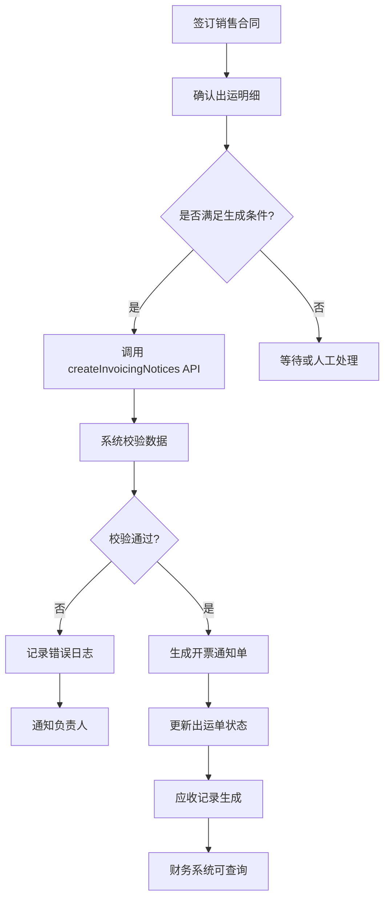

# 应收生成

<cite>
**本文档引用文件**  
- [ShipmentDO.java](file://eplus-module-dms/eplus-module-dms-biz/src/main/java/com/syj/eplus/module/dms/dal/dataobject/shipment/ShipmentDO.java)
- [SaleContractDO.java](file://eplus-module-sms/eplus-module-sms-biz/src/main/java/com/syj/eplus/module/sms/dal/dataobject/salecontract/SaleContractDO.java)
- [InvoicingNoticesServiceImpl.java](file://eplus-module-scm/eplus-module-scm-biz/src/main/java/com/syj/eplus/module/scm/service/invoicingnotices/InvoicingNoticesServiceImpl.java)
- [SaleContractServiceImpl.java](file://eplus-module-sms/eplus-module-sms-biz/src/main/java/com/syj/eplus/module/sms/service/salecontract/SaleContractServiceImpl.java)
- [SystemCollectionPlan.java](file://eplus-module-infra/eplus-module-infra-biz/src/main/java/com/syj/eplus/module/infra/dal/dataobject/collectionplan/SystemCollectionPlan.java)
- [CollectionAccountRespVO.java](file://eplus-module-crm/eplus-module-crm-biz/src/main/java/com/syj/eplus/module/crm/controller/admin/collectionaccount/vo/CollectionAccountRespVO.java)
- [V1_0_0_123__销售变更表.sql](file://eplus-flyway/src/main/resources/db/migration/common/V1_0_0_123__销售变更表.sql)
- [V1_0_0_002__Eplus初始化.sql](file://eplus-flyway/src/main/resources/db/migration/common/V1_0_0_002__Eplus初始化.sql)
</cite>

## 目录
1. [引言](#引言)
2. [应收生成流程概述](#应收生成流程概述)
3. [核心业务单据与应收关联](#核心业务单据与应收关联)
4. [应收金额计算规则](#应收金额计算规则)
5. [应收生成触发条件与时机](#应收生成触发条件与时机)
6. [应收单据字段构成与数据来源](#应收单据字段构成与数据来源)
7. [应收生成API接口说明](#应收生成api接口说明)
8. [异常处理机制](#异常处理机制)
9. [应收生成流程图](#应收生成流程图)
10. [结论](#结论)

## 引言

应收生成是企业财务管理系统中的关键环节，它实现了从业务单据到财务应收的自动化流转。本文档详细阐述了应收生成的完整流程，重点说明应收账款如何从销售合同、出运明细等业务单据自动生成。文档涵盖了应收金额的计算规则、触发条件、数据来源、API接口以及异常处理机制，旨在为系统使用者和开发者提供全面的技术参考。

**Section sources**
- [SaleContractDO.java](file://eplus-module-sms/eplus-module-sms-biz/src/main/java/com/syj/eplus/module/sms/dal/dataobject/salecontract/SaleContractDO.java#L1-L667)
- [ShipmentDO.java](file://eplus-module-dms/eplus-module-dms-biz/src/main/java/com/syj/eplus/module/dms/dal/dataobject/shipment/ShipmentDO.java#L1-L415)

## 应收生成流程概述

应收生成流程是一个从业务发生到财务确认的闭环过程。其核心是将销售合同中约定的收款义务，通过出运确认这一关键业务事件，转化为系统中可追踪、可管理的应收记录。整个流程始于销售合同的签订，合同中明确了客户、金额、币种、价格条款和收款计划等核心要素。当货物完成出运并被系统确认后，系统会自动根据预设规则，触发应收生成逻辑，创建开票通知单，作为生成应收的直接依据。最终，开票通知单中的金额会正式计入客户的应收账款总额。

该流程确保了财务数据与业务数据的高度一致性，避免了人工录入的错误和延迟，极大地提升了财务核算的效率和准确性。

## 核心业务单据与应收关联

应收生成并非孤立事件，而是与多个核心业务单据紧密关联的。这些单据构成了应收生成的数据基础和业务上下文。

### 销售合同 (Sales Contract)
销售合同是应收生成的源头。它定义了交易的法律和商业条款，是所有后续财务活动的依据。在系统中，`SaleContractDO` 数据对象存储了合同的核心信息，包括：
- **客户信息**：`custCode` (客户编号)、`custName` (客户名称)
- **交易信息**：`currency` (交易币别)、`settlementTermType` (价格条款)
- **金额信息**：`totalAmount` (销售总金额)、`receivableExchange` (应收汇款)
- **收款计划**：通过 `collection_plan_list` 字段存储的收款计划，明确了分阶段收款的比例和时间。

### 出运明细 (Shipment)
出运明细是触发应收生成的关键业务事件。当一笔出运被确认完成时，意味着货物所有权已经转移，收款条件达成。`ShipmentDO` 数据对象记录了出运的详细信息：
- **关联信息**：`custCode` (客户编号)、`invoiceCode` (发票号)、`shipDate` (出运日期)
- **状态信息**：`confirmFlag` (确认状态)、`status` (单据状态)，这些状态是判断是否可以生成应收的依据。
- **财务信息**：`totalGoodsValue` (货值合计)、`totalPurchase` (采购合计)，这些信息用于计算实际应收金额。

### 开票通知单 (Invoicing Notices)
开票通知单是连接业务与财务的桥梁。它基于出运明细生成，是创建正式应收记录的直接输入。`InvoicingNoticesServiceImpl` 服务负责处理开票通知单的创建逻辑，其 `createInvoicingNotices` 方法是应收生成流程中的核心服务方法。

**Section sources**
- [SaleContractDO.java](file://eplus-module-sms/eplus-module-sms-biz/src/main/java/com/syj/eplus/module/sms/dal/dataobject/salecontract/SaleContractDO.java#L1-L667)
- [ShipmentDO.java](file://eplus-module-dms/eplus-module-dms-biz/src/main/java/com/syj/eplus/module/dms/dal/dataobject/shipment/ShipmentDO.java#L1-L415)
- [InvoicingNoticesServiceImpl.java](file://eplus-module-scm/eplus-module-scm-biz/src/main/java/com/syj/eplus/module/scm/service/invoicingnotices/InvoicingNoticesServiceImpl.java#L168-L740)

## 应收金额计算规则

应收金额的计算是一个综合过程，涉及合同金额、币种汇率、税费等多个要素的精确计算。

### 基础金额计算
应收的基础金额通常来源于销售合同中约定的销售总金额 (`totalAmount`)。然而，实际应收金额可能会因以下因素而调整：
- **加减项**：合同中可能包含佣金、保险费、拖柜费等加项，或因质量问题产生的减项。这些在 `SaleContractDO` 中有专门的字段（如 `additionAmount`, `deductionAmount`）进行记录，系统会将其纳入最终的应收计算。
- **数量差异**：实际出运的数量可能与合同约定的数量有微小差异。系统会根据出运明细中的实际发货数量，重新计算该批次的应收金额。

### 币种与汇率处理
系统支持多币种交易。应收金额的计算必须考虑币种和汇率：
- **交易币种**：销售合同中定义的 `currency` 是应收的默认币种。
- **汇率转换**：当需要将应收金额转换为本位币（如人民币）进行核算时，系统会使用合同创建时的汇率 (`exchangeRate`) 或出运当日的实时汇率进行换算。`JsonAmount` 对象封装了金额和币种信息，确保了计算的准确性。

### 税费处理
税费是应收金额的重要组成部分。系统会根据商品的税率 (`tax_rate`) 计算销项税额。在 `InvoicingNoticesServiceImpl` 的实现中，开票明细会包含税率和总金额，系统会自动分离出不含税金额和税额，确保财务报表的合规性。

**Section sources**
- [SaleContractDO.java](file://eplus-module-sms/eplus-module-sms-biz/src/main/java/com/syj/eplus/module/sms/dal/dataobject/salecontract/SaleContractDO.java#L1-L667)
- [InvoicingNoticesServiceImpl.java](file://eplus-module-scm/eplus-module-scm-biz/src/main/java/com/syj/eplus/module/scm/service/invoicingnotices/InvoicingNoticesServiceImpl.java#L168-L740)

## 应收生成触发条件与时机

应收生成是一个事件驱动的过程，其触发条件和时机有严格的规定。

### 触发条件
应收生成的主要触发条件是**出运确认**。具体来说，当一笔出运单 (`ShipmentDO`) 满足以下条件时，系统才会允许或自动触发应收生成：
1.  **状态确认**：`confirmFlag` 字段必须为已确认状态。
2.  **出运完成**：`shipmentFlag` 字段必须标记为已出运。
3.  **审核通过**：`audit_status` 字段必须为已审核通过状态。
4.  **未生成应收**：`inoviceNotiFlag` (已转开票通知) 字段必须为未生成状态，防止重复生成。

### 触发时机
触发时机分为两种：
- **自动触发**：在系统配置为自动模式时，当上述所有条件满足后，系统后台任务会自动调用 `InvoicingNoticesServiceImpl.createInvoicingNotices` 方法，创建开票通知单，从而生成应收。
- **手动触发**：在系统配置为手动模式时，业务人员需要在出运确认后，手动在系统界面点击“生成开票通知”按钮，主动触发该流程。

这种设计既保证了流程的自动化效率，又保留了人工干预的灵活性。

**Section sources**
- [ShipmentDO.java](file://eplus-module-dms/eplus-module-dms-biz/src/main/java/com/syj/eplus/module/dms/dal/dataobject/shipment/ShipmentDO.java#L1-L415)
- [InvoicingNoticesServiceImpl.java](file://eplus-module-scm/eplus-module-scm-biz/src/main/java/com/syj/eplus/module/scm/service/invoicingnotices/InvoicingNoticesServiceImpl.java#L168-L740)

## 应收单据字段构成与数据来源

应收单据（以开票通知单为例）的字段构成清晰，每个字段都有明确的数据来源。

| 字段名称 | 字段说明 | 数据来源 |
| :--- | :--- | :--- |
| `code` | 开票通知单编号 | 由 `codeGeneratorApi` 自动生成，遵循预设的编码规则。 |
| `companyId` | 付款主体ID | 来源于销售合同 (`SaleContractDO`) 中的 `companyId`。 |
| `venderCode` | 供应商编号 | 来源于出运明细关联的采购合同信息。 |
| `invoiceCode` | 发票号 | 直接来源于出运单 (`ShipmentDO`) 的 `invoiceCode` 字段。 |
| `shipDate` | 出运日期 | 直接来源于出运单 (`ShipmentDO`) 的 `shipDate` 字段。 |
| `children` | 开票明细列表 | 由系统根据出运明细中的产品信息、数量、单价等动态生成。 |
| `totalGoodsValue` | 货值合计 | 汇总所有开票明细的金额计算得出。 |
| `inputUser` | 录入人 | 取自当前操作用户的登录信息。 |
| `linkCodeList` | 链路编号 | 继承自销售合同 (`SaleContractDO`) 的 `linkCodeList`，用于追踪订单链路。 |

**Section sources**
- [InvoicingNoticesServiceImpl.java](file://eplus-module-scm/eplus-module-scm-biz/src/main/java/com/syj/eplus/module/scm/service/invoicingnotices/InvoicingNoticesServiceImpl.java#L168-L740)
- [ShipmentDO.java](file://eplus-module-dms/eplus-module-dms-biz/src/main/java/com/syj/eplus/module/dms/dal/dataobject/shipment/ShipmentDO.java#L1-L415)
- [SaleContractDO.java](file://eplus-module-sms/eplus-module-sms-biz/src/main/java/com/syj/eplus/module/sms/dal/dataobject/salecontract/SaleContractDO.java#L1-L667)

## 应收生成API接口说明

系统提供了标准化的API接口用于创建开票通知单，这是生成应收的核心接口。

### 接口定义
```java
public interface InvoicingNoticesApi {
    /**
     * 批量生成出票通知
     *
     * @param invoicingNoticesDTOList 请求体
     */
    List<CreatedResponse> createInvoicingNotices(List<InvoicingNoticesDTO> invoicingNoticesDTOList);
}
```

### 调用示例
```json
POST /api/scm/invoicing-notices/create
[
  {
    "companyId": 1001,
    "venderCode": "VEN001",
    "manager": {
      "userId": 2001,
      "nickname": "张三"
    },
    "shipmentCode": "SHIP20240501",
    "shipDate": "2024-05-01T10:00:00",
    "printFlag": 0,
    "purOrderCode": "PO20240430",
    "status": 1,
    "manuallyFlag": 1,
    "children": [
      {
        "purchaseContractCode": "PC001",
        "skuCode": "SKU001",
        "invoiceQuantity": 100,
        "noticePrice": {
          "amount": 10.00,
          "currency": "USD"
        },
        "totalAmount": {
          "amount": 1000.00,
          "currency": "USD"
        }
      }
    ],
    "linkCodeList": ["LINK001"]
  }
]
```

**响应示例**
```json
[
  {
    "id": 5001,
    "code": "INV20240501001"
  }
]
```

**Section sources**
- [InvoicingNoticesApi.java](file://eplus-module-scm/eplus-module-scm-api/src/main/java/com/syj/eplus/module/scm/api/invoicingnotices/InvoicingNoticesApi.java#L1-L16)
- [InvoicingNoticesServiceImpl.java](file://eplus-module-scm/eplus-module-scm-biz/src/main/java/com/syj/eplus/module/scm/service/invoicingnotices/InvoicingNoticesServiceImpl.java#L168-L740)

## 异常处理机制

为确保应收生成流程的健壮性，系统设计了完善的异常处理机制。

### 生成失败重试策略
当调用 `createInvoicingNotices` 接口因网络波动、数据库锁等临时性问题失败时，系统会采用**指数退避重试策略**：
1.  **首次失败**：等待1秒后重试。
2.  **第二次失败**：等待2秒后重试。
3.  **第三次失败**：等待4秒后重试。
4.  **后续失败**：等待时间按2的幂次方递增（8秒、16秒...），直到达到最大重试次数（如5次）。

如果达到最大重试次数仍失败，系统会将该任务标记为“生成失败”，并记录详细的错误日志，同时通过消息通知相关负责人进行人工干预。

### 数据一致性校验
在生成应收前，系统会进行严格的数据一致性校验，例如：
- 校验出运单是否已被删除或作废。
- 校验关联的销售合同是否存在且有效。
- 校验开票数量是否超过可开票数量。

任何校验不通过都会立即抛出异常，阻止应收生成，防止脏数据进入财务系统。

**Section sources**
- [InvoicingNoticesServiceImpl.java](file://eplus-module-scm/eplus-module-scm-biz/src/main/java/com/syj/eplus/module/scm/service/invoicingnotices/InvoicingNoticesServiceImpl.java#L168-L740)

## 应收生成流程图



**Diagram sources**
- [SaleContractDO.java](file://eplus-module-sms/eplus-module-sms-biz/src/main/java/com/syj/eplus/module/sms/dal/dataobject/salecontract/SaleContractDO.java#L1-L667)
- [ShipmentDO.java](file://eplus-module-dms/eplus-module-dms-biz/src/main/java/com/syj/eplus/module/dms/dal/dataobject/shipment/ShipmentDO.java#L1-L415)
- [InvoicingNoticesServiceImpl.java](file://eplus-module-scm/eplus-module-scm-biz/src/main/java/com/syj/eplus/module/scm/service/invoicingnotices/InvoicingNoticesServiceImpl.java#L168-L740)

## 结论

本文档详细阐述了应收生成的完整流程。系统通过将销售合同、出运明细等业务单据与财务应收逻辑紧密集成，实现了应收的自动化生成。应收金额的计算规则清晰，涵盖了合同金额、币种汇率和税费等关键要素。出运确认是触发应收生成的核心时机，系统通过API接口和后台服务确保了流程的可靠执行。完善的异常处理机制保障了数据的一致性和系统的稳定性。该设计有效提升了财务核算的效率和准确性，为企业提供了坚实的财务数据支持。