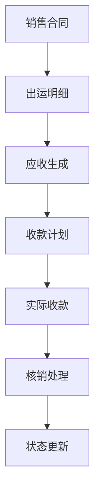
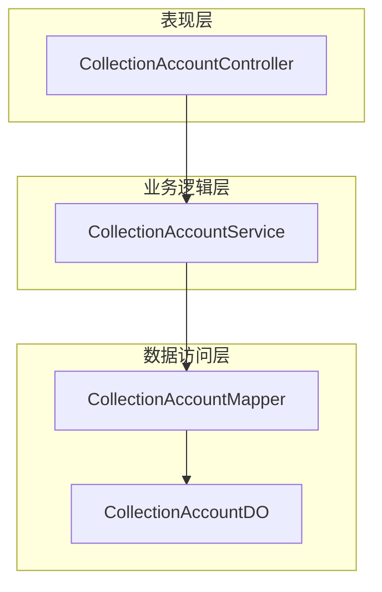
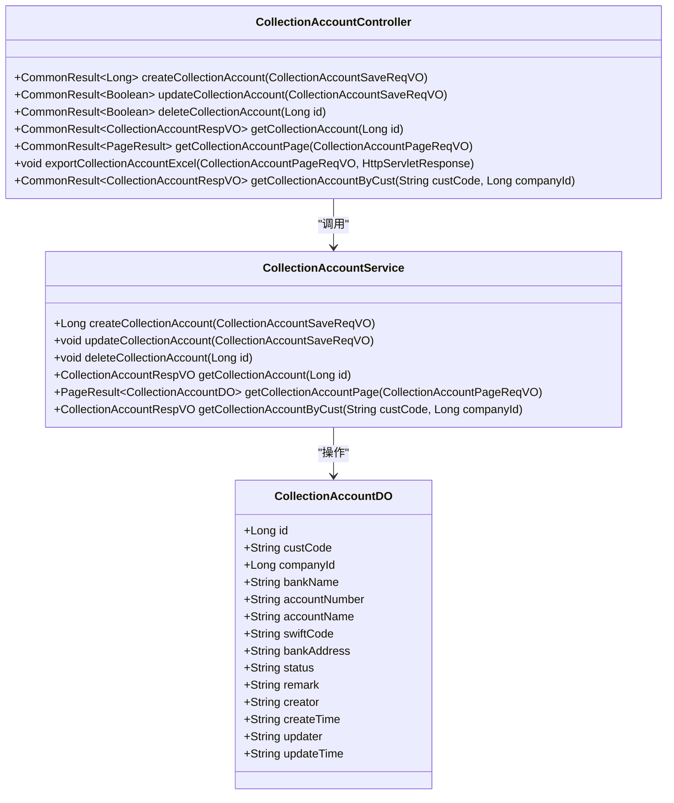
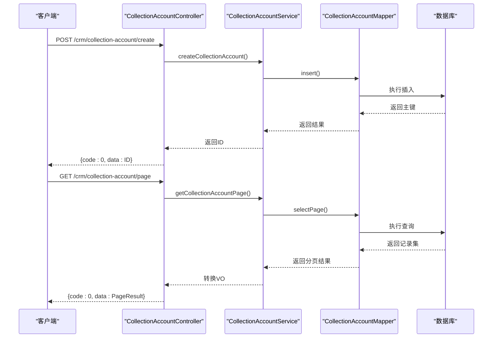
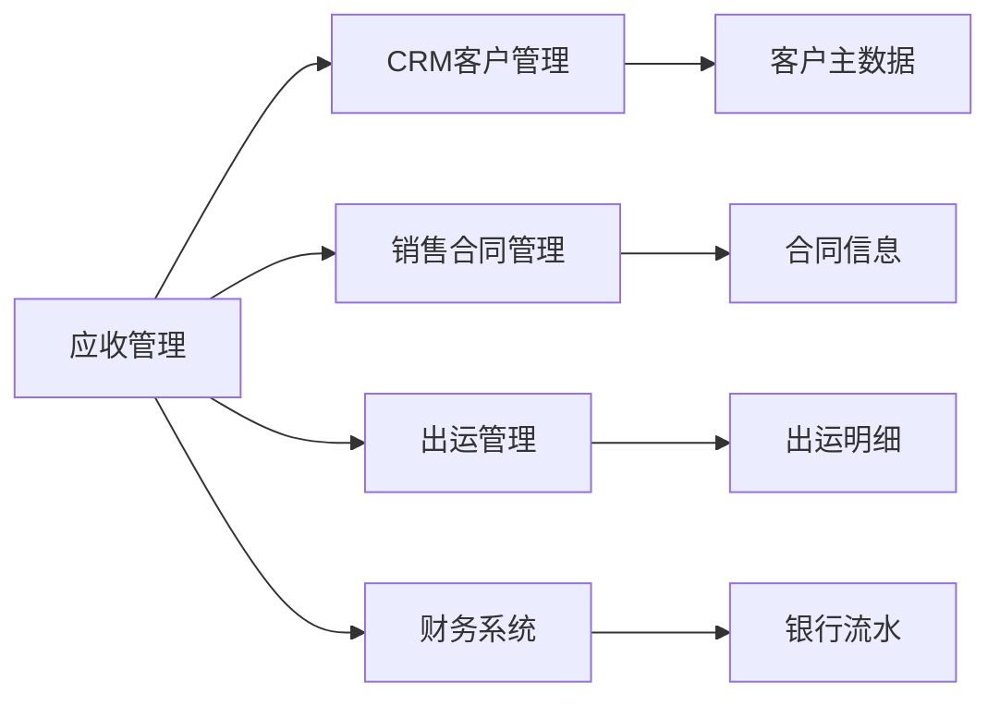

# 应收管理

<cite>
**本文档引用文件**  
- [CollectionAccountController.java](file://eplus-module-crm/eplus-module-crm-biz/src/main/java/com/syj/eplus/module/crm/controller/admin/collectionaccount/CollectionAccountController.java)
- [CollectionAccountService.java](file://eplus-module-crm/eplus-module-crm-biz/src/main/java/com/syj/eplus/module/crm/service/collectionaccount/CollectionAccountService.java)
- [CollectionAccountServiceImpl.java](file://eplus-module-crm/eplus-module-crm-biz/src/main/java/com/syj/eplus/module/crm/service/collectionaccount/CollectionAccountServiceImpl.java)
- [CollectionAccountDO.java](file://eplus-module-crm/eplus-module-crm-biz/src/main/java/com/syj/eplus/module/crm/dal/dataobject/collectionaccount/CollectionAccountDO.java)
- [ruoyi-vue-pro.sql](file://sql/mysql/ruoyi-vue-pro.sql)
</cite>

## 目录
1. [引言](#引言)
2. [项目结构](#项目结构)
3. [核心组件](#核心组件)
4. [架构概述](#架构概述)
5. [详细组件分析](#详细组件分析)
6. [依赖分析](#依赖分析)
7. [性能考虑](#性能考虑)
8. [故障排除指南](#故障排除指南)
9. [结论](#结论)

## 引言
本文档全面介绍应收管理模块的核心功能，包括应收账款的生成、核销、调整等业务流程。详细说明应收款项与销售合同、出运明细的关联关系及数据同步机制，解释应收单据的状态流转逻辑，并描述收款计划、实际收款、差异处理等关键流程。同时涵盖应收模块与客户认领、回款登记的集成方式，提供完整的业务流程图和凭证生成规则。

## 项目结构
应收管理功能主要集中在CRM模块中，涉及收款账号管理、客户结算信息维护等核心组件。系统通过统一的数据模型实现应收款项与销售合同、出运单据的关联。

**图示来源**  
- [ruoyi-vue-pro.sql](file://sql/mysql/ruoyi-vue-pro.sql#L2421-L2429)

**本节来源**  
- [ruoyi-vue-pro.sql](file://sql/mysql/ruoyi-vue-pro.sql#L2421-L2432)

## 核心组件
应收管理的核心组件包括收款账号管理、客户结算信息维护、回款计划管理等功能模块。这些组件共同支撑应收账款的全生命周期管理。

**本节来源**  
- [CollectionAccountController.java](file://eplus-module-crm/eplus-module-crm-biz/src/main/java/com/syj/eplus/module/crm/controller/admin/collectionaccount/CollectionAccountController.java#L30-L103)
- [CollectionAccountService.java](file://eplus-module-crm/eplus-module-crm-biz/src/main/java/com/syj/eplus/module/crm/service/collectionaccount/CollectionAccountService.java)

## 架构概述
应收管理模块采用分层架构设计，包含控制层、服务层和数据访问层。控制层提供RESTful API接口，服务层实现核心业务逻辑，数据访问层负责与数据库交互。

**图示来源**  
- [CollectionAccountController.java](file://eplus-module-crm/eplus-module-crm-biz/src/main/java/com/syj/eplus/module/crm/controller/admin/collectionaccount/CollectionAccountController.java)
- [CollectionAccountService.java](file://eplus-module-crm/eplus-module-crm-biz/src/main/java/com/syj/eplus/module/crm/service/collectionaccount/CollectionAccountService.java)
- [CollectionAccountDO.java](file://eplus-module-crm/eplus-module-crm-biz/src/main/java/com/syj/eplus/module/crm/dal/dataobject/collectionaccount/CollectionAccountDO.java)

## 详细组件分析

### 收款账号管理分析
收款账号管理组件负责维护客户的收款账户信息，支持创建、更新、删除和查询操作。

#### 对象导向组件：

**图示来源**  
- [CollectionAccountController.java](file://eplus-module-crm/eplus-module-crm-biz/src/main/java/com/syj/eplus/module/crm/controller/admin/collectionaccount/CollectionAccountController.java)
- [CollectionAccountService.java](file://eplus-module-crm/eplus-module-crm-biz/src/main/java/com/syj/eplus/module/crm/service/collectionaccount/CollectionAccountService.java)
- [CollectionAccountDO.java](file://eplus-module-crm/eplus-module-crm-biz/src/main/java/com/syj/eplus/module/crm/dal/dataobject/collectionaccount/CollectionAccountDO.java)

#### API/服务组件：

**图示来源**  
- [CollectionAccountController.java](file://eplus-module-crm/eplus-module-crm-biz/src/main/java/com/syj/eplus/module/crm/controller/admin/collectionaccount/CollectionAccountController.java#L39-L77)
- [CollectionAccountServiceImpl.java](file://eplus-module-crm/eplus-module-crm-biz/src/main/java/com/syj/eplus/module/crm/service/collectionaccount/CollectionAccountServiceImpl.java)

**本节来源**  
- [CollectionAccountController.java](file://eplus-module-crm/eplus-module-crm-biz/src/main/java/com/syj/eplus/module/crm/controller/admin/collectionaccount/CollectionAccountController.java#L1-L103)
- [CollectionAccountServiceImpl.java](file://eplus-module-crm/eplus-module-crm-biz/src/main/java/com/syj/eplus/module/crm/service/collectionaccount/CollectionAccountServiceImpl.java)
- [CollectionAccountDO.java](file://eplus-module-crm/eplus-module-crm-biz/src/main/java/com/syj/eplus/module/crm/dal/dataobject/collectionaccount/CollectionAccountDO.java)

## 依赖分析
应收管理模块依赖于CRM基础数据模块，需要获取客户基本信息和结算信息。同时与财务模块集成，实现收款信息的同步。

**图示来源**  
- [ruoyi-vue-pro.sql](file://sql/mysql/ruoyi-vue-pro.sql#L2421-L2429)

**本节来源**  
- [CollectionAccountController.java](file://eplus-module-crm/eplus-module-crm-biz/src/main/java/com/syj/eplus/module/crm/controller/admin/collectionaccount/CollectionAccountController.java)
- [ruoyi-vue-pro.sql](file://sql/mysql/ruoyi-vue-pro.sql)

## 性能考虑
系统采用分页查询机制避免大数据量加载，对常用查询字段建立数据库索引。接口层面使用BeanUtils进行DO到VO的高效转换，减少对象创建开销。

## 故障排除指南
常见问题包括收款账号无法创建、查询结果为空等。检查要点包括权限配置、客户编码是否存在、公司主体ID是否正确等。

**本节来源**  
- [CollectionAccountController.java](file://eplus-module-crm/eplus-module-crm-biz/src/main/java/com/syj/eplus/module/crm/controller/admin/collectionaccount/CollectionAccountController.java#L42-L60)
- [CollectionAccountServiceImpl.java](file://eplus-module-crm/eplus-module-crm-biz/src/main/java/com/syj/eplus/module/crm/service/collectionaccount/CollectionAccountServiceImpl.java)

## 结论
应收管理模块实现了从收款账号维护到回款处理的完整流程，通过清晰的分层架构和规范的接口设计，确保了系统的可维护性和扩展性。各组件之间职责分明，便于后续功能扩展和性能优化。