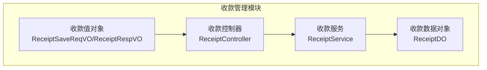
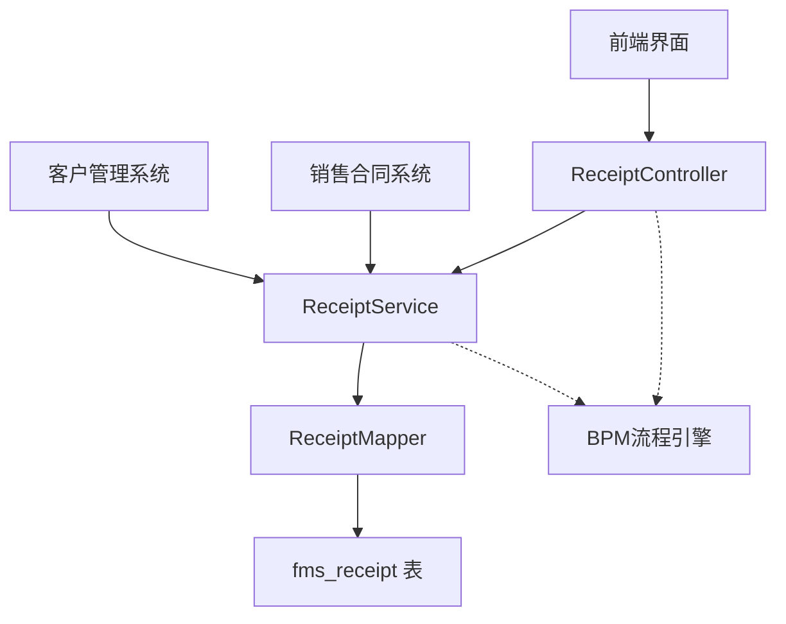
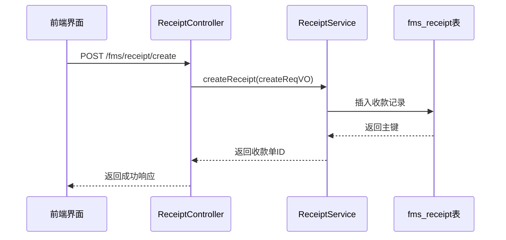
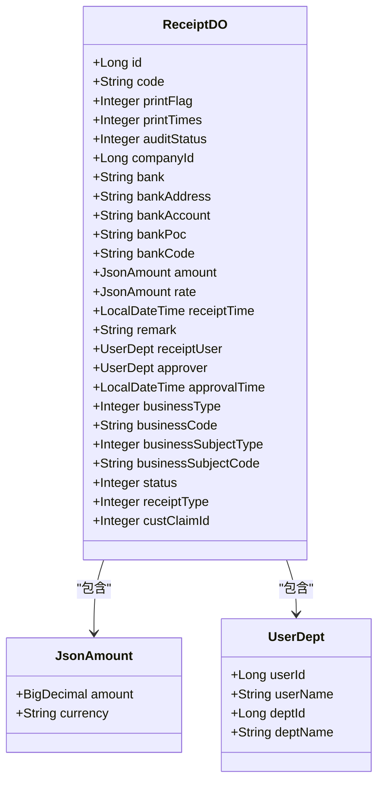
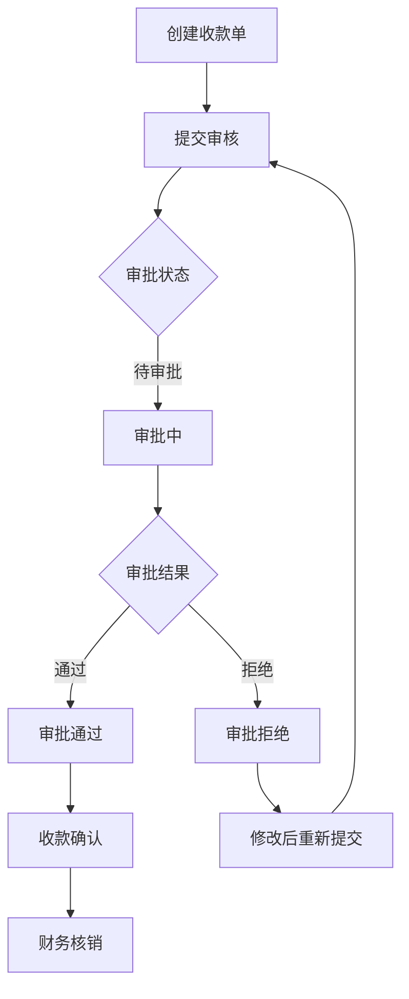
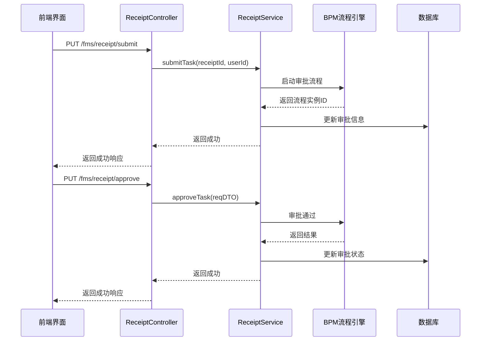
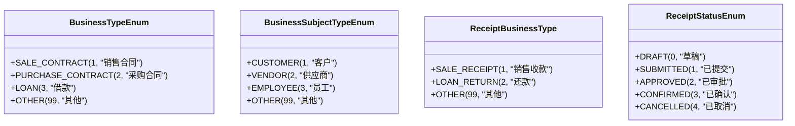
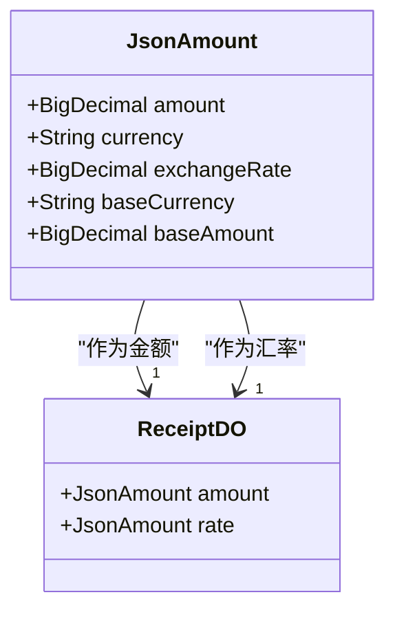
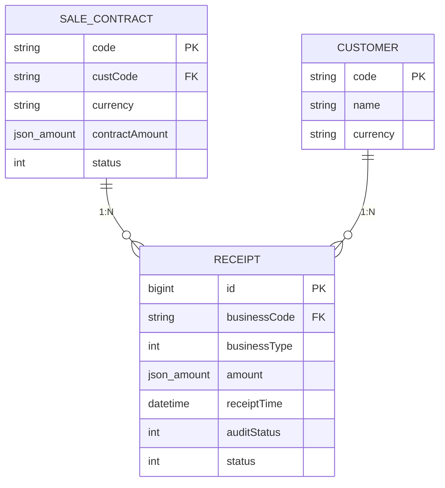

# 收款管理

<cite>
**本文档引用文件**  
- [ReceiptController.java](file://eplus-module-fms/eplus-module-fms-biz/src/main/java/com/syj/eplus/module/fms/controller/admin/receipt/ReceiptController.java)
- [ReceiptService.java](file://eplus-module-fms/eplus-module-fms-biz/src/main/java/com/syj/eplus/module/fms/service/receipt/ReceiptService.java)
- [ReceiptSaveReqVO.java](file://eplus-module-fms/eplus-module-fms-biz/src/main/java/com/syj/eplus/module/fms/controller/admin/receipt/vo/ReceiptSaveReqVO.java)
- [ReceiptRespVO.java](file://eplus-module-fms/eplus-module-fms-biz/src/main/java/com/syj/eplus/module/fms/controller/admin/receipt/vo/ReceiptRespVO.java)
- [ReceiptDO.java](file://eplus-module-fms/eplus-module-fms-biz/src/main/java/com/syj/eplus/module/fms/dal/dataobject/receipt/ReceiptDO.java)
- [V1_0_0_002__Eplus初始化.sql](file://eplus-flyway/src/main/resources/db/migration/common/V1_0_0_002__Eplus初始化.sql)
- [ReceiptBusinessType.java](file://eplus-framework/eplus-common/src/main/java/com/syj/eplus/framework/common/enums/ReceiptBusinessType.java)
- [ReceiptStatusEnum.java](file://eplus-framework/eplus-common/src/main/java/com/syj/eplus/framework/common/enums/ReceiptStatusEnum.java)
- [BusinessTypeEnum.java](file://eplus-framework/eplus-common/src/main/java/com/syj/eplus/framework/common/enums/BusinessTypeEnum.java)
- [BusinessSubjectTypeEnum.java](file://eplus-framework/eplus-common/src/main/java/com/syj/eplus/framework/common/enums/BusinessSubjectTypeEnum.java)
- [SaleContractServiceImpl.java](file://eplus-module-sms/eplus-module-sms-biz/src/main/java/com/syj/eplus/module/sms/service/salecontract/SaleContractServiceImpl.java)
</cite>

## 目录
1. [引言](#引言)
2. [项目结构](#项目结构)
3. [核心组件](#核心组件)
4. [架构概述](#架构概述)
5. [详细组件分析](#详细组件分析)
6. [依赖分析](#依赖分析)
7. [性能考虑](#性能考虑)
8. [故障排除指南](#故障排除指南)
9. [结论](#结论)

## 引言
本文档全面介绍收款管理系统的功能，涵盖收款登记、收款对象管理、收款方式配置等核心功能。详细说明收款单据的创建、审批、核销流程，解释收款与销售合同、应收款项的关联关系，描述收款中的币种处理、汇率转换等财务规则。提供收款业务流程图，展示从客户付款到财务核销的完整流程，并包含收款凭证生成规则和风险控制措施。

## 项目结构
收款管理功能主要位于 `eplus-module-fms` 模块中，该模块负责财务管理相关功能。核心功能分布在 `eplus-module-fms-biz` 子模块中，包括控制器、服务、数据对象和VO类。



**图表来源**  
- [ReceiptController.java](file://eplus-module-fms/eplus-module-fms-biz/src/main/java/com/syj/eplus/module/fms/controller/admin/receipt/ReceiptController.java)
- [ReceiptService.java](file://eplus-module-fms/eplus-module-fms-biz/src/main/java/com/syj/eplus/module/fms/service/receipt/ReceiptService.java)
- [ReceiptDO.java](file://eplus-module-fms/eplus-module-fms-biz/src/main/java/com/syj/eplus/module/fms/dal/dataobject/receipt/ReceiptDO.java)

**章节来源**  
- [ReceiptController.java](file://eplus-module-fms/eplus-module-fms-biz/src/main/java/com/syj/eplus/module/fms/controller/admin/receipt/ReceiptController.java)
- [ReceiptService.java](file://eplus-module-fms/eplus-module-fms-biz/src/main/java/com/syj/eplus/module/fms/service/receipt/ReceiptService.java)

## 核心组件
收款管理的核心组件包括：
- **收款单据管理**：通过 `ReceiptController` 提供创建、更新、删除、查询收款单据的API接口
- **收款流程控制**：支持提交审核、审批通过、审批拒绝、收款确认等业务流程
- **数据对象模型**：`ReceiptDO` 定义了收款单据的数据库持久化模型
- **传输对象**：`ReceiptSaveReqVO` 和 `ReceiptRespVO` 分别定义了收款单据的请求和响应数据结构

**章节来源**  
- [ReceiptController.java](file://eplus-module-fms/eplus-module-fms-biz/src/main/java/com/syj/eplus/module/fms/controller/admin/receipt/ReceiptController.java)
- [ReceiptService.java](file://eplus-module-fms/eplus-module-fms-biz/src/main/java/com/syj/eplus/module/fms/service/receipt/ReceiptService.java)
- [ReceiptDO.java](file://eplus-module-fms/eplus-module-fms-biz/src/main/java/com/syj/eplus/module/fms/dal/dataobject/receipt/ReceiptDO.java)
- [ReceiptSaveReqVO.java](file://eplus-module-fms/eplus-module-fms-biz/src/main/java/com/syj/eplus/module/fms/controller/admin/receipt/vo/ReceiptSaveReqVO.java)
- [ReceiptRespVO.java](file://eplus-module-fms/eplus-module-fms-biz/src/main/java/com/syj/eplus/module/fms/controller/admin/receipt/vo/ReceiptRespVO.java)

## 架构概述
收款管理系统的架构采用典型的分层设计模式，包括表现层、服务层和数据访问层。



**图表来源**  
- [ReceiptController.java](file://eplus-module-fms/eplus-module-fms-biz/src/main/java/com/syj/eplus/module/fms/controller/admin/receipt/ReceiptController.java)
- [ReceiptService.java](file://eplus-module-fms/eplus-module-fms-biz/src/main/java/com/syj/eplus/module/fms/service/receipt/ReceiptService.java)
- [V1_0_0_002__Eplus初始化.sql](file://eplus-flyway/src/main/resources/db/migration/common/V1_0_0_002__Eplus初始化.sql)

## 详细组件分析

### 收款单据创建与管理
收款单据的创建和管理通过 `ReceiptController` 提供的REST API实现，支持创建、更新、删除和查询操作。

#### 收款单据创建流程


**图表来源**  
- [ReceiptController.java](file://eplus-module-fms/eplus-module-fms-biz/src/main/java/com/syj/eplus/module/fms/controller/admin/receipt/ReceiptController.java#L41-L46)
- [ReceiptService.java](file://eplus-module-fms/eplus-module-fms-biz/src/main/java/com/syj/eplus/module/fms/service/receipt/ReceiptService.java#L28-L29)

#### 收款单据数据结构


**图表来源**  
- [ReceiptDO.java](file://eplus-module-fms/eplus-module-fms-biz/src/main/java/com/syj/eplus/module/fms/dal/dataobject/receipt/ReceiptDO.java)
- [JsonAmount.java](file://eplus-framework/eplus-common/src/main/java/com/syj/eplus/framework/common/entity/JsonAmount.java)
- [UserDept.java](file://eplus-framework/eplus-common/src/main/java/com/syj/eplus/framework/common/entity/UserDept.java)

**章节来源**  
- [ReceiptDO.java](file://eplus-module-fms/eplus-module-fms-biz/src/main/java/com/syj/eplus/module/fms/dal/dataobject/receipt/ReceiptDO.java)

### 收款审批流程
收款单据的审批流程集成BPM流程引擎，支持完整的审批生命周期管理。

#### 收款审批流程图


**图表来源**  
- [ReceiptController.java](file://eplus-module-fms/eplus-module-fms-biz/src/main/java/com/syj/eplus/module/fms/controller/admin/receipt/ReceiptController.java)
- [ReceiptService.java](file://eplus-module-fms/eplus-module-fms-biz/src/main/java/com/syj/eplus/module/fms/service/receipt/ReceiptService.java)

#### 收款审批接口调用


**图表来源**  
- [ReceiptController.java](file://eplus-module-fms/eplus-module-fms-biz/src/main/java/com/syj/eplus/module/fms/controller/admin/receipt/ReceiptController.java#L120-L126)
- [ReceiptService.java](file://eplus-module-fms/eplus-module-fms-biz/src/main/java/com/syj/eplus/module/fms/service/receipt/ReceiptService.java#L90-L91)

**章节来源**  
- [ReceiptController.java](file://eplus-module-fms/eplus-module-fms-biz/src/main/java/com/syj/eplus/module/fms/controller/admin/receipt/ReceiptController.java)
- [ReceiptService.java](file://eplus-module-fms/eplus-module-fms-biz/src/main/java/com/syj/eplus/module/fms/service/receipt/ReceiptService.java)

### 收款与业务关联
收款单据与销售合同、应收款项等业务实体存在关联关系，通过业务类型和业务编号进行关联。

#### 业务类型枚举


**图表来源**  
- [BusinessTypeEnum.java](file://eplus-framework/eplus-common/src/main/java/com/syj/eplus/framework/common/enums/BusinessTypeEnum.java)
- [BusinessSubjectTypeEnum.java](file://eplus-framework/eplus-common/src/main/java/com/syj/eplus/framework/common/enums/BusinessSubjectTypeEnum.java)
- [ReceiptBusinessType.java](file://eplus-framework/eplus-common/src/main/java/com/syj/eplus/framework/common/enums/ReceiptBusinessType.java)
- [ReceiptStatusEnum.java](file://eplus-framework/eplus-common/src/main/java/com/syj/eplus/framework/common/enums/ReceiptStatusEnum.java)

**章节来源**  
- [ReceiptDO.java](file://eplus-module-fms/eplus-module-fms-biz/src/main/java/com/syj/eplus/module/fms/dal/dataobject/receipt/ReceiptDO.java)

### 收款财务规则
收款管理包含完整的财务规则处理，包括币种处理、汇率转换、金额计算等。

#### 币种与汇率处理


**图表来源**  
- [JsonAmount.java](file://eplus-framework/eplus-common/src/main/java/com/syj/eplus/framework/common/entity/JsonAmount.java)
- [ReceiptDO.java](file://eplus-module-fms/eplus-module-fms-biz/src/main/java/com/syj/eplus/module/fms/dal/dataobject/receipt/ReceiptDO.java)

#### 收款与销售合同关联


**图表来源**  
- [SaleContractServiceImpl.java](file://eplus-module-sms/eplus-module-sms-biz/src/main/java/com/syj/eplus/module/sms/service/salecontract/SaleContractServiceImpl.java#L3155-L3178)
- [ReceiptDO.java](file://eplus-module-fms/eplus-module-fms-biz/src/main/java/com/syj/eplus/module/fms/dal/dataobject/receipt/ReceiptDO.java)

**章节来源**  
- [SaleContractServiceImpl.java](file://eplus-module-sms/eplus-module-sms-biz/src/main/java/com/syj/eplus/module/sms/service/salecontract/SaleContractServiceImpl.java)
- [ReceiptDO.java](file://eplus-module-fms/eplus-module-fms-biz/src/main/java/com/syj/eplus/module/fms/dal/dataobject/receipt/ReceiptDO.java)

## 依赖分析
收款管理模块与其他系统模块存在明确的依赖关系。

```mermaid
graph TD
FMS["收款管理模块"]
BPM["BPM流程引擎"]
SMS["销售合同系统"]
CRM["客户管理系统"]
INFRA["基础架构模块"]
FMS --> BPM : "审批流程"
FMS --> SMS : "销售合同关联"
FMS --> CRM : "客户信息"
FMS --> INFRA : "字典数据、公共组件"
class FMS,BPM,SMS,CRM,INFRA component;
```

**图表来源**  
- [ReceiptController.java](file://eplus-module-fms/eplus-module-fms-biz/src/main/java/com/syj/eplus/module/fms/controller/admin/receipt/ReceiptController.java)
- [ReceiptService.java](file://eplus-module-fms/eplus-module-fms-biz/src/main/java/com/syj/eplus/module/fms/service/receipt/ReceiptService.java)

**章节来源**  
- [ReceiptController.java](file://eplus-module-fms/eplus-module-fms-biz/src/main/java/com/syj/eplus/module/fms/controller/admin/receipt/ReceiptController.java)
- [ReceiptService.java](file://eplus-module-fms/eplus-module-fms-biz/src/main/java/com/syj/eplus/module/fms/service/receipt/ReceiptService.java)

## 性能考虑
收款管理系统的性能考虑主要包括：
- 数据库索引优化：在 `fms_receipt` 表的 `business_code`、`business_type`、`audit_status` 等字段上建立索引
- 分页查询：提供分页接口 `getReceiptPage` 避免一次性加载大量数据
- 缓存机制：对于频繁访问的字典数据和客户信息使用缓存
- 批量操作：支持批量创建和删除收款单据，提高处理效率

**章节来源**  
- [ReceiptController.java](file://eplus-module-fms/eplus-module-fms-biz/src/main/java/com/syj/eplus/module/fms/controller/admin/receipt/ReceiptController.java)
- [ReceiptService.java](file://eplus-module-fms/eplus-module-fms-biz/src/main/java/com/syj/eplus/module/fms/service/receipt/ReceiptService.java)
- [V1_0_0_002__Eplus初始化.sql](file://eplus-flyway/src/main/resources/db/migration/common/V1_0_0_002__Eplus初始化.sql)

## 故障排除指南
常见问题及解决方案：

1. **收款单据无法创建**
   - 检查请求参数是否完整
   - 确认用户是否有创建权限
   - 检查业务编号是否已存在

2. **审批流程无法启动**
   - 确认BPM流程定义是否正确
   - 检查流程引擎服务是否正常运行
   - 验证用户是否有提交审批权限

3. **收款金额计算错误**
   - 检查币种和汇率设置
   - 确认金额字段的数据类型和精度
   - 验证计算逻辑是否正确

4. **关联销售合同失败**
   - 检查业务类型和业务编号是否匹配
   - 确认销售合同状态是否允许收款
   - 验证合同金额与收款金额的关系

**章节来源**  
- [ReceiptController.java](file://eplus-module-fms/eplus-module-fms-biz/src/main/java/com/syj/eplus/module/fms/controller/admin/receipt/ReceiptController.java)
- [ReceiptService.java](file://eplus-module-fms/eplus-module-fms-biz/src/main/java/com/syj/eplus/module/fms/service/receipt/ReceiptService.java)

## 结论
收款管理系统提供了完整的收款管理功能，包括收款登记、审批、核销等核心流程。系统采用分层架构设计，与BPM流程引擎深度集成，支持灵活的审批流程配置。通过与销售合同系统的关联，实现了从业务到财务的完整闭环。系统支持多币种处理和汇率转换，满足国际化业务需求。未来可进一步优化性能，增加更多的风险控制措施，提升系统的稳定性和安全性。