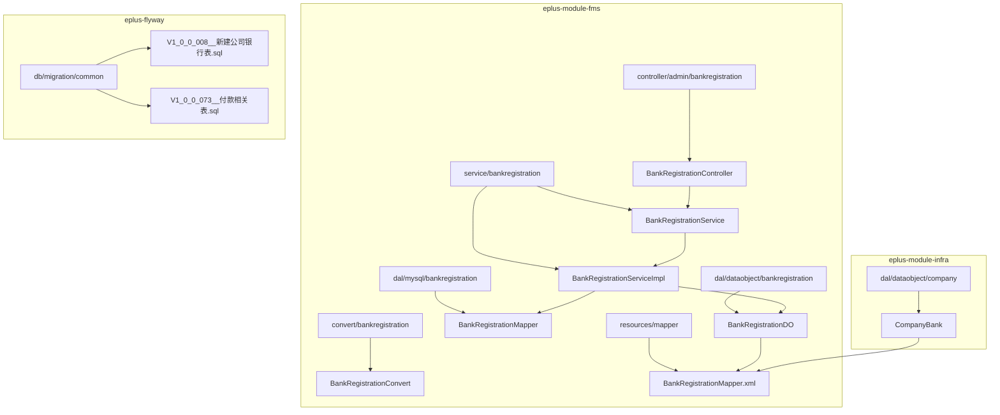
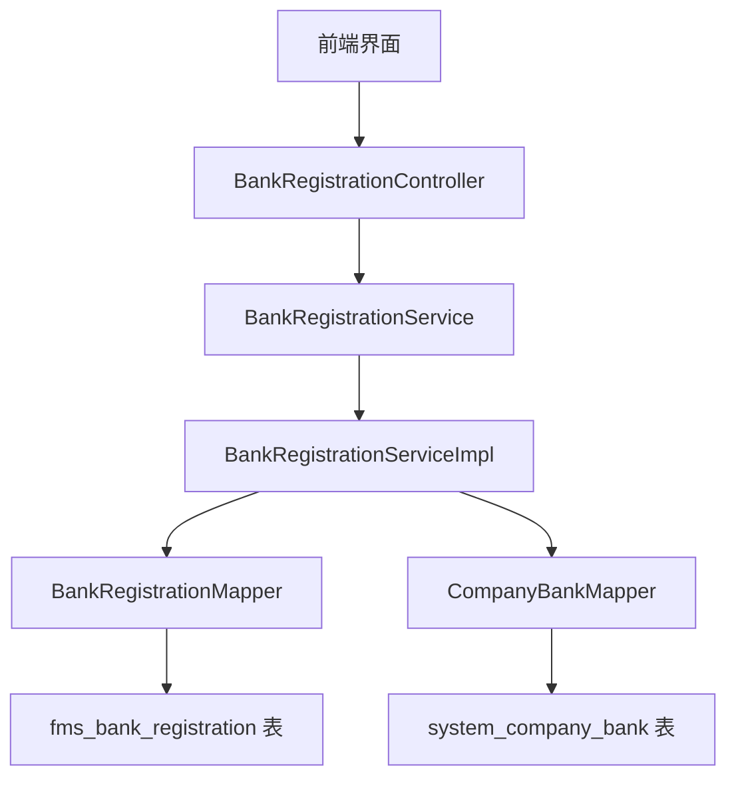
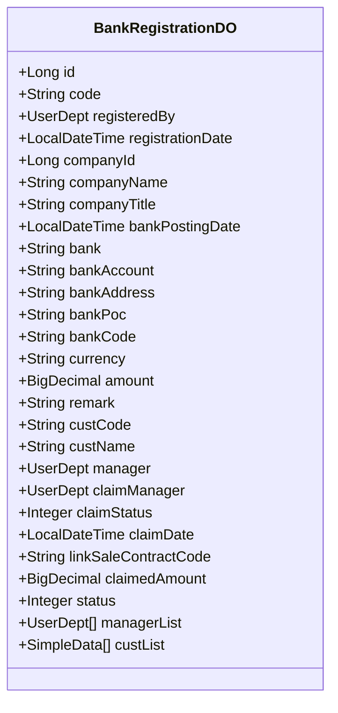
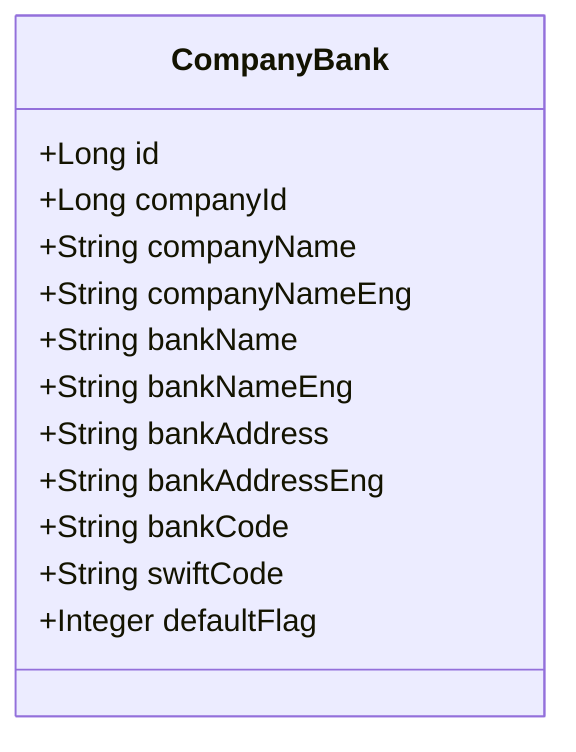
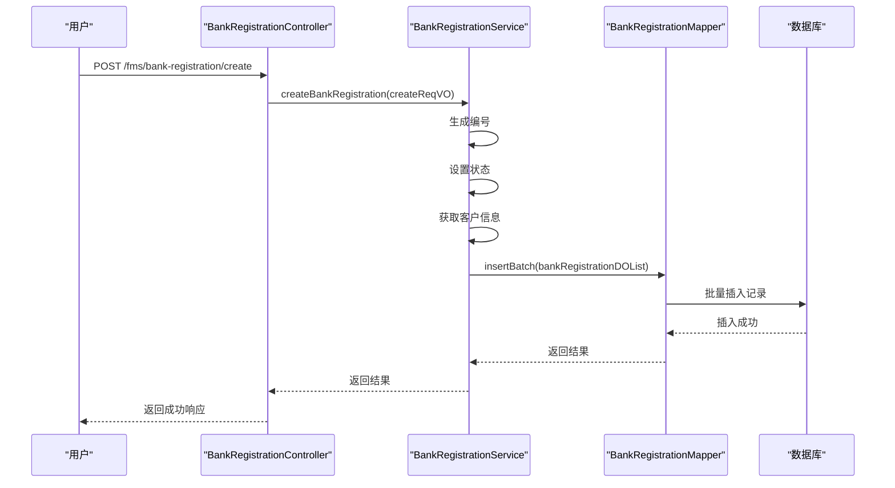
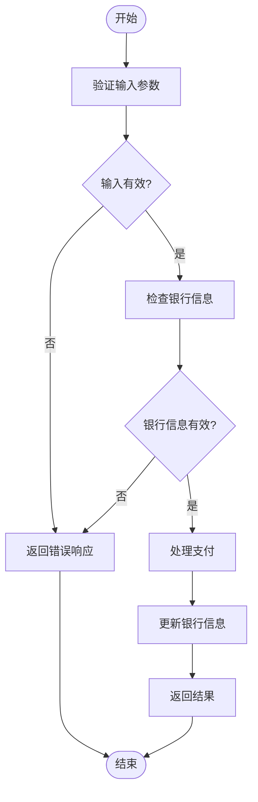
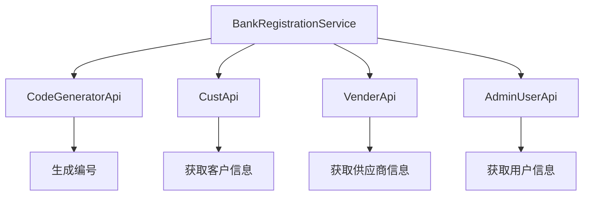

# 银行登记

<cite>
**本文档引用的文件**  
- [BankRegistrationDO.java](file://eplus-module-fms/eplus-module-fms-biz/src/main/java/com/syj/eplus/module/fms/dal/dataobject/bankregistration/BankRegistrationDO.java)
- [BankRegistrationService.java](file://eplus-module-fms/eplus-module-fms-biz/src/main/java/com/syj/eplus/module/fms/service/bankregistration/BankRegistrationService.java)
- [BankRegistrationServiceImpl.java](file://eplus-module-fms/eplus-module-fms-biz/src/main/java/com/syj/eplus/module/fms/service/bankregistration/BankRegistrationServiceImpl.java)
- [BankRegistrationController.java](file://eplus-module-fms/eplus-module-fms-biz/src/main/java/com/syj/eplus/module/fms/controller/admin/bankregistration/BankRegistrationController.java)
- [BankRegistrationMapper.xml](file://eplus-module-fms/eplus-module-fms-biz/src/main/resources/mapper/BankRegistrationMapper.xml)
- [CompanyBank.java](file://eplus-module-infra/eplus-module-infra-biz/src/main/java/com/syj/eplus/module/infra/dal/dataobject/company/CompanyBank.java)
- [V1_0_0_008__新建公司银行表.sql](file://eplus-flyway/src/main/resources/db/migration/common/V1_0_0_008__新建公司银行表.sql)
- [V1_0_0_073__付款相关表.sql](file://eplus-flyway/src/main/resources/db/migration/common/V1_0_0_073__付款相关表.sql)
</cite>

## 目录
1. [引言](#引言)
2. [项目结构](#项目结构)
3. [核心组件](#核心组件)
4. [架构概述](#架构概述)
5. [详细组件分析](#详细组件分析)
6. [依赖分析](#依赖分析)
7. [性能考虑](#性能考虑)
8. [故障排除指南](#故障排除指南)
9. [结论](#结论)

## 引言
银行登记功能是企业财务管理中的关键模块，用于管理公司银行账户、客户银行账户和供应商银行账户的信息。该功能支持银行信息的创建、维护，并在收付款业务中使用这些信息。本文档详细介绍了银行登记的实现细节，包括数据模型、业务流程、权限控制和安全保护措施。

## 项目结构
银行登记功能主要分布在FMS（财务管理系统）模块中，涉及多个子模块和组件。以下是相关文件的组织结构：

**图源**  
- [BankRegistrationController.java](file://eplus-module-fms/eplus-module-fms-biz/src/main/java/com/syj/eplus/module/fms/controller/admin/bankregistration/BankRegistrationController.java)
- [BankRegistrationService.java](file://eplus-module-fms/eplus-module-fms-biz/src/main/java/com/syj/eplus/module/fms/service/bankregistration/BankRegistrationService.java)
- [BankRegistrationServiceImpl.java](file://eplus-module-fms/eplus-module-fms-biz/src/main/java/com/syj/eplus/module/fms/service/bankregistration/BankRegistrationServiceImpl.java)
- [BankRegistrationDO.java](file://eplus-module-fms/eplus-module-fms-biz/src/main/java/com/syj/eplus/module/fms/dal/dataobject/bankregistration/BankRegistrationDO.java)
- [BankRegistrationMapper.java](file://eplus-module-fms/eplus-module-fms-biz/src/main/java/com/syj/eplus/module/fms/dal/mysql/bankregistration/BankRegistrationMapper.java)
- [BankRegistrationMapper.xml](file://eplus-module-fms/eplus-module-fms-biz/src/main/resources/mapper/BankRegistrationMapper.xml)
- [CompanyBank.java](file://eplus-module-infra/eplus-module-infra-biz/src/main/java/com/syj/eplus/module/infra/dal/dataobject/company/CompanyBank.java)
- [V1_0_0_008__新建公司银行表.sql](file://eplus-flyway/src/main/resources/db/migration/common/V1_0_0_008__新建公司银行表.sql)

## 核心组件
银行登记功能的核心组件包括控制器、服务层、数据访问层和数据模型。这些组件协同工作，实现了银行信息的全生命周期管理。

**节源**  
- [BankRegistrationController.java](file://eplus-module-fms/eplus-module-fms-biz/src/main/java/com/syj/eplus/module/fms/controller/admin/bankregistration/BankRegistrationController.java)
- [BankRegistrationService.java](file://eplus-module-fms/eplus-module-fms-biz/src/main/java/com/syj/eplus/module/fms/service/bankregistration/BankRegistrationService.java)
- [BankRegistrationServiceImpl.java](file://eplus-module-fms/eplus-module-fms-biz/src/main/java/com/syj/eplus/module/fms/service/bankregistration/BankRegistrationServiceImpl.java)
- [BankRegistrationDO.java](file://eplus-module-fms/eplus-module-fms-biz/src/main/java/com/syj/eplus/module/fms/dal/dataobject/bankregistration/BankRegistrationDO.java)

## 架构概述
银行登记功能采用典型的分层架构，包括表现层、业务逻辑层和数据访问层。这种架构确保了代码的可维护性和可扩展性。

**图源**  
- [BankRegistrationController.java](file://eplus-module-fms/eplus-module-fms-biz/src/main/java/com/syj/eplus/module/fms/controller/admin/bankregistration/BankRegistrationController.java)
- [BankRegistrationService.java](file://eplus-module-fms/eplus-module-fms-biz/src/main/java/com/syj/eplus/module/fms/service/bankregistration/BankRegistrationService.java)
- [BankRegistrationServiceImpl.java](file://eplus-module-fms/eplus-module-fms-biz/src/main/java/com/syj/eplus/module/fms/service/bankregistration/BankRegistrationServiceImpl.java)
- [BankRegistrationMapper.java](file://eplus-module-fms/eplus-module-fms-biz/src/main/java/com/syj/eplus/module/fms/dal/mysql/bankregistration/BankRegistrationMapper.java)
- [CompanyBank.java](file://eplus-module-infra/eplus-module-infra-biz/src/main/java/com/syj/eplus/module/infra/dal/dataobject/company/CompanyBank.java)

## 详细组件分析
### 银行登记数据模型
银行登记功能的数据模型包括两个主要实体：`BankRegistrationDO` 和 `CompanyBank`。`BankRegistrationDO` 用于存储银行登记的详细信息，而 `CompanyBank` 用于存储公司银行账户的基本信息。

#### BankRegistrationDO 类图

**图源**  
- [BankRegistrationDO.java](file://eplus-module-fms/eplus-module-fms-biz/src/main/java/com/syj/eplus/module/fms/dal/dataobject/bankregistration/BankRegistrationDO.java)

#### CompanyBank 类图

**图源**  
- [CompanyBank.java](file://eplus-module-infra/eplus-module-infra-biz/src/main/java/com/syj/eplus/module/infra/dal/dataobject/company/CompanyBank.java)

### 银行登记流程
银行登记的创建和维护流程涉及多个步骤，从用户请求到数据库持久化。

#### 创建银行登记序列图

**图源**  
- [BankRegistrationController.java](file://eplus-module-fms/eplus-module-fms-biz/src/main/java/com/syj/eplus/module/fms/controller/admin/bankregistration/BankRegistrationController.java)
- [BankRegistrationService.java](file://eplus-module-fms/eplus-module-fms-biz/src/main/java/com/syj/eplus/module/fms/service/bankregistration/BankRegistrationService.java)
- [BankRegistrationServiceImpl.java](file://eplus-module-fms/eplus-module-fms-biz/src/main/java/com/syj/eplus/module/fms/service/bankregistration/BankRegistrationServiceImpl.java)
- [BankRegistrationMapper.java](file://eplus-module-fms/eplus-module-fms-biz/src/main/java/com/syj/eplus/module/fms/dal/mysql/bankregistration/BankRegistrationMapper.java)

### 银行信息使用规则
银行信息在收付款业务中被广泛使用，确保交易的准确性和安全性。

#### 收付款业务流程图

**图源**  
- [BankRegistrationDO.java](file://eplus-module-fms/eplus-module-fms-biz/src/main/java/com/syj/eplus/module/fms/dal/dataobject/bankregistration/BankRegistrationDO.java)
- [BankRegistrationService.java](file://eplus-module-fms/eplus-module-fms-biz/src/main/java/com/syj/eplus/module/fms/service/bankregistration/BankRegistrationService.java)

## 依赖分析
银行登记功能依赖于多个外部组件和服务，包括用户管理、客户管理和供应商管理。

**图源**  
- [BankRegistrationServiceImpl.java](file://eplus-module-fms/eplus-module-fms-biz/src/main/java/com/syj/eplus/module/fms/service/bankregistration/BankRegistrationServiceImpl.java)

## 性能考虑
银行登记功能在设计时考虑了性能优化，特别是在批量操作和查询方面。

- **批量插入**：使用 `insertBatch` 方法进行批量插入，提高数据持久化效率。
- **分页查询**：支持分页查询，避免一次性加载大量数据。
- **缓存机制**：通过 `@Cacheable` 注解实现数据缓存，减少数据库访问频率。

## 故障排除指南
### 常见问题及解决方案
- **问题**：创建银行登记失败
  - **原因**：输入参数验证失败或数据库连接问题
  - **解决方案**：检查输入参数是否符合要求，确认数据库连接正常

- **问题**：查询银行登记信息超时
  - **原因**：数据量过大或查询条件不合理
  - **解决方案**：优化查询条件，使用分页查询

**节源**  
- [BankRegistrationController.java](file://eplus-module-fms/eplus-module-fms-biz/src/main/java/com/syj/eplus/module/fms/controller/admin/bankregistration/BankRegistrationController.java)
- [BankRegistrationServiceImpl.java](file://eplus-module-fms/eplus-module-fms-biz/src/main/java/com/syj/eplus/module/fms/service/bankregistration/BankRegistrationServiceImpl.java)

## 结论
银行登记功能通过分层架构和模块化设计，实现了对公司银行账户、客户银行账户和供应商银行账户的全面管理。该功能不仅支持银行信息的创建和维护，还在收付款业务中发挥了重要作用。通过权限控制和安全保护措施，确保了数据的安全性和完整性。