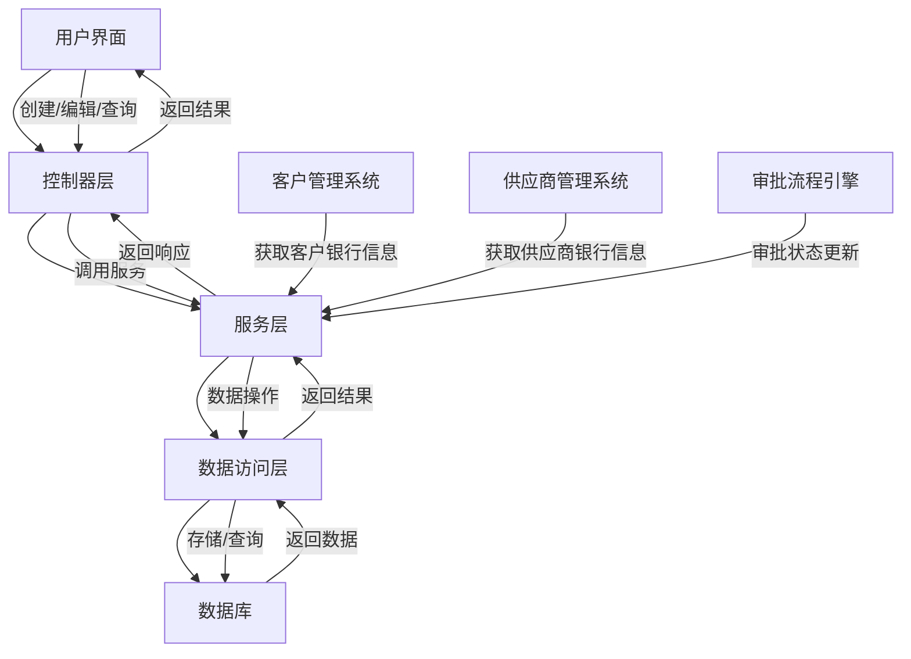
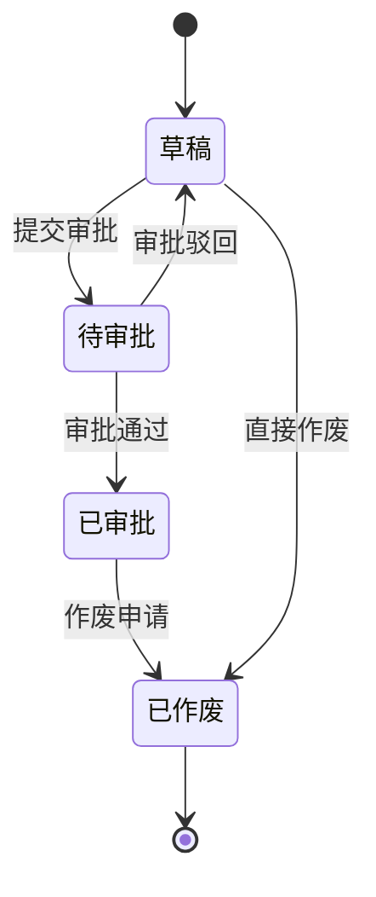
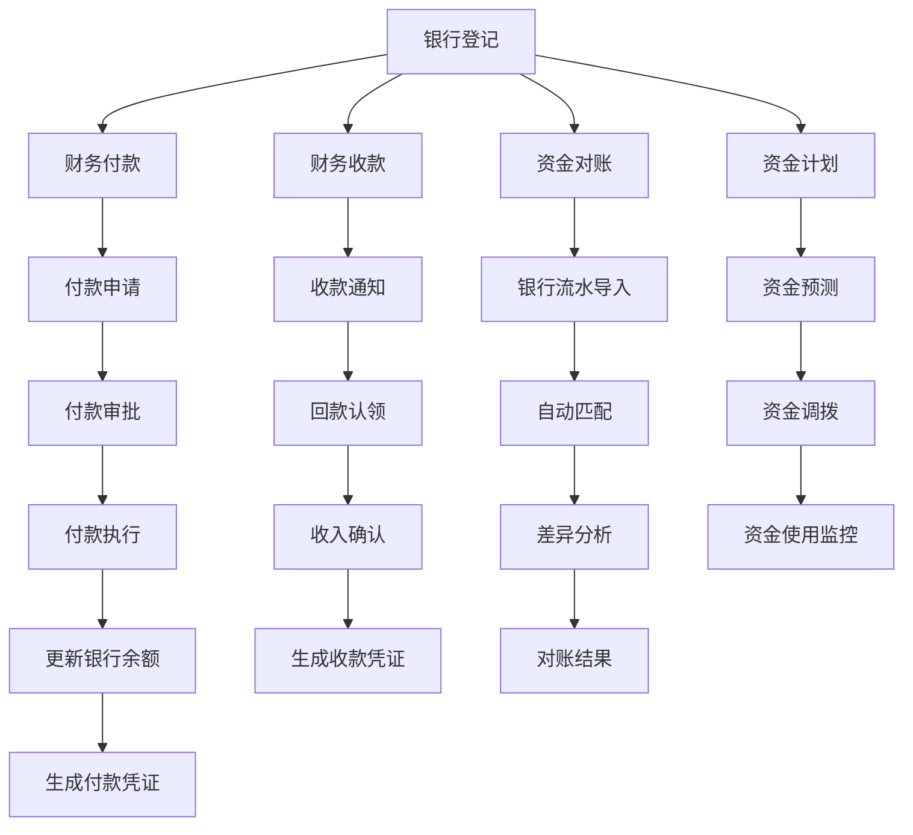
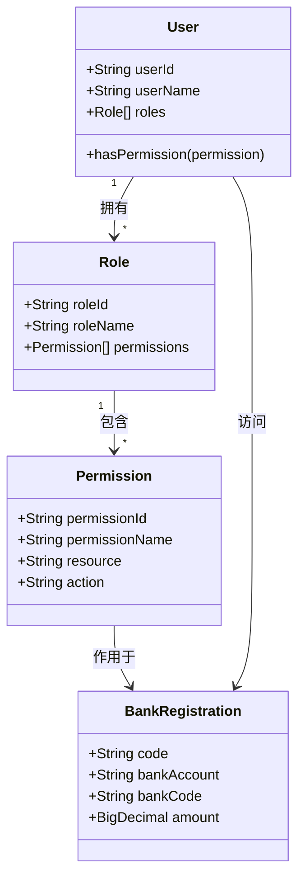
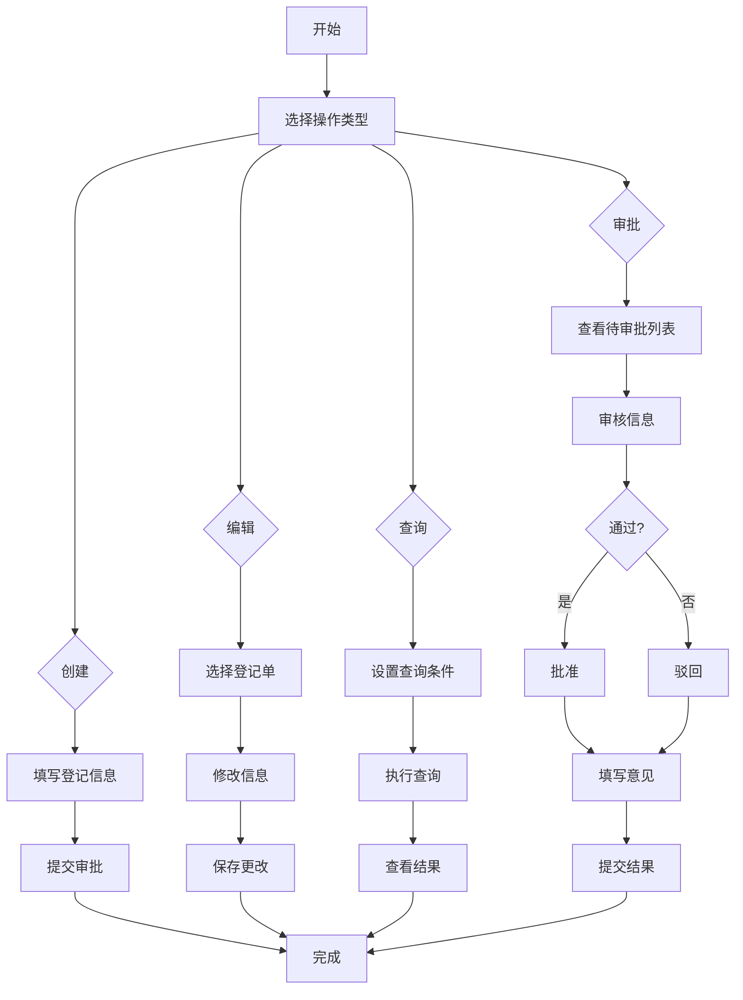

# 银行登记

<cite>
**本文档引用文件**   
- [BankRegistrationController.java](file://eplus-module-fms/eplus-module-fms-biz/src/main/java/com/syj/eplus/module/fms/controller/admin/bankregistration/BankRegistrationController.java)
- [BankRegistrationServiceImpl.java](file://eplus-module-fms/eplus-module-fms-biz/src/main/java/com/syj/eplus/module/fms/service/bankregistration/BankRegistrationServiceImpl.java)
- [BankRegistrationDO.java](file://eplus-module-fms/eplus-module-fms-biz/src/main/java/com/syj/eplus/module/fms/dal/dataobject/bankregistration/BankRegistrationDO.java)
- [BankRegistrationSaveReqVO.java](file://eplus-module-fms/eplus-module-fms-biz/src/main/java/com/syj/eplus/module/fms/controller/admin/bankregistration/vo/BankRegistrationSaveReqVO.java)
- [BankRegistrationPageReqVO.java](file://eplus-module-fms/eplus-module-fms-biz/src/main/java/com/syj/eplus/module/fms/controller/admin/bankregistration/vo/BankRegistrationPageReqVO.java)
- [BankRegistrationRespVO.java](file://eplus-module-fms/eplus-module-fms-biz/src/main/java/com/syj/eplus/module/fms/controller/admin/bankregistration/vo/BankRegistrationRespVO.java)
- [BankRegistrationMapper.java](file://eplus-module-fms/eplus-module-fms-biz/src/main/java/com/syj/eplus/module/fms/dal/mysql/bankregistration/BankRegistrationMapper.java)
- [BankRegistrationMapper.xml](file://eplus-module-fms/eplus-module-fms-biz/src/main/resources/mapper/BankRegistrationMapper.xml)
- [V1_0_0_005__新建银行登记表.sql](file://eplus-flyway/src/main/resources/db/migration/common/V1_0_0_005__新建银行登记表.sql)
</cite>

## 目录
1. [银行登记功能概述](#银行登记功能概述)
2. [银行登记单字段定义](#银行登记单字段定义)
3. [银行登记单状态流转机制](#银行登记单状态流转机制)
4. [银行登记与财务付款、收款的关联关系](#银行登记与财务付款收款的关联关系)
5. [银行登记数据安全管理](#银行登记数据安全管理)
6. [银行登记界面操作指南](#银行登记界面操作指南)
7. [常见问题解决方案](#常见问题解决方案)

## 银行登记功能概述

银行登记功能是财务管理系统中的核心模块，用于记录和管理银行账户的登记信息。该功能支持银行登记单的创建、编辑、审批和查询等操作，为资金管理提供基础数据支持。银行登记模块通过与客户管理、供应商管理等系统的集成，实现了银行信息的自动匹配和验证。

**银行登记功能架构图**

**图表来源**
- [BankRegistrationController.java](file://eplus-module-fms/eplus-module-fms-biz/src/main/java/com/syj/eplus/module/fms/controller/admin/bankregistration/BankRegistrationController.java#L30-L106)
- [BankRegistrationServiceImpl.java](file://eplus-module-fms/eplus-module-fms-biz/src/main/java/com/syj/eplus/module/fms/service/bankregistration/BankRegistrationServiceImpl.java#L39-L153)
- [BankRegistrationMapper.java](file://eplus-module-fms/eplus-module-fms-biz/src/main/java/com/syj/eplus/module/fms/dal/mysql/bankregistration/BankRegistrationMapper.java#L23-L287)

**本节来源**
- [BankRegistrationController.java](file://eplus-module-fms/eplus-module-fms-biz/src/main/java/com/syj/eplus/module/fms/controller/admin/bankregistration/BankRegistrationController.java#L29-L106)
- [BankRegistrationServiceImpl.java](file://eplus-module-fms/eplus-module-fms-biz/src/main/java/com/syj/eplus/module/fms/service/bankregistration/BankRegistrationServiceImpl.java#L39-L153)

## 银行登记单字段定义

银行登记单包含多个关键字段，用于完整描述银行账户信息。这些字段分为基本信息、账户信息、财务信息和状态信息四大类。

### 基本信息字段

| 字段名称 | 字段代码 | 数据类型 | 是否必填 | 描述 |
|---------|--------|--------|--------|------|
| 编号 | code | varchar(20) | 是 | 银行登记单的唯一编号，由系统自动生成 |
| 登记人 | registeredBy | JSON | 是 | 创建该登记单的用户信息 |
| 登记日期 | registrationDate | datetime | 是 | 银行登记的创建日期 |
| 入账单位ID | companyId | bigint | 否 | 关联的入账单位ID |
| 入账单位名称 | companyName | varchar(100) | 否 | 入账单位的名称 |
| 公司抬头 | companyTitle | varchar(100) | 否 | 公司发票抬头名称 |

### 账户信息字段

| 字段名称 | 字段代码 | 数据类型 | 是否必填 | 描述 |
|---------|--------|--------|--------|------|
| 银行 | bank | varchar(100) | 是 | 银行名称 |
| 银行账号 | bankAccount | varchar(100) | 是 | 银行账户号码 |
| 开户行地址 | bankAddress | varchar(200) | 是 | 开户银行的详细地址 |
| 开户行联系人 | bankPoc | varchar(100) | 是 | 开户行的联系人姓名 |
| 银行行号 | bankCode | varchar(100) | 是 | 银行的清算行号 |

### 财务信息字段

| 字段名称 | 字段代码 | 数据类型 | 是否必填 | 描述 |
|---------|--------|--------|--------|------|
| 入账币别 | currency | varchar(10) | 是 | 账户的币种代码 |
| 入账金额 | amount | decimal(19,6) | 是 | 账户的入账金额 |
| 备注 | remark | varchar(500) | 是 | 银行登记的备注信息 |
| 客户编号 | custCode | varchar(20) | 是 | 关联的客户编号 |
| 客户名称 | custName | varchar(100) | 是 | 客户的全称 |

### 状态信息字段

| 字段名称 | 字段代码 | 数据类型 | 是否必填 | 描述 |
|---------|--------|--------|--------|------|
| 业务员 | manager | JSON | 是 | 负责该账户的业务员信息 |
| 认领业务员 | claimManager | JSON | 是 | 认领该账户的业务员信息 |
| 认领状态 | claimStatus | tinyint | 是 | 账户的认领状态 |
| 关联外销合同号 | linkSaleContractCode | varchar(500) | 是 | 关联的外销合同编号 |
| 状态 | status | integer | 是 | 银行登记单的当前状态 |

**本节来源**
- [V1_0_0_005__新建银行登记表.sql](file://eplus-flyway/src/main/resources/db/migration/common/V1_0_0_005__新建银行登记表.sql#L3-L36)
- [BankRegistrationDO.java](file://eplus-module-fms/eplus-module-fms-biz/src/main/java/com/syj/eplus/module/fms/dal/dataobject/bankregistration/BankRegistrationDO.java#L36-L157)
- [BankRegistrationSaveReqVO.java](file://eplus-module-fms/eplus-module-fms-biz/src/main/java/com/syj/eplus/module/fms/controller/admin/bankregistration/vo/BankRegistrationSaveReqVO.java#L14-L86)

## 银行登记单状态流转机制

银行登记单具有完整的状态流转机制，确保业务流程的规范性和数据的准确性。状态流转包括草稿、待审批、已审批、已作废四个主要状态。

### 状态定义

- **草稿 (Draft)**: 初始状态，登记单创建后处于此状态，可进行编辑和修改
- **待审批 (Pending Approval)**: 提交审批后进入此状态，等待审批流程处理
- **已审批 (Approved)**: 通过审批后进入此状态，登记单生效
- **已作废 (Cancelled)**: 因业务变更或错误需要作废的登记单

### 状态流转图

### 状态流转规则

1. **创建阶段**: 新建银行登记单时，系统自动设置为"草稿"状态
2. **提交审批**: 用户提交审批后，状态从"草稿"变为"待审批"
3. **审批通过**: 审批流程完成后，状态从"待审批"变为"已审批"
4. **审批驳回**: 审批未通过时，状态从"待审批"返回"草稿"，可修改后重新提交
5. **作废处理**: 无论是"草稿"还是"已审批"状态，均可发起作废申请，经审批后变为"已作废"状态

### 审批流程配置

银行登记单的审批流程支持灵活配置，可根据企业需求设置多级审批。审批流程配置包括：

- **审批层级**: 可设置一级、二级或多级审批
- **审批人**: 可指定具体审批人或按角色分配
- **审批条件**: 可根据金额、币种等条件设置不同的审批路径
- **超时处理**: 可配置审批超时自动通过或退回的规则

**本节来源**
- [BankRegistrationServiceImpl.java](file://eplus-module-fms/eplus-module-fms-biz/src/main/java/com/syj/eplus/module/fms/service/bankregistration/BankRegistrationServiceImpl.java#L68-L73)
- [BankRegistrationDO.java](file://eplus-module-fms/eplus-module-fms-biz/src/main/java/com/syj/eplus/module/fms/dal/dataobject/bankregistration/BankRegistrationDO.java#L143-L144)
- [BankRegistrationSaveReqVO.java](file://eplus-module-fms/eplus-module-fms-biz/src/main/java/com/syj/eplus/module/fms/controller/admin/bankregistration/vo/BankRegistrationSaveReqVO.java#L83-L85)

## 银行登记与财务付款、收款的关联关系

银行登记功能在资金管理中扮演着核心角色，与财务付款、收款等业务流程紧密关联，为资金流动提供准确的数据支持。

### 资金管理中的作用

银行登记作为资金管理的基础数据，为以下业务提供支持：

1. **收款管理**: 通过银行登记信息验证客户付款的银行账户，确保收款账户的准确性
2. **付款管理**: 根据供应商的银行登记信息进行付款操作，保证付款账户的正确性
3. **资金对账**: 将银行流水与银行登记信息进行匹配，实现自动对账
4. **资金计划**: 基于银行账户余额和交易记录，制定资金使用计划

### 与财务付款的关联

银行登记与财务付款的关联主要体现在以下几个方面：

- **付款账户验证**: 在创建付款单时，系统会验证所选银行账户是否已在银行登记中注册
- **付款信息同步**: 付款成功后，相关交易信息会同步到对应的银行登记记录中
- **余额更新**: 付款金额会从对应银行账户的余额中扣除，保持账户余额的实时性

### 与财务收款的关联

银行登记与财务收款的关联机制包括：

- **收款账户匹配**: 系统自动匹配客户付款的银行账户与银行登记信息
- **回款认领**: 收到款项后，可通过银行登记信息进行回款认领，关联到具体的业务合同
- **收入确认**: 根据银行登记的币种和金额，自动进行收入确认和账务处理

### 数据关联流程图

**图表来源**
- [BankRegistrationServiceImpl.java](file://eplus-module-fms/eplus-module-fms-biz/src/main/java/com/syj/eplus/module/fms/service/bankregistration/BankRegistrationServiceImpl.java#L92-L94)
- [BankRegistrationMapper.java](file://eplus-module-fms/eplus-module-fms-biz/src/main/java/com/syj/eplus/module/fms/dal/mysql/bankregistration/BankRegistrationMapper.java#L46-L287)
- [BankRegistrationMapper.xml](file://eplus-module-fms/eplus-module-fms-biz/src/main/resources/mapper/BankRegistrationMapper.xml#L47-L162)

**本节来源**
- [BankRegistrationServiceImpl.java](file://eplus-module-fms/eplus-module-fms-biz/src/main/java/com/syj/eplus/module/fms/service/bankregistration/BankRegistrationServiceImpl.java#L61-L97)
- [BankRegistrationMapper.java](file://eplus-module-fms/eplus-module-fms-biz/src/main/java/com/syj/eplus/module/fms/dal/mysql/bankregistration/BankRegistrationMapper.java#L46-L287)

## 银行登记数据安全管理

为确保银行登记数据的安全性，系统实施了多层次的安全管理措施，涵盖敏感信息加密存储和访问权限控制两个方面。

### 敏感信息加密存储

系统对银行登记中的敏感信息进行加密存储，确保数据在数据库层面的安全：

1. **加密字段**: 银行账号、银行行号等敏感信息在存储时进行加密处理
2. **加密算法**: 采用行业标准的加密算法（如AES-256）进行数据加密
3. **密钥管理**: 加密密钥由专门的密钥管理系统统一管理，定期轮换
4. **传输加密**: 数据在传输过程中使用SSL/TLS协议进行加密

### 访问权限控制

系统实施严格的访问权限控制机制，确保只有授权人员才能访问银行登记数据：

#### 权限层级

| 权限级别 | 可执行操作 | 适用角色 |
|---------|----------|--------|
| 创建权限 | 创建新的银行登记单 | 财务专员、银行管理员 |
| 查询权限 | 查看银行登记单信息 | 所有财务人员 |
| 编辑权限 | 修改银行登记单信息 | 财务主管、银行管理员 |
| 审批权限 | 审批银行登记单 | 财务经理、财务总监 |
| 删除权限 | 删除银行登记单 | 系统管理员 |

#### 权限控制实现

**图表来源**
- [BankRegistrationController.java](file://eplus-module-fms/eplus-module-fms-biz/src/main/java/com/syj/eplus/module/fms/controller/admin/bankregistration/BankRegistrationController.java#L40-L58)
- [BankRegistrationDO.java](file://eplus-module-fms/eplus-module-fms-biz/src/main/java/com/syj/eplus/module/fms/dal/dataobject/bankregistration/BankRegistrationDO.java#L77-L89)
- [BankRegistrationServiceImpl.java](file://eplus-module-fms/eplus-module-fms-biz/src/main/java/com/syj/eplus/module/fms/service/bankregistration/BankRegistrationServiceImpl.java#L45-L57)

**本节来源**
- [BankRegistrationController.java](file://eplus-module-fms/eplus-module-fms-biz/src/main/java/com/syj/eplus/module/fms/controller/admin/bankregistration/BankRegistrationController.java#L40-L58)
- [BankRegistrationDO.java](file://eplus-module-fms/eplus-module-fms-biz/src/main/java/com/syj/eplus/module/fms/dal/dataobject/bankregistration/BankRegistrationDO.java#L5-L157)

## 银行登记界面操作指南

本节提供银行登记界面的详细操作指南，帮助用户顺利完成银行登记单的创建、编辑、审批和查询操作。

### 创建银行登记单

1. **进入创建页面**: 在银行登记列表页面点击"新建"按钮
2. **填写基本信息**: 输入登记人、登记日期、入账单位等基本信息
3. **填写账户信息**: 输入银行名称、银行账号、开户行地址等账户信息
4. **填写财务信息**: 输入币种、金额、客户信息等财务数据
5. **提交审批**: 确认信息无误后，点击"提交审批"按钮

### 编辑银行登记单

1. **选择登记单**: 在列表中找到需要编辑的银行登记单
2. **进入编辑模式**: 点击"编辑"按钮进入编辑页面
3. **修改信息**: 根据需要修改相关信息
4. **保存更改**: 点击"保存"按钮提交修改

### 查询银行登记单

1. **设置查询条件**: 在查询区域输入编号、公司名称、银行名称等查询条件
2. **执行查询**: 点击"查询"按钮获取匹配的登记单列表
3. **查看详细信息**: 点击列表中的登记单查看详细信息
4. **导出数据**: 如需导出，可点击"导出Excel"按钮

### 审批银行登记单

1. **查看待审批列表**: 进入审批工作台查看待审批的银行登记单
2. **审核信息**: 仔细核对登记单的各项信息
3. **做出审批决定**: 选择"通过"或"驳回"
4. **填写审批意见**: 如有需要，可填写审批意见
5. **提交审批结果**: 点击"提交"按钮完成审批

### 操作流程图

**图表来源**
- [BankRegistrationController.java](file://eplus-module-fms/eplus-module-fms-biz/src/main/java/com/syj/eplus/module/fms/controller/admin/bankregistration/BankRegistrationController.java#L38-L106)
- [BankRegistrationServiceImpl.java](file://eplus-module-fms/eplus-module-fms-biz/src/main/java/com/syj/eplus/module/fms/service/bankregistration/BankRegistrationServiceImpl.java#L61-L153)

**本节来源**
- [BankRegistrationController.java](file://eplus-module-fms/eplus-module-fms-biz/src/main/java/com/syj/eplus/module/fms/controller/admin/bankregistration/BankRegistrationController.java#L38-L106)
- [BankRegistrationPageReqVO.java](file://eplus-module-fms/eplus-module-fms-biz/src/main/java/com/syj/eplus/module/fms/controller/admin/bankregistration/vo/BankRegistrationPageReqVO.java#L18-L48)

## 常见问题解决方案

本节提供银行登记功能使用过程中常见问题的解决方案，帮助用户快速解决遇到的问题。

### 问题1：无法创建银行登记单

**问题描述**: 点击"新建"按钮后无法进入创建页面

**解决方案**:
1. 检查用户权限是否包含"银行登记创建"权限
2. 确认系统是否正常运行，尝试刷新页面
3. 检查浏览器兼容性，建议使用Chrome或Firefox浏览器
4. 如问题持续存在，联系系统管理员

### 问题2：银行账号信息无法保存

**问题描述**: 输入银行账号后保存失败，提示格式错误

**解决方案**:
1. 确认银行账号格式是否符合要求（通常为数字，长度10-20位）
2. 检查是否有特殊字符或空格
3. 确认是否已达到系统允许的最大长度
4. 如确认格式正确但仍无法保存，联系技术支持

### 问题3：查询结果为空

**问题描述**: 输入查询条件后，返回结果为空

**解决方案**:
1. 检查查询条件是否准确，特别是日期范围和金额范围
2. 确认是否有权限查看相关数据
3. 尝试放宽查询条件，如只输入部分关键词
4. 检查数据是否已正确录入系统

### 问题4：审批流程卡住

**问题描述**: 银行登记单提交审批后长时间处于"待审批"状态

**解决方案**:
1. 确认审批人是否正确设置
2. 检查审批人是否在线或是否有代理设置
3. 查看审批流程配置是否正确
4. 如超过预设审批时限，可联系上级主管或系统管理员

### 问题5：数据导出失败

**问题描述**: 点击"导出Excel"按钮后无反应或导出文件损坏

**解决方案**:
1. 检查网络连接是否稳定
2. 确认浏览器是否有弹出窗口拦截
3. 尝试减少查询数据量后重新导出
4. 检查磁盘空间是否充足
5. 如问题持续存在，尝试使用其他浏览器

**本节来源**
- [BankRegistrationController.java](file://eplus-module-fms/eplus-module-fms-biz/src/main/java/com/syj/eplus/module/fms/controller/admin/bankregistration/BankRegistrationController.java#L83-L90)
- [BankRegistrationServiceImpl.java](file://eplus-module-fms/eplus-module-fms-biz/src/main/java/com/syj/eplus/module/fms/service/bankregistration/BankRegistrationServiceImpl.java#L116-L120)
- [BankRegistrationDO.java](file://eplus-module-fms/eplus-module-fms-biz/src/main/java/com/syj/eplus/module/fms/dal/dataobject/bankregistration/BankRegistrationDO.java#L36-L157)