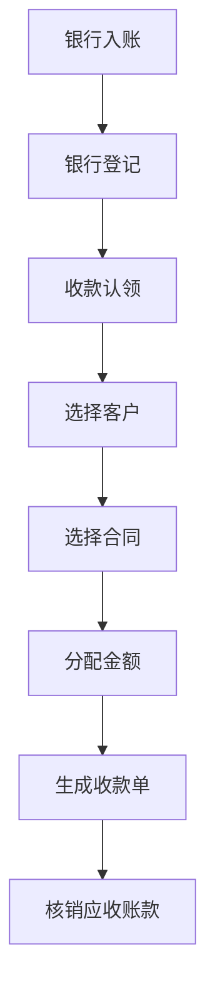
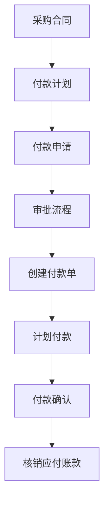
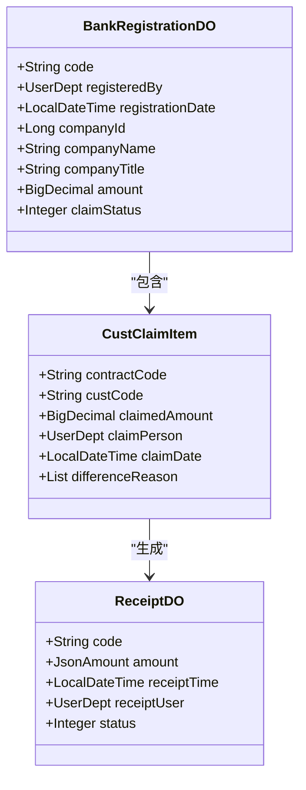
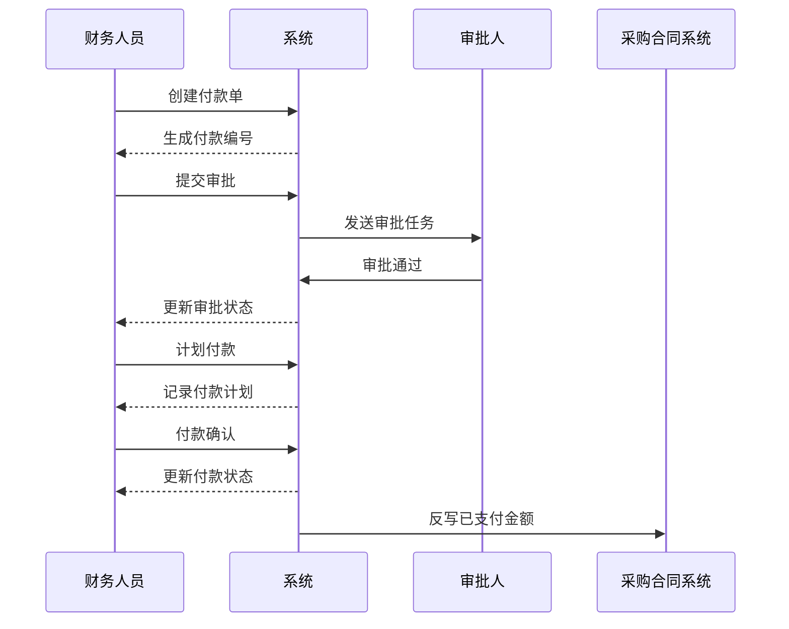
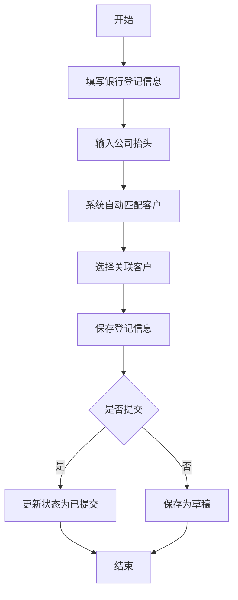
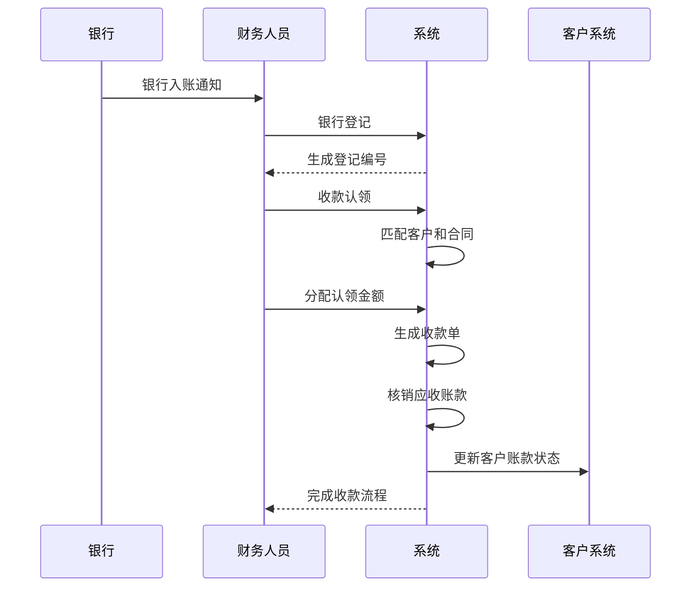
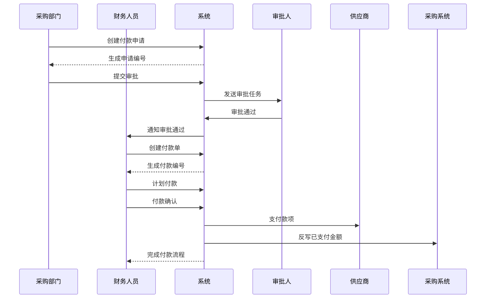

# 财务管理

<cite>
**本文档引用的文件**   
- [CustClaimApi.java](file://eplus-module-fms/eplus-module-fms-api/src/main/java/com/syj/eplus/module/fms/api/payment/api/custclaim/CustClaimApi.java)
- [PaymentApi.java](file://eplus-module-fms/eplus-module-fms-api/src/main/java/com/syj/eplus/module/fms/api/payment/api/payment/PaymentApi.java)
- [ReceiptApi.java](file://eplus-module-fms/eplus-module-fms-api/src/main/java/com/syj/eplus/module/fms/api/payment/api/receipt/ReceiptApi.java)
- [BankRegistrationController.java](file://eplus-module-fms/eplus-module-fms-biz/src/main/java/com/syj/eplus/module/fms/controller/admin/bankregistration/BankRegistrationController.java)
- [PaymentController.java](file://eplus-module-fms/eplus-module-fms-biz/src/main/java/com/syj/eplus/module/fms/controller/admin/payment/PaymentController.java)
- [ReceiptController.java](file://eplus-module-fms/eplus-module-fms-biz/src/main/java/com/syj/eplus/module/fms/controller/admin/receipt/ReceiptController.java)
- [CustClaimServiceImpl.java](file://eplus-module-fms/eplus-module-fms-biz/src/main/java/com/syj/eplus/module/fms/service/custclaim/CustClaimServiceImpl.java)
- [PaymentServiceImpl.java](file://eplus-module-fms/eplus-module-fms-biz/src/main/java/com/syj/eplus/module/fms/service/payment/PaymentServiceImpl.java)
- [ReceiptServiceImpl.java](file://eplus-module-fms/eplus-module-fms-biz/src/main/java/com/syj/eplus/module/fms/service/receipt/ReceiptServiceImpl.java)
- [BankRegistrationServiceImpl.java](file://eplus-module-fms/eplus-module-fms-biz/src/main/java/com/syj/eplus/module/fms/service/bankregistration/BankRegistrationServiceImpl.java)
- [PaymentDO.java](file://eplus-module-fms/eplus-module-fms-biz/src/main/java/com/syj/eplus/module/fms/dal/dataobject/payment/PaymentDO.java)
- [ReceiptDO.java](file://eplus-module-fms/eplus-module-fms-biz/src/main/java/com/syj/eplus/module/fms/dal/dataobject/receipt/ReceiptDO.java)
- [BankRegistrationDO.java](file://eplus-module-fms/eplus-module-fms-biz/src/main/java/com/syj/eplus/module/fms/dal/dataobject/bankregistration/BankRegistrationDO.java)
- [CustClaimItem.java](file://eplus-module-fms/eplus-module-fms-biz/src/main/java/com/syj/eplus/module/fms/dal/dataobject/custclaim/CustClaimItem.java)
- [ErrorCodeConstants.java](file://eplus-module-fms/eplus-module-fms-api/src/main/java/com/syj/eplus/module/fms/api/payment/enums/ErrorCodeConstants.java)
</cite>

## 目录
1. [引言](#引言)
2. [核心功能概述](#核心功能概述)
3. [应收应付管理](#应收应付管理)
4. [收付款流程](#收付款流程)
5. [银行登记与结汇](#银行登记与结汇)
6. [财务凭证与报表](#财务凭证与报表)
7. [税务相关功能](#税务相关功能)
8. [业务流程图](#业务流程图)
9. [结论](#结论)

## 引言

财务管理模块是企业财务运营的核心系统，负责处理应收应付账款、收付款、银行登记等关键财务业务。该模块通过与销售合同、采购合同、客户管理、供应商管理等系统的集成，实现了财务业务的自动化处理和全流程管控。本文档详细介绍了财务管理模块的核心功能、业务流程和系统实现，为财务人员和系统使用者提供全面的操作指导和业务理解。

**本文档引用的文件**   
- [CustClaimApi.java](file://eplus-module-fms/eplus-module-fms-api/src/main/java/com/syj/eplus/module/fms/api/payment/api/custclaim/CustClaimApi.java)
- [PaymentApi.java](file://eplus-module-fms/eplus-module-fms-api/src/main/java/com/syj/eplus/module/fms/api/payment/api/payment/PaymentApi.java)
- [ReceiptApi.java](file://eplus-module-fms/eplus-module-fms-api/src/main/java/com/syj/eplus/module/fms/api/payment/api/receipt/ReceiptApi.java)

## 核心功能概述

财务管理模块主要包含应收应付管理、收付款管理、银行登记、凭证生成等核心功能。系统通过统一的财务编码体系（如付款单以"FK"开头，收款单以"SK"开头）对各类财务单据进行管理。所有财务操作均支持工作流审批，确保财务流程的合规性和安全性。

系统实现了与客户管理（CRM）、供应商管理（SCM）、订单管理（SMS）等模块的深度集成，能够自动获取合同信息、客户信息和供应商信息，减少人工录入错误。同时，系统支持多币种处理和实时汇率计算，满足跨国业务的财务需求。

**本文档引用的文件**   
- [PaymentDO.java](file://eplus-module-fms/eplus-module-fms-biz/src/main/java/com/syj/eplus/module/fms/dal/dataobject/payment/PaymentDO.java)
- [ReceiptDO.java](file://eplus-module-fms/eplus-module-fms-biz/src/main/java/com/syj/eplus/module/fms/dal/dataobject/receipt/ReceiptDO.java)
- [BankRegistrationDO.java](file://eplus-module-fms/eplus-module-fms-biz/src/main/java/com/syj/eplus/module/fms/dal/dataobject/bankregistration/BankRegistrationDO.java)

## 应收应付管理

### 应收账款生成与核销

应收账款的生成主要与销售合同相关联。当销售合同确认后，系统根据合同约定的收款计划自动生成应收账款。在客户付款后，通过银行登记和收款认领流程完成应收账款的核销。

收款认领流程中，财务人员首先进行银行登记，记录银行入账信息。然后通过收款认领功能，将银行入账金额分配到具体的客户和合同上，系统自动更新应收账款状态。认领时支持将一笔银行入账分配到多个客户或合同，也支持一个客户或合同分多次认领。

**图表来源**  
- [BankRegistrationServiceImpl.java](file://eplus-module-fms/eplus-module-fms-biz/src/main/java/com/syj/eplus/module/fms/service/bankregistration/BankRegistrationServiceImpl.java)
- [CustClaimServiceImpl.java](file://eplus-module-fms/eplus-module-fms-biz/src/main/java/com/syj/eplus/module/fms/service/custclaim/CustClaimServiceImpl.java)
- [ReceiptServiceImpl.java](file://eplus-module-fms/eplus-module-fms-biz/src/main/java/com/syj/eplus/module/fms/service/receipt/ReceiptServiceImpl.java)

**本文档引用的文件**   
- [CustClaimItem.java](file://eplus-module-fms/eplus-module-fms-biz/src/main/java/com/syj/eplus/module/fms/dal/dataobject/custclaim/CustClaimItem.java)
- [CustClaimServiceImpl.java](file://eplus-module-fms/eplus-module-fms-biz/src/main/java/com/syj/eplus/module/fms/service/custclaim/CustClaimServiceImpl.java)

### 应付账款生成与支付

应付账款主要与采购合同和付款申请相关联。当采购合同确认后，系统根据合同约定的付款计划生成应付账款。付款申请单经过审批后，财务人员创建付款单进行支付。

付款流程包括付款申请、付款审批、计划付款和实际付款确认等环节。系统支持批量付款操作，可以一次性处理多笔付款。付款完成后，系统自动更新应付账款状态，并反写采购合同的已支付金额。

**图表来源**  
- [PaymentServiceImpl.java](file://eplus-module-fms/eplus-module-fms-biz/src/main/java/com/syj/eplus/module/fms/service/payment/PaymentServiceImpl.java)
- [PaymentDO.java](file://eplus-module-fms/eplus-module-fms-biz/src/main/java/com/syj/eplus/module/fms/dal/dataobject/payment/PaymentDO.java)

**本文档引用的文件**   
- [PaymentServiceImpl.java](file://eplus-module-fms/eplus-module-fms-biz/src/main/java/com/syj/eplus/module/fms/service/payment/PaymentServiceImpl.java)
- [PaymentDO.java](file://eplus-module-fms/eplus-module-fms-biz/src/main/java/com/syj/eplus/module/fms/dal/dataobject/payment/PaymentDO.java)

## 收付款流程

### 收款对象与收款申请

收款对象包括客户、个人和其他收款方。系统通过银行登记功能记录所有银行入账信息，包括入账单位、银行账号、入账金额等。银行登记完成后，进入收款认领流程。

在收款认领界面，系统会根据银行登记的公司抬头自动匹配可能的客户，并显示该客户的业务员信息。财务人员可以选择一个或多个客户进行认领，并分配认领金额。系统支持查看历史认领记录和差异原因。

**图表来源**  
- [BankRegistrationDO.java](file://eplus-module-fms/eplus-module-fms-biz/src/main/java/com/syj/eplus/module/fms/dal/dataobject/bankregistration/BankRegistrationDO.java)
- [CustClaimItem.java](file://eplus-module-fms/eplus-module-fms-biz/src/main/java/com/syj/eplus/module/fms/dal/dataobject/custclaim/CustClaimItem.java)
- [ReceiptDO.java](file://eplus-module-fms/eplus-module-fms-biz/src/main/java/com/syj/eplus/module/fms/dal/dataobject/receipt/ReceiptDO.java)

**本文档引用的文件**   
- [BankRegistrationDO.java](file://eplus-module-fms/eplus-module-fms-biz/src/main/java/com/syj/eplus/module/fms/dal/dataobject/bankregistration/BankRegistrationDO.java)
- [CustClaimItem.java](file://eplus-module-fms/eplus-module-fms-biz/src/main/java/com/syj/eplus/module/fms/dal/dataobject/custclaim/CustClaimItem.java)
- [ReceiptDO.java](file://eplus-module-fms/eplus-module-fms-biz/src/main/java/com/syj/eplus/module/fms/dal/dataobject/receipt/ReceiptDO.java)

### 付款申请与对公支付

付款申请包括公对公支付、报销付款、借款还款等多种类型。公对公支付主要与采购合同关联，系统支持从采购合同直接生成付款申请。

对公支付流程中，付款单创建后需要经过审批流程。审批通过后，财务人员进行计划付款，指定付款银行、银行账号和付款方式。最后进行付款确认，记录实际付款日期和出纳员信息，完成整个支付流程。

系统支持批量计划付款和批量付款确认，提高财务工作效率。对于已支付的付款单，系统提供作废功能，但已完全支付的付款单不能作废。

**图表来源**  
- [PaymentController.java](file://eplus-module-fms/eplus-module-fms-biz/src/main/java/com/syj/eplus/module/fms/controller/admin/payment/PaymentController.java)
- [PaymentServiceImpl.java](file://eplus-module-fms/eplus-module-fms-biz/src/main/java/com/syj/eplus/module/fms/service/payment/PaymentServiceImpl.java)

**本文档引用的文件**   
- [PaymentController.java](file://eplus-module-fms/eplus-module-fms-biz/src/main/java/com/syj/eplus/module/fms/controller/admin/payment/PaymentController.java)
- [PaymentServiceImpl.java](file://eplus-module-fms/eplus-module-fms-biz/src/main/java/com/syj/eplus/module/fms/service/payment/PaymentServiceImpl.java)

## 银行登记与结汇

### 银行登记流程

银行登记是财务管理的基础环节，用于记录所有银行账户的入账信息。登记内容包括登记人、登记日期、入账单位、公司抬头、银行信息、入账金额等。

系统通过公司抬头自动匹配相关客户和业务员，为后续的收款认领提供便利。银行登记支持批量创建，可以一次性登记多笔银行入账。登记完成后，系统会根据认领状态（未认领、部分认领、已认领）进行分类管理。

**图表来源**  
- [BankRegistrationServiceImpl.java](file://eplus-module-fms/eplus-module-fms-biz/src/main/java/com/syj/eplus/module/fms/service/bankregistration/BankRegistrationServiceImpl.java)
- [BankRegistrationDO.java](file://eplus-module-fms/eplus-module-fms-biz/src/main/java/com/syj/eplus/module/fms/dal/dataobject/bankregistration/BankRegistrationDO.java)

**本文档引用的文件**   
- [BankRegistrationServiceImpl.java](file://eplus-module-fms/eplus-module-fms-biz/src/main/java/com/syj/eplus/module/fms/service/bankregistration/BankRegistrationServiceImpl.java)
- [BankRegistrationDO.java](file://eplus-module-fms/eplus-module-fms-biz/src/main/java/com/syj/eplus/module/fms/dal/dataobject/bankregistration/BankRegistrationDO.java)

### 结汇单与开票通知

结汇单处理与银行登记紧密相关。当银行登记的款项完成收款认领后，系统自动生成结汇单信息。结汇单记录了每笔款项的结汇汇率、结汇金额和结汇日期。

开票通知功能与销售合同和客户管理模块集成。当应收账款达到开票条件时，系统可以自动生成开票通知，提醒相关人员开具发票。开票完成后，发票信息会反写到财务系统，与应收账款进行关联。

系统还支持开票申请流程，用户可以提交开票申请，经过审批后由财务人员开具发票。开票信息包括发票类型、发票金额、开票日期、发票号码等。

**本文档引用的文件**   
- [ReceiptServiceImpl.java](file://eplus-module-fms/eplus-module-fms-biz/src/main/java/com/syj/eplus/module/fms/service/receipt/ReceiptServiceImpl.java)
- [CustClaimServiceImpl.java](file://eplus-module-fms/eplus-module-fms-biz/src/main/java/com/syj/eplus/module/fms/service/custclaim/CustClaimServiceImpl.java)

## 财务凭证与报表

### 凭证生成规则

财务凭证的生成遵循预设的规则，确保会计处理的规范性和一致性。系统根据不同的业务类型（如收款、付款、报销等）应用不同的凭证模板。

凭证生成时，系统自动获取业务单据的相关信息，包括金额、币种、往来单位、成本中心等，并根据会计科目映射规则生成相应的会计分录。凭证支持手工调整和补充说明。

系统提供凭证预览功能，用户可以在正式生成凭证前查看凭证内容。生成的凭证与原始业务单据保持关联，支持从凭证追溯到原始业务。

**本文档引用的文件**   
- [PaymentServiceImpl.java](file://eplus-module-fms/eplus-module-fms-biz/src/main/java/com/syj/eplus/module/fms/service/payment/PaymentServiceImpl.java)
- [ReceiptServiceImpl.java](file://eplus-module-fms/eplus-module-fms-biz/src/main/java/com/syj/eplus/module/fms/service/receipt/ReceiptServiceImpl.java)

### 财务报表概览

系统提供多种财务报表，包括应收账款报表、应付账款报表、收付款明细表、银行余额表等。报表支持多维度查询和筛选，如按时间范围、客户/供应商、币种、业务类型等。

应收账款报表显示各客户的应收余额、账龄分析和逾期情况。应付账款报表显示对各供应商的应付余额和付款计划。收付款明细表记录所有收付款交易的详细信息。

报表支持导出功能，可以导出为Excel格式进行进一步分析。系统还提供报表订阅功能，用户可以定期收到关键财务报表。

**本文档引用的文件**   
- [PaymentServiceImpl.java](file://eplus-module-fms/eplus-module-fms-biz/src/main/java/com/syj/eplus/module/fms/service/payment/PaymentServiceImpl.java)
- [ReceiptServiceImpl.java](file://eplus-module-fms/eplus-module-fms-biz/src/main/java/com/syj/eplus/module/fms/service/receipt/ReceiptServiceImpl.java)

## 税务相关功能

### 发票登记与管理

发票登记功能用于记录所有开具和收到的发票信息。系统支持增值税专用发票、普通发票等多种发票类型。发票信息包括发票代码、发票号码、开票日期、金额、税额等。

发票管理支持发票的查询、统计和导出。系统可以按客户、供应商、开票日期等条件进行发票查询。对于收到的发票，系统支持进项税抵扣管理。

系统还提供发票真伪验证接口，可以与税务机关系统对接，验证发票的真实性。发票异常情况（如红冲、作废）也会在系统中进行记录和管理。

**本文档引用的文件**   
- [ReceiptServiceImpl.java](file://eplus-module-fms/eplus-module-fms-biz/src/main/java/com/syj/eplus/module/fms/service/receipt/ReceiptServiceImpl.java)

### 开票管理流程

开票管理流程从开票申请开始。用户提交开票申请，填写开票金额、开票内容等信息。申请经过审批后，财务人员根据申请开具发票。

开票时，系统自动获取客户开票信息，包括公司名称、税号、开户行等，减少手工录入错误。开票完成后，发票信息保存到系统，并与相关业务单据关联。

系统支持发票的批量开具和模板化开票，提高开票效率。对于需要分批开票的业务，系统支持部分开票和开票进度跟踪。

**本文档引用的文件**   
- [ReceiptServiceImpl.java](file://eplus-module-fms/eplus-module-fms-biz/src/main/java/com/syj/eplus/module/fms/service/receipt/ReceiptServiceImpl.java)

## 业务流程图

### 典型收款场景流程

**图表来源**  
- [BankRegistrationServiceImpl.java](file://eplus-module-fms/eplus-module-fms-biz/src/main/java/com/syj/eplus/module/fms/service/bankregistration/BankRegistrationServiceImpl.java)
- [CustClaimServiceImpl.java](file://eplus-module-fms/eplus-module-fms-biz/src/main/java/com/syj/eplus/module/fms/service/custclaim/CustClaimServiceImpl.java)
- [ReceiptServiceImpl.java](file://eplus-module-fms/eplus-module-fms-biz/src/main/java/com/syj/eplus/module/fms/service/receipt/ReceiptServiceImpl.java)

### 典型付款场景流程

**图表来源**  
- [PaymentController.java](file://eplus-module-fms/eplus-module-fms-biz/src/main/java/com/syj/eplus/module/fms/controller/admin/payment/PaymentController.java)
- [PaymentServiceImpl.java](file://eplus-module-fms/eplus-module-fms-biz/src/main/java/com/syj/eplus/module/fms/service/payment/PaymentServiceImpl.java)

## 结论

财务管理模块通过系统化的流程设计和自动化处理，实现了企业财务业务的高效管理和风险控制。系统涵盖了应收应付、收付款、银行登记等核心财务功能，与业务系统深度集成，确保了财务数据的准确性和及时性。

模块采用工作流驱动的审批机制，保证了财务操作的合规性。通过统一的编码体系和数据模型，实现了财务单据的标准化管理。系统还提供了丰富的报表和分析功能，为财务决策提供了有力支持。

未来，系统可以进一步优化智能对账、税务自动化申报等功能，提升财务管理的智能化水平。

**本文档引用的文件**   
- [PaymentApi.java](file://eplus-module-fms/eplus-module-fms-api/src/main/java/com/syj/eplus/module/fms/api/payment/api/payment/PaymentApi.java)
- [ReceiptApi.java](file://eplus-module-fms/eplus-module-fms-api/src/main/java/com/syj/eplus/module/fms/api/payment/api/receipt/ReceiptApi.java)
- [CustClaimApi.java](file://eplus-module-fms/eplus-module-fms-api/src/main/java/com/syj/eplus/module/fms/api/payment/api/custclaim/CustClaimApi.java)
- [ErrorCodeConstants.java](file://eplus-module-fms/eplus-module-fms-api/src/main/java/com/syj/eplus/module/fms/api/payment/enums/ErrorCodeConstants.java)