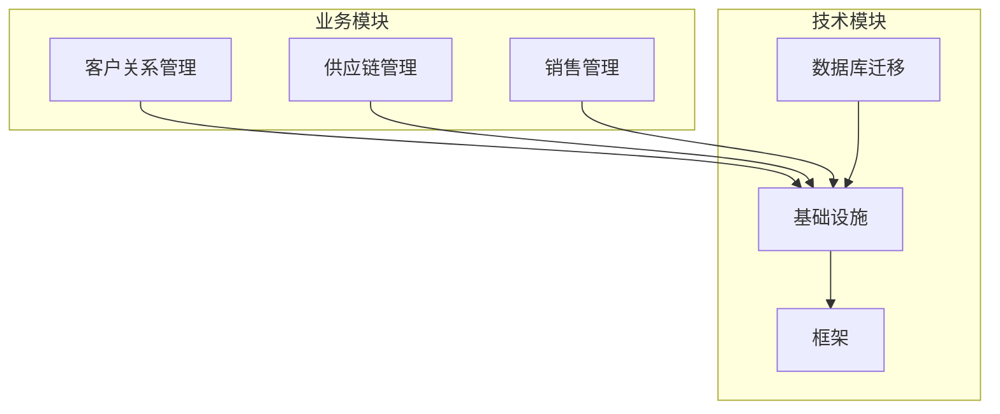
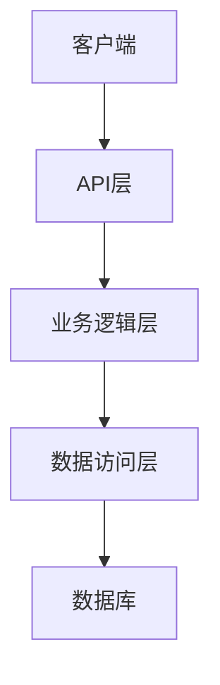
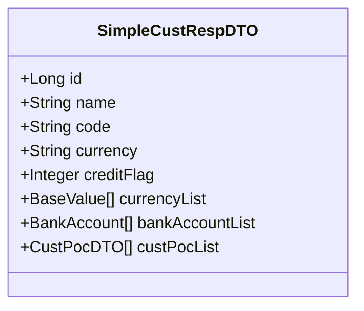
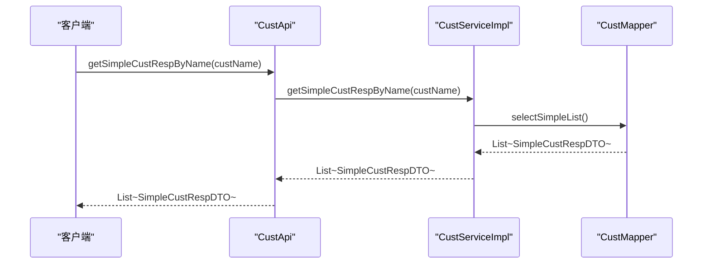
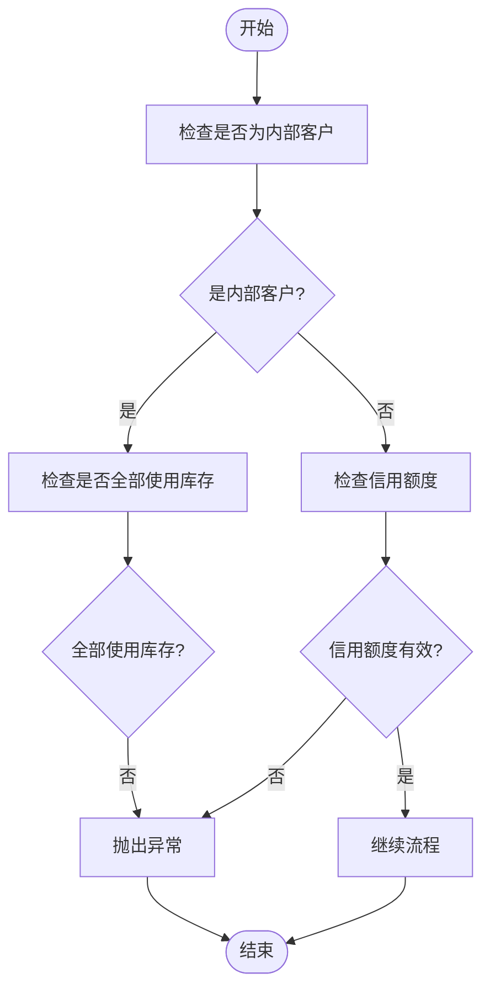
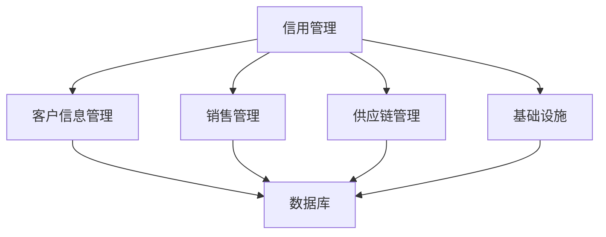

# 信用管理

<cite>
**本文档引用的文件**  
- [SimpleCustRespDTO.java](file://eplus-module-crm/eplus-module-crm-api/src/main/java/com/syj/eplus/module/crm/api/cust/dto/SimpleCustRespDTO.java)
- [CustServiceImpl.java](file://eplus-module-crm/eplus-module-crm-biz/src/main/java/com/syj/eplus/module/crm/service/cust/CustServiceImpl.java)
- [CustApi.java](file://eplus-module-crm/eplus-module-crm-api/src/main/java/com/syj/eplus/module/crm/api/cust/CustApi.java)
- [SaleContractServiceImpl.java](file://eplus-module-sms/eplus-module-sms-biz/src/main/java/com/syj/eplus/module/sms/service/salecontract/SaleContractServiceImpl.java)
- [system_collection_plan.sql](file://eplus-flyway/src/main/resources/db/migration/common/V1_0_0_002__Eplus初始化.sql)
- [SystemCollectionPlan.java](file://eplus-module-infra/eplus-module-infra-biz/src/main/java/com/syj/eplus/module/infra/dal/dataobject/collectionplan/SystemCollectionPlan.java)
- [CustService.java](file://eplus-module-crm/eplus-module-crm-biz/src/main/java/com/syj/eplus/module/crm/service/cust/CustService.java)
</cite>

## 目录

1. [简介](#简介)
2. [项目结构](#项目结构)
3. [核心组件](#核心组件)
4. [架构概述](#架构概述)
5. [详细组件分析](#详细组件分析)
6. [依赖分析](#依赖分析)
7. [性能考虑](#性能考虑)
8. [故障排除指南](#故障排除指南)
9. [结论](#结论)
10. [附录](#附录)（如有必要）

## 简介

本文件全面介绍客户信用管理功能的实现，涵盖客户信用额度的设置、使用和监控机制。文档详细说明了信用额度模型的设计，包括授信额度、已用额度和可用额度等关键字段。同时，解释了信用额度审批流程和调整机制，描述了在销售合同创建、出货等环节的信用检查规则和超限处理策略。此外，文档还说明了信用额度与应收账款的关联关系，并提供了信用管理相关的API接口文档，包括额度查询和使用情况统计等功能。最后，文档包含了信用管理的业务规则，如信用评估标准和风险预警机制。

## 项目结构

本项目采用模块化设计，主要分为多个业务模块，如CRM、SCM、SMS等。每个模块包含API和Biz两个子模块，分别负责接口定义和业务逻辑实现。信用管理功能主要集中在CRM模块中，涉及客户信息管理、信用额度设置和监控等方面。

**图表来源**  
- [SimpleCustRespDTO.java](file://eplus-module-crm/eplus-module-crm-api/src/main/java/com/syj/eplus/module/crm/api/cust/dto/SimpleCustRespDTO.java)
- [SystemCollectionPlan.java](file://eplus-module-infra/eplus-module-infra-biz/src/main/java/com/syj/eplus/module/infra/dal/dataobject/collectionplan/SystemCollectionPlan.java)

**章节来源**  
- [SimpleCustRespDTO.java](file://eplus-module-crm/eplus-module-crm-api/src/main/java/com/syj/eplus/module/crm/api/cust/dto/SimpleCustRespDTO.java)
- [CustServiceImpl.java](file://eplus-module-crm/eplus-module-crm-biz/src/main/java/com/syj/eplus/module/crm/service/cust/CustServiceImpl.java)

## 核心组件

信用管理功能的核心组件包括客户信息管理、信用额度设置、信用检查规则和风险预警机制。这些组件通过API接口进行交互，确保信用管理的准确性和及时性。

**章节来源**  
- [SimpleCustRespDTO.java](file://eplus-module-crm/eplus-module-crm-api/src/main/java/com/syj/eplus/module/crm/api/cust/dto/SimpleCustRespDTO.java)
- [CustServiceImpl.java](file://eplus-module-crm/eplus-module-crm-biz/src/main/java/com/syj/eplus/module/crm/service/cust/CustServiceImpl.java)

## 架构概述

信用管理系统的架构设计遵循分层原则，主要包括数据访问层、业务逻辑层和接口层。数据访问层负责与数据库交互，业务逻辑层处理信用管理的核心逻辑，接口层提供对外服务。

**图表来源**  
- [CustServiceImpl.java](file://eplus-module-crm/eplus-module-crm-biz/src/main/java/com/syj/eplus/module/crm/service/cust/CustServiceImpl.java)
- [SystemCollectionPlan.java](file://eplus-module-infra/eplus-module-infra-biz/src/main/java/com/syj/eplus/module/infra/dal/dataobject/collectionplan/SystemCollectionPlan.java)

## 详细组件分析

### 客户信息管理分析

客户信息管理是信用管理的基础，通过`SimpleCustRespDTO`类定义客户的基本信息，包括客户编号、名称、币种等。信用额度相关字段如`creditFlag`用于标识是否启用信用额度。

#### 对象导向组件：

**图表来源**  
- [SimpleCustRespDTO.java](file://eplus-module-crm/eplus-module-crm-api/src/main/java/com/syj/eplus/module/crm/api/cust/dto/SimpleCustRespDTO.java)

#### API/服务组件：

**图表来源**  
- [CustApi.java](file://eplus-module-crm/eplus-module-crm-api/src/main/java/com/syj/eplus/module/crm/api/cust/CustApi.java)
- [CustServiceImpl.java](file://eplus-module-crm/eplus-module-crm-biz/src/main/java/com/syj/eplus/module/crm/service/cust/CustServiceImpl.java)

### 信用检查规则分析

在销售合同创建和出货过程中，系统会进行信用检查。通过`SaleContractServiceImpl`类中的逻辑，检查客户是否为内部客户，并验证其信用额度使用情况。

#### 复杂逻辑组件：

**图表来源**  
- [SaleContractServiceImpl.java](file://eplus-module-sms/eplus-module-sms-biz/src/main/java/com/syj/eplus/module/sms/service/salecontract/SaleContractServiceImpl.java)

**章节来源**  
- [SaleContractServiceImpl.java](file://eplus-module-sms/eplus-module-sms-biz/src/main/java/com/syj/eplus/module/sms/service/salecontract/SaleContractServiceImpl.java)

## 依赖分析

信用管理功能依赖于多个模块和组件，包括客户信息管理、销售管理、供应链管理和基础设施模块。这些依赖关系确保了信用管理的完整性和一致性。

**图表来源**  
- [CustServiceImpl.java](file://eplus-module-crm/eplus-module-crm-biz/src/main/java/com/syj/eplus/module/crm/service/cust/CustServiceImpl.java)
- [SaleContractServiceImpl.java](file://eplus-module-sms/eplus-module-sms-biz/src/main/java/com/syj/eplus/module/sms/service/salecontract/SaleContractServiceImpl.java)

**章节来源**  
- [CustServiceImpl.java](file://eplus-module-crm/eplus-module-crm-biz/src/main/java/com/syj/eplus/module/crm/service/cust/CustServiceImpl.java)
- [SaleContractServiceImpl.java](file://eplus-module-sms/eplus-module-sms-biz/src/main/java/com/syj/eplus/module/sms/service/salecontract/SaleContractServiceImpl.java)

## 性能考虑

信用管理功能在设计时考虑了性能优化，通过缓存机制减少数据库查询次数，提高系统响应速度。同时，使用异步处理方式，避免阻塞主线程，确保系统的高可用性。

## 故障排除指南

在使用信用管理功能时，可能会遇到一些常见问题，如信用额度超限、客户信息不完整等。建议定期检查客户信用额度设置，确保数据的准确性。对于信用额度超限的情况，应及时调整信用额度或与客户沟通解决。

**章节来源**  
- [CustServiceImpl.java](file://eplus-module-crm/eplus-module-crm-biz/src/main/java/com/syj/eplus/module/crm/service/cust/CustServiceImpl.java)
- [SaleContractServiceImpl.java](file://eplus-module-sms/eplus-module-sms-biz/src/main/java/com/syj/eplus/module/sms/service/salecontract/SaleContractServiceImpl.java)

## 结论

本文档全面介绍了客户信用管理功能的实现，涵盖了信用额度的设置、使用和监控机制。通过详细的组件分析和架构设计，确保了信用管理的准确性和高效性。未来可以进一步优化信用评估模型，提高风险预警的准确性。

## 附录

无