# 客户信息维护

<cite>
**本文档引用文件**   
- [V1_0_0_002__Eplus初始化.sql](file://eplus-flyway/src/main/resources/db/migration/common/V1_0_0_002__Eplus初始化.sql)
- [SimpleCustRespDTO.java](file://eplus-module-crm/eplus-module-crm-api/src/main/java/com/syj/eplus/module/crm/api/cust/dto/SimpleCustRespDTO.java)
- [CustAllDTO.java](file://eplus-module-crm/eplus-module-crm-api/src/main/java/com/syj/eplus/module/crm/api/cust/dto/CustAllDTO.java)
- [CustApi.java](file://eplus-module-crm/eplus-module-crm-api/src/main/java/com/syj/eplus/module/crm/api/cust/CustApi.java)
- [CustController.java](file://eplus-module-crm/eplus-module-crm-biz/src/main/java/com/syj/eplus/module/crm/controller/admin/cust/CustController.java)
- [CustService.java](file://eplus-module-crm/eplus-module-crm-biz/src/main/java/com/syj/eplus/module/crm/service/cust/CustService.java)
- [CustInfoSaveReqVO.java](file://eplus-module-crm/eplus-module-crm-biz/src/main/java/com/syj/eplus/module/crm/controller/admin/cust/vo/CustInfoSaveReqVO.java)
- [CustInfoRespVo.java](file://eplus-module-crm/eplus-module-crm-biz/src/main/java/com/syj/eplus/module/crm/controller/admin/cust/vo/CustInfoRespVo.java)
- [BankAccount.java](file://eplus-framework/eplus-common/src/main/java/com/syj/eplus/framework/common/entity/BankAccount.java)
- [CustPocDTO.java](file://eplus-module-crm/eplus-module-crm-api/src/main/java/com/syj/eplus/module/crm/api/cust/dto/CustPocDTO.java)
- [ErrorCodeConstants.java](file://eplus-module-crm/eplus-module-crm-api/src/main/java/com/syj/eplus/module/crm/enums/ErrorCodeConstants.java)
</cite>

## 目录
1. [项目结构](#项目结构)
2. [核心组件](#核心组件)
3. [客户主数据模型设计](#客户主数据模型设计)
4. [客户信息增删改查操作流程](#客户信息增删改查操作流程)
5. [数据验证规则](#数据验证规则)
6. [客户信息变更审批流程](#客户信息变更审批流程)
7. [历史记录追踪机制](#历史记录追踪机制)
8. [客户状态管理](#客户状态管理)
9. [API接口文档](#api接口文档)
10. [业务规则](#业务规则)

## 项目结构

客户信息维护功能主要位于 `eplus-module-crm` 模块中，该模块分为API层和业务层两个子模块。系统采用分层架构设计，包括数据访问层、服务层、控制层和API接口层。

```mermaid
graph TB
subgraph "eplus-module-crm"
subgraph "eplus-module-crm-api"
CustApi[CustApi.java]
DTOs[DTO类]
end
subgraph "eplus-module-crm-biz"
Controller[CustController.java]
Service[CustService.java]
Converters[Convert类]
Mappers[Mapper类]
DataObjects[DataObject类]
end
CustApi --> Controller
Controller --> Service
Service --> Mappers
Mappers --> Database[(数据库)]
style CustApi fill:#f9f,stroke:#333
style Controller fill:#bbf,stroke:#333
style Service fill:#f96,stroke:#333
style Mappers fill:#9f9,stroke:#333
```

**图源**
- [CustApi.java](file://eplus-module-crm/eplus-module-crm-api/src/main/java/com/syj/eplus/module/crm/api/cust/CustApi.java)
- [CustController.java](file://eplus-module-crm/eplus-module-crm-biz/src/main/java/com/syj/eplus/module/crm/controller/admin/cust/CustController.java)
- [CustService.java](file://eplus-module-crm/eplus-module-crm-biz/src/main/java/com/syj/eplus/module/crm/service/cust/CustService.java)

**本节来源**
- [CustApi.java](file://eplus-module-crm/eplus-module-crm-api/src/main/java/com/syj/eplus/module/crm/api/cust/CustApi.java)
- [CustController.java](file://eplus-module-crm/eplus-module-crm-biz/src/main/java/com/syj/eplus/module/crm/controller/admin/cust/CustController.java)

## 核心组件

客户信息维护功能的核心组件包括客户API接口、客户控制器、客户服务和数据对象。这些组件协同工作，实现了客户信息的完整生命周期管理。

```mermaid
classDiagram
class CustApi {
+Map<String, String> getCustNameCache(String code)
+List<SimpleCustRespDTO> getSimpleCustRespDTO(List<Long> idList)
+SimpleCustRespDTO getSimpleCustByInternalCompanyId(Long internalCompanyId)
+List<SimpleCustResp> getSimpleCustRespByBankPoc(String bankPoc)
+void createCustTitle(Map<String,Long> notExistCustCodeMap, String custTitle)
+Map<String, CustAllDTO> getCustByCodeList(List<String> codeList)
+List<String> getCodeListByName(String custName)
+CustAllDTO getCustChangeByCode(String code)
+List<ConfirmSourceEntity> getConfirmSourceList(String targetCode, Integer effectRangeType)
+List<String> getCodeListByCountryCode(Long countryId, String regionCode)
+CustAllDTO getCustByCode(String custCode)
+getMarkListByCustCode(Long custId)
+getCollectionAccountByCust(String custCode, Long companyId)
+getSimpleCustRespByCode(List<String> cutCodeList)
+getSimpleCustRespByName(String custName)
+void deleteCustTitle(List<Long> payeeEntityIds)
+boolean checkIsInternalCust(String custCode)
+Long getInternalCompany(String custCode)
+getCollectionPlanDTOByCustCode(String custCode)
+getBankPocByCustCode(String custCode)
+getCustPocByCustCode(String custCode)
+Map<Long, CustDTO> getCustByIds(List<Long> custIds)
+Map<Long, BaseData> getAllInnerCustCache()
}
class CustController {
+CommonResult<Long> createCust(CustInfoSaveReqVO createReqVO)
+CommonResult<Boolean> updateCust(CustInfoSaveReqVO updateReqVO)
+CommonResult<Boolean> convertCust(CustInfoSaveReqVO updateReqVO)
+CommonResult<Boolean> deleteCust(Long id)
+CommonResult<CustInfoRespVo> getCustById(Long id)
+CommonResult<CustInfoRespVo> getCustByCode(String code)
+CommonResult<CustInfoRespVo> getCustByProcessId(String id)
+CommonResult<PageResult<SimpleCustRespDTO>> getSimpleCust(CustPageReqVO pageReqVO)
+CommonResult<PageResult<CustRespVO>> getCustPage(CustPageReqVO pageReqVO)
+void exportCustExcel(CustPageReqVO pageReqVO, HttpServletResponse response)
+CommonResult<Boolean> approveTask(BpmTaskApproveReqDTO reqDTO)
+CommonResult<Boolean> rejectTask(BpmTaskRejectReqDTO reqDTO)
+CommonResult<List<String>> findSimilarNames(String name)
+CommonResult<Boolean> submitTask(Long custId)
+CommonResult<PageResult<SimpleCustRespDTO>> getPayableVender(SimplePageReqVO simplePageReqVO)
+CommonResult<Boolean> enableCust(Long custId)
+CommonResult<Boolean> disableCust(Long custId)
+CommonResult<List<String>> getSimpleCustName(String name)
+CommonResult<Boolean> changeCust(CustInfoSaveReqVO changeReqVO)
+CommonResult<PageResult<CustRespVO>> getCustChangePage(CustPageReqVO pageReqVO)
+CommonResult<ChangeEffectRespVO> getChangeEffect(CustInfoSaveReqVO changeReqVO)
+CommonResult<Boolean> updateChangeCust(CustInfoSaveReqVO updateReqVO)
+CommonResult<Boolean> deleteChangeCust(Long id)
+CommonResult<CustInfoRespVo> getChangeCustById(Long id)
+CommonResult<CustInfoRespVo> getChangeCustByProcessId(String id)
+CommonResult<Boolean> approveChangeTask(BpmTaskApproveReqDTO reqDTO)
+CommonResult<Boolean> rejectChangeTask(BpmTaskRejectReqDTO reqDTO)
+CommonResult<Boolean> submitChangeTask(Long custId)
+CommonResult<Boolean> antiAudit(Long custId)
+CommonResult<Boolean> managerDeleteCust(Long id)
+CommonResult<PageResult<CustRespVO>> custDuplicateCheck(CustPageReqVO pageReqVO)
}
class CustService {
+Long createCust(CustInfoSaveReqVO createInfoReqVO)
+void updateCust(CustInfoSaveReqVO updateReqVO)
+Long changeCust(CustInfoSaveReqVO changeReqVO)
+void changeSuccess(CustInfoRespVo cust)
+void deleteCust(Long id, Boolean deleted)
+void deleteChangeCust(Long id)
+void deleteOldCust(Long id)
+CustInfoRespVo getCust(CrmCustDetailReq req)
+CustInfoRespVo getCustChange(CrmCustDetailReq req)
+CustInfoRespVo getCustChangeByCode(String code)
+CustInfoRespVo getOldCust(CustInfoRespVo cust)
+PageResult<CustRespVO> getCustPage(CustPageReqVO pageReqVO)
+PageResult<CustRespVO> getCustChangePage(CustPageReqVO pageReqVO)
+ChangeEffectRespVO getChangeEffect(CustInfoRespVo changeReqVO)
+void approveTask(Long userId, BpmTaskApproveReqDTO reqdTO)
+void rejectTask(Long userId, BpmTaskRejectReqDTO reqDTO)
+void submitTask(Long custId, Long userId)
+String getProcessDefinitionKey()
+void updateAuditStatus(Long auditableId, Integer auditStatus)
+void updateChangeAuditStatus(Long auditableId, Integer auditStatus)
+PageResult<SimpleCustRespDTO> getSimpleCust(CustPageReqVO pageReqVO)
+Map<String, String> getCustNameCache(String code)
+List<SimpleCustRespDTO> getSimpleCustRespDTOList(List<Long> idList)
+PageResult<SimpleCustRespDTO> getSimpleCustRespDTO(SimplePageReqVO simplePageReqVO)
+void convertCust(CustInfoSaveReqVO updateReqVO)
+void enableCust(Long custId)
+void disableCust(Long custId)
+List<SimpleCustResp> getSimpleCustRespByBankPoc(String bankPoc)
+void createCustTitle(Map<String,Long> notExistCustCodeMap, String custTitle)
+List<CustDO> getCustByCodeList(List<String> codeList)
+List<String> getCodeListByName(String custName)
+List<String> checkName(String name)
+String getChangeProcessDefinitionKey()
+void approveChangeTask(Long userId, BpmTaskApproveReqDTO reqdTO)
+void rejectChangeTask(Long userId, BpmTaskRejectReqDTO reqDTO)
+void submitChangeTask(Long custId, Long userId)
+List<ConfirmSourceEntity> getConfirmSourceList(String targetCode, Integer effectRangeType)
+getProcessDefinitionKeyByBusinessId(Long id)
+getCodeListByCountryCode(Long countryId, String regionCode)
+getCustByCode(String custCode)
+getCustomersWithIdGreaterThan(Long lastId)
+getMarkListByCustCode(Long custId)
+boolean antiAudit(Long id)
+getCodeListByNameList(List<String> nameList)
+getBankPocListByTitle(String title)
+getSimpleCustRespByCode(List<String> cutCodeList)
+getSimpleCustRespByName(String custName)
+void deleteCustTitle(List<Long> payeeEntityIds)
+boolean checkIsInternalCust(String custCode)
+getInternalCompany(String custCode)
+getCollectionPlanDTOByCustCode(String custCode)
+getBankPocByCustCode(String custCode)
+getCustPocByCustCode(String custCode)
+void managerDeleteCust(Long id)
+PageResult<CustRespVO> custDuplicateCheck(CustPageReqVO pageReqVO)
+getCustByIds(List<Long> custIds)
+getAllInnerCustCache()
}
CustApi --> CustController : "调用"
CustController --> CustService : "依赖"
CustService --> CustDO : "操作"
class CustDO {
+Long id
+Integer ver
+String name
+String shortname
+String code
+Long countryId
+String homepage
+String email
+String customerTypes
+Integer stageType
+String currency
+Integer settleCode
+Integer transportType
+String address
+String phone
+Integer abroadFlag
+Integer sourceType
+Integer creditFlag
+JsonAmount creditLimit
+Integer zxbquotaFlag
+String settlementTermType
+String invoiceHeader
+BigDecimal taxRate
+Integer agentFlag
+Integer auditStatus
+List<Object> addressShipping
+String remark
+String managerIds
+Integer convertFlag
+LocalDateTime convertTime
+Integer enableFlag
+String annex
+String picture
+String custLinkCode
+LocalDateTime createTime
+LocalDateTime updateTime
+String creator
+String updater
+Boolean deleted
}
CustService --> CustDO
```

**图源**
- [CustApi.java](file://eplus-module-crm/eplus-module-crm-api/src/main/java/com/syj/eplus/module/crm/api/cust/CustApi.java)
- [CustController.java](file://eplus-module-crm/eplus-module-crm-biz/src/main/java/com/syj/eplus/module/crm/controller/admin/cust/CustController.java)
- [CustService.java](file://eplus-module-crm/eplus-module-crm-biz/src/main/java/com/syj/eplus/module/crm/service/cust/CustService.java)
- [V1_0_0_002__Eplus初始化.sql](file://eplus-flyway/src/main/resources/db/migration/common/V1_0_0_002__Eplus初始化.sql)

**本节来源**
- [CustApi.java](file://eplus-module-crm/eplus-module-crm-api/src/main/java/com/syj/eplus/module/crm/api/cust/CustApi.java)
- [CustController.java](file://eplus-module-crm/eplus-module-crm-biz/src/main/java/com/syj/eplus/module/crm/controller/admin/cust/CustController.java)
- [CustService.java](file://eplus-module-crm/eplus-module-crm-biz/src/main/java/com/syj/eplus/module/crm/service/cust/CustService.java)

## 客户主数据模型设计

客户主数据模型设计涵盖了客户基本信息、财务信息、联系人信息等多个方面，通过多个相关表来实现完整的信息管理。

### 客户基本信息表 (crm_cust)

客户基本信息表存储了客户的核心信息，是客户数据模型的主体。

```mermaid
erDiagram
crm_cust {
bigint id PK "主键"
int ver "版本号"
varchar(100) name "企业名称"
varchar(100) shortname "简称"
varchar(10) code "客户编号"
bigint country_id "国家编码"
varchar(100) homepage "官网"
varchar(100) email "电子邮件"
varchar(100) customer_types "客户类型"
tinyint stage_type "客户阶段"
varchar(3) currency "币种"
bigint settle_code "收款方式id"
tinyint transport_type "运输方式"
varchar(255) address "营业地址"
varchar(20) phone "联系电话"
tinyint abroad_flag "国外客户标志"
tinyint source_type "客户来源"
tinyint credit_flag "启用信用额度"
json credit_limit "信用额度"
tinyint zxbquota_flag "是否是中信保"
varchar(10) settlement_term_type "价格条款"
varchar(100) invoice_header "开票抬头"
decimal(10,4) tax_rate "税率"
tinyint agent_flag "是否代理"
tinyint audit_status "处理状态"
json address_shipping "寄件地址"
text remark "备用信息"
json manager_ids "业务员"
tinyint convert_flag "转正标识"
datetime convert_time "转正时间"
tinyint enable_flag "是否启用"
json annex "附件"
json picture "图片"
json cust_link_code "关联客户"
datetime create_time "创建时间"
datetime update_time "更新时间"
int creator "创建者"
int updater "更新者"
bit deleted "是否删除"
}
crm_cust_bankaccount {
bigint id PK "主键"
int ver "版本号"
bigint cust_id FK "客户id"
varchar(100) bank "开户行"
varchar(100) bank_account "银行账户"
varchar(100) bank_address "开户行地址"
varchar(100) bank_poc "开户行联系人"
varchar(100) bank_code "银行账号"
tinyint default_flag "是否默认账户"
int creator "创建者"
datetime create_time "创建时间"
int updater "更新者"
datetime update_time "更新时间"
bit deleted "是否删除"
}
crm_cust_poc {
bigint id PK "主键"
int ver "版本号"
bigint cust_id FK "客户id"
varchar(100) name "联系人姓名"
varchar(100) poc_posts "联系人职位"
varchar(100) email "电子邮件"
varchar(20) mobile "手机"
varchar(255) address "住宅地址"
tinyint default_flag "默认联系人"
text remark "备注"
varchar(20) telephone "座机"
varchar(50) wechat "微信"
varchar(50) qq "QQ"
json card "名片"
int creator "创建者"
datetime create_time "创建时间"
int updater "更新者"
datetime update_time "更新时间"
bit deleted "是否删除"
}
crm_company_path {
bigint id PK "主键"
varchar(100) company_path_id "公司路径主键"
varchar(100) cust_code "客户编号"
varchar(100) default_flag "是否默认"
int creator "创建人"
datetime create_time "创建时间"
int updater "修改人"
tinyint deleted "删除"
datetime update_time "修改时间"
}
crm_cust ||--o{ crm_cust_bankaccount : "拥有"
crm_cust ||--o{ crm_cust_poc : "拥有"
crm_cust ||--o{ crm_company_path : "关联"
```

**图源**
- [V1_0_0_002__Eplus初始化.sql](file://eplus-flyway/src/main/resources/db/migration/common/V1_0_0_002__Eplus初始化.sql)

**本节来源**
- [V1_0_0_002__Eplus初始化.sql](file://eplus-flyway/src/main/resources/db/migration/common/V1_0_0_002__Eplus初始化.sql)

## 客户信息增删改查操作流程

客户信息的增删改查操作通过RESTful API接口实现，每个操作都有明确的流程和权限控制。

### 创建客户信息流程

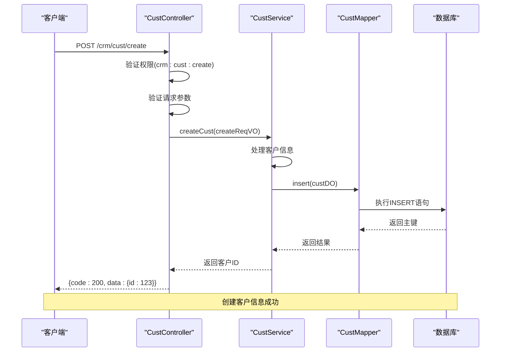

### 更新客户信息流程

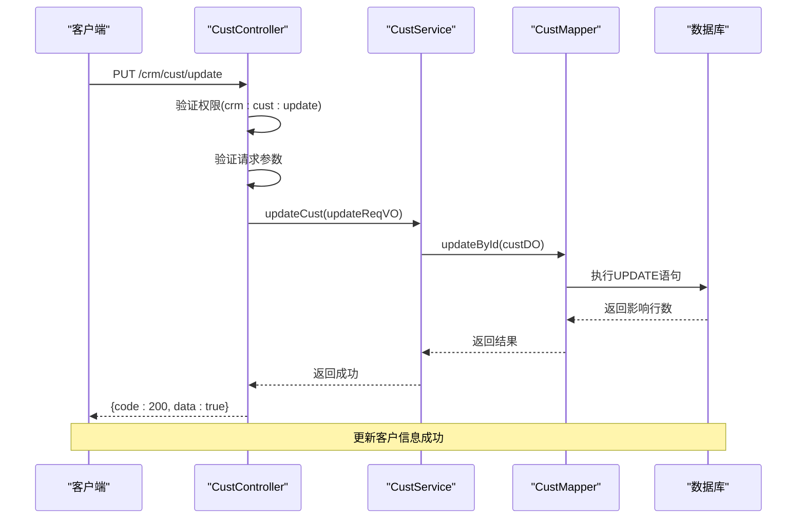

### 删除客户信息流程

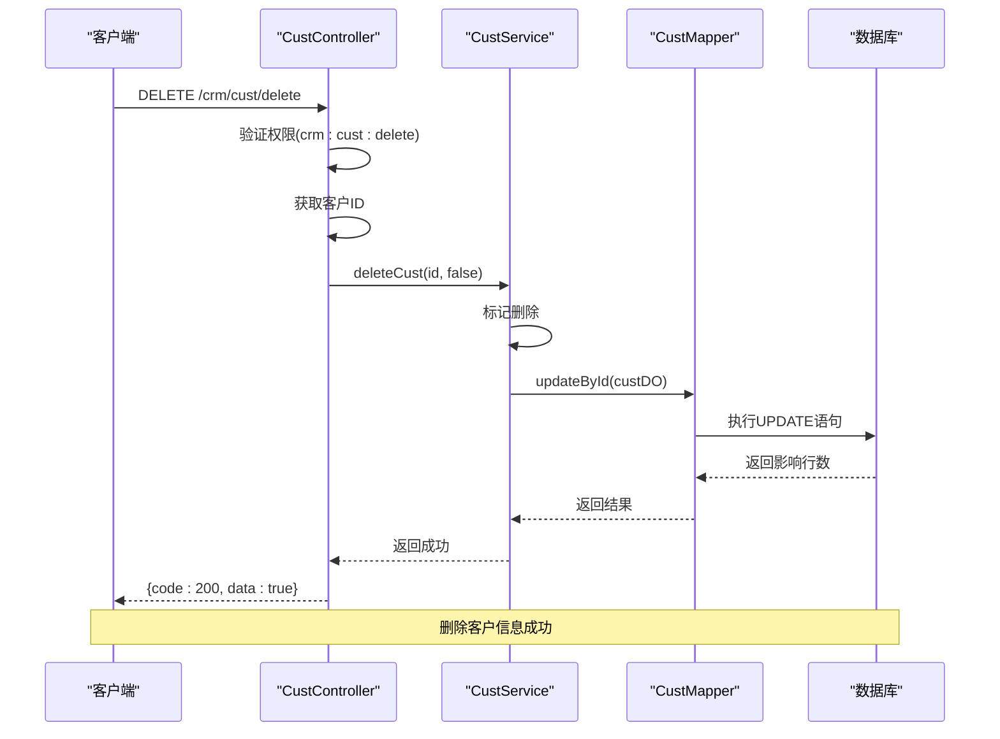

### 查询客户信息流程

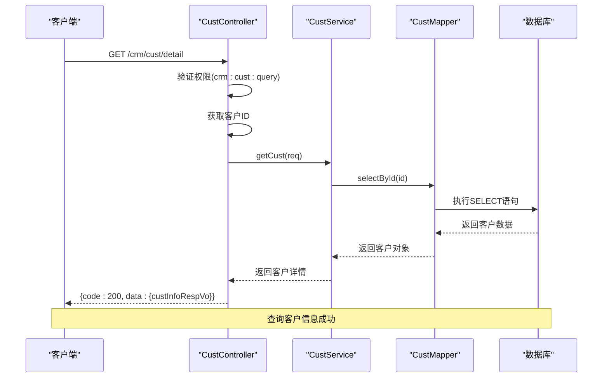

**图源**
- [CustController.java](file://eplus-module-crm/eplus-module-crm-biz/src/main/java/com/syj/eplus/module/crm/controller/admin/cust/CustController.java)
- [CustService.java](file://eplus-module-crm/eplus-module-crm-biz/src/main/java/com/syj/eplus/module/crm/service/cust/CustService.java)

**本节来源**
- [CustController.java](file://eplus-module-crm/eplus-module-crm-biz/src/main/java/com/syj/eplus/module/crm/controller/admin/cust/CustController.java)

## 数据验证规则

系统实现了多层次的数据验证规则，确保客户信息的完整性和准确性。

### 必填字段验证

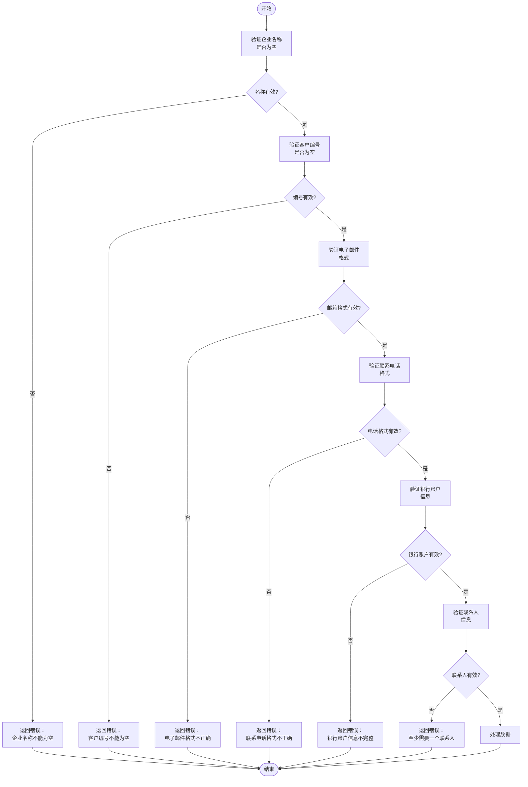

### 唯一性约束验证

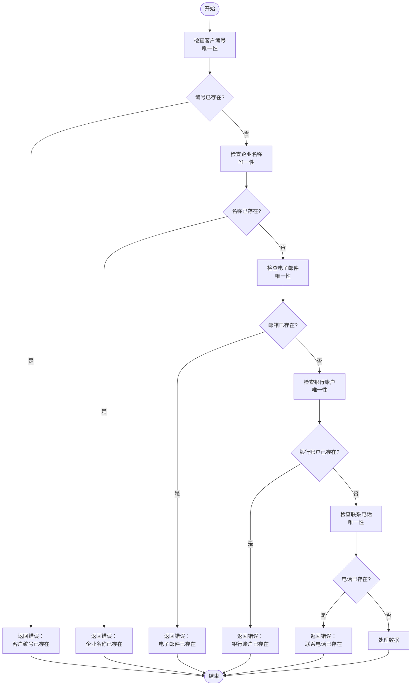

**图源**
- [CustController.java](file://eplus-module-crm/eplus-module-crm-biz/src/main/java/com/syj/eplus/module/crm/controller/admin/cust/CustController.java)
- [CustService.java](file://eplus-module-crm/eplus-module-crm-biz/src/main/java/com/syj/eplus/module/crm/service/cust/CustService.java)

**本节来源**
- [CustController.java](file://eplus-module-crm/eplus-module-crm-biz/src/main/java/com/syj/eplus/module/crm/controller/admin/cust/CustController.java)

## 客户信息变更审批流程

客户信息变更需要经过严格的审批流程，确保数据变更的合规性和可追溯性。

### 变更审批流程

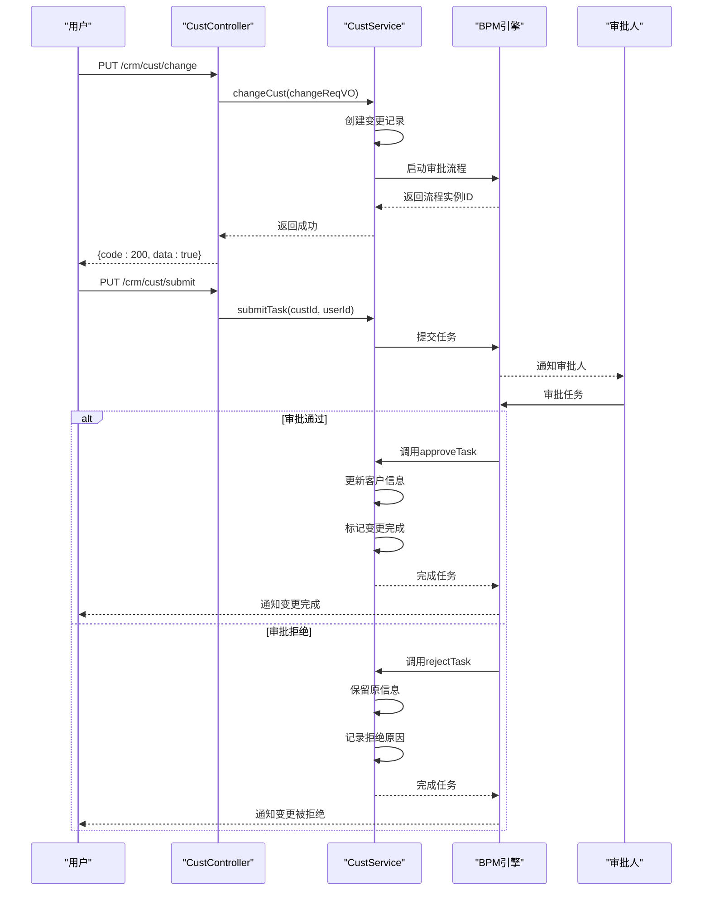

### 变更影响分析流程

```mermaid
flowchart TD
Start([开始]) --> GetChangeData["获取变更数据"]
GetChangeData --> AnalyzeEffect["分析变更影响"]
AnalyzeEffect --> CheckOrder["检查相关订单"]
CheckOrder --> OrderAffected{"订单受影响?"}
OrderAffected --> |是| GetOrderList["获取受影响订单列表"]
OrderAffected --> |否| CheckContract["检查相关合同"]
CheckContract --> ContractAffected{"合同受影响?"}
ContractAffected --> |是| GetContractList["获取受影响合同列表"]
ContractAffected --> |否| CheckInvoice["检查相关发票"]
CheckInvoice --> InvoiceAffected{"发票受影响?"}
InvoiceAffected --> |是| GetInvoiceList["获取受影响发票列表"]
InvoiceAffected --> |否| CheckPayment["检查相关付款"]
CheckPayment --> PaymentAffected{"付款受影响?"}
PaymentAffected --> |是| GetPaymentList["获取受影响付款列表"]
PaymentAffected --> |否| CheckShipment["检查相关发货"]
CheckShipment --> ShipmentAffected{"发货受影响?"}
ShipmentAffected --> |是| GetShipmentList["获取受影响发货列表"]
ShipmentAffected --> |否| GenerateReport["生成影响报告"]
GenerateReport --> ReturnResult["返回影响分析结果"]
ReturnResult --> End([结束])
GetOrderList --> CheckContract
GetContractList --> CheckInvoice
GetInvoiceList --> CheckPayment
GetPaymentList --> CheckShipment
GetShipmentList --> GenerateReport
```

**图源**
- [CustController.java](file://eplus-module-crm/eplus-module-crm-biz/src/main/java/com/syj/eplus/module/crm/controller/admin/cust/CustController.java)
- [CustService.java](file://eplus-module-crm/eplus-module-crm-biz/src/main/java/com/syj/eplus/module/crm/service/cust/CustService.java)

**本节来源**
- [CustController.java](file://eplus-module-crm/eplus-module-crm-biz/src/main/java/com/syj/eplus/module/crm/controller/admin/cust/CustController.java)

## 历史记录追踪机制

系统通过版本控制和变更记录机制实现客户信息的历史追踪。

### 版本控制机制

```mermaid
classDiagram
class CustDO {
+Long id
+Integer ver
+String name
+String code
+String email
+Integer auditStatus
+LocalDateTime createTime
+LocalDateTime updateTime
+Boolean deleted
}
class CustChangeRecord {
+Long id
+Long custId
+Integer oldVer
+Integer newVer
+String changeFields
+String changeReason
+Long changerId
+LocalDateTime changeTime
+Integer status
}
class CustVersionHistory {
+Long id
+Long custId
+Integer ver
+String dataSnapshot
+Long operatorId
+LocalDateTime operateTime
+String operationType
}
CustDO --> CustChangeRecord : "产生"
CustDO --> CustVersionHistory : "生成"
CustChangeRecord --> CustVersionHistory : "关联"
note right of CustDO
ver字段用于乐观锁控制，
每次更新时版本号递增
end note
note right of CustChangeRecord
记录每次变更的详细信息，
包括变更字段、原因等
end note
note right of CustVersionHistory
存储客户信息的历史版本，
支持版本回溯
end note
```

### 历史记录查询流程

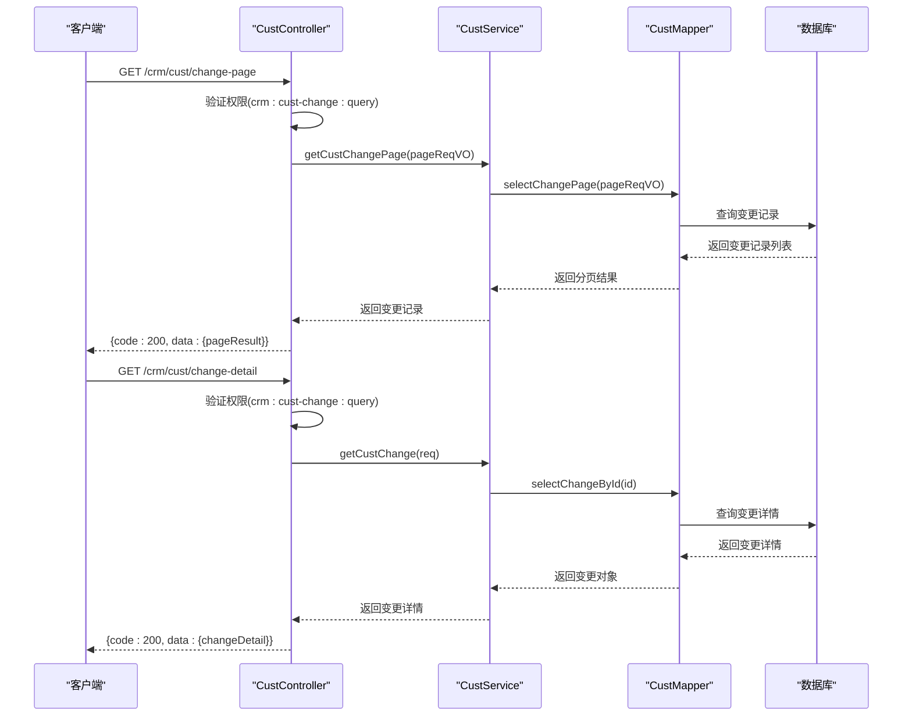

**图源**
- [CustController.java](file://eplus-module-crm/eplus-module-crm-biz/src/main/java/com/syj/eplus/module/crm/controller/admin/cust/CustController.java)
- [CustService.java](file://eplus-module-crm/eplus-module-crm-biz/src/main/java/com/syj/eplus/module/crm/service/cust/CustService.java)

**本节来源**
- [CustController.java](file://eplus-module-crm/eplus-module-crm-biz/src/main/java/com/syj/eplus/module/crm/controller/admin/cust/CustController.java)

## 客户状态管理

客户状态管理包括启用/禁用功能，通过状态标志位实现客户的有效性控制。

### 状态管理流程

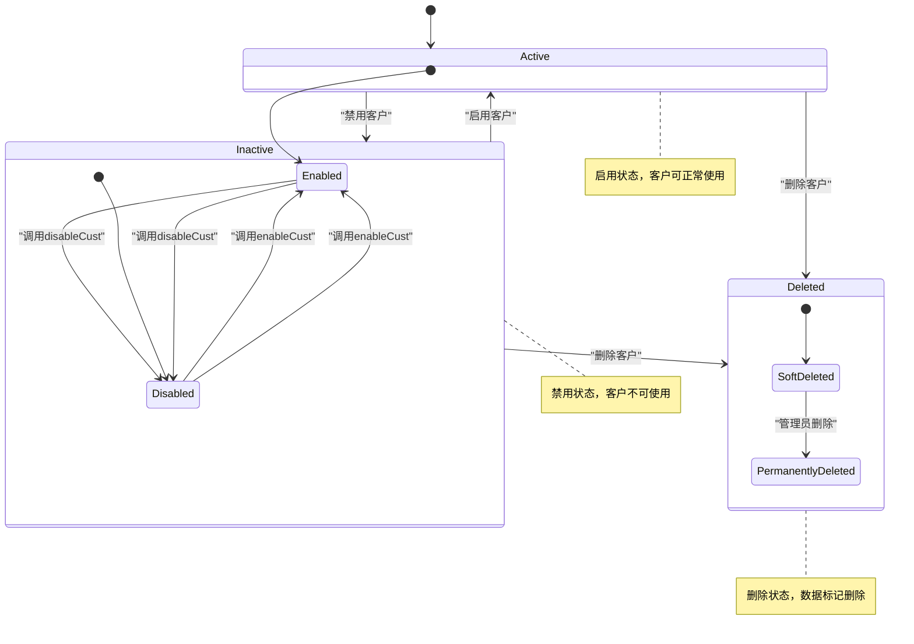

### 状态变更序列图

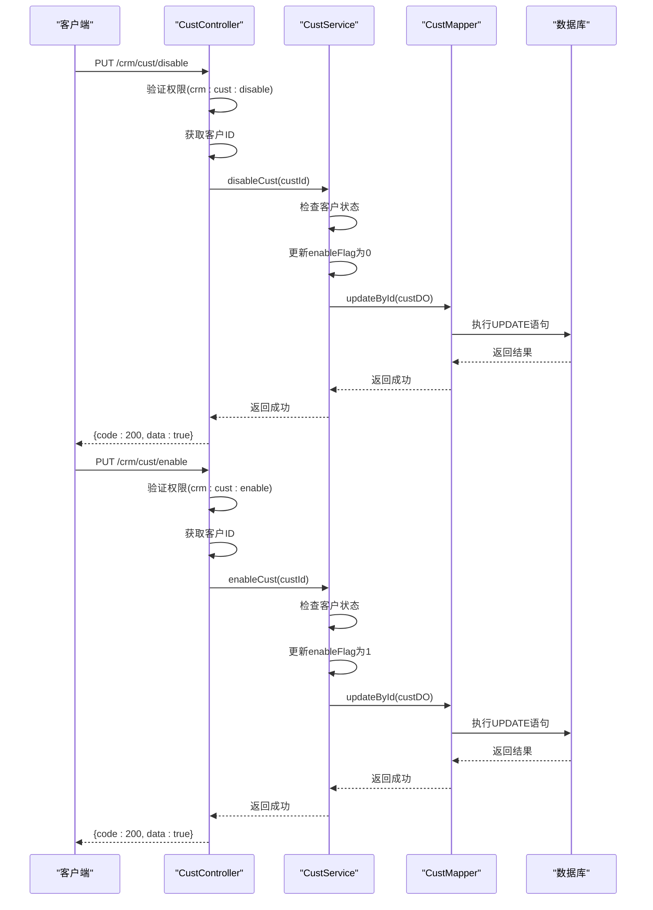

**图源**
- [CustController.java](file://eplus-module-crm/eplus-module-crm-biz/src/main/java/com/syj/eplus/module/crm/controller/admin/cust/CustController.java)
- [CustService.java](file://eplus-module-crm/eplus-module-crm-biz/src/main/java/com/syj/eplus/module/crm/service/cust/CustService.java)

**本节来源**
- [CustController.java](file://eplus-module-crm/eplus-module-crm-biz/src/main/java/com/syj/eplus/module/crm/controller/admin/cust/CustController.java)

## API接口文档

客户信息维护功能提供了完整的RESTful API接口，支持客户信息的全生命周期管理。

### 客户信息API接口

| 接口名称 | HTTP方法 | 路径 | 权限要求 | 功能描述 |
|---------|--------|------|---------|---------|
| 创建客户 | POST | /crm/cust/create | crm:cust:create | 创建新的客户信息 |
| 更新客户 | PUT | /crm/cust/update | crm:cust:update | 更新现有客户信息 |
| 删除客户 | DELETE | /crm/cust/delete | crm:cust:delete | 删除客户信息（软删除） |
| 查询客户详情 | GET | /crm/cust/detail | crm:cust:query | 根据ID查询客户详情 |
| 查询客户分页 | GET | /crm/cust/page | crm:cust:query | 分页查询客户信息 |
| 导出客户Excel | GET | /crm/cust/export-excel | crm:cust:export | 导出客户信息到Excel |
| 审批通过 | PUT | /crm/cust/approve | crm:cust:audit | 审批通过客户信息 |
| 审批拒绝 | PUT | /crm/cust/reject | crm:cust:audit | 审批拒绝客户信息 |
| 提交审批 | PUT | /crm/cust/submit | crm:cust:submit | 提交客户信息审批 |
| 启用客户 | PUT | /crm/cust/enable | crm:cust:enable | 启用客户 |
| 禁用客户 | PUT | /crm/cust/disable | crm:cust:disable | 禁用客户 |
| 变更客户 | PUT | /crm/cust/change | crm:cust:change | 变更客户信息 |
| 变更审批通过 | PUT | /crm/cust/change-approve | crm:cust-change:audit | 审批通过客户变更 |
| 变更审批拒绝 | PUT | /crm/cust/change-reject | crm:cust-change:audit | 审批拒绝客户变更 |
| 反审核 | PUT | /crm/cust/anti-audit | crm:cust:anti-audit | 反审核客户信息 |

### 请求参数说明

| 参数名称 | 类型 | 必填 | 描述 | 示例值 |
|---------|------|------|------|-------|
| id | Long | 是 | 客户ID | 123 |
| code | String | 是 | 客户编号 | CUST001 |
| name | String | 是 | 企业名称 | 某某有限公司 |
| shortname | String | 否 | 简称 | 某某公司 |
| countryId | Long | 否 | 国家编码 | 1 |
| homepage | String | 否 | 官网 | www.example.com |
| email | String | 否 | 电子邮件 | contact@example.com |
| customerTypes | List<Long> | 否 | 客户类型 | [1,2] |
| stageType | Integer | 否 | 客户阶段 | 1 |
| currency | String | 否 | 币种 | USD |
| settleCode | Long | 否 | 收款方式ID | 1 |
| transportType | Integer | 否 | 运输方式 | 1 |
| address | String | 否 | 营业地址 | 某某路123号 |
| phone | String | 否 | 联系电话 | 13800138000 |
| abroadFlag | Integer | 否 | 国外客户标志 | 1 |
| sourceType | Integer | 否 | 客户来源 | 1 |
| creditFlag | Integer | 否 | 启用信用额度 | 1 |
| creditLimit | JsonAmount | 否 | 信用额度 | {"amount":10000,"currency":"USD"} |
| zxbquotaFlag | Integer | 否 | 是否是中信保 | 1 |
| settlementTermType | String | 否 | 价格条款 | CIF |
| invoiceHeader | String | 否 | 开票抬头 | 某某有限公司 |
| taxRate | BigDecimal | 否 | 税率 | 0.13 |
| agentFlag | Integer | 否 | 是否代理 | 0 |
| remark | String | 否 | 备用信息 | 备注信息 |
| managerIds | List<Long> | 否 | 业务员 | [1,2] |
| annex | List<SimpleFile> | 否 | 附件 | [{"name":"file1.pdf","url":"..."}] |
| picture | List<SimpleFile> | 否 | 图片 | [{"name":"pic1.jpg","url":"..."}] |

### 响应格式

```json
{
  "code": 200,
  "data": {
    "id": 123,
    "name": "某某有限公司",
    "code": "CUST001",
    "email": "contact@example.com",
    "phone": "13800138000",
    "address": "某某路123号",
    "countryId": 1,
    "customerTypes": [1, 2],
    "stageType": 1,
    "currency": "USD",
    "transportType": 1,
    "abroadFlag": 1,
    "sourceType": 1,
    "creditFlag": 1,
    "creditLimit": {
      "amount": 10000,
      "currency": "USD"
    },
    "zxbquotaFlag": 1,
    "settlementTermType": "CIF",
    "invoiceHeader": "某某有限公司",
    "taxRate": 0.13,
    "agentFlag": 0,
    "auditStatus": 1,
    "remark": "备注信息",
    "managerIds": [1, 2],
    "convertFlag": 1,
    "convertTime": "2024-01-01T00:00:00",
    "enableFlag": 1,
    "annex": [
      {
        "name": "file1.pdf",
        "url": "https://example.com/files/file1.pdf"
      }
    ],
    "picture": [
      {
        "name": "pic1.jpg",
        "url": "https://example.com/pics/pic1.jpg"
      }
    ],
    "custLinkCode": ["CUST002", "CUST003"],
    "createTime": "2024-01-01T00:00:00",
    "updateTime": "2024-01-01T00:00:00"
  },
  "msg": "成功"
}
```

### 错误码说明

| 错误码 | 错误信息 | 说明 |
|-------|--------|------|
| 1001001001 | 客户资料不存在%s | 客户ID或编号不存在 |
| 1001001002 | 客户附件信息不存在 | 客户附件记录不存在 |
| 1001001003 | 银行账户信息不存在 | 客户银行账户信息不存在 |
| 1001001004 | 客户移交跟进不存在 | 客户移交记录不存在 |
| 1001001005 | 客户图片信息不存在 | 客户图片记录不存在 |
| 1001001006 | 客户联系人不存在 | 客户联系人记录不存在 |
| 1001001007 | 唛头不存在 | 客户唛头信息不存在 |
| 1001001008 | 只有已通过的可以删除旧数据 | 未通过审批的数据不能删除 |
| 1001001009 | 结汇方式不存在 | 指定的结汇方式不存在 |

**本节来源**
- [CustController.java](file://eplus-module-crm/eplus-module-crm-biz/src/main/java/com/syj/eplus/module/crm/controller/admin/cust/CustController.java)
- [CustApi.java](file://eplus-module-crm/eplus-module-crm-api/src/main/java/com/syj/eplus/module/crm/api/cust/CustApi.java)
- [ErrorCodeConstants.java](file://eplus-module-crm/eplus-module-crm-api/src/main/java/com/syj/eplus/module/crm/enums/ErrorCodeConstants.java)

## 业务规则

客户信息维护功能遵循一系列业务规则，确保数据的一致性和完整性。

### 必填字段校验规则

客户信息中的关键字段必须填写，系统在创建和更新时会进行严格校验：

1. **企业名称**：必须填写，不能为空
2. **客户编号**：必须填写，且在系统中唯一
3. **电子邮件**：如果填写，必须符合邮箱格式规范
4. **联系电话**：如果填写，必须符合电话号码格式规范
5. **营业地址**：必须填写，不能为空
6. **客户类型**：至少选择一种客户类型
7. **客户阶段**：必须选择一个客户阶段
8. **币种**：必须选择一种币种
9. **运输方式**：必须选择一种运输方式
10. **开票抬头**：必须填写，不能为空

### 数据唯一性约束

系统对关键字段实施唯一性约束，防止数据重复：

1. **客户编号唯一性**：每个客户的编号在系统中必须唯一
2. **企业名称唯一性**：每个企业的名称在系统中必须唯一
3. **电子邮件唯一性**：每个客户的电子邮件在系统中必须唯一
4. **联系电话唯一性**：每个客户的联系电话在系统中必须唯一
5. **银行账户唯一性**：每个客户的银行账户在系统中必须唯一

### 客户阶段转换规则

客户阶段的转换遵循特定的业务流程：

1. **潜在客户转正式客户**：通过"转正"操作，将潜在客户转换为正式客户
2. **正式客户转退休客户**：通过"退休"操作，将正式客户标记为退休状态
3. **退休客户不可转回**：退休客户不能直接转回为正式客户，需要重新创建

### 审批流程规则

客户信息变更必须经过审批流程：

1. **创建客户**：需要经过审批才能生效
2. **修改客户**：重大信息修改需要经过审批
3. **删除客户**：需要经过审批才能删除
4. **变更客户**：所有变更都需要经过审批流程
5. **审批层级**：根据变更内容的重要程度，可能需要多级审批

### 状态管理规则

客户状态的变更遵循以下规则：

1. **启用客户**：只有禁用状态的客户可以被启用
2. **禁用客户**：只有启用状态的客户可以被禁用
3. **删除客户**：只有禁用状态的客户可以被删除
4. **状态变更日志**：所有状态变更都会记录操作人和时间

**本节来源**
- [CustController.java](file://eplus-module-crm/eplus-module-crm-biz/src/main/java/com/syj/eplus/module/crm/controller/admin/cust/CustController.java)
- [CustService.java](file://eplus-module-crm/eplus-module-crm-biz/src/main/java/com/syj/eplus/module/crm/service/cust/CustService.java)