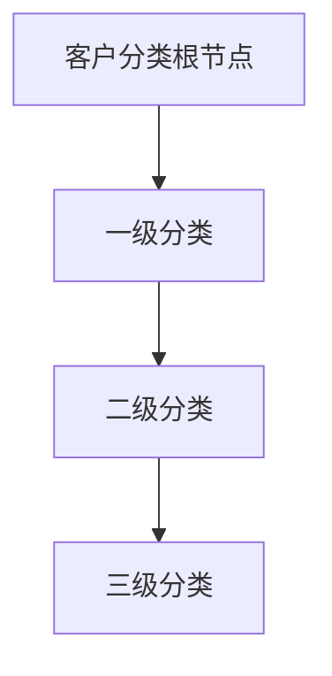
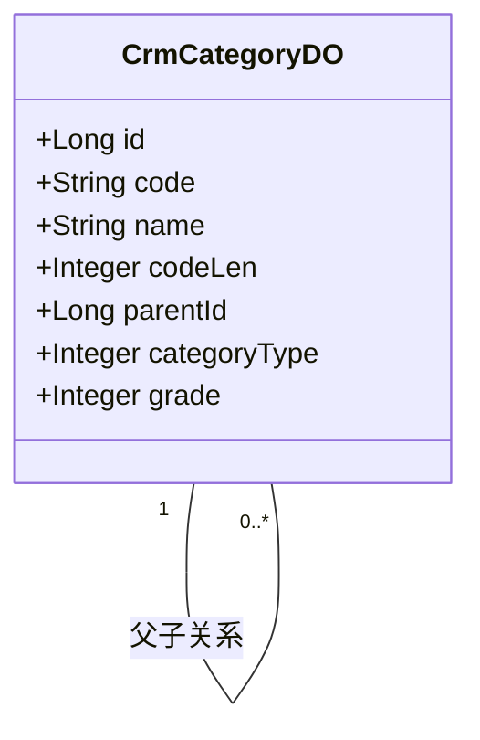
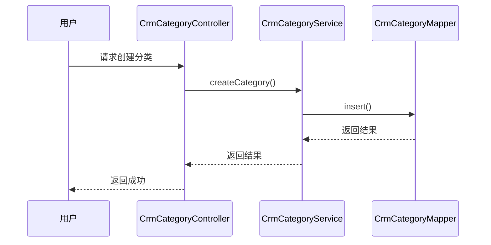

# 客户分类

<cite>
**本文档引用的文件**  
- [CrmCategoryController.java](file://eplus-module-crm/eplus-module-crm-biz/src/main/java/com/syj/eplus/module/crm/controller/admin/category/CrmCategoryController.java)
- [CrmCategoryServiceImpl.java](file://eplus-module-crm/eplus-module-crm-biz/src/main/java/com/syj/eplus/module/crm/service/category/CrmCategoryServiceImpl.java)
- [CrmCategoryService.java](file://eplus-module-crm/eplus-module-crm-biz/src/main/java/com/syj/eplus/module/crm/service/category/CrmCategoryService.java)
- [CrmCategoryApi.java](file://eplus-module-crm/eplus-module-crm-api/src/main/java/com/syj/eplus/module/crm/api/category/CrmCategoryApi.java)
- [CrmCategoryDO.java](file://eplus-module-crm/eplus-module-crm-biz/src/main/java/com/syj/eplus/module/crm/dal/dataobject/category/CrmCategoryDO.java)
- [CustServiceImpl.java](file://eplus-module-crm/eplus-module-crm-biz/src/main/java/com/syj/eplus/module/crm/service/cust/CustServiceImpl.java)
- [CustDO.java](file://eplus-module-crm/eplus-module-crm-biz/src/main/java/com/syj/eplus/module/crm/dal/dataobject/cust/CustDO.java)
- [CustomerLevelEnum.java](file://eplus-framework/eplus-common/src/main/java/com/syj/eplus/framework/common/enums/CustomerLevelEnum.java)
</cite>

## 目录
1. [引言](#引言)
2. [客户分类体系设计](#客户分类体系设计)
3. [客户分类模型](#客户分类模型)
4. [分类编码规则与层级结构](#分类编码规则与层级结构)
5. [客户分类操作流程](#客户分类操作流程)
6. [客户分类应用场景](#客户分类应用场景)
7. [客户分类API接口文档](#客户分类api接口文档)
8. [业务规则与权限控制](#业务规则与权限控制)
9. [结论](#结论)

## 引言

客户分类是企业客户关系管理（CRM）系统中的核心功能之一，用于对客户进行多维度的分类管理。通过客户分类，企业可以更好地理解客户特征，制定差异化的销售策略，优化信用额度管理，并在业务审批流程中实现精细化控制。本文档全面介绍客户分类体系的设计与应用，涵盖客户分类模型、编码规则、操作流程、应用场景及API接口等内容。

## 客户分类体系设计

客户分类体系采用树形结构设计，支持多级分类管理。每个分类节点包含分类编号、名称、父节点编号、种类和级别等属性。系统最大支持三级分类，确保分类结构的清晰性和可维护性。客户分类信息存储在`crm_category`表中，通过`parentId`字段建立父子关系，形成层级结构。



**图示来源**  
- [CrmCategoryDO.java](file://eplus-module-crm/eplus-module-crm-biz/src/main/java/com/syj/eplus/module/crm/dal/dataobject/category/CrmCategoryDO.java#L23-L55)

## 客户分类模型

客户分类模型包含多个维度，主要包括客户类型、客户等级和行业分类等。

### 客户类型

客户类型用于区分客户的业务性质，如电商、进口商、零售商、贸易商、批发商、售后公司、邮购商等。客户类型通过`customerTypes`字段在`CustDO`实体中存储，采用`List<Long>`类型保存多个分类ID。

### 客户等级

客户等级用于评估客户的重要程度，分为普通、重要和特级三个等级。客户等级定义在`CustomerLevelEnum`枚举中，具体如下：

- **普通**：等级值为1，表示一般客户。
- **重要**：等级值为2，表示重要客户。
- **特级**：等级值为2，表示特别重要的客户。

```java
public enum CustomerLevelEnum {
    GENERAL(1,"普通"),
    IMPORTANT(2,"重要"),
    SPECIAL(2,"特级");
}
```

### 行业分类

行业分类用于按行业对客户进行分组，便于行业分析和市场策略制定。行业分类作为客户分类的一种类型，在`CrmCategoryDO`中通过`categoryType`字段标识。

**本节来源**  
- [CustomerLevelEnum.java](file://eplus-framework/eplus-common/src/main/java/com/syj/eplus/framework/common/enums/CustomerLevelEnum.java#L12-L23)
- [CustDO.java](file://eplus-module-crm/eplus-module-crm-biz/src/main/java/com/syj/eplus/module/crm/dal/dataobject/cust/CustDO.java#L87-L92)

## 分类编码规则与层级结构

客户分类编码由分类编号和流水号组成，编码规则如下：

- **分类编号**：由父节点编号和当前节点编号拼接而成，确保唯一性。
- **流水号长度**：指定流水号的位数，用于生成客户编号。
- **层级结构**：支持最多三级分类，每级分类可设置不同的编码规则。

例如，一级分类编号为"01"，二级分类编号为"0101"，三级分类编号为"010101"。系统通过`getProfixCode`方法获取分类的前缀编码，确保编码的连续性和唯一性。



**图示来源**  
- [CrmCategoryDO.java](file://eplus-module-crm/eplus-module-crm-biz/src/main/java/com/syj/eplus/module/crm/dal/dataobject/category/CrmCategoryDO.java#L23-L55)
- [CrmCategoryServiceImpl.java](file://eplus-module-crm/eplus-module-crm-biz/src/main/java/com/syj/eplus/module/crm/service/category/CrmCategoryServiceImpl.java#L107-L113)

## 客户分类操作流程

客户分类的创建、修改和删除操作通过`CrmCategoryService`接口提供，具体流程如下：

### 创建客户分类

1. 调用`createCategory`方法，传入`CrmCategorySaveReqVO`对象。
2. 系统校验分类等级不超过三级。
3. 插入新分类记录到数据库。

### 修改客户分类

1. 调用`updateCategory`方法，传入`CrmCategorySaveReqVO`对象。
2. 系统校验分类是否存在。
3. 更新分类信息。

### 删除客户分类

1. 调用`deleteCategory`方法，传入分类ID。
2. 系统校验分类是否存在。
3. 从数据库删除分类记录。



**图示来源**  
- [CrmCategoryController.java](file://eplus-module-crm/eplus-module-crm-biz/src/main/java/com/syj/eplus/module/crm/controller/admin/category/CrmCategoryController.java#L35)
- [CrmCategoryServiceImpl.java](file://eplus-module-crm/eplus-module-crm-biz/src/main/java/com/syj/eplus/module/crm/service/category/CrmCategoryServiceImpl.java#L46-L58)
- [CrmCategoryMapper.java](file://eplus-module-crm/eplus-module-crm-biz/src/main/java/com/syj/eplus/module/crm/dal/mysql/category/CrmCategoryMapper.java)

## 客户分类应用场景

客户分类在多个业务场景中发挥重要作用，包括销售定价、信用额度管理和业务审批等。

### 销售定价

根据客户等级和类型，系统可自动应用不同的价格策略。例如，重要客户可享受更优惠的价格。

### 信用额度

客户分类直接影响信用额度的授予。系统根据客户等级和历史交易记录，自动计算信用额度。

### 业务审批

在业务审批流程中，客户分类作为审批条件之一。例如，特级客户的合同变更需要更高层级的审批。

**本节来源**  
- [CustServiceImpl.java](file://eplus-module-crm/eplus-module-crm-biz/src/main/java/com/syj/eplus/module/crm/service/cust/CustServiceImpl.java#L707-L709)

## 客户分类API接口文档

客户分类功能通过`CrmCategoryApi`接口对外提供服务，主要接口如下：

### 获取分类名称映射

```java
Map<Long, String> getCategoryNameMap(List<Long> categoryIds);
```

根据分类ID列表获取分类名称映射，便于前端显示。

### 查询客户分类分页

```java
PageResult<CrmCategoryRespVO> getCategoryPage(CrmCategoryPageReqVO pageReqVO);
```

支持分页查询客户分类，可按名称、编号等条件过滤。

### 获取分类树形结构

```java
List<CrmCategorySimpleRespVO> getSimpleList();
```

获取客户分类的树形结构，用于前端树形控件展示。

**本节来源**  
- [CrmCategoryApi.java](file://eplus-module-crm/eplus-module-crm-api/src/main/java/com/syj/eplus/module/crm/api/category/CrmCategoryApi.java#L11-L22)
- [CrmCategoryService.java](file://eplus-module-crm/eplus-module-crm-biz/src/main/java/com/syj/eplus/module/crm/service/category/CrmCategoryService.java#L57-L58)

## 业务规则与权限控制

客户分类的使用需遵循以下业务规则：

- 分类等级不得超过三级。
- 分类名称和编号必须唯一。
- 删除分类前需确保无客户引用。

权限控制方面，系统通过`@DataPermission`注解实现数据权限控制，确保用户只能操作其权限范围内的分类数据。

```java
@DataPermission(enable = false)
public List<CrmCategorySimpleRespVO> getSimpleList() {
    // ...
}
```

**本节来源**  
- [CrmCategoryServiceImpl.java](file://eplus-module-crm/eplus-module-crm-biz/src/main/java/com/syj/eplus/module/crm/service/category/CrmCategoryServiceImpl.java#L96-L97)

## 结论

客户分类体系是企业客户管理的重要组成部分，通过科学的分类模型和严格的编码规则，实现了客户信息的结构化管理。系统提供的完整API接口和操作流程，支持客户分类在销售、财务、审批等多个业务场景中的应用。未来可进一步扩展分类维度，如增加地理区域分类，以支持更精细化的客户管理策略。