# 客户管理

<cite>
**本文档引用的文件**
- [V1_0_0_002__Eplus初始化.sql](file://eplus-flyway/src/main/resources/db/migration/common/V1_0_0_002__Eplus初始化.sql)
- [CustApi.java](file://eplus-module-crm/eplus-module-crm-api/src/main/java/com/syj/eplus/module/crm/api/cust/CustApi.java)
- [CustService.java](file://eplus-module-crm/eplus-module-crm-biz/src/main/java/com/syj/eplus/module/crm/service/cust/CustService.java)
- [CustDO.java](file://eplus-module-crm/eplus-module-crm-biz/src/main/java/com/syj/eplus/module/crm/dal/dataobject/cust/CustDO.java)
- [CrmCategoryService.java](file://eplus-module-crm/eplus-module-crm-biz/src/main/java/com/syj/eplus/module/crm/service/category/CrmCategoryService.java)
- [CustomerStageEnum.java](file://eplus-module-crm/eplus-module-crm-api/src/main/java/com/syj/eplus/module/crm/enums/cust/CustomerStageEnum.java)
- [CustomerLevelEnum.java](file://eplus-framework/eplus-common/src/main/java/com/syj/eplus/framework/common/enums/CustomerLevelEnum.java)
- [SimpleCustRespVO.java](file://eplus-module-sms/eplus-module-sms-biz/src/main/java/com/syj/eplus/module/sms/controller/admin/salecontract/vo/SimpleContractRespVO.java)
</cite>

## 目录
1. [客户主数据模型设计](#客户主数据模型设计)
2. [客户分类体系](#客户分类体系)
3. [客户信用管理](#客户信用管理)
4. [客户与销售合同的关联关系](#客户与销售合同的关联关系)
5. [客户信息在销售流程中的应用](#客户信息在销售流程中的应用)
6. [客户管理业务流程](#客户管理业务流程)
7. [客户管理关键业务规则](#客户管理关键业务规则)

## 客户主数据模型设计

客户主数据模型是客户管理功能的核心，包含客户的基本信息、财务信息和联系人信息等关键数据。通过数据库表 `crm_cust` 实现客户信息的持久化存储。

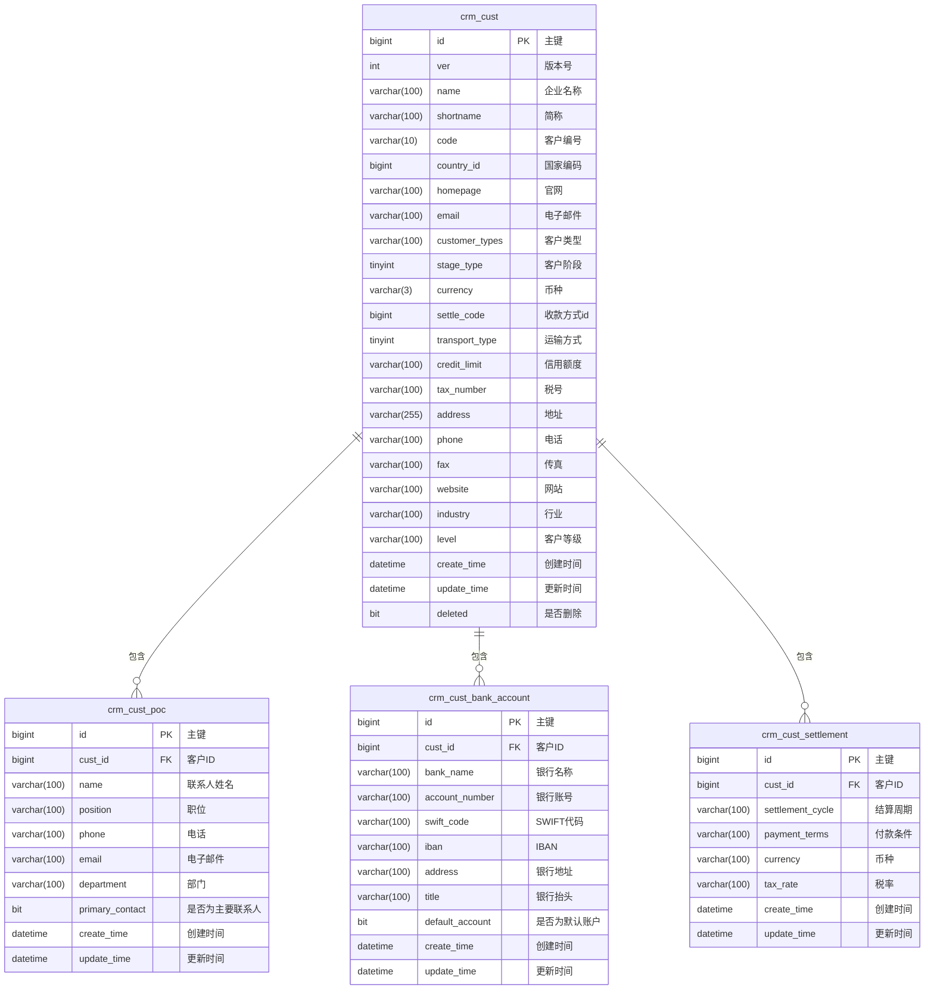

**图示来源**
- [V1_0_0_002__Eplus初始化.sql](file://eplus-flyway/src/main/resources/db/migration/common/V1_0_0_002__Eplus初始化.sql#L49-L63)

**本节来源**
- [V1_0_0_002__Eplus初始化.sql](file://eplus-flyway/src/main/resources/db/migration/common/V1_0_0_002__Eplus初始化.sql#L49-L63)
- [CustDO.java](file://eplus-module-crm/eplus-module-crm-biz/src/main/java/com/syj/eplus/module/crm/dal/dataobject/cust/CustDO.java)

## 客户分类体系

客户分类体系是客户管理的重要组成部分，通过多维度的分类标准实现客户精细化管理。系统提供了客户类型、客户等级和行业分类等分类维度。

### 客户类型分类

客户类型定义了客户的业务属性，包括电商、进口商、零售商、贸易商、批发商、售后公司和邮购商等类型。这些类型通过 `customer_types` 字段在 `crm_cust` 表中存储。

### 客户等级分类

客户等级反映了客户的重要程度和价值，通过 `level` 字段在 `crm_cust` 表中存储。系统定义了不同的客户等级，如VIP客户、重要客户、普通客户等。

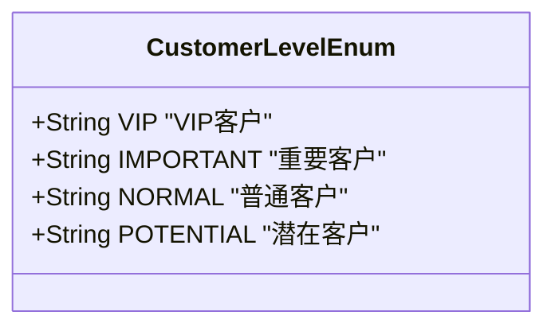

**图示来源**
- [CustomerLevelEnum.java](file://eplus-framework/eplus-common/src/main/java/com/syj/eplus/framework/common/enums/CustomerLevelEnum.java)

### 客户阶段分类

客户阶段表示客户在生命周期中的状态，通过 `stage_type` 字段在 `crm_cust` 表中存储。系统定义了三种客户阶段：

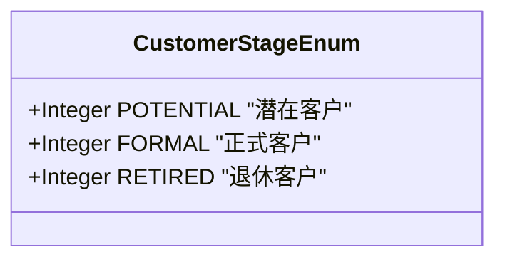

**图示来源**
- [CustomerStageEnum.java](file://eplus-module-crm/eplus-module-crm-api/src/main/java/com/syj/eplus/module/crm/enums/cust/CustomerStageEnum.java)

### 行业分类

行业分类用于按行业领域对客户进行分组，便于行业分析和市场策略制定。系统通过分类树形结构管理行业分类。

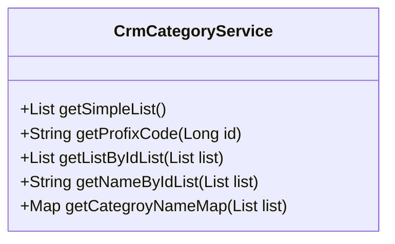

**图示来源**
- [CrmCategoryService.java](file://eplus-module-crm/eplus-module-crm-biz/src/main/java/com/syj/eplus/module/crm/service/category/CrmCategoryService.java)

**本节来源**
- [CustomerLevelEnum.java](file://eplus-framework/eplus-common/src/main/java/com/syj/eplus/framework/common/enums/CustomerLevelEnum.java)
- [CustomerStageEnum.java](file://eplus-module-crm/eplus-module-crm-api/src/main/java/com/syj/eplus/module/crm/enums/cust/CustomerStageEnum.java)
- [CrmCategoryService.java](file://eplus-module-crm/eplus-module-crm-biz/src/main/java/com/syj/eplus/module/crm/service/category/CrmCategoryService.java)

## 客户信用管理

客户信用管理机制确保了交易的安全性和风险控制，包括信用额度设置、使用情况跟踪和超限控制等功能。

### 信用额度设置

信用额度通过 `credit_limit` 字段在 `crm_cust` 表中存储，表示客户可使用的最大信用金额。系统支持为不同客户设置不同的信用额度。

### 信用额度使用跟踪

系统通过集成财务模块，实时跟踪客户的信用额度使用情况。当客户发生交易时，系统会自动计算已使用信用额度。

### 超限控制

系统实现了严格的超限控制机制，当客户信用额度即将或已经超限时，系统会触发相应的控制措施：

1. 在销售订单创建时进行信用检查
2. 对超限订单进行审批流程控制
3. 生成信用预警通知

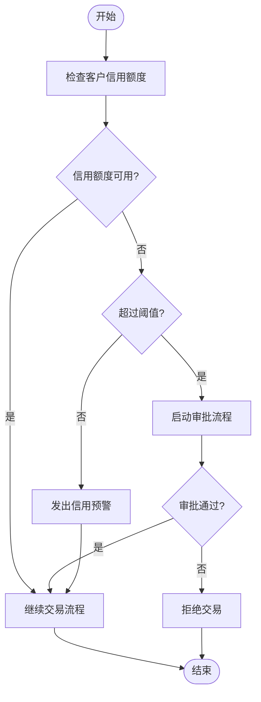

**本节来源**
- [V1_0_0_002__Eplus初始化.sql](file://eplus-flyway/src/main/resources/db/migration/common/V1_0_0_002__Eplus初始化.sql#L49-L63)
- [CustService.java](file://eplus-module-crm/eplus-module-crm-biz/src/main/java/com/syj/eplus/module/crm/service/cust/CustService.java)

## 客户与销售合同的关联关系

客户信息与销售合同紧密关联，确保销售流程的完整性和一致性。系统通过客户编号在销售合同中引用客户信息。

### 客户信息在销售合同中的应用

在销售合同中，客户信息以精简形式呈现，包括客户编号、客户名称等关键信息。

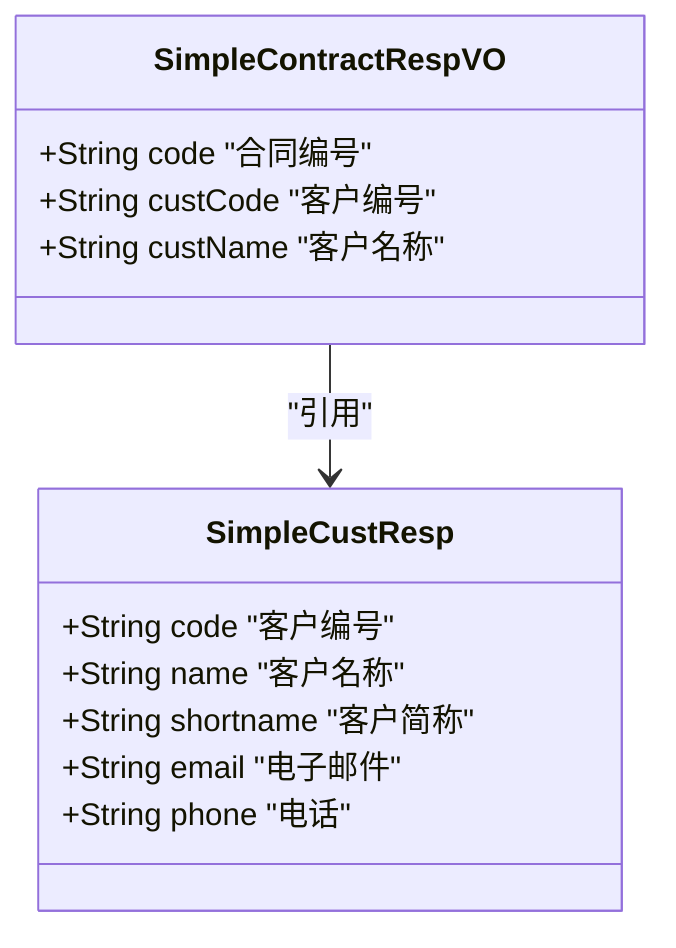

**图示来源**
- [SimpleCustResp.java](file://eplus-module-crm/eplus-module-crm-api/src/main/java/com/syj/eplus/module/crm/api/cust/dto/SimpleCustResp.java)
- [SimpleContractRespVO.java](file://eplus-module-sms/eplus-module-sms-biz/src/main/java/com/syj/eplus/module/sms/controller/admin/salecontract/vo/SimpleContractRespVO.java)

### 客户变更影响分析

当客户信息发生变更时，系统会分析变更对现有销售合同的影响范围。

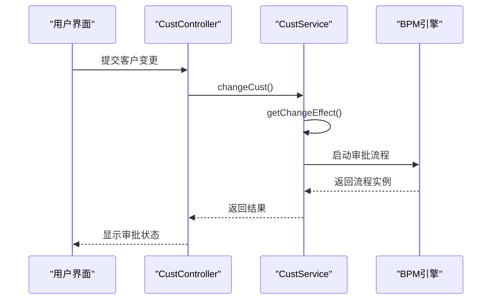

**图示来源**
- [CustService.java](file://eplus-module-crm/eplus-module-crm-biz/src/main/java/com/syj/eplus/module/crm/service/cust/CustService.java#L51-L133)
- [CustApi.java](file://eplus-module-crm/eplus-module-crm-api/src/main/java/com/syj/eplus/module/crm/api/cust/CustApi.java#L61-L69)

**本节来源**
- [CustService.java](file://eplus-module-crm/eplus-module-crm-biz/src/main/java/com/syj/eplus/module/crm/service/cust/CustService.java)
- [CustApi.java](file://eplus-module-crm/eplus-module-crm-api/src/main/java/com/syj/eplus/module/crm/api/cust/CustApi.java)
- [SimpleContractRespVO.java](file://eplus-module-sms/eplus-module-sms-biz/src/main/java/com/syj/eplus/module/sms/controller/admin/salecontract/vo/SimpleContractRespVO.java)

## 客户信息在销售流程中的应用

客户信息贯穿整个销售流程，从客户选择到合同创建，再到订单执行，确保销售活动的准确性和效率。

### 客户选择与验证

在销售流程开始时，系统提供客户选择功能，支持通过客户编号、名称等条件进行搜索和筛选。

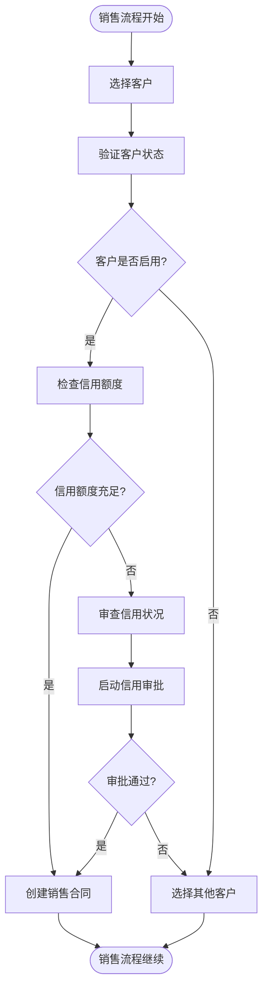

### 客户信息自动填充

当选择客户后，系统自动填充客户的相关信息，减少手动输入错误。

**本节来源**
- [CustService.java](file://eplus-module-crm/eplus-module-crm-biz/src/main/java/com/syj/eplus/module/crm/service/cust/CustService.java)
- [CustApi.java](file://eplus-module-crm/eplus-module-crm-api/src/main/java/com/syj/eplus/module/crm/api/cust/CustApi.java)

## 客户管理业务流程

客户管理业务流程涵盖了客户从创建到维护的完整生命周期，包括客户创建、变更、启用/禁用等操作。

### 客户创建流程

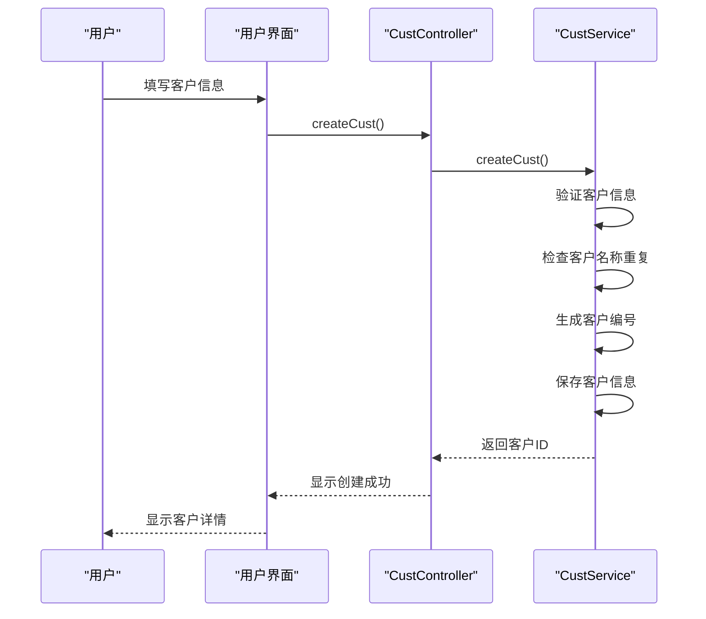

**图示来源**
- [CustService.java](file://eplus-module-crm/eplus-module-crm-biz/src/main/java/com/syj/eplus/module/crm/service/cust/CustService.java#L37-L38)

### 客户变更流程

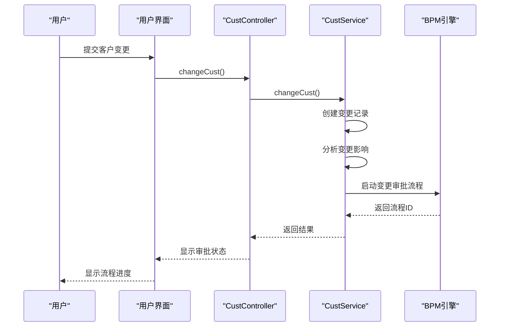

**图示来源**
- [CustService.java](file://eplus-module-crm/eplus-module-crm-biz/src/main/java/com/syj/eplus/module/crm/service/cust/CustService.java#L51-L58)

### 客户启用/禁用流程

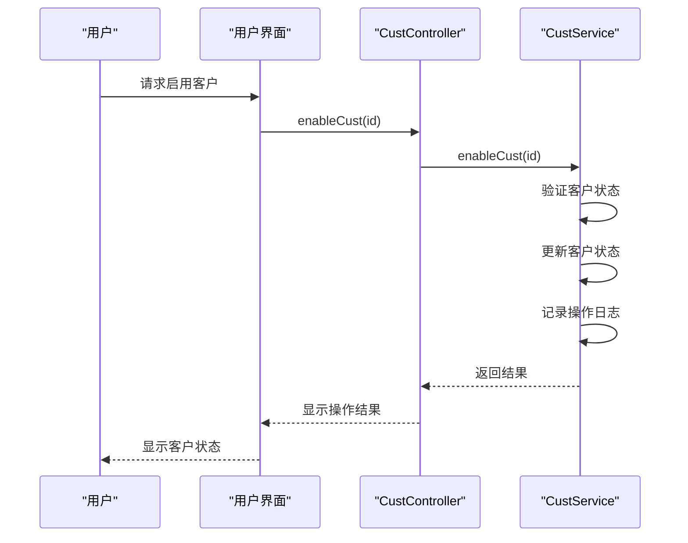

**图示来源**
- [CustService.java](file://eplus-module-crm/eplus-module-crm-biz/src/main/java/com/syj/eplus/module/crm/service/cust/CustService.java#L222-L229)

**本节来源**
- [CustService.java](file://eplus-module-crm/eplus-module-crm-biz/src/main/java/com/syj/eplus/module/crm/service/cust/CustService.java)

## 客户管理关键业务规则

客户管理功能包含一系列关键业务规则，确保数据的准确性、一致性和安全性。

### 客户信息变更审批规则

客户信息变更需要经过审批流程，确保变更的合法性和准确性。系统通过BPM引擎实现审批流程。

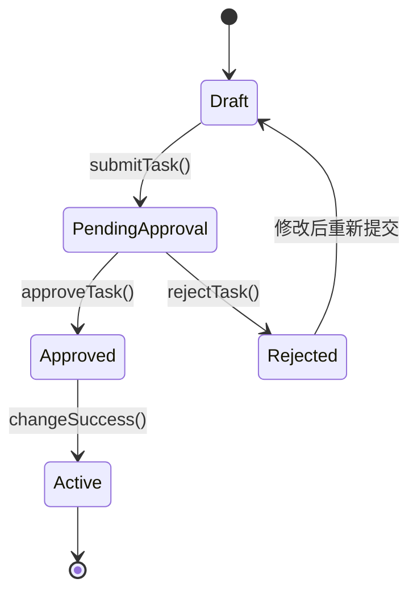

**图示来源**
- [CustService.java](file://eplus-module-crm/eplus-module-crm-biz/src/main/java/com/syj/eplus/module/crm/service/cust/CustService.java#L141-L149)

### 客户状态管理规则

客户状态管理规则定义了客户在不同状态间的转换条件和操作限制。

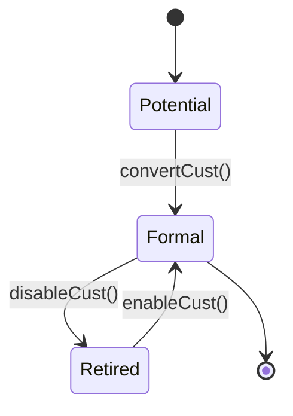

**图示来源**
- [CustService.java](file://eplus-module-crm/eplus-module-crm-biz/src/main/java/com/syj/eplus/module/crm/service/cust/CustService.java#L215-L230)

### 客户信息重复检查规则

系统在创建客户时执行重复检查，防止创建重复的客户记录。

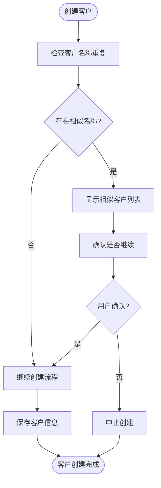

**本节来源**
- [CustService.java](file://eplus-module-crm/eplus-module-crm-biz/src/main/java/com/syj/eplus/module/crm/service/cust/CustService.java)