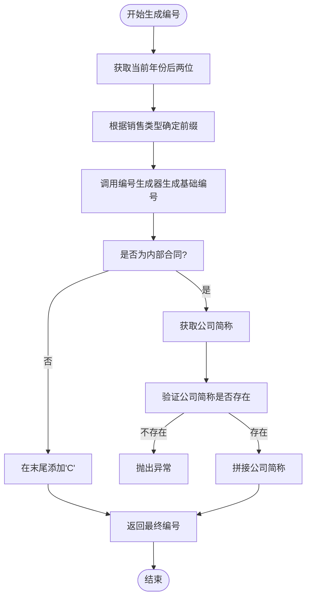
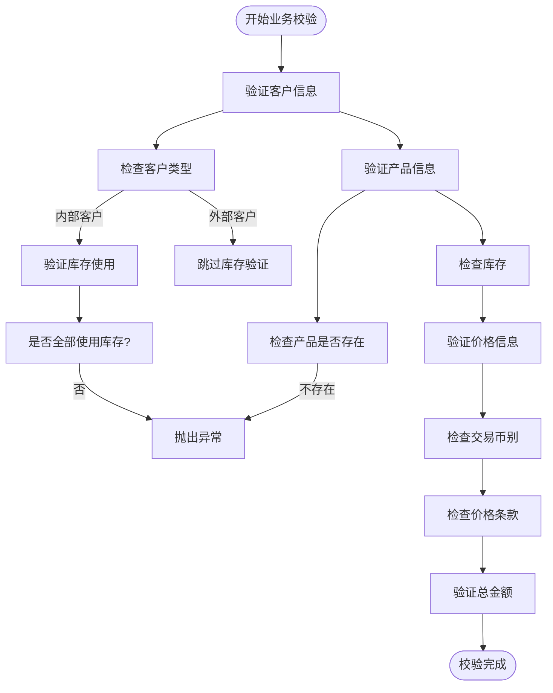
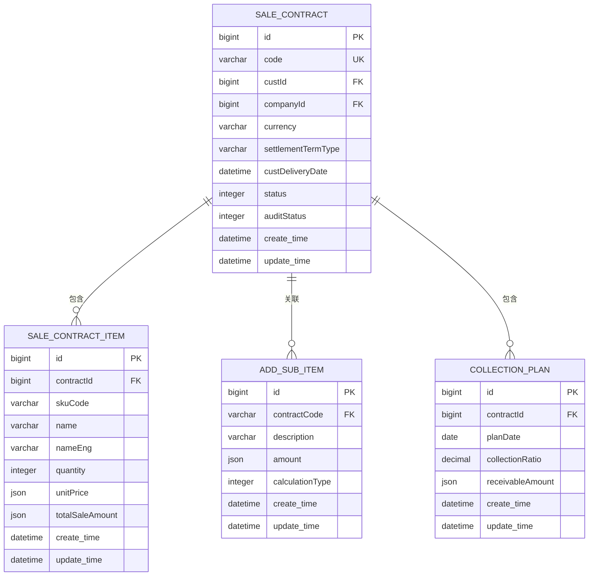
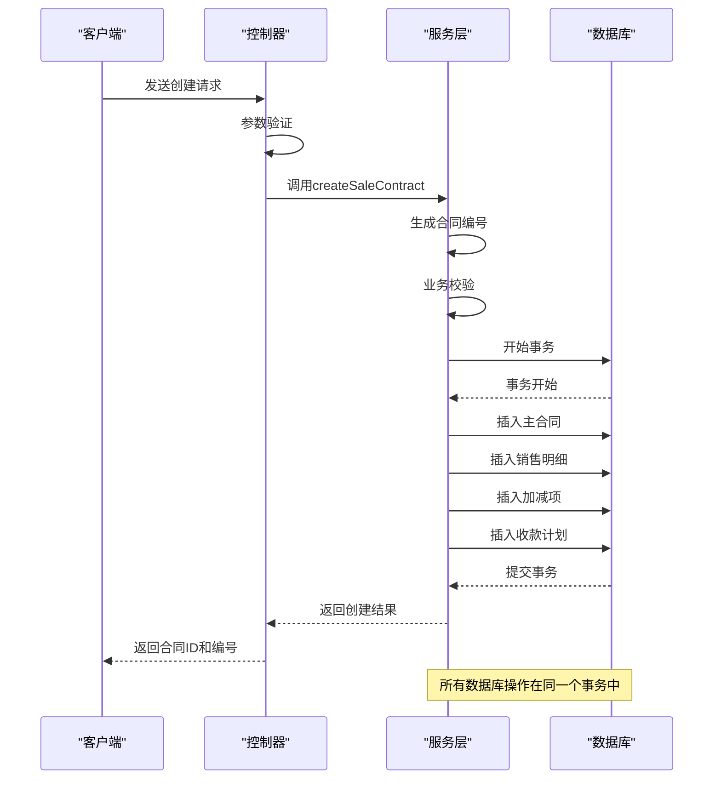
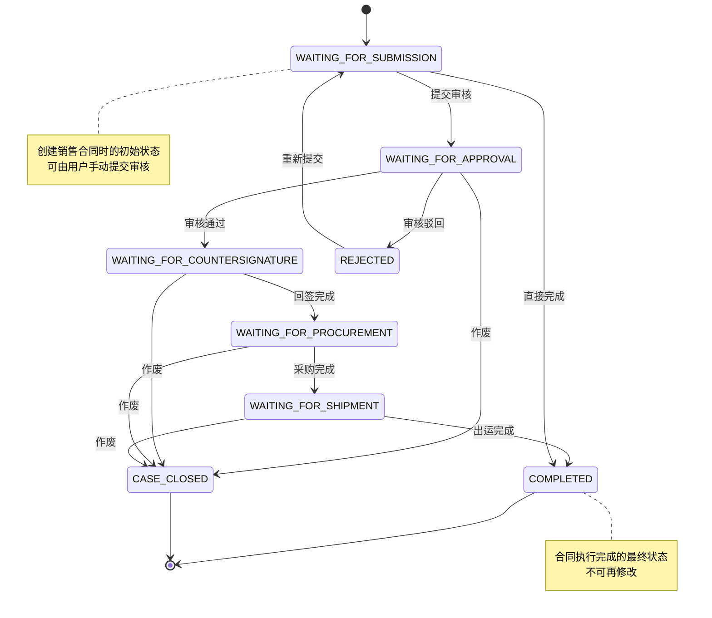

# 销售合同创建

<cite>
**本文档引用的文件**   
- [SaleContractService.java](file://eplus-module-sms/eplus-module-sms-biz/src/main/java/com/syj/eplus/module/sms/service/salecontract/SaleContractService.java)
- [SaleContractServiceImpl.java](file://eplus-module-sms/eplus-module-sms-biz/src/main/java/com/syj/eplus/module/sms/service/salecontract/SaleContractServiceImpl.java)
- [SaleContractSaveDTO.java](file://eplus-module-sms/eplus-module-sms-api/src/main/java/com/syj/eplus/module/sms/api/dto/SaleContractSaveDTO.java)
- [SaleContractSaveReqVO.java](file://eplus-module-sms/eplus-module-sms-biz/src/main/java/com/syj/eplus/module/sms/controller/admin/salecontract/vo/SaleContractSaveReqVO.java)
- [SaleContractDO.java](file://eplus-module-sms/eplus-module-sms-dal/src/main/java/com/syj/eplus/module/sms/dal/dataobject/salecontract/SaleContractDO.java)
- [V1_0_0_002__Eplus初始化.sql](file://eplus-flyway/src/main/resources/db/migration/common/V1_0_0_002__Eplus初始化.sql)
- [SaleContractStatusEnum.java](file://eplus-framework/eplus-common/src/main/java/com/syj/eplus/framework/common/enums/SaleContractStatusEnum.java)
</cite>

## 目录
1. [输入参数定义](#输入参数定义)
2. [销售合同编号生成规则](#销售合同编号生成规则)
3. [业务校验逻辑](#业务校验逻辑)
4. [数据一致性保障措施](#数据一致性保障措施)
5. [API使用示例](#api使用示例)
6. [状态初始设置与后续流程](#状态初始设置与后续流程)

## 输入参数定义

销售合同创建功能需要提供一系列详细的输入参数，这些参数定义了合同的核心信息。主要输入参数包括：

**客户信息**
- `custId`: 客户主键，用于唯一标识客户
- `custCode`: 客户编号，客户的唯一编码
- `custName`: 客户名称，客户的全称
- `internalCustId`: 内部客户主键，用于标识内部客户
- `internalCustCode`: 内部客户编号
- `internalCustName`: 内部客户名称
- `custCountryId`: 客户国别主键
- `custCountryName`: 客户国别名称
- `custAreaName`: 客户区域

**产品明细**
- `children`: 销售明细列表，包含多个产品项
  - `skuCode`: 产品编号
  - `name`: 中文品名
  - `nameEng`: 英文品名
  - `cskuCode`: 客户货号
  - `quantity`: 数量
  - `unitPrice`: 销售单价
  - `totalSaleAmount`: 外销总金额

**价格条款**
- `currency`: 交易币别，合同交易的货币类型
- `settlementTermType`: 价格条款，定义了交易的价格条件
- `settlementId`: 收款方式主键
- `settlementName`: 收款方式名称

**交货信息**
- `custDeliveryDate`: 客户交期，客户要求的交货日期
- `transportType`: 运输方式
- `departurePortId`: 出运口岸主键
- `departurePortName`: 出运口岸名称
- `destinationPortId`: 目的口岸主键
- `destinationPortName`: 目的口岸名称

**其他关键字段**
- `companyId`: 内部法人单位主键
- `companyName`: 内部法人单位名称
- `companyPath`: 订单路径，定义了订单的流转路径
- `sales`: 销售人员信息
- `annex`: 附件列表
- `inputDate`: 录入日期
- `saleType`: 销售合同类型（国内销售合同、外销合同等）

**Section sources**
- [SaleContractSaveDTO.java](file://eplus-module-sms/eplus-module-sms-api/src/main/java/com/syj/eplus/module/sms/api/dto/SaleContractSaveDTO.java#L1-L422)
- [SaleContractSaveReqVO.java](file://eplus-module-sms/eplus-module-sms-biz/src/main/java/com/syj/eplus/module/sms/controller/admin/salecontract/vo/SaleContractSaveReqVO.java)

## 销售合同编号生成规则

销售合同编号的生成遵循特定的规则，确保编号的唯一性和可识别性。编号生成机制如下：

**编号结构**
销售合同编号由多个部分组成，具体结构根据合同类型而有所不同：

1. **国内销售合同**：以"DT"开头，后接两位年号
2. **外销合同**：以"VK"开头，后接两位年号

**生成流程**
编号生成的具体流程如下：
1. 获取当前年份的后两位作为年号
2. 根据销售合同类型确定前缀（"DT"或"VK"）
3. 调用`codeGeneratorApi.getCodeGenerator`方法生成基础编号
4. 对于非内部合同，在编号末尾添加"C"标识

**唯一性保证**
系统通过以下机制确保编号的唯一性：
- 使用`codeGeneratorApi`服务生成唯一序列号
- 在数据库层面设置唯一约束
- 生成过程中检查重复性

**特殊处理**
对于内部合同，编号生成会拼接内部公司的简称，确保在内部系统中的唯一性。如果公司简称为空，则会抛出异常。



**Diagram sources**
- [SaleContractServiceImpl.java](file://eplus-module-sms/eplus-module-sms-biz/src/main/java/com/syj/eplus/module/sms/service/salecontract/SaleContractServiceImpl.java#L509-L541)

**Section sources**
- [SaleContractServiceImpl.java](file://eplus-module-sms/eplus-module-sms-biz/src/main/java/com/syj/eplus/module/sms/service/salecontract/SaleContractServiceImpl.java#L509-L541)

## 业务校验逻辑

销售合同创建过程中包含多个业务校验逻辑，确保数据的准确性和业务规则的合规性。

**客户有效性验证**
系统会验证客户信息的有效性：
- 检查客户编号是否存在
- 验证客户国别信息
- 确认客户区域信息
- 对于内部客户，验证其是否全部使用库存

```java
// 伪代码示例
if (SaleTypeEnum.DOMESTIC_SALE_CONTRACT.getValue().equals(createReqVO.getSaleType())) {
    String custCode = createReqVO.getCustCode();
    boolean internalFlag = custApi.checkIsInternalCust(custCode);
    if (internalFlag && !BooleanEnum.YES.getValue().equals(autoFlag)) {
        boolean notAllStock = createReqVO.getChildren().stream().anyMatch(s -> s.getNeedPurQuantity() > 0);
        if (notAllStock) {
            throw exception(INTERNAL_CUST_NOT_ALL_STOCK);
        }
    }
}
```

**产品库存检查**
在创建销售合同时，系统会检查产品库存情况：
- 验证产品是否存在
- 检查库存数量是否充足
- 对于需要采购的数量进行特殊处理

**价格合规性校验**
价格校验包括：
- 验证交易币别是否有效
- 检查价格条款是否符合公司政策
- 确保销售单价在合理范围内
- 验证总金额计算的准确性

**特殊业务规则**
系统还实现了以下特殊业务规则：
- 对于内部客户，必须全部使用库存
- 外贸订单路径中必须包含外贸公司
- 销售合同类型根据公司性质自动确定



**Diagram sources**
- [SaleContractServiceImpl.java](file://eplus-module-sms/eplus-module-sms-biz/src/main/java/com/syj/eplus/module/sms/service/salecontract/SaleContractServiceImpl.java#L278-L297)

**Section sources**
- [SaleContractServiceImpl.java](file://eplus-module-sms/eplus-module-sms-biz/src/main/java/com/syj/eplus/module/sms/service/salecontract/SaleContractServiceImpl.java#L278-L297)
- [CalcSaleContactUtil.java](file://eplus-module-sms/eplus-module-sms-biz/src/main/java/com/syj/eplus/module/sms/util/CalcSaleContactUtil.java#L144-L158)

## 数据一致性保障措施

为确保销售合同创建过程中的数据一致性，系统采用了多种保障措施。

**事务性写入**
销售合同的创建采用事务性写入机制，确保主表与明细表的数据一致性：
- 主合同信息写入
- 销售明细写入
- 加减项信息写入
- 收款计划写入

所有这些操作都在同一个事务中完成，要么全部成功，要么全部回滚。

**主表与明细表关系**
主表（`sms_sale_contract`）与明细表（`sms_sale_contract_item`）通过外键关联：
- 主表的`id`字段作为明细表的`contractId`外键
- 采用级联删除策略，删除主合同同时删除所有明细
- 在插入明细前先确保主合同已创建

**数据完整性约束**
数据库层面设置了多项完整性约束：
- 主键约束：确保每条记录的唯一性
- 外键约束：维护表间关系的完整性
- 非空约束：关键字段不能为空
- 默认值约束：为某些字段设置合理的默认值

**并发控制**
系统通过以下机制处理并发写入：
- 数据库行级锁
- 乐观锁机制
- 唯一性约束防止重复创建



**Diagram sources**
- [V1_0_0_002__Eplus初始化.sql](file://eplus-flyway/src/main/resources/db/migration/common/V1_0_0_002__Eplus初始化.sql#L2598-L2947)

**Section sources**
- [SaleContractServiceImpl.java](file://eplus-module-sms/eplus-module-sms-biz/src/main/java/com/syj/eplus/module/sms/service/salecontract/SaleContractServiceImpl.java#L403-L447)
- [V1_0_0_002__Eplus初始化.sql](file://eplus-flyway/src/main/resources/db/migration/common/V1_0_0_002__Eplus初始化.sql#L2598-L2947)

## API使用示例

以下是销售合同创建API的使用示例，展示了如何通过接口创建销售合同。

**API接口定义**
```java
/**
 * 创建外销合同
 *
 * @param createReqVO 创建信息
 * @return 编号
 */
List<CreatedResponse> createSaleContract(@Valid SaleContractSaveReqVO createReqVO);
```

**请求示例**
```json
{
  "custId": 1001,
  "custCode": "CUST001",
  "custName": "客户名称",
  "companyId": 2001,
  "companyName": "公司名称",
  "currency": "USD",
  "settlementTermType": "FOB",
  "custDeliveryDate": "2024-12-31T00:00:00",
  "saleType": 1,
  "children": [
    {
      "skuCode": "PROD001",
      "name": "产品中文名",
      "nameEng": "Product English Name",
      "quantity": 100,
      "unitPrice": {
        "amount": 10.5,
        "currency": "USD"
      }
    }
  ],
  "submitFlag": 1
}
```

**响应示例**
```json
[
  {
    "id": 3001,
    "code": "VK240001C"
  }
]
```

**调用流程**
1. 构造`SaleContractSaveReqVO`对象
2. 设置客户信息、产品明细等必要字段
3. 调用`createSaleContract`方法
4. 处理返回的合同ID和编号

**错误处理**
API会返回不同类型的错误码，常见的有：
- `INTERNAL_CUST_NOT_ALL_STOCK`: 内部客户未全部使用库存
- `COMPANY_SHORTNAME_NOT_EXISTS`: 公司简称不存在
- `NOT_FOUND_CONTRACT_RATE`: 未找到合同汇率



**Diagram sources**
- [SaleContractService.java](file://eplus-module-sms/eplus-module-sms-biz/src/main/java/com/syj/eplus/module/sms/service/salecontract/SaleContractService.java#L34-L40)
- [SaleContractServiceImpl.java](file://eplus-module-sms/eplus-module-sms-biz/src/main/java/com/syj/eplus/module/sms/service/salecontract/SaleContractServiceImpl.java#L403-L465)

**Section sources**
- [SaleContractService.java](file://eplus-module-sms/eplus-module-sms-biz/src/main/java/com/syj/eplus/module/sms/service/salecontract/SaleContractService.java#L34-L40)

## 状态初始设置与后续流程

销售合同创建后，系统会自动设置初始状态并触发相关业务流程。

**初始状态设置**
新创建的销售合同会根据提交标志设置相应的状态：
- `WAITING_FOR_SUBMISSION` (1): 待提交
- `WAITING_FOR_APPROVAL` (2): 待审核
- `COMPLETED` (7): 已完成

状态设置逻辑如下：
```java
if (SubmitFlagEnum.SUBMIT.getStatus().equals(createReqVO.getSubmitFlag())) {
    if (SaleTypeEnum.DOMESTIC_SALE_CONTRACT.getValue().equals(createReqVO.getSaleType())) {
        submitDomesticTask(saleContractId, WebFrameworkUtils.getLoginUserId());
    } else if (SaleTypeEnum.EXPORT_SALE_CONTRACT.getValue().equals(createReqVO.getSaleType())) {
        submitExportTask(saleContractId, WebFrameworkUtils.getLoginUserId());
    }
}
```

**状态转换流程**
销售合同的状态转换遵循以下流程：
1. 创建合同（初始状态）
2. 提交审核
3. 审核通过/驳回
4. 采购执行
5. 出运执行
6. 完成或作废

**触发的后续业务流程**
合同创建后会触发多个后续业务流程：

**订单流转**
系统会插入订单流转数据，记录合同的流转路径：
```java
orderLinkApi.createOrderLink(new OrderLinkDTO()
    .setBusinessId(saleContractId)
    .setCode(finalCode)
    .setName(BusinessNameDict.EXPORT_SALE_CONTRACT_NAME)
    .setType(OrderLinkTypeEnum.SALE_CONTRACT.getValue())
    .setLinkCode(x)
    .setItem(saleContractItemList)
    .setStatus(saleContract.getStatus())
    .setCompanyId(saleContract.getCompanyId())
    .setBusinessSubjectName(saleContract.getCustName())
    .setOrderMsg(saleContract));
```

**收款计划生成**
如果未提供收款计划，系统会根据客户默认收款计划自动生成：
```java
if (CollUtil.isEmpty(createReqVO.getCollectionPlanList())){
    String custCode = createReqVO.getCustCode();
    List<SystemCollectionPlanDTO> collectionPlanDTOList = custApi.getCollectionPlanDTOByCustCode(custCode);
    createReqVO.setCollectionPlanList(BeanUtils.toBean(collectionPlanDTOList, CollectionPlan.class));
}
```

**内部合同生成**
对于特定类型的合同，系统会自动生成内部购销合同：
```java
private List<CreatedResponse> genPurchaseContract(SaleContractDO saleContractDO, List<SaleContractItem> saleContractItems, Long internalCompany) {
    if (Objects.isNull(saleContractDO)) {
        return List.of();
    }
    SavePurchaseContractReqVO savePurchaseContractReqVO = BeanUtils.toBean(saleContractDO, SavePurchaseContractReqVO.class);
    savePurchaseContractReqVO.setId(null);
    savePurchaseContractReqVO.setAutoFlag(BooleanEnum.YES.getValue());
    savePurchaseContractReqVO.setAuditStatus(BpmProcessInstanceResultEnum.APPROVE.getResult());
    savePurchaseContractReqVO.setContractStatus(PurchaseContractStatusEnum.FINISHED.getCode());
    // ... 其他设置
}
```

**操作日志记录**
系统会记录合同创建的操作日志：
```java
OperateLogUtils.setContent(String.format(SaleDict.SALE_LOGGER_CREATE_FORMAT, saleContract.getCode()));
OperateLogUtils.addExt(SaleDict.OPERATOR_EXTS_KEY, saleContract.getCode());
```



**Diagram sources**
- [SaleContractStatusEnum.java](file://eplus-framework/eplus-common/src/main/java/com/syj/eplus/framework/common/enums/SaleContractStatusEnum.java#L1-L42)
- [SaleContractServiceImpl.java](file://eplus-module-sms/eplus-module-sms-biz/src/main/java/com/syj/eplus/module/sms/service/salecontract/SaleContractServiceImpl.java#L448-L459)

**Section sources**
- [SaleContractStatusEnum.java](file://eplus-framework/eplus-common/src/main/java/com/syj/eplus/framework/common/enums/SaleContractStatusEnum.java#L1-L42)
- [SaleContractServiceImpl.java](file://eplus-module-sms/eplus-module-sms-biz/src/main/java/com/syj/eplus/module/sms/service/salecontract/SaleContractServiceImpl.java#L448-L465)