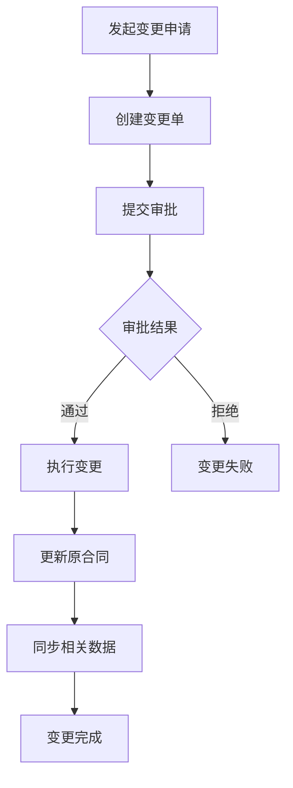
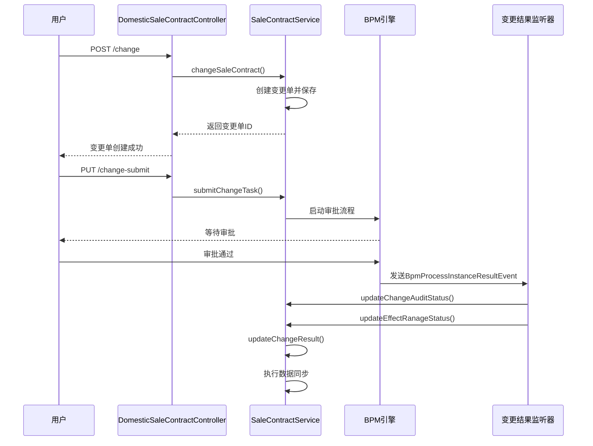

# 销售合同变更

<cite>
**本文档引用文件**   
- [SaleContractApi.java](file://eplus-module-sms/eplus-module-sms-api/src/main/java/com/syj/eplus/module/sms/api/SaleContractApi.java)
- [SaleContractApiImpl.java](file://eplus-module-sms/eplus-module-sms-biz/src/main/java/com/syj/eplus/module/sms/api/SaleContractApiImpl.java)
- [DomesticSaleContractController.java](file://eplus-module-sms/eplus-module-sms-biz/src/main/java/com/syj/eplus/module/sms/controller/admin/salecontract/DomesticSaleContractController.java)
- [ExportSaleContractController.java](file://eplus-module-sms/eplus-module-sms-biz/src/main/java/com/syj/eplus/module/sms/controller/admin/salecontract/ExportSaleContractController.java)
- [SaleContractService.java](file://eplus-module-sms/eplus-module-sms-biz/src/main/java/com/syj/eplus/module/sms/service/salecontract/SaleContractService.java)
- [SaleContractServiceImpl.java](file://eplus-module-sms/eplus-module-sms-biz/src/main/java/com/syj/eplus/module/sms/service/salecontract/SaleContractServiceImpl.java)
- [SaleContractChange.java](file://eplus-module-sms/eplus-module-sms-biz/src/main/java/com/syj/eplus/module/sms/dal/dataobject/salecontractchange/SaleContractChange.java)
- [SaleContractChangeDataPermissionConfiguration.java](file://eplus-module-sms/eplus-module-sms-biz/src/main/java/com/syj/eplus/module/sms/framework/config/SaleContractChangeDataPermissionConfiguration.java)
- [DomesticSaleContractChangeResultListener.java](file://eplus-module-sms/eplus-module-sms-biz/src/main/java/com/syj/eplus/module/sms/listener/salecontract/DomesticSaleContractChangeResultListener.java)
- [SaleContractSaveDTO.java](file://eplus-module-sms/eplus-module-sms-api/src/main/java/com/syj/eplus/module/sms/api/dto/SaleContractSaveDTO.java)
- [SaleContractStatusEnum.java](file://eplus-framework/eplus-common/src/main/java/com/syj/eplus/framework/common/enums/SaleContractStatusEnum.java)
</cite>

## 目录
1. [引言](#引言)
2. [销售合同变更流程](#销售合同变更流程)
3. [触发条件与权限控制](#触发条件与权限控制)
4. [变更申请的创建、审批与执行](#变更申请的创建审批与执行)
5. [数据版本管理策略](#数据版本管理策略)
6. [业务规则校验](#业务规则校验)
7. [审批流程集成与数据同步](#审批流程集成与数据同步)
8. [使用示例](#使用示例)
9. [异常处理与回滚机制](#异常处理与回滚机制)
10. [结论](#结论)

## 引言
销售合同变更是企业销售管理中的关键环节，允许在合同执行过程中对合同条款进行调整。本系统实现了完整的销售合同变更功能，包括内销合同和外销合同的变更。变更功能通过独立的变更单进行管理，确保变更过程的可追溯性和数据完整性。系统通过BPM（业务流程管理）引擎实现变更审批流程，确保变更操作经过必要的审核。变更功能支持对合同基本信息、销售明细、加减项、收款计划等关键信息的修改，并在变更成功后自动同步相关数据。

## 销售合同变更流程
销售合同变更流程是一个结构化的业务过程，从变更申请的创建开始，经过审批，最终执行变更并更新系统数据。整个流程通过变更单（Change Order）进行跟踪和管理。

**流程说明：**
1. **发起变更申请**：用户选择需要变更的销售合同，发起变更申请。
2. **创建变更单**：系统创建一个新的变更单，记录变更前后的数据差异。
3. **提交审批**：用户提交变更单，进入审批流程。
4. **审批**：相关审批人对变更内容进行审核。
5. **执行变更**：审批通过后，系统执行变更操作，更新原合同数据。
6. **数据同步**：变更成功后，系统自动同步与该合同相关的所有数据，如采购计划、出运计划等。
7. **变更完成**：变更流程结束，合同状态更新为已变更。

**Diagram sources**
- [DomesticSaleContractController.java](file://eplus-module-sms/eplus-module-sms-biz/src/main/java/com/syj/eplus/module/sms/controller/admin/salecontract/DomesticSaleContractController.java#L144-L146)
- [SaleContractService.java](file://eplus-module-sms/eplus-module-sms-biz/src/main/java/com/syj/eplus/module/sms/service/salecontract/SaleContractService.java#L167-L198)
- [DomesticSaleContractChangeResultListener.java](file://eplus-module-sms/eplus-module-sms-biz/src/main/java/com/syj/eplus/module/sms/listener/salecontract/DomesticSaleContractChangeResultListener.java#L21-L29)

## 触发条件与权限控制
销售合同变更功能的触发和执行受到严格的条件和权限控制，以确保业务数据的安全性和合规性。

### 触发条件
销售合同变更的触发条件主要基于合同的当前状态。根据 `SaleContractStatusEnum` 枚举定义，只有处于特定状态的合同才能发起变更。通常，已提交但未完成采购或出运的合同（如“待审批”、“审批中”、“待采购”等状态）允许进行变更。已结案或已作废的合同则不允许变更。

### 权限控制
系统通过基于角色的访问控制（RBAC）来管理变更权限。具体的权限控制通过Spring Security的`@PreAuthorize`注解在控制器方法上实现。

**核心权限点：**
- **变更发起权限**：`sms:domestic-sale-contract-change:update` 或 `sms:export-sale-contract:change`，允许用户创建和修改变更单。
- **变更提交权限**：`sms:domestic-sale-contract-change:submit` 或 `sms:export-sale-contract:submit`，允许用户将变更单提交审批。
- **变更审批权限**：`sms:domestic-sale-contract-change:audit` 或 `sms:export-sale-contract-change:audit`，允许用户审批变更申请。
- **变更确认权限**：`sms:domestic-sale-contract-change:confirm` 或 `sms:export-sale-contract-change:confirm`，允许用户确认变更结果。

此外，系统还通过数据权限配置（`SaleContractChangeDataPermissionConfiguration`）来限制用户只能访问其有权限的合同数据，例如，用户只能看到自己创建或作为销售人员的合同。

**Section sources**
- [DomesticSaleContractController.java](file://eplus-module-sms/eplus-module-sms-biz/src/main/java/com/syj/eplus/module/sms/controller/admin/salecontract/DomesticSaleContractController.java#L143-L144)
- [ExportSaleContractController.java](file://eplus-module-sms/eplus-module-sms-biz/src/main/java/com/syj/eplus/module/sms/controller/admin/salecontract/ExportSaleContractController.java#L232-L233)
- [SaleContractChangeDataPermissionConfiguration.java](file://eplus-module-sms/eplus-module-sms-biz/src/main/java/com/syj/eplus/module/sms/framework/config/SaleContractChangeDataPermissionConfiguration.java#L13-L18)

## 变更申请的创建、审批与执行
### 变更申请的创建
用户通过调用`/sms/domestic/sale-contract/change`或`/sms/export/sale-contract/change`接口发起变更。系统会根据原合同的ID加载合同的当前数据，并允许用户进行修改。变更单的数据结构（`SaleContractChange`）与原合同（`SaleContractDO`）高度相似，但包含了额外的审计和流程信息。

### 变更审批
变更申请的审批流程与主合同的审批流程集成。当用户提交变更单时，系统会启动一个独立的BPM流程实例。审批人通过`approveChangeTask`和`rejectChangeTask`接口进行审批操作。审批结果通过事件监听器（`DomesticSaleContractChangeResultListener`）捕获。

### 变更执行
审批通过后，系统执行`updateChangeResult`方法，将变更单中的新数据应用到原合同上。此过程是事务性的，确保数据的一致性。变更成功后，原合同的状态会更新，变更单的状态也会标记为已完成。

**Diagram sources**
- [DomesticSaleContractController.java](file://eplus-module-sms/eplus-module-sms-biz/src/main/java/com/syj/eplus/module/sms/controller/admin/salecontract/DomesticSaleContractController.java#L144-L153)
- [SaleContractService.java](file://eplus-module-sms/eplus-module-sms-biz/src/main/java/com/syj/eplus/module/sms/service/salecontract/SaleContractService.java#L175-L183)
- [DomesticSaleContractChangeResultListener.java](file://eplus-module-sms/eplus-module-sms-biz/src/main/java/com/syj/eplus/module/sms/listener/salecontract/DomesticSaleContractChangeResultListener.java#L21-L29)

## 数据版本管理策略
系统通过变更单（`SaleContractChange`）实体来实现数据版本管理，这是一种“变更日志”模式，而非直接覆盖原数据。

### 变更前后的数据对比
`SaleContractChange`实体中包含了一个`oldData`字段（类型为`SaleContractRespVO`），该字段在创建变更单时自动保存原合同的完整快照。当用户在界面上查看变更单时，系统可以将`oldData`与变更单中的新数据进行对比，高亮显示所有被修改的字段。`@CompareField`注解用于标记需要进行对比的字段。

### 历史记录保存
每次成功的变更都会生成一条新的`SaleContractChange`记录，并与原合同关联（通过`sourceCode`字段）。这些记录被永久保存在`sms_sale_contract_change`数据库表中，形成了完整的变更历史。用户可以通过变更分页接口（`getChangeSaleContractPage`）查询某个合同的所有变更历史，了解合同的演变过程。

**Section sources**
- [SaleContractChange.java](file://eplus-module-sms/eplus-module-sms-biz/src/main/java/com/syj/eplus/module/sms/dal/dataobject/salecontractchange/SaleContractChange.java#L427-L428)
- [SaleContractChange.java](file://eplus-module-sms/eplus-module-sms-biz/src/main/java/com/syj/eplus/module/sms/dal/dataobject/salecontractchange/SaleContractChange.java#L71-L72)

## 业务规则校验
在变更过程中，系统会执行一系列业务规则校验，以确保变更的合法性和数据的准确性。

### 变更金额限制
系统在计算合同总金额、订单毛利、毛利率等财务指标时，会进行严格的校验。例如，`orderGrossProfit`（订单毛利）和`grossProfitMargin`（毛利率）是根据销售总金额、采购合计、各项费用等数据计算得出的，系统会确保这些计算结果的准确性。变更后的总金额必须与明细金额的总和一致。

### 客户信用额度重新评估
虽然在提供的代码片段中没有直接体现，但根据业务逻辑，当合同金额发生变更时，系统应触发对客户信用额度的重新评估。这通常通过调用CRM模块的API来实现，检查变更后的合同金额是否仍在客户的信用额度范围内。如果超出额度，变更流程可能会被阻止或需要更高层级的审批。

**Section sources**
- [SaleContractSaveDTO.java](file://eplus-module-sms/eplus-module-sms-api/src/main/java/com/syj/eplus/module/sms/api/dto/SaleContractSaveDTO.java#L355-L360)

## 审批流程集成与数据同步
### 审批流程集成
销售合同变更与BPM（业务流程管理）系统深度集成。变更流程使用独立的流程定义（Process Definition Key），如`getDomesticChangeProcessDefinitionKey`方法所定义。审批事件通过`BpmProcessInstanceResultEventListener`监听器捕获，确保审批结果能及时反馈到业务系统。

### 变更成功后的数据同步机制
变更成功后，系统会自动触发一系列数据同步操作：
1. **更新原合同**：将变更单中的新数据写回原合同记录。
2. **更新影响范围**：调用`updateEffectRanageStatus`方法，更新受此变更影响的其他业务单据（如采购计划、出运计划）的状态。
3. **重新生成计划**：如果变更影响了采购或出运数量，系统可能需要重新生成或调整相关的采购计划和出运计划。
4. **更新库存锁定**：根据变更后的销售数量，重新计算和锁定库存。

**Section sources**
- [DomesticSaleContractChangeResultListener.java](file://eplus-module-sms/eplus-module-sms-biz/src/main/java/com/syj/eplus/module/sms/listener/salecontract/DomesticSaleContractChangeResultListener.java#L25-L28)
- [SaleContractService.java](file://eplus-module-sms/eplus-module-sms-biz/src/main/java/com/syj/eplus/module/sms/service/salecontract/SaleContractService.java#L359-L360)

## 使用示例
以下是一个发起销售合同变更申请的使用示例：

1.  **前端调用**：用户在前端界面选择一个待变更的销售合同，修改客户名称和销售数量，然后点击“提交变更”。
2.  **API请求**：前端向后端发送一个POST请求到`/sms/domestic/sale-contract/change`接口，请求体包含修改后的合同数据。
3.  **服务处理**：`DomesticSaleContractController`接收到请求，调用`SaleContractService.changeSaleContract`方法。
4.  **创建变更单**：服务方法创建一个新的`SaleContractChange`对象，将原合同数据存入`oldData`字段，并保存变更单。
5.  **返回结果**：服务返回变更单的创建结果，前端显示“变更申请已提交，等待审批”。

**Section sources**
- [DomesticSaleContractController.java](file://eplus-module-sms/eplus-module-sms-biz/src/main/java/com/syj/eplus/module/sms/controller/admin/salecontract/DomesticSaleContractController.java#L144-L146)

## 异常处理与回滚机制
系统具备完善的异常处理和回滚机制，以应对变更过程中的各种问题。

### 异常处理
- **数据校验异常**：在创建或提交变更单时，如果数据不满足业务规则（如必填字段为空），系统会抛出验证异常，并返回详细的错误信息。
- **权限异常**：如果用户没有执行某项操作的权限，系统会返回403 Forbidden错误。
- **流程异常**：如果BPM流程启动失败，系统会捕获异常并记录日志。

### 回滚机制
- **审批拒绝回滚**：如果变更申请被审批拒绝，变更流程结束，原合同数据保持不变。
- **流程取消回滚**：如果审批流程被取消（CANCEL），系统会调用`updateContractChangeStatus`方法，将原合同的状态恢复为“未变更”，确保系统状态的一致性。
- **事务回滚**：关键的数据库操作（如更新合同、生成计划）都在事务中执行。如果在执行过程中发生任何错误，整个事务将被回滚，防止数据不一致。

**Section sources**
- [DomesticSaleContractChangeResultListener.java](file://eplus-module-sms/eplus-module-sms-biz/src/main/java/com/syj/eplus/module/sms/listener/salecontract/DomesticSaleContractChangeResultListener.java#L26-L28)

## 结论
本系统实现了一套完整、安全且可追溯的销售合同变更功能。通过变更单模式实现了数据版本管理，通过BPM引擎实现了灵活的审批流程，通过严格的权限控制和业务规则校验确保了数据的准确性和安全性。变更成功后的数据同步机制保证了业务数据的一致性。整个流程设计合理，能够有效支持企业在复杂业务场景下的合同变更需求。