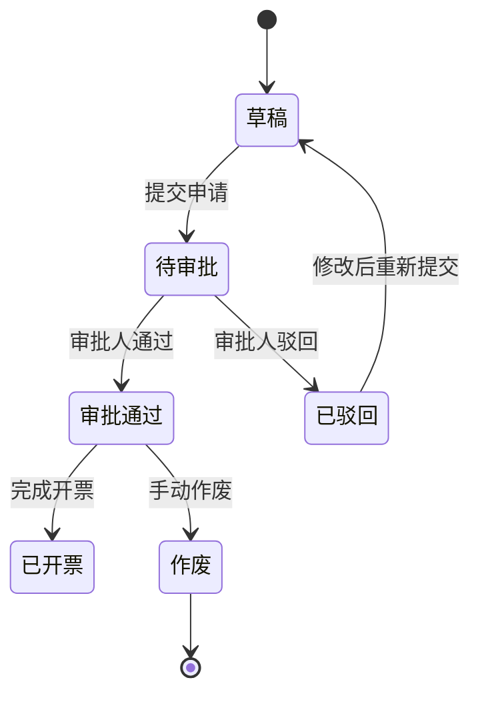

# 开票申请

<cite>
**本文档引用文件**  
- [InvoicingNoticesController.java](file://eplus-module-scm/eplus-module-scm-biz/src/main/java/com/syj/eplus/module/scm/controller/admin/invoicingnotices/InvoicingNoticesController.java)
- [InvoicingNoticesServiceImpl.java](file://eplus-module-scm/eplus-module-scm-biz/src/main/java/com/syj/eplus/module/scm/service/invoicingnotices/InvoicingNoticesServiceImpl.java)
- [InvoicingNoticesRespVO.java](file://eplus-module-scm/eplus-module-scm-biz/src/main/java/com/syj/eplus/module/scm/controller/admin/invoicingnotices/vo/InvoicingNoticesRespVO.java)
- [InvoicingNoticesPrintSku.java](file://eplus-module-scm/eplus-module-scm-biz/src/main/java/com/syj/eplus/module/scm/controller/admin/invoicingnotices/vo/InvoicingNoticesPrintSku.java)
- [SaleContractApi.java](file://eplus-module-sms/eplus-module-sms-api/src/main/java/com/syj/eplus/module/sms/api/SaleContractApi.java)
- [V1_0_0_026__新增开票通知表.sql](file://eplus-flyway/src/main/resources/db/migration/common/V1_0_0_026__新增开票通知表.sql)
- [V1_0_0_216__开票明细增加出运发票号.java](file://eplus-flyway/src/main/java/db/migration/common/V1_0_0_216__开票明细增加出运发票号.java)
- [SpStatusEnum.java](file://eplus-module-social/src/main/java/com/syj/eplus/module/wechat/enums/SpStatusEnum.java)
</cite>

## 目录
1. [简介](#简介)
2. [开票申请创建流程](#开票申请创建流程)
3. [审批机制与状态管理](#审批机制与状态管理)
4. [开票申请单字段构成](#开票申请单字段构成)
5. [与销售合同及销售明细的关联关系](#与销售合同及销售明细的关联关系)
6. [开票数量计算逻辑](#开票数量计算逻辑)
7. [审批流程配置与状态变更](#审批流程配置与状态变更)
8. [与开票通知的衔接机制](#与开票通知的衔接机制)
9. [业务规则限制](#业务规则限制)
10. [界面字段说明与操作指引](#界面字段说明与操作指引)

## 简介
开票申请功能是企业财务与供应链管理中的关键环节，用于在完成出运等前置业务流程后，向客户开具发票的正式申请。该功能涉及多个模块的协同工作，包括销售管理（SMS）、供应链管理（SCM）以及审批流程集成。系统通过结构化的数据模型和清晰的业务流程，确保开票申请的准确性、合规性和可追溯性。

**开票申请**的核心是“开票通知”（Invoicing Notices），它作为从出运到开票的桥梁，记录了需要开票的具体商品、数量、金额、税率等信息，并与采购合同、销售合同、出运单等关键业务单据紧密关联。整个流程支持手工创建和系统自动生成两种模式，并通过工作流引擎实现多级审批控制。

## 开票申请创建流程
开票申请的创建主要通过“开票通知”模块实现，其流程如下：

1.  **触发条件**：开票申请通常在出运流程完成后触发。系统会根据出运单（Shipment）的信息，自动或手动创建开票通知。
2.  **数据来源**：创建时，系统会关联一个或多个出运发票号（`shipInvoiceCode`），并基于此获取相关的供应商和采购合同信息。
3.  **明细生成**：系统会查询与出运单相关的采购合同明细，并将其作为开票通知的初始明细项。每条明细包含产品编号、数量、单价、币种、税率等核心信息。
4.  **信息补充与调整**：用户可以在生成的开票通知基础上，手动调整开票数量、单价或添加备注。对于特殊需求，也支持完全手工创建开票通知。
5.  **提交申请**：用户确认信息无误后，提交开票申请。提交后，申请进入审批流程。

该流程的入口和核心逻辑位于 `InvoicingNoticesController` 和 `InvoicingNoticesServiceImpl` 类中，通过 REST API 接收前端请求并处理业务逻辑。

**Section sources**
- [InvoicingNoticesController.java](file://eplus-module-scm/eplus-module-scm-biz/src/main/java/com/syj/eplus/module/scm/controller/admin/invoicingnotices/InvoicingNoticesController.java)
- [InvoicingNoticesServiceImpl.java](file://eplus-module-scm/eplus-module-scm-biz/src/main/java/com/syj/eplus/module/scm/service/invoicingnotices/InvoicingNoticesServiceImpl.java)

## 审批机制与状态管理
开票申请的审批机制深度集成了工作流引擎（BPM），确保了流程的规范性和灵活性。

### 审批机制
- **流程驱动**：每个开票申请提交后，都会启动一个独立的审批流程实例（`processInstanceId`）。该实例的ID被记录在开票通知主表中。
- **审批节点**：审批流程可以配置为多级审批，例如由业务员发起，经部门主管、财务经理，最终由财务总监审批。
- **审批操作**：审批人可以在审批界面查看开票申请的全部详情，并执行“通过”或“驳回”操作。这些操作通过调用工作流API（如 `BpmTaskApproveReqDTO`）来完成。
- **状态同步**：审批操作的结果会实时同步回开票通知单，更新其 `auditStatus`（审核状态）和 `status`（单据状态）。

### 状态管理
开票申请单（即开票通知）拥有明确的状态机，其状态转换由业务操作和审批结果驱动。

**Diagram sources**
- [InvoicingNoticesRespVO.java](file://eplus-module-scm/eplus-module-scm-biz/src/main/java/com/syj/eplus/module/scm/controller/admin/invoicingnotices/vo/InvoicingNoticesRespVO.java#L71-L96)
- [SpStatusEnum.java](file://eplus-module-social/src/main/java/com/syj/eplus/module/wechat/enums/SpStatusEnum.java)

**Section sources**
- [InvoicingNoticesRespVO.java](file://eplus-module-scm/eplus-module-scm-biz/src/main/java/com/syj/eplus/module/scm/controller/admin/invoicingnotices/vo/InvoicingNoticesRespVO.java)
- [InvoicingNoticesServiceImpl.java](file://eplus-module-scm/eplus-module-scm-biz/src/main/java/com/syj/eplus/module/scm/service/invoicingnotices/InvoicingNoticesServiceImpl.java)

## 开票申请单字段构成
开票申请单（开票通知）的数据结构分为主表信息和明细表信息。

### 主表字段
| 字段名 | 描述 | 数据类型 |
| :--- | :--- | :--- |
| `code` | 开票通知单号 | String |
| `companyId` | 付款主体（公司ID） | Long |
| `venderCode` | 供应商编号 | String |
| `shipInvoiceCode` | 出运发票号 | String |
| `status` | 单据状态（如：草稿、待审批、审批通过等） | Integer |
| `manuallyFlag` | 是否为手工创建 | Integer |
| `processInstanceId` | 流程实例ID | String |
| `createTime` | 创建时间 | LocalDateTime |

### 明细表字段
| 字段名 | 描述 | 数据类型 |
| :--- | :--- | :--- |
| `purchase_contract_code` | 采购合同号 | String |
| `sku_code` | 产品编号 | String |
| `invoic_sku_name` | 发票品名 | String |
| `invoic_notices_quantity` | 通知开票数量 | Decimal |
| `invoic_unit_price` | 开票单价 | Decimal |
| `invoic_this_price` | 本次开票金额 | Decimal |
| `inveic_registered_status` | 发票登记状态 | Integer |
| `sale_contract_code` | 关联的销售合同编号 | String |
| `custPo` | 客户PO | String |

这些字段的定义直接来源于数据库表 `scm_invoicing_notices` 和 `scm_invoicing_notices_item`。

**Section sources**
- [InvoicingNoticesRespVO.java](file://eplus-module-scm/eplus-module-scm-biz/src/main/java/com/syj/eplus/module/scm/controller/admin/invoicingnotices/vo/InvoicingNoticesRespVO.java)
- [V1_0_0_026__新增开票通知表.sql](file://eplus-flyway/src/main/resources/db/migration/common/V1_0_0_026__新增开票通知表.sql)

## 与销售合同及销售明细的关联关系
开票申请并非孤立存在，它与销售合同（Sale Contract）和销售明细（Sale Contract Item）有着直接和间接的关联。

1.  **直接关联**：在开票通知的明细表中，有一个 `sale_contract_code` 字段，它直接记录了该开票项所对应的销售合同编号。这建立了从采购端到销售端的直接链接。
2.  **间接关联**：开票申请的源头是出运单，而出运单是基于销售合同生成的。因此，开票申请通过“出运单”这一中间环节，间接地与销售合同及其明细关联。系统可以通过 `shipInvoiceCode` 追溯到出运单，再追溯到销售合同。
3.  **数据一致性**：这种关联确保了开票金额和数量不会超过销售合同的约定范围。系统在生成开票通知时，会校验可开票的数量。

**Section sources**
- [InvoicingNoticesPrintSku.java](file://eplus-module-scm/eplus-module-scm-biz/src/main/java/com/syj/eplus/module/scm/controller/admin/invoicingnotices/vo/InvoicingNoticesPrintSku.java)
- [SaleContractApi.java](file://eplus-module-sms/eplus-module-sms-api/src/main/java/com/syj/eplus/module/sms/api/SaleContractApi.java)

## 开票数量计算逻辑
开票数量的计算是一个关键的业务规则，主要基于出运数量，并受到合同余额的限制。

1.  **基础来源**：开票数量的最直接来源是**出运数量**（Shipped Quantity）。系统在创建开票通知时，通常会默认将已出运的数量作为可开票的数量。
2.  **计算逻辑**：
    - 系统会查询与出运单相关的采购合同明细。
    - 对于每条明细，获取其“已出运数量”。
    - 将“已出运数量”作为“通知开票数量”的初始值。
3.  **调整与限制**：
    - 用户可以根据实际业务情况（如部分开票、分批开票）手动调整开票数量。
    - 系统会进行校验，确保申请的开票数量不超过该合同项下剩余的可开票数量。
    - 可开票数量 = 合同总数量 - 已开票数量。

**Section sources**
- [InvoicingNoticesServiceImpl.java](file://eplus-module-scm/eplus-module-scm-biz/src/main/java/com/syj/eplus/module/scm/service/invoicingnotices/InvoicingNoticesServiceImpl.java)
- [SaleContractApi.java](file://eplus-module-sms/eplus-module-sms-api/src/main/java/com/syj/eplus/module/sms/api/SaleContractApi.java)

## 审批流程配置与状态变更
审批流程的配置和状态变更是两个紧密相连的环节。

### 审批流程配置
- **流程定义**：审批流程的结构（如节点顺序、审批人）在工作流引擎中预先定义，通常通过BPMN 2.0标准的流程图进行配置。
- **权限控制**：系统通过 `@PreAuthorize` 注解（如 `@ss.hasPermission('scm:invoicing-notices:close')`）来控制不同角色对开票申请的操作权限。
- **动态审批人**：审批人可以是固定的岗位，也可以是根据单据内容（如所属公司、金额大小）动态确定的。

### 状态变更
- **提交**：当用户提交开票申请时，状态从“草稿”变为“待审批”，同时启动流程实例。
- **审批通过**：当所有审批节点都通过后，状态变为“审批通过”，此时可以进行后续的开票操作。
- **审批驳回**：如果任一审批节点被驳回，状态变为“已驳回”，申请人需要修改后重新提交。
- **作废**：对于已提交但需要取消的申请，可以执行“作废”操作（`closeInvoicingNotices`），状态变为“作废”。

**Section sources**
- [InvoicingNoticesController.java](file://eplus-module-scm/eplus-module-scm-biz/src/main/java/com/syj/eplus/module/scm/controller/admin/invoicingnotices/InvoicingNoticesController.java#L188-L194)
- [InvoicingNoticesRespVO.java](file://eplus-module-scm/eplus-module-scm-biz/src/main/java/com/syj/eplus/module/scm/controller/admin/invoicingnotices/vo/InvoicingNoticesRespVO.java#L71-L96)

## 与开票通知的衔接机制
“开票申请”和“开票通知”在本系统中是同一事物的不同表述。开票申请的整个生命周期就是开票通知单的处理过程。

1.  **数据传递**：当开票申请审批通过后，其所有数据（客户信息、商品明细、金额、税率等）即成为正式的开票依据。这些数据会传递给财务开票系统或作为开票员操作的直接参考。
2.  **状态同步**：一旦财务部门完成实际的发票开具，会将“已开票”状态回写到系统中。这通常通过更新 `inveic_registered_status`（发票登记状态）和 `inveic_registered_quantity`（发票登记数量）来实现。
3.  **信息闭环**：这个机制形成了一个完整的业务闭环：申请 -> 审批 -> 开票 -> 状态更新，确保了业务流程的完整性和数据的实时性。

**Section sources**
- [InvoicingNoticesServiceImpl.java](file://eplus-module-scm/eplus-module-scm-biz/src/main/java/com/syj/eplus/module/scm/service/invoicingnotices/InvoicingNoticesServiceImpl.java)
- [V1_0_0_216__开票明细增加出运发票号.java](file://eplus-flyway/src/main/java/db/migration/common/V1_0_0_216__开票明细增加出运发票号.java)

## 业务规则限制
系统内置了多项业务规则，以确保开票申请的合法性和准确性。

1.  **金额限制**：申请的开票金额不能超过关联销售合同的**合同余额**。系统在提交申请时会进行校验。
2.  **数量限制**：申请的开票数量不能超过该合同项下的**可开票数量**。可开票数量等于合同总数量减去历史已开票数量。
3.  **状态限制**：只有状态为“审批通过”的开票申请才能进行实际的开票操作。
4.  **唯一性限制**：开票通知单号（`code`）在系统中必须是唯一的。
5.  **关联性限制**：开票通知必须关联有效的出运发票号或采购合同号，不能凭空创建。

**Section sources**
- [InvoicingNoticesServiceImpl.java](file://eplus-module-scm/eplus-module-scm-biz/src/main/java/com/syj/eplus/module/scm/service/invoicingnotices/InvoicingNoticesServiceImpl.java)
- [SaleContractApi.java](file://eplus-module-sms/eplus-module-sms-api/src/main/java/com/syj/eplus/module/sms/api/SaleContractApi.java)

## 界面字段说明与操作指引
### 界面字段说明
- **基本信息区**：显示开票通知单号、创建时间、状态、付款主体、供应商等。
- **明细列表区**：以表格形式展示所有待开票的商品明细，包括采购合同号、产品编号、发票品名、计量单位、数量、单价、税率、总金额。
- **审批信息区**：显示当前审批进度、审批人、审批意见等。
- **操作按钮区**：根据用户权限和当前状态，显示“提交”、“作废”、“打印”等按钮。

### 操作指引
1.  **创建申请**：进入“开票通知”列表，点击“新增”。选择出运发票号，系统自动带出明细，或选择“手工创建”。
2.  **编辑明细**：在明细列表中，可修改开票数量、单价等。确保修改后的金额和数量符合业务规则。
3.  **提交审批**：确认信息无误后，点击“提交”。系统会校验数据并启动审批流程。
4.  **查看进度**：在列表中查看申请的状态，跟踪审批进度。
5.  **处理驳回**：如果申请被驳回，根据审批意见修改内容后，重新提交。
6.  **作废申请**：对于错误提交的申请，在审批通过前可点击“作废”按钮将其作废。

**Section sources**
- [InvoicingNoticesController.java](file://eplus-module-scm/eplus-module-scm-biz/src/main/java/com/syj/eplus/module/scm/controller/admin/invoicingnotices/InvoicingNoticesController.java)
- [InvoicingNoticesPrintSku.java](file://eplus-module-scm/eplus-module-scm-biz/src/main/java/com/syj/eplus/module/scm/controller/admin/invoicingnotices/vo/InvoicingNoticesPrintSku.java)