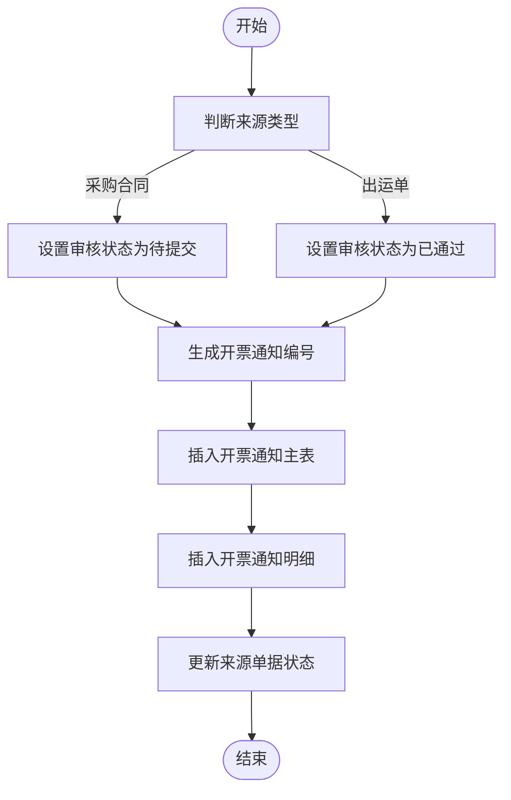
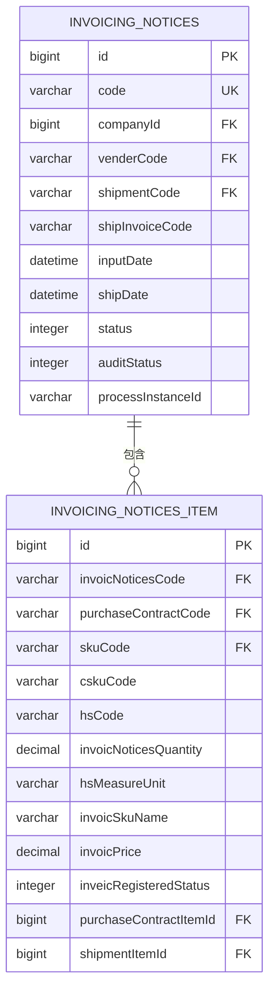
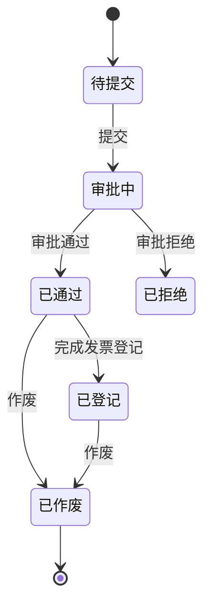
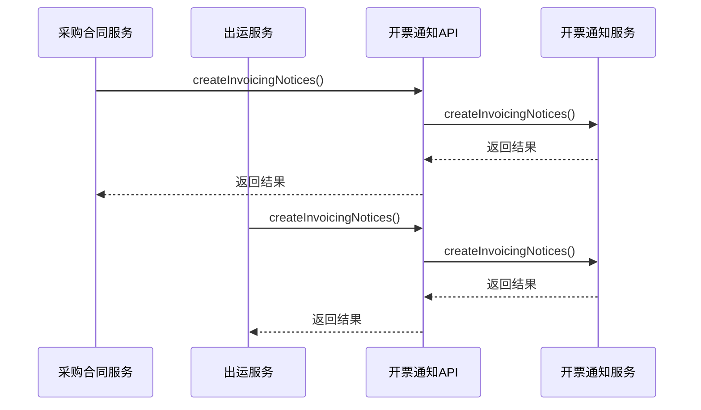
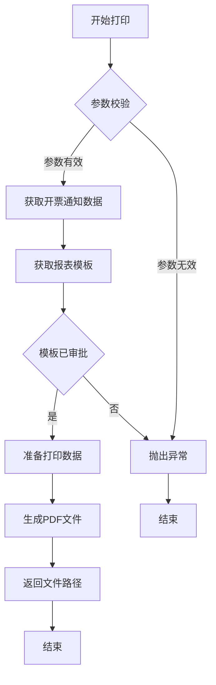

# 开票通知

<cite>
**本文档引用文件**   
- [InvoicingNoticesController.java](file://eplus-module-scm/eplus-module-scm-biz/src/main/java/com/syj/eplus/module/scm/controller/admin/invoicingnotices/InvoicingNoticesController.java)
- [InvoicingNoticesService.java](file://eplus-module-scm/eplus-module-scm-biz/src/main/java/com/syj/eplus/module/scm/service/invoicingnotices/InvoicingNoticesService.java)
- [InvoicingNoticesServiceImpl.java](file://eplus-module-scm/eplus-module-scm-biz/src/main/java/com/syj/eplus/module/scm/service/invoicingnotices/InvoicingNoticesServiceImpl.java)
- [InvoicingNoticesDO.java](file://eplus-module-scm/eplus-module-scm-biz/src/main/java/com/syj/eplus/module/scm/dal/dataobject/invoicingnotices/InvoicingNoticesDO.java)
- [InvoicingNoticesItem.java](file://eplus-module-scm/eplus-module-scm-biz/src/main/java/com/syj/eplus/module/scm/dal/dataobject/invoicingnoticesItem/InvoicingNoticesItem.java)
- [InvoicingNoticesApi.java](file://eplus-module-scm/eplus-module-scm-api/src/main/java/com/syj/eplus/module/scm/api/invoicingnotices/InvoicingNoticesApi.java)
- [InvoicingNoticesApiImpl.java](file://eplus-module-scm/eplus-module-scm-biz/src/main/java/com/syj/eplus/module/scm/api/InvoicingNoticesApiImpl.java)
- [V1_0_0_026__新增开票通知表.sql](file://eplus-flyway/src/main/resources/db/migration/common/V1_0_0_026__新增开票通知表.sql)
</cite>

## 目录
1. [简介](#简介)
2. [开票通知生成规则](#开票通知生成规则)
3. [开票通知内容要素](#开票通知内容要素)
4. [状态流转机制](#状态流转机制)
5. [与开票申请的对应关系](#与开票申请的对应关系)
6. [关键字段说明](#关键字段说明)
7. [打印功能与格式配置](#打印功能与格式配置)
8. [与发票登记的关联控制](#与发票登记的关联控制)
9. [业务规则](#业务规则)
10. [开票通知单示例](#开票通知单示例)

## 简介
开票通知功能是供应链管理系统中的重要组成部分，用于管理供应商开票流程。系统支持从采购合同和出运单两种来源自动生成开票通知，并提供完整的状态管理、审批流程和打印功能。开票通知与发票登记紧密关联，确保财务数据的一致性和准确性。

**Section sources**
- [InvoicingNoticesController.java](file://eplus-module-scm/eplus-module-scm-biz/src/main/java/com/syj/eplus/module/scm/controller/admin/invoicingnotices/InvoicingNoticesController.java#L33-L37)
- [InvoicingNoticesServiceImpl.java](file://eplus-module-scm/eplus-module-scm-biz/src/main/java/com/syj/eplus/module/scm/service/invoicingnotices/InvoicingNoticesServiceImpl.java#L97-L98)

## 开票通知生成规则
开票通知支持两种生成方式：手工创建和自动生成。系统通过`InvoicingNoticesService`接口的`createInvoicingNotices`方法实现开票通知的创建。自动生成机制主要从采购合同和出运单两个业务场景触发。

当从采购合同生成开票通知时，系统会设置审核状态为"待提交"，需要经过审批流程；当从出运单生成时，系统会直接设置为"已通过"状态，无需额外审批。创建过程中，系统会自动生成开票通知编号，编号前缀为"KP"，通过`CodeGeneratorApi`服务获取。

**Diagram sources**
- [InvoicingNoticesServiceImpl.java](file://eplus-module-scm/eplus-module-scm-biz/src/main/java/com/syj/eplus/module/scm/service/invoicingnotices/InvoicingNoticesServiceImpl.java#L169-L244)
- [InvoicingNoticesDO.java](file://eplus-module-scm/eplus-module-scm-biz/src/main/java/com/syj/eplus/module/scm/dal/dataobject/invoicingnotices/InvoicingNoticesDO.java#L40-L41)

**Section sources**
- [InvoicingNoticesServiceImpl.java](file://eplus-module-scm/eplus-module-scm-biz/src/main/java/com/syj/eplus/module/scm/service/invoicingnotices/InvoicingNoticesServiceImpl.java#L169-L244)
- [InvoicingNoticesDO.java](file://eplus-module-scm/eplus-module-scm-biz/src/main/java/com/syj/eplus/module/scm/dal/dataobject/invoicingnotices/InvoicingNoticesDO.java#L40-L41)

## 开票通知内容要素
开票通知包含主表信息和明细信息两个部分。主表信息包括开票通知编号、归属公司、供应商信息、出运信息等；明细信息包括产品明细、数量、单价、金额等。

主表信息存储在`scm_invoicing_notices`表中，包含以下关键字段：开票通知编号(code)、公司ID(companyId)、供应商编号(venderCode)、出运单号(shipmentCode)、出运发票号(shipInvoiceCode)等。明细信息存储在`scm_invoicing_notices_item`表中，包含产品编号(skuCode)、客户货号(cskuCode)、HS编码(hsCode)、开票数量(invoicNoticesQuantity)、开票单价(invoicPrice)等字段。

**Diagram sources**
- [V1_0_0_026__新增开票通知表.sql](file://eplus-flyway/src/main/resources/db/migration/common/V1_0_0_026__新增开票通知表.sql#L29-L44)
- [InvoicingNoticesDO.java](file://eplus-module-scm/eplus-module-scm-biz/src/main/java/com/syj/eplus/module/scm/dal/dataobject/invoicingnotices/InvoicingNoticesDO.java)
- [InvoicingNoticesItem.java](file://eplus-module-scm/eplus-module-scm-biz/src/main/java/com/syj/eplus/module/scm/dal/dataobject/invoicingnoticesItem/InvoicingNoticesItem.java)

**Section sources**
- [InvoicingNoticesDO.java](file://eplus-module-scm/eplus-module-scm-biz/src/main/java/com/syj/eplus/module/scm/dal/dataobject/invoicingnotices/InvoicingNoticesDO.java)
- [InvoicingNoticesItem.java](file://eplus-module-scm/eplus-module-scm-biz/src/main/java/com/syj/eplus/module/scm/dal/dataobject/invoicingnoticesItem/InvoicingNoticesItem.java)

## 状态流转机制
开票通知的状态流转包括审核状态和业务状态两个维度。审核状态由BPM流程引擎管理，包括：待提交、审批中、已通过、已拒绝。业务状态包括：未登记、已登记、已作废。

当用户提交开票通知时，系统会启动审批流程，审核状态变为"审批中"；审批通过后，状态变为"已通过"；如果审批被拒绝，状态变为"已拒绝"。业务状态方面，当开票通知创建时为"未登记"，在完成发票登记后变为"已登记"，如果需要取消，则可作废变为"已作废"状态。

**Diagram sources**
- [InvoicingNoticesServiceImpl.java](file://eplus-module-scm/eplus-module-scm-biz/src/main/java/com/syj/eplus/module/scm/service/invoicingnotices/InvoicingNoticesServiceImpl.java#L485-L491)
- [InvoicingNoticesDO.java](file://eplus-module-scm/eplus-module-scm-biz/src/main/java/com/syj/eplus/module/scm/dal/dataobject/invoicingnotices/InvoicingNoticesDO.java#L124-L128)

**Section sources**
- [InvoicingNoticesServiceImpl.java](file://eplus-module-scm/eplus-module-scm-biz/src/main/java/com/syj/eplus/module/scm/service/invoicingnotices/InvoicingNoticesServiceImpl.java#L485-L491)
- [InvoicingNoticesDO.java](file://eplus-module-scm/eplus-module-scm-biz/src/main/java/com/syj/eplus/module/scm/dal/dataobject/invoicingnotices/InvoicingNoticesDO.java#L124-L128)

## 与开票申请的对应关系
开票通知与开票申请存在明确的对应关系。系统通过`InvoicingNoticesApi`接口提供批量生成开票通知的功能，该接口被其他模块调用以实现从不同业务场景生成开票通知。

当从采购合同生成开票通知时，采购合同服务会调用`InvoicingNoticesService`的`createInvoicingNotices`方法；当从出运单生成时，出运服务会调用相同的方法。这种设计实现了业务解耦，确保开票通知的生成逻辑集中管理。

**Diagram sources**
- [InvoicingNoticesApi.java](file://eplus-module-scm/eplus-module-scm-api/src/main/java/com/syj/eplus/module/scm/api/invoicingnotices/InvoicingNoticesApi.java#L8-L16)
- [InvoicingNoticesApiImpl.java](file://eplus-module-scm/eplus-module-scm-biz/src/main/java/com/syj/eplus/module/scm/api/InvoicingNoticesApiImpl.java#L18-L38)
- [InvoicingNoticesServiceImpl.java](file://eplus-module-scm/eplus-module-scm-biz/src/main/java/com/syj/eplus/module/scm/service/invoicingnotices/InvoicingNoticesServiceImpl.java#L169-L244)

**Section sources**
- [InvoicingNoticesApi.java](file://eplus-module-scm/eplus-module-scm-api/src/main/java/com/syj/eplus/module/scm/api/invoicingnotices/InvoicingNoticesApi.java#L8-L16)
- [InvoicingNoticesApiImpl.java](file://eplus-module-scm/eplus-module-scm-biz/src/main/java/com/syj/eplus/module/scm/api/InvoicingNoticesApiImpl.java#L18-L38)

## 关键字段说明
开票通知包含多个关键字段，这些字段的数据来源和计算方式如下：

### 开票金额
开票金额是开票单价与开票数量的乘积。系统在保存时会自动计算总金额，计算公式为：`totalAmount = invoicPrice × invoicNoticesQuantity`。该字段在`InvoicingNoticesItem`实体中定义，但标记为`@TableField(exist = false)`，表示不直接存储在数据库中，而是在查询时计算。

### 商品信息
商品信息包括产品编号(skuCode)、客户货号(cskuCode)、产品品名(skuName)等。这些信息从产品主数据中获取，通过`SkuApi`服务查询。HS编码(hsCode)和海关计量单位(hsMeasureUnit)也是从产品主数据中获取。

### 计量单位
计量单位包括海关计量单位(hsMeasureUnit)和显示单位。海关计量单位从产品主数据中获取，常见的有"千克"(KG)、"克"(G)等。系统支持单位转换计算，当海关计量单位为"千克"且开票单位为"克"时，会进行相应的换算。

### 汇率
系统支持多币种处理，采购含税单价(purchaseWithTaxPrice)包含金额和币种信息。汇率处理由财务模块统一管理，开票通知模块直接使用已换算的金额。

**Section sources**
- [InvoicingNoticesItem.java](file://eplus-module-scm/eplus-module-scm-biz/src/main/java/com/syj/eplus/module/scm/dal/dataobject/invoicingnoticesItem/InvoicingNoticesItem.java#L69-L70)
- [InvoicingNoticesServiceImpl.java](file://eplus-module-scm/eplus-module-scm-biz/src/main/java/com/syj/eplus/module/scm/service/invoicingnotices/InvoicingNoticesServiceImpl.java#L679-L683)
- [InvoicingNoticesItem.java](file://eplus-module-scm/eplus-module-scm-biz/src/main/java/com/syj/eplus/module/scm/dal/dataobject/invoicingnoticesItem/InvoicingNoticesItem.java#L81-L82)

## 打印功能与格式配置
系统提供开票通知打印功能，支持单个打印和合并打印两种模式。打印功能通过`print`方法实现，该方法接受开票通知ID、报表模板编码、公司ID等参数。

打印时，系统会根据配置的报表模板生成PDF文件。模板配置通过`ReportApi`服务管理，支持不同公司、不同业务场景的个性化模板。打印内容包括公司信息、供应商信息、货物明细等。

**Diagram sources**
- [InvoicingNoticesServiceImpl.java](file://eplus-module-scm/eplus-module-scm-biz/src/main/java/com/syj/eplus/module/scm/service/invoicingnotices/InvoicingNoticesServiceImpl.java#L658-L700)
- [InvoicingNoticesController.java](file://eplus-module-scm/eplus-module-scm-biz/src/main/java/com/syj/eplus/module/scm/controller/admin/invoicingnotices/InvoicingNoticesController.java#L148-L157)

**Section sources**
- [InvoicingNoticesServiceImpl.java](file://eplus-module-scm/eplus-module-scm-biz/src/main/java/com/syj/eplus/module/scm/service/invoicingnotices/InvoicingNoticesServiceImpl.java#L658-L700)
- [InvoicingNoticesController.java](file://eplus-module-scm/eplus-module-scm-biz/src/main/java/com/syj/eplus/module/scm/controller/admin/invoicingnotices/InvoicingNoticesController.java#L148-L157)

## 与发票登记的关联控制
开票通知与发票登记存在严格的关联控制。开票通知的发票登记状态(inveicRegisteredStatus)字段用于跟踪登记情况，可能的值包括：未登记、已登记。

当开票通知对应的发票完成登记后，系统会更新开票通知明细的登记状态和已登票数量。这种关联确保了开票通知与实际发票的一致性，防止重复开票或漏开票。系统还提供了查询接口，可以根据开票通知查询相关的发票登记情况。

**Section sources**
- [InvoicingNoticesItem.java](file://eplus-module-scm/eplus-module-scm-biz/src/main/java/com/syj/eplus/module/scm/dal/dataobject/invoicingnoticesItem/InvoicingNoticesItem.java#L71-L72)
- [InvoicingNoticesDO.java](file://eplus-module-scm/eplus-module-scm-biz/src/main/java/com/syj/eplus/module/scm/dal/dataobject/invoicingnotices/InvoicingNoticesDO.java#L131-L134)

## 业务规则
开票通知遵循以下业务规则：

1. **金额一致性规则**：开票通知的开票金额必须等于实际发票金额。系统在发票登记时会进行校验，确保金额一致。

2. **多对一关系**：多张发票可以对应同一张开票通知。当一笔采购需要分多次开票时，系统支持将多张发票关联到同一开票通知。

3. **数量控制规则**：开票数量不能超过采购合同的未开票数量。系统在生成开票通知时会检查采购合同明细的已开票数量，确保不会超额开票。

4. **状态更新规则**：当开票通知的所有明细都完成发票登记后，主表状态会自动更新为"已登记"；如果有部分明细完成登记，则状态为"部分登记"。

5. **作废规则**：已通过审批的开票通知可以作废，但已登记的开票通知不能直接作废，需要先取消发票登记。

**Section sources**
- [InvoicingNoticesServiceImpl.java](file://eplus-module-scm/eplus-module-scm-biz/src/main/java/com/syj/eplus/module/scm/service/invoicingnotices/InvoicingNoticesServiceImpl.java#L305-L323)
- [InvoicingNoticesDO.java](file://eplus-module-scm/eplus-module-scm-biz/src/main/java/com/syj/eplus/module/scm/dal/dataobject/invoicingnotices/InvoicingNoticesDO.java#L94-L95)

## 开票通知单示例
以下是一个开票通知单的示例及其字段说明：

| 字段名称 | 字段代码 | 数据类型 | 是否必填 | 说明 |
|---------|--------|--------|--------|------|
| 开票通知编号 | code | varchar(20) | 是 | 系统自动生成，前缀为KP |
| 公司ID | companyId | bigint | 是 | 归属公司主键 |
| 供应商编号 | venderCode | varchar(20) | 是 | 供应商编码 |
| 出运单号 | shipmentCode | varchar(20) | 否 | 关联的出运单号 |
| 出运发票号 | shipInvoiceCode | varchar(100) | 否 | 出运发票编号 |
| 录入日期 | inputDate | datetime | 是 | 创建日期 |
| 跟单员 | manager | JSON | 否 | 负责的业务员信息 |
| 审核状态 | auditStatus | tinyint | 是 | 0:待提交,1:审批中,2:已通过,3:已拒绝 |
| 业务状态 | status | tinyint | 是 | 0:未登记,1:已登记,2:已作废 |

明细示例：

| 字段名称 | 字段代码 | 数据类型 | 是否必填 | 说明 |
|---------|--------|--------|--------|------|
| 开票通知单号 | invoicNoticesCode | varchar(20) | 是 | 关联主表编号 |
| 采购合同号 | purchaseContractCode | varchar(50) | 是 | 采购合同编号 |
| 产品编号 | skuCode | varchar(50) | 是 | 产品编码 |
| 客户货号 | cskuCode | varchar(100) | 否 | 客户指定的货号 |
| HS编码 | hsCode | varchar(100) | 是 | 海关编码 |
| 开票数量 | invoicNoticesQuantity | decimal(19,6) | 是 | 本次开票数量 |
| 开票单价 | invoicPrice | decimal(19,6) | 是 | 开票单价 |
| 开票品名 | invoicSkuName | varchar(200) | 是 | 发票上显示的品名 |
| 海关计量单位 | hsMeasureUnit | varchar(10) | 是 | 海关规定的计量单位 |
| 发票登记状态 | inveicRegisteredStatus | tinyint | 是 | 0:未登记,1:已登记 |

**Section sources**
- [InvoicingNoticesDO.java](file://eplus-module-scm/eplus-module-scm-biz/src/main/java/com/syj/eplus/module/scm/dal/dataobject/invoicingnotices/InvoicingNoticesDO.java)
- [InvoicingNoticesItem.java](file://eplus-module-scm/eplus-module-scm-biz/src/main/java/com/syj/eplus/module/scm/dal/dataobject/invoicingnoticesItem/InvoicingNoticesItem.java)
- [V1_0_0_026__新增开票通知表.sql](file://eplus-flyway/src/main/resources/db/migration/common/V1_0_0_026__新增开票通知表.sql)