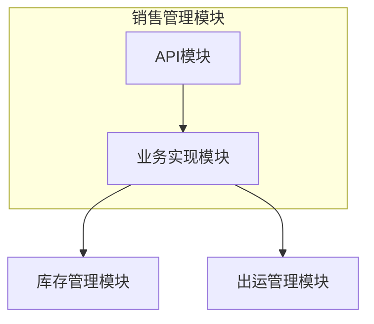
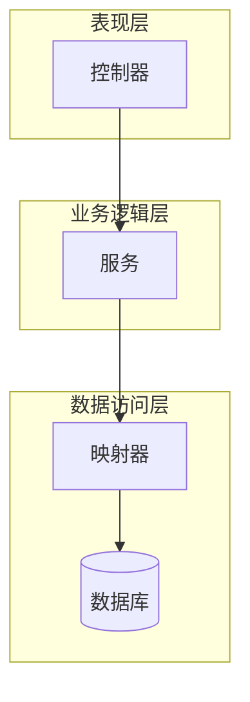
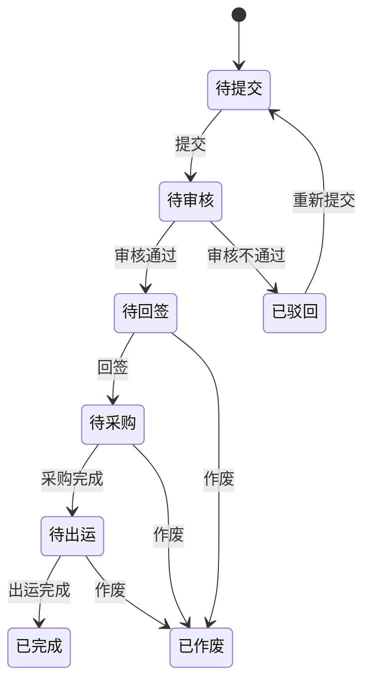
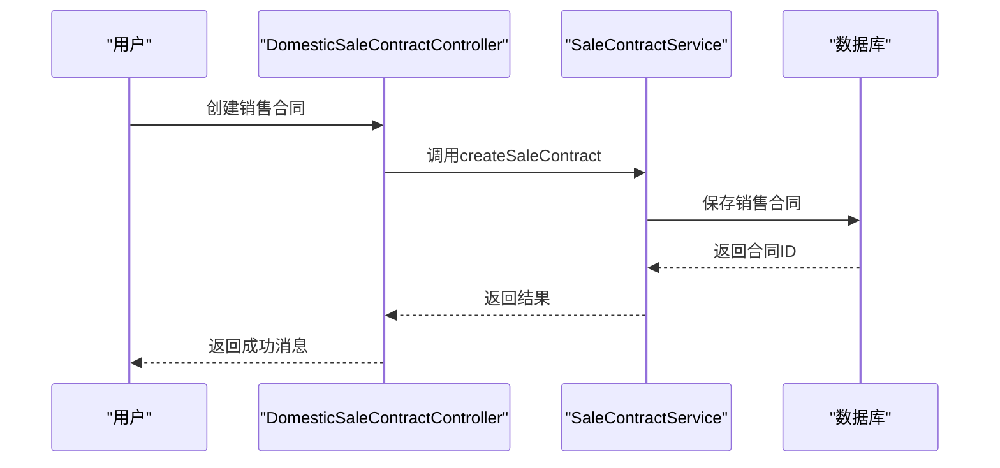
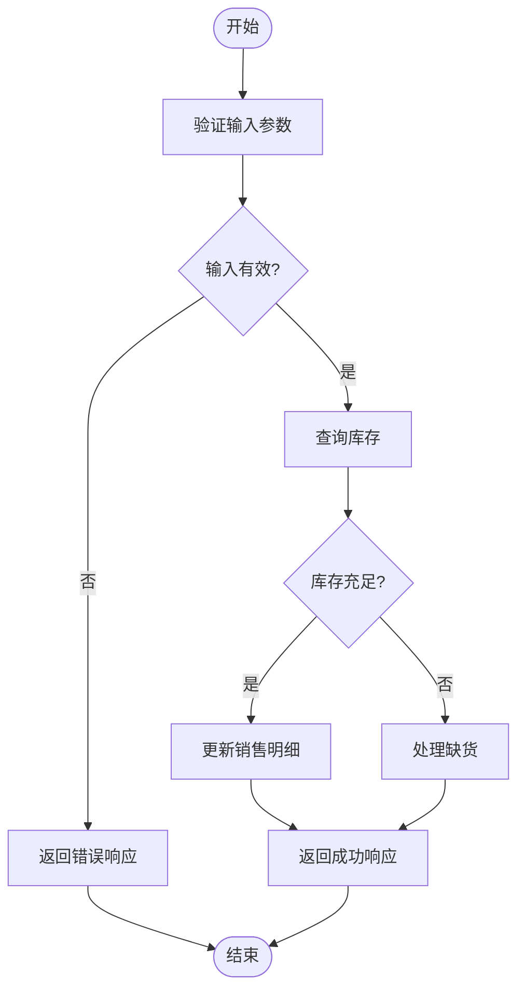
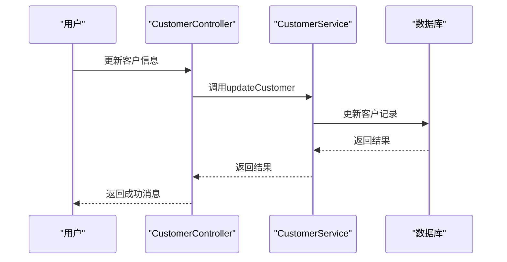
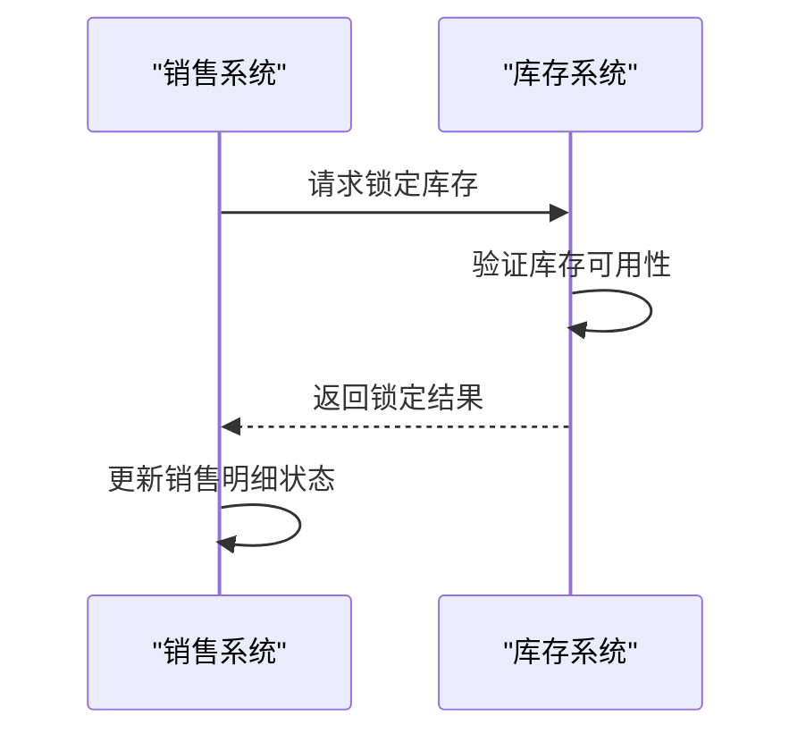
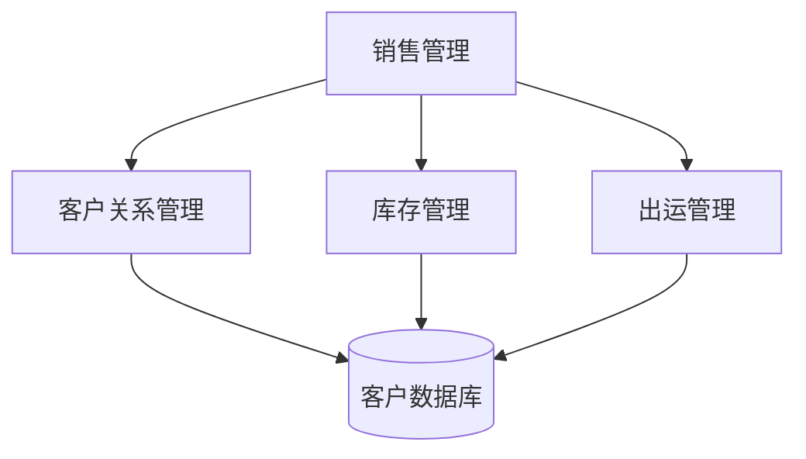

# 销售管理

<cite>
**本文档引用文件**   
- [SaleContractApi.java](file://eplus-module-sms/eplus-module-sms-api/src/main/java/com/syj/eplus/module/sms/api/SaleContractApi.java)
- [SaleContractApiImpl.java](file://eplus-module-sms/eplus-module-sms-biz/src/main/java/com/syj/eplus/module/sms/api/SaleContractApiImpl.java)
- [SaleContractService.java](file://eplus-module-sms/eplus-module-sms-biz/src/main/java/com/syj/eplus/module/sms/service/salecontract/SaleContractService.java)
- [SaleContractSaveDTO.java](file://eplus-module-sms/eplus-module-sms-api/src/main/java/com/syj/eplus/module/sms/api/dto/SaleContractSaveDTO.java)
- [SaleContractItemSaveDTO.java](file://eplus-module-sms/eplus-module-sms-api/src/main/java/com/syj/eplus/module/sms/api/dto/SaleContractItemSaveDTO.java)
- [SaleContractStatusEnum.java](file://eplus-framework/eplus-common/src/main/java/com/syj/eplus/framework/common/enums/SaleContractStatusEnum.java)
- [SaleContractDict.java](file://eplus-framework/eplus-common/src/main/java/com/syj/eplus/framework/common/dict/SaleContractDict.java)
- [DomesticSaleContractController.java](file://eplus-module-sms/eplus-module-sms-biz/src/main/java/com/syj/eplus/module/sms/controller/admin/salecontract/DomesticSaleContractController.java)
- [FactorySaleContractController.java](file://eplus-module-sms/eplus-module-sms-biz/src/main/java/com/syj/eplus/module/sms/controller/admin/salecontract/FactorySaleContractController.java)
</cite>

## 目录
1. [引言](#引言)
2. [项目结构](#项目结构)
3. [核心组件](#核心组件)
4. [架构概述](#架构概述)
5. [详细组件分析](#详细组件分析)
6. [依赖分析](#依赖分析)
7. [性能考虑](#性能考虑)
8. [故障排除指南](#故障排除指南)
9. [结论](#结论)
10. [附录](#附录)（如有必要）

## 引言
本文档全面介绍销售管理模块的核心功能，包括销售合同、销售订单和客户管理。详细说明销售合同的创建、变更和审批流程，涵盖销售合同辅料分摊、收款计划控制等特性。解释销售明细与出运明细的关联关系，以及销售合同如何驱动出运和开票流程。描述销售模块与库存管理的集成，包括库存锁定和待出运数量计算。提供销售业务流程图，展示从合同签订到出运完成的完整流程，并包含销售合同状态机和关键业务规则说明。

## 项目结构
销售管理模块主要位于 `eplus-module-sms` 模块中，分为 API 和业务实现两个子模块。API 模块定义了销售合同相关的接口和数据传输对象，而业务实现模块包含了具体的业务逻辑和服务实现。此外，销售管理模块还与其他模块如库存管理（`eplus-module-wms`）和出运管理（`eplus-module-dms`）有紧密的集成。

**图源**
- [eplus-module-sms](file://eplus-module-sms)

**节源**
- [eplus-module-sms](file://eplus-module-sms)

## 核心组件

销售管理模块的核心组件包括销售合同管理、销售订单处理、客户管理和库存集成。这些组件共同协作，确保销售流程的顺畅运行。

**节源**
- [SaleContractApi.java](file://eplus-module-sms/eplus-module-sms-api/src/main/java/com/syj/eplus/module/sms/api/SaleContractApi.java)
- [SaleContractService.java](file://eplus-module-sms/eplus-module-sms-biz/src/main/java/com/syj/eplus/module/sms/service/salecontract/SaleContractService.java)

## 架构概述

销售管理模块采用分层架构，包括表现层、业务逻辑层和数据访问层。表现层通过控制器接收用户请求，业务逻辑层处理核心业务逻辑，数据访问层负责与数据库交互。

**图源**
- [DomesticSaleContractController.java](file://eplus-module-sms/eplus-module-sms-biz/src/main/java/com/syj/eplus/module/sms/controller/admin/salecontract/DomesticSaleContractController.java)
- [SaleContractService.java](file://eplus-module-sms/eplus-module-sms-biz/src/main/java/com/syj/eplus/module/sms/service/salecontract/SaleContractService.java)
- [SaleContractItemMapper.java](file://eplus-module-sms/eplus-module-sms-biz/src/main/java/com/syj/eplus/module/sms/dal/mysql/salecontractitem/SaleContractItemMapper.java)

## 详细组件分析

### 销售合同管理分析
销售合同管理是销售管理模块的核心功能之一，涉及销售合同的创建、变更和审批流程。

#### 销售合同状态机

**图源**
- [SaleContractStatusEnum.java](file://eplus-framework/eplus-common/src/main/java/com/syj/eplus/framework/common/enums/SaleContractStatusEnum.java)

#### 销售合同创建流程

**图源**
- [DomesticSaleContractController.java](file://eplus-module-sms/eplus-module-sms-biz/src/main/java/com/syj/eplus/module/sms/controller/admin/salecontract/DomesticSaleContractController.java)
- [SaleContractService.java](file://eplus-module-sms/eplus-module-sms-biz/src/main/java/com/syj/eplus/module/sms/service/salecontract/SaleContractService.java)

**节源**
- [DomesticSaleContractController.java](file://eplus-module-sms/eplus-module-sms-biz/src/main/java/com/syj/eplus/module/sms/controller/admin/salecontract/DomesticSaleContractController.java)
- [SaleContractService.java](file://eplus-module-sms/eplus-module-sms-biz/src/main/java/com/syj/eplus/module/sms/service/salecontract/SaleContractService.java)

### 销售订单处理分析
销售订单处理涉及销售明细的管理，包括数量、价格和状态的更新。

#### 销售明细更新流程

**图源**
- [SaleContractItemSaveDTO.java](file://eplus-module-sms/eplus-module-sms-api/src/main/java/com/syj/eplus/module/sms/api/dto/SaleContractItemSaveDTO.java)
- [SaleContractService.java](file://eplus-module-sms/eplus-module-sms-biz/src/main/java/com/syj/eplus/module/sms/service/salecontract/SaleContractService.java)

**节源**
- [SaleContractItemSaveDTO.java](file://eplus-module-sms/eplus-module-sms-api/src/main/java/com/syj/eplus/module/sms/api/dto/SaleContractItemSaveDTO.java)
- [SaleContractService.java](file://eplus-module-sms/eplus-module-sms-biz/src/main/java/com/syj/eplus/module/sms/service/salecontract/SaleContractService.java)

### 客户管理分析
客户管理功能允许用户维护客户信息，并将其与销售合同关联。

#### 客户信息更新流程

**图源**
- [CustomerController.java](file://eplus-module-crm/eplus-module-crm-biz/src/main/java/com/syj/eplus/module/crm/controller/admin/customer/CustomerController.java)
- [CustomerService.java](file://eplus-module-crm/eplus-module-crm-biz/src/main/java/com/syj/eplus/module/crm/service/customer/CustomerService.java)

**节源**
- [CustomerController.java](file://eplus-module-crm/eplus-module-crm-biz/src/main/java/com/syj/eplus/module/crm/controller/admin/customer/CustomerController.java)
- [CustomerService.java](file://eplus-module-crm/eplus-module-crm-biz/src/main/java/com/syj/eplus/module/crm/service/customer/CustomerService.java)

### 库存集成分析
销售管理模块与库存管理模块紧密集成，确保库存的准确性和及时性。

#### 库存锁定流程

**图源**
- [StockLockDO.java](file://eplus-module-wms/eplus-module-wms-biz/src/main/java/com/syj/eplus/module/wms/dal/dataobject/stocklock/StockLockDO.java)
- [SaleContractService.java](file://eplus-module-sms/eplus-module-sms-biz/src/main/java/com/syj/eplus/module/sms/service/salecontract/SaleContractService.java)

**节源**
- [StockLockDO.java](file://eplus-module-wms/eplus-module-wms-biz/src/main/java/com/syj/eplus/module/wms/dal/dataobject/stocklock/StockLockDO.java)
- [SaleContractService.java](file://eplus-module-sms/eplus-module-sms-biz/src/main/java/com/syj/eplus/module/sms/service/salecontract/SaleContractService.java)

## 依赖分析

销售管理模块依赖于多个其他模块，包括客户关系管理（CRM）、库存管理（WMS）和出运管理（DMS）。这些依赖关系确保了销售流程的完整性和数据的一致性。

**图源**
- [eplus-module-sms](file://eplus-module-sms)
- [eplus-module-crm](file://eplus-module-crm)
- [eplus-module-wms](file://eplus-module-wms)
- [eplus-module-dms](file://eplus-module-dms)

**节源**
- [eplus-module-sms](file://eplus-module-sms)
- [eplus-module-crm](file://eplus-module-crm)
- [eplus-module-wms](file://eplus-module-wms)
- [eplus-module-dms](file://eplus-module-dms)

## 性能考虑

销售管理模块在设计时考虑了性能优化，特别是在处理大量销售合同和订单时。通过使用缓存机制和异步处理，系统能够高效地响应用户请求。

## 故障排除指南

### 常见问题
1. **销售合同创建失败**：检查输入参数是否正确，确保所有必填字段都已填写。
2. **库存锁定失败**：确认库存数量是否充足，检查是否有其他订单已锁定相同库存。
3. **审批流程卡住**：检查审批人是否在线，确认审批流程配置是否正确。

### 调试工具
- 使用日志记录关键操作，便于追踪问题。
- 利用监控工具实时监控系统性能，及时发现潜在问题。

**节源**
- [SaleContractService.java](file://eplus-module-sms/eplus-module-sms-biz/src/main/java/com/syj/eplus/module/sms/service/salecontract/SaleContractService.java)
- [DomesticSaleContractController.java](file://eplus-module-sms/eplus-module-sms-biz/src/main/java/com/syj/eplus/module/sms/controller/admin/salecontract/DomesticSaleContractController.java)

## 结论

本文档详细介绍了销售管理模块的各个方面，从核心功能到架构设计，再到具体实现和依赖关系。通过这些信息，开发人员可以更好地理解和维护销售管理模块，确保其稳定高效地运行。

## 附录

### 关键业务规则
- **销售合同状态转换**：只有在当前状态允许的情况下，才能进行状态转换。
- **库存锁定**：库存锁定必须在销售合同创建后立即进行，以防止超卖。
- **审批流程**：所有销售合同必须经过审批流程才能生效。

### 数据模型
- **销售合同表**：存储销售合同的基本信息。
- **销售明细表**：存储销售合同的详细信息。
- **客户表**：存储客户的基本信息。
- **库存表**：存储库存的详细信息。