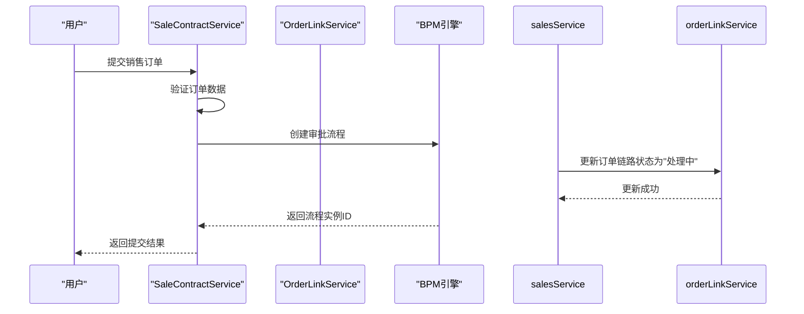
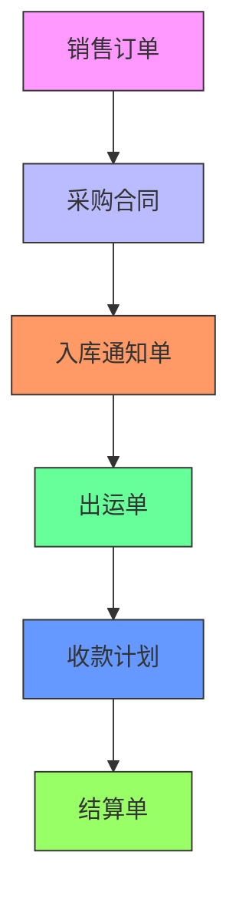

# 销售订单状态跟踪

<cite>
**本文档引用文件**   
- [SaleContractStatusEnum.java](file://eplus-framework/eplus-common/src/main/java/com/syj/eplus/framework/common/enums/SaleContractStatusEnum.java)
- [SaleContractServiceImpl.java](file://eplus-module-sms/eplus-module-sms-biz/src/main/java/com/syj/eplus/module/sms/service/salecontract/SaleContractServiceImpl.java)
- [SaleContractApi.java](file://eplus-module-sms/eplus-module-sms-api/src/main/java/com/syj/eplus/module/sms/api/SaleContractApi.java)
- [OrderLinkApi.java](file://eplus-module-infra/eplus-module-infra-api/src/main/java/com/syj/eplus/module/infra/api/orderlink/OrderLinkApi.java)
- [OrderLinkServiceImpl.java](file://eplus-module-infra/eplus-module-infra-biz/src/main/java/com/syj/eplus/module/infra/service/orderlink/OrderLinkServiceImpl.java)
</cite>

## 目录
1. [销售订单状态管理机制](#销售订单状态管理机制)
2. [销售订单状态转换条件与业务含义](#销售订单状态转换条件与业务含义)
3. [状态变更自动化处理逻辑](#状态变更自动化处理逻辑)
4. [销售订单状态查询与跟踪功能](#销售订单状态查询与跟踪功能)
5. [销售订单状态机图](#销售订单状态机图)
6. [异常状态处理流程与恢复机制](#异常状态处理流程与恢复机制)

## 销售订单状态管理机制

系统通过`SaleContractStatusEnum`枚举类定义了销售订单的全生命周期状态，实现了完整的状态管理机制。销售订单状态存储在数据库的`status`字段中，通过状态机模式控制状态转换。系统采用BPM流程引擎驱动状态变更，确保所有状态转换都经过适当的审批流程。

状态管理机制与订单链路（OrderLink）系统深度集成，当销售订单状态变更时，会自动更新订单链路中的状态信息，实现跨模块的状态同步。这种设计确保了销售订单在整个业务流程中的状态一致性。

**本文档引用文件**  
- [SaleContractStatusEnum.java](file://eplus-framework/eplus-common/src/main/java/com/syj/eplus/framework/common/enums/SaleContractStatusEnum.java)
- [SaleContractServiceImpl.java](file://eplus-module-sms/eplus-module-sms-biz/src/main/java/com/syj/eplus/module/sms/service/salecontract/SaleContractServiceImpl.java)

## 销售订单状态转换条件与业务含义

销售订单包含以下状态及其转换条件和业务含义：

- **待提交 (1)**：销售订单创建后的初始状态，表示订单已创建但尚未提交审批。在此状态下，用户可以编辑订单信息。

- **待审核 (2)**：订单已提交，等待审批流程处理。当用户提交订单时，状态从"待提交"转换为此状态。

- **待回签 (3)**：订单已通过审批，等待客户回签确认。当审批流程通过后，状态从"待审核"转换为此状态。

- **已驳回 (4)**：订单审批被拒绝。当审批流程被拒绝时，状态从"待审核"转换为此状态，用户需要修改后重新提交。

- **待采购 (5)**：订单已确认，需要生成采购计划。当订单从"待回签"状态确认后，或在变更流程中新增明细时，状态转换为此状态。

- **待出运 (6)**：采购已完成，等待出运安排。当采购流程完成后，状态从"待采购"转换为此状态。

- **已完成 (7)**：订单已完全履行，所有产品已出运。当所有产品完成出运后，状态转换为此状态。

- **已作废 (8)**：订单被取消或废弃。当订单被取消时，状态转换为此状态，表示订单不再有效。

状态转换由业务逻辑和审批流程共同控制，确保只有满足特定条件时才能进行状态变更。

**本文档引用文件**  
- [SaleContractStatusEnum.java](file://eplus-framework/eplus-common/src/main/java/com/syj/eplus/framework/common/enums/SaleContractStatusEnum.java)
- [SaleContractServiceImpl.java](file://eplus-module-sms/eplus-module-sms-biz/src/main/java/com/syj/eplus/module/sms/service/salecontract/SaleContractServiceImpl.java)

## 状态变更自动化处理逻辑

当销售订单状态变更时，系统会触发一系列自动化处理逻辑：

1. **通知机制**：状态变更时，系统会记录操作日志并通过BPM流程引擎通知相关人员。例如，当订单提交审批时，会创建审批任务并通知审批人。

2. **相关单据更新**：通过`OrderLinkApi`接口更新订单链路中相关单据的状态。例如，在`SaleContractServiceImpl`中，当订单提交时会调用`orderLinkApi.updateOrderLinkStatus`方法更新订单链路状态。



**图源**  
- [SaleContractServiceImpl.java](file://eplus-module-sms/eplus-module-sms-biz/src/main/java/com/syj/eplus/module/sms/service/salecontract/SaleContractServiceImpl.java#L678-L685)
- [OrderLinkServiceImpl.java](file://eplus-module-infra/eplus-module-infra-biz/src/main/java/com/syj/eplus/module/infra/service/orderlink/OrderLinkServiceImpl.java)

3. **库存锁定**：在订单创建或更新时，系统会根据销售明细自动锁定相应库存，防止超卖。

4. **影响范围处理**：当订单变更时，系统会评估变更对采购计划、出运计划等后续单据的影响，并相应更新这些单据的状态。

这些自动化处理逻辑确保了销售订单状态变更时，相关业务流程能够同步更新，保持数据一致性。

**本文档引用文件**  
- [SaleContractServiceImpl.java](file://eplus-module-sms/eplus-module-sms-biz/src/main/java/com/syj/eplus/module/sms/service/salecontract/SaleContractServiceImpl.java)
- [OrderLinkApi.java](file://eplus-module-infra/eplus-module-infra-api/src/main/java/com/syj/eplus/module/infra/api/orderlink/OrderLinkApi.java)

## 销售订单状态查询与跟踪功能

系统提供了全面的销售订单状态查询和跟踪功能：

1. **状态历史记录查看**：系统记录了销售订单的所有状态变更历史，包括变更时间、变更人和变更原因。通过操作日志功能，用户可以查看订单的完整生命周期。

2. **状态变更日志**：每次状态变更都会生成详细的变更日志，包括：
   - 变更前后的状态值
   - 变更操作人
   - 变更时间戳
   - 关联的审批流程信息

3. **订单链路跟踪**：通过`OrderLink`系统，用户可以查看销售订单在整个业务流程中的位置和状态。订单链路显示了销售订单与采购合同、出运单、收款计划等相关单据的关系。



**图源**  
- [OrderLinkServiceImpl.java](file://eplus-module-infra/eplus-module-infra-biz/src/main/java/com/syj/eplus/module/infra/service/orderlink/OrderLinkServiceImpl.java)
- [SaleContractServiceImpl.java](file://eplus-module-sms/eplus-module-sms-biz/src/main/java/com/syj/eplus/module/sms/service/salecontract/SaleContractServiceImpl.java)

4. **多维度查询**：系统支持按状态、客户、时间范围等多种条件查询销售订单，方便用户跟踪特定状态的订单。

5. **实时状态同步**：通过订单链路机制，销售订单的状态变更会实时同步到相关单据，确保所有关联方都能获取最新的订单状态。

这些功能共同构成了完整的销售订单跟踪体系，使用户能够全面了解订单的当前状态和历史轨迹。

**本文档引用文件**  
- [OrderLinkApi.java](file://eplus-module-infra/eplus-module-infra-api/src/main/java/com/syj/eplus/module/infra/api/orderlink/OrderLinkApi.java)
- [SaleContractApi.java](file://eplus-module-sms/eplus-module-sms-api/src/main/java/com/syj/eplus/module/sms/api/SaleContractApi.java)

## 销售订单状态机图

```mermaid
stateDiagram-v2
[*] --> 待提交
待提交 --> 待审核 : 提交审批
待审核 --> 待回签 : 审批通过
待审核 --> 已驳回 : 审批拒绝
已驳回 --> 待提交 : 修改后重新提交
待回签 --> 待采购 : 客户确认
待采购 --> 待出运 : 采购完成
待出运 --> 已完成 : 全部出运
待提交 --> 已作废 : 取消订单
待审核 --> 已作废 : 取消审批
待回签 --> 已作废 : 取消订单
待采购 --> 已作废 : 取消订单
待出运 --> 已作废 : 取消订单
state "已作废" as 已作废 {
[*] --> 已作废
}
state "已完成" as 已完成 {
[*] --> 已完成
}
```

**图源**  
- [SaleContractStatusEnum.java](file://eplus-framework/eplus-common/src/main/java/com/syj/eplus/framework/common/enums/SaleContractStatusEnum.java)
- [SaleContractServiceImpl.java](file://eplus-module-sms/eplus-module-sms-biz/src/main/java/com/syj/eplus/module/sms/service/salecontract/SaleContractServiceImpl.java)

该状态机图清晰展示了销售订单全生命周期的状态转换关系。每个状态转换都由特定的业务事件触发，如"提交审批"、"审批通过"等。系统通过BPM流程引擎确保状态转换的合规性，只有经过适当审批才能完成状态变更。已作废和已完成状态为终止状态，一旦进入这两个状态，订单将不能再进行其他状态转换。

## 异常状态处理流程与恢复机制

系统针对销售订单的异常状态提供了完善的处理流程和恢复机制：

1. **异常状态识别**：
   - 系统监控订单状态的异常转换，如跳过必要审批流程的状态变更
   - 检测长时间停留在某一状态的订单（如超过预定时间仍处于"待审核"状态）
   - 识别与业务规则冲突的状态组合

2. **处理流程**：
   - **已驳回状态处理**：当订单被驳回时，系统会通知创建人修改订单，并提供驳回原因。用户修改后可重新提交审批。
   - **已作废状态恢复**：对于误作废的订单，系统支持通过特定审批流程恢复。需要提交恢复申请，经相关负责人审批后才能将订单状态恢复到适当状态。
   - **状态不一致处理**：当发现订单状态与实际业务情况不符时，可通过"订单变更"功能调整状态，该操作需要经过严格审批。

3. **恢复机制**：
   - **数据回滚**：在状态变更失败或需要撤销时，系统支持回滚到之前的状态，包括恢复库存锁定等关联操作。
   - **手动干预**：对于系统无法自动处理的异常情况，管理员可以通过后台管理功能手动调整订单状态，但此操作会记录详细的审计日志。
   - **审批流程重置**：当审批流程异常中断时，可以重新启动审批流程，确保状态变更的合规性。

4. **监控与预警**：
   - 系统设置状态超时预警，当订单在某一状态停留时间超过阈值时，会自动通知相关人员
   - 提供异常状态报表，帮助管理人员及时发现和处理问题订单

这些机制确保了即使在异常情况下，销售订单的状态管理仍然可控、可追溯，最大限度地减少了业务中断的风险。

**本文档引用文件**  
- [SaleContractServiceImpl.java](file://eplus-module-sms/eplus-module-sms-biz/src/main/java/com/syj/eplus/module/sms/service/salecontract/SaleContractServiceImpl.java)
- [OrderLinkServiceImpl.java](file://eplus-module-infra/eplus-module-infra-biz/src/main/java/com/syj/eplus/module/infra/service/orderlink/OrderLinkServiceImpl.java)