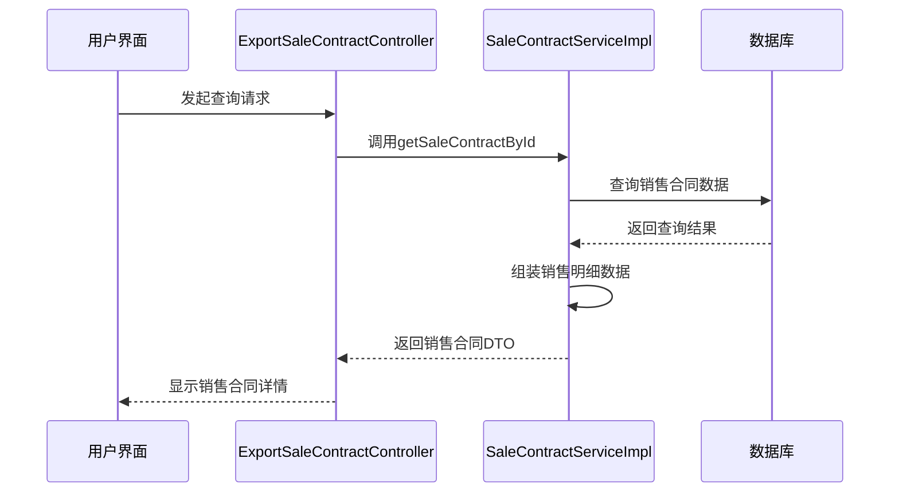
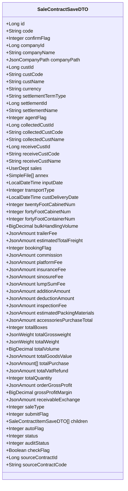
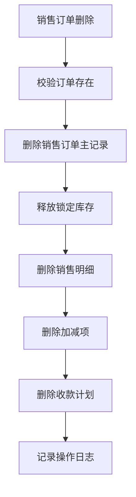
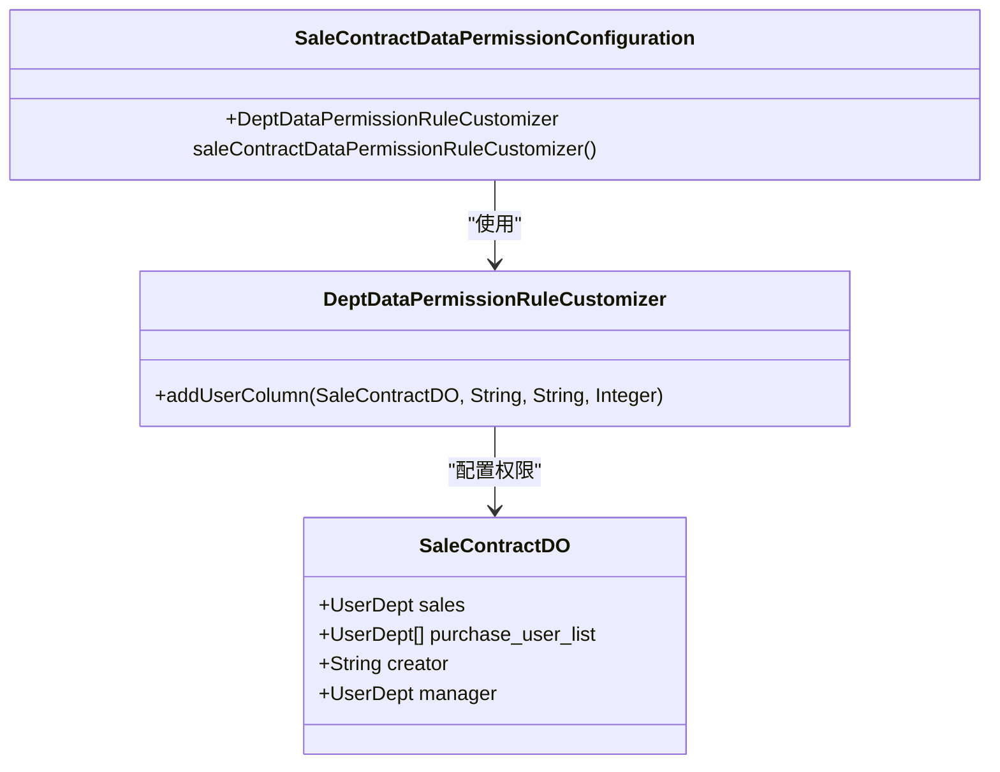

# 销售订单管理

<cite>
**本文档引用的文件**   
- [SaleContractApi.java](file://eplus-module-sms/eplus-module-sms-api/src/main/java/com/syj/eplus/module/sms/api/SaleContractApi.java)
- [SaleContractApiImpl.java](file://eplus-module-sms/eplus-module-sms-biz/src/main/java/com/syj/eplus/module/sms/api/SaleContractApiImpl.java)
- [SaleContractServiceImpl.java](file://eplus-module-sms/eplus-module-sms-biz/src/main/java/com/syj/eplus/module/sms/service/salecontract/SaleContractServiceImpl.java)
- [SaleContractSaveDTO.java](file://eplus-module-sms/eplus-module-sms-api/src/main/java/com/syj/eplus/module/sms/api/dto/SaleContractSaveDTO.java)
- [SaleContractDTO.java](file://eplus-module-sms/eplus-module-sms-api/src/main/java/com/syj/eplus/module/sms/api/dto/SaleContractDTO.java)
- [SaleContractDataPermissionConfiguration.java](file://eplus-module-sms/eplus-module-sms-biz/src/main/java/com/syj/eplus/module/sms/framework/config/SaleContractDataPermissionConfiguration.java)
- [SaleContractChangeDataPermissionConfiguration.java](file://eplus-module-sms/eplus-module-sms-biz/src/main/java/com/syj/eplus/module/sms/framework/config/SaleContractChangeDataPermissionConfiguration.java)
- [ExportSaleContractController.java](file://eplus-module-sms/eplus-module-sms-biz/src/main/java/com/syj/eplus/module/sms/controller/admin/salecontract/ExportSaleContractController.java)
- [DomesticSaleContractController.java](file://eplus-module-sms/eplus-module-sms-biz/src/main/java/com/syj/eplus/module/sms/controller/admin/salecontract/DomesticSaleContractController.java)
- [FactorySaleContractController.java](file://eplus-module-sms/eplus-module-sms-biz/src/main/java/com/syj/eplus/module/sms/controller/admin/salecontract/FactorySaleContractController.java)
</cite>

## 目录
1. [销售订单管理概述](#销售订单管理概述)
2. [销售订单查询与修改](#销售订单查询与修改)
3. [字段编辑规则](#字段编辑规则)
4. [联动更新机制](#联动更新机制)
5. [批量操作功能](#批量操作功能)
6. [数据权限控制策略](#数据权限控制策略)
7. [操作指南与最佳实践](#操作指南与最佳实践)

## 销售订单管理概述

销售订单管理功能是企业销售业务的核心模块，涵盖了销售订单的创建、查询、修改、删除等全生命周期管理。系统支持多种类型的销售合同，包括内销合同、外销合同和工厂销售合同，每种合同类型都有其特定的业务流程和审批机制。销售订单与出运计划、收款计划等其他单据存在紧密的联动关系，确保业务数据的一致性和完整性。系统通过灵活的数据权限配置，实现不同角色用户对销售订单的差异化操作权限，保障数据安全。

**Section sources**
- [SaleContractServiceImpl.java](file://eplus-module-sms/eplus-module-sms-biz/src/main/java/com/syj/eplus/module/sms/service/salecontract/SaleContractServiceImpl.java#L182-L184)
- [ExportSaleContractController.java](file://eplus-module-sms/eplus-module-sms-biz/src/main/java/com/syj/eplus/module/sms/controller/admin/salecontract/ExportSaleContractController.java#L1-L27)

## 销售订单查询与修改

销售订单的查询与修改功能通过`SaleContractApi`接口提供，支持根据销售合同编号、客户编号、产品编号等多种条件进行查询。核心的查询接口包括`getSaleContractById`用于根据ID获取销售合同详情，`getUnCompletedSaleContractByCustCode`用于获取指定客户未完成的销售合同列表。修改功能通过`updateSaleContract`方法实现，该方法接收`SaleContractSaveReqVO`对象作为参数，包含需要更新的销售合同信息。

**Diagram sources**
- [SaleContractServiceImpl.java](file://eplus-module-sms/eplus-module-sms-biz/src/main/java/com/syj/eplus/module/sms/service/salecontract/SaleContractServiceImpl.java#L50-L64)
- [SaleContractApiImpl.java](file://eplus-module-sms/eplus-module-sms-biz/src/main/java/com/syj/eplus/module/sms/api/SaleContractApiImpl.java#L50-L64)

**Section sources**
- [SaleContractApi.java](file://eplus-module-sms/eplus-module-sms-api/src/main/java/com/syj/eplus/module/sms/api/SaleContractApi.java#L21-L22)
- [SaleContractApiImpl.java](file://eplus-module-sms/eplus-module-sms-biz/src/main/java/com/syj/eplus/module/sms/api/SaleContractApiImpl.java#L50-L64)
- [SaleContractServiceImpl.java](file://eplus-module-sms/eplus-module-sms-biz/src/main/java/com/syj/eplus/module/sms/service/salecontract/SaleContractServiceImpl.java#L624-L686)

## 字段编辑规则

销售订单的字段编辑规则由业务逻辑和数据权限共同决定。可修改字段包括销售合同类型、客户信息、价格条款、收款方式、运输方式等业务相关字段。锁定不可更改的字段主要包括销售合同编号、录入日期、审核状态等关键标识性字段。字段的可编辑性还受到销售订单当前状态的影响，例如在“待审批”状态下的订单，部分字段可能被锁定以防止数据不一致。

**Diagram sources**
- [SaleContractSaveDTO.java](file://eplus-module-sms/eplus-module-sms-api/src/main/java/com/syj/eplus/module/sms/api/dto/SaleContractSaveDTO.java#L14-L422)

**Section sources**
- [SaleContractSaveDTO.java](file://eplus-module-sms/eplus-module-sms-api/src/main/java/com/syj/eplus/module/sms/api/dto/SaleContractSaveDTO.java#L14-L422)
- [SaleContractServiceImpl.java](file://eplus-module-sms/eplus-module-sms-biz/src/main/java/com/syj/eplus/module/sms/service/salecontract/SaleContractServiceImpl.java#L624-L686)

## 联动更新机制

销售订单与出运计划、收款计划等单据存在紧密的联动更新机制。当销售订单的状态发生变化时，系统会自动触发相关单据的更新。例如，当销售订单被删除时，系统会调用`stockApi.cancelStockLock`方法释放该订单锁定的库存，并删除相关的加减项和收款计划。销售订单的变更操作会生成变更单，通过`SaleContractChange`对象记录变更前后的差异，并根据配置决定是否需要走审批流程。

**Diagram sources**
- [SaleContractServiceImpl.java](file://eplus-module-sms/eplus-module-sms-biz/src/main/java/com/syj/eplus/module/sms/service/salecontract/SaleContractServiceImpl.java#L1590-L1608)

**Section sources**
- [SaleContractServiceImpl.java](file://eplus-module-sms/eplus-module-sms-biz/src/main/java/com/syj/eplus/module/sms/service/salecontract/SaleContractServiceImpl.java#L1590-L1608)
- [SaleContractApi.java](file://eplus-module-sms/eplus-module-sms-api/src/main/java/com/syj/eplus/module/sms/api/SaleContractApi.java#L243-L244)

## 批量操作功能

系统提供了丰富的批量操作功能，包括批量确认、批量关闭等。`SaleContractApi`接口中的`batchUpdateAddSubItem`方法支持批量更新加减项，`batchUpdateBillStatus`方法支持批量更新入库状态。批量操作通过接收集合类型的参数实现，提高了数据处理的效率。对于批量确认和关闭操作，系统通常会遍历订单列表，对每个订单执行相应的状态更新逻辑，并记录操作日志。

**Section sources**
- [SaleContractApi.java](file://eplus-module-sms/eplus-module-sms-api/src/main/java/com/syj/eplus/module/sms/api/SaleContractApi.java#L37-L38)
- [SaleContractApi.java](file://eplus-module-sms/eplus-module-sms-api/src/main/java/com/syj/eplus/module/sms/api/SaleContractApi.java#L137-L138)

## 数据权限控制策略

销售订单的数据权限控制策略通过`SaleContractDataPermissionConfiguration`类实现。系统为不同用户角色配置了差异化的操作权限，例如销售人员只能查看和操作自己负责的销售订单，采购人员只能查看和操作与自己相关的采购信息。权限控制基于`DeptDataPermissionRuleCustomizer`规则，通过`addUserColumn`方法为`SaleContractDO`类添加用户列权限，支持单用户、JSON包含、FIND_IN_SET等多种权限类型。

**Diagram sources**
- [SaleContractDataPermissionConfiguration.java](file://eplus-module-sms/eplus-module-sms-biz/src/main/java/com/syj/eplus/module/sms/framework/config/SaleContractDataPermissionConfiguration.java#L14-L21)

**Section sources**
- [SaleContractDataPermissionConfiguration.java](file://eplus-module-sms/eplus-module-sms-biz/src/main/java/com/syj/eplus/module/sms/framework/config/SaleContractDataPermissionConfiguration.java#L14-L21)
- [SaleContractChangeDataPermissionConfiguration.java](file://eplus-module-sms/eplus-module-sms-biz/src/main/java/com/syj/eplus/module/sms/framework/config/SaleContractChangeDataPermissionConfiguration.java#L13-L18)

## 操作指南与最佳实践

在进行销售订单管理时，建议遵循以下最佳实践：首先，在创建销售订单时，确保所有必填字段都已正确填写，并通过`checkItemCost`方法校验子项成本；其次，在修改销售订单时，注意变更字段是否需要走审批流程，避免直接修改关键字段；最后，在删除销售订单前，确认该订单未与其他业务单据产生关联，防止数据不一致。对于批量操作，建议先在测试环境中验证操作逻辑，再应用于生产环境。

**Section sources**
- [SaleContractServiceImpl.java](file://eplus-module-sms/eplus-module-sms-biz/src/main/java/com/syj/eplus/module/sms/service/salecontract/SaleContractServiceImpl.java#L274-L465)
- [SaleContractServiceImpl.java](file://eplus-module-sms/eplus-module-sms-biz/src/main/java/com/syj/eplus/module/sms/service/salecontract/SaleContractServiceImpl.java#L624-L686)
- [SaleContractServiceImpl.java](file://eplus-module-sms/eplus-module-sms-biz/src/main/java/com/syj/eplus/module/sms/service/salecontract/SaleContractServiceImpl.java#L1590-L1608)