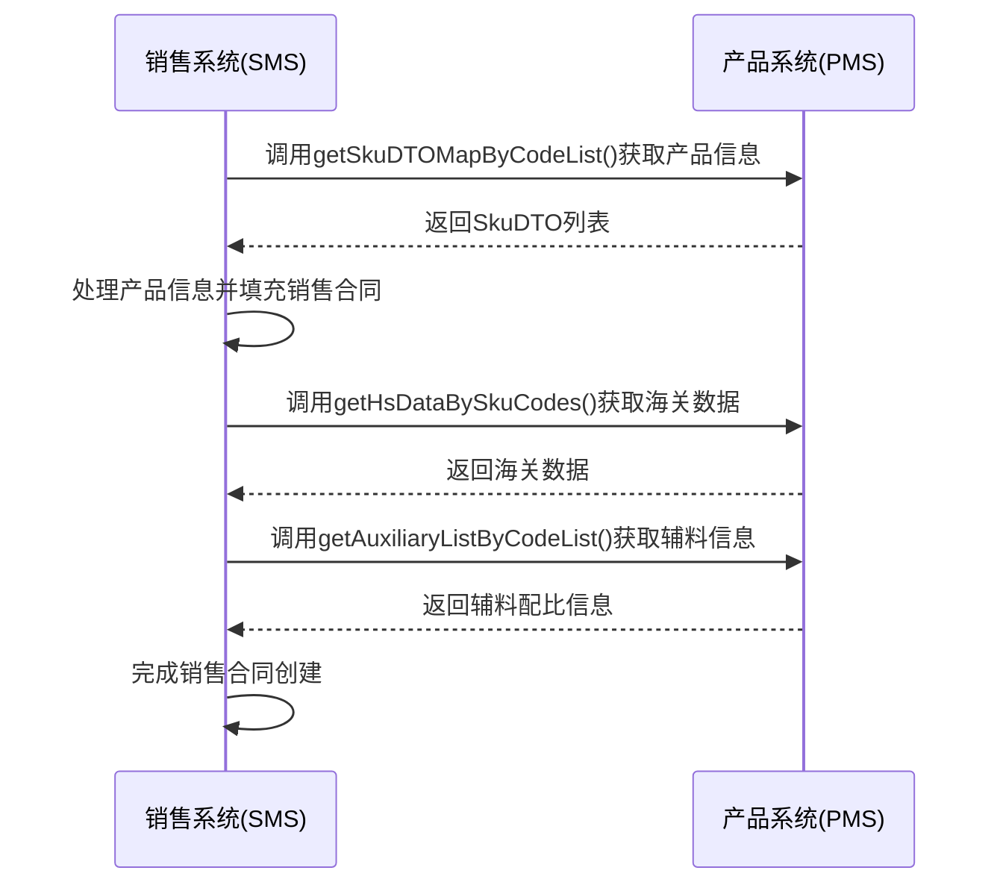
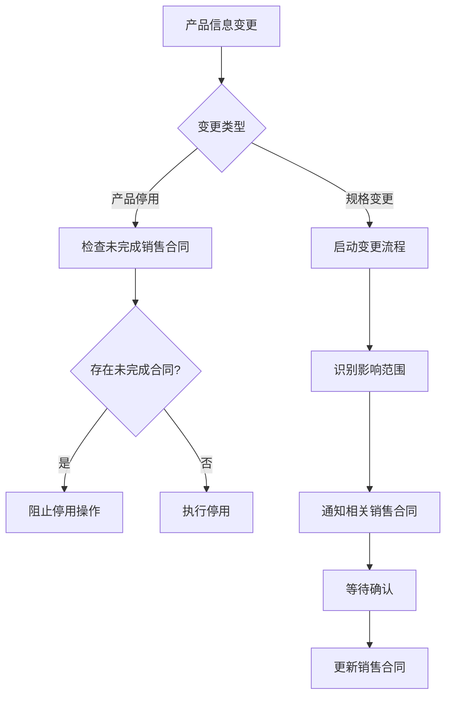
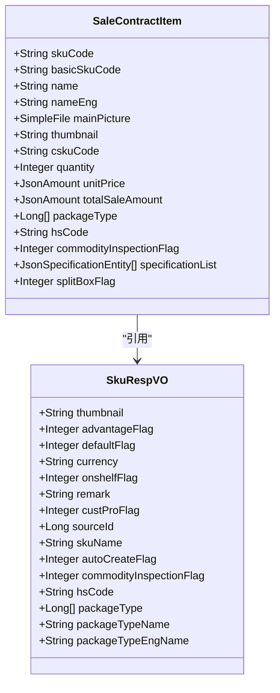
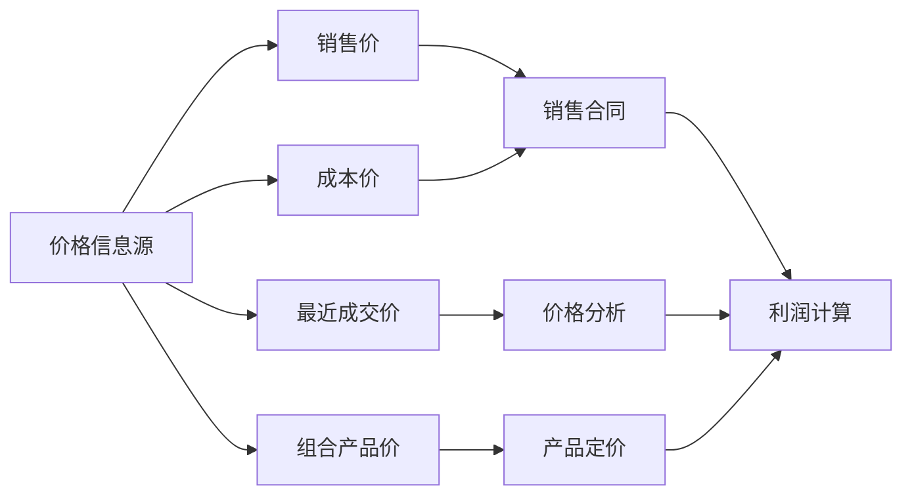
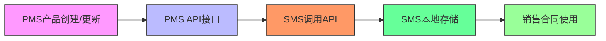
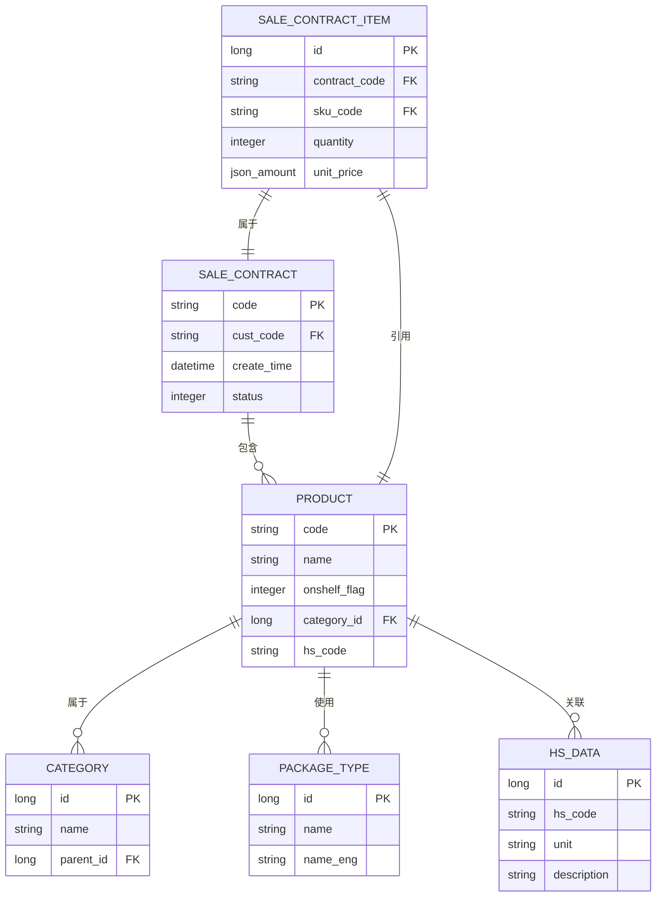

# 销售与产品集成

<cite>
**本文档引用文件**   
- [SaleContractApi.java](file://eplus-module-sms/eplus-module-sms-api/src/main/java/com/syj/eplus/module/sms/api/SaleContractApi.java)
- [SkuApi.java](file://eplus-module-pms/eplus-module-pms-api/src/main/java/com/syj/eplus/module/pms/api/sku/SkuApi.java)
- [SaleContractItem.java](file://eplus-module-sms/eplus-module-sms-biz/src/main/java/com/syj/eplus/module/sms/dal/dataobject/salecontractitem/SaleContractItem.java)
- [SkuServiceImpl.java](file://eplus-module-pms/eplus-module-pms-biz/src/main/java/com/syj/eplus/module/pms/service/sku/SkuServiceImpl.java)
- [SaleContractServiceImpl.java](file://eplus-module-sms/eplus-module-sms-biz/src/main/java/com/syj/eplus/module/sms/service/salecontract/SaleContractServiceImpl.java)
- [ErrorCodeConstants.java](file://eplus-module-pms/eplus-module-pms-api/src/main/java/com/syj/eplus/module/pms/enums/ErrorCodeConstants.java)
- [V1_0_0_002__Eplus初始化.sql](file://eplus-flyway/src/main/resources/db/migration/common/V1_0_0_002__Eplus初始化.sql)
</cite>

## 目录
1. [引言](#引言)
2. [销售合同创建时的产品信息获取](#销售合同创建时的产品信息获取)
3. [产品变更对销售合同的影响](#产品变更对销售合同的影响)
4. [销售合同中产品信息的展示逻辑](#销售合同中产品信息的展示逻辑)
5. [产品价格信息在销售中的应用](#产品价格信息在销售中的应用)
6. [产品信息从PMS到SMS的数据流](#产品信息从pms到sms的数据流)
7. [关键集成规则](#关键集成规则)
8. [常见问题及解决方案](#常见问题及解决方案)
9. [结论](#结论)

## 引言
本文档全面介绍销售模块(SMS)与产品管理系统(PMS)之间的数据协同机制。重点阐述销售合同创建时如何获取产品信息，产品变更对销售合同的影响，以及产品价格信息在销售中的应用。文档还包含集成数据流图、关键集成规则和常见问题解决方案，为系统集成提供全面的技术指导。

## 销售合同创建时的产品信息获取

当创建销售合同时，系统需要从产品管理系统(PMS)获取完整的产品信息。销售模块通过调用PMS提供的API接口获取产品基础资料、规格型号、包装方式等数据。

销售合同明细表(sms_sale_contract_item)中存储了从PMS获取的产品信息，包括产品编号(skuCode)、基础产品编号(basicSkuCode)、中文品名(name)、英文品名(nameEng)、客户货号(cskuCode)、数量(quantity)、销售单价(unitPrice)、产品状态(onshelfFlag)、包装方式(packageType)、HS编码(hsCode)等关键字段。



**Diagram sources**
- [SaleContractApi.java](file://eplus-module-sms/eplus-module-sms-api/src/main/java/com/syj/eplus/module/sms/api/SaleContractApi.java)
- [SkuApi.java](file://eplus-module-pms/eplus-module-pms-api/src/main/java/com/syj/eplus/module/pms/api/sku/SkuApi.java)

**Section sources**
- [SaleContractApi.java](file://eplus-module-sms/eplus-module-sms-api/src/main/java/com/syj/eplus/module/sms/api/SaleContractApi.java)
- [SkuApi.java](file://eplus-module-pms/eplus-module-pms-api/src/main/java/com/syj/eplus/module/pms/api/sku/SkuApi.java)

## 产品变更对销售合同的影响

当产品信息发生变更时，系统需要评估变更对现有销售合同的影响，并采取相应的处理策略。产品状态变更（如产品停用）和规格变更都会对销售合同产生影响。

产品停用时，系统会检查是否存在未完成的销售合同。如果存在，系统会阻止产品停用操作，并提示"产品已在审核流程中,禁止修改"。对于规格变更，系统会启动变更流程，影响范围包括所有使用该产品的销售合同。



**Diagram sources**
- [SkuServiceImpl.java](file://eplus-module-pms/eplus-module-pms-biz/src/main/java/com/syj/eplus/module/pms/service/sku/SkuServiceImpl.java)
- [SaleContractServiceImpl.java](file://eplus-module-sms/eplus-module-sms-biz/src/main/java/com/syj/eplus/module/sms/service/salecontract/SaleContractServiceImpl.java)

**Section sources**
- [SkuServiceImpl.java](file://eplus-module-pms/eplus-module-pms-biz/src/main/java/com/syj/eplus/module/pms/service/sku/SkuServiceImpl.java)
- [SaleContractServiceImpl.java](file://eplus-module-sms/eplus-module-sms-biz/src/main/java/com/syj/eplus/module/sms/service/salecontract/SaleContractServiceImpl.java)

## 销售合同中产品信息的展示逻辑

销售合同中产品信息的展示支持多维度产品属性查看。系统通过SkuRespVO对象封装产品信息，包括产品名称(skuName)、缩略图(thumbnail)、产品状态(onshelfFlag)、是否优势产品(advantageFlag)、币种(currency)、备注(remark)、客户产品标识(custProFlag)、来源id(sourceId)、是否商检(commodityInspectionFlag)、HS编码(hsCode)等属性。

展示逻辑通过以下方式实现：
1. 从PMS获取完整的产品信息
2. 根据用户权限过滤敏感信息
3. 按照预定义的模板格式化显示
4. 支持中英文双语显示



**Diagram sources**
- [SkuRespVO.java](file://eplus-module-pms/eplus-module-pms-biz/src/main/java/com/syj/eplus/module/pms/controller/admin/sku/vo/SkuRespVO.java)
- [SaleContractItem.java](file://eplus-module-sms/eplus-module-sms-biz/src/main/java/com/syj/eplus/module/sms/dal/dataobject/salecontractitem/SaleContractItem.java)

**Section sources**
- [SkuRespVO.java](file://eplus-module-pms/eplus-module-pms-biz/src/main/java/com/syj/eplus/module/pms/controller/admin/sku/vo/SkuRespVO.java)
- [SaleContractItem.java](file://eplus-module-sms/eplus-module-sms-biz/src/main/java/com/syj/eplus/module/sms/dal/dataobject/salecontractitem/SaleContractItem.java)

## 产品价格信息在销售中的应用

产品价格信息在销售过程中起着关键作用，包括成本价、销售价的获取与显示。系统通过多种方式获取和计算价格信息：

1. **销售价获取**：从销售合同明细中的unitPrice字段获取
2. **成本价获取**：从purchaseUnitPrice、realPurchaseWithTaxPrice等字段获取
3. **最近成交价**：通过saleContractApi.getHistoryTradeList()接口获取历史交易价格
4. **组合产品价格**：通过skuApi.getCombSkuPrice()接口计算组合产品价格

价格信息的应用场景包括：
- 销售合同创建时的价格引用
- 利润计算和毛利率分析
- 价格对比和历史趋势分析
- 采购价格谈判参考



**Diagram sources**
- [SkuApi.java](file://eplus-module-pms/eplus-module-pms-api/src/main/java/com/syj/eplus/module/pms/api/sku/SkuApi.java)
- [SaleContractApi.java](file://eplus-module-sms/eplus-module-sms-api/src/main/java/com/syj/eplus/module/sms/api/SaleContractApi.java)

**Section sources**
- [SkuApi.java](file://eplus-module-pms/eplus-module-pms-api/src/main/java/com/syj/eplus/module/pms/api/sku/SkuApi.java)
- [SaleContractApi.java](file://eplus-module-sms/eplus-module-sms-api/src/main/java/com/syj/eplus/module/sms/api/SaleContractApi.java)

## 产品信息从PMS到SMS的数据流

产品信息从产品管理系统(PMS)到销售模块(SMS)的传递路径如下：

1. 产品信息在PMS中创建或更新
2. PMS系统通过API接口提供产品信息
3. SMS系统调用PMS的API获取产品信息
4. SMS系统将产品信息存储在本地数据库
5. 销售合同创建时使用本地存储的产品信息



**Diagram sources**
- [SkuApi.java](file://eplus-module-pms/eplus-module-pms-api/src/main/java/com/syj/eplus/module/pms/api/sku/SkuApi.java)
- [SaleContractApi.java](file://eplus-module-sms/eplus-module-sms-api/src/main/java/com/syj/eplus/module/sms/api/SaleContractApi.java)

**Section sources**
- [SkuApi.java](file://eplus-module-pms/eplus-module-pms-api/src/main/java/com/syj/eplus/module/pms/api/sku/SkuApi.java)
- [SaleContractApi.java](file://eplus-module-sms/eplus-module-sms-api/src/main/java/com/syj/eplus/module/sms/api/SaleContractApi.java)

## 关键集成规则

### 产品状态校验
系统在创建销售合同时会校验产品状态，确保只允许使用已上架(onshelfFlag=1)的产品。如果产品处于审核中或已停用状态，系统会阻止销售合同创建。

```java
// 伪代码示例
if (skuDO.getOnshelfFlag() != 1) {
    throw exception(SKU_NOT_APPROVED);
}
```

### 产品分类映射
系统通过categoryService实现产品分类的树形结构管理，支持多级分类映射。分类信息用于产品归类和统计分析。

### 数据缓存策略
系统采用多级缓存策略提高性能：
1. 本地缓存：使用Guava Cache实现
2. 分布式缓存：使用Redis实现
3. 缓存更新：通过事件驱动机制实时更新



**Diagram sources**
- [V1_0_0_002__Eplus初始化.sql](file://eplus-flyway/src/main/resources/db/migration/common/V1_0_0_002__Eplus初始化.sql)
- [SkuServiceImpl.java](file://eplus-module-pms/eplus-module-pms-biz/src/main/java/com/syj/eplus/module/pms/service/sku/SkuServiceImpl.java)

**Section sources**
- [V1_0_0_002__Eplus初始化.sql](file://eplus-flyway/src/main/resources/db/migration/common/V1_0_0_002__Eplus初始化.sql)
- [SkuServiceImpl.java](file://eplus-module-pms/eplus-module-pms-biz/src/main/java/com/syj/eplus/module/pms/service/sku/SkuServiceImpl.java)

## 常见问题及解决方案

### 产品信息不同步
**问题描述**：PMS中更新的产品信息未及时同步到SMS系统。

**解决方案**：
1. 检查API调用是否成功
2. 验证缓存更新机制是否正常工作
3. 手动触发数据同步

```java
// 解决方案代码示例
public void forceSyncProductInfo(String skuCode) {
    // 清除本地缓存
    cacheService.evict("sku:" + skuCode);
    // 重新获取产品信息
    SkuDTO skuDTO = skuApi.getSkuDTOMapByCodeList(Collections.singletonList(skuCode)).get(skuCode);
    // 更新本地数据
    updateLocalProductInfo(skuDTO);
}
```

### 产品已停用仍可销售
**问题描述**：产品在PMS中已停用，但在SMS中仍可创建销售合同。

**解决方案**：
1. 加强产品状态校验
2. 在销售合同创建流程中增加产品状态检查
3. 实现实时状态同步

```java
// 解决方案代码示例
private void validateProductStatus(String skuCode) {
    SkuDTO skuDTO = skuApi.getSkuDTOMapByCodeList(Collections.singletonList(skuCode)).get(skuCode);
    if (skuDTO == null || skuDTO.getOnshelfFlag() != 1) {
        throw exception(SKU_NOT_APPROVED);
    }
}
```

### 其他常见问题
1. **包装方式不存在**：错误码PACKAGE_TYPE_NOT_EXISTS，解决方案是先在PMS中创建包装方式
2. **产品编号已存在**：错误码SKU_CODE_EXIST，解决方案是使用唯一的产品编号
3. **客户产品已存在**：错误码CUST_SKU_CREATE_EXIST，解决方案是检查客户产品是否存在

**Section sources**
- [ErrorCodeConstants.java](file://eplus-module-pms/eplus-module-pms-api/src/main/java/com/syj/eplus/module/pms/enums/ErrorCodeConstants.java)
- [SkuServiceImpl.java](file://eplus-module-pms/eplus-module-pms-biz/src/main/java/com/syj/eplus/module/pms/service/sku/SkuServiceImpl.java)

## 结论
销售与产品管理系统的集成通过API接口实现数据协同，确保了产品信息在两个系统间的一致性。系统通过严格的状态校验、数据缓存和错误处理机制，保障了集成的稳定性和可靠性。未来可进一步优化实时同步机制，提高数据一致性。