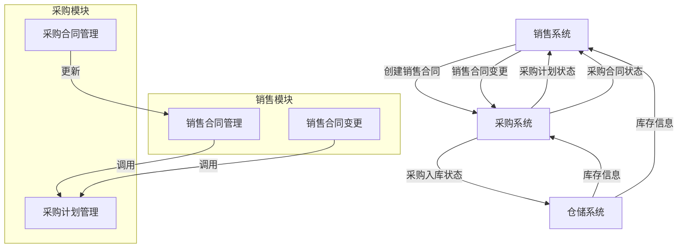

# 销售与采购集成

<cite>
**本文档引用的文件**  
- [SaleContractApi.java](file://eplus-module-sms/eplus-module-sms-api/src/main/java/com/syj/eplus/module/sms/api/SaleContractApi.java)
- [PurchaseContractApi.java](file://eplus-module-scm/eplus-module-scm-api/src/main/java/com/syj/eplus/module/scm/api/purchasecontract/PurchaseContractApi.java)
- [PurchasePlanApi.java](file://eplus-module-scm/eplus-module-scm-api/src/main/java/com/syj/eplus/module/scm/api/purchaseplan/PurchasePlanApi.java)
- [SaleAuxiliaryAllocationApi.java](file://eplus-module-sms/eplus-module-sms-api/src/main/java/com/syj/eplus/module/sms/api/SaleAuxiliaryAllocationApi.java)
- [SaleContractServiceImpl.java](file://eplus-module-sms/eplus-module-sms-biz/src/main/java/com/syj/eplus/module/sms/service/salecontract/SaleContractServiceImpl.java)
- [PurchaseContractServiceImpl.java](file://eplus-module-scm/eplus-module-scm-biz/src/main/java/com/syj/eplus/module/scm/service/purchasecontract/PurchaseContractServiceImpl.java)
- [PurchasePlanItemDO.java](file://eplus-module-scm/eplus-module-scm-biz/src/main/java/com/syj/eplus/module/scm/dal/dataobject/purchaseplanitem/PurchasePlanItemDO.java)
- [PurchaseContractItemAndContractInfoRespVO.java](file://eplus-module-scm/eplus-module-scm-biz/src/main/java/com/syj/eplus/module/scm/controller/admin/purchasecontractitem/vo/PurchaseContractItemAndContractInfoRespVO.java)
- [V1_0_0_360__采购计划明细表增加作废标识.java](file://eplus-flyway/src/main/java/db/migration/common/V1_0_0_360__采购计划明细表增加作废标识.java)
- [V1_0_0_474__采购合同增加最低备品比例和乙方补货时限.java](file://eplus-flyway/src/main/java/db/migration/common/V1_0_0_474__采购合同增加最低备品比例和乙方补货时限.java)
</cite>

## 目录
1. [引言](#引言)
2. [销售需求驱动采购计划创建](#销售需求驱动采购计划创建)
3. [销售合同变更对采购计划的影响](#销售合同变更对采购计划的影响)
4. [采购进度反馈机制](#采购进度反馈机制)
5. [销售驱动采购的业务规则](#销售驱动采购的业务规则)
6. [集成架构与数据流](#集成架构与数据流)
7. [关键集成点](#关键集成点)
8. [常见问题及解决方案](#常见问题及解决方案)
9. [结论](#结论)

## 引言
本文档全面介绍销售模块与采购管理系统之间的协同机制。重点阐述销售需求如何驱动采购计划的生成，销售合同变更如何影响采购计划调整，以及采购进度如何反馈给销售系统。文档详细说明了销售与采购集成的业务流程、数据交互机制和关键业务规则，并提供集成架构图和常见问题解决方案。

## 销售需求驱动采购计划创建

销售与采购集成的核心是销售需求驱动采购计划的创建。当销售合同确认后，系统根据销售明细中的产品、数量和交期要求，自动生成相应的采购计划。

### 采购需求传递
销售合同确认后，系统通过`SaleContractApi`接口获取销售合同信息，并将销售明细作为采购需求传递给采购系统。采购系统通过`PurchasePlanApi.createPurchasePlan`接口接收采购需求并创建采购计划。

### 采购数量计算
采购数量的计算基于销售合同中的需求数量，并考虑库存锁定情况。在`SaleContractServiceImpl`中，系统计算待采购数量（needPurQuantity）：
```java
int purchaseQuantity = quantity - realLockQuantity;
s.setNeedPurQuantity(purchaseQuantity);
```
其中，realLockQuantity为已锁定的库存数量，quantity为销售需求数量。

### 交期匹配
采购计划中的交期与销售合同的交期相匹配。在`PurchasePlanItemDO`中，采购计划明细包含交期字段，确保采购交期满足销售需求。

**本节来源**
- [SaleContractServiceImpl.java](file://eplus-module-sms/eplus-module-sms-biz/src/main/java/com/syj/eplus/module/sms/service/salecontract/SaleContractServiceImpl.java#L2545-L2554)
- [PurchasePlanApi.java](file://eplus-module-scm/eplus-module-scm-api/src/main/java/com/syj/eplus/module/scm/api/purchaseplan/PurchasePlanApi.java#L16)
- [PurchasePlanItemDO.java](file://eplus-module-scm/eplus-module-scm-biz/src/main/java/com/syj/eplus/module/scm/dal/dataobject/purchaseplanitem/PurchasePlanItemDO.java#L126-L130)

## 销售合同变更对采购计划的影响

销售合同变更会直接影响已生成的采购计划，系统需要相应调整采购计划以适应变更。

### 采购计划调整
当销售合同发生变更时，系统通过`SaleContractChange`对象记录变更内容，并相应调整采购计划。在`SaleContractServiceImpl`中，系统处理销售合同变更：
```java
if (CollUtil.isNotEmpty(cancelPurchasePlanItemIdList)&&cancelPurchasePlanItemIdList.contains(s.getId())){
    s.setConvertPurchaseFlag(BooleanEnum.NO.getValue());
}
```
如果销售明细被取消，则设置转采购标识为否，防止生成无效的采购计划。

### 重新生成采购计划
对于新增的销售明细，系统会重新生成采购计划。通过`PurchasePlanApi.createPurchasePlan`接口，系统为新增的销售需求创建新的采购计划。

**本节来源**
- [SaleContractServiceImpl.java](file://eplus-module-sms/eplus-module-sms-biz/src/main/java/com/syj/eplus/module/sms/service/salecontract/SaleContractServiceImpl.java#L2551-L2553)
- [V1_0_0_360__采购计划明细表增加作废标识.java](file://eplus-flyway/src/main/java/db/migration/common/V1_0_0_360__采购计划明细表增加作废标识.java#L13-L15)
- [PurchasePlanApi.java](file://eplus-module-scm/eplus-module-scm-api/src/main/java/com/syj/eplus/module/scm/api/purchaseplan/PurchasePlanApi.java#L16)

## 采购进度反馈机制

采购进度信息需要实时反馈给销售系统，以便销售团队了解采购状态和预计到货时间。

### 采购合同状态反馈
采购合同的状态变更会实时同步到销售系统。通过`PurchaseContractApi.updatePurchaseItem`接口，系统更新采购合同明细的入库状态：
```java
Boolean updatePurchaseItem(Long saleContractId, Long purchaseContractId, List<String> purchaseItemUniqueCodeList, Integer purchaseItemBillStatus, Map<String,Integer> wmsBillMap,Map<String, Integer> diffBillQuantity);
```

### 预计到货时间反馈
采购合同中的交期信息反映了预计到货时间。在`PurchaseContractItemAndContractInfoRespVO`中，包含交期字段：
```java
@Schema(description = "交期")
private Integer delivery;
```
销售系统可以查询采购合同的交期信息，了解预计到货时间。

**本节来源**
- [PurchaseContractApi.java](file://eplus-module-scm/eplus-module-scm-api/src/main/java/com/syj/eplus/module/scm/api/purchasecontract/PurchaseContractApi.java#L157)
- [PurchaseContractItemAndContractInfoRespVO.java](file://eplus-module-scm/eplus-module-scm-biz/src/main/java/com/syj/eplus/module/scm/controller/admin/purchasecontractitem/vo/PurchaseContractItemAndContractInfoRespVO.java#L472-L475)

## 销售驱动采购的业务规则

销售驱动采购的业务流程遵循一系列业务规则，确保采购活动符合业务要求。

### 最小采购量
采购计划需要满足供应商的最小起购量（MOQ）要求。在`QuoteItemPageReqVO`中，包含最小起购量字段：
```java
@Schema(description = "最小起购量")
private Integer moq;
```

### 采购提前期
采购提前期是采购计划的重要考虑因素。交期字段反映了采购提前期要求，确保采购能够按时完成。

### 供应商匹配
采购计划需要匹配合适的供应商。在`PurchasePlanItemDO`中，包含供应商信息：
```java
private Long venderId;
private String venderCode;
```
系统根据销售需求和供应商能力进行匹配。

**本节来源**
- [QuoteItemPageReqVO.java](file://eplus-module-scm/eplus-module-scm-biz/src/main/java/com/syj/eplus/module/scm/controller/admin/quoteitem/vo/QuoteItemPageReqVO.java#L69)
- [PurchasePlanItemDO.java](file://eplus-module-scm/eplus-module-scm-biz/src/main/java/com/syj/eplus/module/scm/dal/dataobject/purchaseplanitem/PurchasePlanItemDO.java#L147-L152)

## 集成架构与数据流

销售与采购系统的集成通过API接口实现，确保数据的实时同步和业务流程的顺畅。



**图表来源**
- [SaleContractApi.java](file://eplus-module-sms/eplus-module-sms-api/src/main/java/com/syj/eplus/module/sms/api/SaleContractApi.java)
- [PurchaseContractApi.java](file://eplus-module-scm/eplus-module-scm-api/src/main/java/com/syj/eplus/module/scm/api/purchasecontract/PurchaseContractApi.java)
- [PurchasePlanApi.java](file://eplus-module-scm/eplus-module-scm-api/src/main/java/com/syj/eplus/module/scm/api/purchaseplan/PurchasePlanApi.java)

## 关键集成点

销售与采购集成的关键集成点确保了系统的协同工作。

### 采购计划来源标识
采购计划的来源通过`planSourceType`字段标识，区分不同的采购计划来源：
```java
@Schema(description = "采购计划来源方式")
private Integer planSourceType;
```

### 采购与销售合同关联关系
采购合同与销售合同通过唯一标识进行关联。在`PurchaseContractApi`中，提供了根据销售合同编号获取采购合同的接口：
```java
Map<String, PurchaseContractAllDTO> getPurchaseByCodeList(List<String> codeList);
```

### 数据同步频率
系统采用实时同步机制，确保销售与采购数据的一致性。当销售合同状态变更时，立即触发采购计划的更新。

**本节来源**
- [PurchaseContractRespVO.java](file://eplus-module-scm/eplus-module-scm-biz/src/main/java/com/syj/eplus/module/scm/controller/admin/purchasecontract/vo/PurchaseContractRespVO.java#L426-L427)
- [PurchaseContractApi.java](file://eplus-module-scm/eplus-module-scm-api/src/main/java/com/syj/eplus/module/scm/api/purchasecontract/PurchaseContractApi.java#L51)

## 常见问题及解决方案

### 采购延迟影响销售出运
**问题**：采购延迟导致无法按时出运，影响客户交付。
**解决方案**：建立采购预警机制，当采购交期临近但未完成时，系统自动提醒采购人员和销售团队，提前协调解决方案。

### 采购数量与销售需求不匹配
**问题**：采购数量与销售需求不一致，导致库存积压或缺货。
**解决方案**：在采购计划生成时，系统自动校验采购数量与销售需求的匹配性。当销售合同变更时，立即调整采购计划，确保数量一致。

### 采购合同变更未同步到销售系统
**问题**：采购合同变更后，销售系统未及时更新，导致信息不一致。
**解决方案**：建立采购合同变更的自动通知机制，当采购合同状态变更时，通过API接口实时同步到销售系统。

**本节来源**
- [PurchaseContractServiceImpl.java](file://eplus-module-scm/eplus-module-scm-biz/src/main/java/com/syj/eplus/module/scm/service/purchasecontract/PurchaseContractServiceImpl.java#L2299-L2317)
- [V1_0_0_474__采购合同增加最低备品比例和乙方补货时限.java](file://eplus-flyway/src/main/java/db/migration/common/V1_0_0_474__采购合同增加最低备品比例和乙方补货时限.java#L13-L14)

## 结论
销售与采购集成是企业供应链管理的关键环节。通过建立完善的集成机制，实现销售需求与采购计划的无缝对接，确保采购活动能够及时响应销售变化。系统通过API接口实现数据的实时同步，遵循最小采购量、采购提前期等业务规则，确保采购活动的合规性。通过建立采购预警和变更通知机制，有效解决采购延迟、数量不匹配等问题，提升供应链的整体效率和客户满意度。