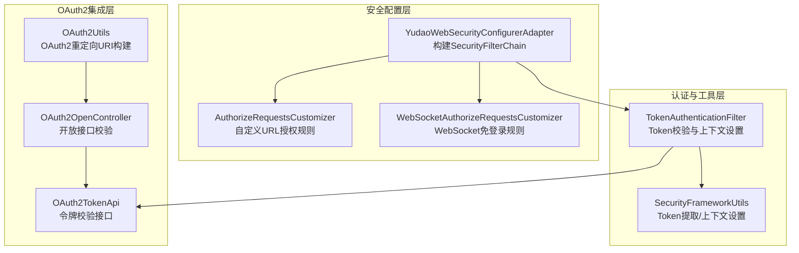
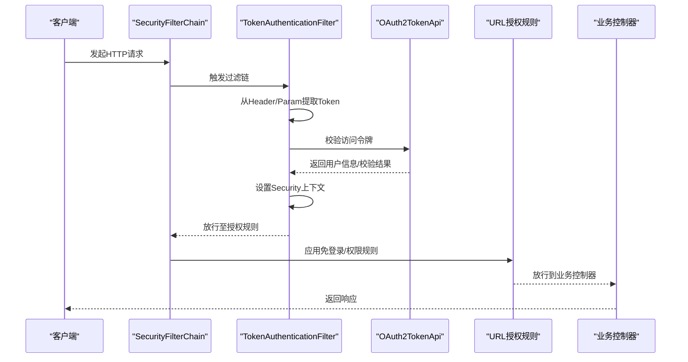
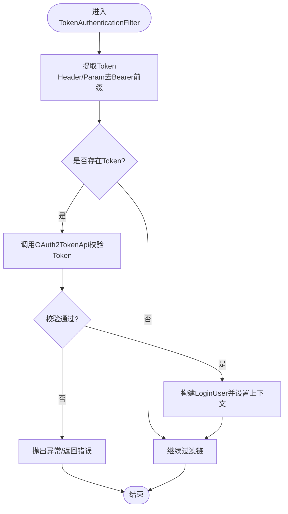
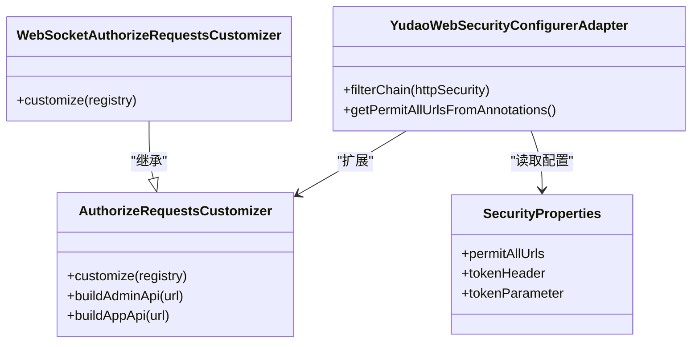
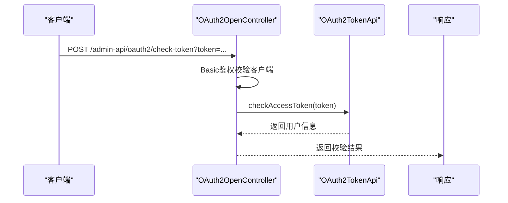
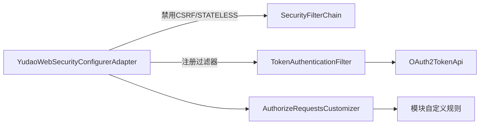

# API CSRF防护

<cite>
**本文引用的文件列表**
- [YudaoWebSecurityConfigurerAdapter.java](file://yudao-framework/yudao-spring-boot-starter-security/src/main/java/cn/iocoder/yudao/framework/security/config/YudaoWebSecurityConfigurerAdapter.java)
- [SecurityProperties.java](file://yudao-framework/yudao-spring-boot-starter-security/src/main/java/cn/iocoder/yudao/framework/security/config/SecurityProperties.java)
- [TokenAuthenticationFilter.java](file://yudao-framework/yudao-spring-boot-starter-security/src/main/java/cn/iocoder/yudao/framework/security/core/filter/TokenAuthenticationFilter.java)
- [SecurityFrameworkUtils.java](file://yudao-framework/yudao-spring-boot-starter-security/src/main/java/cn/iocoder/yudao/framework/security/core/util/SecurityFrameworkUtils.java)
- [AuthorizeRequestsCustomizer.java](file://yudao-framework/yudao-spring-boot-starter-security/src/main/java/cn/iocoder/yudao/framework/security/config/AuthorizeRequestsCustomizer.java)
- [WebSocketAuthorizeRequestsCustomizer.java](file://yudao-framework/yudao-spring-boot-starter-websocket/src/main/java/cn/iocoder/yudao/framework/websocket/core/security/WebSocketAuthorizeRequestsCustomizer.java)
- [SecurityConfiguration.java](file://yudao-module-infra/yudao-module-infra-biz/src/main/java/cn/iocoder/yudao/module/infra/framework/security/config/SecurityConfiguration.java)
- [OAuth2TokenApi.java](file://yudao-module-system/yudao-module-system-api/src/main/java/cn/iocoder/yudao/module/system/api/oauth2/OAuth2TokenApi.java)
- [OAuth2AccessTokenCheckRespDTO.java](file://yudao-module-system/yudao-module-system-api/src/main/java/cn/iocoder/yudao/module/system/api/oauth2/dto/OAuth2AccessTokenCheckRespDTO.java)
- [OAuth2OpenController.java](file://yudao-module-system/yudao-module-system-biz/src/main/java/cn/iocoder/yudao/module/system/controller/admin/oauth2/OAuth2OpenController.java)
- [OAuth2Utils.java](file://yudao-module-system/yudao-module-system-biz/src/main/java/cn/iocoder/yudao/module/system/util/oauth2/OAuth2Utils.java)
</cite>

## 目录
1. [简介](#简介)
2. [项目结构](#项目结构)
3. [核心组件](#核心组件)
4. [架构总览](#架构总览)
5. [详细组件分析](#详细组件分析)
6. [依赖关系分析](#依赖关系分析)
7. [性能考量](#性能考量)
8. [故障排查指南](#故障排查指南)
9. [结论](#结论)
10. [附录](#附录)

## 简介
本文件面向RESTful API场景，系统性说明如何在基于Token的无状态认证体系中实现CSRF防护。文档结合仓库中的Spring Security与Token认证实现，阐述：
- 为什么在无状态API中通常禁用CSRF
- 如何通过Token认证与URL白名单/注解免登录机制实现安全边界
- 如何为特定API端点配置“例外”（permitAll）的正确方式
- 如何与OAuth2、JWT等认证机制集成
- 针对CSRF防护的测试策略与安全审计要点

## 项目结构
本项目采用模块化分层设计，安全相关能力集中在yudao-framework的安全启动器与系统模块的OAuth2实现中：
- 安全配置与过滤链：YudaoWebSecurityConfigurerAdapter负责构建SecurityFilterChain，禁用CSRF并启用基于Token的认证过滤器
- Token认证过滤器：TokenAuthenticationFilter从请求中提取并校验Token，将用户信息写入Security上下文
- 安全工具：SecurityFrameworkUtils提供从请求中提取Token、设置当前用户等通用能力
- OAuth2集成：系统模块提供OAuth2 Token API与控制器，支持令牌校验与开放接口

图表来源
- [YudaoWebSecurityConfigurerAdapter.java](file://yudao-framework/yudao-spring-boot-starter-security/src/main/java/cn/iocoder/yudao/framework/security/config/YudaoWebSecurityConfigurerAdapter.java#L99-L145)
- [TokenAuthenticationFilter.java](file://yudao-framework/yudao-spring-boot-starter-security/src/main/java/cn/iocoder/yudao/framework/security/core/filter/TokenAuthenticationFilter.java#L41-L69)
- [AuthorizeRequestsCustomizer.java](file://yudao-framework/yudao-spring-boot-starter-security/src/main/java/cn/iocoder/yudao/framework/security/config/AuthorizeRequestsCustomizer.java#L17-L36)
- [WebSocketAuthorizeRequestsCustomizer.java](file://yudao-framework/yudao-spring-boot-starter-websocket/src/main/java/cn/iocoder/yudao/framework/websocket/core/security/WebSocketAuthorizeRequestsCustomizer.java#L14-L24)
- [OAuth2TokenApi.java](file://yudao-module-system/yudao-module-system-api/src/main/java/cn/iocoder/yudao/module/system/api/oauth2/OAuth2TokenApi.java#L1-L49)
- [OAuth2OpenController.java](file://yudao-module-system/yudao-module-system-biz/src/main/java/cn/iocoder/yudao/module/system/controller/admin/oauth2/OAuth2OpenController.java#L167-L190)
- [OAuth2Utils.java](file://yudao-module-system/yudao-module-system-biz/src/main/java/cn/iocoder/yudao/module/system/util/oauth2/OAuth2Utils.java#L1-L103)

章节来源
- [YudaoWebSecurityConfigurerAdapter.java](file://yudao-framework/yudao-spring-boot-starter-security/src/main/java/cn/iocoder/yudao/framework/security/config/YudaoWebSecurityConfigurerAdapter.java#L99-L145)
- [TokenAuthenticationFilter.java](file://yudao-framework/yudao-spring-boot-starter-security/src/main/java/cn/iocoder/yudao/framework/security/core/filter/TokenAuthenticationFilter.java#L41-L69)

## 核心组件
- 安全过滤链与CSRF策略
  - 在SecurityFilterChain中明确禁用CSRF，理由是基于Token的无状态认证不需要Session，从而天然规避了CSRF风险
  - 同时设置Session策略为STATELESS，确保API无会话状态
- Token认证过滤器
  - 从请求头或查询参数中提取Token，调用OAuth2TokenApi校验Token有效性
  - 将解析后的用户信息写入Security上下文，供后续业务逻辑使用
- URL免登录与例外配置
  - 支持通过注解@PermitAll自动收集URL并免认证
  - 支持配置yudao.security.permitAllUrls进行集中免登录
  - 支持按模块扩展AuthorizeRequestsCustomizer定制规则
- OAuth2集成
  - 提供OAuth2TokenApi接口与实现，支持创建、校验、移除、刷新访问令牌
  - 提供开放接口校验访问令牌的控制器，便于第三方或内部服务校验

章节来源
- [YudaoWebSecurityConfigurerAdapter.java](file://yudao-framework/yudao-spring-boot-starter-security/src/main/java/cn/iocoder/yudao/framework/security/config/YudaoWebSecurityConfigurerAdapter.java#L99-L145)
- [TokenAuthenticationFilter.java](file://yudao-framework/yudao-spring-boot-starter-security/src/main/java/cn/iocoder/yudao/framework/security/core/filter/TokenAuthenticationFilter.java#L41-L93)
- [SecurityProperties.java](file://yudao-framework/yudao-spring-boot-starter-security/src/main/java/cn/iocoder/yudao/framework/security/config/SecurityProperties.java#L17-L46)
- [AuthorizeRequestsCustomizer.java](file://yudao-framework/yudao-spring-boot-starter-security/src/main/java/cn/iocoder/yudao/framework/security/config/AuthorizeRequestsCustomizer.java#L17-L36)
- [OAuth2TokenApi.java](file://yudao-module-system/yudao-module-system-api/src/main/java/cn/iocoder/yudao/module/system/api/oauth2/OAuth2TokenApi.java#L1-L49)
- [OAuth2OpenController.java](file://yudao-module-system/yudao-module-system-biz/src/main/java/cn/iocoder/yudao/module/system/controller/admin/oauth2/OAuth2OpenController.java#L167-L190)

## 架构总览
下图展示CSRF防护在无状态API中的整体工作流：请求进入后先经过Token认证过滤器，校验通过后将用户信息写入上下文；随后由URL授权规则决定是否放行；最后业务控制器基于上下文执行权限控制。

图表来源
- [YudaoWebSecurityConfigurerAdapter.java](file://yudao-framework/yudao-spring-boot-starter-security/src/main/java/cn/iocoder/yudao/framework/security/config/YudaoWebSecurityConfigurerAdapter.java#L142-L145)
- [TokenAuthenticationFilter.java](file://yudao-framework/yudao-spring-boot-starter-security/src/main/java/cn/iocoder/yudao/framework/security/core/filter/TokenAuthenticationFilter.java#L41-L93)
- [OAuth2TokenApi.java](file://yudao-module-system/yudao-module-system-api/src/main/java/cn/iocoder/yudao/module/system/api/oauth2/OAuth2TokenApi.java#L22-L30)

## 详细组件分析

### CSRF禁用与无状态API
- 在SecurityFilterChain中显式禁用CSRF，原因是本项目采用基于Token的无状态认证，不依赖Session，天然避免了CSRF攻击面
- 同时设置SessionCreationPolicy为STATELESS，确保API始终无会话状态

章节来源
- [YudaoWebSecurityConfigurerAdapter.java](file://yudao-framework/yudao-spring-boot-starter-security/src/main/java/cn/iocoder/yudao/framework/security/config/YudaoWebSecurityConfigurerAdapter.java#L100-L112)

### Token认证过滤器
- 提取Token：优先从Header（默认Authorization）提取，其次从查询参数（默认token），并去除Bearer前缀
- 校验Token：调用OAuth2TokenApi.checkAccessToken，成功则构建LoginUser并写入Security上下文
- 异常处理：捕获异常并通过全局异常处理器统一返回，避免泄露内部错误

图表来源
- [TokenAuthenticationFilter.java](file://yudao-framework/yudao-spring-boot-starter-security/src/main/java/cn/iocoder/yudao/framework/security/core/filter/TokenAuthenticationFilter.java#L41-L93)
- [SecurityFrameworkUtils.java](file://yudao-framework/yudao-spring-boot-starter-security/src/main/java/cn/iocoder/yudao/framework/security/core/util/SecurityFrameworkUtils.java#L31-L52)

章节来源
- [TokenAuthenticationFilter.java](file://yudao-framework/yudao-spring-boot-starter-security/src/main/java/cn/iocoder/yudao/framework/security/core/filter/TokenAuthenticationFilter.java#L41-L119)
- [SecurityFrameworkUtils.java](file://yudao-framework/yudao-spring-boot-starter-security/src/main/java/cn/iocoder/yudao/framework/security/core/util/SecurityFrameworkUtils.java#L31-L118)

### URL免登录与例外配置
- 注解扫描：自动收集带有@PermitAll注解的URL，按HTTP方法分别映射为免登录
- 配置项：支持yudao.security.permitAllUrls集中配置免登录URL
- 模块扩展：通过AuthorizeRequestsCustomizer抽象类，各模块可自定义授权规则
- WebSocket：WebSocketAuthorizeRequestsCustomizer提供WebSocket路径免登录

图表来源
- [YudaoWebSecurityConfigurerAdapter.java](file://yudao-framework/yudao-spring-boot-starter-security/src/main/java/cn/iocoder/yudao/framework/security/config/YudaoWebSecurityConfigurerAdapter.java#L115-L195)
- [AuthorizeRequestsCustomizer.java](file://yudao-framework/yudao-spring-boot-starter-security/src/main/java/cn/iocoder/yudao/framework/security/config/AuthorizeRequestsCustomizer.java#L17-L36)
- [WebSocketAuthorizeRequestsCustomizer.java](file://yudao-framework/yudao-spring-boot-starter-websocket/src/main/java/cn/iocoder/yudao/framework/websocket/core/security/WebSocketAuthorizeRequestsCustomizer.java#L14-L24)
- [SecurityProperties.java](file://yudao-framework/yudao-spring-boot-starter-security/src/main/java/cn/iocoder/yudao/framework/security/config/SecurityProperties.java#L17-L46)

章节来源
- [YudaoWebSecurityConfigurerAdapter.java](file://yudao-framework/yudao-spring-boot-starter-security/src/main/java/cn/iocoder/yudao/framework/security/config/YudaoWebSecurityConfigurerAdapter.java#L115-L195)
- [AuthorizeRequestsCustomizer.java](file://yudao-framework/yudao-spring-boot-starter-security/src/main/java/cn/iocoder/yudao/framework/security/config/AuthorizeRequestsCustomizer.java#L17-L36)
- [WebSocketAuthorizeRequestsCustomizer.java](file://yudao-framework/yudao-spring-boot-starter-websocket/src/main/java/cn/iocoder/yudao/framework/websocket/core/security/WebSocketAuthorizeRequestsCustomizer.java#L14-L24)
- [SecurityConfiguration.java](file://yudao-module-infra/yudao-module-infra-biz/src/main/java/cn/iocoder/yudao/module/infra/framework/security/config/SecurityConfiguration.java#L23-L48)

### OAuth2与JWT兼容性
- OAuth2开放接口：提供/check-token开放端点，用于校验访问令牌的有效性
- JWT集成：SecurityFrameworkUtils使用Bearer前缀约定，与JWT标准一致
- 令牌校验：TokenAuthenticationFilter通过OAuth2TokenApi.checkAccessToken完成令牌校验，返回用户信息

图表来源
- [OAuth2OpenController.java](file://yudao-module-system/yudao-module-system-biz/src/main/java/cn/iocoder/yudao/module/system/controller/admin/oauth2/OAuth2OpenController.java#L167-L190)
- [OAuth2TokenApi.java](file://yudao-module-system/yudao-module-system-api/src/main/java/cn/iocoder/yudao/module/system/api/oauth2/OAuth2TokenApi.java#L22-L30)
- [OAuth2AccessTokenCheckRespDTO.java](file://yudao-module-system/yudao-module-system-api/src/main/java/cn/iocoder/yudao/module/system/api/oauth2/dto/OAuth2AccessTokenCheckRespDTO.java#L1-L33)
- [OAuth2Utils.java](file://yudao-module-system/yudao-module-system-biz/src/main/java/cn/iocoder/yudao/module/system/util/oauth2/OAuth2Utils.java#L1-L103)

章节来源
- [OAuth2OpenController.java](file://yudao-module-system/yudao-module-system-biz/src/main/java/cn/iocoder/yudao/module/system/controller/admin/oauth2/OAuth2OpenController.java#L167-L190)
- [OAuth2TokenApi.java](file://yudao-module-system/yudao-module-system-api/src/main/java/cn/iocoder/yudao/module/system/api/oauth2/OAuth2TokenApi.java#L1-L49)
- [OAuth2AccessTokenCheckRespDTO.java](file://yudao-module-system/yudao-module-system-api/src/main/java/cn/iocoder/yudao/module/system/api/oauth2/dto/OAuth2AccessTokenCheckRespDTO.java#L1-L33)
- [OAuth2Utils.java](file://yudao-module-system/yudao-module-system-biz/src/main/java/cn/iocoder/yudao/module/system/util/oauth2/OAuth2Utils.java#L1-L103)

## 依赖关系分析
- CSRF禁用与Token认证的耦合：禁用CSRF的前提是无Session，Token认证负责替代传统表单CSRF防护
- URL授权规则与模块扩展：通过AuthorizeRequestsCustomizer实现模块化授权规则，避免在核心适配器中硬编码
- OAuth2集成：TokenAuthenticationFilter依赖OAuth2TokenApi进行令牌校验，形成认证与授权的闭环

图表来源
- [YudaoWebSecurityConfigurerAdapter.java](file://yudao-framework/yudao-spring-boot-starter-security/src/main/java/cn/iocoder/yudao/framework/security/config/YudaoWebSecurityConfigurerAdapter.java#L99-L145)
- [TokenAuthenticationFilter.java](file://yudao-framework/yudao-spring-boot-starter-security/src/main/java/cn/iocoder/yudao/framework/security/core/filter/TokenAuthenticationFilter.java#L41-L93)
- [AuthorizeRequestsCustomizer.java](file://yudao-framework/yudao-spring-boot-starter-security/src/main/java/cn/iocoder/yudao/framework/security/config/AuthorizeRequestsCustomizer.java#L17-L36)

章节来源
- [YudaoWebSecurityConfigurerAdapter.java](file://yudao-framework/yudao-spring-boot-starter-security/src/main/java/cn/iocoder/yudao/framework/security/config/YudaoWebSecurityConfigurerAdapter.java#L99-L145)
- [TokenAuthenticationFilter.java](file://yudao-framework/yudao-spring-boot-starter-security/src/main/java/cn/iocoder/yudao/framework/security/core/filter/TokenAuthenticationFilter.java#L41-L93)
- [AuthorizeRequestsCustomizer.java](file://yudao-framework/yudao-spring-boot-starter-security/src/main/java/cn/iocoder/yudao/framework/security/config/AuthorizeRequestsCustomizer.java#L17-L36)

## 性能考量
- Token认证开销：每次请求均需调用OAuth2TokenApi进行令牌校验，建议配合缓存与合理的令牌过期策略降低延迟
- 过滤链顺序：TokenAuthenticationFilter位于UsernamePasswordAuthenticationFilter之前，避免不必要的认证开销
- 例外配置：合理使用@PermitAll与yudao.security.permitAllUrls减少鉴权判断，提升热点接口性能

[本节为通用指导，不涉及具体文件分析]

## 故障排查指南
- 令牌无效或过期
  - 现象：TokenAuthenticationFilter抛出异常并被全局异常处理器拦截
  - 排查：确认Token来源（Header/Param）、Bearer前缀、OAuth2TokenApi.checkAccessToken返回值
- 无用户上下文
  - 现象：业务控制器无法获取当前用户
  - 排查：确认TokenAuthenticationFilter已成功设置Security上下文；检查SecurityFrameworkUtils.setLoginUser调用
- URL未放行
  - 现象：免登录URL仍要求认证
  - 排查：确认@PermitAll注解是否被扫描；yudao.security.permitAllUrls配置是否正确；模块扩展AuthorizeRequestsCustomizer是否生效

章节来源
- [TokenAuthenticationFilter.java](file://yudao-framework/yudao-spring-boot-starter-security/src/main/java/cn/iocoder/yudao/framework/security/core/filter/TokenAuthenticationFilter.java#L41-L119)
- [SecurityFrameworkUtils.java](file://yudao-framework/yudao-spring-boot-starter-security/src/main/java/cn/iocoder/yudao/framework/security/core/util/SecurityFrameworkUtils.java#L92-L118)
- [YudaoWebSecurityConfigurerAdapter.java](file://yudao-framework/yudao-spring-boot-starter-security/src/main/java/cn/iocoder/yudao/framework/security/config/YudaoWebSecurityConfigurerAdapter.java#L115-L195)

## 结论
- 在无状态API中，禁用CSRF是合理且必要的选择，因为Token认证天然规避了CSRF风险
- 通过TokenAuthenticationFilter与OAuth2集成，实现了可靠的认证与授权闭环
- 通过注解与配置项的组合，提供了灵活的URL免登录与例外配置能力
- 建议在开放接口中提供/check-token等校验端点，便于外部系统进行令牌校验

[本节为总结性内容，不涉及具体文件分析]

## 附录

### 最佳实践清单
- 仅在需要表单提交且依赖Session的场景启用CSRF保护；无状态API一律禁用
- 使用Bearer前缀传递JWT/OAuth2令牌，保持与SecurityFrameworkUtils约定一致
- 对热点公开接口使用@PermitAll或yudao.security.permitAllUrls集中免登录
- 为开放接口提供/check-token等校验端点，便于第三方系统校验令牌
- 严格限制WebSocket等特殊路径的免登录范围，必要时单独扩展AuthorizeRequestsCustomizer

[本节为通用指导，不涉及具体文件分析]

### 测试策略与安全审计要点
- 单元测试
  - 验证TokenAuthenticationFilter在存在/缺失Token时的行为
  - 验证OAuth2TokenApi.checkAccessToken返回空时的异常处理
- 集成测试
  - 验证@PermitAll注解URL免登录生效
  - 验证yudao.security.permitAllUrls配置的URL免登录生效
  - 验证/check-token开放接口的校验逻辑
- 安全审计
  - 审核免登录URL集合，确保仅包含必要接口
  - 审核WebSocket免登录范围，防止扩大攻击面
  - 审核Token来源（Header/Param）与Bearer前缀处理逻辑

[本节为通用指导，不涉及具体文件分析]