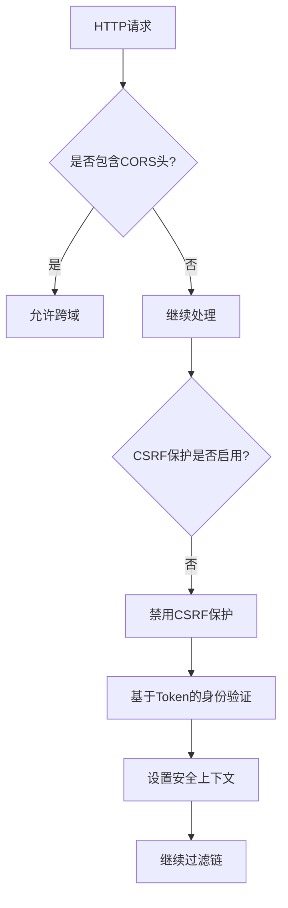
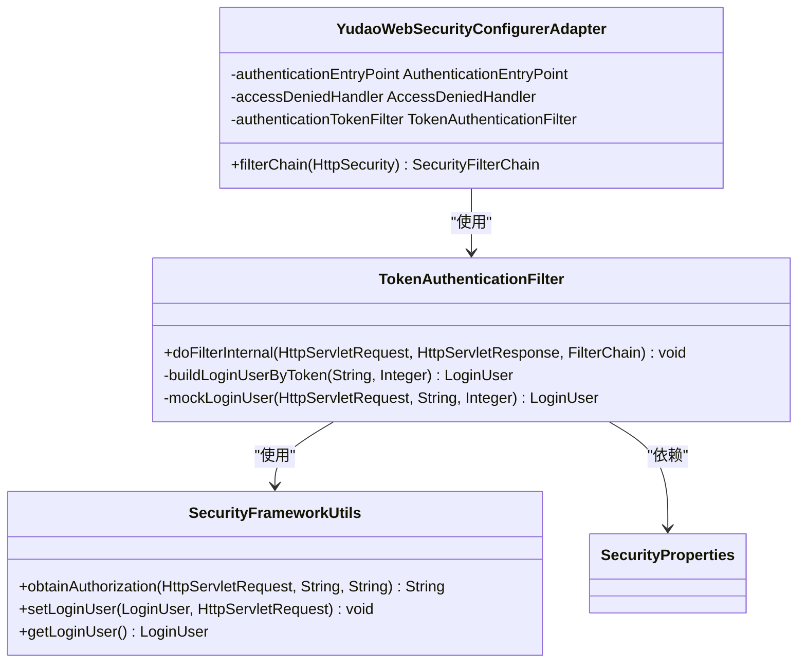
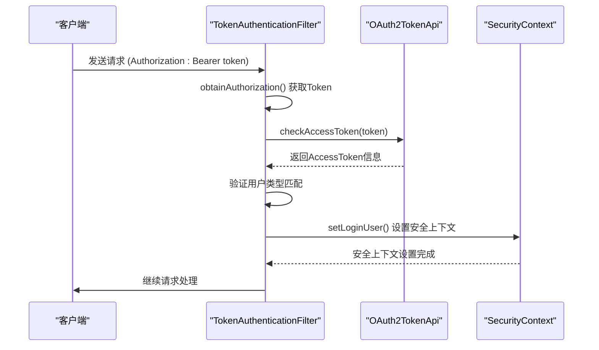
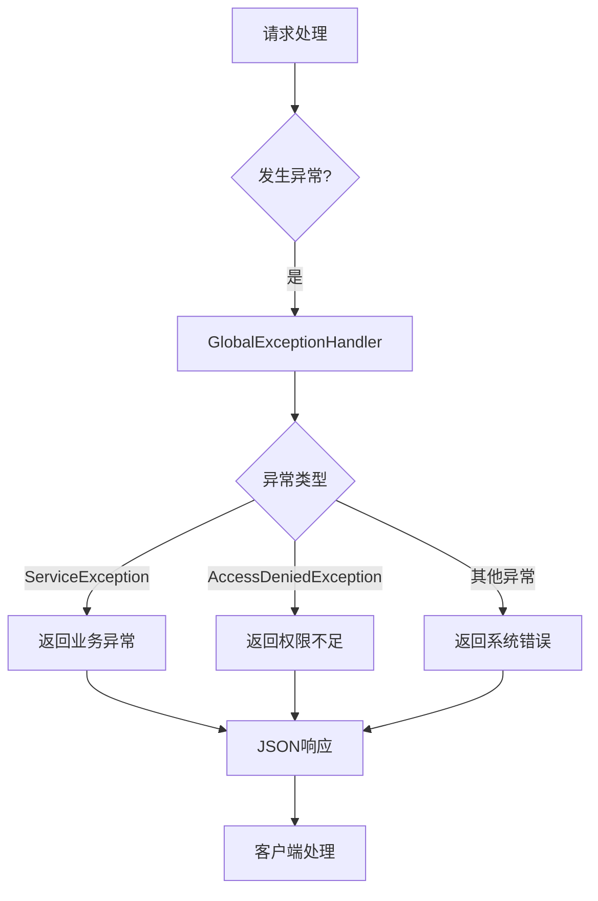

# CSRF令牌验证

<cite>
**本文档引用的文件**  
- [YudaoWebSecurityConfigurerAdapter.java](file://yudao-framework/yudao-spring-boot-starter-security/src/main/java/cn/iocoder/yudao/framework/security/config/YudaoWebSecurityConfigurerAdapter.java)
- [TokenAuthenticationFilter.java](file://yudao-framework/yudao-spring-boot-starter-security/src/main/java/cn/iocoder/yudao/framework/security/core/filter/TokenAuthenticationFilter.java)
- [SecurityFrameworkUtils.java](file://yudao-framework/yudao-spring-boot-starter-security/src/main/java/cn/iocoder/yudao/framework/security/core/util/SecurityFrameworkUtils.java)
- [SecurityProperties.java](file://yudao-framework/yudao-spring-boot-starter-security/src/main/java/cn/iocoder/yudao/framework/security/config/SecurityProperties.java)
</cite>

## 目录
1. [引言](#引言)
2. [CSRF令牌机制概述](#csrf令牌机制概述)
3. [Spring Security中的CSRF配置](#spring-security中的csrf配置)
4. [基于Token的无状态安全架构](#基于token的无状态安全架构)
5. [令牌生成与验证流程](#令牌生成与验证流程)
6. [令牌生命周期管理](#令牌生命周期管理)
7. [表单与AJAX请求中的令牌使用](#表单与ajax请求中的令牌使用)
8. [CSRF验证失败处理](#csrf验证失败处理)
9. [调试CSRF问题的实用技巧](#调试csrf问题的实用技巧)
10. [结论](#结论)

## 引言
本文档详细说明了在eplus-admin-server项目中CSRF（跨站请求伪造）防护机制的实现原理。通过分析Spring Security框架的配置和相关代码，阐述了系统如何通过基于Token的无状态安全架构来防止CSRF攻击。文档涵盖了CSRF令牌的生成、验证、存储机制，以及在实际开发中如何正确使用和调试CSRF防护功能。

## CSRF令牌机制概述
CSRF（Cross-Site Request Forgery）是一种常见的Web安全漏洞，攻击者通过伪装成合法用户向服务器发送恶意请求。传统的CSRF防护机制依赖于服务器端存储的会话（Session）和同步令牌（Synchronizer Token Pattern），但在现代无状态、基于Token的认证架构中，这种机制不再适用。

本项目采用基于JWT（JSON Web Token）的认证机制，完全摒弃了传统的Session管理，因此CSRF防护策略也相应调整。系统通过禁用Spring Security默认的CSRF保护，并采用基于Token的身份验证机制来实现安全防护。

## Spring Security中的CSRF配置
在本项目中，CSRF保护被显式禁用，这是基于系统的无状态架构设计决策。



**图示来源**  
- [YudaoWebSecurityConfigurerAdapter.java](file://yudao-framework/yudao-spring-boot-starter-security/src/main/java/cn/iocoder/yudao/framework/security/config/YudaoWebSecurityConfigurerAdapter.java#L104-L106)

### CSRF禁用配置
在`YudaoWebSecurityConfigurerAdapter`类中，通过调用`.csrf().disable()`方法显式禁用了CSRF保护：

```java
httpSecurity
    // 开启跨域
    .cors().and()
    // CSRF 禁用，因为不使用 Session
    .csrf().disable()
    // 基于 token 机制，所以不需要 Session
    .sessionManagement().sessionCreationPolicy(SessionCreationPolicy.STATELESS).and()
```

**本节来源**  
- [YudaoWebSecurityConfigurerAdapter.java](file://yudao-framework/yudao-spring-boot-starter-security/src/main/java/cn/iocoder/yudao/framework/security/config/YudaoWebSecurityConfigurerAdapter.java#L104-L108)

## 基于Token的无状态安全架构
系统采用基于Token的无状态安全架构，这从根本上消除了CSRF攻击的风险。

### 架构设计原理
在传统的基于Session的Web应用中，服务器会为每个用户维护一个会话状态，浏览器通过Cookie自动携带会话ID。这种机制容易受到CSRF攻击，因为攻击者可以诱导用户在已认证的状态下发送恶意请求。

而在本项目的无状态架构中：
1. 服务器不维护任何会话状态
2. 认证信息完全由客户端在每次请求中通过Token提供
3. Token通常通过Authorization头传递，而不是通过Cookie
4. 浏览器不会自动携带Authorization头，从而防止了CSRF攻击

### 安全配置分析
系统通过以下配置实现了无状态安全架构：



**图示来源**  
- [YudaoWebSecurityConfigurerAdapter.java](file://yudao-framework/yudao-spring-boot-starter-security/src/main/java/cn/iocoder/yudao/framework/security/config/YudaoWebSecurityConfigurerAdapter.java)
- [TokenAuthenticationFilter.java](file://yudao-framework/yudao-spring-boot-starter-security/src/main/java/cn/iocoder/yudao/framework/security/core/filter/TokenAuthenticationFilter.java)
- [SecurityFrameworkUtils.java](file://yudao-framework/yudao-spring-boot-starter-security/src/main/java/cn/iocoder/yudao/framework/security/core/util/SecurityFrameworkUtils.java)

## 令牌生成与验证流程
虽然系统禁用了传统的CSRF令牌机制，但仍然需要验证请求的合法性。这一过程通过Token认证过滤器实现。

### 令牌验证流程


**图示来源**  
- [TokenAuthenticationFilter.java](file://yudao-framework/yudao-spring-boot-starter-security/src/main/java/cn/iocoder/yudao/framework/security/core/filter/TokenAuthenticationFilter.java#L40-L68)
- [SecurityFrameworkUtils.java](file://yudao-framework/yudao-spring-boot-starter-security/src/main/java/cn/iocoder/yudao/framework/security/core/util/SecurityFrameworkUtils.java#L39-L52)

### 核心验证方法
`TokenAuthenticationFilter`类的`doFilterInternal`方法负责处理令牌验证：

```java
@Override
protected void doFilterInternal(HttpServletRequest request, HttpServletResponse response, FilterChain chain)
        throws ServletException, IOException {
    String token = SecurityFrameworkUtils.obtainAuthorization(request,
            securityProperties.getTokenHeader(), securityProperties.getTokenParameter());
    if (StrUtil.isNotEmpty(token)) {
        Integer userType = WebFrameworkUtils.getLoginUserType(request);
        try {
            // 基于 token 构建登录用户
            LoginUser loginUser = buildLoginUserByToken(token, userType);
            // 模拟 Login 功能，方便日常开发调试
            if (loginUser == null) {
                loginUser = mockLoginUser(request, token, userType);
            }
            // 设置当前用户
            if (loginUser != null) {
                SecurityFrameworkUtils.setLoginUser(loginUser, request);
            }
        } catch (Throwable ex) {
            CommonResult<?> result = globalExceptionHandler.allExceptionHandler(request, ex);
            ServletUtils.writeJSON(response, result);
            return;
        }
    }
    // 继续过滤链
    chain.doFilter(request, response);
}
```

**本节来源**  
- [TokenAuthenticationFilter.java](file://yudao-framework/yudao-spring-boot-starter-security/src/main/java/cn/iocoder/yudao/framework/security/core/filter/TokenAuthenticationFilter.java#L40-L68)

## 令牌生命周期管理
系统的令牌生命周期由OAuth2认证服务器管理，客户端需要妥善处理令牌的刷新和失效。

### 令牌配置
`SecurityProperties`类定义了与安全相关的配置属性：

```java
@ConfigurationProperties("yudao.security")
@Data
public class SecurityProperties {
    
    /**
     * Token 超时时间
     */
    private Integer tokenExpireTime = 60 * 60;
    
    /**
     * 模拟用户的密钥
     */
    private String mockSecret = "mock-secret-";
    
    /**
     * 模拟用户是否开启
     */
    private Boolean mockEnable = false;
    
    /**
     * 密码加密的长度
     */
    private Integer passwordEncoderLength = 10;
    
    /**
     * Token Header 名字
     */
    private String tokenHeader = "Authorization";
    
    /**
     * Token Parameter 名字
     */
    private String tokenParameter = "access_token";
    
    /**
     * 免登录的 URL 列表
     */
    private List<String> permitAllUrls = new ArrayList<>();
}
```

**本节来源**  
- [SecurityProperties.java](file://yudao-framework/yudao-spring-boot-starter-security/src/main/java/cn/iocoder/yudao/framework/security/config/SecurityProperties.java)

### 令牌刷新策略
系统采用以下令牌管理策略：
1. **令牌有效期**：默认1小时，可配置
2. **令牌刷新**：客户端在令牌即将过期时，使用刷新令牌获取新的访问令牌
3. **令牌失效**：服务器端可主动使令牌失效，通常在用户登出或安全事件发生时
4. **模拟令牌**：开发环境支持模拟登录，通过特定前缀的令牌直接认证

## 表单与AJAX请求中的令牌使用
在无CSRF保护的架构中，表单和AJAX请求的安全性依赖于正确的Token管理。

### AJAX请求示例
```javascript
// 使用axios发送带认证的请求
axios.interceptors.request.use(config => {
    const token = localStorage.getItem('access_token');
    if (token) {
        config.headers['Authorization'] = 'Bearer ' + token;
    }
    return config;
});

// 发送POST请求
axios.post('/api/data', {
    name: 'example'
}).then(response => {
    console.log('Success:', response.data);
}).catch(error => {
    console.error('Error:', error);
});
```

### 表单提交示例
```html
<form id="dataForm" action="/api/submit" method="post">
    <input type="hidden" id="accessToken" name="access_token" value="">
    <input type="text" name="name" required>
    <button type="submit">提交</button>
</form>

<script>
// 页面加载时设置令牌
document.addEventListener('DOMContentLoaded', function() {
    const token = localStorage.getItem('access_token');
    if (token) {
        document.getElementById('accessToken').value = token;
    }
});
</script>
```

**本节来源**  
- [SecurityFrameworkUtils.java](file://yudao-framework/yudao-spring-boot-starter-security/src/main/java/cn/iocoder/yudao/framework/security/core/util/SecurityFrameworkUtils.java#L39-L52)
- [SecurityProperties.java](file://yudao-framework/yudao-spring-boot-starter-security/src/main/java/cn/iocoder/yudao/framework/security/config/SecurityProperties.java#L30-L45)

## CSRF验证失败处理
虽然CSRF保护被禁用，但系统仍然需要处理各种安全相关的异常情况。

### 异常处理机制
系统通过全局异常处理器处理安全相关的异常：



**图示来源**  
- [TokenAuthenticationFilter.java](file://yudao-framework/yudao-spring-boot-starter-security/src/main/java/cn/iocoder/yudao/framework/security/core/filter/TokenAuthenticationFilter.java#L60-L63)

### 错误响应处理
当令牌验证失败时，系统会返回相应的错误响应：

```java
catch (Throwable ex) {
    CommonResult<?> result = globalExceptionHandler.allExceptionHandler(request, ex);
    ServletUtils.writeJSON(response, result);
    return;
}
```

客户端应处理这些错误响应，通常的处理策略包括：
1. 401 Unauthorized：重定向到登录页面或尝试刷新令牌
2. 403 Forbidden：提示用户权限不足
3. 其他错误：显示错误信息并记录日志

**本节来源**  
- [TokenAuthenticationFilter.java](file://yudao-framework/yudao-spring-boot-starter-security/src/main/java/cn/iocoder/yudao/framework/security/core/filter/TokenAuthenticationFilter.java#L60-L63)

## 调试CSRF问题的实用技巧
尽管系统禁用了CSRF保护，但在开发和调试过程中仍可能遇到相关问题。

### 常见问题排查
1. **检查Token传递方式**：
   - 确认Token是通过Header还是Parameter传递
   - 检查Header名称是否匹配配置（默认为Authorization）
   - 确认Token前缀是否正确（Bearer）

2. **验证Token有效性**：
   - 使用在线JWT解码工具检查Token内容
   - 确认Token未过期
   - 检查用户类型是否匹配

3. **调试工具使用**：
   - 使用浏览器开发者工具检查网络请求
   - 查看请求头中是否包含正确的认证信息
   - 检查响应状态码和错误信息

### 开发环境调试
系统提供了模拟登录功能，便于开发调试：

```java
private LoginUser mockLoginUser(HttpServletRequest request, String token, Integer userType) {
    if (!securityProperties.getMockEnable()) {
        return null;
    }
    // 必须以 mockSecret 开头
    if (!token.startsWith(securityProperties.getMockSecret())) {
        return null;
    }
    // 构建模拟用户
    Long userId = Long.valueOf(token.substring(securityProperties.getMockSecret().length()));
    return new LoginUser().setId(userId).setUserType(userType)
            .setTenantId(WebFrameworkUtils.getTenantId(request));
}
```

**本节来源**  
- [TokenAuthenticationFilter.java](file://yudao-framework/yudao-spring-boot-starter-security/src/main/java/cn/iocoder/yudao/framework/security/core/filter/TokenAuthenticationFilter.java#L105-L117)

## 结论
本项目通过采用基于Token的无状态安全架构，从根本上解决了CSRF安全问题。通过禁用传统的CSRF保护机制，并结合JWT认证，系统实现了既安全又灵活的API防护策略。开发者在使用时应注意正确管理Token的生命周期，妥善处理各种安全异常，并利用提供的调试工具快速定位和解决问题。

这种架构设计特别适合现代的前后端分离应用，不仅提高了系统的可扩展性，也简化了安全防护的复杂性。未来可以考虑增加更多的安全层，如请求频率限制、IP白名单等，以进一步增强系统的整体安全性。